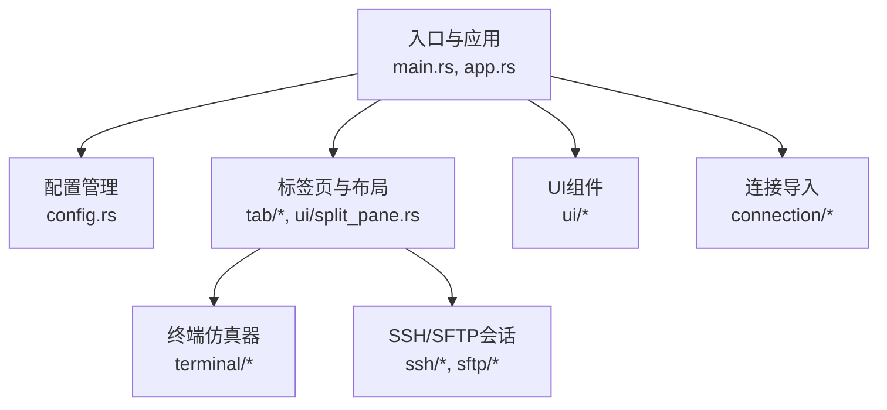
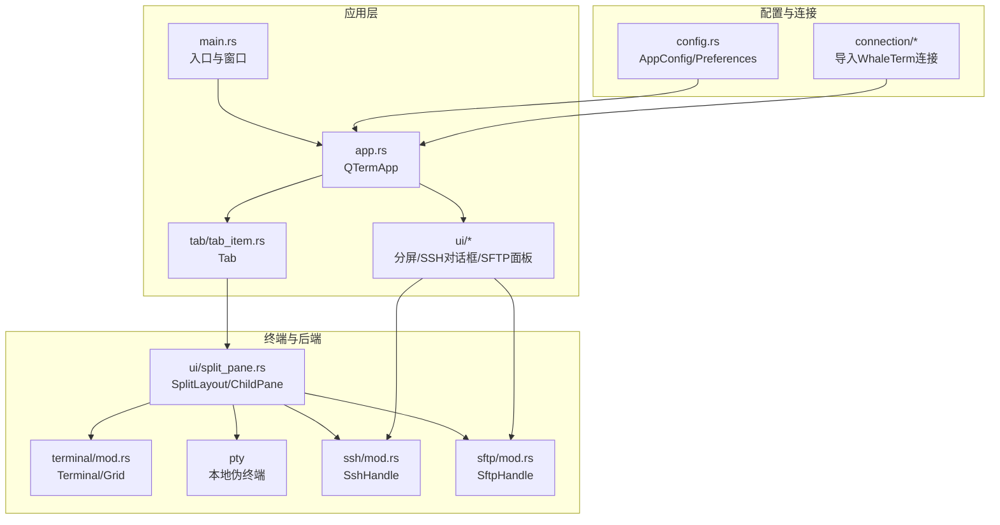
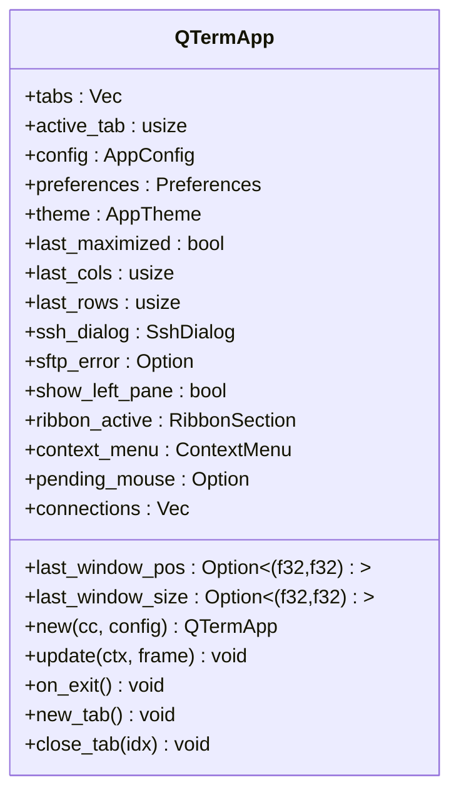
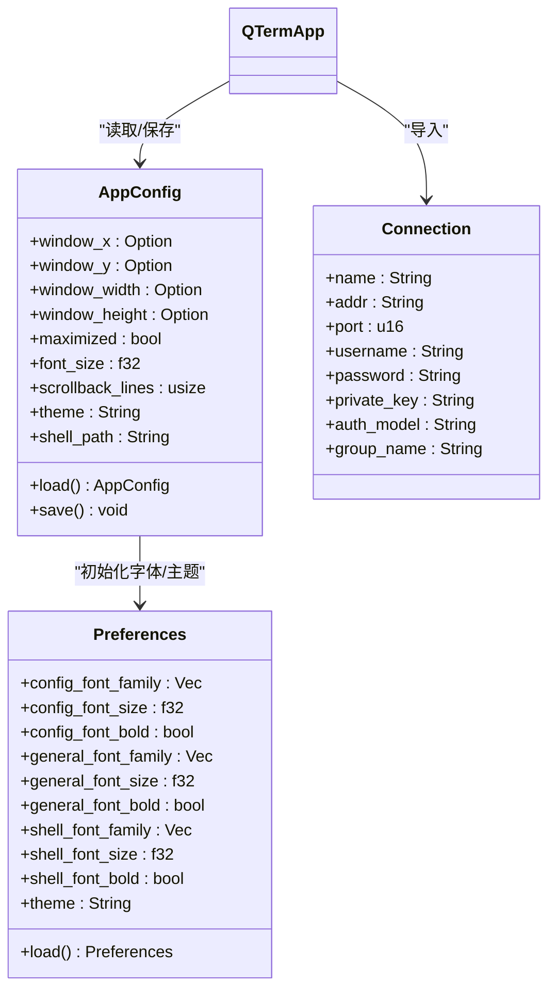
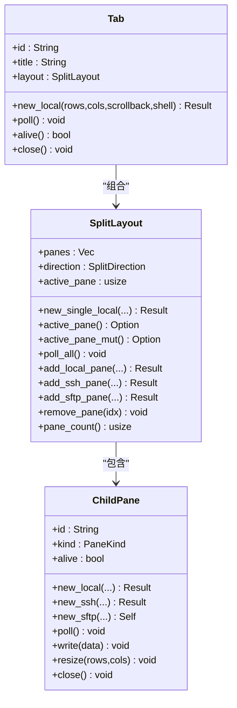
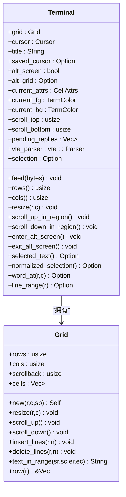
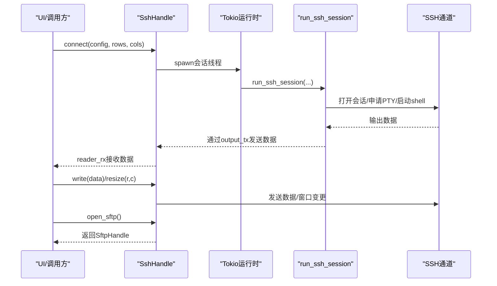
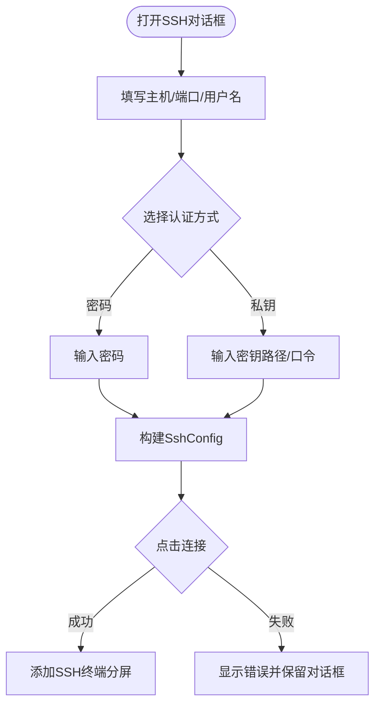
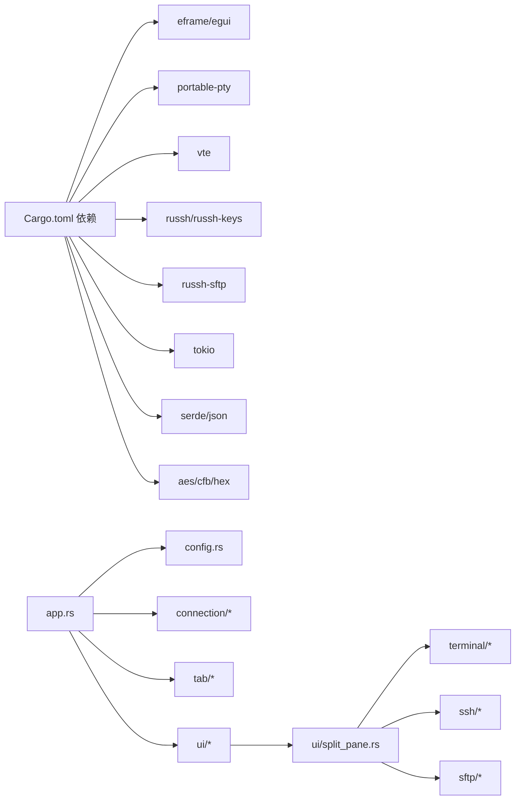
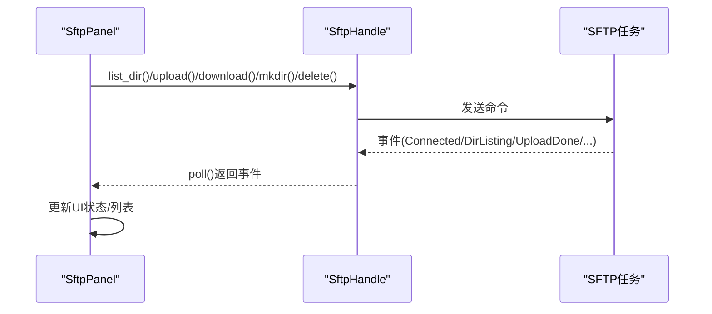

# API参考文档

<cite>
**本文档引用的文件**
- [main.rs](file://src/main.rs)
- [app.rs](file://src/app.rs)
- [config.rs](file://src/config.rs)
- [connection/mod.rs](file://src/connection/mod.rs)
- [connection/models.rs](file://src/connection/models.rs)
- [tab/mod.rs](file://src/tab/mod.rs)
- [tab/tab_item.rs](file://src/tab/tab_item.rs)
- [ui/split_pane.rs](file://src/ui/split_pane.rs)
- [ui/ssh_dialog.rs](file://src/ui/ssh_dialog.rs)
- [ui/sftp_panel.rs](file://src/ui/sftp_panel.rs)
- [terminal/mod.rs](file://src/terminal/mod.rs)
- [ssh/mod.rs](file://src/ssh/mod.rs)
- [ssh/client.rs](file://src/ssh/client.rs)
- [ssh/session.rs](file://src/ssh/session.rs)
- [sftp/mod.rs](file://src/sftp/mod.rs)
- [Cargo.toml](file://Cargo.toml)
</cite>

## 目录
1. [简介](#简介)
2. [项目结构](#项目结构)
3. [核心组件](#核心组件)
4. [架构总览](#架构总览)
5. [详细组件分析](#详细组件分析)
6. [依赖关系分析](#依赖关系分析)
7. [性能与异步API](#性能与异步api)
8. [事件系统与回调](#事件系统与回调)
9. [插件与扩展点](#插件与扩展点)
10. [API使用示例与常见用例](#api使用示例与常见用例)
11. [版本兼容性与迁移指南](#版本兼容性与迁移指南)
12. [故障排查](#故障排查)
13. [结论](#结论)

## 简介
本文件为QTerm项目的API参考文档，覆盖终端后端接口、UI组件接口、连接管理接口、事件系统与回调机制、异步API使用方法、以及未来可扩展的插件接口设计建议。文档以“渐进复杂度”方式组织，既适合快速查阅，也便于深入理解内部实现。

## 项目结构
QTerm采用模块化组织，核心模块包括：应用入口与主控制器、配置与连接导入、标签页与布局、终端仿真器、SSH/SFTP会话、UI组件（分屏、SFTP面板、SSH对话框）、主题与渲染等。

**图表来源**
- [main.rs:1-87](file://src/main.rs#L1-L87)
- [app.rs:15-196](file://src/app.rs#L15-L196)
- [config.rs:37-127](file://src/config.rs#L37-L127)
- [tab/tab_item.rs:3-40](file://src/tab/tab_item.rs#L3-L40)
- [ui/split_pane.rs:132-209](file://src/ui/split_pane.rs#L132-L209)
- [terminal/mod.rs:22-174](file://src/terminal/mod.rs#L22-L174)
- [ssh/mod.rs:52-118](file://src/ssh/mod.rs#L52-L118)
- [sftp/mod.rs:7-96](file://src/sftp/mod.rs#L7-L96)
- [ui/ssh_dialog.rs:10-132](file://src/ui/ssh_dialog.rs#L10-L132)
- [ui/sftp_panel.rs:11-151](file://src/ui/sftp_panel.rs#L11-L151)
- [connection/mod.rs:27-55](file://src/connection/mod.rs#L27-L55)

**章节来源**
- [main.rs:1-87](file://src/main.rs#L1-L87)
- [app.rs:15-196](file://src/app.rs#L15-L196)
- [config.rs:37-127](file://src/config.rs#L37-L127)

## 核心组件
- 应用主控：负责窗口初始化、全局快捷键、UI渲染、标签页与分屏管理、SSH/SFTP面板集成。
- 配置系统：支持运行时配置与WhaleTerm偏好导入。
- 连接管理：从WhaleTerm配置导入SSH连接，解密密码。
- 终端仿真器：基于vte解析器，维护网格、光标、选择与滚动区域。
- SSH/SFTP：基于russh/russh-sftp，提供异步会话、PTY分配、SFTP子系统。
- UI组件：分屏布局、SFTP文件面板、SSH连接对话框。

**章节来源**
- [app.rs:15-196](file://src/app.rs#L15-L196)
- [config.rs:37-127](file://src/config.rs#L37-L127)
- [connection/mod.rs:27-55](file://src/connection/mod.rs#L27-L55)
- [terminal/mod.rs:22-174](file://src/terminal/mod.rs#L22-L174)
- [ssh/mod.rs:52-118](file://src/ssh/mod.rs#L52-L118)
- [sftp/mod.rs:7-96](file://src/sftp/mod.rs#L7-L96)
- [ui/split_pane.rs:132-209](file://src/ui/split_pane.rs#L132-L209)
- [ui/sftp_panel.rs:11-151](file://src/ui/sftp_panel.rs#L11-L151)
- [ui/ssh_dialog.rs:10-132](file://src/ui/ssh_dialog.rs#L10-L132)

## 架构总览
下图展示了应用启动、渲染循环、标签页与分屏、终端后端、SSH/SFTP会话及UI组件之间的交互关系。

**图表来源**
- [main.rs:51-87](file://src/main.rs#L51-L87)
- [app.rs:61-196](file://src/app.rs#L61-L196)
- [tab/tab_item.rs:9-40](file://src/tab/tab_item.rs#L9-L40)
- [ui/split_pane.rs:132-209](file://src/ui/split_pane.rs#L132-L209)
- [terminal/mod.rs:22-174](file://src/terminal/mod.rs#L22-L174)
- [ssh/mod.rs:52-118](file://src/ssh/mod.rs#L52-L118)
- [sftp/mod.rs:7-96](file://src/sftp/mod.rs#L7-L96)
- [config.rs:37-127](file://src/config.rs#L37-L127)
- [connection/mod.rs:27-55](file://src/connection/mod.rs#L27-L55)

## 详细组件分析

### 应用主控与窗口生命周期（QTermApp）
- 角色：承载全局状态、渲染UI、处理输入与快捷键、管理标签页与分屏、协调SSH/SFTP面板。
- 关键职责：
  - 初始化字体与主题，加载配置与偏好。
  - 处理全局快捷键（新建/关闭标签、分屏、切换面板、字体缩放等）。
  - 渲染标题栏、左侧工具栏、中央终端区域、底部状态栏。
  - 在退出时保存窗口状态与配置。
- 公共接口要点：
  - 构造：new(cc, config) → 返回QTermApp实例。
  - 更新：update(ctx, frame) → 主渲染循环。
  - 退出：on_exit() → 保存配置并关闭资源。
  - 标签页操作：new_tab()、close_tab(idx)。
  - 分屏操作：add_local_pane/add_ssh_pane/add_sftp_pane/remove_pane。

**图表来源**
- [app.rs:15-196](file://src/app.rs#L15-L196)

**章节来源**
- [app.rs:61-196](file://src/app.rs#L61-L196)

### 配置与偏好（AppConfig/Preferences）
- AppConfig：窗口位置、尺寸、主题、字体大小、回滚行数、Shell路径等运行时配置；提供load/save。
- Preferences：从WhaleTerm preferences.json读取字体家族、大小、粗体、主题等；用于字体与主题初始化。
- 连接导入：load_connections()从WhaleTerm connections.json导入连接列表，并解密密码。

**图表来源**
- [config.rs:37-127](file://src/config.rs#L37-L127)
- [config.rs:209-281](file://src/config.rs#L209-L281)
- [connection/models.rs:29-41](file://src/connection/models.rs#L29-L41)
- [connection/mod.rs:27-55](file://src/connection/mod.rs#L27-L55)

**章节来源**
- [config.rs:37-127](file://src/config.rs#L37-L127)
- [config.rs:209-281](file://src/config.rs#L209-L281)
- [connection/mod.rs:27-55](file://src/connection/mod.rs#L27-L55)
- [connection/models.rs:29-41](file://src/connection/models.rs#L29-L41)

### 标签页与分屏布局（Tab/SplitLayout/ChildPane）
- Tab：封装SplitLayout，提供新建、轮询、存活检测、关闭等。
- SplitLayout：管理多个ChildPane，支持水平/垂直分割、活动面板切换、增删面板、轮询。
- ChildPane：终端或SFTP面板，统一处理后端（本地PTY或SSH），进行数据收发、重排、关闭。

**图表来源**
- [tab/tab_item.rs:3-40](file://src/tab/tab_item.rs#L3-L40)
- [ui/split_pane.rs:132-209](file://src/ui/split_pane.rs#L132-L209)

**章节来源**
- [tab/tab_item.rs:3-40](file://src/tab/tab_item.rs#L3-L40)
- [ui/split_pane.rs:132-209](file://src/ui/split_pane.rs#L132-L209)

### 终端仿真器（Terminal/Grid/Parser/Renderer）
- Terminal：维护Grid、光标、标题、选择、滚动区域、属性、VTE解析器与待回复队列。
- Grid：二维字符单元格，支持滚动、插入/删除行、按区域滚动。
- Parser：基于vte，将字节流解析为终端控制命令。
- Renderer：根据主题与网格渲染终端画面。

**图表来源**
- [terminal/mod.rs:22-174](file://src/terminal/mod.rs#L22-L174)

**章节来源**
- [terminal/mod.rs:22-174](file://src/terminal/mod.rs#L22-L174)

### SSH会话与SFTP（SshHandle/SftpHandle）
- SshHandle：封装SSH会话，提供连接、写入、调整窗口大小、轮询输出、断开、打开SFTP能力。
- SftpHandle：封装SFTP任务，通过命令通道发送指令，事件通道上报结果（连接、目录列表、上传/下载/创建/删除完成、错误）。
- 会话线程：在独立Tokio运行时中运行，主线程通过MPSC通道与会话通信。

**图表来源**
- [ssh/mod.rs:61-118](file://src/ssh/mod.rs#L61-L118)
- [ssh/session.rs:9-77](file://src/ssh/session.rs#L9-L77)

**章节来源**
- [ssh/mod.rs:52-118](file://src/ssh/mod.rs#L52-L118)
- [ssh/session.rs:9-77](file://src/ssh/session.rs#L9-L77)
- [sftp/mod.rs:39-96](file://src/sftp/mod.rs#L39-L96)

### UI组件（分屏、SFTP面板、SSH对话框）
- 分屏：SplitDirection/PaneKind/PaneBackend，支持本地PTY与SSH两种后端，统一Terminal渲染。
- SFTP面板：双栏本地/远程浏览，支持上传/下载/新建目录/删除，事件驱动更新UI。
- SSH对话框：表单收集主机、端口、用户名、认证方式（密码/私钥），生成SshConfig供分屏使用。

**图表来源**
- [ui/ssh_dialog.rs:10-132](file://src/ui/ssh_dialog.rs#L10-L132)
- [ui/split_pane.rs:173-182](file://src/ui/split_pane.rs#L173-L182)
- [ui/sftp_panel.rs:106-151](file://src/ui/sftp_panel.rs#L106-L151)

**章节来源**
- [ui/split_pane.rs:6-21](file://src/ui/split_pane.rs#L6-L21)
- [ui/ssh_dialog.rs:10-132](file://src/ui/ssh_dialog.rs#L10-L132)
- [ui/sftp_panel.rs:11-151](file://src/ui/sftp_panel.rs#L11-L151)

## 依赖关系分析
- 外部依赖：eframe/egui（UI框架）、portable-pty（本地PTY）、vte（VT解析）、russh/russh-keys/russh-sftp（SSH/SFTP）、tokio（异步运行时）、serde/serde_json（序列化）、aes/cfb-mode/cipher/hex（密码解密）。
- 内部模块耦合：app.rs依赖config/connection/tab/ui/terminal/ssh/sftp；ui/split_pane.rs依赖pty/ssh/sftp/terminal；terminal依赖cell/grid/parser/renderer。

**图表来源**
- [Cargo.toml:8-25](file://Cargo.toml#L8-L25)
- [app.rs:15-196](file://src/app.rs#L15-L196)
- [ui/split_pane.rs:1-5](file://src/ui/split_pane.rs#L1-L5)

**章节来源**
- [Cargo.toml:8-25](file://Cargo.toml#L8-L25)

## 性能与异步API
- 异步运行时：SSH会话在独立Tokio运行时中执行，避免阻塞UI线程。
- 通道模型：SshHandle使用MPSC通道接收/发送数据，SftpHandle使用MPSC命令通道与事件通道分离，降低锁竞争。
- 轮询策略：ChildPane::poll在每帧轮询后端输出，将数据注入Terminal，再由渲染器绘制。
- 资源管理：SshHandle/SftpHandle均提供alive标志位与disconnect/close方法，确保优雅退出。

**章节来源**
- [ssh/mod.rs:8-14](file://src/ssh/mod.rs#L8-L14)
- [ssh/mod.rs:61-118](file://src/ssh/mod.rs#L61-L118)
- [sftp/mod.rs:39-96](file://src/sftp/mod.rs#L39-L96)
- [ui/split_pane.rs:62-130](file://src/ui/split_pane.rs#L62-L130)

## 事件系统与回调
- SSH事件：SshHandle不直接暴露事件，但通过reader_rx接收远端输出，调用方在每帧轮询后端数据。
- SFTP事件：SftpHandle提供poll()返回事件向量，事件类型包括已连接、目录列表、上传/下载/创建/删除完成、错误。
- UI事件：egui输入事件在QTermApp.update中处理，触发动作如新建/关闭标签、分屏、切换面板等。

**图表来源**
- [sftp/mod.rs:60-103](file://src/sftp/mod.rs#L60-L103)
- [ui/sftp_panel.rs:46-104](file://src/ui/sftp_panel.rs#L46-L104)

**章节来源**
- [sftp/mod.rs:20-28](file://src/sftp/mod.rs#L20-L28)
- [ui/sftp_panel.rs:46-104](file://src/ui/sftp_panel.rs#L46-L104)

## 插件与扩展点
- 当前未发现内置插件系统或官方扩展点。建议的扩展方向：
  - 终端后端扩展：新增PaneBackend变体与对应渲染逻辑。
  - UI面板扩展：新增PaneKind分支与面板组件，接入SplitLayout。
  - 事件扩展：在SftpEvent/SshError基础上增加自定义事件类型。
  - 生命周期管理：为新面板/后端提供统一的初始化/轮询/关闭接口。
- 注册机制：可通过在QTermApp中新增侧边栏项与菜单项，引导用户选择扩展功能。

[本节为概念性内容，不直接分析具体文件，故无“章节来源”]

## API使用示例与常见用例
以下为常见用例的“路径式”示例，便于开发者定位实现位置与调用方式：

- 新建本地终端分屏
  - 调用路径：[ui/split_pane.rs:162-171](file://src/ui/split_pane.rs#L162-L171)
  - 参数：方向、行列数、回滚行数、Shell路径
  - 返回：Result

- 添加SSH分屏
  - 调用路径：[ui/split_pane.rs:173-182](file://src/ui/split_pane.rs#L173-L182)
  - 参数：SshConfig、方向、行列数、回滚行数
  - 返回：Result

- 打开SSH对话框并建立连接
  - 调用路径：[ui/ssh_dialog.rs:104-131](file://src/ui/ssh_dialog.rs#L104-L131)
  - 步骤：填写表单 → try_connect()构建SshConfig → 在QTermApp中使用该配置添加SSH分屏

- SFTP上传/下载
  - 调用路径：[ui/sftp_panel.rs:301-330](file://src/ui/sftp_panel.rs#L301-L330)
  - 步骤：选择本地文件 → 点击上传；或选择远程文件 → 点击下载
  - 事件：通过SftpHandle.poll()获取事件并更新状态

- 保存与恢复窗口状态
  - 调用路径：[app.rs:518-529](file://src/app.rs#L518-L529)、[config.rs:100-126](file://src/config.rs#L100-L126)
  - 步骤：on_exit()保存位置/尺寸/主题；启动时load()恢复

- 导入WhaleTerm连接
  - 调用路径：[connection/mod.rs:27-55](file://src/connection/mod.rs#L27-L55)
  - 步骤：load_connections()返回连接列表，解密密码后用于SSH登录

**章节来源**
- [ui/split_pane.rs:162-182](file://src/ui/split_pane.rs#L162-L182)
- [ui/ssh_dialog.rs:104-131](file://src/ui/ssh_dialog.rs#L104-L131)
- [ui/sftp_panel.rs:301-330](file://src/ui/sftp_panel.rs#L301-L330)
- [app.rs:518-529](file://src/app.rs#L518-L529)
- [config.rs:100-126](file://src/config.rs#L100-L126)
- [connection/mod.rs:27-55](file://src/connection/mod.rs#L27-L55)

## 版本兼容性与迁移指南
- 依赖版本：eframe/egui 0.29、tokio 1、russh 0.46、russh-sftp 2.3、vte 0.13、portable-pty 0.9。
- 迁移建议：
  - egui升级：注意egui 0.29的API变更，尤其是窗口/面板/布局相关接口。
  - tokio升级：保持与russh兼容的版本，避免运行时冲突。
  - vte升级：解析行为可能变化，需回归测试终端渲染与选择复制。
  - portable-pty升级：注意跨平台PTY行为差异，确保Windows/macOS/Linux一致。
- 配置文件格式：config.ini与preferences.json格式稳定，迁移时注意字段映射与默认值。

**章节来源**
- [Cargo.toml:8-25](file://Cargo.toml#L8-L25)

## 故障排查
- SSH连接失败
  - 检查SshError类型（连接/认证/通道），确认主机、端口、用户名与认证方式。
  - 参考路径：[ssh/client.rs:20-54](file://src/ssh/client.rs#L20-L54)、[ssh/mod.rs:32-48](file://src/ssh/mod.rs#L32-L48)
- SFTP操作异常
  - 通过SftpHandle.poll()获取错误事件，检查权限、路径与网络状况。
  - 参考路径：[sftp/mod.rs:142-205](file://src/sftp/mod.rs#L142-L205)、[ui/sftp_panel.rs:46-104](file://src/ui/sftp_panel.rs#L46-L104)
- 终端无输出或卡死
  - 确认ChildPane::poll正常轮询，检查reader_rx是否被消费。
  - 参考路径：[ui/split_pane.rs:62-97](file://src/ui/split_pane.rs#L62-L97)
- 配置无法保存/加载
  - 检查config.ini写入权限与路径，确认字段解析。
  - 参考路径：[config.rs:68-126](file://src/config.rs#L68-L126)

**章节来源**
- [ssh/client.rs:20-54](file://src/ssh/client.rs#L20-L54)
- [ssh/mod.rs:32-48](file://src/ssh/mod.rs#L32-L48)
- [sftp/mod.rs:142-205](file://src/sftp/mod.rs#L142-L205)
- [ui/sftp_panel.rs:46-104](file://src/ui/sftp_panel.rs#L46-L104)
- [ui/split_pane.rs:62-97](file://src/ui/split_pane.rs#L62-L97)
- [config.rs:68-126](file://src/config.rs#L68-L126)

## 结论
QTerm提供了清晰的模块化架构与稳定的API边界：应用主控负责UI与调度，终端仿真器专注渲染与解析，SSH/SFTP通过异步通道解耦，UI组件以事件驱动更新。现有API足以满足本地与远程终端、文件传输等核心场景；若需扩展，可在PaneBackend/PaneKind/SftpEvent等关键扩展点上平滑演进。