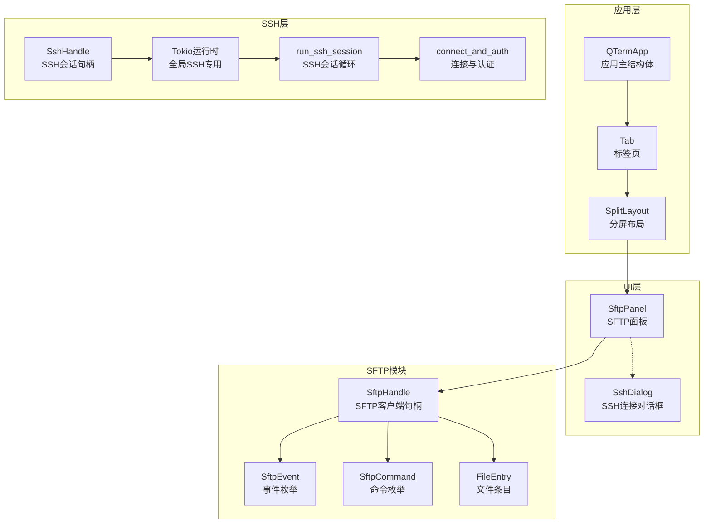
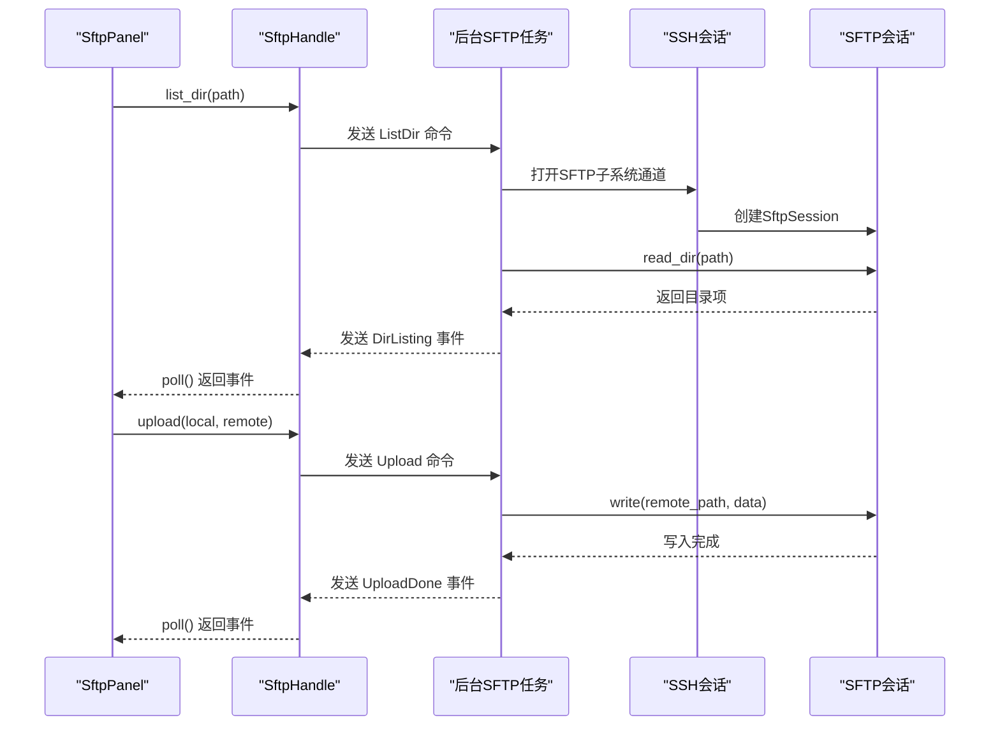

# SFTP面板API

<cite>
**本文档引用的文件**
- [sftp_panel.rs](file://src/ui/sftp_panel.rs)
- [mod.rs](file://src/sftp/mod.rs)
- [split_pane.rs](file://src/ui/split_pane.rs)
- [ssh_dialog.rs](file://src/ui/ssh_dialog.rs)
- [app.rs](file://src/app.rs)
- [ssh_session.rs](file://src/ssh/session.rs)
- [ssh_client.rs](file://src/ssh/client.rs)
- [ssh_mod.rs](file://src/ssh/mod.rs)
- [tab_item.rs](file://src/tab/tab_item.rs)
- [2026-05-30-phase3-sftp-design.md](file://docs/specs/2026-05-30-phase3-sftp-design.md)
</cite>

## 目录
1. [简介](#简介)
2. [项目结构](#项目结构)
3. [核心组件](#核心组件)
4. [架构总览](#架构总览)
5. [详细组件分析](#详细组件分析)
6. [依赖关系分析](#依赖关系分析)
7. [性能考量](#性能考量)
8. [故障排除指南](#故障排除指南)
9. [结论](#结论)
10. [附录](#附录)

## 简介
本文件为 QTerm 项目的 SFTP 面板组件提供详细的 API 参考文档。重点覆盖以下方面：
- SftpPanel 结构体的构造方法与初始化参数，包括 SFTP 连接句柄绑定与面板配置选项
- 文件浏览功能的 API：目录列表获取、文件信息查询、路径导航与权限检查方法
- 文件操作接口：上传、下载、删除、重命名等操作的 API 签名与参数说明
- 进度监控与状态反馈机制：传输进度回调、错误处理与状态同步接口
- 文件选择与批量操作：多选支持、操作队列与结果汇总方法
- 完整使用示例：展示如何实现文件管理功能
- 与 SFTP 模块的集成方式与数据流处理机制

## 项目结构
SFTP 面板位于 UI 层，通过 SFTP 模块与 SSH 会话进行通信。整体采用“UI 面板 + 异步后台任务 + 事件通道”的架构设计，确保 UI 的流畅性与异步操作的可靠性。



图表来源
- [app.rs:18-589](file://src/app.rs#L18-L589)
- [split_pane.rs:19-238](file://src/ui/split_pane.rs#L19-L238)
- [sftp_panel.rs:14-25](file://src/ui/sftp_panel.rs#L14-L25)
- [mod.rs:9-115](file://src/sftp/mod.rs#L9-L115)
- [ssh_mod.rs:55-136](file://src/ssh/mod.rs#L55-L136)
- [ssh_session.rs:11-90](file://src/ssh/session.rs#L11-L90)
- [ssh_client.rs:25-63](file://src/ssh/client.rs#L25-L63)

章节来源
- [app.rs:18-589](file://src/app.rs#L18-L589)
- [split_pane.rs:19-238](file://src/ui/split_pane.rs#L19-L238)
- [sftp_panel.rs:14-25](file://src/ui/sftp_panel.rs#L14-L25)
- [mod.rs:9-115](file://src/sftp/mod.rs#L9-L115)
- [ssh_mod.rs:55-136](file://src/ssh/mod.rs#L55-L136)
- [ssh_session.rs:11-90](file://src/ssh/session.rs#L11-L90)
- [ssh_client.rs:25-63](file://src/ssh/client.rs#L25-L63)

## 核心组件
本节对 SFTP 面板及其相关组件进行深入分析，涵盖数据结构、API 方法与行为特征。

- SftpPanel
  - 构造方法：new(SftpHandle) → 初始化本地路径为主目录，远程路径为根目录，刷新本地列表
  - 轮询方法：poll() → 轮询 SFTP 事件并更新面板状态（连接、目录列表、上传/下载/创建目录/删除完成、错误）
  - UI 显示：show(ui) → 双栏布局（本地/远程）、底部操作栏（上传/下载）、状态标签
  - 生命周期：is_alive()、close()
  - 文件浏览：本地/远程路径导航、双击进入子目录、刷新本地列表
  - 文件操作：do_upload()、do_download()

- SftpHandle
  - 构造：new(SharedSshHandle, &Runtime) → 启动后台 SFTP 任务，建立事件通道与命令通道
  - 轮询：poll() → 非阻塞从事件通道取出所有可用事件
  - 连接状态：is_alive()、disconnect()
  - 目录操作：list_dir(path)
  - 文件操作：upload(local, remote)、download(remote, local)、mkdir(path)、delete(path, is_dir)

- FileEntry
  - 字段：name、is_dir、size

- SftpEvent/SftpCommand
  - 事件：Connected、DirListing(Vec<FileEntry>)、UploadDone(Result<(), String>)、DownloadDone(Result<(), String>)、MkdirDone(Result<(), String>)、DeleteDone(Result<(), String>)、Error(String)
  - 命令：ListDir、Upload、Download、Mkdir、Delete、Disconnect

章节来源
- [sftp_panel.rs:27-162](file://src/ui/sftp_panel.rs#L27-L162)
- [mod.rs:46-115](file://src/sftp/mod.rs#L46-L115)
- [mod.rs:23-44](file://src/sftp/mod.rs#L23-L44)

## 架构总览
SFTP 面板通过 SftpHandle 与后台 SFTP 任务通信。后台任务基于 SSH 会话打开 SFTP 子系统，处理命令并将结果以事件形式返回。UI 通过轮询事件更新状态与列表，并触发文件操作。



图表来源
- [sftp_panel.rs:52-110](file://src/ui/sftp_panel.rs#L52-L110)
- [mod.rs:85-114](file://src/sftp/mod.rs#L85-L114)
- [mod.rs:119-167](file://src/sftp/mod.rs#L119-L167)
- [ssh_session.rs:21-46](file://src/ssh/session.rs#L21-L46)
- [ssh_client.rs:25-63](file://src/ssh/client.rs#L25-L63)

## 详细组件分析

### SftpPanel 结构体与API
SftpPanel 是 SFTP 面板的 UI 组件，负责双栏文件浏览、路径导航与文件操作触发。

- 构造方法
  - new(sftp: SftpHandle) → 初始化本地路径为主目录，远程路径为根目录，清空本地/远程条目，设置默认状态为“正在连接...”，connected=false，pending_list=false；随后刷新本地列表
  - 参数：SftpHandle（已绑定 SSH 会话的 SFTP 客户端句柄）
  - 返回：SftpPanel 实例

- 轮询方法
  - poll() → 轮询 SFTP 事件并更新内部状态
    - Connected：connected=true，status=“已连接”，pending_list=true，请求列出远程根目录
    - DirListing(entries)：更新 remote_entries，清除远程选中项，pending_list=false
    - UploadDone(result)：根据结果更新 status，并重新列出远程目录
    - DownloadDone(result)：根据结果更新 status，并刷新本地列表
    - MkdirDone(result)：根据结果更新 status，并重新列出远程目录
    - DeleteDone(result)：根据结果更新 status，并重新列出远程目录
    - Error(e)：若正在等待目录列表则停止等待，更新 status

- UI 显示
  - show(ui) → 双栏布局：左侧本地文件浏览器 + 右侧远程文件浏览器；底部操作栏包含上传/下载按钮与状态标签
  - 本地/远程路径显示：分别显示当前路径
  - 本地/远程列表：支持点击选择、双击进入子目录；目录优先排序

- 生命周期
  - is_alive() → 委托给 SftpHandle.is_alive()
  - close() → 委托给 SftpHandle.disconnect()

- 文件浏览
  - 本地：refresh_local() → 读取当前本地路径目录，过滤隐藏文件，排序（目录优先），更新本地条目与选中状态
  - 本地导航：navigate_local_into(name)、navigate_local_up()
  - 远程导航：navigate_remote_into(name)、navigate_remote_up() → 更新路径、清空选中、请求列出目录并标记 pending_list

- 文件操作
  - do_upload() → 若选中本地文件且为普通文件，拼接本地/远程路径，设置状态为“正在上传...”，调用 SftpHandle.upload
  - do_download() → 若选中远程文件且为普通文件，拼接远程/本地路径，设置状态为“正在下载...”，调用 SftpHandle.download

- 路径格式化工具
  - format_size(size) → 人类可读的文件大小格式（B/K/M/G）
  - format_local_path(dir, name) → 根据平台分隔符拼接本地路径
  - format_remote_path(dir, name) → 始终使用 / 拼接远程路径

章节来源
- [sftp_panel.rs:27-162](file://src/ui/sftp_panel.rs#L27-L162)
- [sftp_panel.rs:164-357](file://src/ui/sftp_panel.rs#L164-L357)
- [sftp_panel.rs:359-387](file://src/ui/sftp_panel.rs#L359-L387)

### SftpHandle 与事件/命令系统
SftpHandle 提供与后台 SFTP 任务通信的接口，采用命令-事件模式。

- 构造
  - new(ssh_handle: SharedSshHandle, rt: &Runtime) → 创建事件通道与命令通道，克隆 alive 标志，在 tokio 运行时上启动后台任务 sftp_task

- 轮询
  - poll() → 非阻塞从事件通道取出所有可用事件，返回 Vec<SftpEvent>

- 连接状态
  - is_alive() → 读取 alive 标志
  - disconnect() → 设置 alive=false，并发送 Disconnect 命令

- 目录与文件操作
  - list_dir(path: &str) → 发送 ListDir 命令
  - upload(local_path: String, remote_path: String) → 发送 Upload 命令
  - download(remote_path: String, local_path: String) → 发送 Download 命令
  - mkdir(path: String) → 发送 Mkdir 命令
  - delete(path: String, is_dir: bool) → 发送 Delete 命令

- 后台任务
  - sftp_task(ssh_handle, events_tx, cmd_rx, alive) → 打开 SFTP 子系统通道，创建 SftpSession，发送 Connected 事件，循环处理命令并发送相应事件
  - handle_command(sftp, events_tx, cmd) → 根据命令执行具体操作并发送事件

章节来源
- [mod.rs:46-115](file://src/sftp/mod.rs#L46-L115)
- [mod.rs:117-167](file://src/sftp/mod.rs#L117-L167)
- [mod.rs:169-238](file://src/sftp/mod.rs#L169-L238)

### 与 SSH 模块的集成
SFTP 面板通过 SSH 会话复用共享句柄，实现 SFTP 子系统的打开与会话管理。

- SSH 会话
  - run_ssh_session(config, rows, cols, output_tx, writer_rx, resize_rx, alive, handle_out) → 建立连接与认证，打开通道并请求 PTY/Shell，循环处理输出、输入与大小调整，将 russh 客户端句柄通过 oneshot 通道传递给主线程
  - connect_and_auth(config) → 支持密码与私钥认证

- SSH 句柄
  - SshHandle.connect(config, rows, cols) → 启动后台线程运行 SSH 会话，等待并接收共享句柄，暴露 reader/writer/resize 通道与 alive 标志
  - open_sftp() → 基于共享句柄创建 SftpHandle

章节来源
- [ssh_session.rs:11-90](file://src/ssh/session.rs#L11-L90)
- [ssh_client.rs:25-63](file://src/ssh/client.rs#L25-L63)
- [ssh_mod.rs:68-136](file://src/ssh/mod.rs#L68-L136)

### UI 集成与使用流程
SFTP 面板作为分屏布局的一种面板类型，嵌入到标签页中，由应用主循环驱动。

- 分屏布局
  - SplitLayout.add_sftp_pane(sftp, direction) → 创建 SFTP 面板并加入布局
  - ChildPane.poll() → 轮询 SFTP 面板事件，更新存活状态

- 应用主循环
  - QTermApp.update() → 轮询标签页，渲染中央面板，根据 PaneKind 渲染 SFTP 面板并调用 panel.show(ui)
  - 快捷键 F 打开 SFTP 面板（Action::OpenSftp）

- SSH 对话框
  - SshDialog 打开 SSH 连接后，将配置传递给标签页，创建 SSH 终端面板；同样可扩展为创建 SFTP 面板

章节来源
- [split_pane.rs:60-68](file://src/ui/split_pane.rs#L60-L68)
- [split_pane.rs:105-111](file://src/ui/split_pane.rs#L105-L111)
- [app.rs:380-381](file://src/app.rs#L380-L381)
- [app.rs:473-556](file://src/app.rs#L473-L556)
- [ssh_dialog.rs](file://src/ui/ssh_dialog.rs)

## 依赖关系分析

```mermaid
classDiagram
class SftpPanel {
+new(sftp : SftpHandle) SftpPanel
+poll() void
+show(ui) void
+is_alive() bool
+close() void
-refresh_local() void
-navigate_local_into(name) void
-navigate_local_up() void
-navigate_remote_into(name) void
-navigate_remote_up() void
-do_upload() void
-do_download() void
}
class SftpHandle {
+new(ssh_handle, rt) Result~Self~
+poll() Vec~SftpEvent~
+is_alive() bool
+disconnect() void
+list_dir(path) void
+upload(local, remote) void
+download(remote, local) void
+mkdir(path) void
+delete(path, is_dir) void
}
class FileEntry {
+String name
+bool is_dir
+u64 size
}
class SftpEvent {
<<enum>>
+Connected
+DirListing(Vec~FileEntry~)
+UploadDone(Result~(), String~)
+DownloadDone(Result~(), String~)
+MkdirDone(Result~(), String~)
+DeleteDone(Result~(), String~)
+Error(String)
}
class SftpCommand {
<<enum>>
+ListDir(String)
+Upload { local_path : String, remote_path : String }
+Download { remote_path : String, local_path : String }
+Mkdir(String)
+Delete { path : String, is_dir : bool }
+Disconnect
}
SftpPanel --> SftpHandle : "使用"
SftpHandle --> SftpEvent : "发送"
SftpHandle --> SftpCommand : "接收"
SftpPanel --> FileEntry : "显示"
```

图表来源
- [sftp_panel.rs:14-25](file://src/ui/sftp_panel.rs#L14-L25)
- [mod.rs:9-115](file://src/sftp/mod.rs#L9-L115)
- [mod.rs:15-44](file://src/sftp/mod.rs#L15-L44)

章节来源
- [sftp_panel.rs:14-25](file://src/ui/sftp_panel.rs#L14-L25)
- [mod.rs:9-115](file://src/sftp/mod.rs#L9-L115)
- [mod.rs:15-44](file://src/sftp/mod.rs#L15-L44)

## 性能考量
- 异步事件驱动：SFTP 操作通过命令-事件模式异步执行，避免阻塞 UI 线程
- 非阻塞轮询：SftpHandle.poll() 采用 try_recv 非阻塞方式，减少 UI 卡顿
- 本地列表缓存：本地文件列表在刷新时一次性构建并排序，避免频繁系统调用
- 路径格式化：format_local_path/format_remote_path 采用简单字符串拼接，开销极低
- 并发模型：后台任务在独立 tokio 运行时上执行，与 UI 线程隔离

## 故障排除指南
- 连接失败
  - 现象：状态显示错误信息，面板不可用
  - 排查：检查 SSH 连接配置、认证方式（密码/私钥）、网络连通性
  - 处理：通过 SSH 对话框重新连接，或检查 SftpEvent::Error 的具体错误内容

- 目录列表异常
  - 现象：远程目录为空或长时间处于 pending_list
  - 排查：确认远程路径存在且有读权限；检查 SftpEvent::Error
  - 处理：重试导航到父目录或根目录，再次请求 list_dir

- 上传/下载失败
  - 现象：状态显示“上传失败”或“下载失败”
  - 排查：检查本地/远程路径权限、磁盘空间、网络稳定性
  - 处理：修正路径或权限，重试操作

- 面板不响应
  - 现象：点击无反应或 UI 卡死
  - 排查：确认 UI 主循环正常调用 panel.poll() 与 panel.show(ui)
  - 处理：检查应用主循环与分屏布局的轮询逻辑

章节来源
- [sftp_panel.rs:52-110](file://src/ui/sftp_panel.rs#L52-L110)
- [mod.rs:175-238](file://src/sftp/mod.rs#L175-L238)

## 结论
SFTP 面板通过清晰的 API 设计与事件驱动架构，实现了本地与远程文件的高效浏览与操作。其与 SSH 模块的深度集成确保了连接复用与会话稳定性，同时 UI 的非阻塞轮询保证了良好的用户体验。未来可在现有基础上扩展批量操作、传输进度回调与更丰富的权限检查能力。

## 附录

### API 参考速查表

- SftpPanel
  - new(sftp: SftpHandle) → 创建并初始化面板
  - poll() → 轮询事件并更新状态
  - show(ui) → 渲染双栏面板与操作栏
  - is_alive() → 检查面板是否存活
  - close() → 关闭面板并断开连接

- SftpHandle
  - new(ssh_handle, rt) → 创建 SFTP 客户端句柄
  - poll() → 获取可用事件
  - is_alive() → 检查连接存活
  - disconnect() → 断开连接
  - list_dir(path) → 列出目录
  - upload(local, remote) → 上传文件
  - download(remote, local) → 下载文件
  - mkdir(path) → 创建目录
  - delete(path, is_dir) → 删除文件/目录

- SftpEvent/SftpCommand
  - 事件：Connected、DirListing、UploadDone、DownloadDone、MkdirDone、DeleteDone、Error
  - 命令：ListDir、Upload、Download、Mkdir、Delete、Disconnect

- FileEntry
  - 字段：name、is_dir、size

章节来源
- [sftp_panel.rs:27-162](file://src/ui/sftp_panel.rs#L27-L162)
- [mod.rs:46-115](file://src/sftp/mod.rs#L46-L115)
- [mod.rs:23-44](file://src/sftp/mod.rs#L23-L44)

### 使用示例（步骤说明）
- 步骤1：通过 SSH 对话框建立 SSH 连接并获取共享句柄
- 步骤2：基于共享句柄创建 SftpHandle
- 步骤3：在标签页的分屏布局中添加 SFTP 面板
- 步骤4：在应用主循环中调用 panel.poll() 与 panel.show(ui)
- 步骤5：用户在面板中选择文件并点击上传/下载，面板通过 SftpHandle 触发相应命令
- 步骤6：轮询事件更新状态与列表，完成文件管理

章节来源
- [ssh_mod.rs:133-135](file://src/ssh/mod.rs#L133-L135)
- [split_pane.rs:211-221](file://src/ui/split_pane.rs#L211-L221)
- [app.rs:473-556](file://src/app.rs#L473-L556)