# SSH对话框API

<cite>
**本文档引用的文件**
- [ssh_dialog.rs](file://src/ui/ssh_dialog.rs)
- [mod.rs](file://src/ssh/mod.rs)
- [client.rs](file://src/ssh/client.rs)
- [session.rs](file://src/ssh/session.rs)
- [app.rs](file://src/app.rs)
- [split_pane.rs](file://src/ui/split_pane.rs)
- [models.rs](file://src/connection/models.rs)
- [config.rs](file://src/config.rs)
</cite>

## 目录
1. [简介](#简介)
2. [项目结构](#项目结构)
3. [核心组件](#核心组件)
4. [架构概览](#架构概览)
5. [详细组件分析](#详细组件分析)
6. [依赖关系分析](#依赖关系分析)
7. [性能考虑](#性能考虑)
8. [故障排除指南](#故障排除指南)
9. [结论](#结论)
10. [附录](#附录)

## 简介
SSH对话框是QTerm项目中的一个重要UI组件，用于收集用户的SSH连接参数并建立安全的远程连接。该组件提供了直观的表单界面，支持密码认证和私钥认证两种认证方式，并与SSH客户端模块深度集成，实现了完整的连接生命周期管理。

## 项目结构
SSH对话框组件位于UI层，与SSH客户端模块紧密协作，形成完整的SSH连接解决方案：

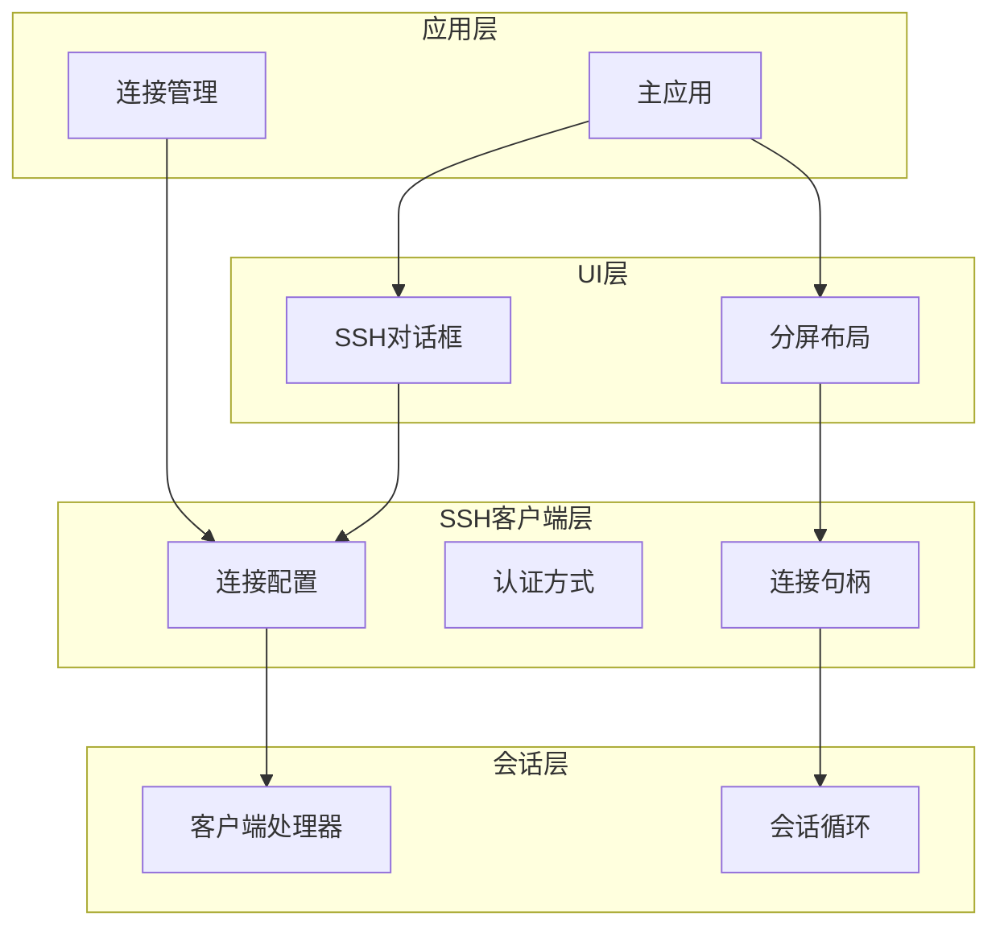

**图表来源**
- [ssh_dialog.rs:1-147](file://src/ui/ssh_dialog.rs#L1-L147)
- [mod.rs:18-66](file://src/ssh/mod.rs#L18-L66)
- [app.rs:29-96](file://src/app.rs#L29-L96)

**章节来源**
- [ssh_dialog.rs:1-147](file://src/ui/ssh_dialog.rs#L1-L147)
- [mod.rs:1-136](file://src/ssh/mod.rs#L1-L136)
- [app.rs:16-105](file://src/app.rs#L16-L105)

## 核心组件
SSH对话框API提供了完整的SSH连接管理能力，包括初始化、配置、验证和连接建立等功能。

### 主要API接口

#### SSH对话框类 (SshDialog)
- **构造函数**: `new()` - 创建新的SSH对话框实例
- **显示方法**: `show(ctx)` - 在egui上下文中显示对话框
- **连接方法**: `try_connect()` - 验证输入并尝试建立连接

#### SSH配置结构 (SshConfig)
- **主机地址**: `host: String` - 远程服务器地址
- **端口号**: `port: u16` - SSH服务端口，默认22
- **用户名**: `username: String` - 登录用户名
- **认证方式**: `auth: SshAuth` - 认证配置
- **超时时间**: `timeout_secs: u32` - 连接超时秒数

#### 认证方式枚举 (SshAuth)
- **密码认证**: `Password(String)` - 使用密码进行认证
- **私钥认证**: `PrivateKey { path: String, passphrase: Option<String> }` - 使用私钥文件认证

**章节来源**
- [ssh_dialog.rs:13-41](file://src/ui/ssh_dialog.rs#L13-L41)
- [mod.rs:19-33](file://src/ssh/mod.rs#L19-L33)

## 架构概览
SSH对话框采用模块化设计，通过清晰的职责分离实现了高内聚低耦合的架构：

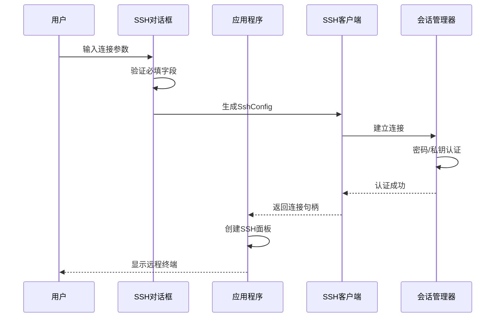

**图表来源**
- [ssh_dialog.rs:117-146](file://src/ui/ssh_dialog.rs#L117-L146)
- [app.rs:562-570](file://src/app.rs#L562-L570)
- [session.rs:11-90](file://src/ssh/session.rs#L11-L90)

## 详细组件分析

### SSH对话框类分析

#### 数据结构设计
SSH对话框使用结构化数据存储用户输入，确保类型安全和数据完整性：

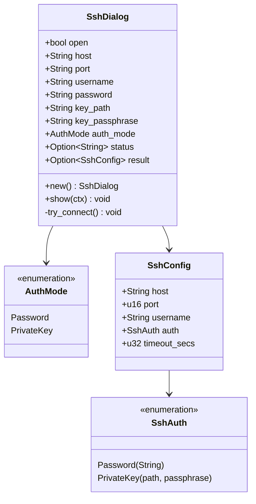

**图表来源**
- [ssh_dialog.rs:13-24](file://src/ui/ssh_dialog.rs#L13-L24)
- [mod.rs:19-33](file://src/ssh/mod.rs#L19-L33)

#### 生命周期管理
SSH对话框实现了完整的生命周期管理，包括显示、隐藏、取消和确认操作：

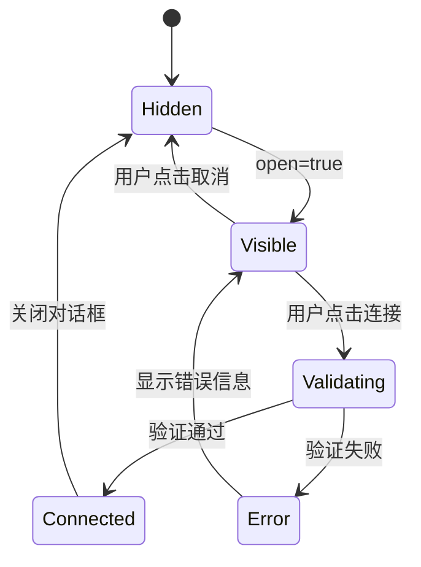

**图表来源**
- [ssh_dialog.rs:45-113](file://src/ui/ssh_dialog.rs#L45-L113)
- [ssh_dialog.rs:117-146](file://src/ui/ssh_dialog.rs#L117-L146)

#### 表单验证机制
对话框实现了多层次的表单验证，确保连接参数的有效性：

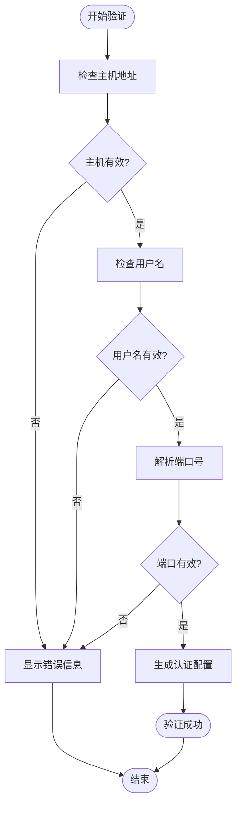

**图表来源**
- [ssh_dialog.rs:117-123](file://src/ui/ssh_dialog.rs#L117-L123)
- [ssh_dialog.rs:125-135](file://src/ui/ssh_dialog.rs#L125-L135)

**章节来源**
- [ssh_dialog.rs:26-146](file://src/ui/ssh_dialog.rs#L26-L146)

### SSH客户端集成

#### 连接建立流程
SSH客户端模块提供了完整的连接建立和认证功能：

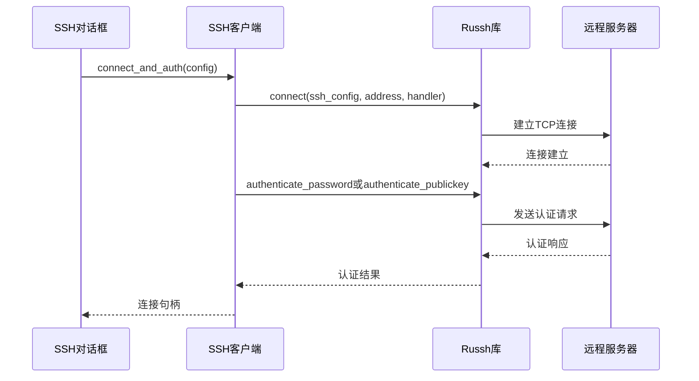

**图表来源**
- [client.rs:25-63](file://src/ssh/client.rs#L25-L63)
- [session.rs:21-26](file://src/ssh/session.rs#L21-L26)

#### 错误处理机制
SSH客户端实现了完善的错误处理，能够区分不同类型的连接错误：

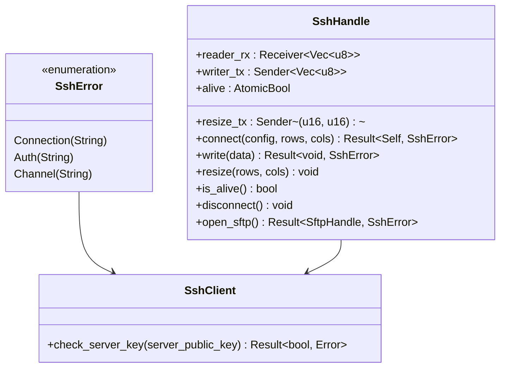

**图表来源**
- [mod.rs:36-66](file://src/ssh/mod.rs#L36-L66)
- [client.rs:6-21](file://src/ssh/client.rs#L6-L21)

**章节来源**
- [client.rs:25-63](file://src/ssh/client.rs#L25-L63)
- [session.rs:11-90](file://src/ssh/session.rs#L11-L90)
- [mod.rs:36-136](file://src/ssh/mod.rs#L36-L136)

### 应用程序集成

#### 事件处理机制
应用程序通过事件驱动的方式处理SSH对话框的交互：

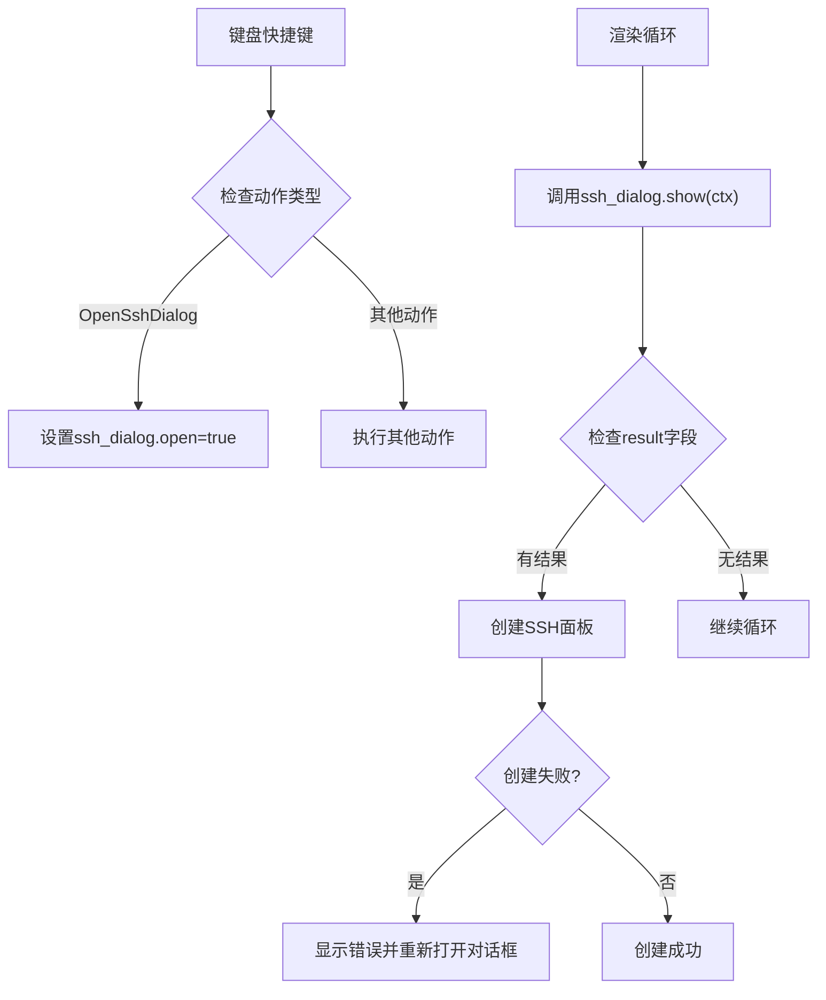

**图表来源**
- [app.rs:301-393](file://src/app.rs#L301-L393)
- [app.rs:559-570](file://src/app.rs#L559-L570)

#### 面板管理集成
SSH对话框的结果通过应用程序集成到面板管理系统中：

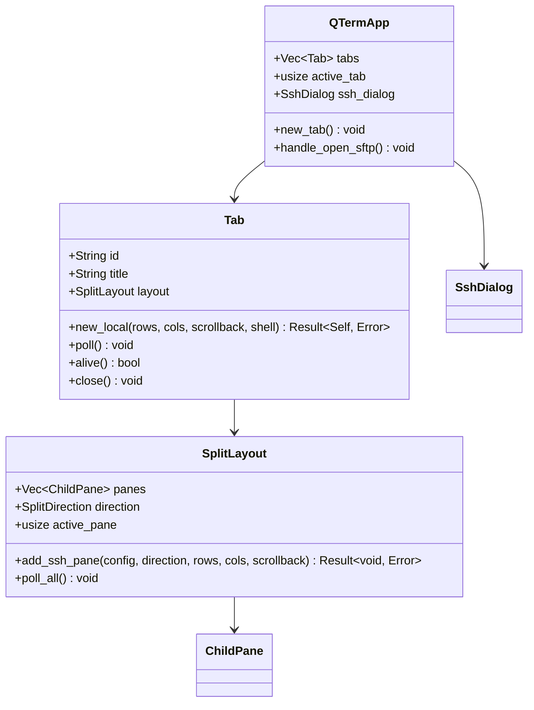

**图表来源**
- [app.rs:18-48](file://src/app.rs#L18-L48)
- [tab_item.rs:3-48](file://src/tab/tab_item.rs#L3-L48)
- [split_pane.rs:151-238](file://src/ui/split_pane.rs#L151-L238)

**章节来源**
- [app.rs:284-575](file://src/app.rs#L284-L575)
- [tab_item.rs:11-48](file://src/tab/tab_item.rs#L11-L48)
- [split_pane.rs:151-238](file://src/ui/split_pane.rs#L151-L238)

## 依赖关系分析

### 组件耦合度
SSH对话框组件展现了良好的内聚性和较低的耦合度：

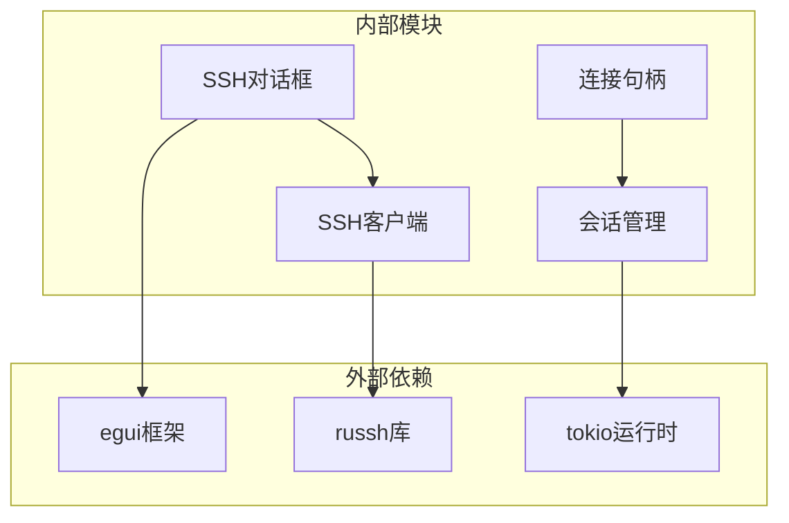

**图表来源**
- [ssh_dialog.rs:1](file://src/ui/ssh_dialog.rs#L1)
- [client.rs:1](file://src/ssh/client.rs#L1)
- [session.rs:1](file://src/ssh/session.rs#L1)

### 数据流分析
SSH对话框的数据流体现了清晰的单向数据传递原则：

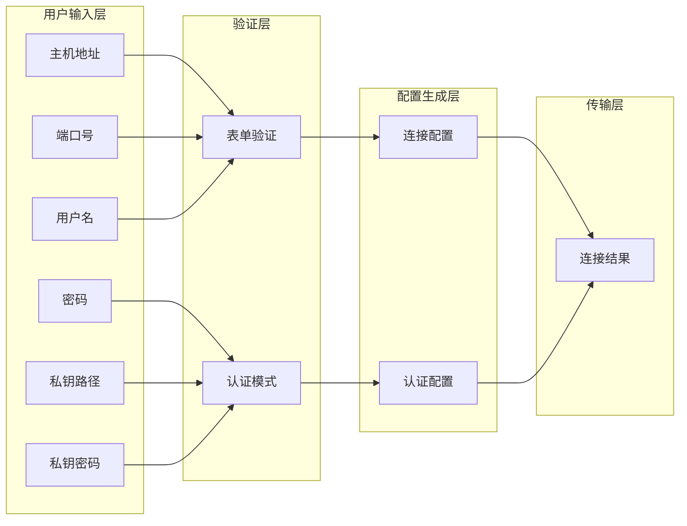

**图表来源**
- [ssh_dialog.rs:55-94](file://src/ui/ssh_dialog.rs#L55-L94)
- [ssh_dialog.rs:117-146](file://src/ui/ssh_dialog.rs#L117-L146)

**章节来源**
- [ssh_dialog.rs:1-147](file://src/ui/ssh_dialog.rs#L1-L147)
- [mod.rs:1-136](file://src/ssh/mod.rs#L1-L136)

## 性能考虑
SSH对话框组件在设计时充分考虑了性能优化和资源管理：

### 并发处理
- **异步连接**: 使用Tokio运行时处理SSH连接的异步操作
- **非阻塞I/O**: 通过消息通道实现非阻塞的数据传输
- **连接复用**: 共享SSH客户端句柄以减少资源消耗

### 内存管理
- **零拷贝设计**: 尽可能使用引用而非所有权转移
- **智能指针**: 使用Arc和Mutex实现安全的共享状态管理
- **生命周期控制**: 严格的生命周期管理防止内存泄漏

### 资源优化
- **连接池**: 复用SSH连接句柄支持多子系统（如SFTP）
- **延迟初始化**: 懒加载Tokio运行时避免不必要的资源占用
- **错误恢复**: 完善的错误处理机制确保资源正确释放

## 故障排除指南

### 常见问题诊断

#### 连接失败问题
当SSH连接建立失败时，系统会返回详细的错误信息：

1. **网络连接问题**: 检查主机地址和端口配置
2. **认证失败**: 验证用户名和密码或私钥文件路径
3. **超时问题**: 调整timeout_secs参数值
4. **服务器密钥**: 检查服务器公钥验证配置

#### 面板创建失败
如果SSH面板创建失败，通常是由于以下原因：

1. **面板数量限制**: 系统限制最多6个面板同时存在
2. **终端尺寸问题**: 检查终端行列数配置
3. **资源不足**: 确保有足够的系统资源

**章节来源**
- [split_pane.rs:199-209](file://src/ui/split_pane.rs#L199-L209)
- [session.rs:84-89](file://src/ssh/session.rs#L84-L89)

### 调试技巧
- **启用详细日志**: 在开发环境中启用russh的详细日志输出
- **检查网络连接**: 使用ping和telnet测试基本连通性
- **验证认证凭据**: 确认密码或私钥文件的正确性
- **监控资源使用**: 观察CPU和内存使用情况

## 结论
SSH对话框组件为QTerm项目提供了完整的SSH连接解决方案。通过精心设计的架构和完善的错误处理机制，该组件实现了用户友好的连接体验和可靠的连接管理。组件的模块化设计使其易于维护和扩展，同时保持了良好的性能表现。

未来可以考虑的功能增强包括：
- 支持更多认证方式（如公钥认证的高级选项）
- 增强连接历史管理和预设配置功能
- 添加连接状态的实时监控和通知
- 支持代理和隧道连接

## 附录

### API使用示例

#### 基本使用流程
```rust
// 1. 创建SSH对话框实例
let mut ssh_dialog = SshDialog::new();

// 2. 在应用循环中显示对话框
ssh_dialog.show(&ctx);

// 3. 处理连接结果
if let Some(config) = ssh_dialog.result.take() {
    // 创建SSH面板
    // ... 处理连接结果
}
```

#### 高级配置示例
```rust
// 自定义连接参数
let config = SshConfig {
    host: "example.com".to_string(),
    port: 2222,
    username: "user".to_string(),
    auth: SshAuth::Password("password".to_string()),
    timeout_secs: 10,
};
```

### 集成最佳实践
- **错误处理**: 始终检查并处理SSH连接错误
- **资源管理**: 正确关闭SSH连接和相关资源
- **用户体验**: 提供清晰的进度指示和错误信息
- **安全性**: 确保敏感信息（如密码）的安全存储和传输