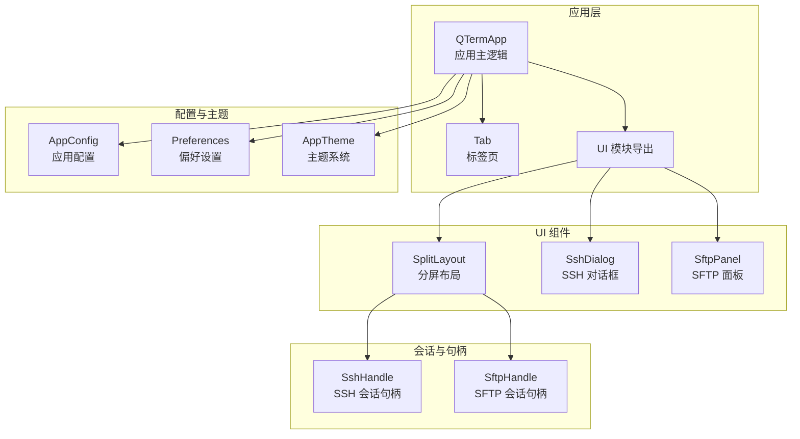
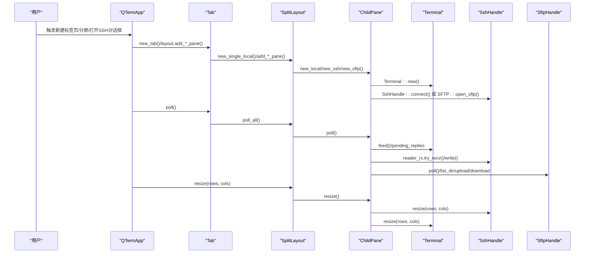
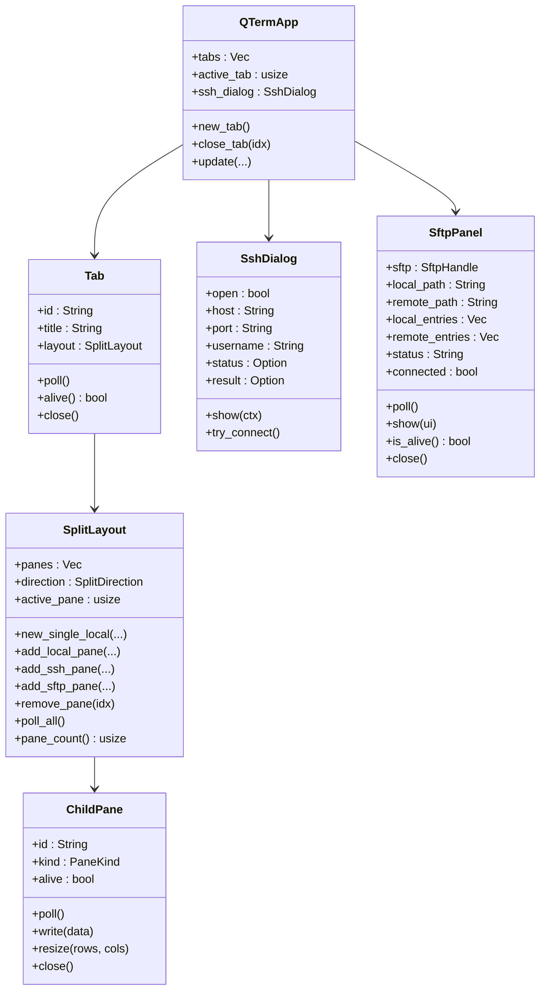

# UI组件API

<cite>
**本文引用的文件**
- [src/ui/mod.rs](file://src/ui/mod.rs)
- [src/ui/split_pane.rs](file://src/ui/split_pane.rs)
- [src/ui/ssh_dialog.rs](file://src/ui/ssh_dialog.rs)
- [src/ui/sftp_panel.rs](file://src/ui/sftp_panel.rs)
- [src/tab/mod.rs](file://src/tab/mod.rs)
- [src/tab/tab_item.rs](file://src/tab/tab_item.rs)
- [src/app.rs](file://src/app.rs)
- [src/ssh/mod.rs](file://src/ssh/mod.rs)
- [src/sftp/mod.rs](file://src/sftp/mod.rs)
- [src/connection/mod.rs](file://src/connection/mod.rs)
- [src/connection/models.rs](file://src/connection/models.rs)
- [src/theme/mod.rs](file://src/theme/mod.rs)
- [src/config.rs](file://src/config.rs)
- [src/main.rs](file://src/main.rs)
</cite>

## 目录
1. [简介](#简介)
2. [项目结构](#项目结构)
3. [核心组件](#核心组件)
4. [架构总览](#架构总览)
5. [详细组件分析](#详细组件分析)
6. [依赖关系分析](#依赖关系分析)
7. [性能考量](#性能考量)
8. [故障排查指南](#故障排查指南)
9. [结论](#结论)
10. [附录](#附录)

## 简介
本文件为 QTerm 项目的 UI 组件 API 参考文档，聚焦以下 UI 组件：
- 分屏布局组件：支持本地终端、SSH 终端与 SFTP 面板的组合布局，提供面板添加、删除、调整大小与导航方法。
- SSH 对话框组件：提供配置验证、连接建立与错误处理接口。
- SFTP 面板组件：提供文件列表管理、操作按钮与进度反馈接口。
- 标签页组件：提供生命周期管理（创建、关闭、状态同步）方法。
同时，文档涵盖组件属性定义、事件处理机制、样式定制选项、组件间通信与数据绑定方法，并给出完整的使用示例与响应式设计及主题适配机制说明。

## 项目结构
QTerm 采用模块化组织，UI 组件位于 src/ui 目录，标签页管理位于 src/tab，应用主逻辑位于 src/app.rs，SSH/SFTP 会话与句柄位于 src/ssh 与 src/sftp，配置与主题位于 src/config.rs 与 src/theme/mod.rs，连接导入位于 src/connection。

图表来源
- [src/app.rs:18-36](file://src/app.rs#L18-L36)
- [src/ui/mod.rs:1-4](file://src/ui/mod.rs#L1-L4)
- [src/ui/split_pane.rs:132-136](file://src/ui/split_pane.rs#L132-L136)
- [src/ui/ssh_dialog.rs:10-21](file://src/ui/ssh_dialog.rs#L10-L21)
- [src/ui/sftp_panel.rs:11-22](file://src/ui/sftp_panel.rs#L11-L22)
- [src/ssh/mod.rs:60-66](file://src/ssh/mod.rs#L60-L66)
- [src/sftp/mod.rs:9-13](file://src/sftp/mod.rs#L9-L13)
- [src/config.rs:40-50](file://src/config.rs#L40-L50)
- [src/theme/mod.rs:13-18](file://src/theme/mod.rs#L13-L18)

章节来源
- [src/ui/mod.rs:1-4](file://src/ui/mod.rs#L1-L4)
- [src/app.rs:18-36](file://src/app.rs#L18-L36)

## 核心组件
- 分屏布局组件：SplitLayout 与 ChildPane，负责多面板的创建、轮询、写入、调整大小与关闭。
- SSH 对话框组件：SshDialog，负责表单输入、认证模式切换、连接尝试与错误状态反馈。
- SFTP 面板组件：SftpPanel，负责本地/远程文件浏览、上传/下载、目录导航与事件驱动的状态更新。
- 标签页组件：Tab，负责单标签页内的分屏布局管理与标题同步。

章节来源
- [src/ui/split_pane.rs:132-209](file://src/ui/split_pane.rs#L132-L209)
- [src/ui/ssh_dialog.rs:10-132](file://src/ui/ssh_dialog.rs#L10-L132)
- [src/ui/sftp_panel.rs:11-358](file://src/ui/sftp_panel.rs#L11-L358)
- [src/tab/tab_item.rs:5-48](file://src/tab/tab_item.rs#L5-L48)

## 架构总览
UI 组件通过应用主逻辑进行编排，应用主逻辑负责：
- 标签页生命周期管理（创建、轮询、关闭）。
- 快捷键触发分屏、切换面板、打开 SSH 对话框与 SFTP。
- 响应窗口尺寸变化，动态调整面板尺寸并调用面板的 resize。
- 渲染标题栏、左侧功能区、中央终端区域与底部状态栏。
- 与 SSH/SFTP 句柄进行数据通道与事件通道交互。

图表来源
- [src/app.rs:284-575](file://src/app.rs#L284-L575)
- [src/tab/tab_item.rs:25-35](file://src/tab/tab_item.rs#L25-L35)
- [src/ui/split_pane.rs:62-130](file://src/ui/split_pane.rs#L62-L130)
- [src/ui/split_pane.rs:156-208](file://src/ui/split_pane.rs#L156-L208)
- [src/ssh/mod.rs:68-136](file://src/ssh/mod.rs#L68-L136)
- [src/sftp/mod.rs:46-115](file://src/sftp/mod.rs#L46-L115)

## 详细组件分析

### 分屏布局组件 API
- 组件角色
  - SplitLayout：管理多个 ChildPane，维护活动面板索引与分屏方向，提供面板增删与轮询。
  - ChildPane：封装具体面板（本地/SSH 终端或 SFTP 面板），负责数据读写、尺寸调整与生命周期管理。
- 关键属性
  - panes: Vec<ChildPane>：面板集合。
  - direction: SplitDirection：分屏方向（水平/垂直）。
  - active_pane: usize：当前活动面板索引。
- 关键方法
  - new_single_local(rows, cols, scrollback, shell)：创建单面板本地终端。
  - add_local_pane(direction, rows, cols, scrollback, shell)：添加本地终端面板。
  - add_ssh_pane(config, direction, rows, cols, scrollback)：添加 SSH 终端面板。
  - add_sftp_pane(sftp, direction)：添加 SFTP 面板。
  - remove_pane(idx)：移除指定索引面板。
  - poll_all()：对所有面板执行轮询。
  - active_pane()/active_pane_mut()：获取活动面板引用。
  - pane_count()：返回面板数量。
  - ChildPane.write(data)/resize(rows, cols)/close()：面板级操作。
- 数据通道与事件
  - ChildPane.poll() 内部根据面板类型从 PtyHandle/SshHandle 的 reader_rx 接收数据，向 Terminal 注入；并将 Terminal 的 pending_replies 写回句柄。
  - SFTP 面板通过 SftpHandle 的 poll() 返回事件，驱动 UI 更新。
- 错误处理
  - 添加面板时限制最大 6 个面板；连接失败时返回错误。
- 使用示例
  - 在应用主循环中调用 tab.layout.poll_all()，并在窗口尺寸变化时调用 pane.resize()。

章节来源
- [src/ui/split_pane.rs:132-209](file://src/ui/split_pane.rs#L132-L209)
- [src/ui/split_pane.rs:28-130](file://src/ui/split_pane.rs#L28-L130)
- [src/app.rs:284-575](file://src/app.rs#L284-L575)

### SSH 对话框组件 API
- 组件角色
  - SshDialog：提供 SSH 连接表单与连接流程控制。
- 关键属性
  - open: bool：对话框显示开关。
  - host/port/username/password/key_path/key_passphrase：表单字段。
  - auth_mode: AuthMode：认证模式（密码/私钥）。
  - status: Option<String>：错误状态文本。
  - result: Option<SshConfig>：连接配置结果。
- 关键方法
  - new()：构造默认状态。
  - show(ctx)：绘制对话框并处理交互。
  - try_connect()：校验输入并生成 SshConfig，关闭对话框。
- 表单与事件
  - Grid 表单包含主机、端口、用户名；认证模式切换；密码或私钥路径与口令输入。
  - Connect/Cancel 按钮触发连接或取消。
- 错误处理
  - 输入校验：主机与用户名必填；端口解析失败使用默认值。
  - 错误状态通过 status 属性反馈给 UI。
- 使用示例
  - 在应用主循环中调用 ssh_dialog.show(ctx)，并在 result 非空时调用 tab.layout.add_ssh_pane(...)。

章节来源
- [src/ui/ssh_dialog.rs:10-132](file://src/ui/ssh_dialog.rs#L10-L132)
- [src/ssh/mod.rs:19-33](file://src/ssh/mod.rs#L19-L33)
- [src/app.rs:559-571](file://src/app.rs#L559-L571)

### SFTP 面板组件 API
- 组件角色
  - SftpPanel：提供本地与远程文件列表、导航、上传/下载、目录创建与删除、状态反馈。
- 关键属性
  - sftp: SftpHandle：SFTP 会话句柄。
  - local_path/remote_path：本地与远程当前路径。
  - local_entries/remote_entries：本地与远程文件条目列表。
  - selected_local/selected_remote：选中项索引。
  - status：状态文本。
  - connected/pending_list：连接状态与目录列表请求状态。
- 关键方法
  - new(sftp)：构造并刷新本地目录。
  - poll()：轮询 SftpHandle 事件，更新状态与列表。
  - show(ui)：绘制左右面板与操作按钮。
  - is_alive()/close()：连接存活检测与断开。
  - navigate_local_up()/navigate_local_into()/navigate_remote_up()/navigate_remote_into()：路径导航。
  - do_upload()/do_download()：执行上传/下载。
- 事件与命令
  - SftpEvent：Connected、DirListing、UploadDone、DownloadDone、MkdirDone、DeleteDone、Error。
  - SftpCommand：ListDir、Upload、Download、Mkdir、Delete、Disconnect。
- 使用示例
  - 在应用主循环中调用 panel.poll() 与 panel.show(ui)，并在按钮点击时调用 do_upload/do_download。

章节来源
- [src/ui/sftp_panel.rs:11-358](file://src/ui/sftp_panel.rs#L11-L358)
- [src/sftp/mod.rs:9-115](file://src/sftp/mod.rs#L9-L115)
- [src/sftp/mod.rs:119-238](file://src/sftp/mod.rs#L119-L238)

### 标签页组件 API
- 组件角色
  - Tab：封装单个标签页的分屏布局与标题同步。
- 关键属性
  - id/title/layout：唯一标识、标题、分屏布局。
- 关键方法
  - new_local(rows, cols, scrollback, shell)：创建本地终端标签页。
  - poll()：轮询布局，从活动面板的终端标题同步到标签页标题。
  - alive()：任一面板存活则标签页存活。
  - close()：关闭所有面板。
- 生命周期
  - 创建：new_local()。
  - 轮询：poll()。
  - 关闭：close()。

章节来源
- [src/tab/tab_item.rs:5-48](file://src/tab/tab_item.rs#L5-L48)
- [src/tab/mod.rs:1-3](file://src/tab/mod.rs#L1-L3)

## 依赖关系分析
- 组件耦合
  - SplitLayout 依赖 SshHandle 与 SftpHandle，ChildPane 内部持有 Terminal 并与句柄交互。
  - SftpPanel 依赖 SftpHandle 的事件通道与命令通道。
  - 应用主逻辑 QTermApp 依赖 Tab、SplitLayout、SshDialog、SftpHandle 等。
- 外部依赖
  - egui：UI 渲染与事件处理。
  - tokio：异步运行时，用于 SSH/SFTP 后台任务。
  - russh/russh_sftp：SSH/SFTP 客户端实现。
- 数据绑定
  - ChildPane.poll() 将句柄输出注入 Terminal，再由渲染器绘制。
  - SftpPanel.poll() 将 SftpHandle 事件转换为 UI 状态与列表更新。
  - 应用主循环根据窗口尺寸动态调用 pane.resize()。

图表来源
- [src/app.rs:18-36](file://src/app.rs#L18-L36)
- [src/tab/tab_item.rs:5-48](file://src/tab/tab_item.rs#L5-L48)
- [src/ui/split_pane.rs:132-209](file://src/ui/split_pane.rs#L132-L209)
- [src/ui/ssh_dialog.rs:10-132](file://src/ui/ssh_dialog.rs#L10-L132)
- [src/ui/sftp_panel.rs:11-358](file://src/ui/sftp_panel.rs#L11-L358)

## 性能考量
- 异步与通道
  - SSH/SFTP 使用 tokio 运行时与 mpsc 通道，避免阻塞 UI 线程。
  - ChildPane.poll() 采用非阻塞 try_recv，减少 UI 卡顿。
- 轮询策略
  - 应用主循环统一调用 tab.poll() 与 layout.poll_all()，集中处理 I/O 与事件。
- 渲染优化
  - 根据窗口尺寸动态计算目标行列数，批量调用 pane.resize()，降低终端重绘成本。
- 资源管理
  - close() 方法统一释放 PtyHandle/SshHandle/SftpHandle，防止资源泄漏。

[本节为一般性指导，无需章节来源]

## 故障排查指南
- SSH 连接失败
  - 检查 SshDialog 的 status 文本与错误提示。
  - 确认 SshConfig 的 host/port/username/auth 配置正确。
  - 查看 SshHandle 的 is_alive() 与 disconnect() 调用时机。
- SFTP 操作异常
  - 检查 SftpPanel 的 status 文本与 SftpEvent::Error 事件。
  - 确认 SftpHandle 的 list_dir/upload/download/mkdir/delete 命令发送成功。
- 面板无法关闭
  - 确认 ChildPane.close() 已被调用，且 is_alive() 返回 false。
- 标签页标题不同步
  - 确认 Tab.poll() 正常执行，且活动面板的 Terminal.title 非空。

章节来源
- [src/ui/ssh_dialog.rs:104-130](file://src/ui/ssh_dialog.rs#L104-L130)
- [src/ui/sftp_panel.rs:46-104](file://src/ui/sftp_panel.rs#L46-L104)
- [src/ui/split_pane.rs:118-129](file://src/ui/split_pane.rs#L118-L129)
- [src/tab/tab_item.rs:25-35](file://src/tab/tab_item.rs#L25-L35)

## 结论
QTerm 的 UI 组件以模块化方式组织，通过应用主逻辑统一调度，实现了本地/SSH 终端与 SFTP 面板的灵活组合。组件间通过句柄与事件通道解耦，具备良好的可扩展性与可维护性。建议在实际集成中遵循统一的轮询与尺寸调整流程，确保 UI 响应流畅与资源安全释放。

[本节为总结性内容，无需章节来源]

## 附录

### 使用示例：在应用中集成 UI 组件
- 新建本地终端标签页
  - 调用 Tab::new_local(...) 创建标签页，加入 tabs 并设置为活动标签。
- 打开 SSH 对话框并建立连接
  - 设置 ssh_dialog.open = true，调用 ssh_dialog.show(ctx)。
  - 在 result 非空时，调用 tab.layout.add_ssh_pane(...)。
- 分屏与面板导航
  - 通过快捷键触发 tab.layout.add_local_pane/add_ssh_pane/add_sftp_pane。
  - 使用 tab.layout.remove_pane(idx) 关闭面板。
- 动态调整面板尺寸
  - 在应用主循环中根据窗口尺寸计算目标行列数，调用 pane.resize()。
- SFTP 文件操作
  - 在 SftpPanel.show(ui) 中点击上传/下载按钮，调用 do_upload()/do_download()。

章节来源
- [src/app.rs:189-217](file://src/app.rs#L189-L217)
- [src/app.rs:345-393](file://src/app.rs#L345-L393)
- [src/app.rs:448-456](file://src/app.rs#L448-L456)
- [src/app.rs:559-571](file://src/app.rs#L559-L571)
- [src/ui/sftp_panel.rs:128-141](file://src/ui/sftp_panel.rs#L128-L141)

### 响应式设计与主题适配
- 响应式布局
  - 应用根据窗口尺寸动态计算终端单元格尺寸与面板数量，支持水平/垂直分屏。
- 主题系统
  - AppTheme 提供浅色/深色模式切换，系统主题与终端主题分离。
  - 应用启动时根据偏好设置加载字体与主题，并在运行时可切换。
- 字体与渲染
  - 通过 Preferences 与 AppConfig 加载字体家族与大小，应用主循环中动态调整字体并重新配置 egui 字体系统。

章节来源
- [src/app.rs:107-171](file://src/app.rs#L107-L171)
- [src/theme/mod.rs:13-62](file://src/theme/mod.rs#L13-L62)
- [src/config.rs:209-281](file://src/config.rs#L209-L281)

### 组件间通信与数据绑定
- SSH/SFTP 会话
  - SshHandle 与 SftpHandle 通过通道与 tokio 任务进行异步通信，ChildPane/SftpPanel 轮询事件并更新 UI。
- 应用主循环
  - 统一调用 tab.poll()/layout.poll_all()，集中处理数据流与事件。
- 配置导入
  - 从 WhaleTerm connections.json 导入连接配置，支持密码解密与认证模型。

章节来源
- [src/ssh/mod.rs:68-136](file://src/ssh/mod.rs#L68-L136)
- [src/sftp/mod.rs:46-115](file://src/sftp/mod.rs#L46-L115)
- [src/connection/mod.rs:30-59](file://src/connection/mod.rs#L30-L59)
- [src/connection/models.rs:33-43](file://src/connection/models.rs#L33-L43)