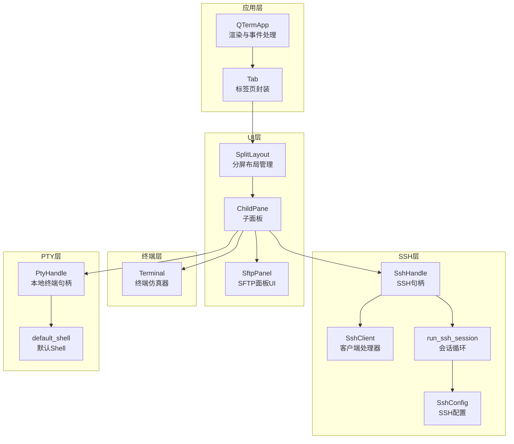
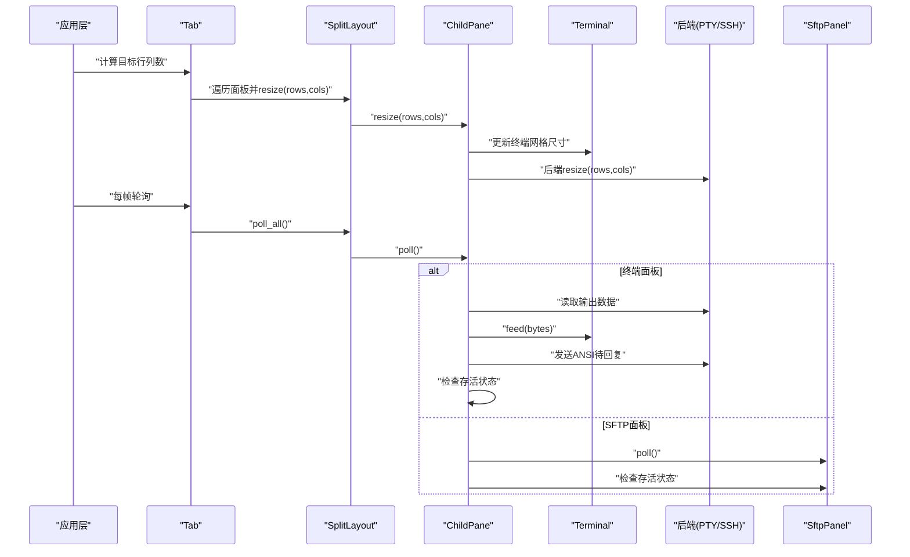
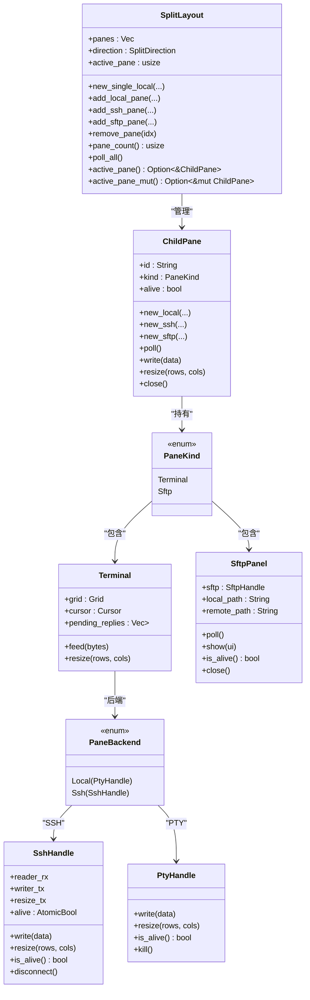

# 分屏布局API

<cite>
**本文档引用的文件**
- [split_pane.rs](file://src/ui/split_pane.rs)
- [sftp_panel.rs](file://src/ui/sftp_panel.rs)
- [mod.rs](file://src/ui/mod.rs)
- [tab_item.rs](file://src/tab/tab_item.rs)
- [app.rs](file://src/app.rs)
- [mod.rs](file://src/ssh/mod.rs)
- [client.rs](file://src/ssh/client.rs)
- [session.rs](file://src/ssh/session.rs)
- [platform.rs](file://src/pty/platform.rs)
- [mod.rs](file://src/terminal/mod.rs)
- [2026-05-30-phase2-ssh-split-design.md](file://docs/specs/2026-05-30-phase2-ssh-split-design.md)
- [2026-05-30-phase2-ssh-split.md](file://docs/plans/2026-05-30-phase2-ssh-split.md)
</cite>

## 目录
1. [简介](#简介)
2. [项目结构](#项目结构)
3. [核心组件](#核心组件)
4. [架构总览](#架构总览)
5. [详细组件分析](#详细组件分析)
6. [依赖关系分析](#依赖关系分析)
7. [性能考量](#性能考量)
8. [故障排查指南](#故障排查指南)
9. [结论](#结论)
10. [附录](#附录)

## 简介
本文件为 QTerm 项目的分屏布局组件提供详细的 API 参考文档，重点覆盖以下内容：
- SplitLayout 结构体的构造方法与面板管理接口
- ChildPane 结构体的生命周期管理（创建、状态检查、资源清理）
- 面板操作 API（本地终端、SSH 终端、SFTP 面板）
- 面板管理功能（移除、激活切换、数量统计）
- 面板尺寸调整、数据轮询、事件处理
- 复杂多面板布局的使用示例
- 面板间通信与数据同步机制

## 项目结构
分屏布局相关代码主要位于 UI 层与终端/SSH/SFTP 子系统之间，采用模块化组织：
- UI 层：split_pane.rs 提供 SplitLayout 与 ChildPane；sftp_panel.rs 提供 SFTP 面板 UI
- 终端层：terminal 模块提供 Terminal 核心结构
- SSH 层：ssh 模块提供 SshHandle、SshConfig、会话循环
- 应用层：app.rs 集成渲染、尺寸计算与事件处理
- 标签页：tab_item.rs 将 SplitLayout 封装为 Tab

图表来源
- [split_pane.rs:151-238](file://src/ui/split_pane.rs#L151-L238)
- [sftp_panel.rs:12-162](file://src/ui/sftp_panel.rs#L12-L162)
- [tab_item.rs:1-48](file://src/tab/tab_item.rs#L1-L48)
- [app.rs:436-524](file://src/app.rs#L436-L524)
- [mod.rs:55-66](file://src/ssh/mod.rs#L55-L66)
- [client.rs:1-63](file://src/ssh/client.rs#L1-L63)
- [session.rs:1-34](file://src/ssh/session.rs#L1-L34)
- [platform.rs:1-21](file://src/pty/platform.rs#L1-L21)
- [mod.rs:24-63](file://src/terminal/mod.rs#L24-L63)

章节来源
- [mod.rs:1-3](file://src/ui/mod.rs#L1-L3)
- [split_pane.rs:1-238](file://src/ui/split_pane.rs#L1-L238)
- [sftp_panel.rs:1-387](file://src/ui/sftp_panel.rs#L1-L387)
- [tab_item.rs:1-48](file://src/tab/tab_item.rs#L1-L48)
- [app.rs:436-524](file://src/app.rs#L436-L524)

## 核心组件
本节概述分屏布局的关键结构体与枚举，以及它们之间的关系。

- SplitDirection：分屏方向（水平/垂直）
- PaneBackend：面板后端类型（本地 PTY 或远程 SSH）
- PaneKind：面板内容类型（终端面板或 SFTP 面板）
- ChildPane：单个面板的生命周期管理容器
- SplitLayout：多面板布局管理器，负责活动面板与布局方向

章节来源
- [split_pane.rs:6-31](file://src/ui/split_pane.rs#L6-L31)
- [split_pane.rs:151-157](file://src/ui/split_pane.rs#L151-L157)

## 架构总览
分屏布局的运行流程如下：
- 应用层根据窗口尺寸计算目标行列数，并调用各面板的 resize
- SplitLayout 调用所有 ChildPane 的 poll，实现数据轮询
- ChildPane 根据后端类型（本地/SSH）读取输出、发送待回复的 ANSI 响应，并检查存活状态
- SFTP 面板通过 SftpHandle 轮询事件并更新 UI
- 渲染层根据 SplitDirection 决定水平或垂直分屏布局

图表来源
- [app.rs:436-456](file://src/app.rs#L436-L456)
- [split_pane.rs:180-185](file://src/ui/split_pane.rs#L180-L185)
- [split_pane.rs:70-113](file://src/ui/split_pane.rs#L70-L113)
- [sftp_panel.rs:51-110](file://src/ui/sftp_panel.rs#L51-L110)

章节来源
- [app.rs:436-524](file://src/app.rs#L436-L524)
- [split_pane.rs:159-238](file://src/ui/split_pane.rs#L159-L238)
- [sftp_panel.rs:51-110](file://src/ui/sftp_panel.rs#L51-L110)

## 详细组件分析

### SplitLayout API 参考
- 构造方法
  - new_single_local(rows, cols, scrollback, shell): 创建包含单个本地终端面板的布局，默认水平分屏，活动面板为首个面板
- 面板管理
  - active_pane(): 获取当前活动面板的不可变引用
  - active_pane_mut(): 获取当前活动面板的可变引用
  - add_local_pane(direction, rows, cols, scrollback, shell): 添加本地终端面板（最多6个）
  - add_ssh_pane(config, direction, rows, cols, scrollback): 添加 SSH 终端面板（最多6个）
  - add_sftp_pane(sftp, direction): 添加 SFTP 面板（最多6个）
  - remove_pane(idx): 移除指定索引的面板（至少保留1个）
  - pane_count(): 返回当前面板总数
- 数据轮询
  - poll_all(): 轮询所有面板，读取输出、处理待回复、检查存活

章节来源
- [split_pane.rs:159-238](file://src/ui/split_pane.rs#L159-L238)
- [tab_item.rs:11-48](file://src/tab/tab_item.rs#L11-L48)

### ChildPane API 参考
- 生命周期与创建
  - new_local(rows, cols, scrollback, shell): 创建本地终端面板（PTY）
  - new_ssh(config, rows, cols, scrollback): 创建 SSH 终端面板
  - new_sftp(sftp): 创建 SFTP 文件浏览器面板
- 数据轮询与状态
  - poll(): 轮询面板数据
    - 终端面板：读取后端输出，feed 到 Terminal，发送待回复 ANSI，检查后端存活
    - SFTP 面板：轮询 SftpHandle 事件，更新 UI，检查存活
  - alive: 面板存活标志（后端死亡时置为 false）
- 输入输出与尺寸
  - write(data): 向面板写入数据（仅终端面板）
  - resize(rows, cols): 调整面板终端大小（仅终端面板）
  - close(): 关闭面板（终止后端进程/连接）

章节来源
- [split_pane.rs:27-149](file://src/ui/split_pane.rs#L27-L149)

### 面板内容类型与后端
- PaneKind
  - Terminal: 包含 Terminal 与 PaneBackend
  - Sftp: 包含 SftpPanel
- PaneBackend
  - Local(PtyHandle): 本地终端后端
  - Ssh(SshHandle): 远程终端后端
- SftpPanel
  - 提供本地/远程双栏浏览、上传/下载、目录导航、状态提示
  - 支持 poll() 轮询事件、is_alive() 检查连接、close() 断开连接

章节来源
- [split_pane.rs:19-23](file://src/ui/split_pane.rs#L19-L23)
- [split_pane.rs:14-17](file://src/ui/split_pane.rs#L14-L17)
- [sftp_panel.rs:12-162](file://src/ui/sftp_panel.rs#L12-L162)

### SSH 与 PTY 后端集成
- SshHandle
  - 暴露 reader_rx、writer_tx、resize_tx、alive、russh_handle
  - 提供 write、resize、is_alive、disconnect 等接口
- run_ssh_session
  - 在异步环境中建立连接、认证、打开通道、请求 PTY 并处理数据
- PtyHandle
  - 本地终端后端，提供 spawn、write、resize、is_alive、kill 等接口
- default_shell
  - 根据平台返回默认 Shell 路径

章节来源
- [mod.rs:55-66](file://src/ssh/mod.rs#L55-L66)
- [session.rs:1-34](file://src/ssh/session.rs#L1-L34)
- [platform.rs:1-21](file://src/pty/platform.rs#L1-L21)
- [2026-05-30-phase2-ssh-split-design.md:24-63](file://docs/specs/2026-05-30-phase2-ssh-split-design.md#L24-L63)

### 渲染与尺寸调整
- 应用层根据可用尺寸计算目标行列数，并对每个面板执行 resize
- 渲染层根据 SplitDirection 决定水平（上下）或垂直（左右）分屏
- 活动面板绘制边框高亮，便于用户识别

章节来源
- [app.rs:436-524](file://src/app.rs#L436-L524)
- [2026-05-30-phase2-ssh-split.md:373-435](file://docs/plans/2026-05-30-phase2-ssh-split.md#L373-L435)

## 依赖关系分析

图表来源
- [split_pane.rs:151-238](file://src/ui/split_pane.rs#L151-L238)
- [split_pane.rs:27-149](file://src/ui/split_pane.rs#L27-L149)
- [mod.rs:24-63](file://src/terminal/mod.rs#L24-L63)
- [sftp_panel.rs:12-162](file://src/ui/sftp_panel.rs#L12-L162)
- [mod.rs:55-66](file://src/ssh/mod.rs#L55-L66)

章节来源
- [split_pane.rs:151-238](file://src/ui/split_pane.rs#L151-L238)
- [split_pane.rs:27-149](file://src/ui/split_pane.rs#L27-L149)
- [mod.rs:24-63](file://src/terminal/mod.rs#L24-L63)
- [sftp_panel.rs:12-162](file://src/ui/sftp_panel.rs#L12-L162)
- [mod.rs:55-66](file://src/ssh/mod.rs#L55-L66)

## 性能考量
- 轮询频率：建议在应用层统一调度，避免每个面板独立轮询导致的 CPU 开销
- 后端 I/O：PTY/SSH 的 reader_rx 采用非阻塞接收，减少阻塞风险
- 终端解析：VTE 解析器逐字节处理，建议批量读取并合并 feed 调用
- UI 更新：尺寸变更时集中触发 resize，避免频繁重排
- SFTP 事件：事件驱动处理，仅在有事件时更新 UI

[本节为通用指导，无需特定文件来源]

## 故障排查指南
- 面板未显示或空白
  - 检查 pane.alive 是否为 false（后端已死亡）
  - 确认 Terminal 尺寸是否正确（resize 调用链）
- SSH 连接失败
  - 查看 SshError 的具体类型（连接/认证/通道）
  - 确认 SshConfig 的主机、端口、用户名、认证方式
- SFTP 无法列出目录
  - 检查 SftpPanel 的 connected 状态与 pending_list 标志
  - 确认 SftpHandle 的 is_alive 状态
- 面板移除后仍占用资源
  - 确保调用 remove_pane 后执行 close，释放后端资源

章节来源
- [split_pane.rs:223-232](file://src/ui/split_pane.rs#L223-L232)
- [split_pane.rs:136-148](file://src/ui/split_pane.rs#L136-L148)
- [sftp_panel.rs:154-162](file://src/ui/sftp_panel.rs#L154-L162)
- [mod.rs:43-51](file://src/ssh/mod.rs#L43-L51)

## 结论
QTerm 的分屏布局通过 SplitLayout 与 ChildPane 将多种类型的面板（本地终端、SSH 终端、SFTP 面板）统一管理，配合 Terminal 仿真器与后端句柄（PTY/SSH），实现了灵活的多面板工作流。应用层负责尺寸计算与渲染，UI 层负责事件处理与面板生命周期管理。该设计具备良好的扩展性，便于后续增加更多面板类型与交互能力。

[本节为总结性内容，无需特定文件来源]

## 附录

### 使用示例：创建复杂多面板布局
以下步骤展示如何在应用层创建一个包含本地终端、SSH 终端与 SFTP 面板的复杂布局：
- 步骤1：创建单面板本地终端布局
  - 调用 SplitLayout::new_single_local(...) 初始化
- 步骤2：添加本地终端面板
  - 调用 add_local_pane(...)，选择分屏方向
- 步骤3：添加 SSH 终端面板
  - 准备 SshConfig，调用 add_ssh_pane(...)
- 步骤4：打开 SFTP 面板
  - 从活动的 SSH 终端面板获取 SftpHandle，调用 add_sftp_pane(...)
- 步骤5：轮询与渲染
  - 每帧调用 layout.poll_all() 与各面板 resize
  - 根据 SplitDirection 渲染水平或垂直分屏

章节来源
- [split_pane.rs:159-238](file://src/ui/split_pane.rs#L159-L238)
- [app.rs:436-524](file://src/app.rs#L436-L524)
- [app.rs:1047-1081](file://src/app.rs#L1047-L1081)

### 面板间通信与数据同步
- 事件驱动：SftpHandle 通过事件队列向 SftpPanel 传递连接、目录列表、上传/下载结果等
- 同步机制：应用层在每帧统一轮询所有面板，保证数据一致性
- 选择与复制：Terminal 提供文本选择 API，结合应用层的鼠标事件处理实现跨面板复制粘贴

章节来源
- [sftp_panel.rs:51-110](file://src/ui/sftp_panel.rs#L51-L110)
- [mod.rs:137-155](file://src/terminal/mod.rs#L137-L155)
- [app.rs:1083-1106](file://src/app.rs#L1083-L1106)