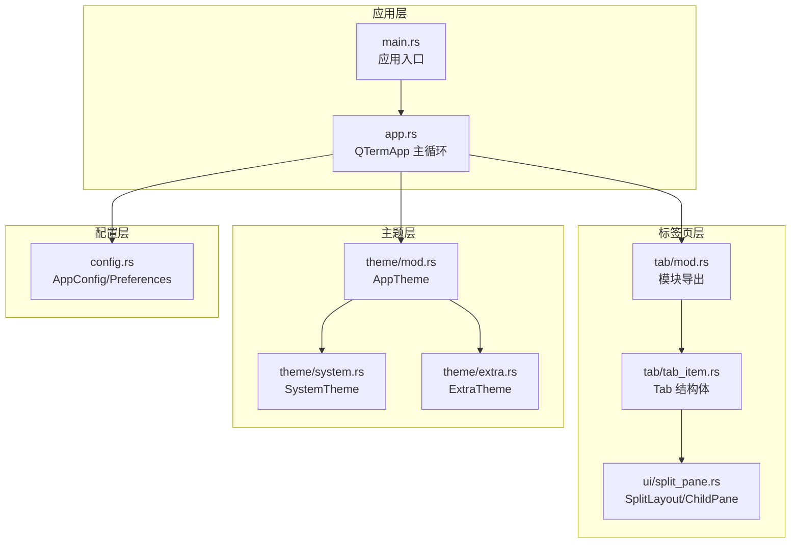
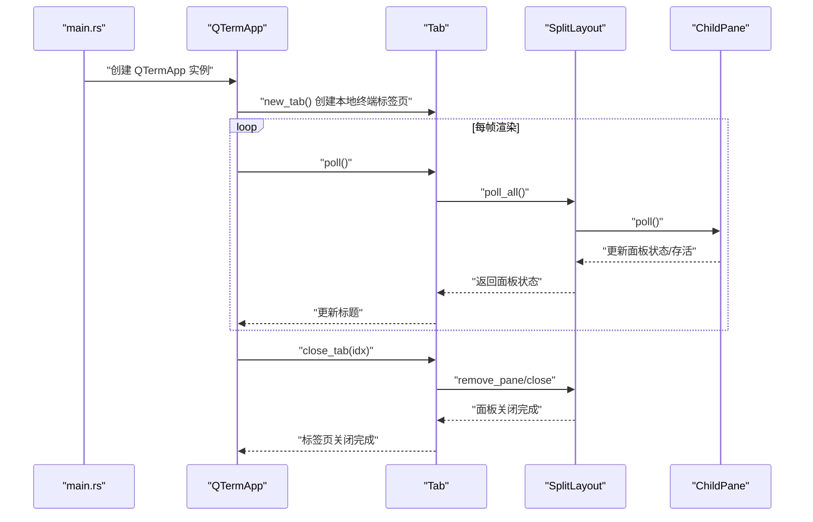
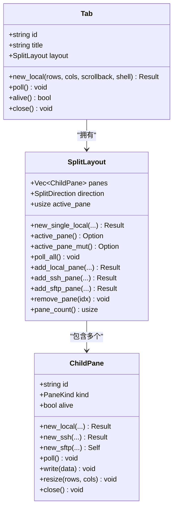
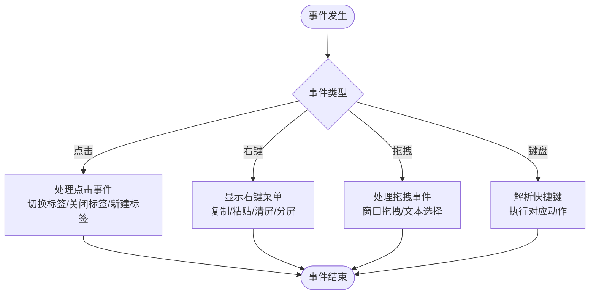
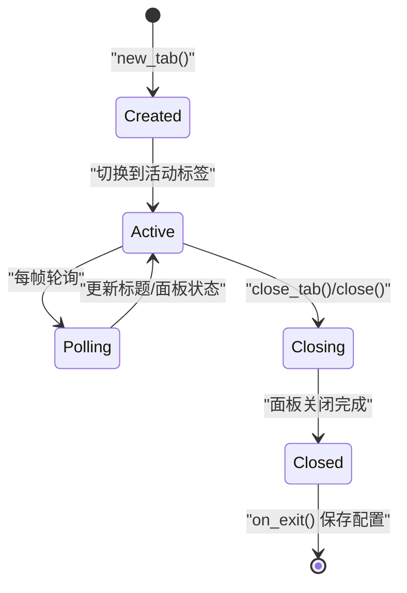
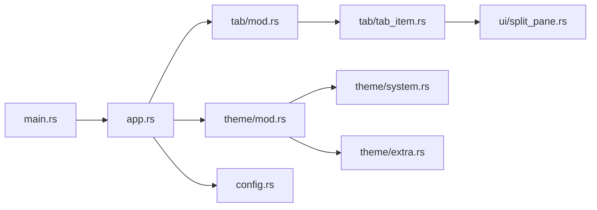

# 标签页组件API

<cite>
**本文档引用的文件**
- [src/tab/mod.rs](file://src/tab/mod.rs)
- [src/tab/tab_item.rs](file://src/tab/tab_item.rs)
- [src/ui/split_pane.rs](file://src/ui/split_pane.rs)
- [src/app.rs](file://src/app.rs)
- [src/main.rs](file://src/main.rs)
- [src/theme/mod.rs](file://src/theme/mod.rs)
- [src/theme/system.rs](file://src/theme/system.rs)
- [src/theme/extra.rs](file://src/theme/extra.rs)
- [src/config.rs](file://src/config.rs)
</cite>

## 目录
1. [简介](#简介)
2. [项目结构](#项目结构)
3. [核心组件](#核心组件)
4. [架构总览](#架构总览)
5. [详细组件分析](#详细组件分析)
6. [依赖关系分析](#依赖关系分析)
7. [性能考量](#性能考量)
8. [故障排除指南](#故障排除指南)
9. [结论](#结论)
10. [附录](#附录)

## 简介
本文件为 QTerm 项目的标签页组件提供全面的 API 文档，重点覆盖以下方面：
- TabItem 结构体的状态管理：标签页创建、激活、关闭与重命名（标题更新）的 API 方法
- 标签页内容管理接口：面板绑定、内容更新与状态同步方法
- 标签页事件处理机制：点击事件、右键菜单、拖拽操作与键盘快捷键的回调接口
- 标签页生命周期管理：创建钩子、销毁清理与状态持久化方法
- 标签页样式定制 API：图标设置、颜色主题与自定义渲染接口
- 完整使用示例：展示如何实现动态标签页管理
- 标签页与主应用的通信机制与数据绑定方法
- 标签页导航与切换的底层实现原理

## 项目结构
QTerm 的标签页组件位于独立模块中，并通过 UI 子模块与应用主循环集成。关键文件如下：
- 标签页模块导出入口：src/tab/mod.rs
- 标签页主体实现：src/tab/tab_item.rs
- 分屏与面板管理：src/ui/split_pane.rs
- 应用主循环与标签页交互：src/app.rs
- 应用入口与窗口初始化：src/main.rs
- 主题系统与样式定制：src/theme/mod.rs、src/theme/system.rs、src/theme/extra.rs
- 配置与状态持久化：src/config.rs

图表来源
- [src/main.rs:51-87](file://src/main.rs#L51-L87)
- [src/app.rs:17-94](file://src/app.rs#L17-L94)
- [src/tab/mod.rs:1-3](file://src/tab/mod.rs#L1-L3)
- [src/tab/tab_item.rs:5-48](file://src/tab/tab_item.rs#L5-L48)
- [src/ui/split_pane.rs:151-238](file://src/ui/split_pane.rs#L151-L238)
- [src/theme/mod.rs:14-71](file://src/theme/mod.rs#L14-L71)
- [src/theme/system.rs:82-246](file://src/theme/system.rs#L82-L246)
- [src/theme/extra.rs:34-65](file://src/theme/extra.rs#L34-L65)
- [src/config.rs:37-127](file://src/config.rs#L37-L127)

章节来源
- [src/main.rs:51-87](file://src/main.rs#L51-L87)
- [src/app.rs:17-94](file://src/app.rs#L17-L94)
- [src/tab/mod.rs:1-3](file://src/tab/mod.rs#L1-L3)
- [src/tab/tab_item.rs:5-48](file://src/tab/tab_item.rs#L5-L48)
- [src/ui/split_pane.rs:151-238](file://src/ui/split_pane.rs#L151-L238)
- [src/theme/mod.rs:14-71](file://src/theme/mod.rs#L14-L71)
- [src/theme/system.rs:82-246](file://src/theme/system.rs#L82-L246)
- [src/theme/extra.rs:34-65](file://src/theme/extra.rs#L34-L65)
- [src/config.rs:37-127](file://src/config.rs#L37-L127)

## 核心组件
- Tab 结构体：封装标签页的唯一标识、标题与分屏布局管理器，负责轮询、存活检查与关闭操作。
- SplitLayout：管理多个面板的分屏排列、活动面板选择与面板数量控制。
- ChildPane：管理单个面板的内容、存活状态与生命周期，支持本地/远程终端与 SFTP 面板。
- QTermApp：应用主循环，维护标签页列表与活动标签索引，处理事件、渲染与持久化。

章节来源
- [src/tab/tab_item.rs:5-48](file://src/tab/tab_item.rs#L5-L48)
- [src/ui/split_pane.rs:151-238](file://src/ui/split_pane.rs#L151-L238)
- [src/app.rs:17-94](file://src/app.rs#L17-L94)

## 架构总览
标签页组件与应用主循环的交互流程如下：
- 应用启动时创建初始标签页并进入渲染循环
- 每帧轮询所有标签页以更新标题与面板状态
- 用户通过快捷键或 UI 操作触发标签页创建、关闭与切换
- 标签页内部通过 SplitLayout 管理面板，ChildPane 负责具体面板的生命周期与数据流

图表来源
- [src/main.rs:82-87](file://src/main.rs#L82-L87)
- [src/app.rs:58-94](file://src/app.rs#L58-L94)
- [src/app.rs:178-206](file://src/app.rs#L178-L206)
- [src/tab/tab_item.rs:23-47](file://src/tab/tab_item.rs#L23-L47)
- [src/ui/split_pane.rs:180-238](file://src/ui/split_pane.rs#L180-L238)

## 详细组件分析

### Tab 结构体与状态管理
- 字段
  - id: 标签页唯一标识（UUID）
  - title: 标签页标题（通常由终端 OSC 标题设置）
  - layout: 分屏布局管理器
- 方法
  - new_local(...): 创建本地终端标签页（初始化单个本地终端面板）
  - poll(): 轮询标签页数据，读取终端输出并更新标题
  - alive(): 检查标签页是否存活（至少有一个面板存活）
  - close(): 关闭标签页（关闭所有面板）

图表来源
- [src/tab/tab_item.rs:5-48](file://src/tab/tab_item.rs#L5-L48)
- [src/ui/split_pane.rs:151-238](file://src/ui/split_pane.rs#L151-L238)
- [src/ui/split_pane.rs:25-149](file://src/ui/split_pane.rs#L25-L149)

章节来源
- [src/tab/tab_item.rs:5-48](file://src/tab/tab_item.rs#L5-L48)
- [src/ui/split_pane.rs:151-238](file://src/ui/split_pane.rs#L151-L238)

### 内容管理接口
- 面板绑定
  - new_local(...)/new_ssh(...)/new_sftp(...): 创建不同类型的面板并加入布局
  - add_local_pane/add_ssh_pane/add_sftp_pane: 在当前标签页中添加面板
- 内容更新
  - poll_all(): 轮询所有面板，读取后端输出并更新终端内容
  - poll(): 单个面板轮询，处理本地/远程后端数据与存活状态
- 状态同步
  - alive(): 返回面板存活状态，用于标签页存活判定
  - active_pane/active_pane_mut: 获取当前活动面板引用，用于渲染与交互

章节来源
- [src/ui/split_pane.rs:159-238](file://src/ui/split_pane.rs#L159-L238)
- [src/ui/split_pane.rs:70-149](file://src/ui/split_pane.rs#L70-L149)
- [src/tab/tab_item.rs:23-40](file://src/tab/tab_item.rs#L23-L40)

### 事件处理机制
- 点击事件
  - 标题栏标签页卡片点击：切换活动标签页
  - 标签页关闭按钮点击：关闭指定标签页
  - 新建标签按钮点击：创建新标签页
- 右键菜单
  - 终端区域右键菜单：复制、粘贴、清屏、水平/垂直分屏等
  - 菜单外部点击关闭菜单
- 拖拽操作
  - 标题栏拖拽：窗口拖拽与双击最大化
  - 终端区域拖拽：选择文本（PendingMouse 数据结构）
- 键盘快捷键
  - Ctrl+Shift+T: 新建标签页
  - Ctrl+Shift+W: 关闭标签页
  - Ctrl+Tab: 切换到下一个标签页
  - Ctrl+Shift+H/V: 水平/垂直分屏
  - Ctrl+箭头: 切换活动面板
  - Ctrl+Shift+B: 切换左侧面板显示
  - Ctrl+=/-: 字体放大/缩小
  - Ctrl+C/V: 复制/粘贴
  - 其他常用键：转义序列映射到 ANSI 序列写入后端

图表来源
- [src/app.rs:290-382](file://src/app.rs#L290-L382)
- [src/app.rs:574-705](file://src/app.rs#L574-L705)
- [src/app.rs:1126-1162](file://src/app.rs#L1126-L1162)
- [src/app.rs:1211-1296](file://src/app.rs#L1211-L1296)

章节来源
- [src/app.rs:290-382](file://src/app.rs#L290-L382)
- [src/app.rs:574-705](file://src/app.rs#L574-L705)
- [src/app.rs:1126-1162](file://src/app.rs#L1126-L1162)
- [src/app.rs:1211-1296](file://src/app.rs#L1211-L1296)

### 生命周期管理
- 创建钩子
  - new_tab(): 应用启动时创建初始标签页；用户点击“+”或快捷键创建新标签页
  - new_local/new_ssh/new_sftp: 创建面板并加入布局
- 销毁清理
  - close_tab(): 关闭指定标签页并移除
  - close(): 关闭标签页内所有面板（终止后端进程/连接）
  - on_exit(): 应用退出时保存窗口状态与主题，并关闭所有标签页
- 状态持久化
  - AppConfig: 窗口位置、尺寸、主题、字体大小、回滚行数等运行时配置
  - Preferences: 从 WhaleTerm preferences.json 读取字体与主题配置

图表来源
- [src/app.rs:178-206](file://src/app.rs#L178-L206)
- [src/app.rs:558-570](file://src/app.rs#L558-L570)
- [src/config.rs:37-127](file://src/config.rs#L37-L127)

章节来源
- [src/app.rs:178-206](file://src/app.rs#L178-L206)
- [src/app.rs:558-570](file://src/app.rs#L558-L570)
- [src/config.rs:37-127](file://src/config.rs#L37-L127)

### 样式定制API
- 主题系统
  - AppTheme: 组合系统主题、终端主题与扩展主题
  - SystemTheme: UI 控件颜色（标题栏、侧边栏、对话框等）
  - ExtraTheme: SFTP 进度条、表格等扩展控件颜色
- 标签页样式
  - 标题栏卡片：背景色、文字颜色、圆角与边框
  - 活动标签高亮：边框颜色与文字强调
- 字体与字号
  - 从 Preferences 加载字体族与大小，应用到 egui 字体系统
  - 终端字体大小可通过快捷键调整并保存到配置

章节来源
- [src/theme/mod.rs:14-71](file://src/theme/mod.rs#L14-L71)
- [src/theme/system.rs:82-246](file://src/theme/system.rs#L82-L246)
- [src/theme/extra.rs:34-65](file://src/theme/extra.rs#L34-L65)
- [src/app.rs:96-177](file://src/app.rs#L96-L177)

### 使用示例与最佳实践
- 动态标签页管理
  - 创建新标签页：调用 new_tab() 或点击标题栏“+”
  - 关闭标签页：调用 close_tab(idx) 或点击标签页“x”
  - 切换标签页：使用 Ctrl+Tab 或点击标题栏标签
  - 分屏：使用 Ctrl+Shift+H/V 或右键菜单“水平分屏/垂直分屏”
- 与主应用通信
  - 通过 QTermApp 维护 tabs 列表与 active_tab 索引
  - 通过 SplitLayout 与 ChildPane 管理面板生命周期与数据流
- 数据绑定
  - 标题栏渲染时根据 tab.alive() 与 active_tab 状态决定显示与高亮
  - 终端渲染时根据 pane.kind 决定渲染终端或 SFTP 面板

章节来源
- [src/app.rs:574-705](file://src/app.rs#L574-L705)
- [src/app.rs:400-538](file://src/app.rs#L400-L538)
- [src/ui/split_pane.rs:170-178](file://src/ui/split_pane.rs#L170-L178)

### 导航与切换的底层实现原理
- 标签页导航
  - 标题栏卡片点击：直接设置 active_tab
  - 快捷键 Ctrl+Tab：按顺序循环切换 active_tab
- 面板导航
  - SplitLayout.active_pane：当前活动面板索引
  - NextPane 快捷键：在多面板情况下循环切换活动面板
- 尺寸与布局
  - 根据面板数量与分屏方向计算目标行列数
  - 调整每个面板的终端大小并渲染

章节来源
- [src/app.rs:334-361](file://src/app.rs#L334-L361)
- [src/app.rs:411-437](file://src/app.rs#L411-L437)
- [src/ui/split_pane.rs:234-238](file://src/ui/split_pane.rs#L234-L238)

## 依赖关系分析
- 模块耦合
  - app.rs 依赖 tab/mod.rs 与 ui/split_pane.rs
  - tab_item.rs 依赖 ui/split_pane.rs
  - theme/mod.rs 依赖 system.rs 与 extra.rs
  - main.rs 依赖 app.rs
- 外部依赖
  - eframe/egui：UI 渲染与事件处理
  - uuid：生成面板与标签页唯一标识
  - pty/ssh/sftp：后端终端与文件传输

图表来源
- [src/main.rs:51-87](file://src/main.rs#L51-L87)
- [src/app.rs:17-94](file://src/app.rs#L17-L94)
- [src/tab/mod.rs:1-3](file://src/tab/mod.rs#L1-L3)
- [src/tab/tab_item.rs:5-48](file://src/tab/tab_item.rs#L5-L48)
- [src/ui/split_pane.rs:151-238](file://src/ui/split_pane.rs#L151-L238)
- [src/theme/mod.rs:14-71](file://src/theme/mod.rs#L14-L71)
- [src/theme/system.rs:82-246](file://src/theme/system.rs#L82-L246)
- [src/theme/extra.rs:34-65](file://src/theme/extra.rs#L34-L65)
- [src/config.rs:37-127](file://src/config.rs#L37-L127)

章节来源
- [src/main.rs:51-87](file://src/main.rs#L51-L87)
- [src/app.rs:17-94](file://src/app.rs#L17-L94)
- [src/tab/mod.rs:1-3](file://src/tab/mod.rs#L1-L3)
- [src/tab/tab_item.rs:5-48](file://src/tab/tab_item.rs#L5-L48)
- [src/ui/split_pane.rs:151-238](file://src/ui/split_pane.rs#L151-L238)
- [src/theme/mod.rs:14-71](file://src/theme/mod.rs#L14-L71)
- [src/theme/system.rs:82-246](file://src/theme/system.rs#L82-L246)
- [src/theme/extra.rs:34-65](file://src/theme/extra.rs#L34-L65)
- [src/config.rs:37-127](file://src/config.rs#L37-L127)

## 性能考量
- 轮询策略
  - 每帧对所有标签页执行 poll()，建议在面板数量较多时优化轮询频率
- 终端尺寸调整
  - 当窗口尺寸变化时批量调整面板尺寸，减少不必要的重绘
- 字体与主题
  - 字体加载与应用需谨慎，避免频繁切换导致性能下降
- 面板数量限制
  - SplitLayout 对面板数量进行上限控制（最多6个），防止资源耗尽

## 故障排除指南
- 标签页无法创建
  - 检查 new_local 参数（rows/cols/scrollback/shell）是否有效
  - 确认 AppConfig.shell_path 配置正确
- 标签页标题不更新
  - 确保终端 OSC 标题设置正常，poll() 能够读取到终端输出
- 面板无法关闭
  - 检查 ChildPane.alive 状态与后端连接/进程是否存活
- 快捷键无效
  - 确认 egui 输入事件未被其他控件拦截
  - 检查修饰键组合是否符合预期

章节来源
- [src/app.rs:178-206](file://src/app.rs#L178-L206)
- [src/tab/tab_item.rs:23-40](file://src/tab/tab_item.rs#L23-L40)
- [src/ui/split_pane.rs:70-149](file://src/ui/split_pane.rs#L70-L149)
- [src/app.rs:290-382](file://src/app.rs#L290-L382)

## 结论
QTerm 的标签页组件通过 Tab、SplitLayout 与 ChildPane 的清晰分层设计，实现了灵活的多面板终端管理。配合应用主循环的事件处理与主题系统，提供了良好的用户体验。建议在大规模使用场景下关注轮询与渲染性能，并合理利用面板数量限制与配置持久化机制。

## 附录
- 关键 API 概览
  - Tab::new_local(...)
  - Tab::poll()
  - Tab::alive()
  - Tab::close()
  - SplitLayout::new_single_local(...)
  - SplitLayout::add_local_pane(...)
  - SplitLayout::add_ssh_pane(...)
  - SplitLayout::add_sftp_pane(...)
  - SplitLayout::remove_pane(...)
  - SplitLayout::active_pane()/active_pane_mut()
  - ChildPane::poll()/write()/resize()/close()