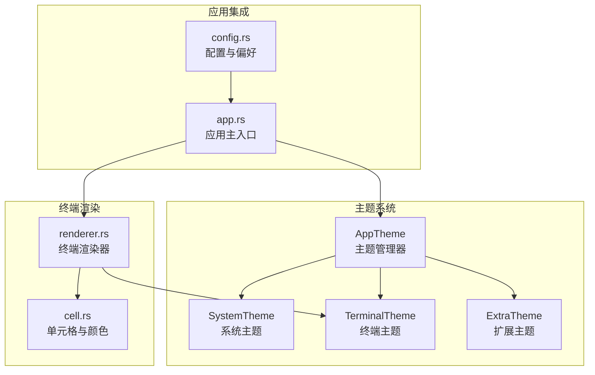
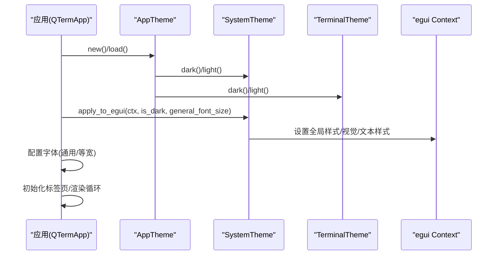
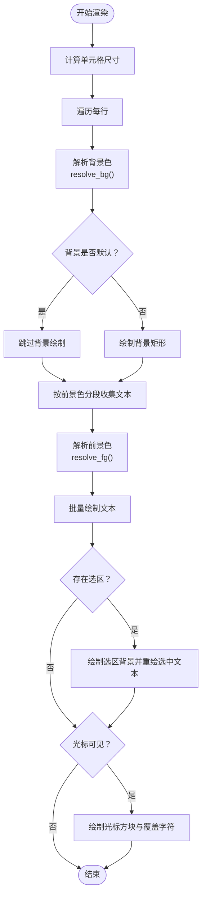
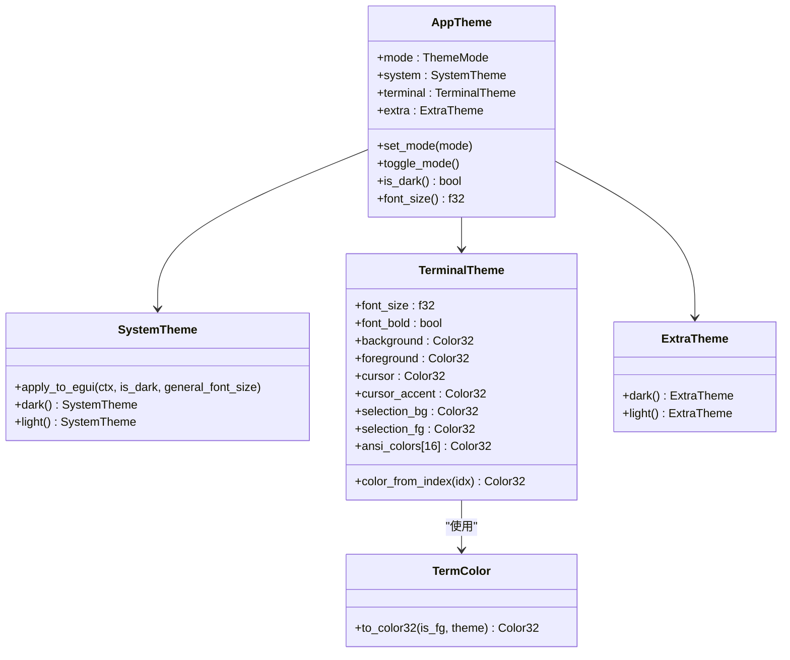

# 主题系统API

<cite>
**本文档引用的文件**
- [src/theme/mod.rs](file://src/theme/mod.rs)
- [src/theme/system.rs](file://src/theme/system.rs)
- [src/theme/terminal.rs](file://src/theme/terminal.rs)
- [src/theme/extra.rs](file://src/theme/extra.rs)
- [src/terminal/cell.rs](file://src/terminal/cell.rs)
- [src/terminal/renderer.rs](file://src/terminal/renderer.rs)
- [src/app.rs](file://src/app.rs)
- [src/config.rs](file://src/config.rs)
- [whaleterm_主题.md](file://whaleterm_主题.md)
</cite>

## 目录
1. [简介](#简介)
2. [项目结构](#项目结构)
3. [核心组件](#核心组件)
4. [架构总览](#架构总览)
5. [详细组件分析](#详细组件分析)
6. [依赖关系分析](#依赖关系分析)
7. [性能考量](#性能考量)
8. [故障排查指南](#故障排查指南)
9. [结论](#结论)
10. [附录](#附录)

## 简介
本文件为 QTerm 主题系统的API参考文档，面向开发者与主题定制者，系统性阐述主题管理器的核心接口、颜色配置与字体管理方法，并详细说明系统主题与终端主题的API边界、扩展主题的色彩体系、主题数据结构定义、继承与优先级处理逻辑，以及完整的主题定制示例与性能优化建议。文档同时结合仓库中的实际实现与设计规范，确保内容可追溯、可落地。

## 项目结构
主题系统位于 `src/theme/` 目录，采用模块化组织，分别定义系统主题、终端主题与扩展主题；另有 `src/terminal/` 下的终端渲染与颜色解析模块，负责将主题应用到终端仿真器的渲染流程中。

图表来源
- [src/theme/mod.rs:14-21](file://src/theme/mod.rs#L14-L21)
- [src/theme/system.rs:5-59](file://src/theme/system.rs#L5-L59)
- [src/theme/terminal.rs:7-17](file://src/theme/terminal.rs#L7-L17)
- [src/theme/extra.rs:6-25](file://src/theme/extra.rs#L6-L25)
- [src/terminal/renderer.rs:44-180](file://src/terminal/renderer.rs#L44-L180)
- [src/terminal/cell.rs:36-53](file://src/terminal/cell.rs#L36-L53)
- [src/app.rs:18-36](file://src/app.rs#L18-L36)
- [src/config.rs:37-66](file://src/config.rs#L37-L66)

章节来源
- [src/theme/mod.rs:1-81](file://src/theme/mod.rs#L1-L81)
- [src/theme/system.rs:1-292](file://src/theme/system.rs#L1-L292)
- [src/theme/terminal.rs:1-102](file://src/theme/terminal.rs#L1-L102)
- [src/theme/extra.rs:1-66](file://src/theme/extra.rs#L1-L66)
- [src/terminal/renderer.rs:1-198](file://src/terminal/renderer.rs#L1-L198)
- [src/terminal/cell.rs:1-75](file://src/terminal/cell.rs#L1-L75)
- [src/app.rs:1-800](file://src/app.rs#L1-L800)
- [src/config.rs:1-281](file://src/config.rs#L1-L281)

## 核心组件
- 主题模式（ThemeMode）：浅色/深色枚举，用于统一控制主题模式。
- AppTheme：组合型主题容器，聚合系统主题、终端主题与扩展主题，并提供模式切换与查询方法。
- SystemTheme：系统UI组件颜色体系，包含应用基础、头部、侧边栏、状态栏、弹窗、下拉菜单、输入框、表格等区域的色彩定义，并提供应用到 egui 的方法。
- TerminalTheme：终端仿真器颜色方案，包含背景、前景、光标、选区、ANSI 16色映射与字体大小/粗体等属性，并提供基于ANSI索引的颜色解析方法。
- ExtraTheme：扩展主题颜色，涵盖标签页、终端连接状态、SFTP进度条、表格等非核心UI组件的颜色定义。
- 终端颜色解析：TermColor 枚举与 to_color32 方法，支持默认色、索引色（ANSI 16/256）与RGB自定义色，并在渲染阶段根据前景/背景与反色属性进行解析。

章节来源
- [src/theme/mod.rs:8-81](file://src/theme/mod.rs#L8-L81)
- [src/theme/system.rs:5-292](file://src/theme/system.rs#L5-L292)
- [src/theme/terminal.rs:7-102](file://src/theme/terminal.rs#L7-L102)
- [src/theme/extra.rs:6-66](file://src/theme/extra.rs#L6-L66)
- [src/terminal/cell.rs:27-53](file://src/terminal/cell.rs#L27-L53)

## 架构总览
主题系统通过 AppTheme 统一管理三大主题子系统，并在应用启动时根据偏好设置初始化字体与主题。SystemTheme 提供 apply_to_egui 方法，将系统主题直接注入 egui 的全局样式；TerminalTheme 与 ExtraTheme 则分别服务于终端渲染与扩展UI组件。

图表来源
- [src/app.rs:70-105](file://src/app.rs#L70-L105)
- [src/theme/system.rs:158-290](file://src/theme/system.rs#L158-L290)
- [src/theme/mod.rs:23-71](file://src/theme/mod.rs#L23-L71)

## 详细组件分析

### AppTheme 主题管理器
- 角色：聚合系统主题、终端主题与扩展主题，提供模式切换、查询与字体大小访问。
- 核心方法：
  - dark()/light()：创建对应模式的 AppTheme 实例。
  - set_mode(mode)/toggle_mode()：切换主题模式，内部通过替换实例实现。
  - is_dark()：判断当前是否为深色模式。
  - font_size()：获取终端字体大小。
- 设计要点：
  - 模式切换时整体重建，保证系统主题与终端主题、扩展主题的一致性。
  - 与 egui 的集成通过 SystemTheme.apply_to_egui 完成。

章节来源
- [src/theme/mod.rs:14-71](file://src/theme/mod.rs#L14-L71)

### SystemTheme 系统主题API
- 颜色定义范围：
  - 应用基础：文本色、激活色、应用背景、分割线、边框等。
  - 头部、侧边栏、状态栏、左侧列表、右侧内容区域。
  - 弹出层（模态/对话框/消息/通知）、下拉菜单、输入框、表格等。
- 关键方法：
  - dark()/light()：提供默认暗/亮主题色值。
  - apply_to_egui(ctx, is_dark, general_font_size)：将系统主题应用到 egui 全局样式，包括视觉模式、窗口/面板/弹窗填充与描边、阴影、选区、超链接、错误/警告色、控件部件（非交互/非活跃/悬停/按下/打开）颜色、文本全局覆盖色、条纹表格、间距与滚动条、文本样式（小/正文/等宽/按钮/标题）等。
- 与 egui 的映射：
  - 通过克隆当前样式并覆盖关键字段，确保所有内置 egui 控件自动遵循主题色。

章节来源
- [src/theme/system.rs:5-292](file://src/theme/system.rs#L5-L292)

### TerminalTheme 终端主题API
- 核心属性：
  - font_size：终端字体大小。
  - font_bold：是否粗体。
  - background/foreground：终端背景/前景色。
  - cursor/cursor_accent：光标颜色与其覆盖字符颜色。
  - selection_bg/selection_fg：选区背景/前景色。
  - ansi_colors[16]：ANSI 标准16色映射。
- 关键方法：
  - dark()/light()：提供默认暗/亮主题。
  - color_from_index(idx)：根据ANSI索引返回 egui::Color32，支持：
    - 0-15：标准16色（含明亮色）。
    - 16-231：6×6×6立方体（216色）。
    - 232-255：24级灰度。
- 与渲染器的协作：
  - renderer.rs 中的 resolve_fg/resolve_bg 根据单元格属性（反色）与 is_fg/is_bg 决定最终颜色。
  - cell.rs 的 TermColor::to_color32 将 Default/Indexed/Rgb 转换为 Color32。

章节来源
- [src/theme/terminal.rs:7-102](file://src/theme/terminal.rs#L7-L102)
- [src/terminal/cell.rs:36-53](file://src/terminal/cell.rs#L36-L53)
- [src/terminal/renderer.rs:182-198](file://src/terminal/renderer.rs#L182-L198)

### ExtraTheme 扩展主题API
- 覆盖范围：
  - 标签页：图标颜色、活动标签文字颜色、活动状态颜色。
  - 终端连接状态：已连接指示灯颜色。
  - SFTP进度条：填充色、轨道色、文字色、边框色。
  - 表格：表头背景、单元格背景、悬停行背景。
- 方法：
  - dark()/light()：提供默认暗/亮扩展色。

章节来源
- [src/theme/extra.rs:6-66](file://src/theme/extra.rs#L6-L66)

### 颜色解析与渲染流程
- 颜色来源：
  - Default：使用 TerminalTheme 的前景/背景色。
  - Indexed：使用 TerminalTheme 的 ansi_colors 或 color_from_index 生成。
  - Rgb：直接使用提供的RGB值。
- 反色处理：
  - 当单元格属性 inverse 为真时，前景/背景互换，以实现反色显示。
- 渲染优化：
  - 按前景色分段绘制文本，减少绘制调用次数。
  - 仅对非默认背景的单元格绘制背景矩形，避免全屏重绘。

图表来源
- [src/terminal/renderer.rs:44-180](file://src/terminal/renderer.rs#L44-L180)
- [src/terminal/renderer.rs:182-198](file://src/terminal/renderer.rs#L182-L198)
- [src/terminal/cell.rs:36-53](file://src/terminal/cell.rs#L36-L53)

## 依赖关系分析
- AppTheme 依赖 SystemTheme/TerminalTheme/ExtraTheme。
- SystemTheme.apply_to_egui 依赖 egui::Context 与 egui::style/visuals。
- TerminalTheme 依赖 parse_color（十六进制颜色解析）。
- 终端渲染器依赖 TerminalTheme 与 TermColor 解析。
- 应用入口（QTermApp）在初始化时读取 Preferences 并应用 SystemTheme 到 egui，同时设置 TerminalTheme 的字体大小与粗体。

图表来源
- [src/theme/mod.rs:14-71](file://src/theme/mod.rs#L14-L71)
- [src/theme/system.rs:158-290](file://src/theme/system.rs#L158-L290)
- [src/theme/terminal.rs:84-101](file://src/theme/terminal.rs#L84-L101)
- [src/terminal/cell.rs:36-53](file://src/terminal/cell.rs#L36-L53)

章节来源
- [src/theme/mod.rs:14-71](file://src/theme/mod.rs#L14-L71)
- [src/theme/system.rs:158-290](file://src/theme/system.rs#L158-L290)
- [src/theme/terminal.rs:84-101](file://src/theme/terminal.rs#L84-L101)
- [src/terminal/cell.rs:36-53](file://src/terminal/cell.rs#L36-L53)

## 性能考量
- 终端渲染优化：
  - 按前景色分段绘制文本，降低绘制调用次数。
  - 仅对非默认背景的单元格绘制背景，避免全屏重绘。
  - 使用字体度量计算单元格尺寸，保证渲染稳定性。
- 主题切换：
  - 模式切换通过整体重建 AppTheme 实现，确保一致性；建议在切换时避免频繁触发，可在 UI 层节流。
- 字体与文本样式：
  - SystemTheme.apply_to_egui 中统一设置文本样式大小，避免重复计算。
- 颜色解析：
  - ANSI 256色立方体与灰度计算为 O(1)，索引访问为 O(1)，解析成本低。

章节来源
- [src/terminal/renderer.rs:80-107](file://src/terminal/renderer.rs#L80-L107)
- [src/theme/system.rs:270-287](file://src/theme/system.rs#L270-L287)

## 故障排查指南
- 主题未生效：
  - 确认 SystemTheme.apply_to_egui 已在应用初始化时调用。
  - 检查 egui::Context 是否正确传入。
- 颜色异常或反色不正确：
  - 检查单元格属性 inverse 标志位与 resolve_fg/resolve_bg 的逻辑。
  - 确认 TermColor::to_color32 的 is_fg 参数与调用场景匹配。
- 字体大小不一致：
  - 确认 Preferences 中的 shell_font_size 与 AppTheme.terminal.font_size 已同步。
  - 检查 SystemTheme.apply_to_egui 中的 general_font_size 与 egui 文本样式设置。
- 配置持久化问题：
  - 检查 AppConfig.save/load 与 Preferences.load 的路径与格式。

章节来源
- [src/app.rs:70-105](file://src/app.rs#L70-L105)
- [src/terminal/renderer.rs:182-198](file://src/terminal/renderer.rs#L182-L198)
- [src/terminal/cell.rs:36-53](file://src/terminal/cell.rs#L36-L53)
- [src/config.rs:68-127](file://src/config.rs#L68-L127)
- [src/config.rs:239-281](file://src/config.rs#L239-L281)

## 结论
QTerm 主题系统通过清晰的模块划分与严格的职责分离，实现了系统UI、终端仿真与扩展组件的统一色彩管理。AppTheme 作为中枢协调各子主题，SystemTheme 将主题无缝注入 egui，TerminalTheme 提供 ANSI 兼容的颜色体系与高性能渲染支持。通过合理的颜色解析与渲染优化策略，系统在保证视觉一致性的同时兼顾性能表现。建议在定制主题时遵循 ANSI 16/256 色规范与 egui 样式约定，确保跨平台与可维护性。

## 附录

### 主题数据结构与字段定义
- AppTheme
  - mode: ThemeMode（浅色/深色）
  - system: SystemTheme（系统UI颜色）
  - terminal: TerminalTheme（终端颜色与字体）
  - extra: ExtraTheme（扩展UI颜色）
- SystemTheme
  - 文本类：text_color, text_active_color
  - 应用基础：app_bg_color, app_divider_color, app_split_color, border_color
  - 头部/侧边栏/状态栏/左侧列表/右侧内容区域
  - 弹出层：dialog_bg_color, dialog_border_color, dialog_divider_color, dialog_text_color, dialog_text_active_color
  - 下拉菜单：drop_down_color, drop_down_bg_color, drop_down_active_color, drop_down_active_bg_color
  - 输入框：input_content_bg_color, input_content_border_color
  - 表格：table_bg_color, table_border_color, table_header_bg_color, table_even_row_bg_color
- TerminalTheme
  - font_size: f32
  - font_bold: bool
  - background/foreground/cursor/cursor_accent/selection_bg/selection_fg
  - ansi_colors[16]: ANSI 16色映射
- ExtraTheme
  - tab_icon_color, tab_active_text_color, active_color
  - term_connected_color
  - ftp_progress_color, ftp_progress_rail_color, ftp_progress_text_color, ftp_progress_border_color
  - table_th_bg, table_td_bg, table_hover_color

章节来源
- [src/theme/mod.rs:14-21](file://src/theme/mod.rs#L14-L21)
- [src/theme/system.rs:5-59](file://src/theme/system.rs#L5-L59)
- [src/theme/terminal.rs:7-17](file://src/theme/terminal.rs#L7-L17)
- [src/theme/extra.rs:6-25](file://src/theme/extra.rs#L6-L25)

### 主题继承与优先级
- 继承机制：
  - AppTheme 通过组合 SystemTheme/TerminalTheme/ExtraTheme 实现“继承”效果，模式切换时整体重建，确保各子主题同步。
- 优先级处理：
  - 终端渲染优先级：Indexed > Rgb > Default；反色属性 inverse 会交换前景/背景。
  - egui 样式优先级：SystemTheme.apply_to_egui 覆盖全局样式，控件部件样式进一步细化。

章节来源
- [src/theme/mod.rs:23-71](file://src/theme/mod.rs#L23-L71)
- [src/theme/system.rs:158-290](file://src/theme/system.rs#L158-L290)
- [src/terminal/cell.rs:36-53](file://src/terminal/cell.rs#L36-L53)

### 主题定制示例（步骤）
- 步骤1：创建自定义 AppTheme
  - 使用 AppTheme::dark()/light() 为基础，修改 system/terminal/extra 的具体颜色字段。
- 步骤2：应用到 egui
  - 调用 SystemTheme::apply_to_egui(ctx, is_dark, general_font_size)。
- 步骤3：设置终端字体
  - 将自定义字体大小赋给 AppTheme.terminal.font_size，并在渲染时使用该值。
- 步骤4：持久化与同步
  - 通过 AppConfig/Preferences 的 load/save 机制保存主题与字体设置，确保重启后恢复。

章节来源
- [src/theme/mod.rs:23-71](file://src/theme/mod.rs#L23-L71)
- [src/theme/system.rs:158-290](file://src/theme/system.rs#L158-L290)
- [src/app.rs:70-105](file://src/app.rs#L70-L105)
- [src/config.rs:68-127](file://src/config.rs#L68-L127)

### 最佳实践
- 遵循 ANSI 16/256 色规范，确保终端颜色在不同终端模拟器中一致。
- 在 SystemTheme.apply_to_egui 中统一设置文本样式，避免局部重复设置。
- 使用 Indexed 颜色优先于 Rgb，便于主题切换与一致性。
- 在渲染阶段尽量减少绘制调用，利用分段绘制与条件绘制优化性能。
- 保持主题模式与 egui 视觉模式同步，避免视觉错位。

章节来源
- [src/theme/system.rs:158-290](file://src/theme/system.rs#L158-L290)
- [src/terminal/renderer.rs:80-107](file://src/terminal/renderer.rs#L80-L107)