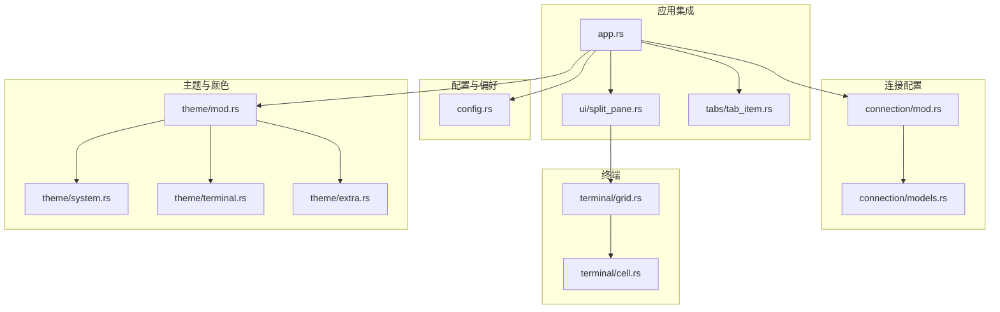
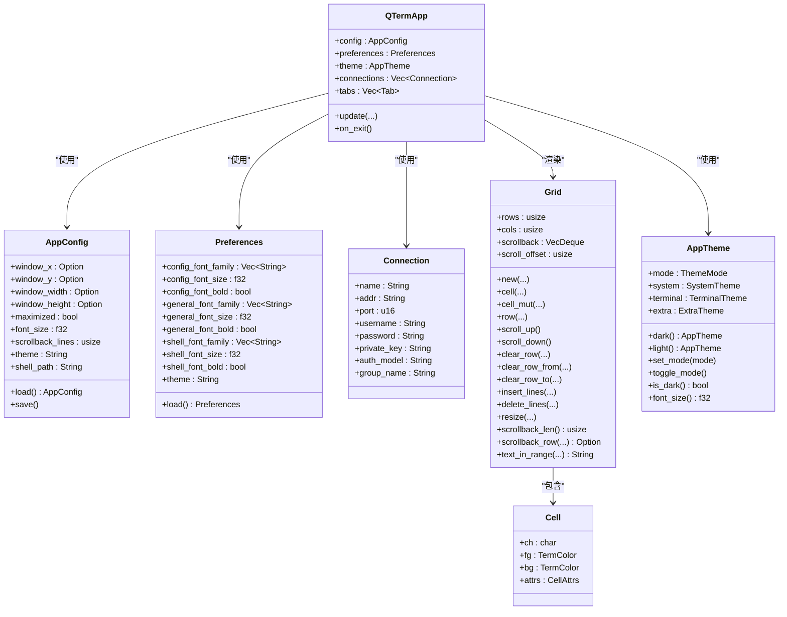
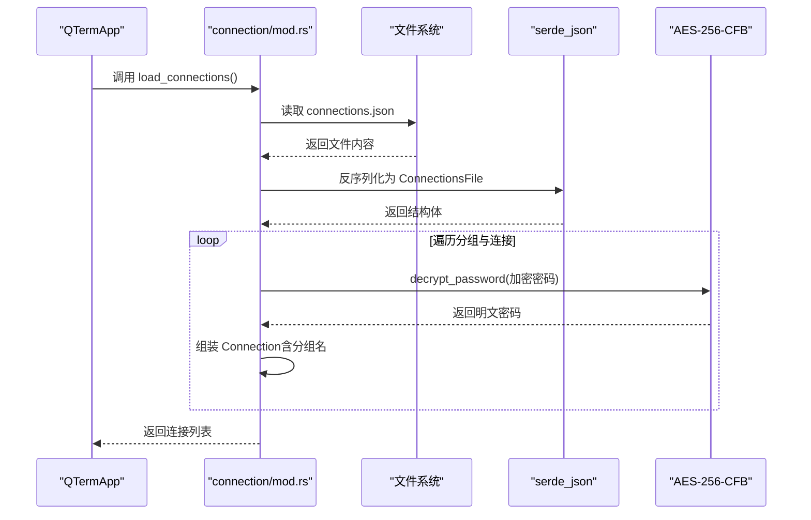
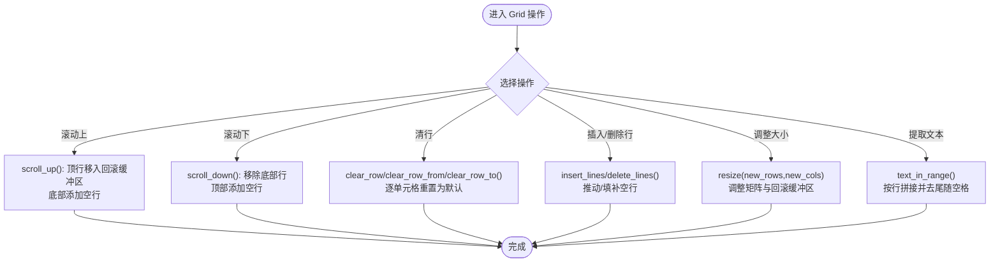
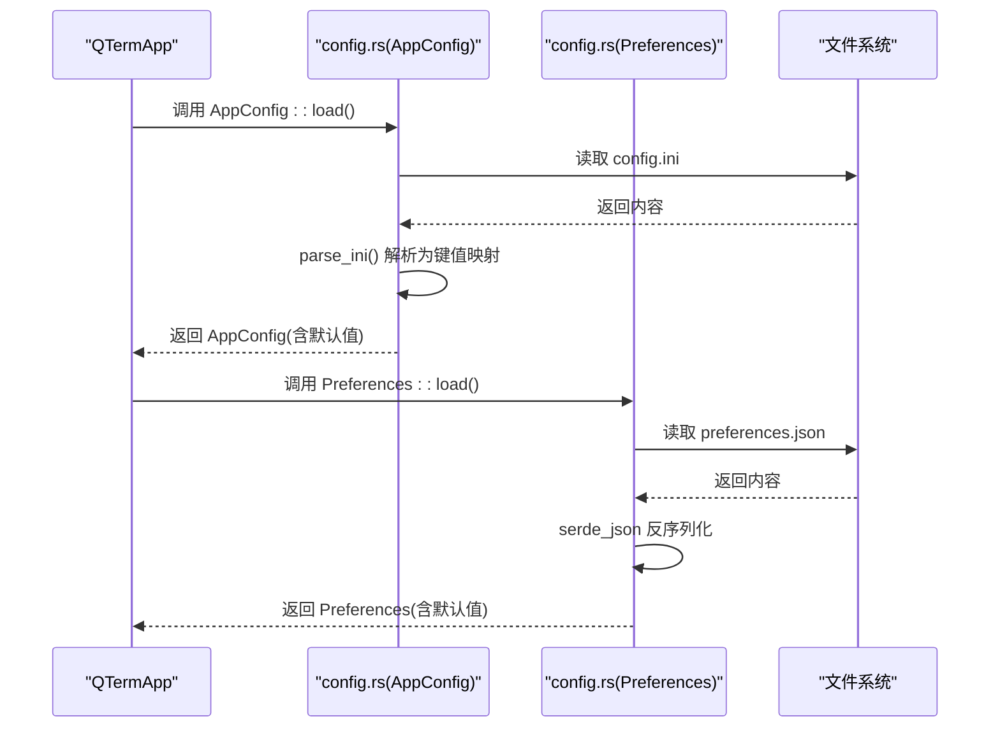
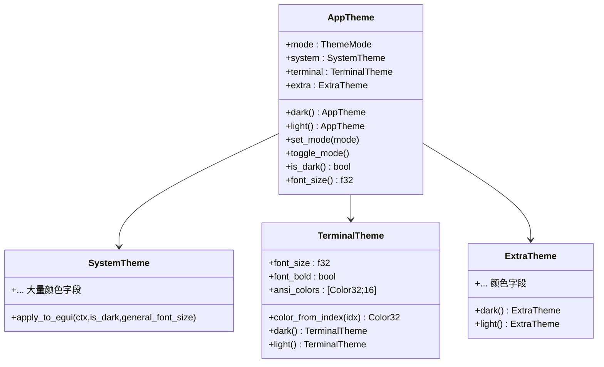
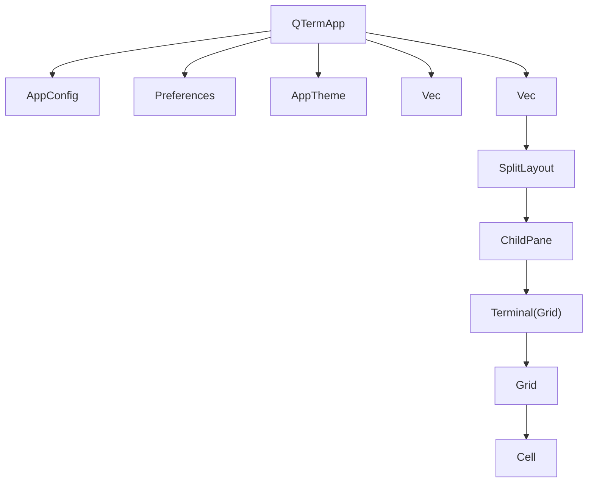
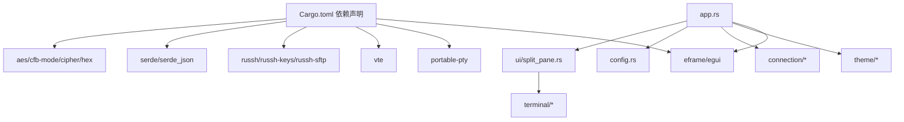

# 数据模型API

<cite>
**本文档引用的文件**
- [src/connection/models.rs](file://src/connection/models.rs)
- [src/connection/mod.rs](file://src/connection/mod.rs)
- [src/terminal/grid.rs](file://src/terminal/grid.rs)
- [src/terminal/cell.rs](file://src/terminal/cell.rs)
- [src/config.rs](file://src/config.rs)
- [src/theme/mod.rs](file://src/theme/mod.rs)
- [src/theme/system.rs](file://src/theme/system.rs)
- [src/theme/terminal.rs](file://src/theme/terminal.rs)
- [src/theme/extra.rs](file://src/theme/extra.rs)
- [src/app.rs](file://src/app.rs)
- [src/ui/split_pane.rs](file://src/ui/split_pane.rs)
- [src/tabs/tab_item.rs](file://src/tabs/tab_item.rs)
- [Cargo.toml](file://Cargo.toml)
</cite>

## 目录
1. [简介](#简介)
2. [项目结构](#项目结构)
3. [核心组件](#核心组件)
4. [架构总览](#架构总览)
5. [详细组件分析](#详细组件分析)
6. [依赖关系分析](#依赖关系分析)
7. [性能考虑](#性能考虑)
8. [故障排除指南](#故障排除指南)
9. [结论](#结论)
10. [附录](#附录)

## 简介
本文件为 QTerm 项目的“数据模型API”参考文档，聚焦以下方面：
- 连接配置模型：连接类型定义、认证信息管理、配置验证与迁移策略
- 终端网格数据模型：单元格操作、行列管理、平移滚动接口
- 配置管理模型：偏好设置读取、写入与默认值处理
- 颜色与样式数据结构：颜色值转换、透明度处理与样式组合
- 数据模型间的关系：引用关系与依赖约束
- 数据序列化与反序列化：INI 与 JSON 支持
- 数据验证与错误处理：边界条件、兼容性与降级策略
- 最佳实践与性能优化建议

## 项目结构
QTerm 采用模块化组织，核心数据模型分布于以下模块：
- 连接配置：src/connection
- 终端网格与单元格：src/terminal
- 配置与偏好：src/config
- 主题与颜色：src/theme
- 应用入口与集成：src/app.rs
- 分屏与标签页：src/ui/split_pane.rs、src/tabs/tab_item.rs

**图表来源**
- [src/connection/mod.rs:1-148](file://src/connection/mod.rs#L1-L148)
- [src/connection/models.rs:1-43](file://src/connection/models.rs#L1-L43)
- [src/terminal/grid.rs:1-148](file://src/terminal/grid.rs#L1-L148)
- [src/terminal/cell.rs:1-75](file://src/terminal/cell.rs#L1-L75)
- [src/config.rs:1-281](file://src/config.rs#L1-L281)
- [src/theme/mod.rs:1-81](file://src/theme/mod.rs#L1-L81)
- [src/theme/system.rs:1-292](file://src/theme/system.rs#L1-L292)
- [src/theme/terminal.rs:1-102](file://src/theme/terminal.rs#L1-L102)
- [src/theme/extra.rs:1-66](file://src/theme/extra.rs#L1-L66)
- [src/app.rs:1-800](file://src/app.rs#L1-L800)
- [src/ui/split_pane.rs:1-238](file://src/ui/split_pane.rs#L1-L238)
- [src/tabs/tab_item.rs:1-48](file://src/tabs/tab_item.rs#L1-L48)

**章节来源**
- [src/connection/mod.rs:1-148](file://src/connection/mod.rs#L1-L148)
- [src/connection/models.rs:1-43](file://src/connection/models.rs#L1-L43)
- [src/terminal/grid.rs:1-148](file://src/terminal/grid.rs#L1-L148)
- [src/terminal/cell.rs:1-75](file://src/terminal/cell.rs#L1-L75)
- [src/config.rs:1-281](file://src/config.rs#L1-L281)
- [src/theme/mod.rs:1-81](file://src/theme/mod.rs#L1-L81)
- [src/theme/system.rs:1-292](file://src/theme/system.rs#L1-L292)
- [src/theme/terminal.rs:1-102](file://src/theme/terminal.rs#L1-L102)
- [src/theme/extra.rs:1-66](file://src/theme/extra.rs#L1-L66)
- [src/app.rs:1-800](file://src/app.rs#L1-L800)
- [src/ui/split_pane.rs:1-238](file://src/ui/split_pane.rs#L1-L238)
- [src/tabs/tab_item.rs:1-48](file://src/tabs/tab_item.rs#L1-L48)

## 核心组件
- 连接配置模型
  - 来源：WhaleTerm connections.json → 解析与解密 → QTerm Connection 列表
  - 关键点：AES-256-CFB 解密、密钥派生、兼容性回退
- 终端网格数据模型
  - Grid：行列、单元格矩阵、回滚缓冲区、滚动偏移
  - Cell：字符、前景/背景色、显示属性
- 配置管理模型
  - AppConfig：窗口位置/尺寸、主题、字体大小、回滚行数、Shell 路径
  - Preferences：从 WhaleTerm preferences.json 读取字体与主题
- 颜色与样式数据结构
  - AppTheme：主题模式、系统主题、终端主题、扩展主题
  - 颜色转换：十六进制字符串 → egui::Color32；ANSI 索引映射
- 应用集成
  - QTermApp：持有 AppConfig、Preferences、AppTheme、连接列表、标签页集合
  - SplitLayout/ChildPane：分屏布局与面板生命周期管理

**章节来源**
- [src/connection/models.rs:1-43](file://src/connection/models.rs#L1-L43)
- [src/connection/mod.rs:1-148](file://src/connection/mod.rs#L1-L148)
- [src/terminal/grid.rs:1-148](file://src/terminal/grid.rs#L1-L148)
- [src/terminal/cell.rs:1-75](file://src/terminal/cell.rs#L1-L75)
- [src/config.rs:1-281](file://src/config.rs#L1-L281)
- [src/theme/mod.rs:1-81](file://src/theme/mod.rs#L1-L81)
- [src/app.rs:1-800](file://src/app.rs#L1-L800)
- [src/ui/split_pane.rs:1-238](file://src/ui/split_pane.rs#L1-L238)
- [src/tabs/tab_item.rs:1-48](file://src/tabs/tab_item.rs#L1-L48)

## 架构总览
QTerm 的数据模型围绕“应用状态”展开：应用配置与偏好驱动主题与字体，连接配置驱动 SSH/SFTP 面板，终端网格承载渲染与交互。

**图表来源**
- [src/app.rs:1-800](file://src/app.rs#L1-L800)
- [src/config.rs:1-281](file://src/config.rs#L1-L281)
- [src/connection/models.rs:1-43](file://src/connection/models.rs#L1-L43)
- [src/terminal/grid.rs:1-148](file://src/terminal/grid.rs#L1-L148)
- [src/terminal/cell.rs:1-75](file://src/terminal/cell.rs#L1-L75)
- [src/theme/mod.rs:1-81](file://src/theme/mod.rs#L1-L81)

## 详细组件分析

### 连接配置模型API
- 数据结构
  - ConnectionsFile：顶层结构，包含分组列表
  - WhaleGroup：分组名 + 连接列表
  - WhaleConnection：连接字段（名称、地址、端口、用户名、加密密码、认证模型、私钥路径）
  - Connection：QTerm 内部使用，包含解密后的密码与分组名
- 认证信息管理
  - 密码解密：AES-256-CFB，格式为 hex(IV[16字节] + ciphertext)，密钥由主板序列号派生，失败时回退硬编码密钥
  - 认证模型：authModel 支持 password/key；privateKey 为私钥文件路径
- 配置验证与迁移
  - 加载 WhaleTerm connections.json，解析失败或文件缺失时返回空列表
  - 解密失败时以空字符串回退，保证应用可用性
- 接口
  - load_connections()：从 WhaleTerm 配置文件加载并解密，返回扁平连接列表
  - decrypt_password()/derive_key()/get_motherboard_serial()：内部实现

**图表来源**
- [src/connection/mod.rs:28-98](file://src/connection/mod.rs#L28-L98)
- [src/connection/models.rs:3-29](file://src/connection/models.rs#L3-L29)

**章节来源**
- [src/connection/models.rs:1-43](file://src/connection/models.rs#L1-L43)
- [src/connection/mod.rs:1-148](file://src/connection/mod.rs#L1-L148)

### 终端网格数据模型API
- Grid
  - 字段：rows、cols、cells（二维单元格矩阵）、scrollback（回滚缓冲区）、max_scrollback、scroll_offset
  - 方法：new(rows, cols, max_scrollback)、cell(row,col)/cell_mut(row,col)、row(row)、scroll_up()/scroll_down()、clear_row()/clear_row_from()/clear_row_to()、insert_lines()/delete_lines()、resize(new_rows,new_cols)、scrollback_len()/scrollback_row(idx)、text_in_range(start_row..=end_col)
- Cell
  - 字段：ch、fg、bg、attrs
  - 属性：CellAttrs（粗体、斜体、下划线、删除线、反色）
  - 颜色：TermColor（Default/Indexed/Rgb），支持 to_color32(is_fg, theme)
- 行为与复杂度
  - 单次滚动/插入/删除：O(cols) 或 O(rows)（取决于具体操作）
  - 文本提取 text_in_range：O(行数×列数)
  - 回滚缓冲区：VecDeque，容量受 max_scrollback 限制

**图表来源**
- [src/terminal/grid.rs:16-148](file://src/terminal/grid.rs#L16-L148)
- [src/terminal/cell.rs:55-75](file://src/terminal/cell.rs#L55-L75)

**章节来源**
- [src/terminal/grid.rs:1-148](file://src/terminal/grid.rs#L1-L148)
- [src/terminal/cell.rs:1-75](file://src/terminal/cell.rs#L1-L75)

### 配置管理模型API
- AppConfig
  - 字段：窗口位置/尺寸（Option）、最大化、字体大小、回滚行数、主题、Shell 路径
  - 默认值：Default 实现，提供合理缺省
  - 方法：load() 从 config.ini 读取；save() 写入 config.ini
  - INI 解析：parse_ini 忽略注释与空行，按 key=value 解析
- Preferences
  - 字段：来自 WhaleTerm preferences.json 的字体族、字体大小、粗体、主题
  - 默认值：Default 实现，字体大小与主题有安全下限
  - 方法：load() 从 preferences.json 读取，解析失败或缺失时回退默认
- 序列化与反序列化
  - INI：自定义解析器
  - JSON：serde_json 反序列化

**图表来源**
- [src/config.rs:68-127](file://src/config.rs#L68-L127)
- [src/config.rs:129-143](file://src/config.rs#L129-L143)
- [src/config.rs:239-281](file://src/config.rs#L239-L281)

**章节来源**
- [src/config.rs:1-281](file://src/config.rs#L1-L281)

### 颜色与样式数据结构API
- AppTheme
  - 字段：mode、system、terminal、extra
  - 方法：dark()/light() 创建主题；set_mode()/toggle_mode() 切换；is_dark() 查询；font_size() 获取
- SystemTheme/TerminalTheme/ExtraTheme
  - 提供 UI、终端、扩展组件的颜色集合
  - 提供 apply_to_egui() 将主题应用到 egui 全局样式
- 颜色转换
  - parse_color()：十六进制字符串 → egui::Color32
  - TerminalTheme.color_from_index()：ANSI 颜色索引映射到 Color32（标准16色、216色立方体、24灰阶）

**图表来源**
- [src/theme/mod.rs:14-71](file://src/theme/mod.rs#L14-L71)
- [src/theme/system.rs:1-292](file://src/theme/system.rs#L1-L292)
- [src/theme/terminal.rs:1-102](file://src/theme/terminal.rs#L1-L102)
- [src/theme/extra.rs:1-66](file://src/theme/extra.rs#L1-L66)

**章节来源**
- [src/theme/mod.rs:1-81](file://src/theme/mod.rs#L1-L81)
- [src/theme/system.rs:1-292](file://src/theme/system.rs#L1-L292)
- [src/theme/terminal.rs:1-102](file://src/theme/terminal.rs#L1-L102)
- [src/theme/extra.rs:1-66](file://src/theme/extra.rs#L1-L66)

### 数据模型之间的关系与依赖
- QTermApp 依赖 AppConfig/Preferences/AppTheme/Connection/Tab/SplitLayout/Grid/Cell
- SplitLayout/ChildPane 管理终端/SSH/SFTP 面板生命周期，并与 Grid/Cell 交互
- 连接配置通过 connection/mod.rs 加载并注入到应用状态中
- 主题与字体影响 UI 与终端渲染

**图表来源**
- [src/app.rs:16-36](file://src/app.rs#L16-L36)
- [src/tabs/tab_item.rs:3-9](file://src/tabs/tab_item.rs#L3-L9)
- [src/ui/split_pane.rs:151-157](file://src/ui/split_pane.rs#L151-L157)
- [src/terminal/grid.rs:5-14](file://src/terminal/grid.rs#L5-L14)

**章节来源**
- [src/app.rs:1-800](file://src/app.rs#L1-L800)
- [src/tabs/tab_item.rs:1-48](file://src/tabs/tab_item.rs#L1-L48)
- [src/ui/split_pane.rs:1-238](file://src/ui/split_pane.rs#L1-L238)
- [src/terminal/grid.rs:1-148](file://src/terminal/grid.rs#L1-L148)

## 依赖关系分析
- 外部依赖
  - eframe/egui：UI 框架与渲染
  - portable-pty/vte：本地终端与ANSI解析
  - russh/russh-keys/russh-sftp：SSH/SFTP
  - serde/serde_json：JSON 序列化
  - aes/cfb-mode/cipher/hex：AES-256-CFB 解密与十六进制编解码
- 内部模块耦合
  - connection 与 app：连接列表注入
  - terminal 与 ui：Grid/Cell 与 SplitLayout/ChildPane 的数据与生命周期耦合
  - theme 与 app：主题与字体应用到 egui

**图表来源**
- [Cargo.toml:8-25](file://Cargo.toml#L8-L25)
- [src/app.rs:1-800](file://src/app.rs#L1-L800)
- [src/ui/split_pane.rs:1-238](file://src/ui/split_pane.rs#L1-L238)
- [src/terminal/grid.rs:1-148](file://src/terminal/grid.rs#L1-L148)
- [src/theme/mod.rs:1-81](file://src/theme/mod.rs#L1-L81)
- [src/connection/mod.rs:1-148](file://src/connection/mod.rs#L1-L148)
- [src/config.rs:1-281](file://src/config.rs#L1-L281)

**章节来源**
- [Cargo.toml:1-30](file://Cargo.toml#L1-L30)
- [src/app.rs:1-800](file://src/app.rs#L1-L800)

## 性能考虑
- 终端网格
  - 滚动/插入/删除：尽量批量操作，避免频繁 resize
  - 回滚缓冲区：合理设置 max_scrollback，避免内存膨胀
  - 文本提取：text_in_range 会遍历多行，建议在 UI 交互中做节流
- 连接配置
  - 解密：AES-256-CFB 为 CPU 密集型，建议异步执行或缓存解密结果
  - 密钥派生：get_motherboard_serial 为外部命令调用，建议缓存结果
- 配置与主题
  - INI/JSON 解析：一次性读取并解析，避免频繁 IO
  - egui 应用主题：统一在初始化阶段应用，减少重复设置
- 并发与异步
  - 依赖 tokio，建议在 SSH/SFTP/PTY 读写中使用非阻塞通道与轮询

[本节为通用指导，无需特定文件来源]

## 故障排除指南
- 连接配置
  - connections.json 无法读取/解析：返回空列表，应用仍可启动
  - 密码解密失败：返回空字符串，不影响其他连接
  - 密钥派生失败：使用硬编码回退密钥
- 配置文件
  - config.ini 缺失或格式错误：使用默认值
  - preferences.json 缺失或格式错误：使用默认值
- 终端渲染
  - 文本复制为空：确认 text_in_range 调用参数与 Grid 尺寸一致
  - 滚动异常：检查 scroll_offset 与 max_scrollback 设置
- 主题应用
  - egui 颜色不生效：确认 apply_to_egui 已调用且 is_dark 与 general_font_size 正确

**章节来源**
- [src/connection/mod.rs:30-98](file://src/connection/mod.rs#L30-L98)
- [src/config.rs:68-127](file://src/config.rs#L68-L127)
- [src/config.rs:239-281](file://src/config.rs#L239-L281)
- [src/terminal/grid.rs:126-148](file://src/terminal/grid.rs#L126-L148)
- [src/theme/system.rs:158-292](file://src/theme/system.rs#L158-L292)

## 结论
QTerm 的数据模型API围绕“连接配置、终端网格、配置与主题”三大领域构建，具备良好的模块化与可扩展性。通过合理的默认值、兼容性回退与清晰的接口设计，确保在不同平台与配置下的稳定性。建议在实际使用中关注性能热点（解密、IO、渲染）并结合异步与缓存策略进行优化。

[本节为总结，无需特定文件来源]

## 附录
- 序列化与反序列化支持
  - INI：config.ini（自定义解析器）
  - JSON：connections.json（WhaleTerm）、preferences.json（WhaleTerm）
- 错误处理策略
  - 解析失败/文件缺失：返回默认值或空列表
  - 外部命令失败：回退安全路径
  - 运行时异常：记录日志并保持 UI 可用

[本节为概览，无需特定文件来源]