# 终端网格模型

<cite>
**本文档引用的文件**
- [grid.rs](file://src/terminal/grid.rs)
- [cell.rs](file://src/terminal/cell.rs)
- [parser.rs](file://src/terminal/parser.rs)
- [mod.rs](file://src/terminal/mod.rs)
- [renderer.rs](file://src/terminal/renderer.rs)
- [terminal.rs](file://src/theme/terminal.rs)
- [Cargo.toml](file://Cargo.toml)
</cite>

## 目录
1. [简介](#简介)
2. [项目结构](#项目结构)
3. [核心组件](#核心组件)
4. [架构概览](#架构概览)
5. [详细组件分析](#详细组件分析)
6. [依赖关系分析](#依赖关系分析)
7. [性能考虑](#性能考虑)
8. [故障排除指南](#故障排除指南)
9. [结论](#结论)

## 简介

QTerm是一个轻量级跨平台终端模拟器，其核心功能围绕终端网格模型构建。该网格模型负责管理屏幕上的字符单元格、历史回滚缓冲区以及滚动机制。本文档详细介绍了Grid结构体的数据结构和网格操作接口，Cell单元格的数据结构，以及网格与VTE解析器的交互方式。

## 项目结构

QTerm项目采用模块化设计，终端相关功能集中在`src/terminal/`目录下：

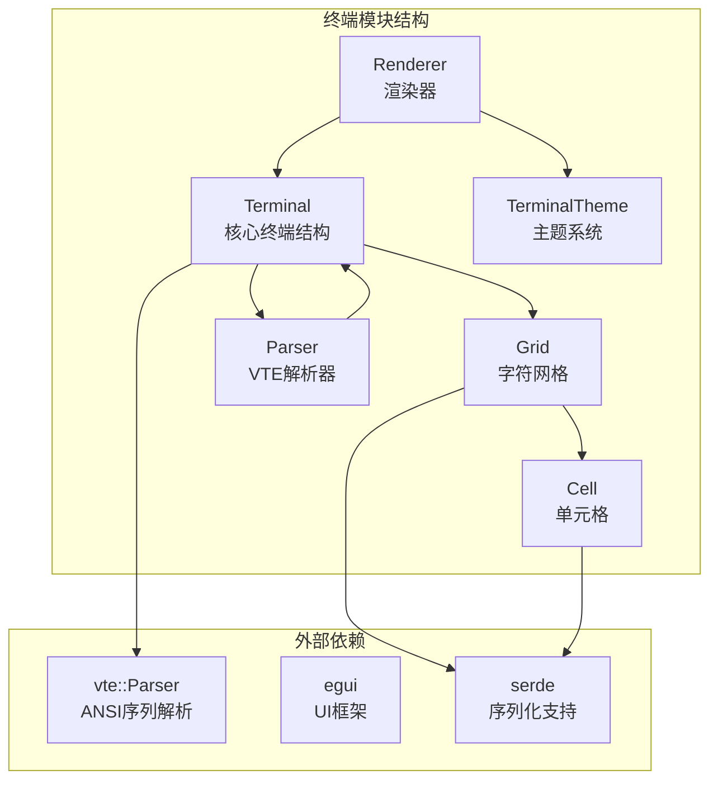

**图表来源**
- [mod.rs:24-41](file://src/terminal/mod.rs#L24-L41)
- [grid.rs:7-14](file://src/terminal/grid.rs#L7-L14)
- [cell.rs:57-75](file://src/terminal/cell.rs#L57-L75)

**章节来源**
- [mod.rs:1-200](file://src/terminal/mod.rs#L1-L200)
- [Cargo.toml:8-25](file://Cargo.toml#L8-L25)

## 核心组件

### Grid结构体

Grid是终端网格模型的核心，负责管理屏幕字符矩阵和历史回滚缓冲区：

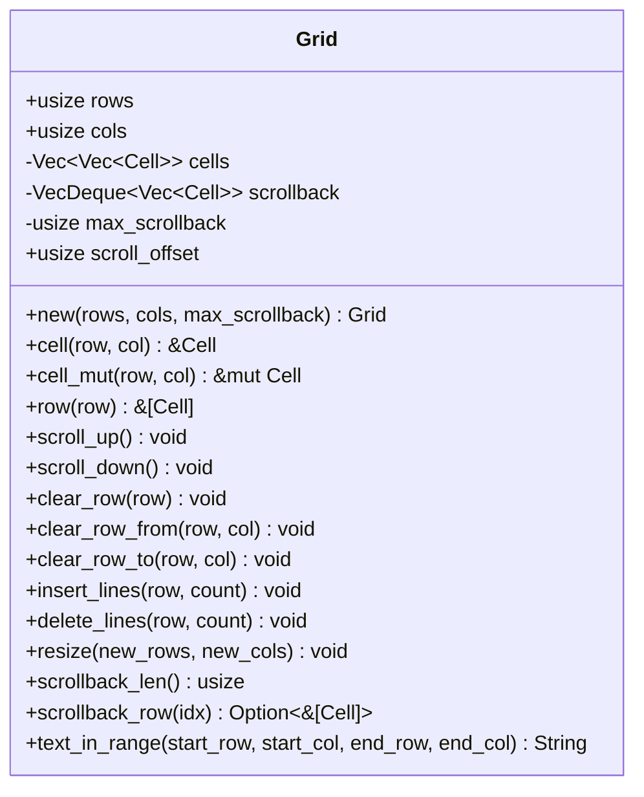

**图表来源**
- [grid.rs:7-148](file://src/terminal/grid.rs#L7-L148)

### Cell单元格结构

Cell代表屏幕上的单个字符单元格，包含字符内容、颜色属性和显示样式：

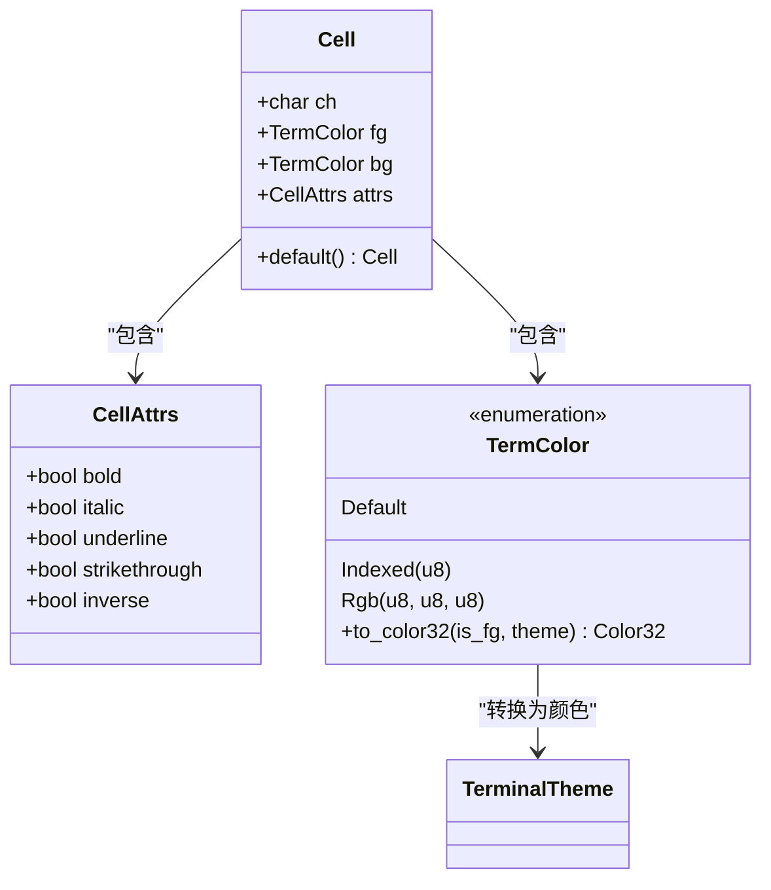

**图表来源**
- [cell.rs:57-75](file://src/terminal/cell.rs#L57-L75)
- [cell.rs:5-25](file://src/terminal/cell.rs#L5-L25)
- [cell.rs:27-53](file://src/terminal/cell.rs#L27-L53)

**章节来源**
- [grid.rs:16-148](file://src/terminal/grid.rs#L16-L148)
- [cell.rs:1-75](file://src/terminal/cell.rs#L1-L75)

## 架构概览

终端网格模型采用分层架构设计，各组件职责明确：

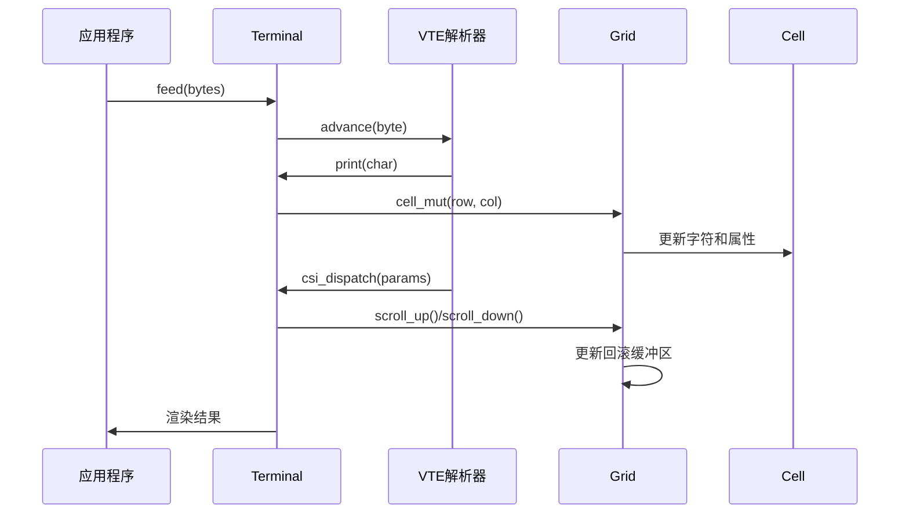

**图表来源**
- [mod.rs:67-74](file://src/terminal/mod.rs#L67-L74)
- [parser.rs:10-32](file://src/terminal/parser.rs#L10-L32)
- [grid.rs:47-61](file://src/terminal/grid.rs#L47-L61)

## 详细组件分析

### 网格初始化和生命周期

Grid的初始化过程涉及多个步骤：

1. **创建阶段**：初始化指定行列数的单元格矩阵
2. **缓冲区设置**：创建空的回滚缓冲区
3. **配置完成**：设置最大回滚行数和初始滚动偏移

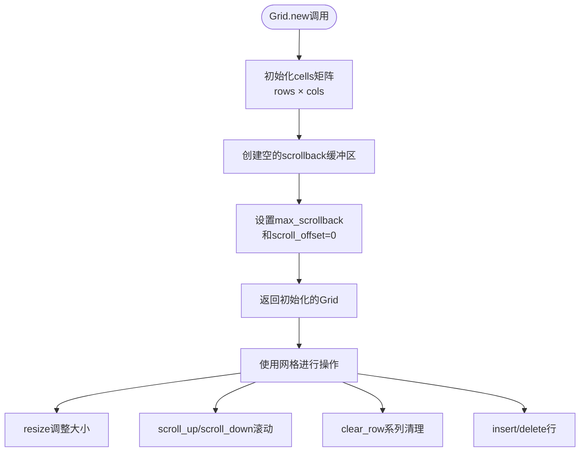

**图表来源**
- [grid.rs:19-29](file://src/terminal/grid.rs#L19-L29)

**章节来源**
- [grid.rs:16-29](file://src/terminal/grid.rs#L16-L29)

### 网格滚动机制

网格支持多种滚动操作，每种都有特定的行为模式：

#### 向上滚动（scroll_up）

向上滚动会将顶部行移入回滚缓冲区，同时在底部添加新行：

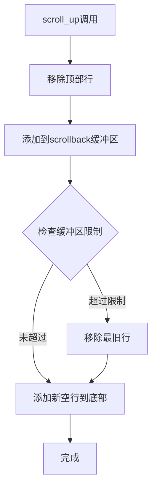

**图表来源**
- [grid.rs:47-55](file://src/terminal/grid.rs#L47-L55)

#### 向下滚动（scroll_down）

向下滚动会移除底部行并在顶部添加新行：

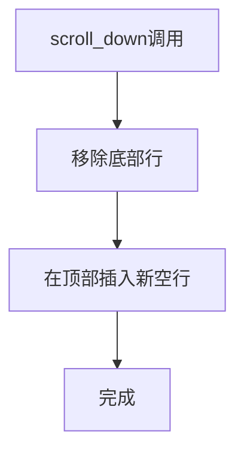

**图表来源**
- [grid.rs:57-61](file://src/terminal/grid.rs#L57-L61)

**章节来源**
- [grid.rs:46-102](file://src/terminal/grid.rs#L46-L102)

### 网格操作接口

#### 单元格访问方法

网格提供了多种单元格访问方式：

| 方法 | 功能 | 时间复杂度 |
|------|------|------------|
| `cell(row, col)` | 获取只读单元格引用 | O(1) |
| `cell_mut(row, col)` | 获取可变单元格引用 | O(1) |
| `row(row)` | 获取整行单元格切片 | O(1) |

#### 行操作方法

网格支持多种行级别的操作：

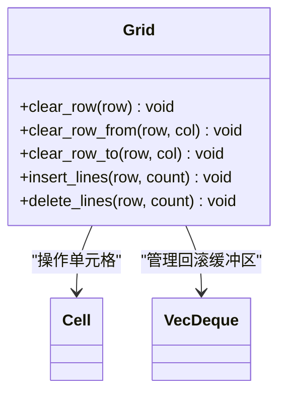

**图表来源**
- [grid.rs:63-102](file://src/terminal/grid.rs#L63-L102)

**章节来源**
- [grid.rs:31-102](file://src/terminal/grid.rs#L31-L102)

### 文本选择和复制

网格支持文本选择功能，用于复制选中的文本内容：

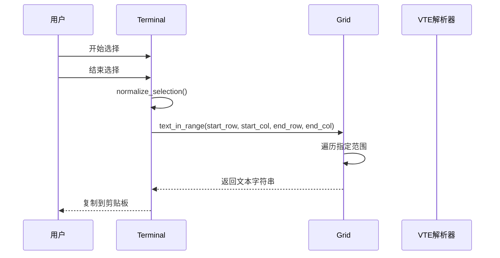

**图表来源**
- [mod.rs:137-155](file://src/terminal/mod.rs#L137-L155)
- [grid.rs:126-147](file://src/terminal/grid.rs#L126-L147)

**章节来源**
- [mod.rs:137-155](file://src/terminal/mod.rs#L137-L155)
- [grid.rs:126-147](file://src/terminal/grid.rs#L126-L147)

### VTE解析器集成

网格与VTE解析器紧密集成，通过Performer结构体实现：

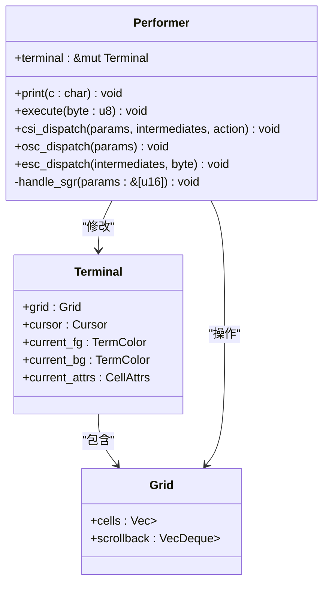

**图表来源**
- [parser.rs:6-8](file://src/terminal/parser.rs#L6-L8)
- [parser.rs:10-311](file://src/terminal/parser.rs#L10-L311)

**章节来源**
- [parser.rs:1-311](file://src/terminal/parser.rs#L1-L311)

## 依赖关系分析

### 外部依赖

项目使用了多个关键的外部依赖：

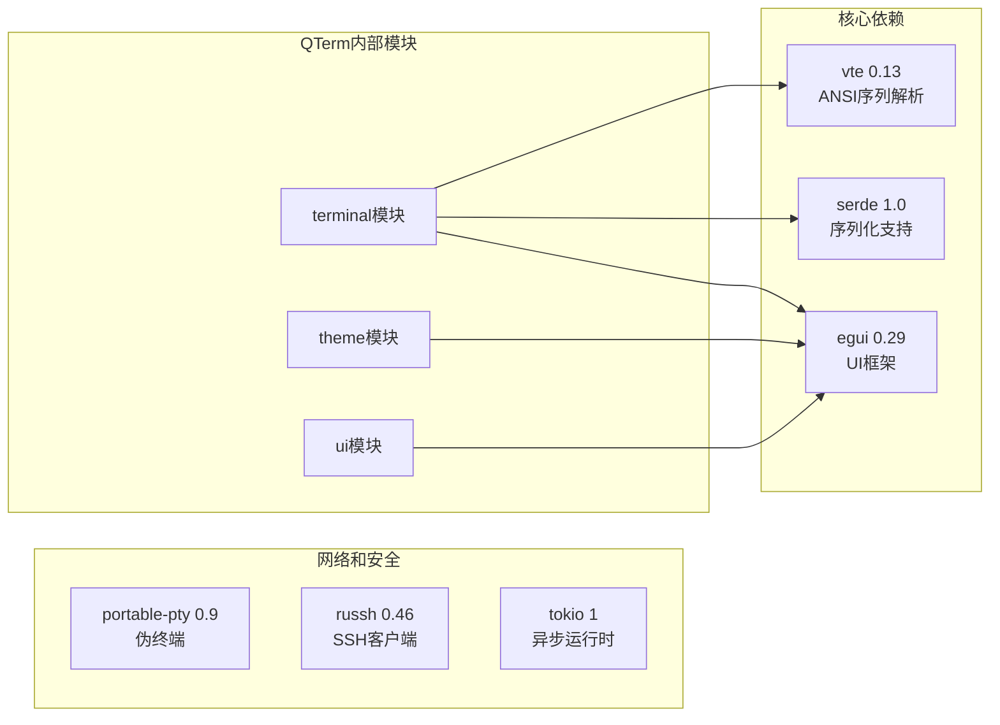

**图表来源**
- [Cargo.toml:8-25](file://Cargo.toml#L8-L25)

### 内部模块依赖

终端模块内部的依赖关系清晰明确：

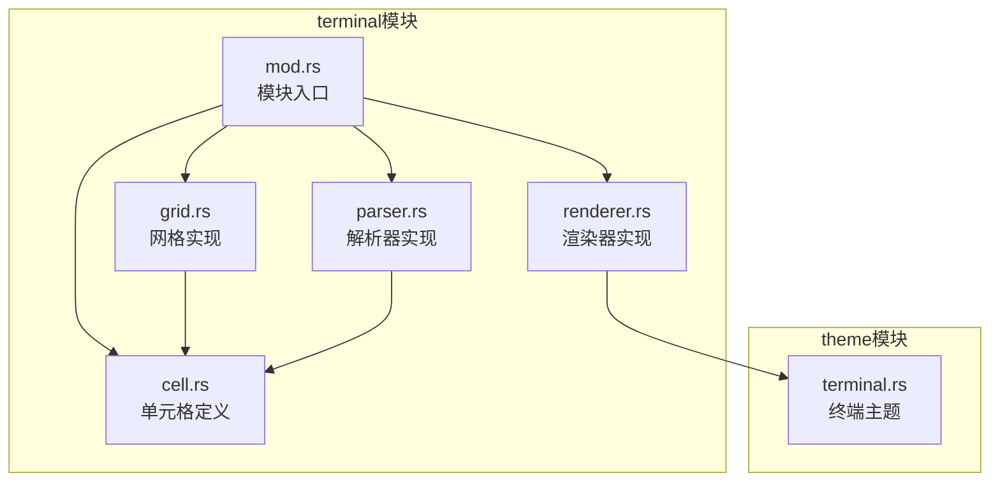

**图表来源**
- [mod.rs:1-4](file://src/terminal/mod.rs#L1-L4)

**章节来源**
- [Cargo.toml:8-25](file://Cargo.toml#L8-L25)
- [mod.rs:1-4](file://src/terminal/mod.rs#L1-L4)

## 性能考虑

### 内存管理策略

1. **回滚缓冲区限制**：通过`max_scrollback`参数限制历史记录大小，防止内存无限增长
2. **VecDeque优化**：使用双端队列高效管理历史行的添加和删除
3. **按需分配**：单元格在需要时才创建，避免不必要的内存占用

### 渲染性能优化

渲染器采用了多项优化技术：

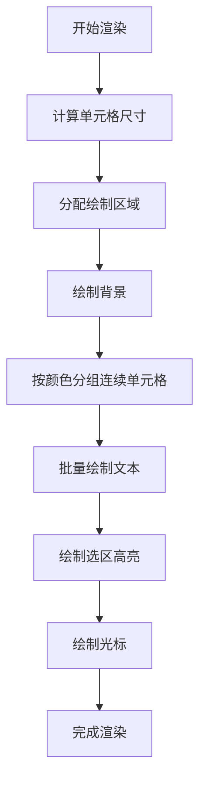

**图表来源**
- [renderer.rs:80-107](file://src/terminal/renderer.rs#L80-L107)

### 网格操作优化

1. **O(1)访问**：单元格访问和行访问都是常数时间操作
2. **批量操作**：行级别操作可以一次性处理多行
3. **边界检查**：所有操作都包含适当的边界检查，避免越界访问

**章节来源**
- [renderer.rs:80-107](file://src/terminal/renderer.rs#L80-L107)
- [grid.rs:106-114](file://src/terminal/grid.rs#L106-L114)

## 故障排除指南

### 常见问题和解决方案

#### 网格大小不匹配

当终端窗口大小改变时，需要及时调整网格大小：

```rust
// 正确的做法
terminal.resize(new_rows, new_cols);

// 错误的做法
// 直接修改Grid的rows和cols字段而不调用resize方法
```

#### 滚动缓冲区溢出

当回滚缓冲区达到最大限制时，最旧的历史记录会被自动移除：

```rust
// 检查当前缓冲区大小
let current_size = grid.scrollback_len();

// 设置合适的最大缓冲区大小
let max_size = 10000; // 根据内存情况调整
```

#### 文本选择异常

当遇到文本选择问题时，检查选择范围的有效性：

```rust
// 获取标准化的选择范围
if let Some((sr, sc, er, ec)) = terminal.normalized_selection() {
    // 正常处理选择
} else {
    // 处理无效选择
}
```

**章节来源**
- [mod.rs:86-98](file://src/terminal/mod.rs#L86-L98)
- [mod.rs:147-155](file://src/terminal/mod.rs#L147-L155)

## 结论

QTerm的终端网格模型设计精良，具有以下特点：

1. **清晰的架构**：Grid、Cell、Terminal等组件职责明确，耦合度低
2. **高效的实现**：所有核心操作都是O(1)时间复杂度
3. **完整的功能**：支持滚动、选择、渲染等终端必备功能
4. **良好的扩展性**：模块化设计便于功能扩展和维护

该网格模型为QTerm提供了稳定可靠的终端模拟基础，能够满足大多数终端应用的需求。通过合理的性能优化和内存管理策略，可以在保证功能完整性的同时保持良好的运行效率。