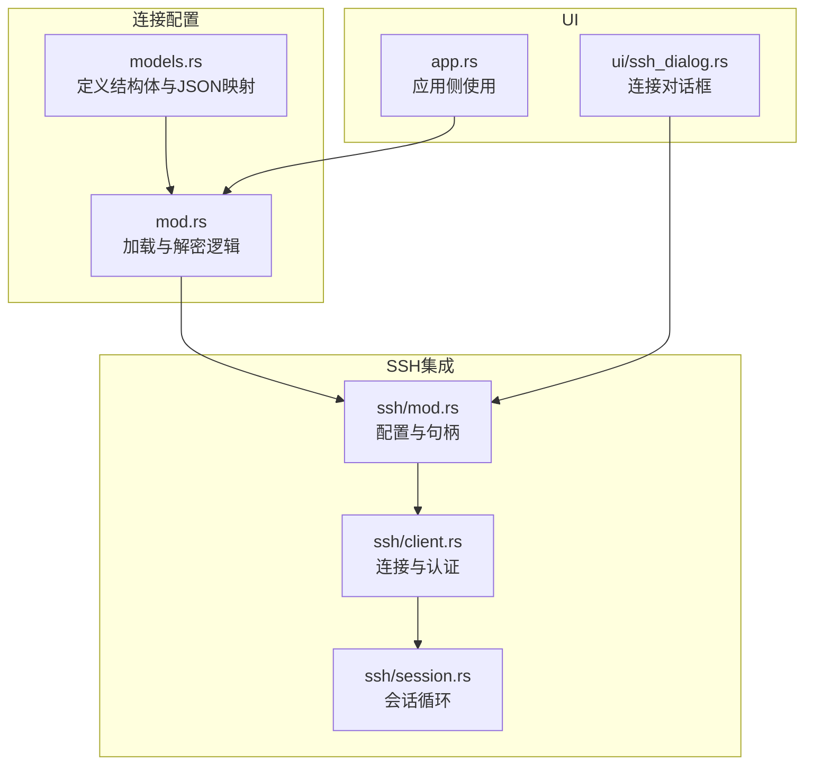
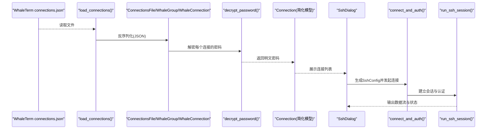
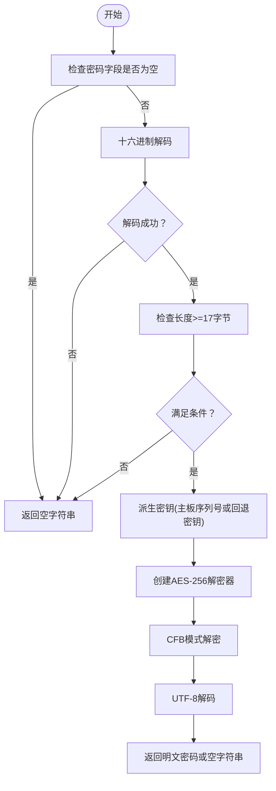
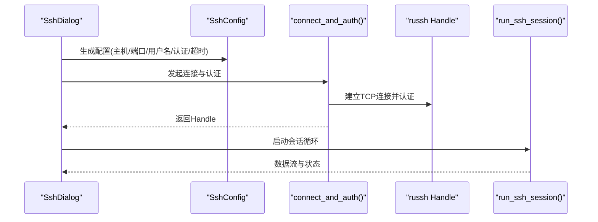
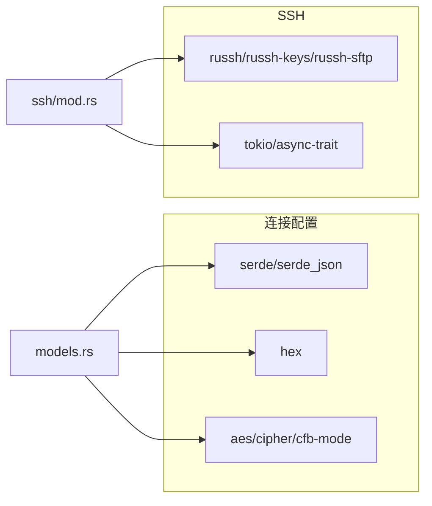

# 连接配置模型

<cite>
**本文引用的文件**
- [src/connection/models.rs](file://src/connection/models.rs)
- [src/connection/mod.rs](file://src/connection/mod.rs)
- [src/ssh/mod.rs](file://src/ssh/mod.rs)
- [src/ssh/client.rs](file://src/ssh/client.rs)
- [src/ssh/session.rs](file://src/ssh/session.rs)
- [src/ui/ssh_dialog.rs](file://src/ui/ssh_dialog.rs)
- [src/app.rs](file://src/app.rs)
- [Cargo.toml](file://Cargo.toml)
</cite>

## 目录
1. [简介](#简介)
2. [项目结构](#项目结构)
3. [核心组件](#核心组件)
4. [架构总览](#架构总览)
5. [详细组件分析](#详细组件分析)
6. [依赖关系分析](#依赖关系分析)
7. [性能考虑](#性能考虑)
8. [故障排查指南](#故障排查指南)
9. [结论](#结论)
10. [附录](#附录)

## 简介
本文件面向QTerm项目的连接配置模型，系统性地阐述以下内容：
- ConnectionsFile、WhaleGroup、WhaleConnection结构体的字段定义、数据类型与用途
- Connection简化连接模型的设计目的与使用场景
- 连接配置的序列化与反序列化流程（JSON字段映射与默认值处理）
- 连接组的组织结构与嵌套关系
- 连接配置的验证规则与错误处理机制
- 连接配置的导入与导出接口及数据迁移方法
- 实际配置示例与最佳实践
- 连接配置与SSH客户端的集成方式

## 项目结构
连接配置模型位于connection模块，负责解析WhaleTerm的connections.json并将其转换为QTerm内部使用的简化连接模型；同时，SSH模块提供基于russh的连接与认证能力，UI层提供交互式连接对话框。

图表来源
- [src/connection/models.rs:1-43](file://src/connection/models.rs#L1-L43)
- [src/connection/mod.rs:1-148](file://src/connection/mod.rs#L1-L148)
- [src/ssh/mod.rs:1-136](file://src/ssh/mod.rs#L1-L136)
- [src/ssh/client.rs:1-63](file://src/ssh/client.rs#L1-L63)
- [src/ssh/session.rs:1-90](file://src/ssh/session.rs#L1-L90)
- [src/ui/ssh_dialog.rs:1-147](file://src/ui/ssh_dialog.rs#L1-L147)
- [src/app.rs:857-894](file://src/app.rs#L857-L894)

章节来源
- [src/connection/models.rs:1-43](file://src/connection/models.rs#L1-L43)
- [src/connection/mod.rs:1-148](file://src/connection/mod.rs#L1-L148)
- [src/ssh/mod.rs:1-136](file://src/ssh/mod.rs#L1-L136)
- [src/ssh/client.rs:1-63](file://src/ssh/client.rs#L1-L63)
- [src/ssh/session.rs:1-90](file://src/ssh/session.rs#L1-L90)
- [src/ui/ssh_dialog.rs:1-147](file://src/ui/ssh_dialog.rs#L1-L147)
- [src/app.rs:857-894](file://src/app.rs#L857-L894)

## 核心组件
- ConnectionsFile：顶层容器，包含多个连接分组
- WhaleGroup：连接分组，包含分组名称与连接列表
- WhaleConnection：单个连接配置，包含主机、端口、用户名、加密密码、认证模型与私钥路径
- Connection：QTerm内部简化连接模型，包含解密后的密码与分组名称

章节来源
- [src/connection/models.rs:3-43](file://src/connection/models.rs#L3-L43)

## 架构总览
下图展示了从WhaleTerm配置文件到QTerm内部连接模型的转换流程，以及与SSH客户端的集成路径。

图表来源
- [src/connection/mod.rs:28-59](file://src/connection/mod.rs#L28-L59)
- [src/connection/models.rs:3-43](file://src/connection/models.rs#L3-L43)
- [src/ui/ssh_dialog.rs:115-147](file://src/ui/ssh_dialog.rs#L115-L147)
- [src/ssh/client.rs:25-63](file://src/ssh/client.rs#L25-L63)
- [src/ssh/session.rs:11-90](file://src/ssh/session.rs#L11-L90)

## 详细组件分析

### 结构体定义与JSON映射
- ConnectionsFile
  - 字段：groups（Vec<WhaleGroup>）
  - 用途：顶层容器，承载所有连接分组
- WhaleGroup
  - 字段：group_name（String）、connections（Vec<WhaleConnection>）
  - JSON映射：group_name通过serde rename映射为groupName
- WhaleConnection
  - 字段：name、addr、port、username、password、auth_model、private_key
  - JSON映射：authModel与privateKey通过serde rename映射；authModel与privateKey带默认值
- Connection（简化模型）
  - 字段：name、addr、port、username、password（解密后）、private_key、auth_model、group_name
  - 用途：供UI与会话层直接使用，避免重复解密与分组信息丢失

章节来源
- [src/connection/models.rs:3-43](file://src/connection/models.rs#L3-L43)

### 序列化与反序列化流程
- JSON字段映射
  - WhaleGroup.group_name ↔ groupName
  - WhaleConnection.auth_model ↔ authModel（默认值）
  - WhaleConnection.private_key ↔ privateKey（默认值）
- 默认值处理
  - authModel与privateKey在反序列化时若缺失则采用空字符串
- 反序列化入口
  - load_connections()读取文件并调用JSON解析，随后展开为扁平连接列表

章节来源
- [src/connection/models.rs:10-29](file://src/connection/models.rs#L10-L29)
- [src/connection/mod.rs:30-59](file://src/connection/mod.rs#L30-L59)

### 密码解密与密钥派生
- 解密算法：AES-256-CFB
- 密文格式：hex(IV[16字节] + ciphertext)
- 密钥派生：优先使用主板序列号派生32字节密钥，失败时使用硬编码回退密钥
- 解密失败处理：输入为空、长度不足、hex解码失败、密钥构造失败均返回空字符串

图表来源
- [src/connection/mod.rs:64-98](file://src/connection/mod.rs#L64-L98)
- [src/connection/mod.rs:100-137](file://src/connection/mod.rs#L100-L137)

章节来源
- [src/connection/mod.rs:64-98](file://src/connection/mod.rs#L64-L98)
- [src/connection/mod.rs:100-137](file://src/connection/mod.rs#L100-L137)

### 连接组的组织结构与嵌套关系
- 组织结构：ConnectionsFile(groups) → WhaleGroup(group_name, connections) → WhaleConnection(name, addr, port, username, password, auth_model, private_key)
- 嵌套关系：多层级嵌套，支持按分组展示与管理
- 展开策略：load_connections()将分组内的连接展平为扁平列表，便于UI与会话层统一处理

章节来源
- [src/connection/models.rs:3-29](file://src/connection/models.rs#L3-L29)
- [src/connection/mod.rs:41-58](file://src/connection/mod.rs#L41-L58)

### 连接配置的验证规则与错误处理
- 加载阶段
  - 文件读取失败：返回空列表
  - JSON解析失败：返回空列表
- 解密阶段
  - 输入为空或格式异常：返回空字符串
  - 密钥派生失败：返回空字符串
- UI交互阶段
  - SshDialog校验主机与用户名必填，认证模式切换时动态显示相应字段
  - 生成SshConfig后交由connect_and_auth()执行连接与认证

章节来源
- [src/connection/mod.rs:30-59](file://src/connection/mod.rs#L30-L59)
- [src/ui/ssh_dialog.rs:115-147](file://src/ui/ssh_dialog.rs#L115-L147)
- [src/ssh/client.rs:25-63](file://src/ssh/client.rs#L25-L63)

### 导入与导出接口与数据迁移
- 导入
  - 从WhaleTerm配置文件路径加载connections.json并解析为Connection列表
  - 路径策略：Windows使用%APPDATA%\WhaleTerm\connections.json，非Windows使用~/.config/WhaleTerm/connections.json
- 导出
  - 代码中未提供直接导出接口；可通过UI层或自定义工具将Connection列表序列化为WhaleTerm兼容的JSON结构
- 数据迁移
  - 从WhaleTerm迁移：保持groupName、authModel、privateKey字段映射一致即可
  - 密码迁移：确保WhaleTerm侧使用相同的AES-256-CFB加密格式与密钥派生策略

章节来源
- [src/connection/mod.rs:7-26](file://src/connection/mod.rs#L7-L26)
- [src/connection/mod.rs:30-59](file://src/connection/mod.rs#L30-L59)
- [src/connection/models.rs:10-29](file://src/connection/models.rs#L10-L29)

### 与SSH客户端的集成
- 配置生成
  - UI层根据用户输入生成SshConfig（host、port、username、auth、timeout_secs）
- 连接与认证
  - connect_and_auth()根据SshAuth选择密码或私钥认证，返回可复用的russh客户端句柄
- 会话管理
  - run_ssh_session()在后台线程中维护会话循环，处理数据读写与终端大小调整
- 会话复用
  - SshHandle持有共享的russh客户端句柄，可用于SFTP等子系统

图表来源
- [src/ui/ssh_dialog.rs:115-147](file://src/ui/ssh_dialog.rs#L115-L147)
- [src/ssh/client.rs:25-63](file://src/ssh/client.rs#L25-L63)
- [src/ssh/session.rs:11-90](file://src/ssh/session.rs#L11-L90)
- [src/ssh/mod.rs:58-136](file://src/ssh/mod.rs#L58-L136)

章节来源
- [src/ui/ssh_dialog.rs:1-147](file://src/ui/ssh_dialog.rs#L1-L147)
- [src/ssh/client.rs:1-63](file://src/ssh/client.rs#L1-L63)
- [src/ssh/session.rs:1-90](file://src/ssh/session.rs#L1-L90)
- [src/ssh/mod.rs:18-66](file://src/ssh/mod.rs#L18-L66)

### 实际配置示例与最佳实践
- 示例结构要点
  - 顶层：groups数组
  - 分组：groupName标识分组名，connections为该分组下的连接列表
  - 连接：name、addr、port、username、password（AES-256-CFB hex密文）、authModel（password或key）、privateKey（可选）
- 最佳实践
  - 使用groupName对连接进行逻辑分组，便于UI展示与管理
  - authModel与privateKey保留默认值时应确保后续逻辑能正确处理空字符串
  - 密码采用AES-256-CFB加密，确保密钥派生策略与WhaleTerm一致
  - UI层在连接前进行必填字段校验，减少无效连接尝试

章节来源
- [src/connection/models.rs:3-29](file://src/connection/models.rs#L3-L29)
- [src/ui/ssh_dialog.rs:115-147](file://src/ui/ssh_dialog.rs#L115-L147)

## 依赖关系分析
- 连接配置模块依赖
  - serde与serde_json：JSON序列化与反序列化
  - hex：十六进制编解码
  - aes、cipher、cfb-mode：AES-256-CFB解密
- SSH模块依赖
  - russh、russh-keys、russh-sftp：SSH协议栈与SFTP子系统
  - tokio：异步运行时与通道
  - async-trait：异步trait实现

图表来源
- [Cargo.toml:8-25](file://Cargo.toml#L8-L25)
- [src/connection/models.rs:1](file://src/connection/models.rs#L1)
- [src/ssh/mod.rs:1](file://src/ssh/mod.rs#L1)

章节来源
- [Cargo.toml:8-25](file://Cargo.toml#L8-L25)
- [src/connection/models.rs:1](file://src/connection/models.rs#L1)
- [src/ssh/mod.rs:1](file://src/ssh/mod.rs#L1)

## 性能考虑
- 解密成本：AES-256-CFB解密在每次加载连接时执行，建议仅在需要时触发（如首次加载或切换配置源）
- 并发与线程：SSH会话在独立线程中运行，避免阻塞UI；russh客户端句柄共享，降低重复握手成本
- I/O优化：文件读取与JSON解析采用一次性读取与解析，减少多次系统调用

## 故障排查指南
- 无法加载连接
  - 检查配置文件路径是否存在且可读
  - 确认JSON格式正确，字段命名符合映射规则
- 密码解密失败
  - 确认password字段为合法hex字符串，长度至少17字节
  - 检查主板序列号派生是否可用，必要时确认回退密钥可用
- 连接失败
  - 校验主机、端口、用户名是否填写
  - 检查认证方式与凭据（密码或私钥路径与口令）
  - 查看SshError错误信息定位具体环节

章节来源
- [src/connection/mod.rs:30-59](file://src/connection/mod.rs#L30-L59)
- [src/ui/ssh_dialog.rs:115-147](file://src/ui/ssh_dialog.rs#L115-L147)
- [src/ssh/client.rs:25-63](file://src/ssh/client.rs#L25-L63)

## 结论
QTerm的连接配置模型以WhaleTerm兼容的JSON结构为基础，通过清晰的结构体定义与严格的JSON映射，实现了从外部配置到内部简化模型的平滑转换。配合AES-256-CFB解密与russh的SSH集成，既保证了跨平台兼容性，又提供了良好的扩展性与安全性。建议在实际部署中遵循字段命名规范与加密格式，确保迁移与运行的稳定性。

## 附录
- 关键API一览
  - ConnectionsFile：顶层容器
  - WhaleGroup：分组容器
  - WhaleConnection：连接条目
  - Connection：简化模型
  - load_connections()：加载与解密
  - decrypt_password()：密码解密
  - SshDialog：连接对话框
  - connect_and_auth()：连接与认证
  - run_ssh_session()：会话循环

章节来源
- [src/connection/models.rs:3-43](file://src/connection/models.rs#L3-L43)
- [src/connection/mod.rs:30-137](file://src/connection/mod.rs#L30-L137)
- [src/ui/ssh_dialog.rs:115-147](file://src/ui/ssh_dialog.rs#L115-L147)
- [src/ssh/client.rs:25-63](file://src/ssh/client.rs#L25-L63)
- [src/ssh/session.rs:11-90](file://src/ssh/session.rs#L11-L90)