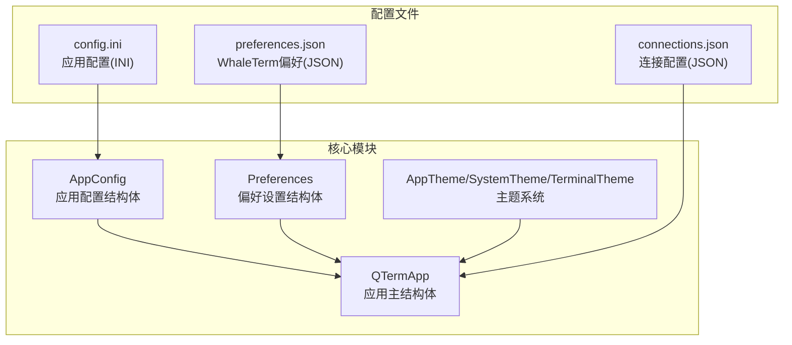
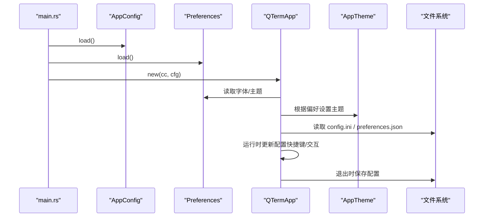
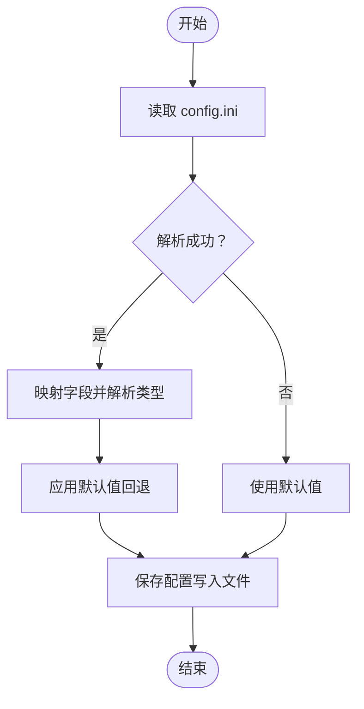
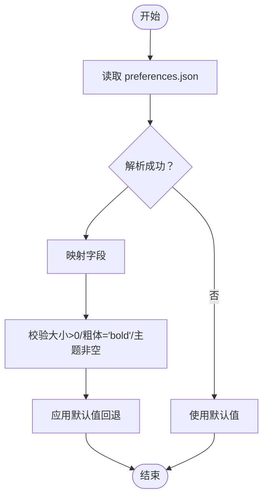
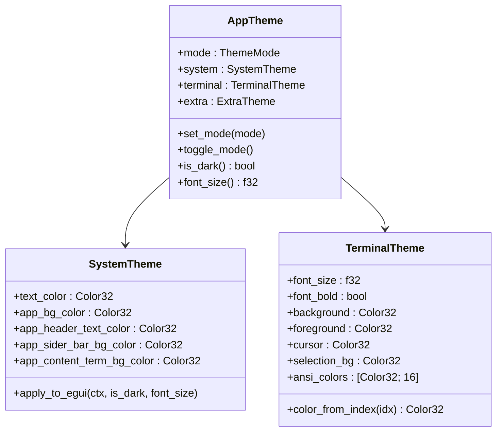
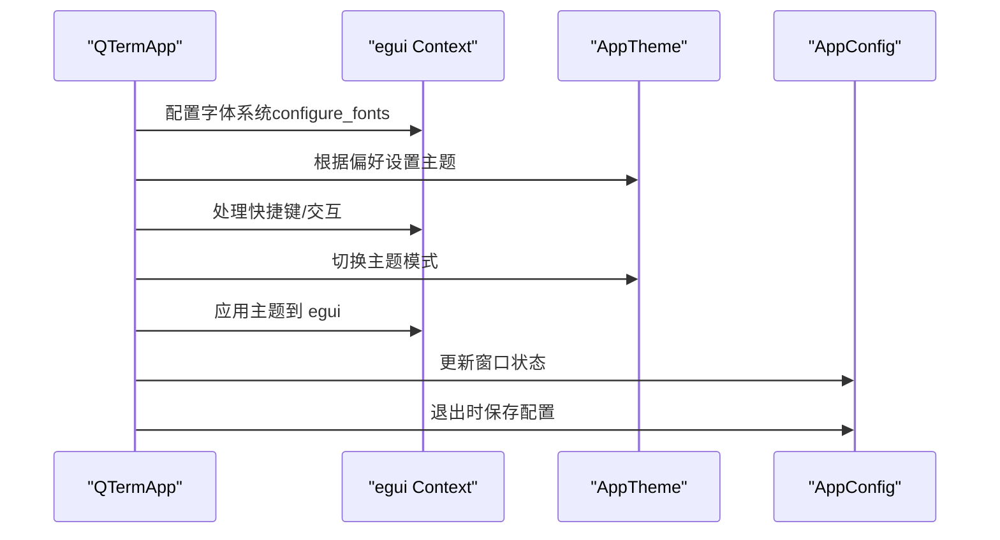
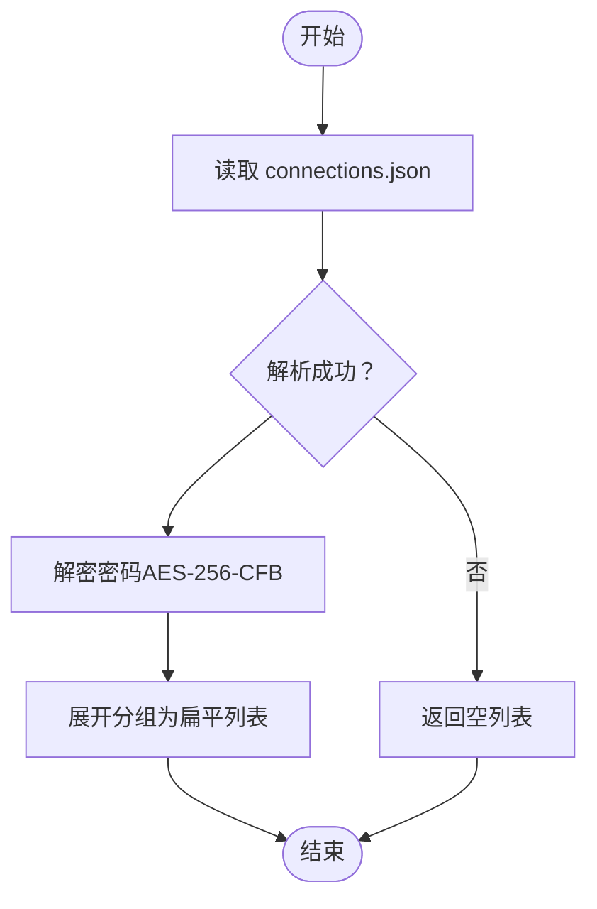
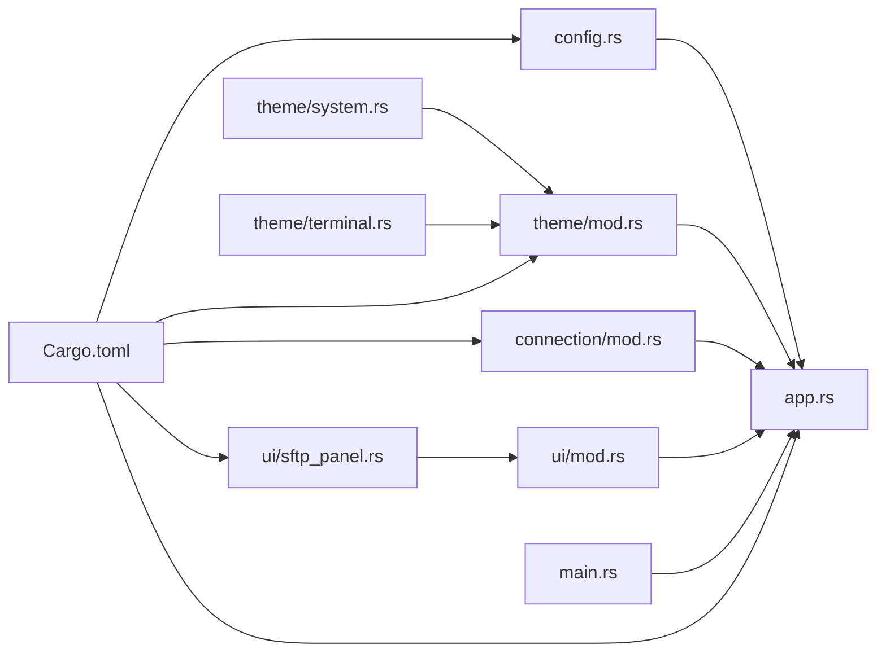

# 配置管理模型

<cite>
**本文引用的文件**
- [config.rs](file://src/config.rs)
- [app.rs](file://src/app.rs)
- [main.rs](file://src/main.rs)
- [mod.rs](file://src/theme/mod.rs)
- [system.rs](file://src/theme/system.rs)
- [terminal.rs](file://src/theme/terminal.rs)
- [mod.rs](file://src/ui/mod.rs)
- [sftp_panel.rs](file://src/ui/sftp_panel.rs)
- [mod.rs](file://src/connection/mod.rs)
- [Cargo.toml](file://Cargo.toml)
- [whaleterm_主题.md](file://whaleterm_主题.md)
- [whaleterm_终端界面.md](file://whaleterm_终端界面.md)
</cite>

## 目录
1. [简介](#简介)
2. [项目结构](#项目结构)
3. [核心组件](#核心组件)
4. [架构总览](#架构总览)
5. [详细组件分析](#详细组件分析)
6. [依赖关系分析](#依赖关系分析)
7. [性能考量](#性能考量)
8. [故障排查指南](#故障排查指南)
9. [结论](#结论)
10. [附录](#附录)

## 简介
本文件面向 QTerm 项目的“配置管理模型”，系统化阐述配置文件结构、字段定义、读取/写入/更新接口、默认值与校验机制、存储格式与版本管理、迁移与兼容性处理、热重载与实时更新、配置分类与优先级、与用户界面的集成以及备份与恢复接口。目标是帮助开发者与使用者全面掌握配置体系的设计与使用。

## 项目结构
QTerm 的配置管理涉及以下关键模块：
- 应用配置（INI 格式）：窗口位置、尺寸、主题、字体大小、回滚行数、Shell 路径等
- 偏好设置（JSON 格式）：从 WhaleTerm preferences.json 读取字体族、字体大小、粗体、主题等
- 主题系统：系统主题、终端主题、扩展主题，支持亮/暗模式切换
- UI 集成：应用启动时加载配置，运行时根据快捷键/交互更新配置，并在退出时持久化
- 连接配置：从 WhaleTerm connections.json 加载连接列表（含加密密码解密）

图表来源
- [config.rs:39-127](file://src/config.rs#L39-L127)
- [config.rs:209-281](file://src/config.rs#L209-L281)
- [app.rs:18-36](file://src/app.rs#L18-L36)
- [mod.rs:14-71](file://src/theme/mod.rs#L14-L71)

章节来源
- [config.rs:1-281](file://src/config.rs#L1-281)
- [app.rs:1-105](file://src/app.rs#L1-L105)
- [Cargo.toml:1-30](file://Cargo.toml#L1-L30)

## 核心组件
- 应用配置（AppConfig）
  - 字段：窗口坐标/尺寸、最大化、字体大小、回滚行数、主题、Shell 路径
  - 默认值：未设置时采用合理缺省
  - 读取/写入：INI 文件解析与序列化
- 偏好设置（Preferences）
  - 字段：配置区/通用区/终端字体族、大小、粗体；主题
  - 默认值：未设置时采用合理缺省
  - 读取：JSON 解析，包含大小与粗体的校验
- 主题系统（AppTheme/SystemTheme/TerminalTheme）
  - 模式：亮/暗
  - 颜色：系统 UI、终端 ANSI 颜色、扩展色
  - 切换：运行时切换并应用到 egui
- UI 集成
  - 启动：从配置恢复窗口尺寸/位置/最大化
  - 运行：快捷键调整字体大小、切换主题、分屏等
  - 退出：保存窗口状态与主题到配置
- 连接配置（WhaleTerm connections.json）
  - 读取：解析 JSON，解密密码
  - 集成：加载到应用中供 UI 使用

章节来源
- [config.rs:39-127](file://src/config.rs#L39-L127)
- [config.rs:209-281](file://src/config.rs#L209-L281)
- [mod.rs:14-71](file://src/theme/mod.rs#L14-L71)
- [app.rs:18-105](file://src/app.rs#L18-L105)
- [mod.rs:110-141](file://src/theme/system.rs#L110-L141)
- [terminal.rs:5-102](file://src/theme/terminal.rs#L5-L102)
- [mod.rs:1-81](file://src/theme/mod.rs#L1-L81)

## 架构总览
配置管理贯穿应用生命周期：启动时加载配置，运行时根据用户交互更新内存配置，退出时持久化。主题系统与字体配置紧密耦合，确保 UI 与终端渲染一致。

图表来源
- [main.rs:51-87](file://src/main.rs#L51-L87)
- [config.rs:71-98](file://src/config.rs#L71-L98)
- [config.rs:242-281](file://src/config.rs#L242-L281)
- [app.rs:70-105](file://src/app.rs#L70-L105)
- [mod.rs:23-61](file://src/theme/mod.rs#L23-L61)

## 详细组件分析

### 应用配置（AppConfig）与 INI 文件
- 存储位置与路径
  - 目录：Windows: %APPDATA%\qterm；其他: ~/.config/qterm
  - 文件：config.ini
- 字段与默认值
  - 窗口：window_x, window_y, window_width, window_height（Option<f32>）
  - 窗口状态：maximized（bool）
  - 终端：font_size（f32）、scrollback_lines（usize）、theme（String）、shell_path（String）
  - 默认值：未设置时采用合理缺省（如字体大小、回滚行数、主题）
- 读取流程
  - 读取文件 -> 解析 INI -> 转换为字段（含类型解析与默认回退）
- 写入流程
  - 创建目录 -> 序列化字段 -> 写入文件
- 校验与健壮性
  - 解析失败或文件缺失时回退到默认值
  - 仅在字段有效时写入（如 Option 值为空则不写）

图表来源
- [config.rs:71-127](file://src/config.rs#L71-L127)
- [config.rs:129-143](file://src/config.rs#L129-L143)

章节来源
- [config.rs:6-35](file://src/config.rs#L6-L35)
- [config.rs:39-66](file://src/config.rs#L39-L66)
- [config.rs:71-127](file://src/config.rs#L71-L127)
- [config.rs:129-143](file://src/config.rs#L129-L143)

### 偏好设置（Preferences）与 preferences.json
- 存储位置与路径
  - 目录：Windows: %APPDATA%\WhaleTerm；其他: ~/.config/WhaleTerm
  - 文件：preferences.json
- 结构与字段
  - config/general/shell 三段配置，分别包含字体族、字体大小、粗体、主题
  - 字体大小与粗体进行有效性校验（大于 0 且粗体为 "bold"）
  - 主题为空时回退到 "dark"
- 读取流程
  - 读取 JSON -> 反序列化 -> 校验与回退
- 默认值
  - 未设置时采用合理缺省（如字体大小 14.0、主题 "dark"）

图表来源
- [config.rs:184-204](file://src/config.rs#L184-L204)
- [config.rs:209-281](file://src/config.rs#L209-L281)

章节来源
- [config.rs:147-204](file://src/config.rs#L147-L204)
- [config.rs:209-281](file://src/config.rs#L209-L281)

### 主题系统（AppTheme/SystemTheme/TerminalTheme）
- 模式与切换
  - 模式：ThemeMode::Light/Dark
  - 切换：set_mode/toggle_mode
- 颜色与 ANSI 映射
  - SystemTheme：UI 组件颜色
  - TerminalTheme：终端前景/背景、光标、选区、ANSI 16 色映射
  - 颜色解析：十六进制字符串转 egui::Color32
- 与 UI 集成
  - 应用启动时根据偏好设置主题
  - 运行时可通过 UI 切换主题并应用到 egui

图表来源
- [mod.rs:14-71](file://src/theme/mod.rs#L14-L71)
- [system.rs:110-141](file://src/theme/system.rs#L110-L141)
- [terminal.rs:5-102](file://src/theme/terminal.rs#L5-L102)

章节来源
- [mod.rs:7-81](file://src/theme/mod.rs#L7-L81)
- [system.rs:110-141](file://src/theme/system.rs#L110-L141)
- [terminal.rs:19-102](file://src/theme/terminal.rs#L19-L102)

### UI 集成与运行时更新
- 启动阶段
  - 从 AppConfig 恢复窗口尺寸/位置/最大化
  - 从 Preferences 加载字体与主题，初始化 egui 字体系统
- 运行阶段
  - 快捷键：Ctrl+=/- 调整字体大小；Ctrl+Shift+T/S/W/B 等操作
  - 主题切换：按钮切换亮/暗模式并应用到 egui
  - 分屏：水平/垂直分屏，面板数量与尺寸动态计算
- 退出阶段
  - 保存窗口位置/尺寸/最大化状态/主题到 AppConfig 并写入文件

图表来源
- [app.rs:107-171](file://src/app.rs#L107-L171)
- [app.rs:284-589](file://src/app.rs#L284-L589)
- [app.rs:577-589](file://src/app.rs#L577-L589)

章节来源
- [app.rs:107-171](file://src/app.rs#L107-L171)
- [app.rs:284-589](file://src/app.rs#L284-L589)
- [app.rs:577-589](file://src/app.rs#L577-L589)

### 连接配置（WhaleTerm connections.json）
- 读取与解析
  - 从 WhaleTerm 配置文件加载连接列表
  - 解析分组与连接信息，解密密码后返回扁平列表
- 加密与解密
  - AES-256-CFB，格式：hex(IV[16字节] + ciphertext)
  - 密钥由主板序列号派生，或使用硬编码回退密钥

图表来源
- [mod.rs:28-59](file://src/connection/mod.rs#L28-L59)

章节来源
- [mod.rs:28-59](file://src/connection/mod.rs#L28-L59)

## 依赖关系分析
- 外部依赖
  - eframe/egui：UI 渲染与主题应用
  - serde/serde_json：配置序列化与反序列化
  - portable-pty/vte：终端仿真与PTY
  - russh/russh-sftp：SSH/SFTP
- 内部模块
  - config.rs：应用配置与偏好设置
  - theme/*：主题系统
  - app.rs：应用主逻辑与 UI 集成
  - connection/mod.rs：连接配置与解密
  - ui/*：UI 组件（SFTP 等）

图表来源
- [Cargo.toml:8-25](file://Cargo.toml#L8-L25)
- [config.rs:1-5](file://src/config.rs#L1-L5)
- [app.rs:1-10](file://src/app.rs#L1-L10)
- [mod.rs:1-3](file://src/theme/mod.rs#L1-L3)
- [mod.rs:110-141](file://src/theme/system.rs#L110-L141)
- [terminal.rs:1-4](file://src/theme/terminal.rs#L1-L4)
- [mod.rs:28-59](file://src/connection/mod.rs#L28-L59)
- [mod.rs:1-3](file://src/ui/mod.rs#L1-L3)
- [sftp_panel.rs:204-286](file://src/ui/sftp_panel.rs#L204-L286)
- [main.rs:1-10](file://src/main.rs#L1-L10)

章节来源
- [Cargo.toml:8-25](file://Cargo.toml#L8-L25)
- [config.rs:1-5](file://src/config.rs#L1-L5)
- [app.rs:1-10](file://src/app.rs#L1-L10)

## 性能考量
- 文件 I/O
  - 配置读取/写入为轻量级操作，建议在应用启动/退出时进行，避免频繁写入
- 字体与主题
  - 字体加载与主题切换涉及 egui 上下文更新，应避免在高频事件中频繁调用
- 终端渲染
  - 字体大小调整与回滚行数变更会影响终端网格尺寸计算，应在合适时机批量更新

## 故障排查指南
- 配置文件损坏或格式错误
  - 现象：启动时使用默认配置
  - 处理：检查 config.ini/preferences.json 格式，确保键值正确
- 字体无法加载
  - 现象：字体回退到系统默认
  - 处理：确认字体文件存在且路径正确，或移除无效字体族
- 主题切换无效
  - 现象：切换后颜色未更新
  - 处理：确认主题系统已应用到 egui 上下文，检查主题模式切换逻辑
- 连接密码解密失败
  - 现象：连接列表为空或密码为空
  - 处理：确认加密格式与密钥派生逻辑，检查 hex 编码与 IV 长度

章节来源
- [config.rs:71-98](file://src/config.rs#L71-L98)
- [config.rs:242-281](file://src/config.rs#L242-L281)
- [app.rs:107-171](file://src/app.rs#L107-L171)
- [mod.rs:61-84](file://src/connection/mod.rs#L61-L84)

## 结论
QTerm 的配置管理模型以简洁可靠为核心：INI 与 JSON 双格式并存，分别承载应用配置与偏好设置；主题系统与字体配置深度耦合，确保 UI 一致性；运行时通过快捷键与交互更新配置并在退出时持久化。当前实现具备良好的默认值回退与健壮性，建议后续增强热重载与版本迁移能力，以进一步提升用户体验与维护效率。

## 附录

### 配置文件结构与字段定义
- config.ini（应用配置）
  - 窗口：window_x, window_y, window_width, window_height（可选）
  - 窗口状态：maximized（布尔）
  - 终端：font_size（浮点）、scrollback_lines（整数）、theme（字符串）、shell_path（字符串）
- preferences.json（WhaleTerm 偏好）
  - config/general/shell 三段配置，包含字体族、字体大小、粗体、主题
  - 字体大小与粗体进行有效性校验，主题为空时回退到 "dark"

章节来源
- [config.rs:39-66](file://src/config.rs#L39-L66)
- [config.rs:156-182](file://src/config.rs#L156-L182)
- [config.rs:209-281](file://src/config.rs#L209-L281)

### 读取、写入与更新接口
- 读取
  - AppConfig::load()：从 config.ini 读取并解析
  - Preferences::load()：从 preferences.json 读取并解析
- 写入
  - AppConfig::save()：将当前配置写回 config.ini
- 更新
  - 运行时通过快捷键/交互更新内存配置，退出时统一保存

章节来源
- [config.rs:71-127](file://src/config.rs#L71-L127)
- [config.rs:242-281](file://src/config.rs#L242-L281)
- [app.rs:284-589](file://src/app.rs#L284-L589)

### 默认值处理与验证机制
- 默认值
  - AppConfig：未设置字段采用合理缺省（如字体大小、回滚行数、主题）
  - Preferences：字体大小小于等于 0 时回退到 14.0，粗体非 "bold" 时为 false，主题为空时为 "dark"
- 验证
  - INI 解析失败或文件缺失时回退默认值
  - JSON 解析失败或字段缺失时回退默认值

章节来源
- [config.rs:52-66](file://src/config.rs#L52-L66)
- [config.rs:222-237](file://src/config.rs#L222-L237)
- [config.rs:71-98](file://src/config.rs#L71-L98)
- [config.rs:242-281](file://src/config.rs#L242-L281)

### 存储格式与版本管理
- 存储格式
  - config.ini：简单 key=value 格式，忽略注释与空行
  - preferences.json：结构化 JSON，包含多段配置
- 版本管理
  - 当前未实现显式的版本字段与自动迁移逻辑
  - 建议引入版本号字段与迁移函数，以支持未来配置演进

章节来源
- [config.rs:129-143](file://src/config.rs#L129-L143)
- [config.rs:147-154](file://src/config.rs#L147-L154)

### 配置迁移与兼容性处理
- 迁移建议
  - 在 AppConfig/Preferences 中增加版本号字段
  - 提供迁移函数：根据版本号将旧配置转换为新格式
  - 兼容性：对新增字段使用默认值，对废弃字段进行安全丢弃
- 兼容性
  - 保持 INI/JSON 的向后兼容，避免破坏性变更

章节来源
- [config.rs:71-127](file://src/config.rs#L71-L127)
- [config.rs:242-281](file://src/config.rs#L242-L281)

### 热重载与实时更新机制
- 现状
  - 配置在运行时可被更新（如字体大小、主题切换），但未实现文件系统监听的自动热重载
- 建议
  - 引入文件系统监听（如 notify-rs），在 config.ini/preferences.json 变更时触发热重载
  - 对主题切换与字体调整进行节流，避免频繁重绘

章节来源
- [app.rs:326-393](file://src/app.rs#L326-L393)
- [app.rs:107-171](file://src/app.rs#L107-L171)

### 配置分类与优先级
- 分类
  - 应用配置：窗口、主题、字体、回滚行数、Shell 路径
  - 偏好设置：字体族、字体大小、粗体、主题
  - 连接配置：连接列表、认证信息（含加密）
- 优先级
  - 启动时：AppConfig 恢复窗口状态，Preferences 影响字体与主题
  - 运行时：快捷键与交互更新内存配置，退出时统一持久化

章节来源
- [config.rs:39-66](file://src/config.rs#L39-L66)
- [config.rs:209-237](file://src/config.rs#L209-L237)
- [app.rs:18-105](file://src/app.rs#L18-L105)

### 配置与用户界面的集成
- 启动集成
  - main.rs 读取 AppConfig 并恢复窗口尺寸/位置/最大化
  - app.rs 读取 Preferences 并初始化字体与主题
- 运行集成
  - 快捷键：Ctrl+=/- 调整字体大小；主题切换按钮
  - 分屏：水平/垂直分屏，面板尺寸动态计算
- 退出集成
  - 保存窗口状态与主题到 AppConfig 并写入文件

章节来源
- [main.rs:51-87](file://src/main.rs#L51-L87)
- [app.rs:107-171](file://src/app.rs#L107-L171)
- [app.rs:284-589](file://src/app.rs#L284-L589)

### 配置备份与恢复 API
- 备份
  - 手动复制 config.ini 与 preferences.json 到安全位置
  - 可扩展：提供备份函数，将配置打包为 zip/json
- 恢复
  - 替换 config.ini 与 preferences.json
  - 可扩展：提供恢复函数，从备份文件恢复配置
- 注意
  - 恢复前请关闭应用，避免并发写入

章节来源
- [config.rs:100-127](file://src/config.rs#L100-L127)
- [config.rs:240-281](file://src/config.rs#L240-L281)