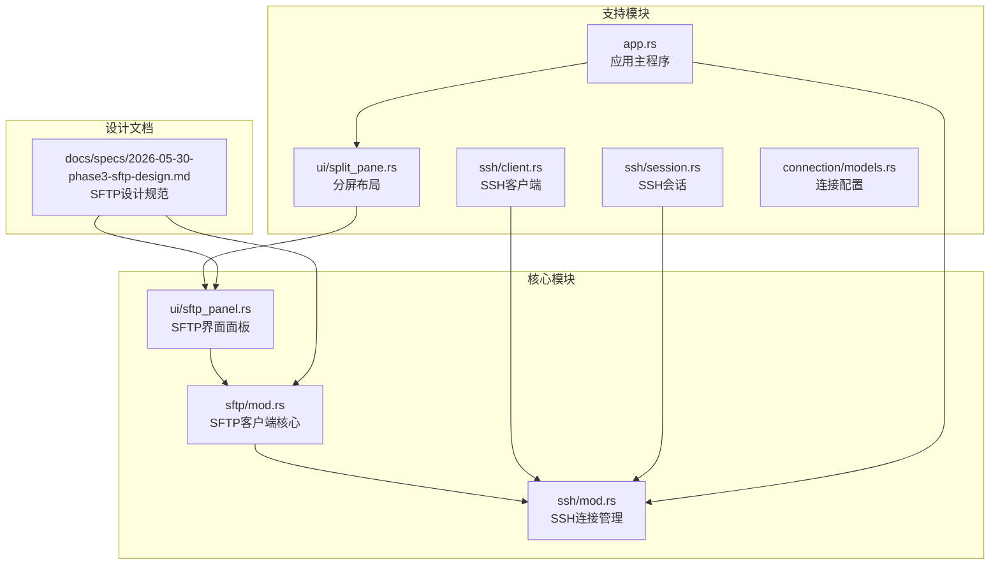
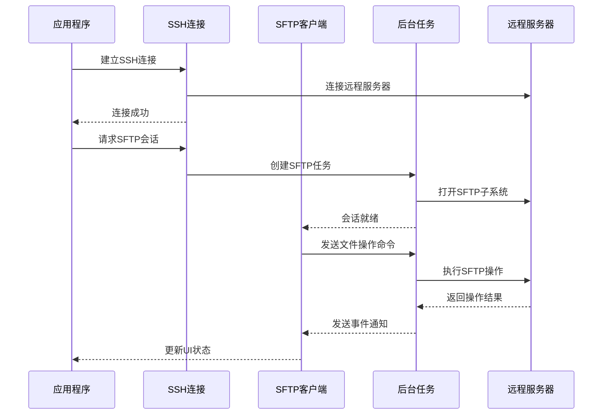
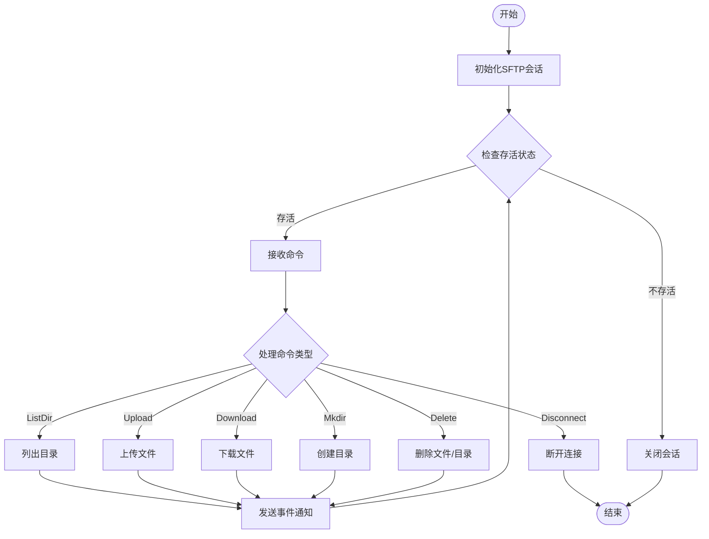
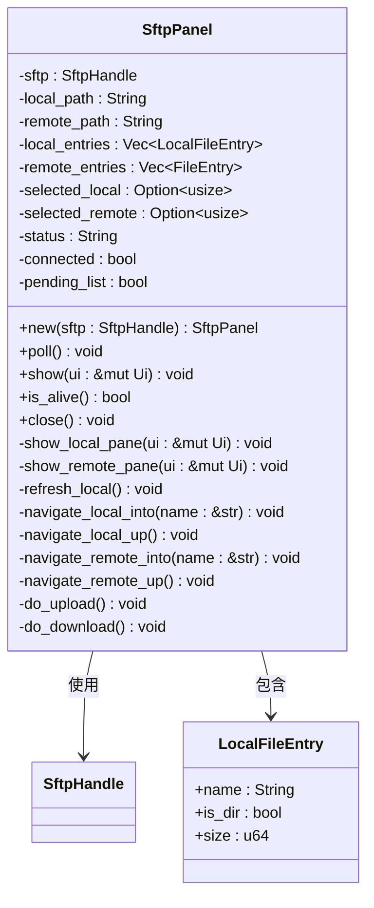
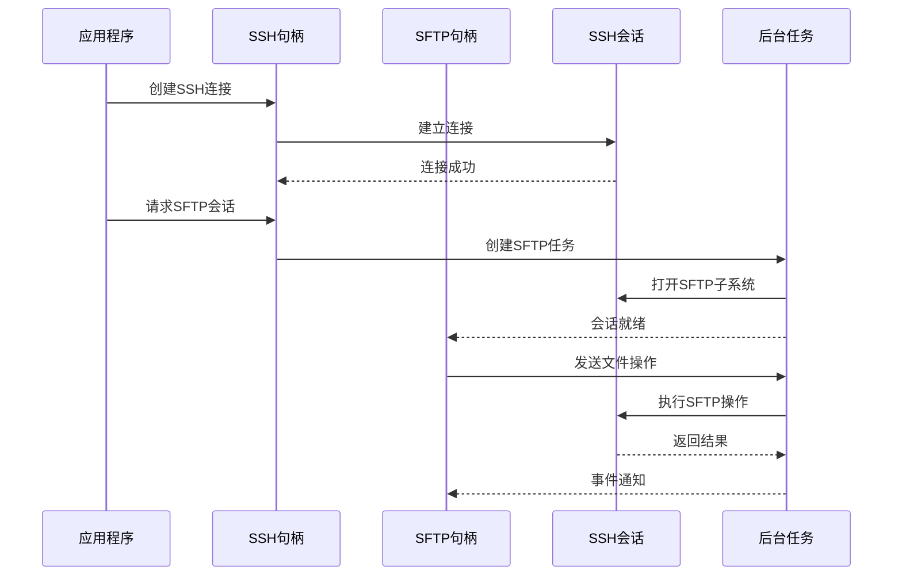
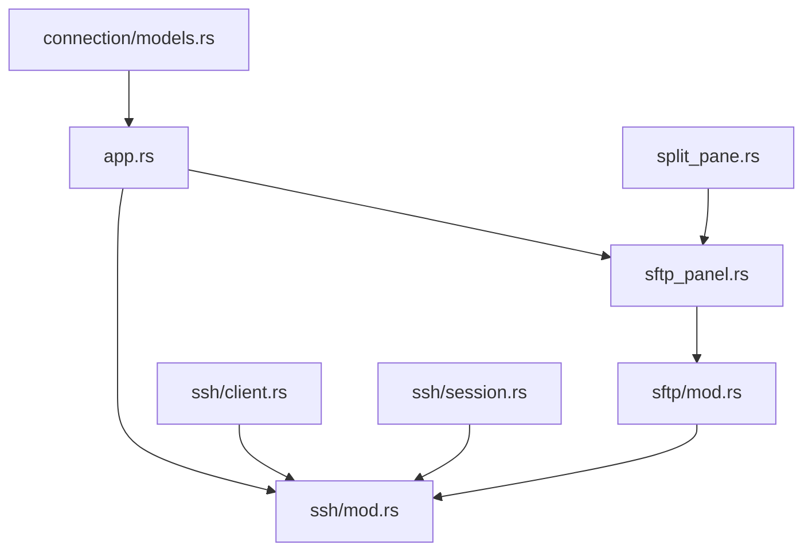
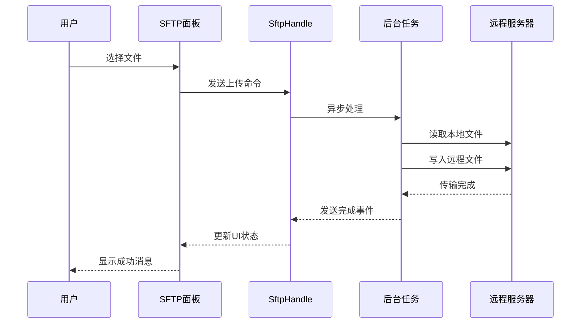
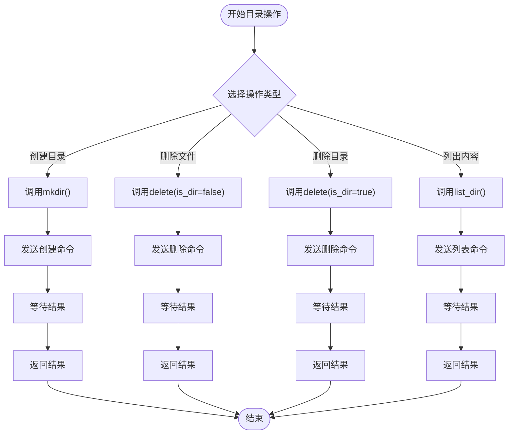

# SFTP文件传输API

<cite>
**本文档引用的文件**
- [sftp/mod.rs](file://src/sftp/mod.rs)
- [ui/sftp_panel.rs](file://src/ui/sftp_panel.rs)
- [ssh/mod.rs](file://src/ssh/mod.rs)
- [ssh/client.rs](file://src/ssh/client.rs)
- [ssh/session.rs](file://src/ssh/session.rs)
- [ui/split_pane.rs](file://src/ui/split_pane.rs)
- [app.rs](file://src/app.rs)
- [connection/models.rs](file://src/connection/models.rs)
- [docs/specs/2026-05-30-phase3-sftp-design.md](file://docs/specs/2026-05-30-phase3-sftp-design.md)
</cite>

## 目录
1. [简介](#简介)
2. [项目结构](#项目结构)
3. [核心组件](#核心组件)
4. [架构概览](#架构概览)
5. [详细组件分析](#详细组件分析)
6. [依赖关系分析](#依赖关系分析)
7. [性能考虑](#性能考虑)
8. [故障排除指南](#故障排除指南)
9. [结论](#结论)
10. [附录](#附录)

## 简介

QTerm SFTP文件传输系统是一个基于SSH协议的文件传输解决方案，提供了完整的SFTP客户端功能。该系统允许用户在本地计算机和远程服务器之间进行文件传输，支持目录浏览、文件操作和实时进度监控。

系统采用模块化设计，通过复用现有的SSH连接来建立SFTP子系统，实现了高效的资源利用和良好的用户体验。所有操作都是异步执行的，通过事件驱动的方式处理文件传输过程中的各种状态变化。

## 项目结构

QTerm项目的SFTP相关文件组织如下：



**图表来源**
- [sftp/mod.rs:1-238](file://src/sftp/mod.rs#L1-L238)
- [ssh/mod.rs:1-136](file://src/ssh/mod.rs#L1-L136)
- [ui/sftp_panel.rs:1-387](file://src/ui/sftp_panel.rs#L1-L387)

**章节来源**
- [sftp/mod.rs:1-238](file://src/sftp/mod.rs#L1-L238)
- [ssh/mod.rs:1-136](file://src/ssh/mod.rs#L1-L136)
- [ui/sftp_panel.rs:1-387](file://src/ui/sftp_panel.rs#L1-L387)

## 核心组件

### SFTP客户端句柄 (SftpHandle)

SftpHandle是SFTP系统的核心接口，负责与后台SFTP任务通信。它提供了以下主要功能：

- **连接管理**：创建和维护SFTP会话
- **命令发送**：异步发送文件操作命令
- **事件接收**：轮询处理SFTP操作结果
- **状态监控**：检查连接存活状态

### 文件条目结构 (FileEntry)

FileEntry用于表示远程文件和目录的信息：

- `name`: 文件或目录名称
- `is_dir`: 是否为目录
- `size`: 文件大小（字节）

### 事件系统

SFTP系统使用事件驱动架构，通过SftpEvent枚举处理各种操作结果：

- `Connected`: 连接成功
- `DirListing`: 目录列表结果
- `UploadDone`: 上传完成
- `DownloadDone`: 下载完成
- `MkdirDone`: 创建目录完成
- `DeleteDone`: 删除完成
- `Error`: 错误信息

**章节来源**
- [sftp/mod.rs:7-33](file://src/sftp/mod.rs#L7-L33)
- [sftp/mod.rs:46-115](file://src/sftp/mod.rs#L46-L115)

## 架构概览

系统采用分层架构设计，确保了模块间的清晰分离和良好的可维护性：



**图表来源**
- [ssh/session.rs:11-90](file://src/ssh/session.rs#L11-L90)
- [sftp/mod.rs:119-167](file://src/sftp/mod.rs#L119-L167)

**章节来源**
- [ssh/session.rs:11-90](file://src/ssh/session.rs#L11-L90)
- [sftp/mod.rs:119-167](file://src/sftp/mod.rs#L119-L167)

## 详细组件分析

### SFTP客户端核心实现

#### SftpHandle类结构

```mermaid
classDiagram
class SftpHandle {
-events_rx : Receiver~SftpEvent~
-cmd_tx : Sender~SftpCommand~
-alive : AtomicBool
+new(ssh_handle, rt) Result~SftpHandle~
+poll() Vec~SftpEvent~
+is_alive() bool
+list_dir(path : &str) void
+upload(local_path : String, remote_path : String) void
+download(remote_path : String, local_path : String) void
+mkdir(path : String) void
+delete(path : String, is_dir : bool) void
+disconnect() void
}
class SftpEvent {
<<enumeration>>
Connected
DirListing(Vec~FileEntry~)
UploadDone(Result~void, String~)
DownloadDone(Result~void, String~)
MkdirDone(Result~void, String~)
DeleteDone(Result~void, String~)
Error(String)
}
class SftpCommand {
<<enumeration>>
ListDir(String)
Upload { local_path : String, remote_path : String }
Download { remote_path : String, local_path : String }
Mkdir(String)
Delete { path : String, is_dir : bool }
Disconnect
}
SftpHandle --> SftpEvent : 发送
SftpHandle --> SftpCommand : 接收
```

**图表来源**
- [sftp/mod.rs:9-44](file://src/sftp/mod.rs#L9-L44)

#### 后台任务处理流程



**图表来源**
- [sftp/mod.rs:119-167](file://src/sftp/mod.rs#L119-L167)
- [sftp/mod.rs:170-238](file://src/sftp/mod.rs#L170-L238)

**章节来源**
- [sftp/mod.rs:46-115](file://src/sftp/mod.rs#L46-L115)
- [sftp/mod.rs:119-238](file://src/sftp/mod.rs#L119-L238)

### SFTP界面面板

#### SftpPanel类结构



**图表来源**
- [ui/sftp_panel.rs:14-357](file://src/ui/sftp_panel.rs#L14-L357)

#### 双栏文件浏览器界面

SFTP面板采用双栏布局设计，提供直观的文件管理体验：

- **左侧本地文件浏览器**：显示本地计算机文件系统
- **右侧远程文件浏览器**：显示远程服务器文件系统
- **底部操作栏**：包含上传、下载等操作按钮
- **状态显示**：实时显示操作状态和进度

**章节来源**
- [ui/sftp_panel.rs:14-357](file://src/ui/sftp_panel.rs#L14-L357)

### SSH连接集成

#### SshHandle类集成



**图表来源**
- [ssh/mod.rs:68-136](file://src/ssh/mod.rs#L68-L136)
- [ui/split_pane.rs:60-68](file://src/ui/split_pane.rs#L60-L68)

**章节来源**
- [ssh/mod.rs:68-136](file://src/ssh/mod.rs#L68-L136)
- [ui/split_pane.rs:60-68](file://src/ui/split_pane.rs#L60-L68)

## 依赖关系分析

### 外部依赖

系统主要依赖以下外部库：

- **russh**: SSH协议实现
- **russh-sftp**: SFTP协议实现
- **tokio**: 异步运行时
- **eframe**: GUI框架

### 内部模块依赖



**图表来源**
- [sftp/mod.rs:1-5](file://src/sftp/mod.rs#L1-L5)
- [ssh/mod.rs:1-6](file://src/ssh/mod.rs#L1-L6)

**章节来源**
- [sftp/mod.rs:1-5](file://src/sftp/mod.rs#L1-L5)
- [ssh/mod.rs:1-6](file://src/ssh/mod.rs#L1-L6)

## 性能考虑

### 异步处理优势

系统采用异步架构设计，具有以下性能优势：

- **非阻塞I/O**: 文件操作不会阻塞主线程
- **事件驱动**: 通过事件通知处理操作结果
- **资源共享**: 复用SSH连接，减少资源消耗
- **并发处理**: 支持多个文件同时传输

### 内存管理

- **零拷贝传输**: 使用内存映射文件进行高效传输
- **缓冲区管理**: 合理的缓冲区大小配置
- **垃圾回收**: 自动内存管理，避免内存泄漏

### 网络优化

- **连接复用**: 复用现有SSH连接进行SFTP操作
- **批量操作**: 支持批量文件传输
- **错误重试**: 自动重试机制提高成功率

## 故障排除指南

### 常见问题及解决方案

#### 连接问题

**问题**: 无法建立SFTP连接
**可能原因**:
- SSH连接失败
- SFTP子系统不可用
- 权限不足

**解决步骤**:
1. 检查SSH连接状态
2. 验证SFTP服务可用性
3. 确认用户权限

#### 文件传输问题

**问题**: 文件传输失败
**可能原因**:
- 磁盘空间不足
- 权限不足
- 网络中断

**解决步骤**:
1. 检查磁盘空间
2. 验证文件权限
3. 重新建立连接

#### 目录浏览问题

**问题**: 无法列出目录内容
**可能原因**:
- 目录不存在
- 权限不足
- 编码问题

**解决步骤**:
1. 验证目录路径
2. 检查目录权限
3. 确认字符编码

**章节来源**
- [sftp/mod.rs:131-148](file://src/sftp/mod.rs#L131-L148)
- [sftp/mod.rs:193-196](file://src/sftp/mod.rs#L193-L196)

## 结论

QTerm SFTP文件传输系统提供了一个完整、高效且易于使用的文件传输解决方案。通过模块化设计和异步架构，系统实现了高性能的文件传输功能，同时保持了良好的用户体验。

系统的主要优势包括：
- **模块化设计**: 清晰的组件分离便于维护和扩展
- **异步处理**: 高效的非阻塞I/O操作
- **资源复用**: 复用SSH连接减少资源消耗
- **用户友好**: 直观的双栏界面设计

未来可以考虑的功能增强包括：
- 断点续传支持
- 文件同步功能
- 批量操作优化
- 更丰富的错误处理机制

## 附录

### API参考

#### SftpHandle接口

| 方法 | 参数 | 返回值 | 描述 |
|------|------|--------|------|
| new | ssh_handle: SharedSshHandle, rt: &Runtime | Result~SftpHandle~ | 创建SFTP连接 |
| poll | 无 | Vec~SftpEvent~ | 轮询SFTP事件 |
| is_alive | 无 | bool | 检查连接存活状态 |
| list_dir | path: &str | void | 请求列出目录 |
| upload | local_path: String, remote_path: String | void | 请求上传文件 |
| download | remote_path: String, local_path: String | void | 请求下载文件 |
| mkdir | path: String | void | 请求创建目录 |
| delete | path: String, is_dir: bool | void | 请求删除文件/目录 |
| disconnect | 无 | void | 断开SFTP连接 |

#### SftpEvent事件类型

| 事件 | 参数 | 描述 |
|------|------|------|
| Connected | 无 | 连接成功 |
| DirListing | entries: Vec~FileEntry~ | 目录列表结果 |
| UploadDone | result: Result~void, String~ | 上传完成 |
| DownloadDone | result: Result~void, String~ | 下载完成 |
| MkdirDone | result: Result~void, String~ | 创建目录完成 |
| DeleteDone | result: Result~void, String~ | 删除完成 |
| Error | message: String | 错误信息 |

#### SftpCommand命令类型

| 命令 | 参数 | 描述 |
|------|------|------|
| ListDir | path: String | 列出目录 |
| Upload | local_path: String, remote_path: String | 上传文件 |
| Download | remote_path: String, local_path: String | 下载文件 |
| Mkdir | path: String | 创建目录 |
| Delete | path: String, is_dir: bool | 删除文件/目录 |
| Disconnect | 无 | 断开连接 |

### 使用示例

#### 基本文件传输流程



**图表来源**
- [ui/sftp_panel.rs:326-340](file://src/ui/sftp_panel.rs#L326-L340)
- [sftp/mod.rs:198-208](file://src/sftp/mod.rs#L198-L208)

#### 目录管理操作



**图表来源**
- [sftp/mod.rs:100-108](file://src/sftp/mod.rs#L100-L108)
- [sftp/mod.rs:220-235](file://src/sftp/mod.rs#L220-L235)

### 安全特性

#### SSH认证机制

系统支持多种SSH认证方式：

- **密码认证**: 基于用户名和密码的认证
- **密钥认证**: 基于公钥/私钥对的认证
- **自动密钥验证**: 当前实现自动接受所有服务器密钥

#### 数据传输安全

- **加密传输**: 所有数据通过SSH隧道加密传输
- **完整性校验**: SFTP协议提供数据完整性保证
- **访问控制**: 基于用户权限的文件访问控制

### 性能优化策略

#### 并发处理

- **多任务并行**: 支持多个文件同时传输
- **异步I/O**: 非阻塞的文件操作
- **连接池**: 复用现有SSH连接

#### 内存管理

- **流式传输**: 大文件分块传输，避免内存溢出
- **智能缓存**: 合理的缓存策略
- **及时释放**: 及时释放不再使用的资源