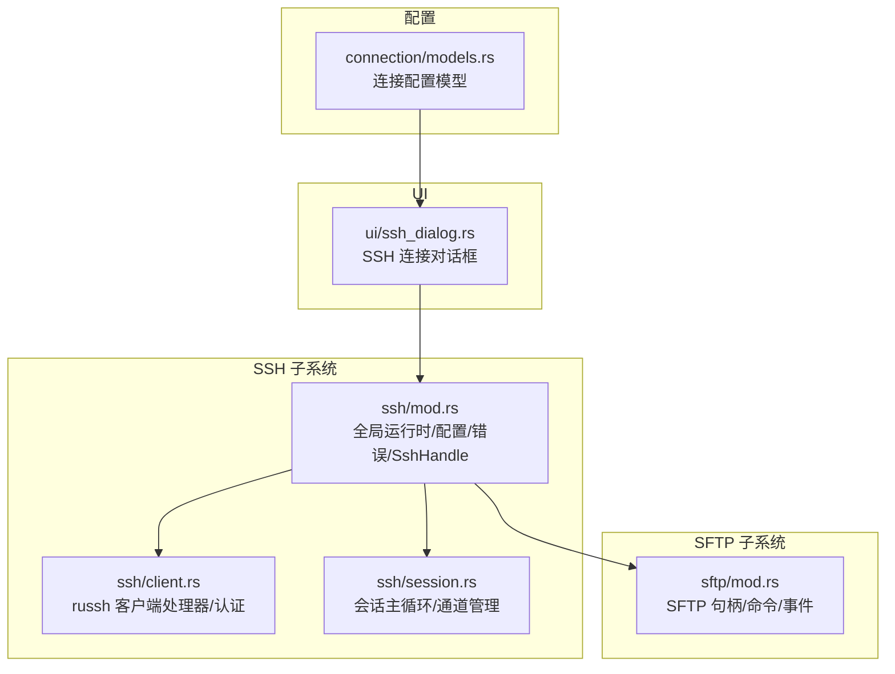
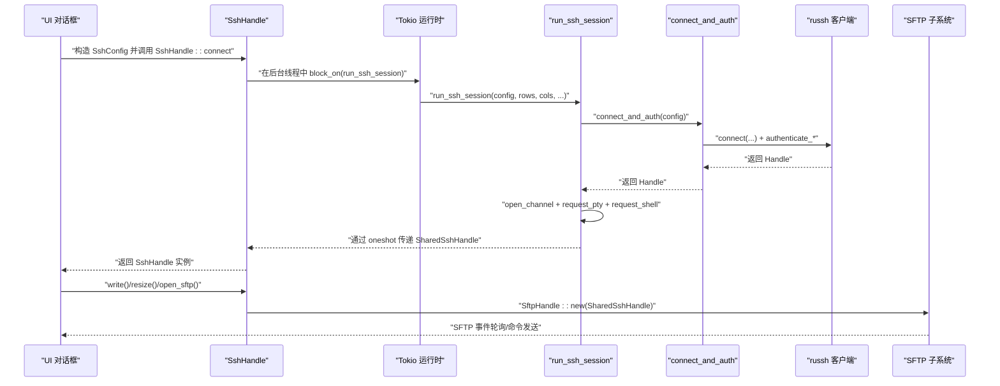
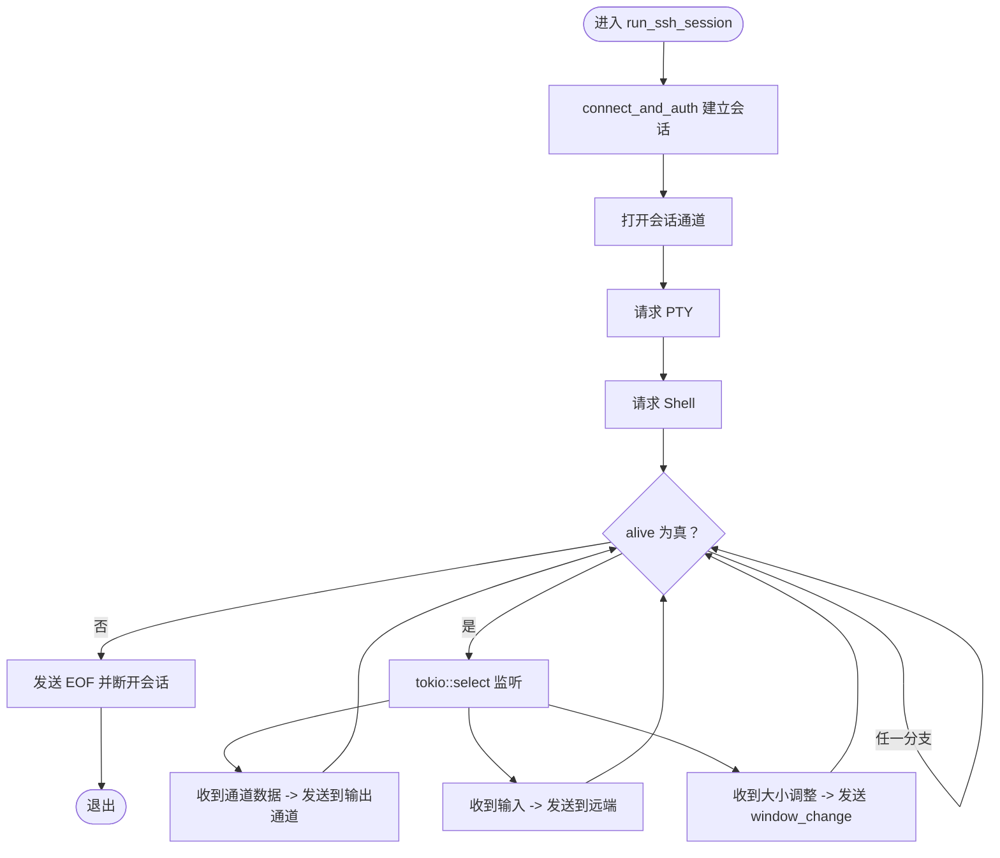
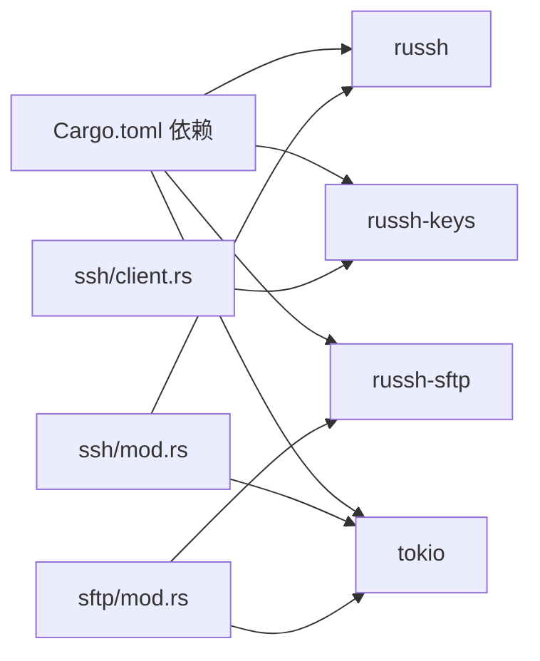

# SSH连接API

<cite>
**本文引用的文件**
- [src/ssh/mod.rs](file://src/ssh/mod.rs)
- [src/ssh/client.rs](file://src/ssh/client.rs)
- [src/ssh/session.rs](file://src/ssh/session.rs)
- [src/sftp/mod.rs](file://src/sftp/mod.rs)
- [src/ui/ssh_dialog.rs](file://src/ui/ssh_dialog.rs)
- [src/connection/models.rs](file://src/connection/models.rs)
- [Cargo.toml](file://Cargo.toml)
- [src/main.rs](file://src/main.rs)
</cite>

## 目录
1. [简介](#简介)
2. [项目结构](#项目结构)
3. [核心组件](#核心组件)
4. [架构总览](#架构总览)
5. [详细组件分析](#详细组件分析)
6. [依赖关系分析](#依赖关系分析)
7. [性能考量](#性能考量)
8. [故障排查指南](#故障排查指南)
9. [结论](#结论)
10. [附录](#附录)

## 简介
本文件为 QTerm 的 SSH 连接系统提供完整的 API 参考文档，覆盖 SSH 客户端接口、会话管理、认证流程、russh 库集成、异步操作与错误处理，并给出连接示例与安全最佳实践。目标读者既包括需要快速上手的开发者，也包括希望深入理解内部机制的高级用户。

## 项目结构
QTerm 的 SSH 功能主要位于 src/ssh 目录，配套 UI 对话框位于 src/ui，SFTP 子系统位于 src/sftp，连接配置模型位于 src/connection。Cargo.toml 中声明了 russh 生态相关依赖。

图表来源
- [src/ssh/mod.rs:1-136](file://src/ssh/mod.rs#L1-L136)
- [src/ssh/client.rs:1-63](file://src/ssh/client.rs#L1-L63)
- [src/ssh/session.rs:1-90](file://src/ssh/session.rs#L1-L90)
- [src/sftp/mod.rs:1-238](file://src/sftp/mod.rs#L1-L238)
- [src/ui/ssh_dialog.rs:1-147](file://src/ui/ssh_dialog.rs#L1-L147)
- [src/connection/models.rs:1-43](file://src/connection/models.rs#L1-L43)

章节来源
- [src/ssh/mod.rs:1-136](file://src/ssh/mod.rs#L1-L136)
- [src/ssh/client.rs:1-63](file://src/ssh/client.rs#L1-L63)
- [src/ssh/session.rs:1-90](file://src/ssh/session.rs#L1-L90)
- [src/sftp/mod.rs:1-238](file://src/sftp/mod.rs#L1-L238)
- [src/ui/ssh_dialog.rs:1-147](file://src/ui/ssh_dialog.rs#L1-L147)
- [src/connection/models.rs:1-43](file://src/connection/models.rs#L1-L43)
- [Cargo.toml:1-30](file://Cargo.toml#L1-L30)

## 核心组件
本节概述 SSH 子系统的关键类型与职责：
- 全局运行时：提供 SSH 专用的 Tokio 运行时，避免与 UI 线程争用。
- 配置与错误：统一的连接配置与错误类型，便于上层调用者处理。
- SshHandle：对外暴露的连接句柄，封装数据读写、终端大小调整、SFTP 打开等能力。
- SshClient：russh 客户端处理器，负责服务器密钥检查（当前自动接受）。
- 会话循环：在独立线程中运行，处理 PTY 数据流、用户输入、窗口大小变化。
- SFTP：基于共享 SSH 会话复用 SFTP 子系统通道，提供目录列举、上传下载、创建删除等操作。

章节来源
- [src/ssh/mod.rs:8-136](file://src/ssh/mod.rs#L8-L136)
- [src/ssh/client.rs:1-63](file://src/ssh/client.rs#L1-L63)
- [src/ssh/session.rs:1-90](file://src/ssh/session.rs#L1-L90)
- [src/sftp/mod.rs:1-238](file://src/sftp/mod.rs#L1-L238)

## 架构总览
下图展示了从 UI 触发到会话建立、数据传输与 SFTP 复用的整体流程。

图表来源
- [src/ssh/mod.rs:68-136](file://src/ssh/mod.rs#L68-L136)
- [src/ssh/session.rs:11-90](file://src/ssh/session.rs#L11-L90)
- [src/ssh/client.rs:25-63](file://src/ssh/client.rs#L25-L63)
- [src/sftp/mod.rs:46-115](file://src/sftp/mod.rs#L46-L115)

## 详细组件分析

### SshConfig 与 SshAuth：连接配置与认证
- SshConfig 字段
  - host: 目标主机地址
  - port: SSH 端口
  - username: 登录用户名
  - auth: 认证方式（密码或私钥）
  - timeout_secs: 连接超时秒数（当前在 UI 层固定为 5）
- SshAuth 枚举
  - Password(String): 使用明文密码认证
  - PrivateKey { path: String, passphrase: Option<String> }: 使用私钥文件认证，可选口令

章节来源
- [src/ssh/mod.rs:18-33](file://src/ssh/mod.rs#L18-L33)
- [src/ui/ssh_dialog.rs:125-143](file://src/ui/ssh_dialog.rs#L125-L143)

### SshError：错误类型与处理
- Connection(String): 连接阶段错误（如网络不可达、握手失败）
- Auth(String): 认证阶段错误（如密码错误、密钥加载失败、认证失败）
- Channel(String): 通道阶段错误（如 PTY 请求失败、Shell 启动失败、EOF）

章节来源
- [src/ssh/mod.rs:35-53](file://src/ssh/mod.rs#L35-L53)

### SshHandle：对外连接句柄
- 构造与连接
  - connect(config, rows, cols) -> Result<Self, SshError>
    - 功能：在后台线程启动会话循环，创建输出、输入、大小调整通道，等待 russh 客户端句柄传递
    - 返回：SshHandle 实例；错误：Channel
- 数据与控制
  - write(data: &[u8]) -> Result<(), SshError>
    - 功能：向远端终端写入数据
    - 返回：Ok(()) 或 Auth/Channel 错误
  - resize(rows: u16, cols: u16)
    - 功能：请求调整远端终端大小
  - is_alive() -> bool
    - 功能：检查连接是否存活
  - disconnect()
    - 功能：标记连接停止，触发会话退出
- SFTP 复用
  - open_sftp() -> Result<SftpHandle, SshError>
    - 功能：基于共享 russh 客户端句柄打开 SFTP 子系统
    - 返回：SftpHandle；错误：Channel

章节来源
- [src/ssh/mod.rs:68-136](file://src/ssh/mod.rs#L68-L136)

### SshClient 与 connect_and_auth：认证流程
- SshClient 实现 russh::Handler
  - check_server_key：当前实现为自动接受所有服务器密钥
- connect_and_auth(config: &SshConfig) -> Result<Handle<SshClient>, SshError>
  - 步骤：建立 TCP 连接 -> 根据 SshAuth 选择认证方式 -> 校验认证结果
  - 密码认证：authenticate_password
  - 私钥认证：加载密钥文件 -> authenticate_publickey
  - 错误映射：russh 错误 -> SshError::Connection/Auth

章节来源
- [src/ssh/client.rs:1-63](file://src/ssh/client.rs#L1-L63)

### run_ssh_session：会话主循环
- 输入参数：SshConfig、rows/cols、输出通道、输入接收通道、大小调整接收通道、存活标志、句柄传递通道
- 流程：
  - connect_and_auth 建立会话并获取 Handle
  - 通过 oneshot 将 SharedSshHandle 传回主线程
  - 打开会话通道、请求 PTY（xterm-256color）、请求 Shell
  - 主循环：select 监听通道数据、输入队列、大小调整请求
  - 退出条件：alive 标志为 false、通道 EOF
  - 清理：发送 EOF、断开会话

图表来源
- [src/ssh/session.rs:11-90](file://src/ssh/session.rs#L11-L90)

章节来源
- [src/ssh/session.rs:11-90](file://src/ssh/session.rs#L11-L90)

### SFTP 子系统：命令与事件
- SftpHandle
  - new(ssh_handle, runtime) -> Result<Self, SshError>
  - poll() -> Vec<SftpEvent>: 非阻塞轮询事件
  - is_alive() -> bool
  - list_dir(path)/upload()/download()/mkdir()/delete()/disconnect()
- 事件与命令
  - 事件：Connected、DirListing、UploadDone、DownloadDone、MkdirDone、DeleteDone、Error
  - 命令：ListDir、Upload、Download、Mkdir、Delete、Disconnect
- 工作流程：通过 SSH 通道请求 sftp 子系统，创建 SftpSession，循环处理命令并回传事件

章节来源
- [src/sftp/mod.rs:1-238](file://src/sftp/mod.rs#L1-L238)

### UI 对话框：SSH 连接参数收集
- SshDialog
  - 字段：host/port/username/password/key_path/key_passphrase、auth_mode、status、result
  - show(ctx)：弹出模态窗口，支持密码/私钥两种认证模式
  - try_connect()：校验必填项，生成 SshConfig（默认 timeout_secs=5），关闭对话框

章节来源
- [src/ui/ssh_dialog.rs:1-147](file://src/ui/ssh_dialog.rs#L1-L147)

### 连接配置模型：WhaleTerm 兼容
- ConnectionsFile/WhaleGroup/WhaleConnection：用于解析 WhaleTerm 的 connections.json
- QTerm 的 Connection：包含解密后的密码、分组名称等，供 UI 与 SSH 使用

章节来源
- [src/connection/models.rs:1-43](file://src/connection/models.rs#L1-L43)

## 依赖关系分析
- russh 生态
  - russh：SSH 客户端核心、通道管理、会话生命周期
  - russh-keys：密钥加载与验证
  - russh-sftp：SFTP 子系统客户端
- 运行时
  - tokio：异步运行时（多线程、网络、同步原语）
  - 专用运行时：通过 OnceLock 懒加载，避免与 UI 线程竞争
- UI 与并发
  - SshHandle 内部使用 mpsc/tokio mpsc 通道，配合 AtomicBool 控制会话生命周期

图表来源
- [Cargo.toml:8-25](file://Cargo.toml#L8-L25)
- [src/ssh/mod.rs:1-16](file://src/ssh/mod.rs#L1-L16)
- [src/sftp/mod.rs:1-6](file://src/sftp/mod.rs#L1-L6)

章节来源
- [Cargo.toml:8-25](file://Cargo.toml#L8-L25)
- [src/ssh/mod.rs:1-16](file://src/ssh/mod.rs#L1-L16)
- [src/sftp/mod.rs:1-6](file://src/sftp/mod.rs#L1-L6)

## 性能考量
- 运行时隔离：SSH 专用运行时避免阻塞 UI，提升交互流畅度。
- 通道缓冲：输入/输出/大小调整通道均设置合理容量，减少阻塞。
- 事件驱动：使用 tokio::select 并发处理通道数据、用户输入与窗口调整，降低延迟。
- SFTP 复用：通过共享 Handle 复用底层通道，减少额外握手成本。

## 故障排查指南
- 连接失败
  - 检查 host/port 是否正确，网络是否可达
  - 查看 SshError::Connection 的具体信息
- 认证失败
  - 密码认证：确认用户名与密码
  - 私钥认证：确认密钥文件路径与口令；查看 SshError::Auth
- 通道异常
  - PTY/Shell 请求失败：检查远端环境与权限
  - EOF 提前：远端会话提前结束或被强制断开
- SFTP 失败
  - 子系统请求失败：确认远端支持 sftp 子系统
  - 命令执行错误：查看对应事件中的错误字符串

章节来源
- [src/ssh/mod.rs:35-53](file://src/ssh/mod.rs#L35-L53)
- [src/ssh/session.rs:28-46](file://src/ssh/session.rs#L28-L46)
- [src/sftp/mod.rs:125-149](file://src/sftp/mod.rs#L125-L149)

## 结论
QTerm 的 SSH 子系统以 russh 为核心，结合 tokio 异步运行时与多通道设计，实现了稳定的远程终端会话与 SFTP 文件传输能力。通过 SshHandle 将会话生命周期、数据传输与 UI 解耦，既保证了易用性，也为扩展（如重连、心跳、密钥校验）提供了清晰的接口边界。

## 附录

### API 参考速查

- SshConfig
  - 字段：host: String, port: u16, username: String, auth: SshAuth, timeout_secs: u32
  - 用途：承载一次 SSH 连接所需的全部配置

- SshAuth
  - Password(String)
  - PrivateKey { path: String, passphrase: Option<String> }

- SshError
  - Connection(String)
  - Auth(String)
  - Channel(String)

- SshHandle
  - connect(config, rows, cols) -> Result<Self, SshError>
  - write(data: &[u8]) -> Result<(), SshError>
  - resize(rows: u16, cols: u16)
  - is_alive() -> bool
  - disconnect()
  - open_sftp() -> Result<SftpHandle, SshError>

- SftpHandle
  - new(ssh_handle, runtime) -> Result<Self, SshError>
  - poll() -> Vec<SftpEvent>
  - is_alive() -> bool
  - list_dir(path)
  - upload(local_path, remote_path)
  - download(remote_path, local_path)
  - mkdir(path)
  - delete(path, is_dir)
  - disconnect()

- SshClient/connect_and_auth
  - SshClient 实现 russh Handler
  - connect_and_auth(config) -> Result<Handle<SshClient>, SshError>

- run_ssh_session
  - 参数：SshConfig, rows, cols, 输出通道, 输入接收通道, 大小调整接收通道, 存活标志, 句柄传递通道
  - 返回：Result<(), SshError>

### 连接示例（步骤说明）
- UI 层
  - 打开 SshDialog，输入 host/port/username，选择密码或私钥认证
  - 点击“连接”，生成 SshConfig（默认 timeout_secs=5）
- 应用层
  - 调用 SshHandle::connect(config, rows, cols)
  - 成功后获得 SshHandle，可调用 write/resize/open_sftp
- SFTP 示例
  - SshHandle::open_sftp() -> SftpHandle
  - SftpHandle::list_dir("/path") -> 事件轮询
  - SftpHandle::upload("local", "remote") -> 事件轮询

章节来源
- [src/ui/ssh_dialog.rs:115-146](file://src/ui/ssh_dialog.rs#L115-L146)
- [src/ssh/mod.rs:68-136](file://src/ssh/mod.rs#L68-L136)
- [src/sftp/mod.rs:46-115](file://src/sftp/mod.rs#L46-L115)

### 安全最佳实践
- 密钥认证优先：优先使用私钥认证，避免在日志或配置中泄露密码
- 服务器密钥校验：当前实现自动接受密钥，建议在后续版本引入 known_hosts 校验
- 最小权限原则：使用具备必要权限的账户登录，限制可执行命令
- 网络隔离：在可信网络内访问远端主机，避免中间人攻击
- 会话超时：合理设置超时时间，及时断开长时间空闲会话