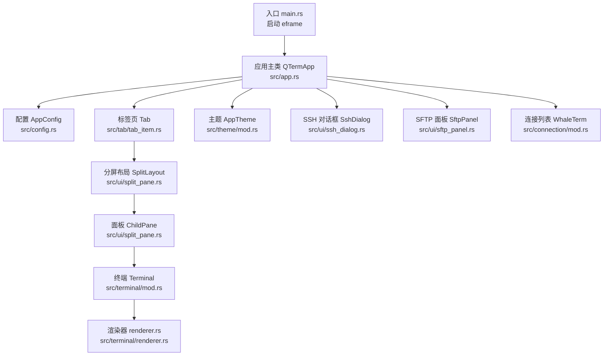
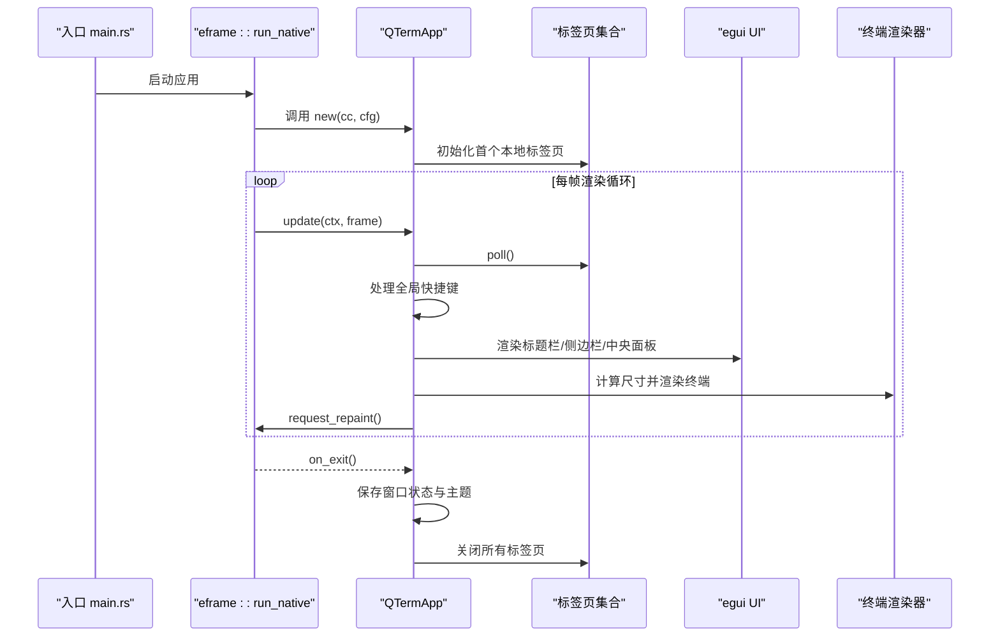
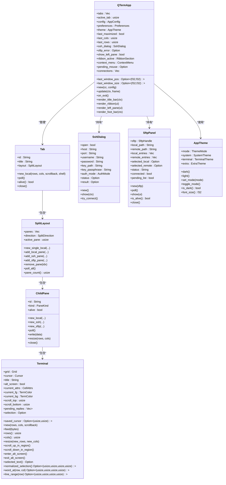

# 应用主API

<cite>
**本文档引用的文件**
- [src/app.rs](file://src/app.rs)
- [src/main.rs](file://src/main.rs)
- [src/config.rs](file://src/config.rs)
- [src/tab/mod.rs](file://src/tab/mod.rs)
- [src/tab/tab_item.rs](file://src/tab/tab_item.rs)
- [src/ui/split_pane.rs](file://src/ui/split_pane.rs)
- [src/ui/ssh_dialog.rs](file://src/ui/ssh_dialog.rs)
- [src/ui/sftp_panel.rs](file://src/ui/sftp_panel.rs)
- [src/theme/mod.rs](file://src/theme/mod.rs)
- [src/connection/mod.rs](file://src/connection/mod.rs)
- [src/connection/models.rs](file://src/connection/models.rs)
- [src/terminal/mod.rs](file://src/terminal/mod.rs)
- [src/terminal/renderer.rs](file://src/terminal/renderer.rs)
</cite>

## 目录
1. [简介](#简介)
2. [项目结构](#项目结构)
3. [核心组件](#核心组件)
4. [架构总览](#架构总览)
5. [详细组件分析](#详细组件分析)
6. [依赖关系分析](#依赖关系分析)
7. [性能考量](#性能考量)
8. [故障排查指南](#故障排查指南)
9. [结论](#结论)
10. [附录](#附录)

## 简介
本文件为 QTermApp 主应用类的详细 API 参考文档，覆盖构造函数、应用生命周期、标签页管理、全局快捷键、UI 渲染接口以及应用状态与事件驱动架构设计。目标是帮助开发者快速理解并正确使用主应用 API，同时为非技术读者提供清晰的功能说明与使用示例。

## 项目结构
QTermApp 位于 src/app.rs，作为 eframe 应用的主控制器，协调配置、主题、标签页、终端渲染与 UI 组件。入口在 src/main.rs，负责加载配置、构建窗口并启动渲染循环。

图表来源
- [src/main.rs:51-87](file://src/main.rs#L51-L87)
- [src/app.rs:18-36](file://src/app.rs#L18-L36)
- [src/config.rs:40-50](file://src/config.rs#L40-L50)
- [src/tab/tab_item.rs:5-9](file://src/tab/tab_item.rs#L5-L9)
- [src/ui/split_pane.rs:153-157](file://src/ui/split_pane.rs#L153-L157)
- [src/terminal/mod.rs:26-41](file://src/terminal/mod.rs#L26-L41)
- [src/terminal/renderer.rs:44-44](file://src/terminal/renderer.rs#L44-L44)
- [src/theme/mod.rs:16-21](file://src/theme/mod.rs#L16-L21)
- [src/ui/ssh_dialog.rs:13-24](file://src/ui/ssh_dialog.rs#L13-L24)
- [src/ui/sftp_panel.rs:14-25](file://src/ui/sftp_panel.rs#L14-L25)
- [src/connection/mod.rs:30-59](file://src/connection/mod.rs#L30-L59)

章节来源
- [src/main.rs:51-87](file://src/main.rs#L51-L87)
- [src/app.rs:18-36](file://src/app.rs#L18-L36)

## 核心组件
- 应用主类 QTermApp：管理窗口状态、标签页集合、主题、SSH/SFTP 对话框、全局快捷键与 UI 渲染。
- 配置系统 AppConfig/Preferences：持久化窗口位置尺寸、主题、字体大小等；从 WhaleTerm preferences.json 读取字体与主题。
- 标签页 Tab：封装 SplitLayout，管理标题与存活状态。
- 分屏布局 SplitLayout/ChildPane：管理面板数量、方向、活动面板与面板生命周期。
- 终端渲染器 renderer.rs：根据 UI 可用空间计算终端行列数并绘制字符、选区与光标。
- 主题系统 AppTheme：组合系统 UI 主题、终端 ANSI 主题与扩展主题。
- SSH 对话框 SshDialog：弹窗收集连接参数并生成 SshConfig。
- SFTP 面板 SftpPanel：双栏文件浏览器，支持上传/下载与目录导航。
- 连接列表 WhaleTerm：从 connections.json 加载连接并解密密码。

章节来源
- [src/app.rs:18-36](file://src/app.rs#L18-L36)
- [src/config.rs:40-127](file://src/config.rs#L40-L127)
- [src/tab/tab_item.rs:5-48](file://src/tab/tab_item.rs#L5-L48)
- [src/ui/split_pane.rs:153-238](file://src/ui/split_pane.rs#L153-L238)
- [src/terminal/renderer.rs:25-198](file://src/terminal/renderer.rs#L25-L198)
- [src/theme/mod.rs:16-71](file://src/theme/mod.rs#L16-L71)
- [src/ui/ssh_dialog.rs:13-147](file://src/ui/ssh_dialog.rs#L13-L147)
- [src/ui/sftp_panel.rs:14-387](file://src/ui/sftp_panel.rs#L14-L387)
- [src/connection/mod.rs:30-148](file://src/connection/mod.rs#L30-L148)

## 架构总览
QTermApp 采用事件驱动架构：
- 生命周期：main.rs 启动 eframe，调用 QTermApp::new 创建实例，随后每帧执行 update()。
- 输入处理：update() 内部轮询标签页数据，处理全局快捷键，渲染 UI 并请求重绘。
- 状态管理：应用状态保存在 QTermApp 字段中，如窗口位置尺寸、主题、标签页集合、左侧面板开关等。
- 渲染管线：标题栏、左侧功能区、中央面板（终端/SFTP）按顺序绘制，支持多面板分屏。

图表来源
- [src/main.rs:82-87](file://src/main.rs#L82-L87)
- [src/app.rs:70-105](file://src/app.rs#L70-L105)
- [src/app.rs:284-589](file://src/app.rs#L284-L589)
- [src/terminal/renderer.rs:26-40](file://src/terminal/renderer.rs#L26-L40)

## 详细组件分析

### 构造函数 new()
- 函数签名
  - 参数
    - cc: eframe::CreationContext<'_>
      - 作用：提供 egui 上下文、窗口句柄等运行时资源。
    - config: AppConfig
      - 作用：应用运行时配置（窗口尺寸、主题、字体大小、Shell 路径等）。
  - 返回值：QTermApp 实例
- 功能要点
  - 加载并应用偏好设置（字体族、字体大小、主题），初始化 egui 字体系统。
  - 根据偏好设置选择深/浅主题，并应用到 egui 上下文。
  - 初始化应用状态：窗口位置/尺寸/最大化标记、终端行列数、SSH 对话框、左侧面板开关、上下文菜单、连接列表等。
  - 创建初始本地终端标签页。
- 使用示例
  - 在入口 main.rs 中通过 eframe::run_native 传入 Box::new(move |cc| Ok(Box::new(QTermApp::new(cc, cfg)))) 创建实例。

章节来源
- [src/app.rs:70-105](file://src/app.rs#L70-L105)
- [src/main.rs:82-87](file://src/main.rs#L82-L87)
- [src/config.rs:68-127](file://src/config.rs#L68-L127)

### 应用生命周期管理
- update(ctx, frame)
  - 轮询所有标签页，读取终端输出并更新标题。
  - 记录窗口内/外矩形，维护 last_window_pos、last_window_size、last_maximized。
  - 全局快捷键处理：根据按键与修饰键触发 Action 枚举对应操作。
  - 渲染 UI：标题栏、左侧面板（图标栏+连接列表）、底部状态栏、中央面板（终端/SFTP）。
  - 处理 SSH 对话框结果：若收到 SshConfig，则添加 SSH 面板。
  - 请求下一帧重绘。
- on_exit()
  - 保存窗口位置、尺寸、最大化状态、主题至 AppConfig。
  - 保存配置文件。
  - 关闭所有标签页。

章节来源
- [src/app.rs:284-589](file://src/app.rs#L284-L589)
- [src/app.rs:577-588](file://src/app.rs#L577-L588)

### 标签页管理 API
- new_tab()
  - 功能：创建本地终端标签页，设置为活动标签页。
  - 参数：无
  - 返回值：无
  - 复杂度：O(1)
- close_tab(idx)
  - 功能：关闭指定索引的标签页，必要时调整活动标签页索引。
  - 参数：idx: usize
  - 返回值：无
  - 边界：若 idx 超出范围或标签页为空则不执行。
- active_tab 切换机制
  - 通过 NextTab 快捷键或点击标题栏标签页进行切换。
  - 切换时更新 active_tab，保证索引有效。

章节来源
- [src/app.rs:189-217](file://src/app.rs#L189-L217)
- [src/app.rs:348-352](file://src/app.rs#L348-L352)
- [src/tab/tab_item.rs:11-48](file://src/tab/tab_item.rs#L11-L48)

### 全局快捷键处理系统
- Action 枚举
  - NewTab、CloseTab、NextTab、SplitHorizontal、SplitVertical、NextPane、ClosePane、OpenSshDialog、OpenSftp、ToggleLeftPane、FontZoomIn、FontZoomOut。
- 键位绑定
  - Ctrl+Shift+H：水平分屏
  - Ctrl+Shift+V：垂直分屏
  - Ctrl+Shift+W：关闭活动面板
  - Ctrl+Shift+N：打开 SSH 对话框
  - Ctrl+Shift+F：打开 SFTP
  - Ctrl+方向右/下：切换到下一个面板
  - Ctrl+T：新建标签页
  - Ctrl+W：关闭标签页
  - Ctrl+Tab：切换到下一个标签页
  - Ctrl+B：切换左侧面板显示
  - Ctrl+= 或 Ctrl++：字体放大
  - Ctrl+-：字体缩小
- 执行流程
  - update() 内部扫描输入，匹配到 Action 后执行相应分支，如 new_tab()、close_tab()、切换面板、调整字体大小、切换左侧面板显示等。

章节来源
- [src/app.rs:267-280](file://src/app.rs#L267-L280)
- [src/app.rs:302-393](file://src/app.rs#L302-L393)

### UI 渲染接口
- 标题栏 render_title_bar(ctx)
  - 绘制窗口拖拽区域、标签页卡片、窗口控制按钮（最小化/最大化/关闭）。
  - 支持双击标题栏切换最大化。
- 左侧面板 render_ribbon(ui) + render_left_pane(ui)
  - 图标栏：终端、SFTP、主题切换。
  - 连接列表：来自 WhaleTerm connections.json 的连接列表。
- 中央面板 egui::CentralPanel
  - 单面板：直接渲染终端或 SFTP。
  - 多面板：根据 SplitDirection（水平/垂直）分配高度/宽度，活动面板带边框高亮。
  - 尺寸适配：根据可用空间与字体大小计算 rows/cols，必要时批量调整面板尺寸。
- 底部状态栏 render_foot_bar(ctx)
  - 用于显示状态信息（如 SSH/SFTP 连接状态）。

章节来源
- [src/app.rs:596-724](file://src/app.rs#L596-L724)
- [src/app.rs:729-788](file://src/app.rs#L729-L788)
- [src/app.rs:793-806](file://src/app.rs#L793-L806)
- [src/app.rs:419-557](file://src/app.rs#L419-L557)

### 分屏与面板管理
- SplitDirection：Horizontal、Vertical
- SplitLayout
  - new_single_local(rows, cols, scrollback, shell)
  - add_local_pane(direction, rows, cols, scrollback, shell)
  - add_ssh_pane(config, direction, rows, cols, scrollback)
  - add_sftp_pane(sftp, direction)
  - remove_pane(idx)
  - poll_all()
  - pane_count()
- ChildPane
  - new_local/new_ssh/new_sftp
  - poll()/write()/resize()/close()

章节来源
- [src/ui/split_pane.rs:6-11](file://src/ui/split_pane.rs#L6-L11)
- [src/ui/split_pane.rs:159-238](file://src/ui/split_pane.rs#L159-L238)
- [src/ui/split_pane.rs:33-149](file://src/ui/split_pane.rs#L33-L149)

### 终端渲染与交互
- calculate_size(ui, font_size)
  - 根据 egui 字体度量计算可容纳的行列数与单元格尺寸。
- render(ui, terminal, theme)
  - 绘制背景、字符、选区高亮、光标。
  - 返回 RenderResult，包含鼠标响应与渲染参数，供后续交互处理（如拖拽选择、双击选词）。
- Terminal
  - 管理 Grid、光标、颜色属性、滚动区域、选择等。
  - 提供 feed(bytes)、resize(new_rows, new_cols)、selected_text() 等方法。

章节来源
- [src/terminal/renderer.rs:25-198](file://src/terminal/renderer.rs#L25-L198)
- [src/terminal/mod.rs:26-200](file://src/terminal/mod.rs#L26-L200)

### SSH 与 SFTP 集成
- SshDialog
  - 弹窗收集主机、端口、用户名、认证方式（密码/私钥）。
  - 生成 SshConfig 并返回给主逻辑。
- SftpPanel
  - 双栏文件浏览器：本地与远程目录。
  - 支持上传/下载、目录导航、状态反馈。
  - 通过 SftpHandle 轮询事件并更新 UI。

章节来源
- [src/ui/ssh_dialog.rs:13-147](file://src/ui/ssh_dialog.rs#L13-L147)
- [src/ui/sftp_panel.rs:14-387](file://src/ui/sftp_panel.rs#L14-L387)

### 配置与偏好
- AppConfig
  - 窗口位置/尺寸/最大化、主题、字体大小、回滚行数、Shell 路径。
  - load()/save() 读写 config.ini。
- Preferences
  - 从 WhaleTerm preferences.json 读取字体族、字体大小、主题等。
- WhaleTerm 连接列表
  - 从 connections.json 加载并解密密码，扁平化为 Connection 列表。

章节来源
- [src/config.rs:39-127](file://src/config.rs#L39-L127)
- [src/config.rs:209-281](file://src/config.rs#L209-L281)
- [src/connection/mod.rs:30-148](file://src/connection/mod.rs#L30-L148)
- [src/connection/models.rs:3-43](file://src/connection/models.rs#L3-L43)

## 依赖关系分析

图表来源
- [src/app.rs:18-36](file://src/app.rs#L18-L36)
- [src/tab/tab_item.rs:5-48](file://src/tab/tab_item.rs#L5-L48)
- [src/ui/split_pane.rs:153-238](file://src/ui/split_pane.rs#L153-L238)
- [src/terminal/mod.rs:26-200](file://src/terminal/mod.rs#L26-L200)
- [src/ui/ssh_dialog.rs:13-147](file://src/ui/ssh_dialog.rs#L13-L147)
- [src/ui/sftp_panel.rs:14-387](file://src/ui/sftp_panel.rs#L14-L387)
- [src/theme/mod.rs:16-71](file://src/theme/mod.rs#L16-L71)

## 性能考量
- 终端渲染优化
  - 按颜色分段绘制文本，减少绘制调用次数。
  - 仅对非默认背景色单元格绘制背景，降低像素填充成本。
- 尺寸计算
  - calculate_size 依据字体度量计算行列数，避免频繁重排。
  - 多面板时按可用空间均分尺寸，减少重绘抖动。
- 数据轮询
  - 每帧仅轮询活跃面板，避免不必要的 IO。
- 字体系统
  - 首次启动时一次性配置 egui 字体，后续通过配置刷新字体大小，避免重复加载字体文件。

[本节为通用性能建议，无需特定文件来源]

## 故障排查指南
- 无法创建标签页
  - 检查 shell_path 配置与权限；查看 new_tab() 的错误日志输出。
- 字体显示异常
  - 确认 Preferences 中字体族存在且可访问；检查 configure_fonts() 是否成功加载字体。
- SSH/SFTP 连接失败
  - 查看 SshDialog.status 与 SftpPanel.status 的错误信息；确认网络连通性与凭据正确性。
- 窗口位置不在显示器内
  - 入口处 is_position_visible() 会过滤不可见位置；请手动调整配置或移除无效位置。
- 面板无法关闭
  - 确保至少保留一个面板；remove_pane(idx) 会在 idx 超出范围或只剩一个面板时不执行。

章节来源
- [src/app.rs:196-204](file://src/app.rs#L196-L204)
- [src/app.rs:109-171](file://src/app.rs#L109-L171)
- [src/ui/ssh_dialog.rs:117-146](file://src/ui/ssh_dialog.rs#L117-L146)
- [src/ui/sftp_panel.rs:52-110](file://src/ui/sftp_panel.rs#L52-L110)
- [src/main.rs:17-47](file://src/main.rs#L17-L47)
- [src/ui/split_pane.rs:224-232](file://src/ui/split_pane.rs#L224-L232)

## 结论
QTermApp 通过清晰的职责划分与事件驱动架构，实现了从配置加载、标签页管理、分屏渲染到 SSH/SFTP 集成的完整终端体验。其 API 设计简洁直观，适合扩展更多面板类型与交互能力。建议在新增功能时遵循现有模块边界与数据流，保持状态一致性与渲染性能。

[本节为总结性内容，无需特定文件来源]

## 附录

### API 一览与使用示例

- 构造函数
  - 函数：QTermApp::new(cc, config)
  - 参数：cc: eframe::CreationContext<'_>, config: AppConfig
  - 返回：QTermApp
  - 示例：入口 main.rs 中通过 eframe::run_native 创建实例。
  - 章节来源
    - [src/app.rs:70-105](file://src/app.rs#L70-L105)
    - [src/main.rs:82-87](file://src/main.rs#L82-L87)

- 生命周期
  - update(ctx, frame)
    - 功能：轮询标签页、处理快捷键、渲染 UI、请求重绘。
    - 章节来源
      - [src/app.rs:284-589](file://src/app.rs#L284-L589)
  - on_exit()
    - 功能：保存窗口状态与主题、关闭所有标签页。
    - 章节来源
      - [src/app.rs:577-588](file://src/app.rs#L577-L588)

- 标签页管理
  - new_tab()
    - 功能：创建本地终端标签页并设为活动。
    - 章节来源
      - [src/app.rs:189-217](file://src/app.rs#L189-L217)
  - close_tab(idx)
    - 功能：关闭指定索引标签页并调整活动索引。
    - 章节来源
      - [src/app.rs:207-217](file://src/app.rs#L207-L217)

- 全局快捷键
  - Action 枚举与键位绑定详见“全局快捷键处理系统”章节。
  - 章节来源
    - [src/app.rs:267-280](file://src/app.rs#L267-L280)
    - [src/app.rs:302-393](file://src/app.rs#L302-L393)

- UI 渲染
  - 标题栏：render_title_bar(ctx)
  - 左侧图标栏：render_ribbon(ui)
  - 左侧面板：render_left_pane(ui)
  - 中央面板：egui::CentralPanel
  - 底部状态栏：render_foot_bar(ctx)
  - 章节来源
    - [src/app.rs:596-724](file://src/app.rs#L596-L724)
    - [src/app.rs:729-788](file://src/app.rs#L729-L788)
    - [src/app.rs:793-806](file://src/app.rs#L793-L806)
    - [src/app.rs:419-557](file://src/app.rs#L419-L557)

- 分屏与面板
  - SplitLayout：new_single_local/add_local_pane/add_ssh_pane/add_sftp_pane/remove_pane/poll_all/pane_count
  - ChildPane：new_local/new_ssh/new_sftp/poll/write/resize/close
  - 章节来源
    - [src/ui/split_pane.rs:159-238](file://src/ui/split_pane.rs#L159-L238)
    - [src/ui/split_pane.rs:33-149](file://src/ui/split_pane.rs#L33-L149)

- 终端渲染
  - calculate_size(ui, font_size)
  - render(ui, terminal, theme)
  - Terminal：feed/resizeselected_text/word_at/line_range 等
  - 章节来源
    - [src/terminal/renderer.rs:25-198](file://src/terminal/renderer.rs#L25-L198)
    - [src/terminal/mod.rs:26-200](file://src/terminal/mod.rs#L26-L200)

- 配置与偏好
  - AppConfig：load/save
  - Preferences：load
  - WhaleTerm 连接：load_connections
  - 章节来源
    - [src/config.rs:68-127](file://src/config.rs#L68-L127)
    - [src/config.rs:242-281](file://src/config.rs#L242-L281)
    - [src/connection/mod.rs:30-148](file://src/connection/mod.rs#L30-L148)