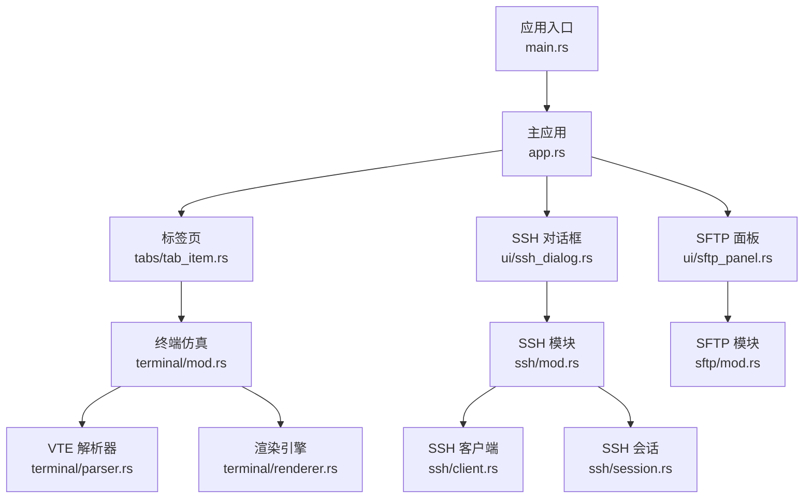
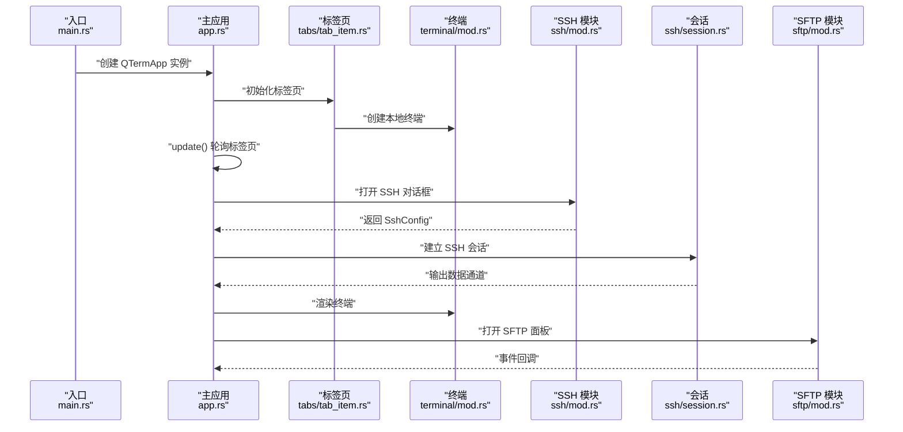
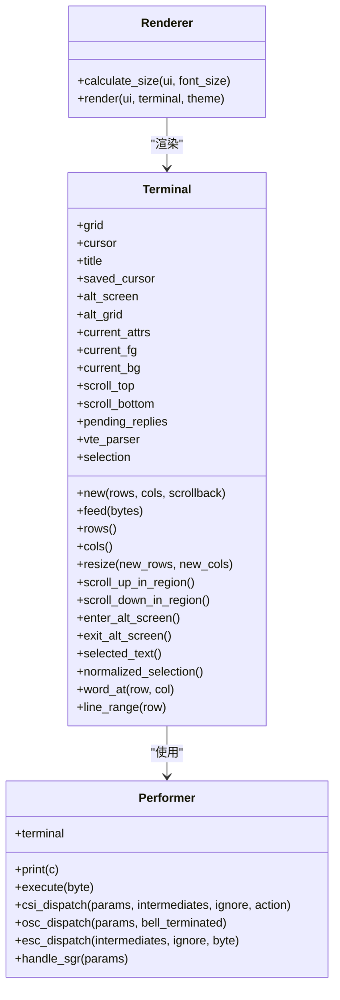
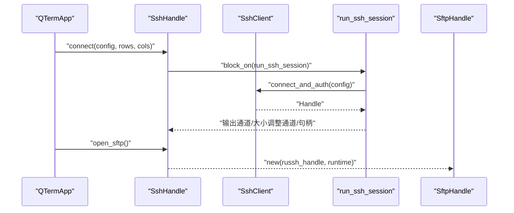
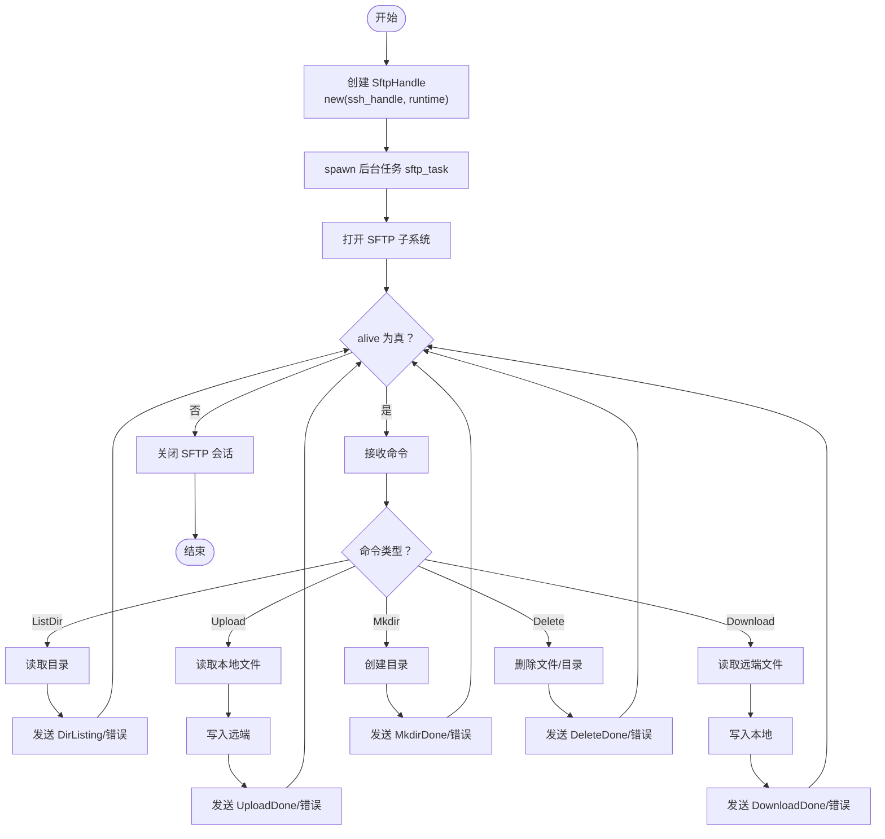
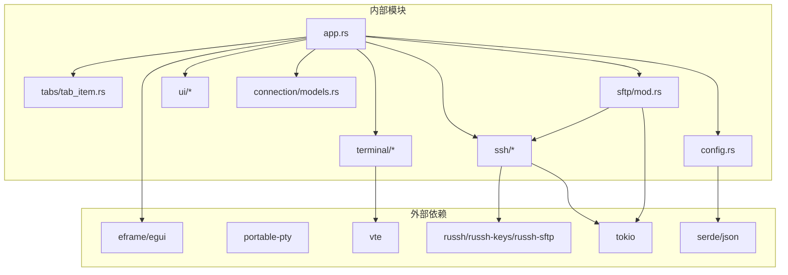

# 核心API

<cite>
**本文引用的文件**
- [src/app.rs](file://src/app.rs)
- [src/main.rs](file://src/main.rs)
- [src/ssh/mod.rs](file://src/ssh/mod.rs)
- [src/ssh/client.rs](file://src/ssh/client.rs)
- [src/ssh/session.rs](file://src/ssh/session.rs)
- [src/sftp/mod.rs](file://src/sftp/mod.rs)
- [src/ui/sftp_panel.rs](file://src/ui/sftp_panel.rs)
- [src/ui/ssh_dialog.rs](file://src/ui/ssh_dialog.rs)
- [src/tabs/tab_item.rs](file://src/tabs/tab_item.rs)
- [src/terminal/mod.rs](file://src/terminal/mod.rs)
- [src/terminal/parser.rs](file://src/terminal/parser.rs)
- [src/terminal/renderer.rs](file://src/terminal/renderer.rs)
- [src/connection/models.rs](file://src/connection/models.rs)
- [src/config.rs](file://src/config.rs)
- [Cargo.toml](file://Cargo.toml)
</cite>

## 目录
1. [简介](#简介)
2. [项目结构](#项目结构)
3. [核心组件](#核心组件)
4. [架构总览](#架构总览)
5. [详细组件分析](#详细组件分析)
6. [依赖分析](#依赖分析)
7. [性能考虑](#性能考虑)
8. [故障排查指南](#故障排查指南)
9. [结论](#结论)
10. [附录](#附录)

## 简介
本文件为 QTerm 项目的核心 API 参考文档，聚焦以下方面：
- QTermApp 主应用类的公共方法与属性、构造与生命周期、事件处理接口
- 终端模块 API：终端状态管理、VTE 解析器集成、渲染引擎接口
- SSH 模块核心接口：客户端连接、会话管理、认证接口
- SFTP 模块文件传输 API：文件浏览、上传下载、进度与事件监控
- 每个 API 的函数签名、参数说明、返回值类型、错误处理机制
- 实际使用示例的代码片段路径指引
- API 间的依赖关系与调用顺序，帮助开发者理解整体架构

## 项目结构
QTerm 采用模块化组织，核心模块如下：
- 应用入口与主应用：main.rs、app.rs
- 配置与连接：config.rs、connection/models.rs
- 标签页与布局：tabs/tab_item.rs
- 终端仿真：terminal/mod.rs、terminal/parser.rs、terminal/renderer.rs
- SSH：ssh/mod.rs、ssh/client.rs、ssh/session.rs
- SFTP：sftp/mod.rs
- UI 组件：ui/ssh_dialog.rs、ui/sftp_panel.rs

图表来源
- [src/main.rs:49-87](file://src/main.rs#L49-L87)
- [src/app.rs:18-217](file://src/app.rs#L18-L217)
- [src/tabs/tab_item.rs:3-39](file://src/tabs/tab_item.rs#L3-L39)
- [src/terminal/mod.rs:22-173](file://src/terminal/mod.rs#L22-L173)
- [src/terminal/parser.rs:4-299](file://src/terminal/parser.rs#L4-L299)
- [src/terminal/renderer.rs:21-184](file://src/terminal/renderer.rs#L21-L184)
- [src/ui/ssh_dialog.rs:10-131](file://src/ui/ssh_dialog.rs#L10-L131)
- [src/ssh/mod.rs:18-136](file://src/ssh/mod.rs#L18-L136)
- [src/ssh/client.rs:23-63](file://src/ssh/client.rs#L23-L63)
- [src/ssh/session.rs:11-90](file://src/ssh/session.rs#L11-L90)
- [src/ui/sftp_panel.rs:11-358](file://src/ui/sftp_panel.rs#L11-L358)
- [src/sftp/mod.rs:7-206](file://src/sftp/mod.rs#L7-L206)

章节来源
- [src/main.rs:49-87](file://src/main.rs#L49-L87)
- [src/app.rs:18-217](file://src/app.rs#L18-L217)

## 核心组件
本节概述各模块的关键公开类型与职责：
- QTermApp：应用主控制器，负责 UI 生命周期、标签页管理、SSH/SFTP 集成、主题与字体配置
- 终端模块：Terminal、Parser、Renderer，实现 VT100/ANSI 解析与渲染
- SSH 模块：SshConfig、SshAuth、SshHandle、SharedSshHandle，封装连接、认证、会话与 SFTP 句柄复用
- SFTP 模块：SftpHandle、SftpEvent、SftpCommand，提供异步文件操作与事件通知
- UI 组件：SshDialog、SftpPanel，提供对话框与面板交互

章节来源
- [src/app.rs:18-217](file://src/app.rs#L18-L217)
- [src/terminal/mod.rs:22-173](file://src/terminal/mod.rs#L22-L173)
- [src/ssh/mod.rs:18-136](file://src/ssh/mod.rs#L18-L136)
- [src/sftp/mod.rs:7-206](file://src/sftp/mod.rs#L7-L206)
- [src/ui/ssh_dialog.rs:10-131](file://src/ui/ssh_dialog.rs#L10-L131)
- [src/ui/sftp_panel.rs:11-358](file://src/ui/sftp_panel.rs#L11-L358)

## 架构总览
下图展示应用启动、更新循环、SSH/SFTP 与终端的交互流程。

图表来源
- [src/main.rs:51-87](file://src/main.rs#L51-L87)
- [src/app.rs:284-589](file://src/app.rs#L284-L589)
- [src/tabs/tab_item.rs:9-28](file://src/tabs/tab_item.rs#L9-L28)
- [src/ssh/mod.rs:68-136](file://src/ssh/mod.rs#L68-L136)
- [src/ssh/session.rs:11-90](file://src/ssh/session.rs#L11-L90)
- [src/sftp/mod.rs:39-96](file://src/sftp/mod.rs#L39-L96)

## 详细组件分析

### QTermApp 主应用类 API
- 构造函数
  - 函数签名：new(cc: &CreationContext<'_>, config: AppConfig) -> Self
  - 功能：加载偏好设置、配置字体、应用主题、创建初始本地终端标签页
  - 参数：
    - cc: eframe 的 CreationContext，用于 egui 上下文与窗口配置
    - config: AppConfig，应用运行时配置
  - 返回值：QTermApp 实例
  - 错误处理：内部捕获标签页创建失败并打印错误日志
- 生命周期与事件处理
  - 方法：update(ctx: &Context, frame: &mut Frame)
    - 功能：轮询标签页、处理全局快捷键、渲染 UI、处理 SSH 结果、处理输入
    - 行为要点：根据分屏方向与面板数量动态计算目标行列数；渲染终端或 SFTP 面板；处理对话框结果并添加 SSH 面板
  - 方法：on_exit()
    - 功能：保存窗口状态、主题、字体至配置，并关闭所有标签页
- 标签页管理
  - 方法：new_tab() -> ()
    - 功能：创建本地终端标签页，支持自定义 shell
  - 方法：close_tab(idx: usize) -> ()
    - 功能：关闭指定索引的标签页
- 字体与主题
  - 方法：configure_fonts(ctx: &Context, prefs: &Preferences) -> ()
    - 功能：加载用户字体与系统回退字体，设置到 egui
  - 方法：shell_font_id() -> FontId
    - 功能：获取等宽终端字体 ID
- UI 渲染
  - 方法：render_title_bar(ctx: &Context) -> ()
  - 方法：render_ribbon(ui: &mut Ui) -> ()
  - 方法：render_left_pane(ui: &mut Ui) -> ()
  - 方法：render_foot_bar(ctx: &Context) -> ()
- 示例（代码片段路径）
  - [QTermApp::new 构造:70-105](file://src/app.rs#L70-L105)
  - [QTermApp::update 更新循环:284-589](file://src/app.rs#L284-L589)
  - [QTermApp::on_exit 退出保存:577-588](file://src/app.rs#L577-L588)
  - [QTermApp::new_tab 新建标签页:189-205](file://src/app.rs#L189-L205)
  - [QTermApp::close_tab 关闭标签页:207-216](file://src/app.rs#L207-L216)
  - [QTermApp::configure_fonts 字体配置:108-171](file://src/app.rs#L108-L171)
  - [QTermApp::shell_font_id 字体ID:184-187](file://src/app.rs#L184-L187)

章节来源
- [src/app.rs:67-217](file://src/app.rs#L67-L217)

### 终端模块 API
- 终端核心类型
  - 结构体：Terminal
    - 字段：grid、cursor、title、saved_cursor、alt_screen、alt_grid、current_attrs、current_fg、current_bg、scroll_top、scroll_bottom、pending_replies、vte_parser、selection
    - 方法：
      - new(rows: usize, cols: usize, scrollback: usize) -> Self
      - feed(bytes: &[u8]) -> ()
      - rows() -> usize
      - cols() -> usize
      - resize(new_rows: usize, new_cols: usize) -> ()
      - scroll_up_in_region() -> ()
      - scroll_down_in_region() -> ()
      - enter_alt_screen() -> ()
      - exit_alt_screen() -> ()
      - selected_text() -> Option<String>
      - normalized_selection() -> Option<(usize, usize, usize, usize)>
      - word_at(row: usize, col: usize) -> Option<(usize, usize, usize, usize)>
      - line_range(row: usize) -> Option<(usize, usize, usize, usize)>
  - 结构体：Cursor
  - 结构体：Selection
- VTE 解析器
  - 结构体：Performer<'a>
    - 实现 vte::Perform，处理 print、execute、csi_dispatch、osc_dispatch、esc_dispatch 等
    - 方法：handle_sgr(params: &[u16]) -> ()
- 渲染引擎
  - 函数：calculate_size(ui: &Ui, font_size: f32) -> TerminalSize
  - 函数：render(ui: &mut Ui, terminal: &Terminal, theme: &TerminalTheme) -> RenderResult
  - 结构体：TerminalSize、RenderResult
- 示例（代码片段路径）
  - [Terminal::new/feed/resize:39-86](file://src/terminal/mod.rs#L39-L86)
  - [Performer::csi_dispatch/osc_dispatch:59-185](file://src/terminal/parser.rs#L59-L185)
  - [Performer::handle_sgr:225-299](file://src/terminal/parser.rs#L225-L299)
  - [renderer::calculate_size/render:21-167](file://src/terminal/renderer.rs#L21-L167)

图表来源
- [src/terminal/mod.rs:22-173](file://src/terminal/mod.rs#L22-L173)
- [src/terminal/parser.rs:4-299](file://src/terminal/parser.rs#L4-L299)
- [src/terminal/renderer.rs:21-184](file://src/terminal/renderer.rs#L21-L184)

章节来源
- [src/terminal/mod.rs:22-173](file://src/terminal/mod.rs#L22-L173)
- [src/terminal/parser.rs:4-299](file://src/terminal/parser.rs#L4-L299)
- [src/terminal/renderer.rs:21-184](file://src/terminal/renderer.rs#L21-L184)

### SSH 模块 API
- 配置与认证
  - 结构体：SshConfig
    - 字段：host、port、username、auth(SshAuth)、timeout_secs
  - 枚举：SshAuth
    - 成员：Password(String)、PrivateKey { path: String, passphrase: Option<String> }
- 错误类型
  - 枚举：SshError
    - 成员：Connection(String)、Auth(String)、Channel(String)
- 连接句柄
  - 结构体：SshHandle
    - 字段：reader_rx、writer_tx、resize_tx、alive(Arc<AtomicBool>)、russh_handle
    - 方法：
      - connect(config: SshConfig, rows: u16, cols: u16) -> Result<Self, SshError>
      - write(data: &[u8]) -> Result<(), SshError>
      - resize(rows: u16, cols: u16) -> ()
      - is_alive() -> bool
      - disconnect() -> ()
      - open_sftp() -> Result<SftpHandle, SshError>
- 全局运行时
  - 函数：get_runtime() -> &'static Runtime
- 客户端与会话
  - 函数：connect_and_auth(config: &SshConfig) -> Result<Handle<SshClient>, SshError>
  - 函数：run_ssh_session(...) -> Result<(), SshError>
- 示例（代码片段路径）
  - [SshConfig/SshAuth/SshError:18-54](file://src/ssh/mod.rs#L18-L54)
  - [SshHandle::connect/write/resize/is_alive/disconnect/open_sftp:68-136](file://src/ssh/mod.rs#L68-L136)
  - [get_runtime 全局运行时:8-16](file://src/ssh/mod.rs#L8-L16)
  - [connect_and_auth 密码/私钥认证:23-63](file://src/ssh/client.rs#L23-63)
  - [run_ssh_session 会话循环:11-90](file://src/ssh/session.rs#L11-90)

图表来源
- [src/ssh/mod.rs:68-136](file://src/ssh/mod.rs#L68-L136)
- [src/ssh/client.rs:23-63](file://src/ssh/client.rs#L23-L63)
- [src/ssh/session.rs:11-90](file://src/ssh/session.rs#L11-L90)
- [src/sftp/mod.rs:39-58](file://src/sftp/mod.rs#L39-L58)

章节来源
- [src/ssh/mod.rs:18-136](file://src/ssh/mod.rs#L18-L136)
- [src/ssh/client.rs:23-63](file://src/ssh/client.rs#L23-L63)
- [src/ssh/session.rs:11-90](file://src/ssh/session.rs#L11-L90)

### SFTP 模块 API
- 句柄与事件
  - 结构体：SftpHandle
    - 字段：events_rx、cmd_tx、alive
    - 方法：new(ssh_handle, rt) -> Result<Self, SshError>
      - 功能：在 tokio 运行时中启动后台任务，打开 SFTP 子系统
      - 返回：SftpHandle 或 SshError
    - 方法：poll() -> Vec<SftpEvent>
      - 功能：非阻塞拉取事件队列
    - 方法：is_alive() -> bool
    - 方法：disconnect() -> ()
    - 方法：list_dir(path: &str) -> ()
    - 方法：upload(local_path: String, remote_path: String) -> ()
    - 方法：download(remote_path: String, local_path: String) -> ()
    - 方法：mkdir(path: String) -> ()
    - 方法：delete(path: String, is_dir: bool) -> ()
  - 枚举：SftpEvent
    - 成员：Connected、DirListing(Vec<FileEntry>)、UploadDone(Result<(), String>)、DownloadDone(Result<(), String>)、MkdirDone(Result<(), String>)、DeleteDone(Result<(), String>)、Error(String)
  - 结构体：FileEntry
    - 字段：name、is_dir、size
- 后台任务
  - 函数：sftp_task(ssh_handle, events_tx, cmd_rx, alive) -> ()
  - 函数：handle_command(sftp, events_tx, cmd) -> ()
- 示例（代码片段路径）
  - [SftpHandle::new/poll/list_dir/upload/download/mkdir/delete/disconnect:39-96](file://src/sftp/mod.rs#L39-L96)
  - [sftp_task/handle_command:98-206](file://src/sftp/mod.rs#L98-L206)

图表来源
- [src/sftp/mod.rs:39-206](file://src/sftp/mod.rs#L39-L206)

章节来源
- [src/sftp/mod.rs:7-206](file://src/sftp/mod.rs#L7-L206)

### UI 组件 API
- SSH 对话框
  - 结构体：SshDialog
    - 字段：open、host、port、username、password、key_path、key_passphrase、auth_mode、status、result
    - 方法：new() -> Self
    - 方法：show(ctx: &Context) -> ()
    - 方法：try_connect() -> ()
- SFTP 面板
  - 结构体：SftpPanel
    - 字段：sftp、local_path、remote_path、local_entries、remote_entries、selected_local、selected_remote、status、connected、pending_list
    - 方法：new(sftp: SftpHandle) -> Self
    - 方法：poll() -> ()
    - 方法：show(ui: &mut Ui) -> ()
    - 方法：is_alive() -> bool
    - 方法：close() -> ()
    - 方法：refresh_local()/navigate_local_into()/navigate_local_up()
    - 方法：navigate_remote_into()/navigate_remote_up()
    - 方法：do_upload()/do_download()
- 示例（代码片段路径）
  - [SshDialog::new/show/try_connect:23-131](file://src/ui/ssh_dialog.rs#L23-131)
  - [SftpPanel::new/poll/show:24-142](file://src/ui/sftp_panel.rs#L24-142)

章节来源
- [src/ui/ssh_dialog.rs:10-131](file://src/ui/ssh_dialog.rs#L10-L131)
- [src/ui/sftp_panel.rs:11-358](file://src/ui/sftp_panel.rs#L11-L358)

## 依赖分析
- 外部依赖
  - eframe/egui：UI 框架与渲染
  - portable-pty：本地伪终端
  - vte：VT100/ANSI 控制序列解析
  - russh/russh-keys/russh-sftp：SSH 客户端、密钥与 SFTP
  - tokio：异步运行时
  - serde/json：配置与连接文件解析
- 内部模块耦合
  - app.rs 依赖 tabs、terminal、ssh、sftp、ui、config、connection
  - ssh 模块依赖 russh 生态，通过共享句柄复用到 SFTP
  - sftp 模块依赖 ssh 的共享句柄与 tokio 运行时
  - terminal 模块依赖 vte 与 egui 主题

图表来源
- [Cargo.toml:8-25](file://Cargo.toml#L8-L25)
- [src/app.rs:18-36](file://src/app.rs#L18-L36)
- [src/ssh/mod.rs:55-56](file://src/ssh/mod.rs#L55-L56)
- [src/sftp/mod.rs:1-2](file://src/sftp/mod.rs#L1-L2)

章节来源
- [Cargo.toml:8-25](file://Cargo.toml#L8-L25)
- [src/app.rs:18-36](file://src/app.rs#L18-L36)

## 性能考虑
- 异步与并发
  - SSH/SFTP 使用独立 tokio 运行时与后台任务，避免阻塞 UI 线程
  - 使用 mpsc 通道进行数据流控制，限制缓冲区大小防止内存膨胀
- 渲染优化
  - 终端渲染按颜色分段绘制文本，减少绘制调用次数
  - 使用 egui Painter 的批量绘制与裁剪
- 资源管理
  - 连接存活标志与优雅断开，避免资源泄漏
  - 标签页关闭时统一释放终端与面板资源

## 故障排查指南
- SSH 连接失败
  - 现象：SshError::Connection 或 SshError::Auth
  - 排查：确认主机、端口、用户名、认证方式；检查密钥路径与口令；查看会话日志
  - 参考：[connect_and_auth:23-63](file://src/ssh/client.rs#L23-63)、[run_ssh_session:11-90](file://src/ssh/session.rs#L11-90)
- SFTP 操作异常
  - 现象：SftpEvent::Error
  - 排查：检查路径权限、网络连通性、远端磁盘空间；确认命令类型与参数
  - 参考：[handle_command:142-206](file://src/sftp/mod.rs#L142-L206)
- 终端渲染错位
  - 现象：字符对齐、光标位置异常
  - 排查：检查字体宽度计算、终端尺寸变更、分屏布局；确认 egui 上下文字体配置
  - 参考：[renderer::calculate_size/render:21-167](file://src/terminal/renderer.rs#L21-L167)
- 应用退出未保存
  - 现象：窗口位置、主题未持久化
  - 排查：确认 on_exit 调用链与配置保存逻辑
  - 参考：[QTermApp::on_exit:577-588](file://src/app.rs#L577-L588)、[AppConfig::save:100-126](file://src/config.rs#L100-L126)

章节来源
- [src/ssh/client.rs:23-63](file://src/ssh/client.rs#L23-L63)
- [src/ssh/session.rs:11-90](file://src/ssh/session.rs#L11-L90)
- [src/sftp/mod.rs:142-206](file://src/sftp/mod.rs#L142-L206)
- [src/terminal/renderer.rs:21-167](file://src/terminal/renderer.rs#L21-L167)
- [src/app.rs:577-588](file://src/app.rs#L577-L588)
- [src/config.rs:100-126](file://src/config.rs#L100-L126)

## 结论
QTerm 的核心 API 以模块化设计实现清晰的职责分离：应用层负责 UI 生命周期与集成，终端层提供 VT 解析与渲染，SSH/SFTP 提供安全远程能力。通过异步通道与共享句柄复用，系统在保证易用性的同时兼顾性能与稳定性。开发者可基于本文档提供的 API 参考与示例路径快速集成与扩展功能。

## 附录
- 配置与连接
  - AppConfig/AppConfig::load/save：窗口、主题、字体、Shell 路径等运行时配置
  - Preferences/Preferences::load：从 WhaleTerm preferences.json 读取字体与主题
  - Connection/ConnectionsFile：WhaleTerm 连接配置结构
  - 示例（代码片段路径）
    - [AppConfig::load/save:68-127](file://src/config.rs#L68-L127)
    - [Preferences::load:239-281](file://src/config.rs#L239-L281)
    - [ConnectionsFile/WhaleGroup/WhaleConnection/Connection:3-43](file://src/connection/models.rs#L3-L43)

章节来源
- [src/config.rs:68-127](file://src/config.rs#L68-L127)
- [src/config.rs:239-281](file://src/config.rs#L239-L281)
- [src/connection/models.rs:3-43](file://src/connection/models.rs#L3-L43)