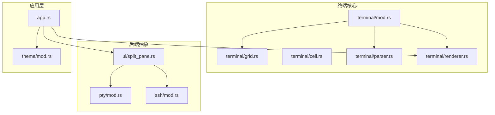
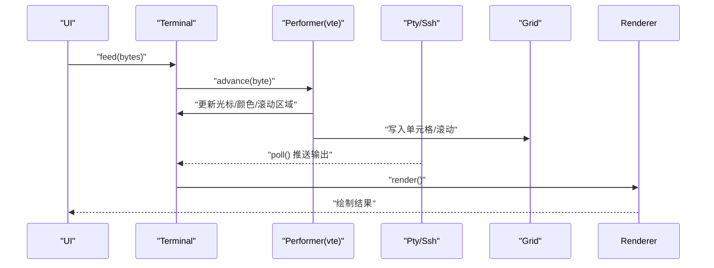
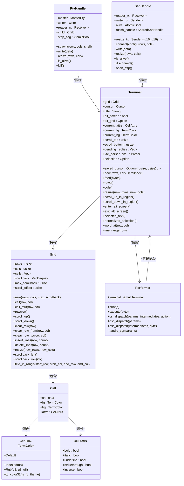
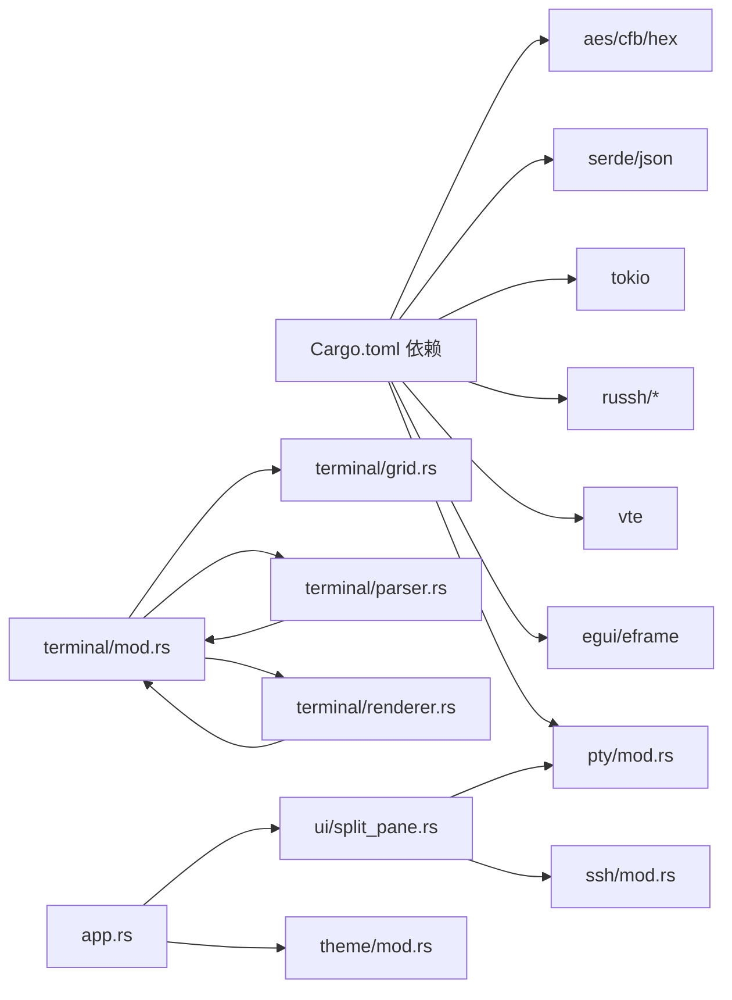

# 终端API

<cite>
**本文档引用的文件**
- [src/terminal/mod.rs](file://src/terminal/mod.rs)
- [src/terminal/grid.rs](file://src/terminal/grid.rs)
- [src/terminal/cell.rs](file://src/terminal/cell.rs)
- [src/terminal/parser.rs](file://src/terminal/parser.rs)
- [src/terminal/renderer.rs](file://src/terminal/renderer.rs)
- [src/pty/mod.rs](file://src/pty/mod.rs)
- [src/ssh/mod.rs](file://src/ssh/mod.rs)
- [src/ui/split_pane.rs](file://src/ui/split_pane.rs)
- [src/app.rs](file://src/app.rs)
- [src/theme/mod.rs](file://src/theme/mod.rs)
- [Cargo.toml](file://Cargo.toml)
</cite>

## 目录
1. [简介](#简介)
2. [项目结构](#项目结构)
3. [核心组件](#核心组件)
4. [架构总览](#架构总览)
5. [详细组件分析](#详细组件分析)
6. [依赖关系分析](#依赖关系分析)
7. [性能考量](#性能考量)
8. [故障排查指南](#故障排查指南)
9. [结论](#结论)
10. [附录](#附录)

## 简介
本文件为 QTerm 终端系统提供的详细 API 参考与架构说明，覆盖以下方面：
- Terminal 核心结构体的公共方法：终端状态管理、网格操作、渲染接口
- Grid 网格系统 API：单元格操作、滚动缓冲区管理、文本选择
- VTE 解析器集成接口：控制序列解析、ANSI 转义码处理、终端状态更新
- 渲染引擎 API：字符绘制、颜色处理、光标管理
- 终端后端接口：本地 PTY 与 SSH 会话的统一抽象
- 每个 API 的函数签名、参数类型、返回值与错误处理机制
- 实际使用示例（以“代码片段路径”形式给出）
- 终端模拟器的架构设计与性能优化策略

## 项目结构
QTerm 采用模块化组织，终端核心位于 src/terminal，后端抽象位于 src/pty 与 src/ssh，UI 与布局位于 src/ui，主题与应用入口位于 src/theme 与 src/app。

图表来源
- [src/terminal/mod.rs:1-200](file://src/terminal/mod.rs#L1-L200)
- [src/terminal/grid.rs:1-148](file://src/terminal/grid.rs#L1-L148)
- [src/terminal/cell.rs:1-75](file://src/terminal/cell.rs#L1-L75)
- [src/terminal/parser.rs:1-311](file://src/terminal/parser.rs#L1-L311)
- [src/terminal/renderer.rs:1-198](file://src/terminal/renderer.rs#L1-L198)
- [src/pty/mod.rs:1-121](file://src/pty/mod.rs#L1-L121)
- [src/ssh/mod.rs:1-136](file://src/ssh/mod.rs#L1-L136)
- [src/ui/split_pane.rs:1-238](file://src/ui/split_pane.rs#L1-L238)
- [src/app.rs:1-800](file://src/app.rs#L1-L800)
- [src/theme/mod.rs:1-81](file://src/theme/mod.rs#L1-L81)

章节来源
- [src/terminal/mod.rs:1-200](file://src/terminal/mod.rs#L1-L200)
- [src/pty/mod.rs:1-121](file://src/pty/mod.rs#L1-L121)
- [src/ssh/mod.rs:1-136](file://src/ssh/mod.rs#L1-L136)
- [src/ui/split_pane.rs:1-238](file://src/ui/split_pane.rs#L1-L238)
- [src/app.rs:1-800](file://src/app.rs#L1-L800)
- [src/theme/mod.rs:1-81](file://src/theme/mod.rs#L1-L81)

## 核心组件
- Terminal：终端仿真器核心，聚合 Grid、光标、颜色属性、滚动区域、选择、VTE 解析器与待回复队列
- Grid：字符网格与滚动缓冲区，提供单元格访问、滚动、清屏、文本提取等
- Cell：单元格数据结构，包含字符、前景/背景色、显示属性
- Parser/Performer：VTE 解析器执行器，将 ANSI 控制序列映射到 Terminal 状态
- Renderer：渲染引擎，负责绘制字符、选区高亮、光标、颜色解析
- PtyHandle/SshHandle：后端抽象，分别封装本地 PTY 与 SSH 会话的读写、大小调整与生命周期
- SplitLayout/ChildPane：分屏布局与面板管理，统一调度本地/远程终端与 SFTP 面板

章节来源
- [src/terminal/mod.rs:24-41](file://src/terminal/mod.rs#L24-L41)
- [src/terminal/grid.rs:5-14](file://src/terminal/grid.rs#L5-L14)
- [src/terminal/cell.rs:5-75](file://src/terminal/cell.rs#L5-L75)
- [src/terminal/parser.rs:4-8](file://src/terminal/parser.rs#L4-L8)
- [src/terminal/renderer.rs:7-24](file://src/terminal/renderer.rs#L7-L24)
- [src/pty/mod.rs:9-17](file://src/pty/mod.rs#L9-L17)
- [src/ssh/mod.rs:58-66](file://src/ssh/mod.rs#L58-L66)
- [src/ui/split_pane.rs:25-31](file://src/ui/split_pane.rs#L25-L31)

## 架构总览
QTerm 的核心是 Terminal，它通过 VTE 解析器将字节流转换为终端状态变更；渲染器基于 egui 将状态绘制到 UI；后端抽象（PtyHandle/SshHandle）负责与系统 Shell 或远端 SSH 会话通信，并通过 SplitLayout/ChildPane 提供多面板分屏能力。

图表来源
- [src/terminal/mod.rs:65-74](file://src/terminal/mod.rs#L65-L74)
- [src/terminal/parser.rs:10-32](file://src/terminal/parser.rs#L10-L32)
- [src/ui/split_pane.rs:70-113](file://src/ui/split_pane.rs#L70-L113)
- [src/terminal/renderer.rs:42-180](file://src/terminal/renderer.rs#L42-L180)

## 详细组件分析

### Terminal 核心API
- 结构体字段
  - grid: Grid
  - cursor: Cursor
  - title: String
  - saved_cursor: Option<(usize, usize)>
  - alt_screen: bool
  - alt_grid: Option<Grid>
  - current_attrs: CellAttrs
  - current_fg: TermColor
  - current_bg: TermColor
  - scroll_top/scroll_bottom: usize
  - pending_replies: Vec<Vec<u8>>
  - vte_parser: vte::Parser
  - selection: Option<Selection>

- 公共方法
  - new(rows, cols, scrollback) -> Terminal
  - feed(bytes: &[u8]) -> void
  - rows() -> usize
  - cols() -> usize
  - resize(new_rows, new_cols) -> void
  - scroll_up_in_region() -> void
  - scroll_down_in_region() -> void
  - enter_alt_screen() -> void
  - exit_alt_screen() -> void
  - selected_text() -> Option<String>
  - normalized_selection() -> Option<(usize, usize, usize, usize)>
  - word_at(row, col) -> Option<(usize, usize, usize, usize)>
  - line_range(row) -> Option<(usize, usize, usize, usize)>

- 错误处理
  - feed 对字节流逐字节解析，内部通过替换 vte::Parser 并逐字推进，未显式返回错误；若外部传入非法字节，解析器行为由 vte 库决定
  - resize 会修正超出边界的位置，避免越界
  - alt_screen 切换时保存/恢复 Grid，防止内存泄漏

- 使用示例（代码片段路径）
  - [Terminal::new:46-63](file://src/terminal/mod.rs#L46-L63)
  - [Terminal::feed:67-74](file://src/terminal/mod.rs#L67-L74)
  - [Terminal::resize:88-98](file://src/terminal/mod.rs#L88-L98)
  - [Terminal::enter_alt_screen / exit_alt_screen:119-135](file://src/terminal/mod.rs#L119-L135)
  - [Terminal::selected_text / normalized_selection:137-155](file://src/terminal/mod.rs#L137-L155)
  - [Terminal::word_at / line_range:157-199](file://src/terminal/mod.rs#L157-L199)

章节来源
- [src/terminal/mod.rs:24-200](file://src/terminal/mod.rs#L24-L200)

### Grid 网格系统API
- 结构体字段
  - rows/cols: usize
  - cells: Vec<Vec<Cell>>
  - scrollback: VecDeque<Vec<Cell>>
  - max_scrollback: usize
  - scroll_offset: usize

- 公共方法
  - new(rows, cols, max_scrollback) -> Grid
  - cell(row, col) -> &Cell
  - cell_mut(row, col) -> &mut Cell
  - row(row) -> &[Cell]
  - scroll_up() -> void
  - scroll_down() -> void
  - clear_row(row) -> void
  - clear_row_from(row, col) -> void
  - clear_row_to(row, col) -> void
  - insert_lines(row, count) -> void
  - delete_lines(row, count) -> void
  - resize(new_rows, new_cols) -> void
  - scrollback_len() -> usize
  - scrollback_row(idx) -> Option<&[Cell]>
  - text_in_range(start_row, start_col, end_row, end_col) -> String

- 性能与复杂度
  - 单次滚动 O(cols)，清屏 O(cols)，插入/删除行 O(rows*cols)
  - 文本提取按行扫描，时间复杂度 O(行数*列数)

- 使用示例（代码片段路径）
  - [Grid::new/resize:18-114](file://src/terminal/grid.rs#L18-L114)
  - [Grid::scroll_up/scroll_down:46-61](file://src/terminal/grid.rs#L46-L61)
  - [Grid::insert_lines/delete_lines:84-102](file://src/terminal/grid.rs#L84-L102)
  - [Grid::text_in_range:126-147](file://src/terminal/grid.rs#L126-L147)

章节来源
- [src/terminal/grid.rs:5-148](file://src/terminal/grid.rs#L5-L148)

### Cell 与颜色系统API
- CellAttrs：bold/italic/underline/strikethrough/inverse
- TermColor：Default/Indexed(u8)/Rgb(u8,u8,u8)
- Cell：ch/fg/bg/attrs
- TermColor::to_color32(is_fg, theme) -> Color32

- 使用示例（代码片段路径）
  - [CellAttrs 默认实现:15-25](file://src/terminal/cell.rs#L15-L25)
  - [TermColor::to_color32:36-53](file://src/terminal/cell.rs#L36-L53)
  - [Cell 默认实现:65-75](file://src/terminal/cell.rs#L65-L75)

章节来源
- [src/terminal/cell.rs:5-75](file://src/terminal/cell.rs#L5-L75)

### VTE 解析器集成API
- Performer 实现 vte::Perform
  - print(c: char) -> 更新光标位置与单元格内容
  - execute(byte: u8) -> 处理退格、制表、换行、回车等
  - csi_dispatch(params, intermediates, action) -> 光标移动、清屏、滚动、颜色设置、滚动区域设置、备用屏幕切换等
  - osc_dispatch(params) -> 设置标题（OSC 0/1/2）
  - esc_dispatch(intermediates, byte) -> 保存/恢复光标、索引/反向索引、全复位等
  - handle_sgr(params) -> 设置粗体/斜体/下划线/反色/删除线以及前景/背景色

- 使用示例（代码片段路径）
  - [Performer::print:10-32](file://src/terminal/parser.rs#L10-L32)
  - [Performer::execute:34-61](file://src/terminal/parser.rs#L34-L61)
  - [Performer::csi_dispatch:63-173](file://src/terminal/parser.rs#L63-L173)
  - [Performer::osc_dispatch:175-193](file://src/terminal/parser.rs#L175-L193)
  - [Performer::esc_dispatch:195-228](file://src/terminal/parser.rs#L195-L228)
  - [Performer::handle_sgr:235-310](file://src/terminal/parser.rs#L235-L310)

章节来源
- [src/terminal/parser.rs:4-311](file://src/terminal/parser.rs#L4-L311)

### 渲染引擎API
- TerminalSize：rows/cols/cell_width/cell_height
- RenderResult：response/cell_width/cell_height/origin
- calculate_size(ui, font_size) -> TerminalSize
- render(ui, terminal, theme) -> RenderResult
  - 绘制背景、按颜色分段绘制文本、选区高亮、光标绘制
  - resolve_fg/resolve_bg 考虑反色模式

- 使用示例（代码片段路径）
  - [calculate_size:25-40](file://src/terminal/renderer.rs#L25-L40)
  - [render:42-180](file://src/terminal/renderer.rs#L42-L180)
  - [颜色解析函数:182-198](file://src/terminal/renderer.rs#L182-L198)

章节来源
- [src/terminal/renderer.rs:7-198](file://src/terminal/renderer.rs#L7-L198)

### 终端后端接口（PTY/SSH）
- PtyHandle
  - spawn(rows, cols, shell) -> Result<Self, Error>
  - write(data: &[u8]) -> io::Result<()>
  - resize(rows, cols) -> void
  - is_alive() -> bool
  - kill() -> void
- SshHandle
  - connect(config, rows, cols) -> Result<Self, SshError>
  - write(data: &[u8]) -> Result<(), SshError>
  - resize(rows, cols) -> void
  - is_alive() -> bool
  - disconnect() -> void
  - open_sftp() -> Result<SftpHandle, SshError>
- SplitLayout/ChildPane
  - new_local/new_ssh/new_sftp
  - poll()/write()/resize()/close()
  - add_*_pane/remove_pane/pane_count

- 使用示例（代码片段路径）
  - [PtyHandle::spawn/write/resize:19-102](file://src/pty/mod.rs#L19-L102)
  - [SshHandle::connect/write/resize:68-131](file://src/ssh/mod.rs#L68-L131)
  - [ChildPane 生命周期与轮询:70-148](file://src/ui/split_pane.rs#L70-L148)

章节来源
- [src/pty/mod.rs:9-121](file://src/pty/mod.rs#L9-L121)
- [src/ssh/mod.rs:58-136](file://src/ssh/mod.rs#L58-L136)
- [src/ui/split_pane.rs:25-238](file://src/ui/split_pane.rs#L25-L238)

### 类关系图（代码级）

图表来源
- [src/terminal/mod.rs:24-41](file://src/terminal/mod.rs#L24-L41)
- [src/terminal/grid.rs:5-14](file://src/terminal/grid.rs#L5-L14)
- [src/terminal/cell.rs:5-75](file://src/terminal/cell.rs#L5-L75)
- [src/terminal/parser.rs:4-8](file://src/terminal/parser.rs#L4-L8)
- [src/pty/mod.rs:9-17](file://src/pty/mod.rs#L9-L17)
- [src/ssh/mod.rs:58-66](file://src/ssh/mod.rs#L58-L66)

## 依赖关系分析
- 外部依赖
  - eframe/egui：UI 框架与绘制
  - portable-pty：本地 PTY 创建与读写
  - vte：ANSI 控制序列解析
  - russh/russh-keys/russh-sftp：SSH 客户端与 SFTP
  - tokio：异步运行时
  - serde/json/aes/cfb/hex：配置与加密

- 内部耦合
  - Terminal 依赖 Grid、Cell、TermColor、CellAttrs、vte::Parser
  - Parser 依赖 Terminal 状态更新
  - Renderer 依赖 Terminal 与主题
  - SplitLayout/ChildPane 统一调度 Pty/Ssh 与 Terminal

图表来源
- [Cargo.toml:8-25](file://Cargo.toml#L8-L25)
- [src/terminal/mod.rs:1-200](file://src/terminal/mod.rs#L1-L200)
- [src/terminal/parser.rs:1-311](file://src/terminal/parser.rs#L1-L311)
- [src/terminal/renderer.rs:1-198](file://src/terminal/renderer.rs#L1-L198)
- [src/ui/split_pane.rs:1-238](file://src/ui/split_pane.rs#L1-L238)
- [src/pty/mod.rs:1-121](file://src/pty/mod.rs#L1-L121)
- [src/ssh/mod.rs:1-136](file://src/ssh/mod.rs#L1-L136)
- [src/app.rs:1-800](file://src/app.rs#L1-L800)
- [src/theme/mod.rs:1-81](file://src/theme/mod.rs#L1-L81)

章节来源
- [Cargo.toml:8-25](file://Cargo.toml#L8-L25)

## 性能考量
- 渲染优化
  - 按颜色分段绘制文本，减少绘制调用次数
  - 仅对非默认背景色单元格绘制背景矩形
  - 选区高亮先绘制背景再重绘文本，保证视觉一致性
- 网格滚动
  - 使用 VecDeque 管理滚动缓冲区，上限控制避免无限增长
  - 插入/删除行时按需调整，避免频繁分配
- 解析与输入
  - Terminal.feed 逐字节推进 vte::Parser，避免一次性大块解析
  - 后端轮询采用 try_recv，非阻塞读取，降低 UI 卡顿
- 主题与字体
  - 通过 egui 字体度量计算单元格尺寸，保证等宽字符对齐
  - 字体缩放通过配置项动态调整，避免重建渲染器

[本节为通用性能建议，无需特定文件来源]

## 故障排查指南
- 终端无输出
  - 检查 ChildPane.poll 是否正确读取后端输出并调用 Terminal.feed
  - 确认 Pty/Ssh 的 is_alive 状态
  - 参考：[ChildPane::poll:70-113](file://src/ui/split_pane.rs#L70-L113)
- 光标位置异常
  - 检查 CSI/ESC/OSC 序列是否被正确解析
  - 特别关注 DSR/DA1 等响应是否被加入 pending_replies 并发送
  - 参考：[Performer::csi_dispatch:63-173](file://src/terminal/parser.rs#L63-L173)
- 文本选择无效
  - 确认 Selection 范围是否规范化，且非空
  - 参考：[Terminal::normalized_selection:147-155](file://src/terminal/mod.rs#L147-L155)
- 渲染错位或字符重叠
  - 检查 TerminalSize 计算与实际 UI 尺寸是否一致
  - 参考：[renderer::calculate_size:25-40](file://src/terminal/renderer.rs#L25-L40)
- SSH 连接失败
  - 查看 SshError 枚举与错误消息
  - 参考：[SshError 定义:35-53](file://src/ssh/mod.rs#L35-L53)

章节来源
- [src/ui/split_pane.rs:70-113](file://src/ui/split_pane.rs#L70-L113)
- [src/terminal/parser.rs:63-173](file://src/terminal/parser.rs#L63-L173)
- [src/terminal/mod.rs:147-155](file://src/terminal/mod.rs#L147-L155)
- [src/terminal/renderer.rs:25-40](file://src/terminal/renderer.rs#L25-L40)
- [src/ssh/mod.rs:35-53](file://src/ssh/mod.rs#L35-L53)

## 结论
QTerm 通过清晰的模块划分与统一的后端抽象，实现了本地与远程终端的一致体验。Terminal 为核心状态机，结合 VTE 解析器与渲染引擎，提供稳定的 ANSI 兼容性与高性能渲染。SplitLayout/ChildPane 将多面板与后端生命周期统一管理，便于扩展与维护。

[本节为总结性内容，无需特定文件来源]

## 附录

### API 方法速查（函数签名、参数、返回值、错误）
- Terminal
  - new(rows: usize, cols: usize, scrollback: usize) -> Terminal
  - feed(bytes: &[u8]) -> void
  - rows() -> usize
  - cols() -> usize
  - resize(new_rows: usize, new_cols: usize) -> void
  - scroll_up_in_region() -> void
  - scroll_down_in_region() -> void
  - enter_alt_screen() -> void
  - exit_alt_screen() -> void
  - selected_text() -> Option<String>
  - normalized_selection() -> Option<(usize, usize, usize, usize)>
  - word_at(row: usize, col: usize) -> Option<(usize, usize, usize, usize)>
  - line_range(row: usize) -> Option<(usize, usize, usize, usize)>
- Grid
  - new(rows: usize, cols: usize, max_scrollback: usize) -> Grid
  - cell(row: usize, col: usize) -> &Cell
  - cell_mut(row: usize, col: usize) -> &mut Cell
  - row(row: usize) -> &[Cell]
  - scroll_up() -> void
  - scroll_down() -> void
  - clear_row(row: usize) -> void
  - clear_row_from(row: usize, col: usize) -> void
  - clear_row_to(row: usize, col: usize) -> void
  - insert_lines(row: usize, count: usize) -> void
  - delete_lines(row: usize, count: usize) -> void
  - resize(new_rows: usize, new_cols: usize) -> void
  - scrollback_len() -> usize
  - scrollback_row(idx: usize) -> Option<&[Cell]>
  - text_in_range(start_row: usize, start_col: usize, end_row: usize, end_col: usize) -> String
- TermColor
  - to_color32(is_fg: bool, theme: &TerminalTheme) -> Color32
- 渲染
  - calculate_size(ui: &Ui, font_size: f32) -> TerminalSize
  - render(ui: &mut Ui, terminal: &Terminal, theme: &TerminalTheme) -> RenderResult
- PtyHandle
  - spawn(rows: u16, cols: u16, shell: Option<&str>) -> Result<Self, Error>
  - write(data: &[u8]) -> io::Result<()>
  - resize(rows: u16, cols: u16) -> void
  - is_alive() -> bool
  - kill() -> void
- SshHandle
  - connect(config: SshConfig, rows: u16, cols: u16) -> Result<Self, SshError>
  - write(data: &[u8]) -> Result<(), SshError>
  - resize(rows: u16, cols: u16) -> void
  - is_alive() -> bool
  - disconnect() -> void
  - open_sftp() -> Result<SftpHandle, SshError>
- SplitLayout/ChildPane
  - new_local/new_ssh/new_sftp(...)
  - poll()/write()/resize()/close()
  - add_*_pane/remove_pane/pane_count

章节来源
- [src/terminal/mod.rs:43-200](file://src/terminal/mod.rs#L43-L200)
- [src/terminal/grid.rs:16-148](file://src/terminal/grid.rs#L16-L148)
- [src/terminal/cell.rs:36-53](file://src/terminal/cell.rs#L36-L53)
- [src/terminal/renderer.rs:25-180](file://src/terminal/renderer.rs#L25-L180)
- [src/pty/mod.rs:19-121](file://src/pty/mod.rs#L19-L121)
- [src/ssh/mod.rs:68-136](file://src/ssh/mod.rs#L68-L136)
- [src/ui/split_pane.rs:33-238](file://src/ui/split_pane.rs#L33-L238)