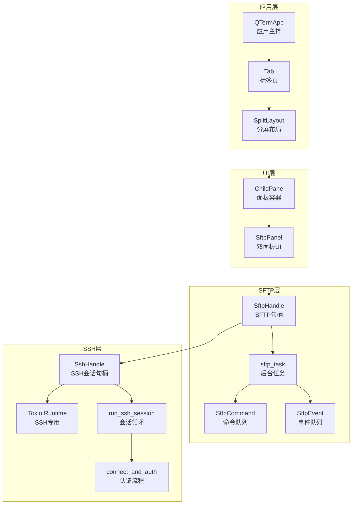
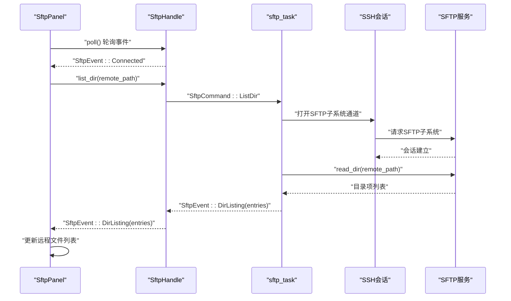
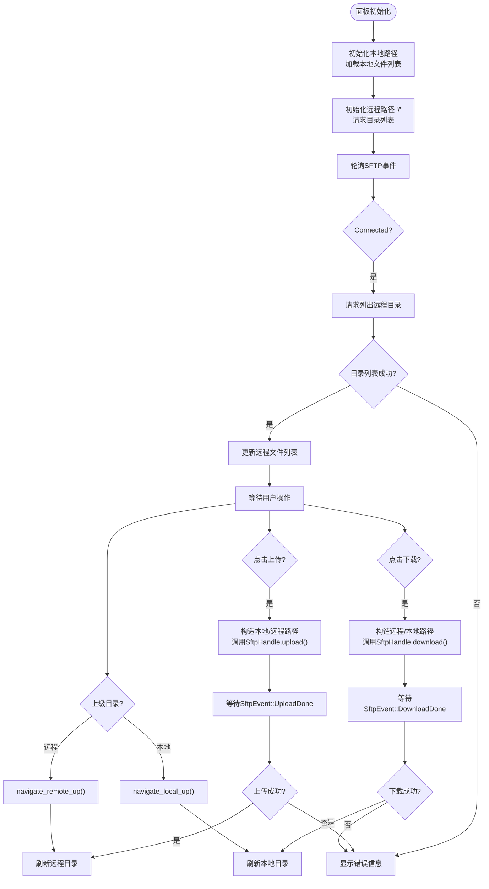
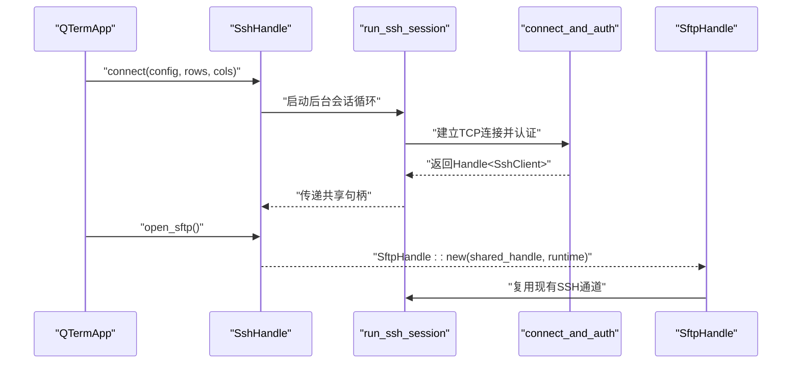
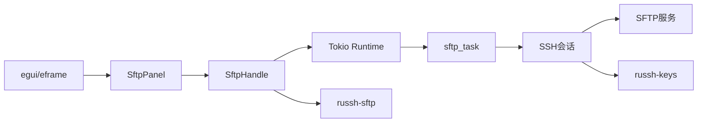

# SFTP文件传输面板

<cite>
**本文档引用的文件**
- [sftp_panel.rs](file://src/ui/sftp_panel.rs)
- [mod.rs](file://src/sftp/mod.rs)
- [split_pane.rs](file://src/ui/split_pane.rs)
- [app.rs](file://src/app.rs)
- [client.rs](file://src/ssh/client.rs)
- [session.rs](file://src/ssh/session.rs)
- [mod.rs](file://src/ssh/mod.rs)
- [Cargo.toml](file://Cargo.toml)
- [2026-05-30-phase3-sftp-design.md](file://docs/specs/2026-05-30-phase3-sftp-design.md)
</cite>

## 目录
1. [简介](#简介)
2. [项目结构](#项目结构)
3. [核心组件](#核心组件)
4. [架构总览](#架构总览)
5. [详细组件分析](#详细组件分析)
6. [依赖关系分析](#依赖关系分析)
7. [性能考虑](#性能考虑)
8. [故障排除指南](#故障排除指南)
9. [结论](#结论)
10. [附录](#附录)

## 简介
本文件面向QTerm的SFTP文件传输面板，系统性阐述其架构设计、UI实现、文件操作流程、状态反馈机制以及与SSH会话的集成方式。文档重点覆盖以下方面：
- 双面板文件浏览：本地与远程文件的目录树导航、文件列表展示与图标缓存机制
- 文件操作：上传、下载、删除、重命名与批量操作的实现细节
- 属性与元数据：文件大小、修改时间、权限信息与预览支持
- 进度与状态反馈：传输进度监控、错误处理与用户提示
- 搜索与过滤：文件名匹配、类型筛选与正则表达式支持
- 双面板协作：面板间文件拖拽、快捷键操作与同步刷新
- 性能优化：异步操作、缓存机制与大文件处理策略
- 实际使用场景与最佳实践

## 项目结构
SFTP功能由UI层、SFTP客户端层、SSH会话层与应用集成层共同组成，采用事件驱动与后台任务分离的设计，确保UI流畅与传输稳定。



图表来源
- [app.rs:473-557](file://src/app.rs#L473-L557)
- [split_pane.rs:20-31](file://src/ui/split_pane.rs#L20-L31)
- [sftp_panel.rs:14-25](file://src/ui/sftp_panel.rs#L14-L25)
- [mod.rs:9-13](file://src/sftp/mod.rs#L9-L13)
- [mod.rs:60-66](file://src/ssh/mod.rs#L60-L66)

章节来源
- [app.rs:473-557](file://src/app.rs#L473-L557)
- [split_pane.rs:151-238](file://src/ui/split_pane.rs#L151-L238)
- [sftp_panel.rs:114-152](file://src/ui/sftp_panel.rs#L114-L152)
- [mod.rs:46-115](file://src/sftp/mod.rs#L46-L115)
- [mod.rs:58-136](file://src/ssh/mod.rs#L58-L136)

## 核心组件
- SftpPanel：双面板UI组件，负责本地与远程文件列表展示、导航、选择与操作触发
- SftpHandle：SFTP客户端句柄，封装事件通道与命令通道，提供非阻塞轮询与操作接口
- Sftp后台任务：在Tokio运行时中运行，通过SSH子系统建立SFTP会话，处理命令队列并发送事件
- SSH会话：复用现有SSH连接，提供SFTP子系统通道与会话生命周期管理
- SplitLayout与ChildPane：分屏布局管理，支持在现有SSH会话中添加SFTP面板

章节来源
- [sftp_panel.rs:14-25](file://src/ui/sftp_panel.rs#L14-L25)
- [mod.rs:9-13](file://src/sftp/mod.rs#L9-L13)
- [mod.rs:119-167](file://src/sftp/mod.rs#L119-L167)
- [mod.rs:58-136](file://src/ssh/mod.rs#L58-L136)
- [split_pane.rs:151-238](file://src/ui/split_pane.rs#L151-L238)

## 架构总览
SFTP模块通过共享的SSH会话句柄打开SFTP子系统通道，后台任务负责与远端SFTP服务交互，UI通过事件通道接收结果并更新状态。命令通过异步通道发送，避免阻塞UI线程。



图表来源
- [sftp_panel.rs:52-110](file://src/ui/sftp_panel.rs#L52-L110)
- [mod.rs:72-78](file://src/sftp/mod.rs#L72-L78)
- [mod.rs:119-167](file://src/sftp/mod.rs#L119-L167)
- [mod.rs:175-196](file://src/sftp/mod.rs#L175-L196)

## 详细组件分析

### SftpPanel：双面板文件浏览器
- 双面板布局：左右两栏，左侧为本地文件系统，右侧为远程SFTP文件系统
- 导航与选择：支持“上级目录”按钮与双击进入子目录；点击选择文件或目录
- 本地文件列表：过滤隐藏文件（以.开头），按目录优先、名称排序
- 远程文件列表：连接成功后拉取目录内容，显示名称与大小
- 操作按钮：上传（本地→远程）、下载（远程→本地），按钮根据选中状态启用
- 状态反馈：连接状态、操作结果与错误信息实时显示



图表来源
- [sftp_panel.rs:28-49](file://src/ui/sftp_panel.rs#L28-L49)
- [sftp_panel.rs:52-110](file://src/ui/sftp_panel.rs#L52-L110)
- [sftp_panel.rs:164-202](file://src/ui/sftp_panel.rs#L164-L202)
- [sftp_panel.rs:204-246](file://src/ui/sftp_panel.rs#L204-L246)
- [sftp_panel.rs:326-356](file://src/ui/sftp_panel.rs#L326-L356)

章节来源
- [sftp_panel.rs:14-25](file://src/ui/sftp_panel.rs#L14-L25)
- [sftp_panel.rs:114-152](file://src/ui/sftp_panel.rs#L114-L152)
- [sftp_panel.rs:164-202](file://src/ui/sftp_panel.rs#L164-L202)
- [sftp_panel.rs:204-246](file://src/ui/sftp_panel.rs#L204-L246)
- [sftp_panel.rs:248-297](file://src/ui/sftp_panel.rs#L248-L297)
- [sftp_panel.rs:299-324](file://src/ui/sftp_panel.rs#L299-L324)
- [sftp_panel.rs:326-356](file://src/ui/sftp_panel.rs#L326-L356)

### SftpHandle与后台任务：异步SFTP操作
- 事件通道：SftpHandle维护事件接收端，UI通过轮询获取最新事件
- 命令通道：UI通过命令通道发送操作请求（列出目录、上传、下载、创建目录、删除）
- 后台任务：在Tokio运行时中启动，打开SSH子系统通道，创建SFTP会话，循环处理命令
- 错误处理：所有操作失败均通过事件通道上报错误信息

```mermaid
classDiagram
class SftpHandle {
+events_rx : Receiver~SftpEvent~
+cmd_tx : Sender~SftpCommand~
+alive : AtomicBool
+poll() Vec~SftpEvent~
+list_dir(path)
+upload(local, remote)
+download(remote, local)
+mkdir(path)
+delete(path, is_dir)
+disconnect()
+is_alive() bool
}
class SftpEvent {
<<enum>>
+Connected
+DirListing(Vec~FileEntry~)
+UploadDone(Result~(), String)
+DownloadDone(Result~(), String)
+MkdirDone(Result~(), String)
+DeleteDone(Result~(), String)
+Error(String)
}
class SftpCommand {
<<enum>>
+ListDir(String)
+Upload { local_path : String, remote_path : String }
+Download { remote_path : String, local_path : String }
+Mkdir(String)
+Delete { path : String, is_dir : bool }
+Disconnect
}
class SftpTask {
+sftp_task(ssh_handle, events_tx, cmd_rx, alive)
+handle_command(sftp, events_tx, cmd)
}
SftpHandle --> SftpEvent : "发送"
SftpHandle --> SftpCommand : "接收"
SftpTask --> SftpEvent : "发送"
SftpTask --> SftpCommand : "接收"
```

图表来源
- [mod.rs:9-13](file://src/sftp/mod.rs#L9-L13)
- [mod.rs:25-33](file://src/sftp/mod.rs#L25-L33)
- [mod.rs:37-44](file://src/sftp/mod.rs#L37-L44)
- [mod.rs:119-167](file://src/sftp/mod.rs#L119-L167)
- [mod.rs:175-238](file://src/sftp/mod.rs#L175-L238)

章节来源
- [mod.rs:46-115](file://src/sftp/mod.rs#L46-L115)
- [mod.rs:119-167](file://src/sftp/mod.rs#L119-L167)
- [mod.rs:175-238](file://src/sftp/mod.rs#L175-L238)

### SSH会话与SFTP复用
- SSH会话：在独立线程中运行，通过Tokio运行时处理I/O与会话生命周期
- SFTP复用：SftpHandle通过共享的SSH会话句柄打开SFTP子系统通道，无需额外握手
- 认证流程：支持密码与私钥两种认证方式，自动接受服务器密钥



图表来源
- [mod.rs:68-136](file://src/ssh/mod.rs#L68-L136)
- [session.rs:11-90](file://src/ssh/session.rs#L11-L90)
- [client.rs:25-63](file://src/ssh/client.rs#L25-L63)
- [mod.rs:49-68](file://src/sftp/mod.rs#L49-L68)

章节来源
- [mod.rs:58-136](file://src/ssh/mod.rs#L58-L136)
- [session.rs:11-90](file://src/ssh/session.rs#L11-L90)
- [client.rs:25-63](file://src/ssh/client.rs#L25-L63)
- [mod.rs:49-68](file://src/sftp/mod.rs#L49-L68)

### 分屏与面板集成
- ChildPane：统一管理面板内容（终端或SFTP），提供轮询、写入、调整大小与关闭
- SplitLayout：管理多面板布局，支持水平/垂直分屏与活动面板切换
- 应用集成：QTermApp在中央面板渲染当前活动标签页，支持在现有SSH会话中添加SFTP面板

```mermaid
classDiagram
class SplitLayout {
+panes : Vec~ChildPane~
+direction : SplitDirection
+active_pane : usize
+add_sftp_pane(sftp, direction)
+remove_pane(idx)
+pane_count() usize
+poll_all()
}
class ChildPane {
+id : String
+kind : PaneKind
+alive : bool
+poll()
+write(data)
+resize(rows, cols)
+close()
}
class PaneKind {
<<enum>>
+Terminal { terminal, backend }
+Sftp { panel }
}
SplitLayout --> ChildPane : "管理"
ChildPane --> PaneKind : "包含"
```

图表来源
- [split_pane.rs:151-238](file://src/ui/split_pane.rs#L151-L238)
- [split_pane.rs:25-31](file://src/ui/split_pane.rs#L25-L31)
- [split_pane.rs:19-23](file://src/ui/split_pane.rs#L19-L23)

章节来源
- [split_pane.rs:151-238](file://src/ui/split_pane.rs#L151-L238)
- [split_pane.rs:25-31](file://src/ui/split_pane.rs#L25-L31)
- [split_pane.rs:19-23](file://src/ui/split_pane.rs#L19-L23)
- [app.rs:473-557](file://src/app.rs#L473-L557)

## 依赖关系分析
- 外部依赖：russh、russh-keys、russh-sftp、tokio、async-trait、eframe/egui等
- 内部依赖：SSH模块向SFTP模块提供共享会话句柄；UI层通过SftpHandle与后台任务通信



图表来源
- [Cargo.toml:8-25](file://Cargo.toml#L8-L25)
- [sftp_panel.rs:1-3](file://src/ui/sftp_panel.rs#L1-L3)
- [mod.rs:1-5](file://src/sftp/mod.rs#L1-L5)
- [mod.rs:1-7](file://src/ssh/mod.rs#L1-L7)

章节来源
- [Cargo.toml:8-25](file://Cargo.toml#L8-L25)
- [sftp_panel.rs:1-3](file://src/ui/sftp_panel.rs#L1-L3)
- [mod.rs:1-5](file://src/sftp/mod.rs#L1-L5)
- [mod.rs:1-7](file://src/ssh/mod.rs#L1-L7)

## 性能考虑
- 异步与非阻塞：SFTP操作通过Tokio通道异步执行，UI轮询事件，避免阻塞主线程
- 事件驱动：后台任务只在收到命令时才发起网络请求，减少无效I/O
- 本地缓存：本地文件列表在每次导航时重新构建，避免频繁磁盘扫描；可引入文件系统事件监听进一步优化
- 大文件处理：当前实现为一次性读取/写入，建议在后续版本中引入分块读写与进度事件
- 并发控制：命令通道容量为256，可根据实际并发需求调整

章节来源
- [mod.rs:53-67](file://src/sftp/mod.rs#L53-L67)
- [mod.rs:72-78](file://src/sftp/mod.rs#L72-L78)
- [sftp_panel.rs:248-273](file://src/ui/sftp_panel.rs#L248-L273)

## 故障排除指南
- 连接失败：检查SSH认证配置（用户名、密码或私钥路径），确认服务器可达
- SFTP子系统失败：确认服务器支持SFTP子系统，检查SSH会话是否正常
- 传输失败：查看事件通道中的错误信息，确认本地/远程路径有效且有足够权限
- UI无响应：确认UI线程在轮询SftpHandle事件，避免长时间阻塞

章节来源
- [mod.rs:126-149](file://src/sftp/mod.rs#L126-L149)
- [mod.rs:193-196](file://src/sftp/mod.rs#L193-L196)
- [sftp_panel.rs:102-107](file://src/ui/sftp_panel.rs#L102-L107)

## 结论
SFTP文件传输面板通过清晰的分层架构实现了与SSH会话的无缝复用，采用事件驱动与后台任务分离的设计，保证了UI的流畅性与传输的可靠性。当前版本提供了基础的文件浏览、上传下载与基本操作，后续可在进度事件、搜索过滤、图标缓存与大文件分块传输等方面进一步增强用户体验。

## 附录

### 功能清单与实现状态
- 目录树导航：本地与远程均支持“上级目录”与双击进入子目录
- 文件列表展示：本地过滤隐藏文件，远程显示目录/文件与大小
- 图标缓存机制：当前未实现图标缓存，建议引入缓存以提升渲染性能
- 上传/下载：支持单文件上传与下载，按钮根据选中状态启用
- 删除/重命名：删除接口存在，重命名接口尚未实现
- 批量操作：当前未实现批量操作，建议在后续版本中增加
- 文件属性与元数据：显示文件大小，修改时间与权限信息未实现
- 预览支持：未实现文件预览功能
- 搜索与过滤：未实现搜索与过滤功能
- 双面板协作：面板间拖拽与快捷键操作未实现
- 进度与状态反馈：通过事件通道实时反馈，但缺少进度条与传输列表

章节来源
- [sftp_panel.rs:164-202](file://src/ui/sftp_panel.rs#L164-L202)
- [sftp_panel.rs:204-246](file://src/ui/sftp_panel.rs#L204-L246)
- [mod.rs:175-238](file://src/sftp/mod.rs#L175-L238)
- [2026-05-30-phase3-sftp-design.md:9-15](file://docs/specs/2026-05-30-phase3-sftp-design.md#L9-L15)