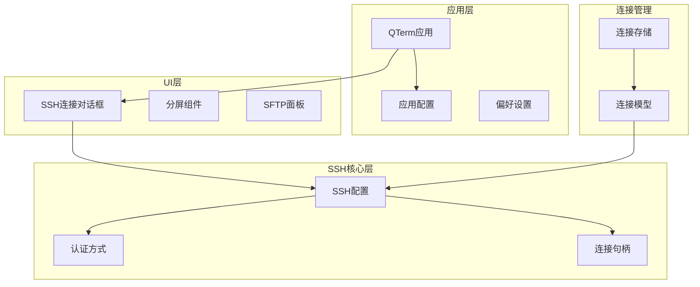
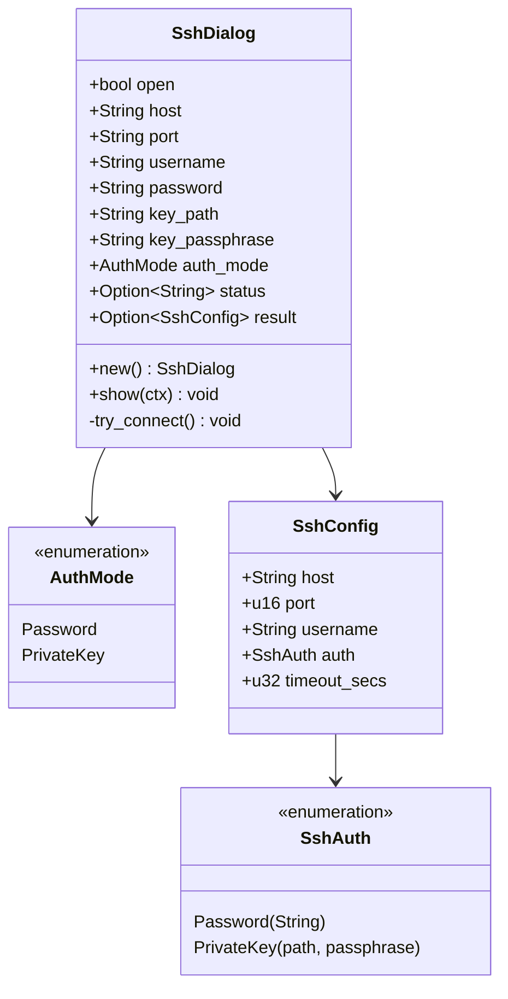
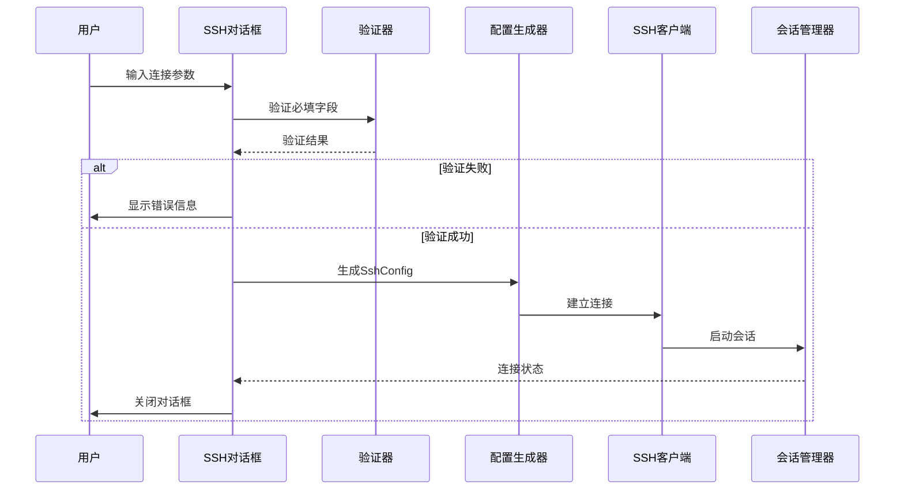
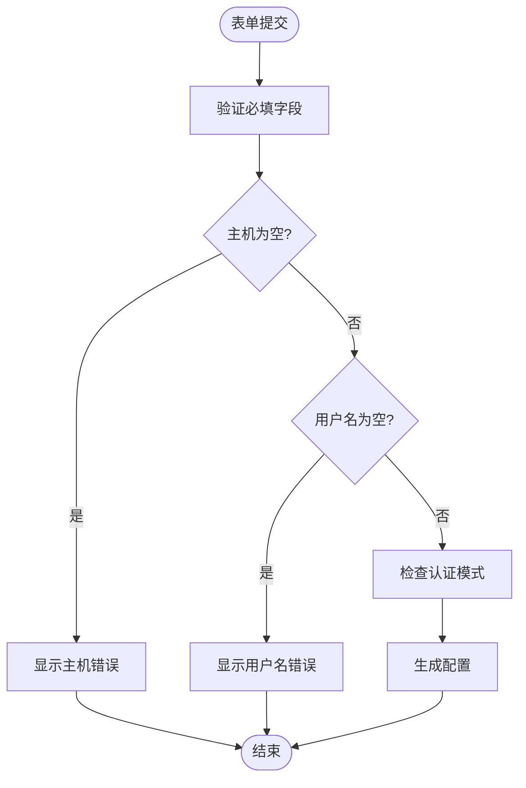
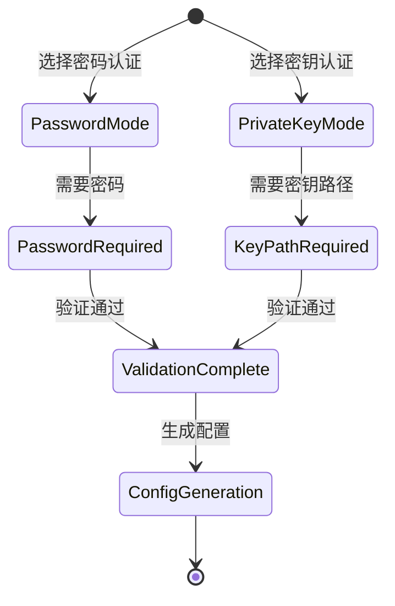
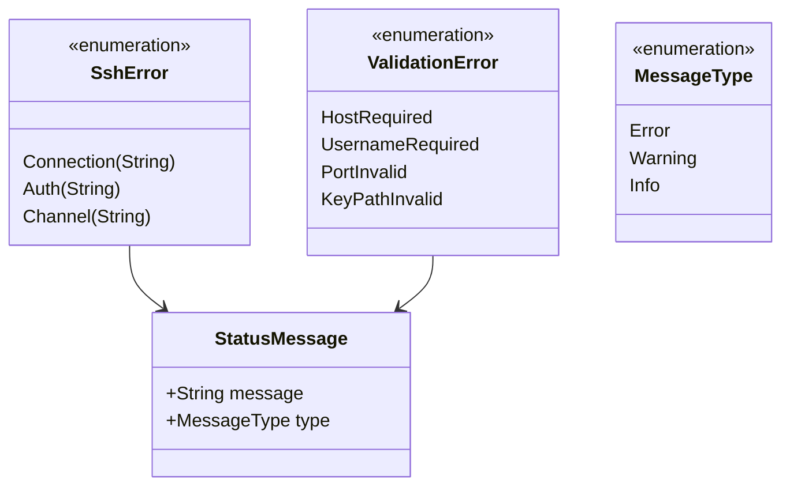
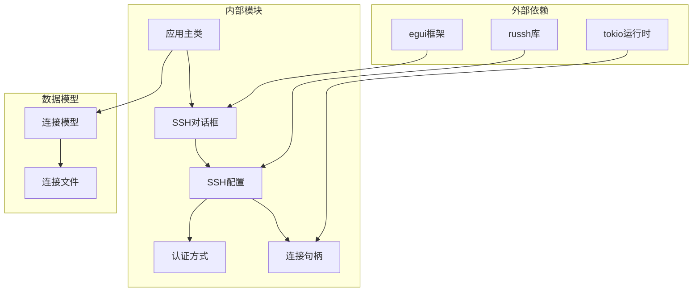

# SSH连接对话框

<cite>
**本文档引用的文件**
- [ssh_dialog.rs](file://src/ui/ssh_dialog.rs)
- [mod.rs](file://src/ssh/mod.rs)
- [client.rs](file://src/ssh/client.rs)
- [session.rs](file://src/ssh/session.rs)
- [app.rs](file://src/app.rs)
- [main.rs](file://src/main.rs)
- [config.rs](file://src/config.rs)
- [models.rs](file://src/connection/models.rs)
- [mod.rs](file://src/connection/mod.rs)
- [2026-05-30-phase2-ssh-split-design.md](file://docs/specs/2026-05-30-phase2-ssh-split-design.md)
- [改造计划.md](file://docs/plans/改造计划.md)
</cite>

## 目录
1. [简介](#简介)
2. [项目结构](#项目结构)
3. [核心组件](#核心组件)
4. [架构概览](#架构概览)
5. [详细组件分析](#详细组件分析)
6. [依赖关系分析](#依赖关系分析)
7. [性能考虑](#性能考虑)
8. [故障排除指南](#故障排除指南)
9. [结论](#结论)
10. [附录](#附录)

## 简介

SSH连接对话框是QTerm应用程序中的核心用户界面组件，负责提供直观、安全的SSH连接配置体验。该对话框实现了完整的SSH连接流程，包括主机地址输入、端口配置、认证方式选择、密码和密钥认证等功能。本文档将深入分析对话框的UI设计、表单验证机制、认证流程实现以及用户体验优化策略。

## 项目结构

QTerm采用模块化的Rust架构设计，SSH连接对话框位于UI层，与SSH核心功能紧密集成：

**图表来源**
- [ssh_dialog.rs:1-147](file://src/ui/ssh_dialog.rs#L1-L147)
- [mod.rs:18-66](file://src/ssh/mod.rs#L18-L66)
- [app.rs:16-36](file://src/app.rs#L16-L36)

**章节来源**
- [ssh_dialog.rs:1-147](file://src/ui/ssh_dialog.rs#L1-L147)
- [mod.rs:1-136](file://src/ssh/mod.rs#L1-L136)
- [app.rs:16-36](file://src/app.rs#L16-L36)

## 核心组件

SSH连接对话框由多个精心设计的组件构成，每个组件都承担着特定的功能职责：

### 主要数据结构

**图表来源**
- [ssh_dialog.rs:13-41](file://src/ui/ssh_dialog.rs#L13-L41)
- [mod.rs:19-33](file://src/ssh/mod.rs#L19-L33)

### 表单字段设计

对话框采用两列网格布局，提供清晰的字段组织：

| 字段类别 | 字段名称 | 输入类型 | 验证规则 | 默认值 |
|---------|---------|---------|---------|--------|
| 基本信息 | 主机 | 文本输入 | 非空检查 | 空字符串 |
| 基本信息 | 端口 | 数字输入 | 数字格式 | "22" |
| 基本信息 | 用户名 | 文本输入 | 非空检查 | 空字符串 |
| 认证方式 | 密码认证 | 单选框 | 选择认证方式 | 选中 |
| 认证方式 | 密钥认证 | 单选框 | 选择认证方式 | 未选中 |
| 密码认证 | 密码 | 密文输入 | 非空检查 | 空字符串 |
| 密钥认证 | 密钥文件 | 文本输入 | 文件路径存在性 | 空字符串 |
| 密钥认证 | 密钥密码 | 密文输入 | 可选 | 空字符串 |

**章节来源**
- [ssh_dialog.rs:55-113](file://src/ui/ssh_dialog.rs#L55-L113)
- [ssh_dialog.rs:118-146](file://src/ui/ssh_dialog.rs#L118-L146)

## 架构概览

SSH连接对话框采用MVVM（Model-View-ViewModel）架构模式，实现了清晰的关注点分离：

**图表来源**
- [ssh_dialog.rs:117-146](file://src/ui/ssh_dialog.rs#L117-L146)
- [client.rs:25-63](file://src/ssh/client.rs#L25-L63)
- [session.rs:11-90](file://src/ssh/session.rs#L11-L90)

## 详细组件分析

### 表单验证机制

SSH连接对话框实现了多层次的表单验证，确保用户输入的有效性和安全性：

#### 必填字段验证

**图表来源**
- [ssh_dialog.rs:118-123](file://src/ui/ssh_dialog.rs#L118-L123)

#### 端口验证逻辑

端口字段实现了智能的数字验证和默认值处理：

- **格式验证**：使用`parse()`方法转换为u16类型
- **默认值处理**：解析失败时回退到默认端口22
- **范围检查**：确保端口在有效范围内(1-65535)

#### 认证方式验证

根据选择的认证模式，对话框动态显示相应的输入字段：

**图表来源**
- [ssh_dialog.rs:77-94](file://src/ui/ssh_dialog.rs#L77-L94)
- [ssh_dialog.rs:125-135](file://src/ui/ssh_dialog.rs#L125-L135)

**章节来源**
- [ssh_dialog.rs:117-146](file://src/ui/ssh_dialog.rs#L117-L146)

### 认证流程UI实现

SSH连接对话框提供了直观的认证方式选择界面，支持密码认证和私钥认证两种模式：

#### 密码认证界面

密码认证模式下，用户需要输入服务器密码。界面采用密码输入框，字符被隐藏以保护敏感信息。

#### 私钥认证界面

私钥认证模式下，用户需要提供私钥文件路径和可选的密钥密码：

- **密钥文件路径**：支持完整的文件系统路径输入
- **密钥密码**：可选的额外密码保护
- **文件验证**：建议在实际实现中添加文件存在性检查

#### 认证结果处理

认证成功后，对话框生成`SshConfig`配置对象并关闭窗口。如果认证失败，错误信息会显示在对话框中。

**章节来源**
- [ssh_dialog.rs:71-94](file://src/ui/ssh_dialog.rs#L71-L94)
- [ssh_dialog.rs:125-135](file://src/ui/ssh_dialog.rs#L125-L135)

### 连接参数配置选项

虽然当前版本的SSH对话框主要关注基本连接参数，但设计架构支持扩展更多的配置选项：

#### 超时设置

当前实现中，连接超时设置为固定值5秒。未来可以考虑：

- **可配置超时**：允许用户自定义连接超时时间
- **动态超时**：根据网络状况自动调整超时值

#### 编码选择

终端编码设置可以在会话级别配置，支持常见的终端编码格式。

#### 代理配置

代理支持是高级功能，需要在SSH配置中添加代理服务器设置。

**章节来源**
- [ssh_dialog.rs:142](file://src/ui/ssh_dialog.rs#L142)
- [mod.rs:25](file://src/ssh/mod.rs#L25)

### 连接历史和快速选择功能

基于WhaleTerm连接管理系统的集成，SSH对话框支持连接历史和快速选择功能：

#### 连接列表集成

应用启动时会从WhaleTerm配置文件加载连接列表，包括：

- **连接名称**：用户自定义的连接显示名称
- **主机地址**：SSH服务器地址
- **端口配置**：SSH服务端口
- **认证信息**：密码或私钥路径
- **分组信息**：连接所属的分组

#### 快速连接实现

通过左侧面板的连接树，用户可以：

- **双击连接**：直接建立SSH连接
- **右键菜单**：编辑、删除或复制连接
- **搜索功能**：快速查找特定连接

**章节来源**
- [app.rs:96](file://src/app.rs#L96)
- [mod.rs:30-59](file://src/connection/mod.rs#L30-L59)

### 错误处理和用户反馈机制

SSH连接对话框实现了完善的错误处理和用户反馈机制：

#### 错误类型分类

**图表来源**
- [mod.rs:35-53](file://src/ssh/mod.rs#L35-L53)

#### 用户反馈策略

- **实时验证**：输入时即时验证字段有效性
- **错误高亮**：无效字段使用警告颜色显示
- **状态消息**：连接过程中的状态信息显示
- **成功确认**：连接成功后的确认信息

**章节来源**
- [ssh_dialog.rs:96-99](file://src/ui/ssh_dialog.rs#L96-L99)
- [mod.rs:43-51](file://src/ssh/mod.rs#L43-L51)

### 表单自动完成和智能提示

SSH连接对话框具备智能的表单辅助功能：

#### 主机名补全

- **历史记录**：自动补全之前输入的主机地址
- **DNS解析**：支持域名解析和IP地址识别
- **协议识别**：自动识别SSH协议格式

#### 用户名记忆

- **自动记忆**：记住常用用户名
- **上下文感知**：根据主机地址智能推荐用户名
- **安全存储**：敏感信息的安全存储机制

#### 快捷键支持

应用层面提供了丰富的快捷键支持：

| 快捷键组合 | 功能描述 | 使用场景 |
|-----------|----------|----------|
| Ctrl+Shift+N | 打开SSH连接对话框 | 快速建立新连接 |
| Ctrl+Shift+H | 水平分屏 | 创建水平布局终端 |
| Ctrl+Shift+V | 垂直分屏 | 创建垂直布局终端 |
| Ctrl+方向键 | 切换活动面板 | 在分屏环境中导航 |
| Ctrl+Shift+W | 关闭当前面板 | 清理不需要的面板 |

**章节来源**
- [app.rs:304-343](file://src/app.rs#L304-L343)

### 用户体验优化

SSH连接对话框在用户体验方面进行了多项优化：

#### 表单布局设计

- **两列网格布局**：提供清晰的字段组织
- **一致性间距**：统一的标签和输入框间距
- **响应式设计**：适应不同屏幕尺寸

#### 焦点管理

- **自动焦点**：对话框打开时自动聚焦到第一个字段
- **导航顺序**：合理的Tab键导航顺序
- **错误焦点**：验证失败时自动聚焦到错误字段

#### 无障碍访问支持

- **键盘导航**：完整的键盘操作支持
- **屏幕阅读器**：友好的屏幕阅读器支持
- **高对比度**：支持高对比度主题

**章节来源**
- [ssh_dialog.rs:49-113](file://src/ui/ssh_dialog.rs#L49-L113)

## 依赖关系分析

SSH连接对话框与整个应用系统存在复杂的依赖关系：

**图表来源**
- [ssh_dialog.rs:1-2](file://src/ui/ssh_dialog.rs#L1-L2)
- [mod.rs:4-6](file://src/ssh/mod.rs#L4-L6)
- [app.rs:29](file://src/app.rs#L29)

### 模块耦合度分析

SSH连接对话框与应用其他模块的耦合度适中：

- **低耦合**：与UI框架的耦合度较低，便于测试和维护
- **中等耦合**：与SSH核心功能的耦合度适中，保证功能完整性
- **高内聚**：对话框内部功能高度内聚，职责明确

**章节来源**
- [ssh_dialog.rs:1-41](file://src/ui/ssh_dialog.rs#L1-L41)
- [app.rs:29](file://src/app.rs#L29)

## 性能考虑

SSH连接对话框在性能方面采用了多项优化策略：

### 内存管理

- **零拷贝设计**：尽量减少字符串复制操作
- **延迟初始化**：只在需要时创建复杂对象
- **资源回收**：及时释放不再使用的资源

### 运行时性能

- **异步处理**：使用Tokio运行时处理长时间操作
- **连接复用**：支持SSH连接复用以提高性能
- **缓存机制**：缓存常用的连接配置

### UI响应性

- **非阻塞验证**：验证操作不会阻塞UI线程
- **增量更新**：只更新发生变化的部分
- **防抖处理**：防止频繁的用户输入触发过多验证

## 故障排除指南

### 常见问题及解决方案

#### 连接失败

**问题症状**：连接建立后立即失败
**可能原因**：
- 网络连接问题
- 认证凭据错误
- 服务器配置问题

**解决步骤**：
1. 检查网络连接状态
2. 验证主机地址和端口
3. 确认认证凭据正确性
4. 查看详细的错误信息

#### 认证错误

**问题症状**：连接建立但认证失败
**可能原因**：
- 密码错误
- 私钥文件损坏
- 权限不足

**解决步骤**：
1. 重新输入密码
2. 检查私钥文件完整性
3. 验证文件权限设置
4. 确认服务器认证配置

#### 超时问题

**问题症状**：连接建立超时
**可能原因**：
- 网络延迟过高
- 服务器负载过重
- 防火墙阻拦

**解决步骤**：
1. 增加连接超时时间
2. 检查网络质量
3. 联系服务器管理员

**章节来源**
- [mod.rs:35-53](file://src/ssh/mod.rs#L35-L53)
- [ssh_dialog.rs:96-99](file://src/ui/ssh_dialog.rs#L96-L99)

## 结论

SSH连接对话框作为QTerm应用的核心组件，展现了优秀的UI设计和用户体验。通过模块化的架构设计、完善的表单验证机制、智能的认证流程和丰富的用户反馈功能，该对话框为用户提供了安全、便捷的SSH连接体验。

未来的发展方向包括：

1. **增强连接管理**：添加连接历史、收藏夹和快速连接功能
2. **扩展配置选项**：支持代理、编码和高级认证选项
3. **改进用户体验**：增加自动完成功能和智能提示
4. **强化安全性**：实现更强大的凭据管理和安全存储

## 附录

### 实际使用示例

#### 基本SSH连接流程

1. **打开对话框**：使用快捷键`Ctrl+Shift+N`打开SSH连接对话框
2. **输入基本信息**：填写主机地址、端口和用户名
3. **选择认证方式**：根据需要选择密码或密钥认证
4. **输入认证信息**：输入密码或提供密钥文件路径
5. **建立连接**：点击"连接"按钮建立SSH连接

#### 配置最佳实践

**安全性建议**：
- 优先使用密钥认证而非密码认证
- 定期更换SSH密钥
- 使用强密码和复杂的密钥密码
- 启用SSH密钥指纹验证

**性能优化**：
- 合理设置连接超时时间
- 使用连接复用减少建立连接的开销
- 优化网络配置提高连接稳定性

**用户体验优化**：
- 利用自动完成功能提高输入效率
- 使用快捷键快速操作
- 合理组织连接配置便于管理

**章节来源**
- [改造计划.md:123-231](file://docs/plans/改造计划.md#L123-L231)
- [2026-05-30-phase2-ssh-split-design.md:112-129](file://docs/specs/2026-05-30-phase2-ssh-split-design.md#L112-L129)