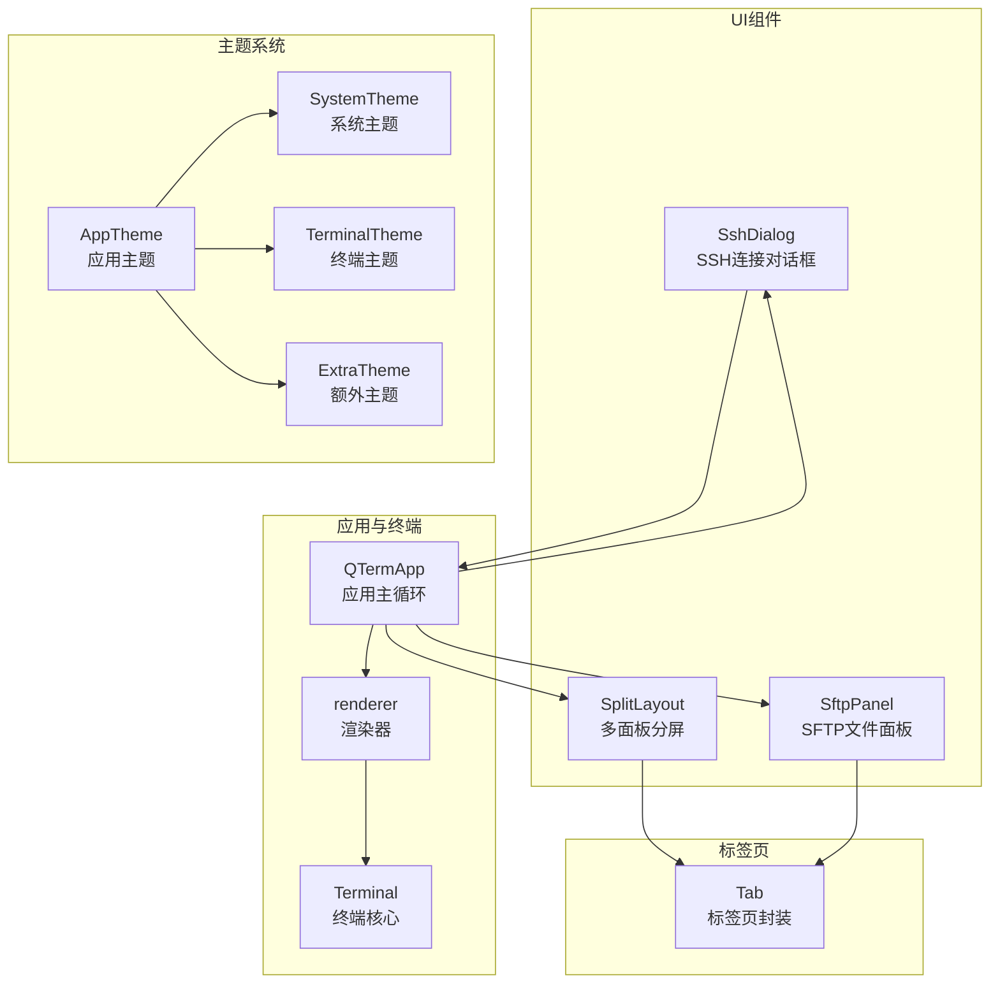
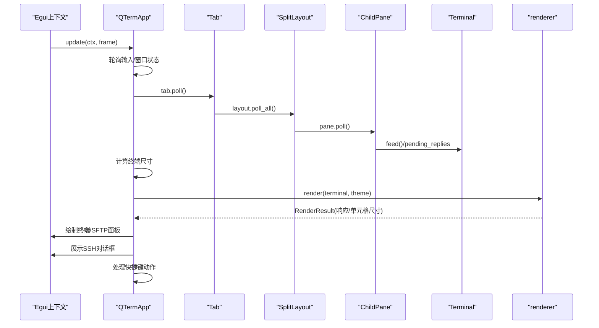
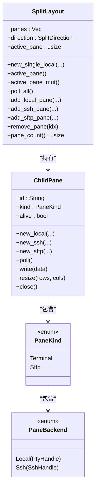
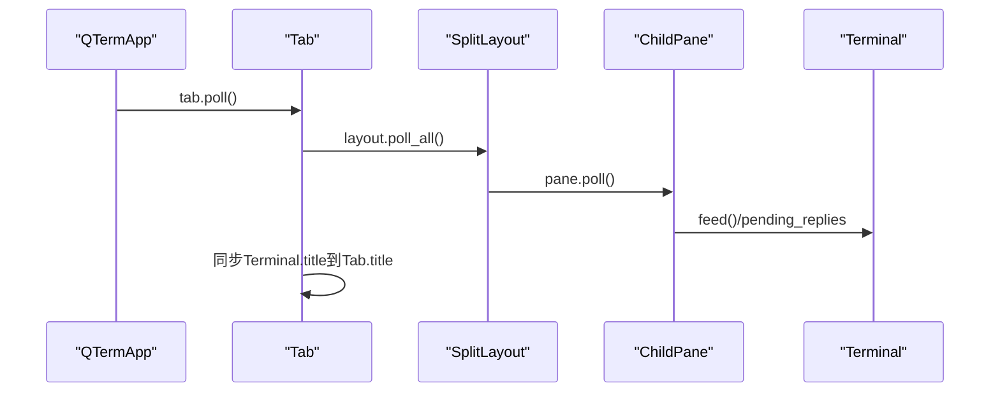
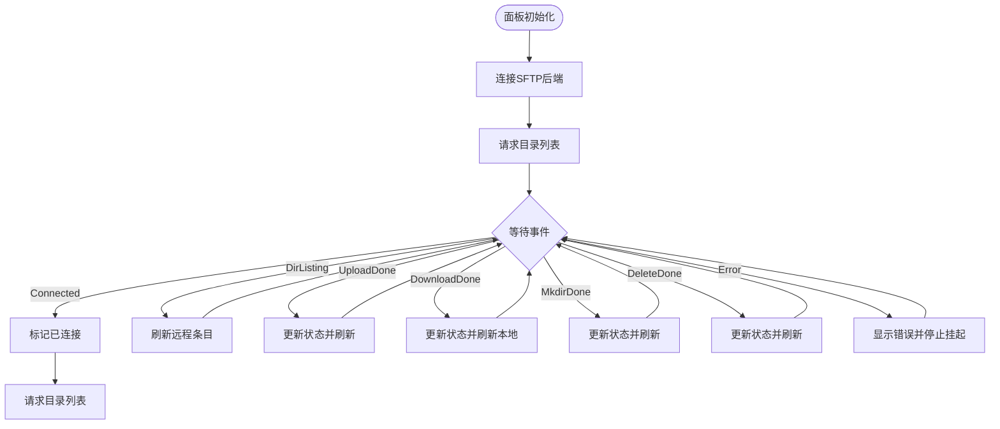
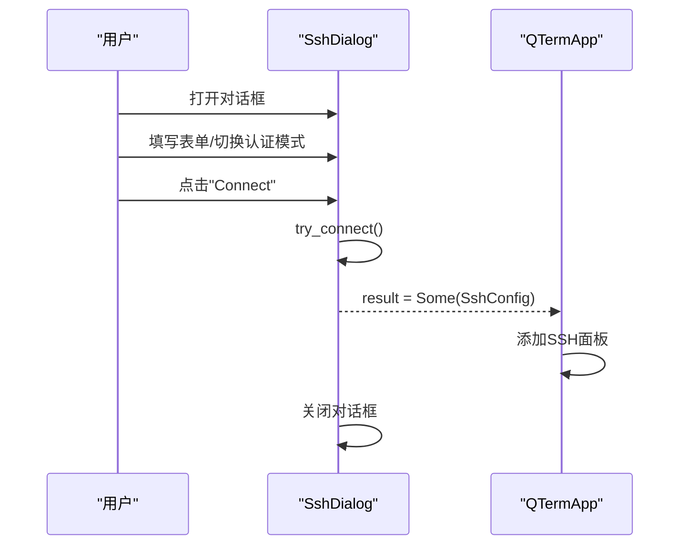
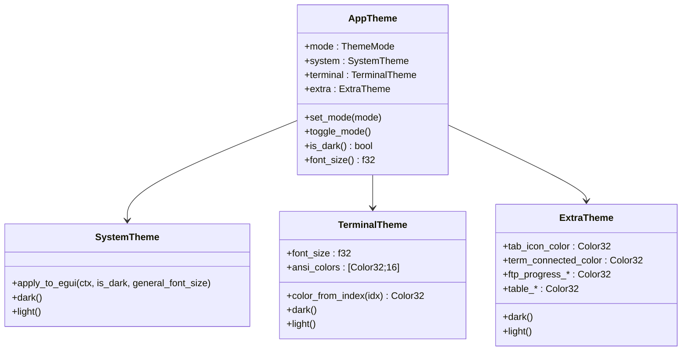
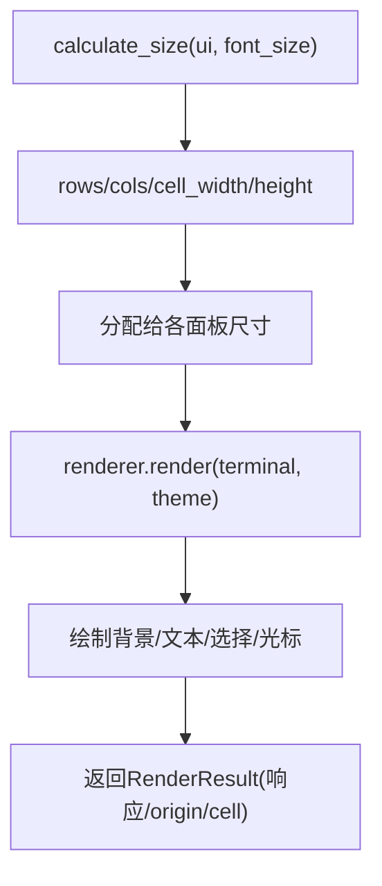
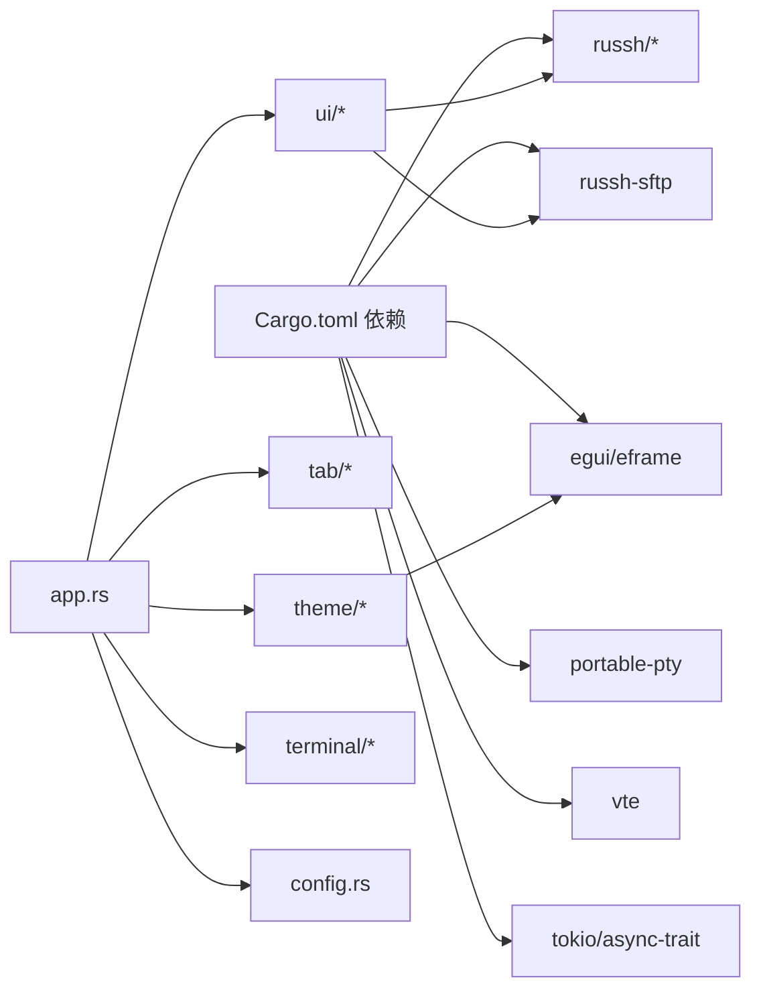

# UI组件系统

<cite>
**本文档引用的文件**
- [src/ui/mod.rs](file://src/ui/mod.rs)
- [src/ui/split_pane.rs](file://src/ui/split_pane.rs)
- [src/ui/sftp_panel.rs](file://src/ui/sftp_panel.rs)
- [src/ui/ssh_dialog.rs](file://src/ui/ssh_dialog.rs)
- [src/tab/mod.rs](file://src/tab/mod.rs)
- [src/tab/tab_item.rs](file://src/tab/tab_item.rs)
- [src/theme/mod.rs](file://src/theme/mod.rs)
- [src/theme/system.rs](file://src/theme/system.rs)
- [src/theme/terminal.rs](file://src/theme/terminal.rs)
- [src/theme/extra.rs](file://src/theme/extra.rs)
- [src/app.rs](file://src/app.rs)
- [src/terminal/mod.rs](file://src/terminal/mod.rs)
- [src/terminal/renderer.rs](file://src/terminal/renderer.rs)
- [src/config.rs](file://src/config.rs)
- [src/main.rs](file://src/main.rs)
- [Cargo.toml](file://Cargo.toml)
</cite>

## 目录
1. [简介](#简介)
2. [项目结构](#项目结构)
3. [核心组件](#核心组件)
4. [架构总览](#架构总览)
5. [详细组件分析](#详细组件分析)
6. [依赖关系分析](#依赖关系分析)
7. [性能考虑](#性能考虑)
8. [故障排除指南](#故障排除指南)
9. [结论](#结论)
10. [附录](#附录)

## 简介
本设计文档聚焦于QTerm的UI组件系统，基于egui框架构建，涵盖自定义组件实现、事件处理机制与响应式布局；详细阐述多面板分屏布局的实现（分割线拖拽、面板大小调整与布局状态管理）、标签页系统的架构（生命周期、状态保存与切换动画）、SFTP面板的功能实现（文件浏览、操作菜单与进度反馈）、SSH连接对话框的设计（表单验证、认证流程与配置保存），以及UI主题集成（颜色系统、字体管理与视觉一致性）。同时提供用户体验优化策略（键盘导航、快捷键支持与无障碍访问）与组件扩展指南。

## 项目结构
UI组件系统主要由以下模块构成：
- UI模块聚合：split_pane（多面板分屏）、sftp_panel（SFTP文件面板）、ssh_dialog（SSH连接对话框）
- 标签页模块：Tab封装SplitLayout，负责标签页生命周期与状态同步
- 主题模块：AppTheme统一管理系统主题、终端主题与额外主题，并通过SystemTheme.apply_to_egui全局应用到egui
- 应用主循环：QTermApp协调窗口布局、键盘快捷键、渲染与事件处理
- 终端渲染：Terminal与renderer模块负责字符网格、光标、选择与绘制

**图表来源**
- [src/ui/mod.rs:1-4](file://src/ui/mod.rs#L1-L4)
- [src/ui/split_pane.rs:132-209](file://src/ui/split_pane.rs#L132-L209)
- [src/ui/sftp_panel.rs:11-44](file://src/ui/sftp_panel.rs#L11-L44)
- [src/ui/ssh_dialog.rs:10-21](file://src/ui/ssh_dialog.rs#L10-L21)
- [src/tab/tab_item.rs:3-7](file://src/tab/tab_item.rs#L3-L7)
- [src/theme/mod.rs:13-62](file://src/theme/mod.rs#L13-L62)
- [src/theme/system.rs:61-156](file://src/theme/system.rs#L61-L156)
- [src/theme/terminal.rs:5-80](file://src/theme/terminal.rs#L5-L80)
- [src/theme/extra.rs:5-43](file://src/theme/extra.rs#L5-L43)
- [src/app.rs:15-33](file://src/app.rs#L15-L33)
- [src/terminal/mod.rs:22-37](file://src/terminal/mod.rs#L22-L37)
- [src/terminal/renderer.rs:36-167](file://src/terminal/renderer.rs#L36-L167)

**章节来源**
- [src/ui/mod.rs:1-4](file://src/ui/mod.rs#L1-L4)
- [src/app.rs:240-516](file://src/app.rs#L240-L516)

## 核心组件
- 多面板分屏（SplitLayout）：支持水平/垂直分割、最多6个子面板、活动面板切换、面板生命周期管理与尺寸同步
- SFTP面板（SftpPanel）：双面板文件浏览器、上传/下载、目录导航、状态反馈与错误处理
- SSH对话框（SshDialog）：表单验证、密码/私钥认证模式切换、配置生成与结果回传
- 标签页（Tab）：封装SplitLayout，同步终端标题变化，管理生命周期
- 主题系统（AppTheme/SystemTheme/TerminalTheme/ExtraTheme）：深浅主题切换、全局样式应用、字体与颜色体系
- 终端渲染（Terminal/Renderer）：字符网格、光标、选择高亮与绘制管线

**章节来源**
- [src/ui/split_pane.rs:132-209](file://src/ui/split_pane.rs#L132-L209)
- [src/ui/sftp_panel.rs:11-44](file://src/ui/sftp_panel.rs#L11-L44)
- [src/ui/ssh_dialog.rs:10-21](file://src/ui/ssh_dialog.rs#L10-L21)
- [src/tab/tab_item.rs:3-7](file://src/tab/tab_item.rs#L3-L7)
- [src/theme/mod.rs:13-62](file://src/theme/mod.rs#L13-L62)
- [src/terminal/mod.rs:22-37](file://src/terminal/mod.rs#L22-L37)
- [src/terminal/renderer.rs:36-167](file://src/terminal/renderer.rs#L36-L167)

## 架构总览
QTerm采用egui的声明式UI与eframe的渲染循环，应用主循环在每次update中：
- 轮询所有标签页与面板，处理后端数据流
- 计算终端网格尺寸并按布局方向分配给各面板
- 渲染活动终端或SFTP面板
- 处理全局快捷键与窗口状态
- 展示SSH对话框并回传配置

**图表来源**
- [src/app.rs:240-516](file://src/app.rs#L240-L516)
- [src/tab/tab_item.rs:19-28](file://src/tab/tab_item.rs#L19-L28)
- [src/ui/split_pane.rs:62-97](file://src/ui/split_pane.rs#L62-L97)
- [src/terminal/renderer.rs:36-167](file://src/terminal/renderer.rs#L36-L167)

## 详细组件分析

### 多面板分屏布局（SplitLayout）
- 设计原则
  - 面向后端抽象：PaneBackend统一Local/SSH终端后端
  - 面向内容抽象：PaneKind支持Terminal与SFTP面板
  - 生命周期管理：ChildPane封装alive状态与close/resize/poll/write
  - 最大化复用：支持最多6个子面板，活动面板高亮
- 事件处理与响应式布局
  - 布局方向：Horizontal/Vertical，根据可用空间动态分配
  - 尺寸同步：根据面板数量与方向计算rows/cols并批量resize
  - 活动面板：通过索引轮换，渲染时为活动面板添加边框
- 关键流程
  - 新增面板：add_local_pane/add_ssh_pane/add_sftp_pane
  - 移除面板：remove_pane（关闭后端并更新索引）
  - 轮询：poll_all遍历所有面板，处理后端数据与存活状态

**图表来源**
- [src/ui/split_pane.rs:132-209](file://src/ui/split_pane.rs#L132-L209)
- [src/ui/split_pane.rs:22-130](file://src/ui/split_pane.rs#L22-L130)

**章节来源**
- [src/ui/split_pane.rs:132-209](file://src/ui/split_pane.rs#L132-L209)

### 标签页系统（Tab）
- 生命周期
  - 创建：new_local调用SplitLayout::new_single_local
  - 轮询：poll遍历SplitLayout并同步终端标题到Tab.title
  - 存活：alive检查任一面板是否存活
  - 关闭：close逐个关闭所有面板
- 状态保存与切换
  - 标题同步：当终端title非空时更新Tab.title
  - 切换动画：通过卡片式标签页与hover/active态实现视觉切换

**图表来源**
- [src/tab/tab_item.rs:19-28](file://src/tab/tab_item.rs#L19-L28)
- [src/ui/split_pane.rs:62-97](file://src/ui/split_pane.rs#L62-L97)

**章节来源**
- [src/tab/tab_item.rs:3-7](file://src/tab/tab_item.rs#L3-L7)
- [src/tab/tab_item.rs:19-28](file://src/tab/tab_item.rs#L19-L28)

### SFTP面板（SftpPanel）
- 功能特性
  - 双面板：左侧本地文件系统，右侧远程SFTP服务器
  - 导航：上下级目录、双击进入目录、路径显示
  - 操作：上传（本地文件）、下载（远程文件）、状态反馈
  - 错误处理：事件驱动的状态更新与错误提示
- 事件处理
  - Connected：建立连接后请求目录列表
  - DirListing：刷新远程条目并清除挂起状态
  - Upload/Download/Mkdir/DeleteDone：成功/失败状态与后续刷新
  - Error：错误消息与挂起状态清理
- 用户交互
  - 选择：可点击选择条目，双击目录进入
  - 按钮：根据选择启用/禁用上传/下载按钮
  - 状态栏：实时显示操作状态

**图表来源**
- [src/ui/sftp_panel.rs:46-104](file://src/ui/sftp_panel.rs#L46-L104)

**章节来源**
- [src/ui/sftp_panel.rs:11-44](file://src/ui/sftp_panel.rs#L11-L44)
- [src/ui/sftp_panel.rs:106-142](file://src/ui/sftp_panel.rs#L106-L142)
- [src/ui/sftp_panel.rs:152-228](file://src/ui/sftp_panel.rs#L152-L228)
- [src/ui/sftp_panel.rs:230-299](file://src/ui/sftp_panel.rs#L230-L299)
- [src/ui/sftp_panel.rs:301-330](file://src/ui/sftp_panel.rs#L301-L330)

### SSH连接对话框（SshDialog）
- 设计原则
  - 表单验证：主机与用户名必填
  - 认证模式：密码/私钥二选一
  - 配置生成：构造SshConfig并回传给调用方
- 事件处理
  - Connect按钮：执行try_connect，生成SshConfig并关闭对话框
  - Cancel按钮：重置状态并关闭
  - 状态展示：错误信息以强调色显示

**图表来源**
- [src/ui/ssh_dialog.rs:39-102](file://src/ui/ssh_dialog.rs#L39-L102)
- [src/ui/ssh_dialog.rs:104-131](file://src/ui/ssh_dialog.rs#L104-L131)
- [src/app.rs:503-512](file://src/app.rs#L503-L512)

**章节来源**
- [src/ui/ssh_dialog.rs:10-21](file://src/ui/ssh_dialog.rs#L10-L21)
- [src/ui/ssh_dialog.rs:39-102](file://src/ui/ssh_dialog.rs#L39-L102)
- [src/ui/ssh_dialog.rs:104-131](file://src/ui/ssh_dialog.rs#L104-L131)

### UI主题集成
- 颜色系统
  - AppTheme统一管理SystemTheme/TerminalTheme/ExtraTheme
  - SystemTheme.apply_to_egui将主题映射到egui全局Style/Visuals
  - TerminalTheme提供ANSI颜色映射与光标/选择高亮
- 字体管理
  - 从Preferences加载字体族与大小，动态注册到egui上下文
  - 支持系统回退字体与跨平台字体路径查找
- 视觉一致性
  - 标题栏、侧边栏、内容区、弹窗与下拉菜单的颜色规范
  - 文本样式、间距、滚动条与表格条纹统一

**图表来源**
- [src/theme/mod.rs:13-62](file://src/theme/mod.rs#L13-L62)
- [src/theme/system.rs:61-156](file://src/theme/system.rs#L61-L156)
- [src/theme/system.rs:158-290](file://src/theme/system.rs#L158-L290)
- [src/theme/terminal.rs:5-80](file://src/theme/terminal.rs#L5-L80)
- [src/theme/extra.rs:5-43](file://src/theme/extra.rs#L5-L43)

**章节来源**
- [src/theme/mod.rs:13-62](file://src/theme/mod.rs#L13-L62)
- [src/theme/system.rs:158-290](file://src/theme/system.rs#L158-L290)
- [src/theme/terminal.rs:82-96](file://src/theme/terminal.rs#L82-L96)
- [src/app.rs:95-155](file://src/app.rs#L95-L155)

### 终端渲染与响应式布局
- 响应式计算
  - calculate_size根据可用空间与字体度量计算rows/cols与cell尺寸
- 渲染管线
  - 绘制背景、按颜色批渲染文本、绘制选择高亮、绘制光标
  - 提供RenderResult用于鼠标事件映射（行列到像素）
- 布局分配
  - 中央面板根据pane_count与direction分配高度/宽度
  - 活动面板添加边框以示区分

**图表来源**
- [src/terminal/renderer.rs:21-34](file://src/terminal/renderer.rs#L21-L34)
- [src/terminal/renderer.rs:36-167](file://src/terminal/renderer.rs#L36-L167)
- [src/app.rs:388-501](file://src/app.rs#L388-L501)

**章节来源**
- [src/terminal/renderer.rs:21-34](file://src/terminal/renderer.rs#L21-L34)
- [src/terminal/renderer.rs:36-167](file://src/terminal/renderer.rs#L36-L167)
- [src/app.rs:388-501](file://src/app.rs#L388-L501)

## 依赖关系分析
- 外部依赖
  - eframe/egui：UI框架与渲染
  - portable-pty：本地伪终端
  - russh/russh-keys/russh-sftp：SSH/SFTP后端
  - vte：VT100序列解析
  - tokio/async-trait：异步运行时与trait对象
- 内部模块耦合
  - app.rs依赖ui、tab、theme、terminal、config
  - ui模块内部通过handle与sftp/ssh通信
  - theme模块通过SystemTheme.apply_to_egui影响所有egui控件

**图表来源**
- [Cargo.toml:8-25](file://Cargo.toml#L8-L25)
- [src/app.rs:1-13](file://src/app.rs#L1-L13)

**章节来源**
- [Cargo.toml:8-25](file://Cargo.toml#L8-L25)
- [src/app.rs:1-13](file://src/app.rs#L1-L13)

## 性能考虑
- 渲染优化
  - 文本批渲染：同色连续文本合并绘制，减少绘制调用
  - 选择高亮：仅在必要时重绘文本
  - 单元格尺寸缓存：通过字体度量计算一次，避免重复计算
- 事件与轮询
  - 分屏面板批量poll，避免逐帧阻塞
  - 仅在活动面板分配鼠标事件响应
- 资源管理
  - 面板关闭时及时释放后端资源
  - 最大面板数限制防止过度内存占用

## 故障排除指南
- SSH连接失败
  - 检查SshDialog表单必填项与端口解析
  - 查看result回传的SshConfig是否正确
  - 在QTermApp中捕获错误并重新打开对话框
- SFTP操作异常
  - 关注SftpPanel事件流中的Error事件
  - 确认目录列表挂起状态在错误时被正确清理
- 终端渲染异常
  - 检查calculate_size计算结果与实际可用空间
  - 确保字体注册成功且大小合理
- 主题应用无效
  - 确认SystemTheme.apply_to_egui在应用启动时被调用
  - 检查Preferences字体配置与字体文件存在性

**章节来源**
- [src/ui/ssh_dialog.rs:104-131](file://src/ui/ssh_dialog.rs#L104-L131)
- [src/app.rs:503-512](file://src/app.rs#L503-L512)
- [src/ui/sftp_panel.rs:96-102](file://src/ui/sftp_panel.rs#L96-L102)
- [src/terminal/renderer.rs:21-34](file://src/terminal/renderer.rs#L21-L34)
- [src/theme/system.rs:158-290](file://src/theme/system.rs#L158-L290)
- [src/app.rs:95-155](file://src/app.rs#L95-L155)

## 结论
QTerm的UI组件系统以egui为核心，结合自定义主题与终端渲染，实现了响应式、可扩展的多面板终端体验。通过清晰的模块边界与事件驱动的面板管理，系统在保持简洁的同时具备良好的可维护性与扩展性。未来可在面板拖拽、动画过渡与无障碍访问方面进一步增强用户体验。

## 附录

### 快捷键与键盘导航
- 全局快捷键
  - Ctrl+Shift+H/V：水平/垂直分屏
  - Ctrl+Shift+W：关闭当前面板
  - Ctrl+Shift+N：打开SSH对话框
  - Ctrl+Shift+F：打开SFTP
  - Ctrl+方向右/下：切换下一个面板
  - Ctrl+T：新建标签页
  - Ctrl+W：关闭当前标签页
  - Ctrl+Tab：切换标签页
  - Ctrl+B：显示/隐藏左侧面板
  - Ctrl+=/-：字体缩放
- 键盘导航
  - 标签页：点击或使用Ctrl+Tab切换
  - 终端：支持选择复制、Alt/主屏幕切换（由终端协议控制）

**章节来源**
- [src/app.rs:255-346](file://src/app.rs#L255-L346)

### 组件扩展指南
- 新增UI组件
  - 在src/ui/下创建模块并导出到src/ui/mod.rs
  - 在Tab中封装新组件的生命周期与状态
  - 在QTermApp中添加渲染与事件处理分支
- 自定义主题
  - 在theme模块新增颜色字段并在SystemTheme/TerminalTheme/ExtraTheme中定义
  - 在AppTheme中暴露访问接口并在应用启动时应用
- 自定义面板类型
  - 在SplitLayout中扩展PaneKind枚举与ChildPane处理逻辑
  - 实现面板的poll/show/close接口并与后端通信

**章节来源**
- [src/ui/mod.rs:1-4](file://src/ui/mod.rs#L1-L4)
- [src/tab/tab_item.rs:3-7](file://src/tab/tab_item.rs#L3-L7)
- [src/app.rs:240-516](file://src/app.rs#L240-L516)
- [src/theme/mod.rs:13-62](file://src/theme/mod.rs#L13-L62)