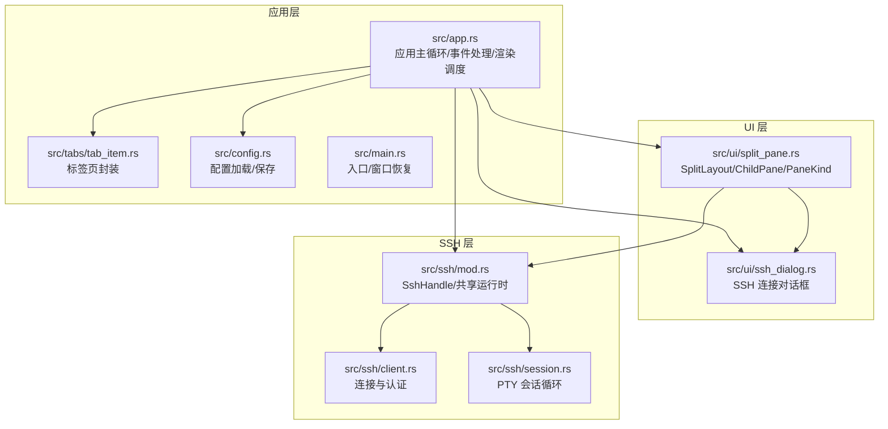
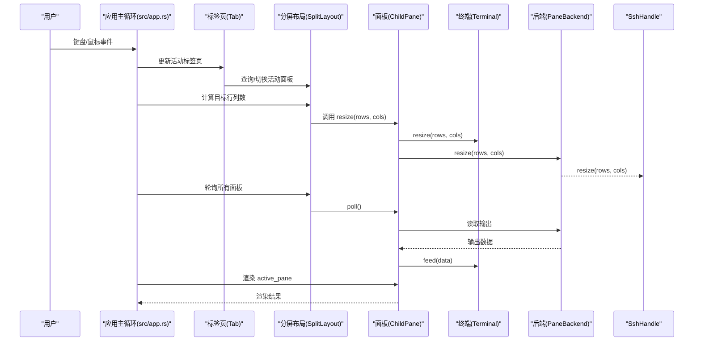
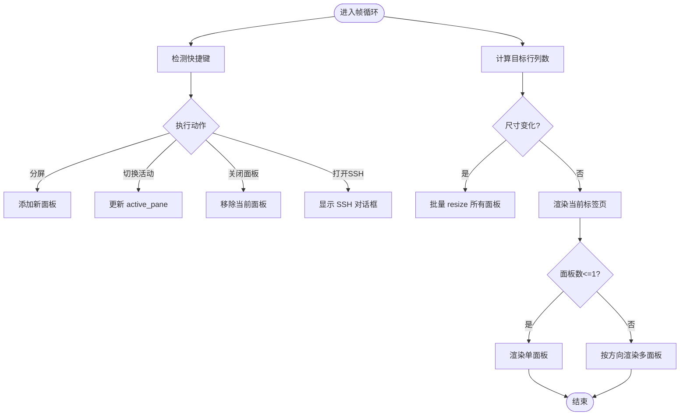
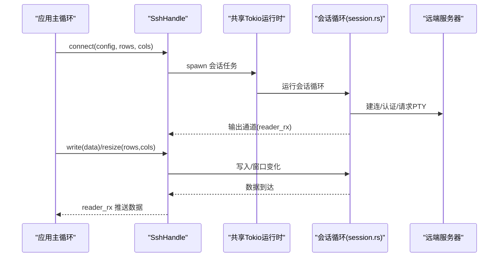
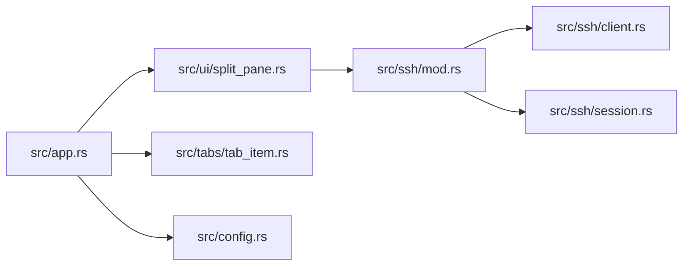

# 分屏布局管理

<cite>
**本文引用的文件**
- [src/ui/split_pane.rs](file://src/ui/split_pane.rs)
- [src/app.rs](file://src/app.rs)
- [src/tabs/tab_item.rs](file://src/tabs/tab_item.rs)
- [src/ui/ssh_dialog.rs](file://src/ui/ssh_dialog.rs)
- [src/ssh/mod.rs](file://src/ssh/mod.rs)
- [src/ssh/client.rs](file://src/ssh/client.rs)
- [src/ssh/session.rs](file://src/ssh/session.rs)
- [src/config.rs](file://src/config.rs)
- [src/main.rs](file://src/main.rs)
- [docs/specs/2026-05-30-phase2-ssh-split-design.md](file://docs/specs/2026-05-30-phase2-ssh-split-design.md)
- [docs/plans/2026-05-30-phase2-ssh-split.md](file://docs/plans/2026-05-30-phase2-ssh-split.md)
</cite>

## 目录
1. [简介](#简介)
2. [项目结构](#项目结构)
3. [核心组件](#核心组件)
4. [架构总览](#架构总览)
5. [详细组件分析](#详细组件分析)
6. [依赖关系分析](#依赖关系分析)
7. [性能考量](#性能考量)
8. [故障排查指南](#故障排查指南)
9. [结论](#结论)
10. [附录](#附录)

## 简介
本文件针对 QTerm 的分屏布局管理系统进行系统化技术文档整理，重点覆盖以下方面：
- 多面板分屏的实现原理：布局算法、面板分割策略与动态调整机制
- 分割线拖拽与交互：鼠标事件处理、边界检测与实时预览
- 面板大小计算与约束管理：最小尺寸限制、比例保持与自动布局
- 布局状态的序列化与恢复：配置保存、窗口重开与状态同步
- 嵌套与复杂场景：三向分割、四象限布局与动态增删面板
- 性能优化：重绘区域计算、懒加载与内存管理
- 实际代码示例与最佳实践

## 项目结构
QTerm 的分屏布局相关代码主要分布在 UI、应用主循环、SSH 模块与配置模块中。下图给出与分屏布局直接相关的文件与职责概览。



图表来源
- [src/app.rs](file://src/app.rs)
- [src/ui/split_pane.rs](file://src/ui/split_pane.rs)
- [src/tabs/tab_item.rs](file://src/tabs/tab_item.rs)
- [src/ui/ssh_dialog.rs](file://src/ui/ssh_dialog.rs)
- [src/ssh/mod.rs](file://src/ssh/mod.rs)
- [src/ssh/client.rs](file://src/ssh/client.rs)
- [src/ssh/session.rs](file://src/ssh/session.rs)
- [src/config.rs](file://src/config.rs)
- [src/main.rs](file://src/main.rs)

章节来源
- [src/app.rs](file://src/app.rs)
- [src/ui/split_pane.rs](file://src/ui/split_pane.rs)
- [src/tabs/tab_item.rs](file://src/tabs/tab_item.rs)
- [src/ui/ssh_dialog.rs](file://src/ui/ssh_dialog.rs)
- [src/ssh/mod.rs](file://src/ssh/mod.rs)
- [src/ssh/client.rs](file://src/ssh/client.rs)
- [src/ssh/session.rs](file://src/ssh/session.rs)
- [src/config.rs](file://src/config.rs)
- [src/main.rs](file://src/main.rs)

## 核心组件
- SplitLayout：管理一组 ChildPane，维护当前活动面板索引与分割方向，并提供增删面板、轮询、尺寸分配等能力
- ChildPane：封装单个终端面板，包含终端实例与后端（本地或 SSH），负责数据流转发、尺寸调整与生命周期管理
- PaneKind/PaneBackend：抽象终端与 SFTP 面板，统一不同后端的数据通路
- SshHandle：对外暴露与 PtyHandle 一致的接口，内部通过共享 tokio 运行时与远端建立 PTY 会话
- 应用主循环：负责键盘/鼠标事件、尺寸计算、渲染调度与状态持久化

章节来源
- [src/ui/split_pane.rs](file://src/ui/split_pane.rs)
- [src/ssh/mod.rs](file://src/ssh/mod.rs)
- [src/app.rs](file://src/app.rs)

## 架构总览
下图展示分屏布局在应用中的整体调用链：应用主循环接收输入与尺寸变化，根据当前标签页的 SplitLayout 决定渲染策略；SplitLayout 驱动各个 ChildPane 的终端渲染与后端通信；SSH 后端通过 SshHandle 与远端会话交互。



图表来源
- [src/app.rs](file://src/app.rs)
- [src/ui/split_pane.rs](file://src/ui/split_pane.rs)
- [src/ssh/mod.rs](file://src/ssh/mod.rs)

## 详细组件分析

### SplitLayout 与 ChildPane
- SplitDirection：水平/垂直两种分割方向
- SplitLayout：持有面板数组、当前活动面板索引与分割方向；提供新增/删除面板、轮询、查询活动面板等
- ChildPane：封装 Terminal 与后端（本地/SSH），负责数据流转发、尺寸调整与关闭清理
- PaneKind/PaneBackend：统一终端与 SFTP 面板的抽象，便于在 UI 中混合渲染

```mermaid
classDiagram
class SplitLayout {
+panes : Vec<ChildPane>
+direction : SplitDirection
+active_pane : usize
+new_single_local(...)
+active_pane()
+active_pane_mut()
+poll_all()
+add_local_pane(...)
+add_ssh_pane(...)
+add_sftp_pane(...)
+remove_pane(idx)
+pane_count() usize
}
class ChildPane {
+id : String
+kind : PaneKind
+alive : bool
+new_local(...)
+new_ssh(...)
+new_sftp(...)
+poll()
+write(data)
+resize(rows, cols)
+close()
}
class PaneKind {
<<enum>>
Terminal { terminal, backend }
Sftp { panel }
}
class PaneBackend {
<<enum>>
Local(PtyHandle)
Ssh(SshHandle)
}
SplitLayout --> ChildPane : "管理"
ChildPane --> PaneKind : "包含"
PaneKind --> PaneBackend : "后端"
```

图表来源
- [src/ui/split_pane.rs](file://src/ui/split_pane.rs)

章节来源
- [src/ui/split_pane.rs](file://src/ui/split_pane.rs)

### 应用主循环与渲染调度
- 键盘快捷键：水平/垂直分屏、切换活动面板、关闭当前面板、打开 SSH 对话框等
- 尺寸计算：根据可用空间与面板数量，按方向等分；当尺寸变化时批量调用面板 resize
- 渲染：单面板直接渲染；多面板按方向上下/左右排列，活动面板绘制边框高亮
- 鼠标交互：记录待处理的鼠标事件，支持右键菜单、双击/三击选词、拖拽选择



图表来源
- [src/app.rs](file://src/app.rs)

章节来源
- [src/app.rs](file://src/app.rs)

### SSH 后端与异步会话
- SshHandle：对外暴露 reader/writer/resize 接口，内部通过共享 tokio 运行时在后台线程中运行 SSH 会话
- 连接与认证：client.rs 使用 russh 完成 TCP 连接、握手、认证与 PTY 请求
- 会话循环：session.rs 在异步通道中处理远端数据、写入请求与窗口大小变化



图表来源
- [src/ssh/mod.rs](file://src/ssh/mod.rs)
- [src/ssh/client.rs](file://src/ssh/client.rs)
- [src/ssh/session.rs](file://src/ssh/session.rs)

章节来源
- [src/ssh/mod.rs](file://src/ssh/mod.rs)
- [src/ssh/client.rs](file://src/ssh/client.rs)
- [src/ssh/session.rs](file://src/ssh/session.rs)

### 面板大小计算与约束管理
- 等分策略：水平分屏按行等分，垂直分屏按列等分；每面板至少 1 行/列
- 尺寸同步：当目标行列数发生变化时，统一调用所有面板的 resize，确保终端网格与后端一致
- 活动面板高亮：渲染时为活动面板绘制边框，提升视觉反馈

章节来源
- [src/app.rs](file://src/app.rs)
- [src/ui/split_pane.rs](file://src/ui/split_pane.rs)

### 分割线拖拽与边界检测
- 当前实现：通过快捷键触发分屏方向与面板增删，未见显式的鼠标拖拽分割线实现
- 边界检测与实时预览：未在现有代码中发现拖拽分割线的边界检测与预览逻辑
- 建议：若需实现拖拽分割线，可在渲染阶段为面板间区域注册可拖拽区域，结合 egui 的拖拽事件与面板目标尺寸计算，实现拖拽过程中的临时布局与释放后的最终布局

章节来源
- [src/app.rs](file://src/app.rs)

### 布局状态的序列化与恢复
- 配置保存：AppConfig 提供窗口位置、尺寸、主题、字体大小、回滚行数等配置项的保存与加载
- 窗口重开：入口 main.rs 从配置恢复窗口尺寸、位置与最大化状态
- 布局状态：当前代码未见对 SplitLayout 的序列化/反序列化；建议在配置中增加布局方向、活动面板索引与面板后端信息，以便重启后恢复

章节来源
- [src/config.rs](file://src/config.rs)
- [src/main.rs](file://src/main.rs)

### 嵌套与复杂场景
- 三向/四象限：当前实现为一维线性分屏（水平/垂直），未见二维嵌套分屏
- 动态增删：支持在任意方向上新增面板，最多 6 个；支持关闭当前面板
- 建议：若需二维嵌套，可在 SplitLayout 中引入树形结构或复合布局节点，以支持子布局的嵌套与独立活动面板管理

章节来源
- [src/ui/split_pane.rs](file://src/ui/split_pane.rs)
- [docs/specs/2026-05-30-phase2-ssh-split-design.md](file://docs/specs/2026-05-30-phase2-ssh-split-design.md)

## 依赖关系分析
- 应用主循环依赖 UI 分屏模块与标签页模块，以驱动渲染与事件处理
- 分屏模块依赖 SSH 模块以支持远程终端后端
- SSH 模块依赖 russh 与 tokio，通过共享运行时与异步通道实现稳定的数据通路
- 配置模块为应用提供持久化能力，支撑窗口状态与主题等配置



图表来源
- [src/app.rs](file://src/app.rs)
- [src/ui/split_pane.rs](file://src/ui/split_pane.rs)
- [src/tabs/tab_item.rs](file://src/tabs/tab_item.rs)
- [src/config.rs](file://src/config.rs)
- [src/ssh/mod.rs](file://src/ssh/mod.rs)
- [src/ssh/client.rs](file://src/ssh/client.rs)
- [src/ssh/session.rs](file://src/ssh/session.rs)

章节来源
- [src/app.rs](file://src/app.rs)
- [src/ui/split_pane.rs](file://src/ui/split_pane.rs)
- [src/tabs/tab_item.rs](file://src/tabs/tab_item.rs)
- [src/config.rs](file://src/config.rs)
- [src/ssh/mod.rs](file://src/ssh/mod.rs)
- [src/ssh/client.rs](file://src/ssh/client.rs)
- [src/ssh/session.rs](file://src/ssh/session.rs)

## 性能考量
- 重绘区域计算：按面板数量等分计算目标行列数，减少不必要的重排；仅在尺寸变化时批量 resize
- 懒加载：面板按需创建，SSH 连接在需要时建立；关闭面板时及时释放资源
- 内存管理：ChildPane 在关闭时调用后端 close，确保 PTY/SSH 资源回收；避免在渲染阶段频繁创建临时对象
- 异步解耦：SSH 后端通过通道与应用主线程解耦，避免阻塞 UI

章节来源
- [src/app.rs](file://src/app.rs)
- [src/ui/split_pane.rs](file://src/ui/split_pane.rs)
- [src/ssh/mod.rs](file://src/ssh/mod.rs)

## 故障排查指南
- SSH 连接失败：检查主机名/端口/用户名/认证方式；查看 SSH 对话框状态提示
- 面板无法渲染：确认终端尺寸计算是否为正数；检查活动面板是否存在
- 鼠标交互异常：确认 pending_mouse 是否正确传递至 handle_terminal_mouse；检查右键菜单是否被遮挡
- 配置未生效：确认配置文件路径与格式；检查入口是否正确读取配置

章节来源
- [src/ui/ssh_dialog.rs](file://src/ui/ssh_dialog.rs)
- [src/app.rs](file://src/app.rs)
- [src/config.rs](file://src/config.rs)
- [src/main.rs](file://src/main.rs)

## 结论
QTerm 的分屏布局管理以 SplitLayout 为核心，结合 ChildPane 与 PaneKind/PaneBackend 抽象，实现了本地与 SSH 两种后端的统一管理。应用主循环负责事件处理、尺寸计算与渲染调度，配合 SSH 模块的异步通道实现稳定的远程终端体验。当前实现聚焦于一维线性分屏与快捷键操作，未包含拖拽分割线与布局序列化恢复。后续可扩展二维嵌套布局、拖拽分割线与布局持久化，以满足更复杂的终端工作流需求。

## 附录
- 快捷键参考（来自设计文档与实现）
  - Ctrl+Shift+H：水平分屏
  - Ctrl+Shift+V：垂直分屏
  - Ctrl+方向键：切换活动面板
  - Ctrl+Shift+W：关闭当前面板
  - Ctrl+Shift+N：打开 SSH 连接对话框

章节来源
- [docs/specs/2026-05-30-phase2-ssh-split-design.md](file://docs/specs/2026-05-30-phase2-ssh-split-design.md)
- [src/app.rs](file://src/app.rs)