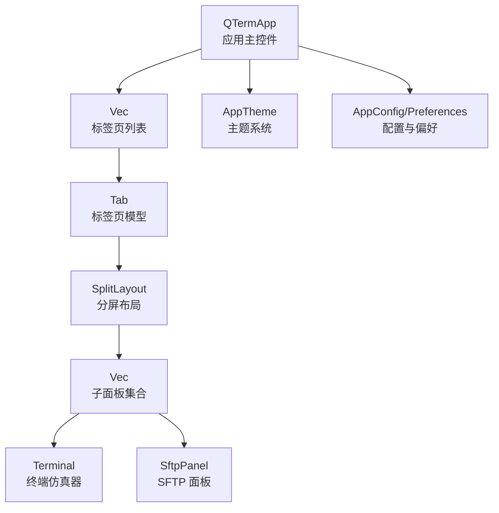
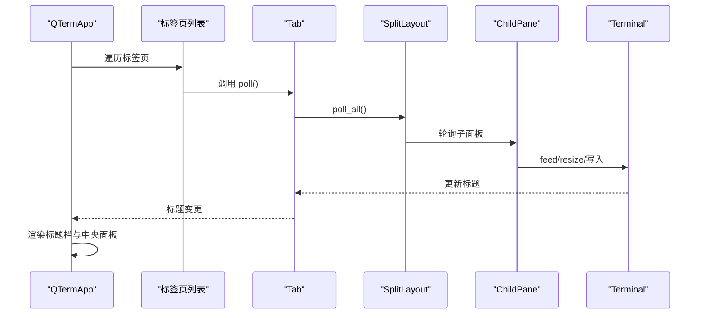
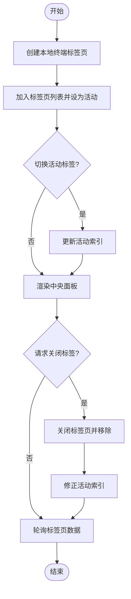
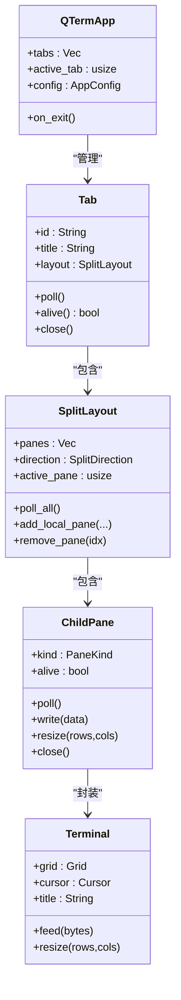
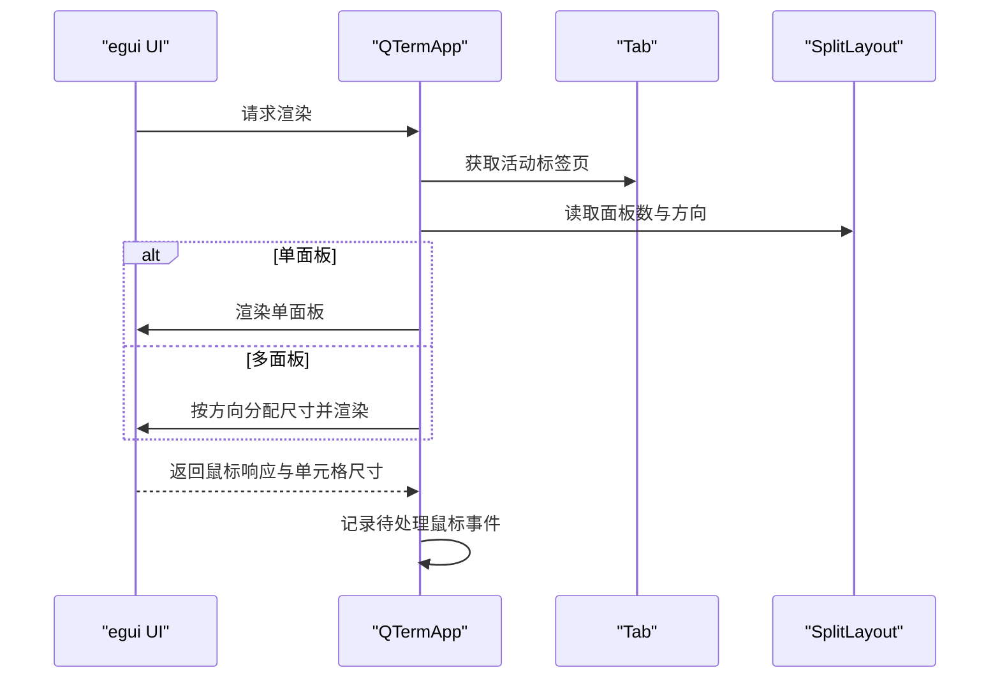
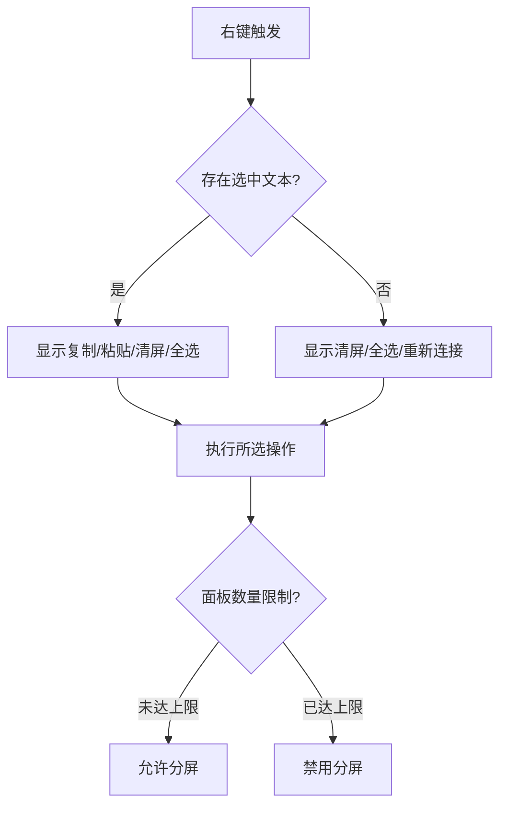
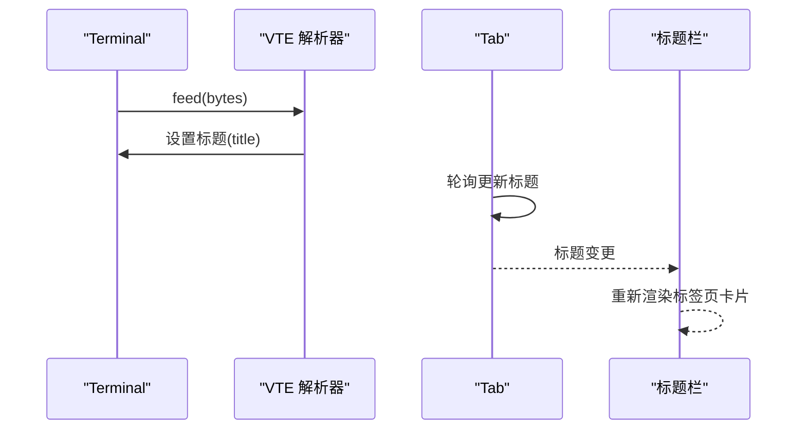
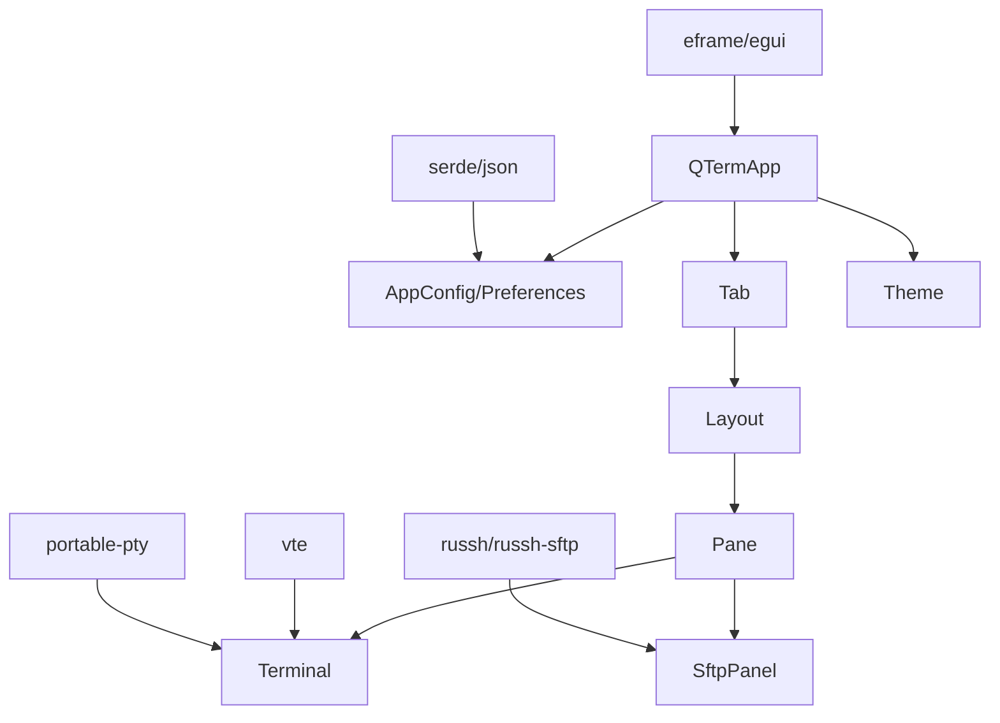

# 标签页管理系统

<cite>
**本文档引用的文件**
- [src/app.rs](file://src/app.rs)
- [src/tab/mod.rs](file://src/tab/mod.rs)
- [src/tab/tab_item.rs](file://src/tab/tab_item.rs)
- [src/ui/split_pane.rs](file://src/ui/split_pane.rs)
- [src/ui/ssh_dialog.rs](file://src/ui/ssh_dialog.rs)
- [src/ui/sftp_panel.rs](file://src/ui/sftp_panel.rs)
- [src/terminal/mod.rs](file://src/terminal/mod.rs)
- [src/terminal/parser.rs](file://src/terminal/parser.rs)
- [src/theme/mod.rs](file://src/theme/mod.rs)
- [src/config.rs](file://src/config.rs)
- [Cargo.toml](file://Cargo.toml)
- [whaleterm_终端界面.md](file://whaleterm_终端界面.md)
</cite>

## 目录
1. [简介](#简介)
2. [项目结构](#项目结构)
3. [核心组件](#核心组件)
4. [架构总览](#架构总览)
5. [详细组件分析](#详细组件分析)
6. [依赖关系分析](#依赖关系分析)
7. [性能考量](#性能考量)
8. [故障排除指南](#故障排除指南)
9. [结论](#结论)
10. [附录](#附录)

## 简介
本文件为 QTerm 的标签页管理系统提供全面的架构文档。重点覆盖以下方面：
- 标签页生命周期管理：创建、激活、关闭与销毁的完整流程
- 标签页状态管理：会话状态保存、滚动位置记录与焦点管理
- 标签页切换动画与过渡效果：淡入淡出、滑动切换与状态同步
- 标签页右键菜单与快捷操作：新建、关闭、复制链接与重新加载
- 标签页标题生成规则：会话类型标识、主机名显示与状态指示器
- 标签页配置管理：最大数量限制、标签页宽度计算与溢出处理
- 多标签页场景下的性能优化与内存管理策略

## 项目结构
QTerm 的标签页系统围绕应用主控件、标签页模型与分屏布局展开，采用模块化设计，职责清晰：
- 应用主控件负责 UI 呈现、事件处理、全局快捷键与标签页容器管理
- 标签页模型封装单个标签页的标题、唯一标识与内部分屏布局
- 分屏布局管理多个子面板（终端或 SFTP），支持活动面板切换与尺寸调整
- 终端模块负责文本解析、滚动与标题更新；主题与配置模块提供外观与持久化参数

图表来源
- [src/app.rs:18-36](file://src/app.rs#L18-L36)
- [src/tab/tab_item.rs:5-9](file://src/tab/tab_item.rs#L5-L9)
- [src/ui/split_pane.rs:132-136](file://src/ui/split_pane.rs#L132-L136)
- [src/terminal/mod.rs:26-41](file://src/terminal/mod.rs#L26-L41)
- [src/ui/sftp_panel.rs:11-22](file://src/ui/sftp_panel.rs#L11-L22)
- [src/theme/mod.rs:16-21](file://src/theme/mod.rs#L16-L21)
- [src/config.rs:40-66](file://src/config.rs#L40-L66)

章节来源
- [src/app.rs:18-36](file://src/app.rs#L18-L36)
- [src/tab/mod.rs:1-3](file://src/tab/mod.rs#L1-L3)
- [src/tab/tab_item.rs:5-9](file://src/tab/tab_item.rs#L5-L9)
- [src/ui/split_pane.rs:132-136](file://src/ui/split_pane.rs#L132-L136)
- [src/terminal/mod.rs:26-41](file://src/terminal/mod.rs#L26-L41)
- [src/ui/sftp_panel.rs:11-22](file://src/ui/sftp_panel.rs#L11-L22)
- [src/theme/mod.rs:16-21](file://src/theme/mod.rs#L16-L21)
- [src/config.rs:40-66](file://src/config.rs#L40-L66)

## 核心组件
- 应用主控件（QTermApp）
  - 管理标签页列表、活动标签索引、配置与主题
  - 处理全局快捷键与 UI 渲染，驱动标签页轮询与面板渲染
- 标签页（Tab）
  - 持有唯一标识、标题与分屏布局
  - 提供创建、轮询、存活检查与关闭接口
- 分屏布局（SplitLayout）
  - 管理子面板集合、活动面板索引与分屏方向
  - 提供添加/移除面板、轮询与尺寸调整能力
- 子面板（ChildPane）
  - 封装终端或 SFTP 面板，维护存活状态与后端连接
  - 提供轮询、写入、调整大小与关闭接口
- 终端（Terminal）
  - 解析 VTE 序列、维护网格与滚动、支持标题更新
- 主题与配置
  - AppTheme 提供 UI 与终端主题；AppConfig/Preferences 提供持久化参数

章节来源
- [src/app.rs:18-36](file://src/app.rs#L18-L36)
- [src/tab/tab_item.rs:5-9](file://src/tab/tab_item.rs#L5-L9)
- [src/ui/split_pane.rs:22-60](file://src/ui/split_pane.rs#L22-L60)
- [src/terminal/mod.rs:26-41](file://src/terminal/mod.rs#L26-L41)
- [src/theme/mod.rs:16-21](file://src/theme/mod.rs#L16-L21)
- [src/config.rs:40-66](file://src/config.rs#L40-L66)

## 架构总览
标签页系统的运行时交互如下：
- 应用主循环中对所有标签页进行轮询，以刷新面板状态与标题
- 标题栏渲染展示标签页卡片，支持点击切换与关闭
- 中央面板根据活动标签页的分屏布局渲染子面板
- 右键菜单提供快捷操作，结合终端选择状态与面板类型执行相应动作

图表来源
- [src/app.rs:285-289](file://src/app.rs#L285-L289)
- [src/tab/tab_item.rs:25-35](file://src/tab/tab_item.rs#L25-L35)
- [src/ui/split_pane.rs:156-160](file://src/ui/split_pane.rs#L156-L160)
- [src/terminal/parser.rs:175-193](file://src/terminal/parser.rs#L175-L193)

章节来源
- [src/app.rs:285-289](file://src/app.rs#L285-L289)
- [src/tab/tab_item.rs:25-35](file://src/tab/tab_item.rs#L25-L35)
- [src/ui/split_pane.rs:156-160](file://src/ui/split_pane.rs#L156-L160)
- [src/terminal/parser.rs:175-193](file://src/terminal/parser.rs#L175-L193)

## 详细组件分析

### 标签页生命周期管理
- 创建
  - 通过应用主控件创建本地终端标签页，初始化单面板布局
  - 新标签页被追加到列表末尾，并设为活动标签
- 激活
  - 标题栏点击或快捷键切换，更新活动标签索引
  - 中央面板根据活动标签页的分屏布局渲染
- 关闭
  - 关闭指定索引的标签页，调用其关闭逻辑以关闭所有子面板
  - 从列表移除该标签页，必要时修正活动标签索引
- 销毁
  - 应用退出时保存配置并逐个关闭标签页

图表来源
- [src/app.rs:189-205](file://src/app.rs#L189-L205)
- [src/app.rs:207-216](file://src/app.rs#L207-L216)
- [src/app.rs:348-352](file://src/app.rs#L348-L352)
- [src/app.rs:577-588](file://src/app.rs#L577-L588)

章节来源
- [src/app.rs:189-205](file://src/app.rs#L189-L205)
- [src/app.rs:207-216](file://src/app.rs#L207-L216)
- [src/app.rs:348-352](file://src/app.rs#L348-L352)
- [src/app.rs:577-588](file://src/app.rs#L577-L588)

### 标签页状态管理机制
- 会话状态保存
  - 应用退出时保存窗口位置、尺寸、主题与配置
- 滚动位置记录
  - 终端网格维护滚动缓冲区，滚动区域由上下边界决定
- 焦点管理
  - 终端面板获得焦点时，主动让 UI 元素失去焦点，保证输入路由正确

图表来源
- [src/app.rs:18-36](file://src/app.rs#L18-L36)
- [src/tab/tab_item.rs:5-9](file://src/tab/tab_item.rs#L5-L9)
- [src/ui/split_pane.rs:132-136](file://src/ui/split_pane.rs#L132-L136)
- [src/ui/split_pane.rs:22-60](file://src/ui/split_pane.rs#L22-L60)
- [src/terminal/mod.rs:26-41](file://src/terminal/mod.rs#L26-L41)

章节来源
- [src/app.rs:577-588](file://src/app.rs#L577-L588)
- [src/terminal/mod.rs:86-98](file://src/terminal/mod.rs#L86-L98)

### 标签页切换动画与过渡效果
- 淡入淡出
  - 通过 egui 的帧与绘制状态实现面板内容的渐显/渐隐
- 滑动切换
  - 水平/垂直分屏模式下，根据面板数量与方向动态分配尺寸
- 状态同步
  - 活动面板高亮边框，鼠标事件仅在活动面板生效

图表来源
- [src/app.rs:430-456](file://src/app.rs#L430-L456)
- [src/app.rs:478-556](file://src/app.rs#L478-L556)
- [src/ui/split_pane.rs:205-207](file://src/ui/split_pane.rs#L205-L207)

章节来源
- [src/app.rs:430-456](file://src/app.rs#L430-L456)
- [src/app.rs:478-556](file://src/app.rs#L478-L556)
- [src/ui/split_pane.rs:205-207](file://src/ui/split_pane.rs#L205-L207)

### 标签页右键菜单与快捷操作
- 右键菜单项（基于界面规范）
  - 复制、粘贴、清屏、全选、重新连接、设置终端宽度
  - 分屏-水平/垂直（受子终端数量限制）
  - 收藏命令、快捷命令栏/行、主机信息、安装工具、Code-Server、SFTP、免密登录
- 快捷操作
  - 标题栏右键菜单支持新建连接、复制连接、重命名、颜色标记、关闭、关闭左侧/右侧
  - 终端面板右键菜单支持复制、粘贴、清屏、全选、重新连接、分屏等

图表来源
- [whaleterm_终端界面.md:487-525](file://whaleterm_终端界面.md#L487-L525)
- [src/app.rs:1175-1190](file://src/app.rs#L1175-L1190)

章节来源
- [whaleterm_终端界面.md:487-525](file://whaleterm_终端界面.md#L487-L525)
- [src/app.rs:1175-1190](file://src/app.rs#L1175-L1190)

### 标签页标题生成规则
- 默认标题
  - 新建本地终端标签页时，默认标题为“终端”
- 动态标题
  - 从终端 OSC 标题序列（0/1/2）更新标签页标题
  - 标签页轮询时，从活动面板的终端读取最新标题

图表来源
- [src/terminal/parser.rs:175-193](file://src/terminal/parser.rs#L175-L193)
- [src/tab/tab_item.rs:25-35](file://src/tab/tab_item.rs#L25-L35)

章节来源
- [src/tab/tab_item.rs:14-21](file://src/tab/tab_item.rs#L14-L21)
- [src/tab/tab_item.rs:25-35](file://src/tab/tab_item.rs#L25-L35)
- [src/terminal/parser.rs:175-193](file://src/terminal/parser.rs#L175-L193)

### 标签页配置管理
- 最大数量限制
  - 分屏布局最多支持 6 个子面板
- 标签页宽度计算
  - 标题栏卡片高度固定，宽度由内容与间距决定
- 溢出处理
  - 通过卡片布局与滚动/省略策略避免 UI 溢出（具体实现依赖 egui 布局行为）

章节来源
- [src/ui/split_pane.rs:163-165](file://src/ui/split_pane.rs#L163-L165)
- [src/ui/split_pane.rs:174-176](file://src/ui/split_pane.rs#L174-L176)
- [src/ui/split_pane.rs:185-187](file://src/ui/split_pane.rs#L185-L187)
- [src/app.rs:639-680](file://src/app.rs#L639-L680)

## 依赖关系分析
- 外部依赖
  - eframe/egui：UI 渲染与事件处理
  - portable-pty：本地终端进程管理
  - russh/russh-sftp：SSH/SFTP 连接
  - vte：ANSI 转义序列解析
  - serde/json：配置文件解析与序列化
- 内部模块耦合
  - 应用主控件依赖标签页、分屏布局、终端与主题模块
  - 标签页依赖分屏布局，分屏布局依赖子面板与终端/SFTP

图表来源
- [Cargo.toml:8-25](file://Cargo.toml#L8-L25)
- [src/app.rs:1-10](file://src/app.rs#L1-L10)
- [src/ui/split_pane.rs:1-5](file://src/ui/split_pane.rs#L1-L5)
- [src/terminal/mod.rs:1-5](file://src/terminal/mod.rs#L1-L5)
- [src/ui/sftp_panel.rs:1-4](file://src/ui/sftp_panel.rs#L1-L4)
- [src/config.rs:1-28](file://src/config.rs#L1-L28)

章节来源
- [Cargo.toml:8-25](file://Cargo.toml#L8-L25)
- [src/app.rs:1-10](file://src/app.rs#L1-L10)
- [src/ui/split_pane.rs:1-5](file://src/ui/split_pane.rs#L1-L5)
- [src/terminal/mod.rs:1-5](file://src/terminal/mod.rs#L1-L5)
- [src/ui/sftp_panel.rs:1-4](file://src/ui/sftp_panel.rs#L1-L4)
- [src/config.rs:1-28](file://src/config.rs#L1-L28)

## 性能考量
- 轮询与渲染
  - 每帧对所有标签页进行轮询，避免阻塞 UI 线程
  - 中央面板按需渲染活动标签页，减少无效绘制
- 终端解析
  - 使用增量解析器处理字节流，降低内存拷贝与解析成本
- 分屏布局
  - 动态计算面板尺寸，避免不必要的重排
- 配置持久化
  - INI/JSON 解析采用流式读取，减少 IO 开销

章节来源
- [src/app.rs:285-289](file://src/app.rs#L285-L289)
- [src/terminal/mod.rs:65-74](file://src/terminal/mod.rs#L65-L74)
- [src/ui/split_pane.rs:205-207](file://src/ui/split_pane.rs#L205-L207)
- [src/config.rs:129-143](file://src/config.rs#L129-L143)

## 故障排除指南
- 标签页无法关闭
  - 检查活动标签索引是否越界，确认关闭逻辑是否正确移除标签页并修正活动索引
- 标题不更新
  - 确认终端 OSC 序列解析正常，标签页轮询是否调用活动面板的标题读取
- 面板无响应
  - 检查子面板存活状态与后端连接（本地/SSH），确认轮询与写入通道正常
- 右键菜单异常
  - 校验菜单项条件判断与面板类型匹配，确保在活动面板上执行操作

章节来源
- [src/app.rs:207-216](file://src/app.rs#L207-L216)
- [src/tab/tab_item.rs:25-35](file://src/tab/tab_item.rs#L25-L35)
- [src/ui/split_pane.rs:62-97](file://src/ui/split_pane.rs#L62-L97)
- [src/app.rs:1175-1190](file://src/app.rs#L1175-L1190)

## 结论
QTerm 的标签页管理系统以模块化架构为核心，通过应用主控件统一调度标签页与面板，结合分屏布局与终端解析实现灵活的多会话体验。系统在生命周期管理、状态同步、UI 交互与性能优化方面具备良好设计，适合在多标签页场景下稳定运行。

## 附录
- 右键菜单项参考（终端与标签页）
  - 终端右键菜单项与条件参见界面规范文档
  - 标签页右键菜单项与功能参见界面规范文档

章节来源
- [whaleterm_终端界面.md:487-525](file://whaleterm_终端界面.md#L487-L525)