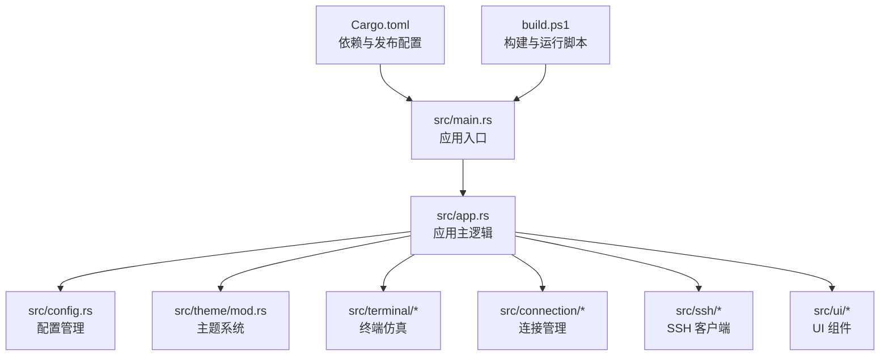
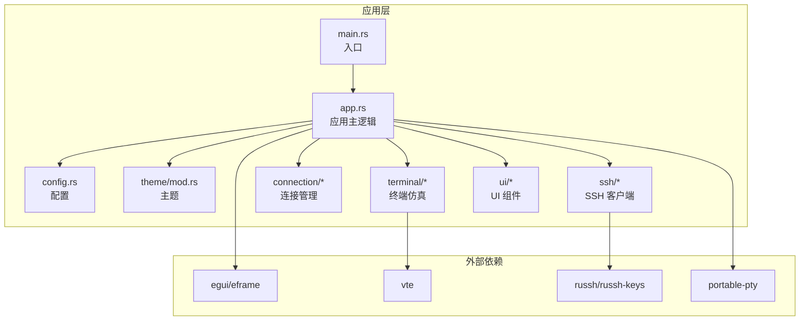
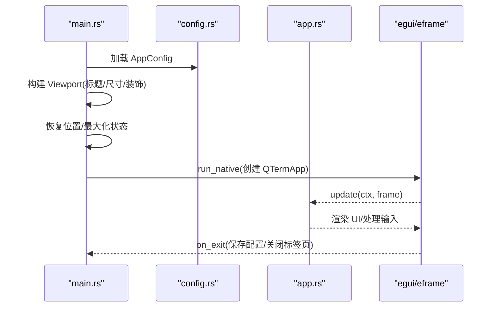
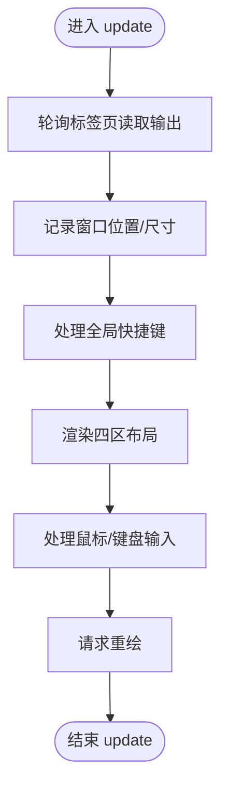
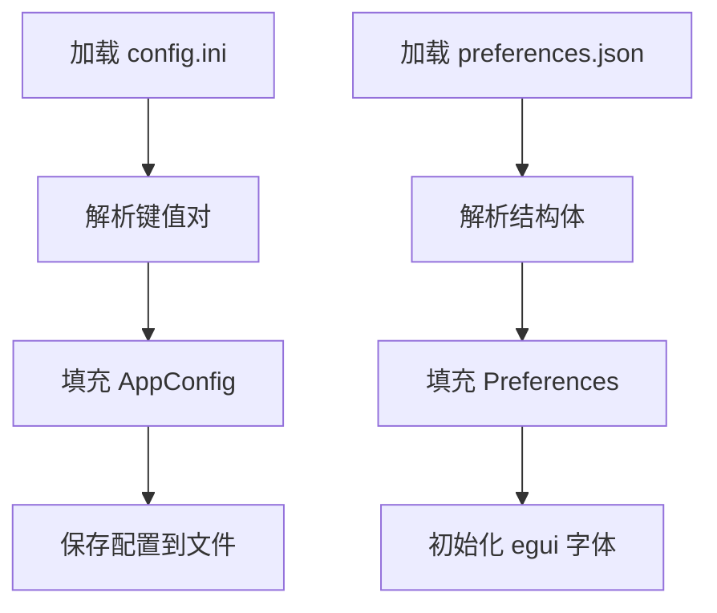
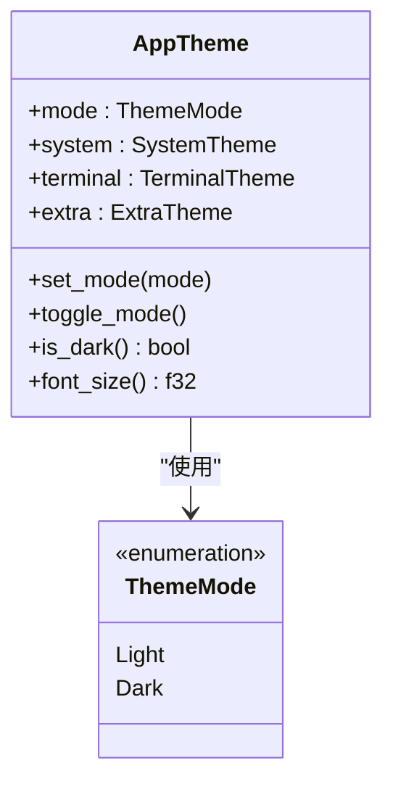
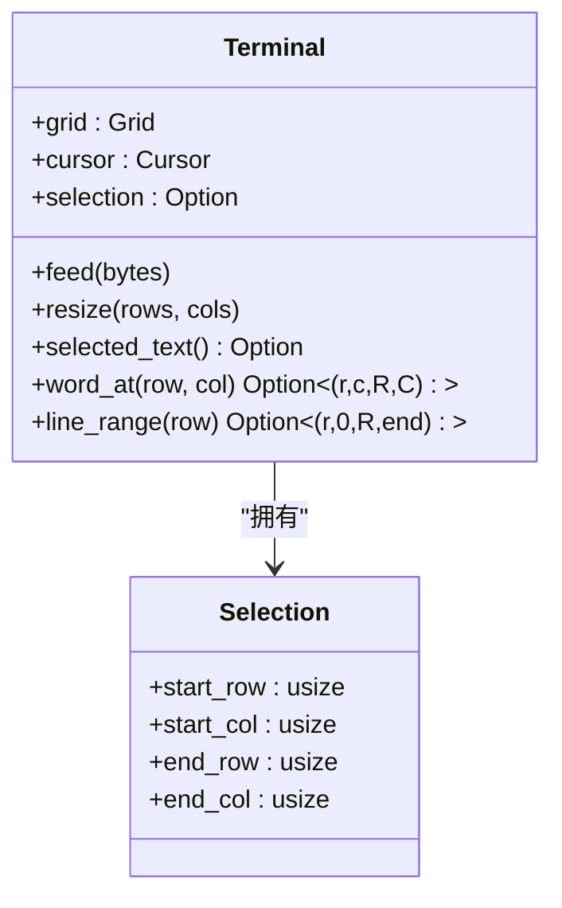
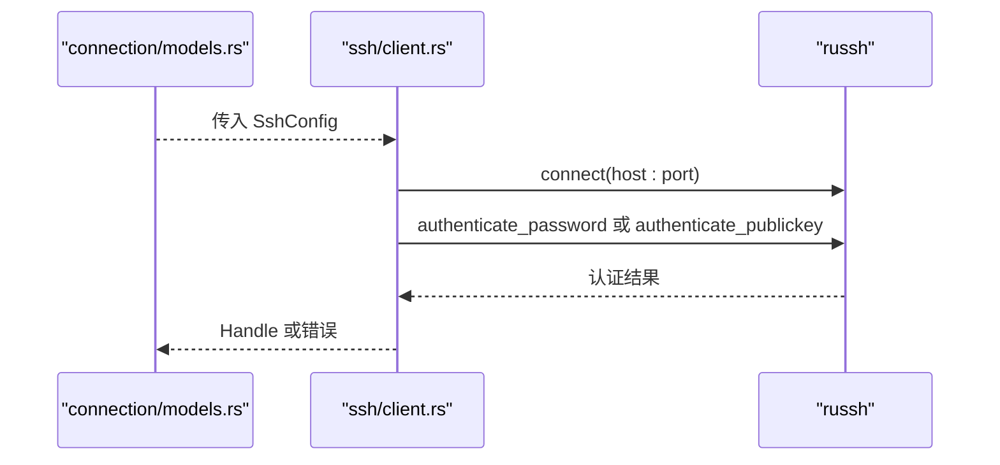
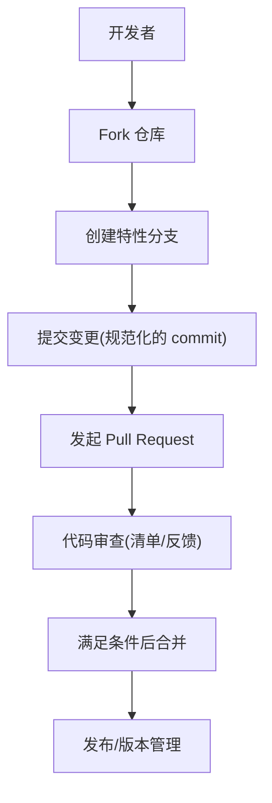
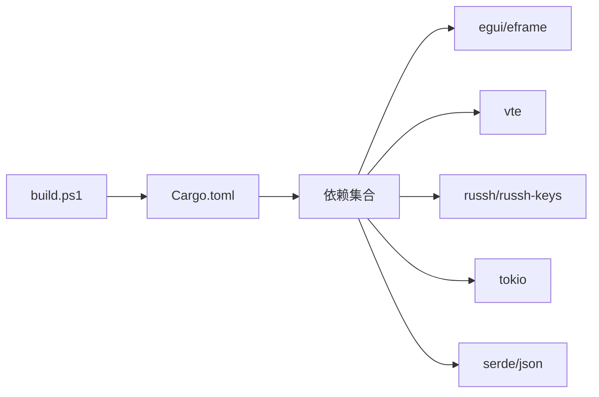

# 代码贡献指南

<cite>
**本文档引用的文件**
- [Cargo.toml](file://Cargo.toml)
- [main.rs](file://src/main.rs)
- [app.rs](file://src/app.rs)
- [config.rs](file://src/config.rs)
- [mod.rs](file://src/theme/mod.rs)
- [mod.rs](file://src/connection/models.rs)
- [client.rs](file://src/ssh/client.rs)
- [.gitignore](file://.gitignore)
- [build.ps1](file://build.ps1)
- [改造计划.md](file://docs/plans/改造计划.md)
- [whaleterm_主题.md](file://whaleterm_主题.md)
- [whaleterm_终端界面.md](file://whaleterm_终端界面.md)
</cite>

## 目录
1. [简介](#简介)
2. [项目结构](#项目结构)
3. [核心组件](#核心组件)
4. [架构总览](#架构总览)
5. [详细组件分析](#详细组件分析)
6. [依赖关系分析](#依赖关系分析)
7. [性能考虑](#性能考虑)
8. [故障排查指南](#故障排查指南)
9. [结论](#结论)
10. [附录](#附录)

## 简介
本指南面向希望为 QTerm 项目贡献代码的开发者，涵盖代码规范与风格、提交流程与规范、代码审查标准、测试要求、文档贡献方式以及社区行为准则与沟通规范。QTerm 是一个基于 Rust 的跨平台终端模拟器，采用 eframe/egui 构建 UI，并通过 VTE 解析器实现终端仿真，支持本地与 SSH 终端、分屏与 SFTP 等功能。

## 项目结构
QTerm 采用模块化组织，核心模块包括应用入口、配置管理、主题系统、终端仿真、连接管理、UI 组件等。构建与运行通过 Cargo 管理，提供 PowerShell 脚本辅助编译与运行。

**图表来源**
- [main.rs:1-87](file://src/main.rs#L1-L87)
- [app.rs:1-120](file://src/app.rs#L1-L120)
- [config.rs:1-120](file://src/config.rs#L1-L120)
- [mod.rs:1-71](file://src/theme/mod.rs#L1-L71)
- [Cargo.toml:1-30](file://Cargo.toml#L1-L30)
- [build.ps1:1-58](file://build.ps1#L1-L58)

**章节来源**
- [main.rs:1-87](file://src/main.rs#L1-L87)
- [Cargo.toml:1-30](file://Cargo.toml#L1-L30)
- [build.ps1:1-58](file://build.ps1#L1-L58)

## 核心组件
- 应用入口与生命周期：负责窗口初始化、配置加载与 eframe 渲染循环。
- 应用主逻辑：管理标签页、主题、字体、窗口状态、全局快捷键与 UI 布局。
- 配置系统：INI 格式运行时配置与 WhaleTerm preferences.json 偏好设置读取。
- 主题系统：分离系统主题与终端主题，支持亮/暗模式切换。
- 终端仿真：基于 VTE 解析器，支持文本选择、滚动与备用屏幕模式。
- 连接管理：从 WhaleTerm 配置读取连接列表，支持本地与 SSH 连接。
- SSH 客户端：基于 russh，支持密码与私钥认证。
- UI 组件：标题栏、侧边栏、左侧面板、状态栏与分屏交互。

**章节来源**
- [app.rs:1-120](file://src/app.rs#L1-L120)
- [config.rs:1-120](file://src/config.rs#L1-L120)
- [mod.rs:1-71](file://src/theme/mod.rs#L1-L71)
- [mod.rs:1-43](file://src/connection/models.rs#L1-L43)
- [client.rs:1-63](file://src/ssh/client.rs#L1-L63)

## 架构总览
QTerm 采用“模块化 + 主题驱动”的架构。应用入口负责初始化窗口与配置；应用主逻辑协调各模块；主题系统贯穿 UI 渲染；终端仿真与 SSH 客户端分别处理本地与远程会话；连接管理提供连接树与对话框。

**图表来源**
- [main.rs:1-87](file://src/main.rs#L1-L87)
- [app.rs:1-120](file://src/app.rs#L1-L120)
- [mod.rs:1-71](file://src/theme/mod.rs#L1-L71)
- [mod.rs:1-43](file://src/connection/models.rs#L1-L43)
- [client.rs:1-63](file://src/ssh/client.rs#L1-L63)
- [Cargo.toml:8-25](file://Cargo.toml#L8-L25)

## 详细组件分析

### 应用入口与生命周期
- 负责加载配置、构建窗口视口、设置最小尺寸与无原生装饰、恢复窗口位置与最大化状态，并启动 eframe 渲染循环。
- 提供跨平台窗口位置可见性检测（Windows 使用 Win32 API，其他平台使用坐标范围判断）。

**图表来源**
- [main.rs:49-87](file://src/main.rs#L49-L87)
- [config.rs:68-127](file://src/config.rs#L68-L127)
- [app.rs:282-589](file://src/app.rs#L282-L589)

**章节来源**
- [main.rs:1-87](file://src/main.rs#L1-L87)
- [config.rs:1-127](file://src/config.rs#L1-L127)
- [app.rs:282-589](file://src/app.rs#L282-L589)

### 应用主逻辑与 UI 布局
- 管理标签页、主题、字体、窗口状态、全局快捷键与四区布局（标题栏、左侧导航栏、左侧面板、中央终端区、状态栏）。
- 支持分屏（水平/垂直）、字体缩放、右键菜单、鼠标文本选择与复制粘贴等交互。

**图表来源**
- [app.rs:282-589](file://src/app.rs#L282-L589)

**章节来源**
- [app.rs:1-589](file://src/app.rs#L1-L589)

### 配置系统
- 运行时配置：INI 文件存储窗口位置、尺寸、主题、字体大小、回滚行数、Shell 路径等。
- WhaleTerm 偏好设置：从 preferences.json 读取字体家族、大小、粗体与主题，用于 egui 字体与主题初始化。

**图表来源**
- [config.rs:68-143](file://src/config.rs#L68-L143)
- [config.rs:240-281](file://src/config.rs#L240-L281)

**章节来源**
- [config.rs:1-281](file://src/config.rs#L1-L281)

### 主题系统
- AppTheme 包含系统主题、终端主题与扩展色，支持亮/暗模式切换。
- 通过 egui 颜色类型应用到 UI 组件，确保全局一致性。

**图表来源**
- [mod.rs:7-62](file://src/theme/mod.rs#L7-L62)

**章节来源**
- [mod.rs:1-71](file://src/theme/mod.rs#L1-L71)

### 终端仿真与文本选择
- Terminal 结构管理 Grid、光标、颜色属性、滚动区域与文本选择。
- 支持双击选词、三击选行、复制/粘贴与备用屏幕模式。

**图表来源**
- [mod.rs:16-200](file://src/terminal/mod.rs#L16-L200)

**章节来源**
- [mod.rs:1-200](file://src/terminal/mod.rs#L1-L200)

### 连接管理与 SSH 客户端
- 从 WhaleTerm connections.json 读取连接列表，支持密码与私钥认证。
- SSH 客户端自动接受服务器密钥，支持密码与私钥认证流程。

**图表来源**
- [mod.rs:1-43](file://src/connection/models.rs#L1-L43)
- [client.rs:23-63](file://src/ssh/client.rs#L23-L63)

**章节来源**
- [mod.rs:1-43](file://src/connection/models.rs#L1-L43)
- [client.rs:1-63](file://src/ssh/client.rs#L1-L63)

### 概念总览
以下为概念性工作流，不直接映射具体源文件。

[本图为概念流程，无需图表来源]

## 依赖关系分析
- 依赖管理：Cargo.toml 定义了 eframe/egui、VTE、russh、tokio、serde 等核心依赖。
- 发布配置：release profile 启用 LTO、符号裁剪与优化级别压缩。
- 构建脚本：build.ps1 支持 Debug/Release 构建、清理与运行。

**图表来源**
- [Cargo.toml:8-30](file://Cargo.toml#L8-L30)
- [build.ps1:30-54](file://build.ps1#L30-L54)

**章节来源**
- [Cargo.toml:1-30](file://Cargo.toml#L1-L30)
- [build.ps1:1-58](file://build.ps1#L1-L58)

## 性能考虑
- 发布构建优化：启用 LTO、符号裁剪与二进制体积优化，适合分发。
- 终端渲染：合理设置回滚缓冲区行数与字体大小，避免过度占用内存。
- 异步 I/O：SSH 与 PTY 使用异步运行时，注意避免阻塞主线程。
- UI 帧率：减少不必要的重绘，使用 egui 的响应式布局与最小化状态变更。

[本节为通用指导，无需章节来源]

## 故障排查指南
- 构建失败：检查 Cargo.lock 与依赖版本，使用 build.ps1 的 Clean 参数清理后重试。
- 配置读取异常：确认 config.ini 与 preferences.json 的路径与权限。
- SSH 连接问题：验证主机地址、端口、认证方式与密钥路径；查看认证日志。
- 字体显示异常：检查系统字体路径与回退字体，确认 egui 字体注册成功。
- 窗口位置不可见：Windows 下检查 MonitorFromRect API 返回，其他平台检查坐标范围。

**章节来源**
- [.gitignore:1-22](file://.gitignore#L1-L22)
- [config.rs:68-143](file://src/config.rs#L68-L143)
- [client.rs:14-21](file://src/ssh/client.rs#L14-L21)

## 结论
本指南提供了 QTerm 项目的代码贡献路径与实践标准。遵循本文档的规范与流程，有助于提升代码质量、协作效率与用户体验。请在提交前确保通过构建、测试与审查流程，并参考改造计划与主题规范以保持界面一致性。

[本节为总结，无需章节来源]

## 附录

### 代码规范与风格
- Rust 编码标准
  - 使用稳定的 edition（2021），遵循 Cargo 默认特性与依赖版本。
  - 优先使用 async/await 与 tokio 的多线程运行时。
  - 严格处理错误，使用 Result/Option 明确错误传播。
  - 为公共 API 添加文档注释，遵循 Rustdoc 标准。
- 命名约定
  - 模块与文件：snake_case；结构体与枚举：PascalCase。
  - 方法与函数：camelCase；常量：SCREAMING_SNAKE_CASE。
  - 私有成员：lowercase；内部模块：mod.rs。
- 注释规范
  - 为复杂逻辑与边界情况添加注释，解释设计权衡。
  - 为公共 API 提供简明的用途说明与参数/返回值说明。

**章节来源**
- [Cargo.toml:1-30](file://Cargo.toml#L1-L30)
- [app.rs:1-120](file://src/app.rs#L1-L120)

### 提交流程与规范
- 分支管理
  - 主分支：稳定版本，仅通过 PR 合并。
  - 特性分支：按功能或修复创建，完成后清理。
- commit 消息格式
  - 类型: 摘要（不超过 50 字）
  - 详细说明（可选，解释动机与影响）
  - 关联 Issue（可选）
- Pull Request 模板
  - 描述变更目的、影响范围与测试要点。
  - 引用相关 Issue 与讨论链接。
  - 附带截图/录屏（UI 变更时）。

**章节来源**
- [改造计划.md:1-548](file://docs/plans/改造计划.md#L1-L548)

### 代码审查标准与流程
- 审查清单
  - 代码是否符合 Rust 标准与项目风格。
  - 是否有必要的注释与文档。
  - 是否处理了边界情况与错误场景。
  - 是否引入了新依赖或破坏了兼容性。
  - 是否通过构建与测试。
- 反馈处理
  - 针对性回复与修改，必要时进行二次审查。
- 合并条件
  - 至少一名维护者批准。
  - CI 通过，无未解决的评论。
  - 代码与文档同步更新。

**章节来源**
- [改造计划.md:1-548](file://docs/plans/改造计划.md#L1-L548)

### 测试要求
- 单元测试
  - 覆盖核心模块（配置解析、主题切换、终端选择算法）。
  - 使用断言验证边界条件与错误路径。
- 集成测试
  - 覆盖 UI 交互（分屏、右键菜单、字体缩放）。
  - 覆盖连接管理（连接读取、认证流程）。
- 性能测试
  - 在 release 模式下评估渲染帧率与内存占用。
  - 对长文本滚动与大量字符渲染进行压力测试。

**章节来源**
- [config.rs:68-143](file://src/config.rs#L68-L143)
- [mod.rs:137-200](file://src/terminal/mod.rs#L137-L200)
- [client.rs:23-63](file://src/ssh/client.rs#L23-L63)

### 文档贡献
- API 文档
  - 为公共结构体与函数添加 Rustdoc 注释。
  - 保持注释与实现一致，提供使用示例。
- 用户手册
  - 参考 whaleterm_终端界面.md 与 whaleterm_主题.md 的设计规范。
  - 更新界面截图与交互说明。
- 开发者文档
  - 说明模块职责、数据流与依赖关系。
  - 提供开发环境搭建与调试指南。

**章节来源**
- [whaleterm_终端界面.md:1-856](file://whaleterm_终端界面.md#L1-L856)
- [whaleterm_主题.md:1-712](file://whaleterm_主题.md#L1-L712)

### 社区行为准则与沟通规范
- 尊重与包容：尊重不同观点与背景，营造开放友好的讨论氛围。
- 明确表达：清晰描述问题与建议，提供上下文与证据。
- 积极反馈：建设性地提出意见，避免人身攻击。
- 遵守法律：不传播违法不良信息，保护用户隐私与安全。

[本节为通用指导，无需章节来源]