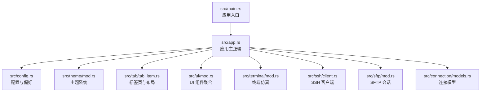
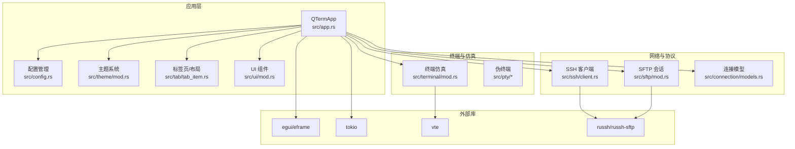
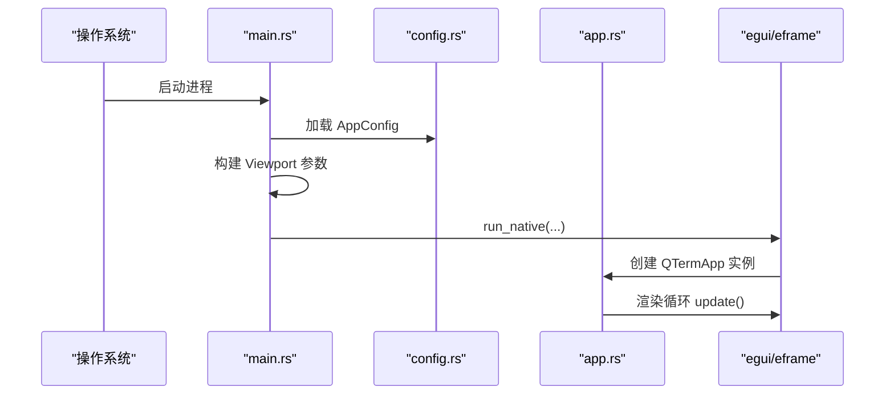
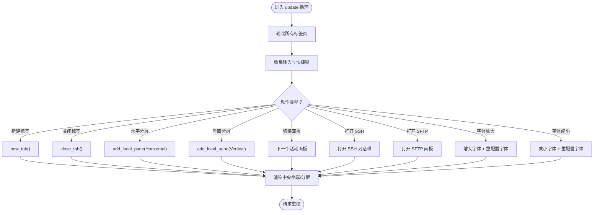
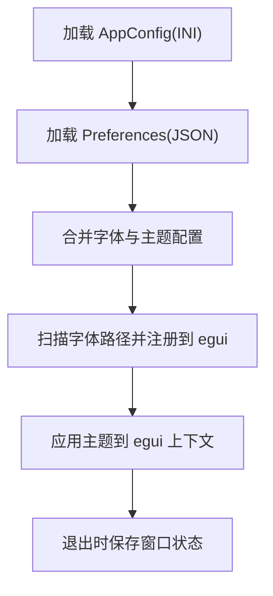
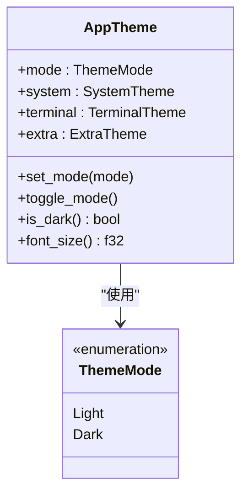
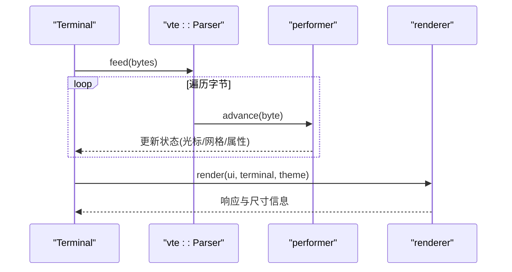
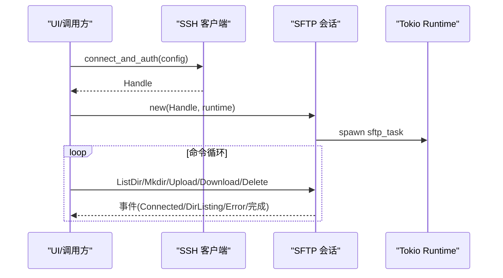
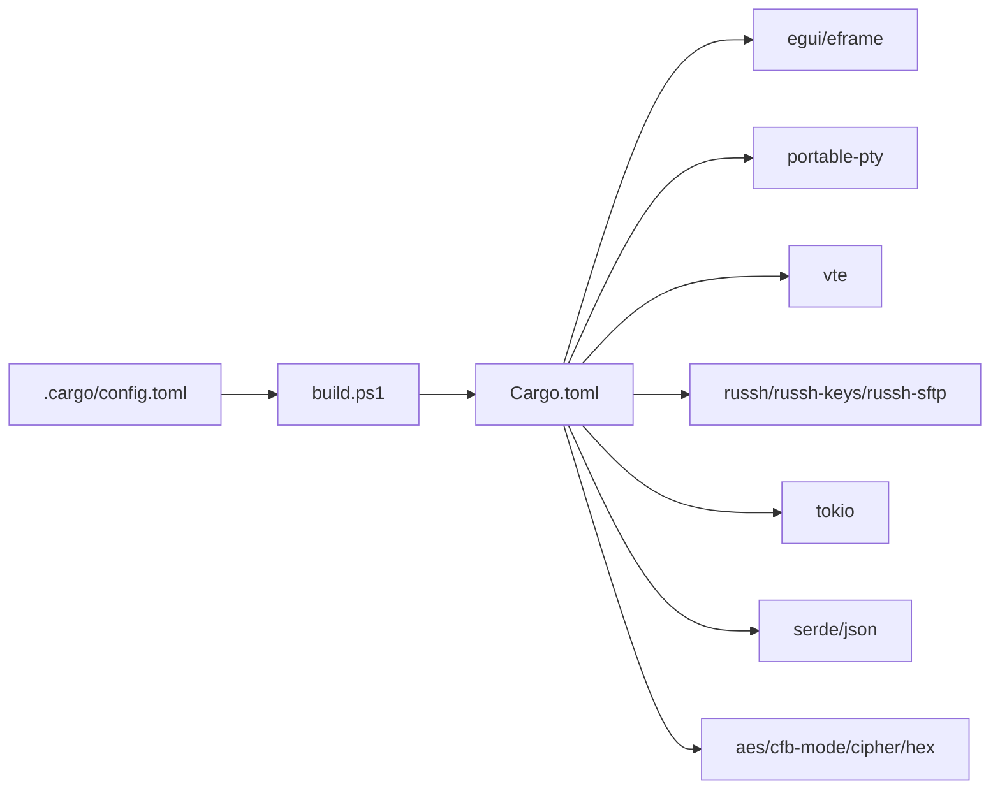

# 开发指南

<cite>
**本文引用的文件**
- [Cargo.toml](file://Cargo.toml)
- [main.rs](file://src/main.rs)
- [app.rs](file://src/app.rs)
- [config.rs](file://src/config.rs)
- [build.ps1](file://build.ps1)
- [.cargo/config.toml](file://.cargo/config.toml)
- [theme/mod.rs](file://src/theme/mod.rs)
- [ui/mod.rs](file://src/ui/mod.rs)
- [tab/tab_item.rs](file://src/tab/tab_item.rs)
- [connection/models.rs](file://src/connection/models.rs)
- [terminal/mod.rs](file://src/terminal/mod.rs)
- [ssh/client.rs](file://src/ssh/client.rs)
- [sftp/mod.rs](file://src/sftp/mod.rs)
- [whaleterm_主题.md](file://whaleterm_主题.md)
- [whaleterm_终端界面.md](file://whaleterm_终端界面.md)
</cite>

## 目录
1. [简介](#简介)
2. [项目结构](#项目结构)
3. [核心组件](#核心组件)
4. [架构总览](#架构总览)
5. [详细组件分析](#详细组件分析)
6. [依赖关系分析](#依赖关系分析)
7. [性能考量](#性能考量)
8. [故障排查指南](#故障排查指南)
9. [结论](#结论)
10. [附录](#附录)

## 简介
本指南面向希望参与 QTerm 项目开发的工程师，涵盖开发环境搭建、代码贡献流程、构建与发布、扩展开发、主题与 UI 组件扩展、测试与调试策略，以及常见问题与最佳实践。QTerm 是一个跨平台终端模拟器，基于 eframe/egui 构建图形界面，并通过 portable-pty 与 VTE 实现伪终端与 VT100 解析，同时集成 SSH/SFTP 能力。

## 项目结构
项目采用按功能域划分的模块化组织方式，核心模块包括应用入口、配置管理、主题系统、标签页与布局、终端仿真、UI 组件、连接与会话、SSH/SFTP 等。顶层脚本负责一键构建与运行。

图表来源
- [main.rs:1-87](file://src/main.rs#L1-L87)
- [app.rs:1-120](file://src/app.rs#L1-L120)
- [config.rs:1-127](file://src/config.rs#L1-L127)
- [theme/mod.rs:1-71](file://src/theme/mod.rs#L1-L71)
- [tab/tab_item.rs:1-40](file://src/tab/tab_item.rs#L1-L40)
- [ui/mod.rs:1-4](file://src/ui/mod.rs#L1-L4)
- [terminal/mod.rs:1-174](file://src/terminal/mod.rs#L1-L174)
- [ssh/client.rs:1-54](file://src/ssh/client.rs#L1-L54)
- [sftp/mod.rs:1-206](file://src/sftp/mod.rs#L1-L206)
- [connection/models.rs:1-41](file://src/connection/models.rs#L1-L41)

章节来源
- [main.rs:1-87](file://src/main.rs#L1-L87)
- [Cargo.toml:1-30](file://Cargo.toml#L1-L30)

## 核心组件
- 应用入口与窗口生命周期：负责加载配置、构建窗口参数、启动 eframe 渲染循环。
- 应用主逻辑：管理标签页、主题、字体、全局快捷键、窗口状态持久化。
- 配置与偏好：INI 配置文件与 WhaleTerm 偏好 JSON 的读取与合并。
- 主题系统：系统 UI、终端、笔记三套主题，支持亮/暗模式切换与扩展色。
- 终端仿真：基于 VTE 的解析器与网格渲染，支持选择、滚动、Alt 屏等。
- SSH/SFTP：异步客户端与通道封装，事件驱动的 SFTP 任务循环。
- UI 组件：分屏、SFTP 面板、SSH 对话框等模块化 UI。

章节来源
- [app.rs:1-120](file://src/app.rs#L1-L120)
- [config.rs:37-127](file://src/config.rs#L37-L127)
- [theme/mod.rs:13-62](file://src/theme/mod.rs#L13-L62)
- [terminal/mod.rs:22-174](file://src/terminal/mod.rs#L22-L174)
- [ssh/client.rs:1-54](file://src/ssh/client.rs#L1-L54)
- [sftp/mod.rs:7-96](file://src/sftp/mod.rs#L7-L96)

## 架构总览
QTerm 采用“应用主逻辑 + 模块化子系统”的分层架构。应用主逻辑协调各模块，egui 负责 UI 渲染，Tokio 运行时承载异步网络与 I/O，VTE 解析终端控制序列，russh/russh-sftp 提供安全远程能力。

图表来源
- [app.rs:1-120](file://src/app.rs#L1-L120)
- [terminal/mod.rs:1-174](file://src/terminal/mod.rs#L1-L174)
- [ssh/client.rs:1-54](file://src/ssh/client.rs#L1-L54)
- [sftp/mod.rs:1-206](file://src/sftp/mod.rs#L1-L206)
- [connection/models.rs:1-41](file://src/connection/models.rs#L1-L41)

## 详细组件分析

### 应用入口与窗口生命周期
- 加载配置并恢复窗口尺寸、位置、最大化状态。
- 根据平台检测窗口位置是否可见，避免出现在不可见显示器。
- 启动 eframe 渲染循环，创建应用实例。

图表来源
- [main.rs:51-87](file://src/main.rs#L51-L87)
- [config.rs:68-127](file://src/config.rs#L68-L127)
- [app.rs:60-93](file://src/app.rs#L60-L93)

章节来源
- [main.rs:17-87](file://src/main.rs#L17-L87)

### 应用主逻辑与全局交互
- 管理标签页、分屏、上下文菜单、全局快捷键。
- 动态字体加载与多字体族支持，跨平台字体路径查找。
- 窗口状态持久化（位置、尺寸、最大化、主题）。

图表来源
- [app.rs:240-529](file://src/app.rs#L240-L529)
- [app.rs:95-155](file://src/app.rs#L95-L155)

章节来源
- [app.rs:60-529](file://src/app.rs#L60-L529)

### 配置与偏好系统
- AppConfig：INI 文件存储窗口位置、尺寸、主题、字体大小、回滚行数、Shell 路径等。
- Preferences：从 WhaleTerm preferences.json 读取字体家族、大小、粗细与主题。
- 字体加载：收集所有字体族，跨平台查找字体文件，注入 egui 字体系统；提供系统回退字体。

图表来源
- [config.rs:68-127](file://src/config.rs#L68-L127)
- [config.rs:242-281](file://src/config.rs#L242-L281)
- [app.rs:95-155](file://src/app.rs#L95-L155)

章节来源
- [config.rs:1-281](file://src/config.rs#L1-L281)
- [app.rs:95-155](file://src/app.rs#L95-L155)

### 主题系统与扩展
- 主题模式：亮/暗模式切换，支持扩展色随模式动态选择。
- 系统主题：应用基础、侧边栏、状态栏、弹窗、表格、输入框等 UI 组件色彩。
- 终端主题：背景、前景、光标、选区、ANSI 16 色等。
- 扩展色：标签图标、连接状态、进度条、聊天等 UI 细节色彩。

图表来源
- [theme/mod.rs:7-62](file://src/theme/mod.rs#L7-L62)

章节来源
- [theme/mod.rs:1-71](file://src/theme/mod.rs#L1-L71)
- [whaleterm_主题.md:1-712](file://whaleterm_主题.md#L1-L712)

### 终端仿真与渲染
- 终端结构：网格、光标、选择、属性、VTE 解析器。
- 关键能力：滚动区域、Alt 屏、选择文本、单词/行范围、resize。
- 渲染：根据主题与字体计算行列数，绘制字符与选区。

图表来源
- [terminal/mod.rs:59-86](file://src/terminal/mod.rs#L59-L86)
- [terminal/mod.rs:121-173](file://src/terminal/mod.rs#L121-L173)

章节来源
- [terminal/mod.rs:1-174](file://src/terminal/mod.rs#L1-L174)

### SSH 客户端与 SFTP 会话
- SSH：russh 客户端，支持密码与私钥认证，密钥加载与校验。
- SFTP：基于 tokio 的事件循环，命令队列与事件广播，支持列出、上传、下载、创建目录、删除。

图表来源
- [ssh/client.rs:20-53](file://src/ssh/client.rs#L20-L53)
- [sftp/mod.rs:39-140](file://src/sftp/mod.rs#L39-L140)

章节来源
- [ssh/client.rs:1-54](file://src/ssh/client.rs#L1-L54)
- [sftp/mod.rs:1-206](file://src/sftp/mod.rs#L1-L206)

### UI 组件与扩展点
- UI 模块聚合：分屏、SFTP 面板、SSH 对话框。
- 新组件开发建议：遵循 egui 风格，使用主题系统颜色，提供配置项与状态持久化。
- 现有组件定制：通过主题与偏好调整字体、尺寸、颜色；通过配置文件扩展行为。

章节来源
- [ui/mod.rs:1-4](file://src/ui/mod.rs#L1-L4)

## 依赖关系分析
- Cargo.toml 定义了 eframe/egui、portable-pty、vte、russh 系列、tokio、serde 等核心依赖。
- .cargo/config.toml 在 Windows MSYS 环境下设置 LIBRARY_PATH，便于链接本地库。
- 构建脚本 build.ps1 支持 Debug/Release、清理与运行。

图表来源
- [Cargo.toml:8-30](file://Cargo.toml#L8-L30)
- [build.ps1:1-58](file://build.ps1#L1-L58)
- [.cargo/config.toml:1-3](file://.cargo/config.toml#L1-L3)

章节来源
- [Cargo.toml:1-30](file://Cargo.toml#L1-L30)
- [build.ps1:1-58](file://build.ps1#L1-L58)
- [.cargo/config.toml:1-3](file://.cargo/config.toml#L1-L3)

## 性能考量
- 发布配置优化：启用 LTO、符号裁剪、体积优化，适合分发。
- 渲染与布局：根据可用空间动态计算行列数，减少无效重绘；分屏时仅高亮活动面板边框。
- 终端滚动：区域滚动与整屏滚动分别处理，避免不必要的全表更新。
- 异步 I/O：SFTP 使用 tokio 通道与事件广播，避免阻塞 UI 线程。
- 字体加载：去重字体族，按需加载，避免重复注册。

章节来源
- [Cargo.toml:26-30](file://Cargo.toml#L26-L30)
- [app.rs:388-501](file://src/app.rs#L388-L501)
- [sftp/mod.rs:98-140](file://src/sftp/mod.rs#L98-L140)

## 故障排查指南
- 窗口位置异常：Windows 平台使用 MonitorFromRect 检测可见性，若配置位置不可见则忽略。
- 字体加载失败：检查字体文件是否存在与可读；回退到系统字体。
- SSH 认证失败：确认用户名、密码或私钥路径与口令正确；查看错误事件。
- SFTP 无法连接：检查 SSH 通道是否成功打开 SFTP 子系统；查看事件中的错误信息。
- 配置读取失败：INI/JSON 解析错误时回退默认配置；检查文件权限与格式。

章节来源
- [main.rs:17-47](file://src/main.rs#L17-L47)
- [config.rs:129-143](file://src/config.rs#L129-L143)
- [ssh/client.rs:30-53](file://src/ssh/client.rs#L30-L53)
- [sftp/mod.rs:104-125](file://src/sftp/mod.rs#L104-L125)

## 结论
QTerm 通过清晰的模块划分与稳定的外部库组合，实现了跨平台终端模拟器的核心能力。开发者可围绕主题系统、UI 组件、SSH/SFTP 能力进行扩展，同时遵循配置与字体加载的最佳实践，确保良好的用户体验与可维护性。

## 附录

### 开发环境搭建
- Rust 工具链
  - 安装：使用 rustup 安装最新稳定版。
  - 验证：运行 rustc --version。
- Windows 环境
  - MSYS2/MinGW：确保编译器与链接器可用。
  - .cargo/config.toml 中已设置 LIBRARY_PATH，确保链接本地库。
- IDE 配置
  - VS Code：推荐 rust-analyzer 插件，启用 clippy/lints。
  - IntelliJ/RustRover：启用内置 Rust 支持与 Cargo 集成。
- 调试环境
  - 使用 eframe 的调试视口命令与日志输出定位窗口与渲染问题。

章节来源
- [.cargo/config.toml:1-3](file://.cargo/config.toml#L1-L3)

### 代码贡献流程
- 分支策略：基于 main 分支创建特性分支，命名如 feature/xxx 或 fix/xxx。
- 提交规范：采用 Conventional Commits，示例 feat/fix/docs/chore(scope): message。
- 代码规范：遵循 Rustfmt 与 Clippy；模块内职责单一，公共 API 注释完整。
- Pull Request：PR 描述包含变更动机、改动范围、测试要点与风险提示；至少一名审阅者批准。

### 构建与发布
- 本地构建
  - PowerShell：.\build.ps1（Debug），.\build.ps1 -Release（Release），.\build.ps1 -BuildOnly（仅构建），.\build.ps1 -Clean（清理后构建）。
- Cargo 配置
  - 依赖版本与特性在 Cargo.toml 中统一管理；发布配置在 profile.release 中。
- 平台特定构建
  - Windows：MSYS/MinGW 链接；注意 LIBRARY_PATH 设置。
  - macOS/Linux：确保系统字体与库可用；必要时通过包管理器安装依赖。
- 发布自动化
  - 建议结合 CI（如 GitHub Actions）进行多平台构建与归档，使用 Cargo.toml 中的版本号作为发布标签。

章节来源
- [build.ps1:1-58](file://build.ps1#L1-L58)
- [Cargo.toml:26-30](file://Cargo.toml#L26-L30)

### 扩展开发指南
- 新功能开发
  - 在对应模块新增子模块，遵循现有文件组织；提供最小可运行示例与配置入口。
  - 与主题系统解耦，通过主题访问器获取颜色与尺寸。
- 插件系统
  - 当前未实现插件框架，建议通过配置文件与模块化导入扩展能力。
- 第三方集成
  - SSH/SFTP 已通过 russh/russh-sftp 集成；新增协议时参考现有异步事件模式与错误处理。

章节来源
- [ssh/client.rs:1-54](file://src/ssh/client.rs#L1-L54)
- [sftp/mod.rs:1-206](file://src/sftp/mod.rs#L1-L206)

### 主题开发指南
- 颜色系统
  - 使用主题系统提供的颜色键；扩展色随模式切换自动选择。
- 字体配置
  - 通过 Preferences 读取字体家族、大小与粗细；应用启动时注入 egui。
- 自定义主题创建
  - 参考 whaleterm_主题.md 的数据结构与默认值，创建自定义主题并持久化。

章节来源
- [theme/mod.rs:13-62](file://src/theme/mod.rs#L13-L62)
- [config.rs:206-281](file://src/config.rs#L206-L281)
- [whaleterm_主题.md:1-712](file://whaleterm_主题.md#L1-L712)

### UI 组件扩展
- 新组件开发
  - 使用 egui 布局与控件；遵循主题访问器；提供必要的配置项与状态持久化。
- 现有组件定制
  - 通过主题与偏好调整字体、尺寸与颜色；通过配置文件扩展行为。

章节来源
- [ui/mod.rs:1-4](file://src/ui/mod.rs#L1-L4)
- [app.rs:95-155](file://src/app.rs#L95-L155)

### 测试策略与调试技巧
- 单元测试
  - 对独立函数与结构体方法编写测试；重点覆盖配置解析、主题颜色转换、终端选择算法。
- 集成测试
  - 通过 eframe 的测试模式启动最小应用，验证 UI 布局与交互；对 SSH/SFTP 通过模拟或本地容器进行端到端验证。
- 性能分析
  - 使用火焰图工具定位渲染热点；关注字体加载与终端重绘频率。
- 调试技巧
  - 利用 eframe 的调试视口命令；在关键路径打印日志；对异步任务使用 tracing。

### 常见问题与最佳实践
- 窗口位置不可见：忽略配置位置，使用默认位置；确保最小尺寸满足可交互要求。
- 字体缺失：提供系统回退字体；避免重复注册相同字体。
- SSH 认证失败：优先检查用户名/密码/私钥；记录详细错误信息。
- SFTP 事件丢失：检查通道与事件广播；确保命令队列容量充足。
- 主题切换闪烁：在切换前预热字体与颜色，减少首次渲染抖动。