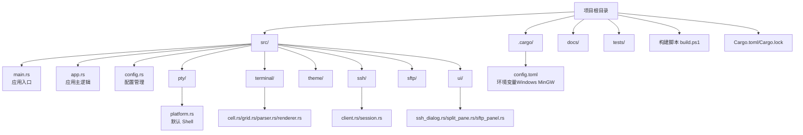
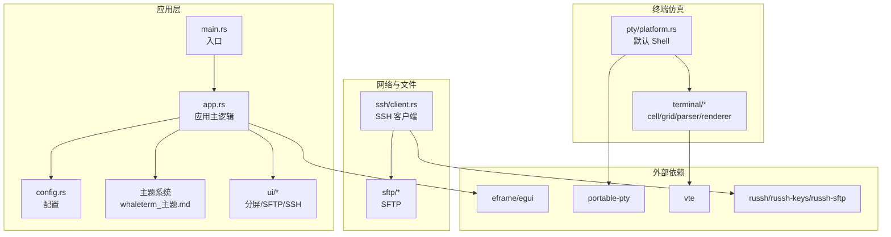
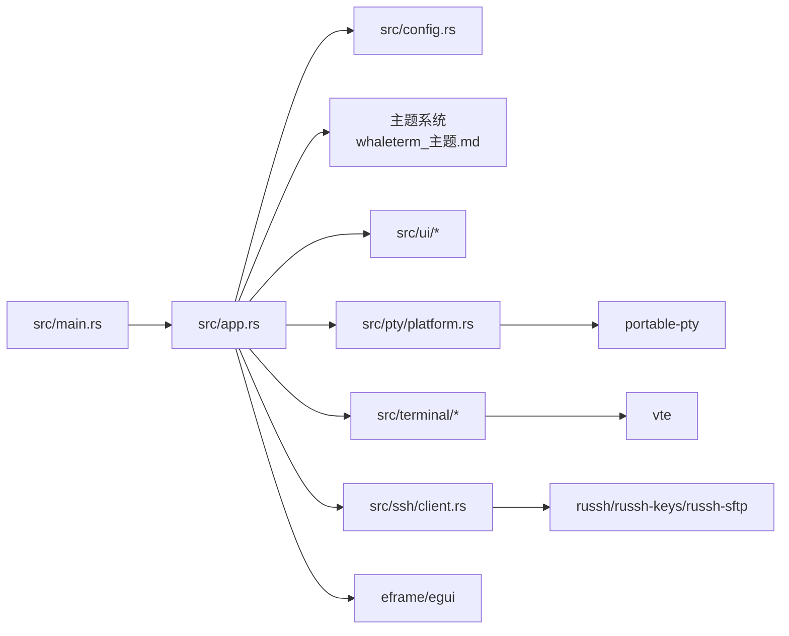

# 开发环境搭建

<cite>
**本文引用的文件**
- [Cargo.toml](file://Cargo.toml)
- [.cargo/config.toml](file://.cargo/config.toml)
- [build.ps1](file://build.ps1)
- [src/main.rs](file://src/main.rs)
- [src/app.rs](file://src/app.rs)
- [src/config.rs](file://src/config.rs)
- [src/pty/platform.rs](file://src/pty/platform.rs)
- [src/connection/models.rs](file://src/connection/models.rs)
- [src/ssh/client.rs](file://src/ssh/client.rs)
- [whaleterm_主题.md](file://whaleterm_主题.md)
- [whaleterm_终端界面.md](file://whaleterm_终端界面.md)
</cite>

## 目录
1. [简介](#简介)
2. [项目结构](#项目结构)
3. [核心组件](#核心组件)
4. [架构总览](#架构总览)
5. [详细组件分析](#详细组件分析)
6. [依赖关系分析](#依赖关系分析)
7. [性能考虑](#性能考虑)
8. [故障排查指南](#故障排查指南)
9. [结论](#结论)
10. [附录](#附录)

## 简介
本指南面向希望在本地搭建 QTerm 项目的开发者，涵盖 Rust 工具链安装与配置、IDE 配置（VS Code/IntelliJ IDEA）、跨平台编译环境设置（Windows/macOS/Linux）、调试与日志、Cargo 工具链使用以及常见问题排查。文档基于仓库中的实际配置与源码进行说明，帮助你快速建立一致且高效的开发环境。

## 项目结构
QTerm 是一个基于 eframe/egui 的跨平台终端模拟器，采用模块化组织，核心模块包括应用入口、配置、PTY、终端渲染、主题、SSH/SFTP、UI 界面等。项目根目录包含 Cargo 配置、构建脚本与文档资源。

图表来源
- [Cargo.toml](file://Cargo.toml)
- [.cargo/config.toml](file://.cargo/config.toml)
- [src/main.rs](file://src/main.rs)
- [src/app.rs](file://src/app.rs)
- [src/config.rs](file://src/config.rs)
- [src/pty/platform.rs](file://src/pty/platform.rs)
- [src/ssh/client.rs](file://src/ssh/client.rs)

章节来源
- [Cargo.toml](file://Cargo.toml)
- [.cargo/config.toml](file://.cargo/config.toml)
- [src/main.rs](file://src/main.rs)
- [src/app.rs](file://src/app.rs)
- [src/config.rs](file://src/config.rs)
- [src/pty/platform.rs](file://src/pty/platform.rs)
- [src/ssh/client.rs](file://src/ssh/client.rs)

## 核心组件
- 应用入口与窗口构建：负责加载配置、构建窗口视口、启动 eframe 渲染循环。
- 应用主逻辑：管理标签页、主题、字体、窗口状态、快捷键与 UI 渲染。
- 配置管理：读写应用配置与 WhaleTerm 偏好设置，支持跨平台配置目录。
- PTY 与 Shell：跨平台获取默认 Shell，支持本地终端。
- SSH/SFTP：基于 russh/russh-keys/russh-sftp 实现连接与文件传输。
- 主题系统：定义系统主题、终端主题与笔记主题，支持亮/暗模式与扩展色。
- UI 组件：分屏、SFTP 面板、SSH 对话框等。

章节来源
- [src/main.rs](file://src/main.rs)
- [src/app.rs](file://src/app.rs)
- [src/config.rs](file://src/config.rs)
- [src/pty/platform.rs](file://src/pty/platform.rs)
- [src/connection/models.rs](file://src/connection/models.rs)
- [src/ssh/client.rs](file://src/ssh/client.rs)
- [whaleterm_主题.md](file://whaleterm_主题.md)
- [whaleterm_终端界面.md](file://whaleterm_终端界面.md)

## 架构总览
QTerm 采用 eframe/egui 作为 UI 框架，结合 portable-pty/vte 实现本地终端仿真，russh/russh-keys/russh-sftp 提供 SSH/SFTP 能力。应用通过配置模块读取 WhaleTerm 偏好设置，主题模块提供跨组件的颜色与样式。

图表来源
- [src/main.rs](file://src/main.rs)
- [src/app.rs](file://src/app.rs)
- [src/config.rs](file://src/config.rs)
- [src/pty/platform.rs](file://src/pty/platform.rs)
- [src/ssh/client.rs](file://src/ssh/client.rs)
- [whaleterm_主题.md](file://whaleterm_主题.md)

## 详细组件分析

### Rust 工具链与版本管理
- 使用 rustup 安装与管理工具链，建议安装稳定版（edition 与依赖版本在 Cargo.toml 中已明确）。
- 项目使用 2021 edition，确保工具链版本满足依赖要求。
- 版本管理可通过 rustup 默认通道与目标工具链切换（如需要交叉编译）。

章节来源
- [Cargo.toml](file://Cargo.toml)

### 目标平台与跨平台编译
- Windows：通过 .cargo/config.toml 设置 LIBRARY_PATH 指向 MSYS2 MinGW 库路径，便于链接本地依赖。
- macOS/Linux：默认使用系统库与包管理器提供的依赖；如需静态链接或交叉编译，可配置 rustflags 或使用 musl 工具链。
- 平台分支：源码中多处使用 cfg(target_os) 与 cfg(windows) 进行平台差异化处理（窗口位置检测、字体回退、Shell 默认值等）。

章节来源
- [.cargo/config.toml](file://.cargo/config.toml)
- [src/main.rs](file://src/main.rs)
- [src/app.rs](file://src/app.rs)
- [src/pty/platform.rs](file://src/pty/platform.rs)

### IDE 配置（VS Code 与 IntelliJ IDEA）

#### VS Code
- 插件推荐
  - Rust (rls/ra)：提供语法、补全、跳转、重构与诊断。
  - Even Better TOML：增强 Cargo.toml 与 .toml 文件支持。
  - rust-analyzer：现代、高性能的 Rust 语言服务器。
  - egui/eframe 相关：若使用 egui/eframe，可安装 egui 相关扩展以提升体验。
- 设置要点
  - 使用 rust-analyzer 作为语言服务器。
  - 在工作区设置中启用“cargo-watch”或“cargo-run”的任务集成。
  - 为 build.ps1 配置任务，便于一键构建与运行。
- 任务与调试
  - 使用 tasks.json 配置 cargo build/run，或直接调用 build.ps1。
  - 使用 launch.json 配置调试目标（例如运行 target/debug/qterm）。

#### IntelliJ IDEA（Rust 插件）
- 插件推荐
  - Rust：提供完整的 Rust 开发体验（语法、测试、Cargo、调试）。
- 设置要点
  - 选择正确的 Rust 工具链（rustup）。
  - 启用 Cargo 集成，自动同步依赖。
  - 配置运行/调试配置，指向目标二进制（target/debug/qterm）。
- 注意事项
  - 若使用 egui/eframe，IDEA 可能需要额外的 UI 插件或通过外部工具运行。

章节来源
- [build.ps1](file://build.ps1)
- [Cargo.toml](file://Cargo.toml)

### 跨平台编译环境设置

#### Windows
- MinGW/MSYS2：通过 .cargo/config.toml 指定 LIBRARY_PATH，确保链接 MinGW 库。
- PowerShell：使用 build.ps1 进行构建与运行，支持 Debug/Release/Clean/BuildOnly 模式。
- 默认 Shell：Windows 下优先使用 COMSPEC，否则回退到 powershell.exe。

章节来源
- [.cargo/config.toml](file://.cargo/config.toml)
- [build.ps1](file://build.ps1)
- [src/pty/platform.rs](file://src/pty/platform.rs)

#### macOS
- 默认 Shell：优先使用 SHELL 环境变量，否则回退到 /bin/zsh。
- 字体回退：针对 macOS 使用系统字体路径（/System/Library/Fonts/ 等）。
- 依赖：通过 Homebrew 或系统库提供依赖；如需静态链接，可配置工具链。

章节来源
- [src/pty/platform.rs](file://src/pty/platform.rs)
- [src/app.rs](file://src/app.rs)

#### Linux
- 默认 Shell：优先使用 SHELL 环境变量，否则回退到 /bin/bash。
- 字体回退：针对 Linux 使用 /usr/share/fonts/ 等路径。
- 依赖：通过发行版包管理器安装依赖；如需静态链接，可配置 musl 工具链。

章节来源
- [src/pty/platform.rs](file://src/pty/platform.rs)
- [src/app.rs](file://src/app.rs)

### 调试环境配置

#### 断点调试
- VS Code：在 main.rs 或 app.rs 中设置断点，使用 launch.json 启动调试。
- IntelliJ IDEA：在目标二进制上设置断点，使用 Cargo Run/Debug 配置。
- 建议断点位置
  - main 函数入口与 eframe::run_native 调用前后。
  - 应用主逻辑 update 中的关键路径（标签页切换、分屏、SSH 对话框）。

#### 日志输出
- 标准输出：使用 eprintln! 或 println! 输出调试信息。
- 日志库：可引入 env_logger 或 tracing 以获得更丰富的日志能力。
- 注意：在生产构建中可使用 release profile（优化、LTO、strip）减少体积。

章节来源
- [src/main.rs](file://src/main.rs)
- [src/app.rs](file://src/app.rs)
- [Cargo.toml](file://Cargo.toml)

### Cargo 工具链使用

#### 依赖管理
- 依赖声明集中在 Cargo.toml，包含 eframe/egui、portable-pty、vte、russh 系列、tokio、serde 等。
- 版本锁定：使用 Cargo.lock 确保团队一致性。

#### 构建配置
- Debug/Release：Debug 适合开发调试，Release 使用 opt-level = "z"、lto = true、strip = true 优化体积与性能。
- 构建脚本：build.ps1 支持 Debug/Release/Clean/BuildOnly，便于快速迭代。

#### 发布准备
- Release 构建：确保依赖齐全、无调试符号残留（strip）。
- 产物路径：target/release/qterm.exe（Windows）或其他平台对应二进制。

章节来源
- [Cargo.toml](file://Cargo.toml)
- [build.ps1](file://build.ps1)

### 主题与 UI 设计
- 主题系统：定义系统主题、终端主题与笔记主题，支持亮/暗模式与扩展色。
- UI 规范：标题栏、侧边栏、状态栏、分屏布局、右键菜单等均有详细规范。
- 字体与回退：跨平台字体路径与回退策略，确保在不同系统上显示一致。

章节来源
- [whaleterm_主题.md](file://whaleterm_主题.md)
- [whaleterm_终端界面.md](file://whaleterm_终端界面.md)
- [src/app.rs](file://src/app.rs)

### SSH/SFTP 能力
- SSH 客户端：基于 russh，支持密码与私钥认证，自动接受服务器密钥（开发阶段）。
- SFTP：基于 russh-sftp，用于文件传输与面板展示。
- 连接模型：从 WhaleTerm connections.json 读取连接配置，解密密码并注入到连接结构体。

章节来源
- [src/ssh/client.rs](file://src/ssh/client.rs)
- [src/connection/models.rs](file://src/connection/models.rs)

## 依赖关系分析

图表来源
- [src/main.rs](file://src/main.rs)
- [src/app.rs](file://src/app.rs)
- [src/config.rs](file://src/config.rs)
- [src/pty/platform.rs](file://src/pty/platform.rs)
- [src/ssh/client.rs](file://src/ssh/client.rs)
- [whaleterm_主题.md](file://whaleterm_主题.md)

章节来源
- [src/main.rs](file://src/main.rs)
- [src/app.rs](file://src/app.rs)
- [src/config.rs](file://src/config.rs)
- [src/pty/platform.rs](file://src/pty/platform.rs)
- [src/ssh/client.rs](file://src/ssh/client.rs)
- [whaleterm_主题.md](file://whaleterm_主题.md)

## 性能考虑
- Release 构建：启用 opt-level = "z"、lto = true、strip = true，减小体积并提升运行效率。
- 异步运行时：Tokio 使用多线程运行时，适合 I/O 密集型场景（SSH/SFTP/PTY）。
- 终端渲染：VTE 与 egui 渲染管线需关注帧率与重绘频率，避免不必要的重绘。
- 字体与回退：跨平台字体回退可能带来额外 IO，建议缓存字体路径与定义。

章节来源
- [Cargo.toml](file://Cargo.toml)
- [src/app.rs](file://src/app.rs)

## 故障排查指南

- 构建失败（Windows）
  - 症状：链接错误或找不到 MinGW 库。
  - 处理：检查 .cargo/config.toml 中 LIBRARY_PATH 是否正确指向 MSYS2 MinGW 库。
  - 参考：[环境变量配置](file://.cargo/config.toml)

- 默认 Shell 无法识别（Windows）
  - 症状：无法启动本地终端。
  - 处理：确认 COMSPEC 环境变量或回退到 powershell.exe。
  - 参考：[默认 Shell 获取](file://src/pty/platform.rs)

- 字体显示异常（跨平台）
  - 症状：字体缺失或显示异常。
  - 处理：检查系统字体路径与回退策略，确保字体文件存在。
  - 参考：[字体回退与路径](file://src/app.rs)

- SSH 认证失败
  - 症状：认证报错或密钥加载失败。
  - 处理：检查密码/私钥配置、密钥格式与口令；确认服务器密钥接受策略。
  - 参考：[SSH 客户端实现](file://src/ssh/client.rs)

- 配置读取失败
  - 症状：配置文件不存在或解析失败。
  - 处理：确认配置目录与文件权限，检查 INI/JSON 格式。
  - 参考：[配置读写](file://src/config.rs)

- 构建脚本使用
  - 症状：脚本执行失败或路径错误。
  - 处理：使用 build.ps1 的参数模式（-Release/-BuildOnly/-Clean）进行调试。
  - 参考：[构建脚本](file://build.ps1)

章节来源
- [.cargo/config.toml](file://.cargo/config.toml)
- [src/pty/platform.rs](file://src/pty/platform.rs)
- [src/app.rs](file://src/app.rs)
- [src/ssh/client.rs](file://src/ssh/client.rs)
- [src/config.rs](file://src/config.rs)
- [build.ps1](file://build.ps1)

## 结论
通过本指南，你可以完成 QTerm 的 Rust 工具链安装、IDE 配置、跨平台编译环境设置、调试与日志、Cargo 工具链使用以及常见问题排查。建议在开发过程中遵循项目中的平台分支与配置约定，确保在 Windows/macOS/Linux 上的一致体验。

## 附录

### 常用命令与任务
- 使用 build.ps1 快速构建与运行：
  - Debug：.\build.ps1
  - Release：.\build.ps1 -Release
  - 仅构建：.\build.ps1 -BuildOnly
  - 清理后构建：.\build.ps1 -Clean
- Cargo 常用命令：
  - cargo build / cargo run / cargo test / cargo doc
  - cargo build --release
  - cargo clean
- VS Code 任务与调试：
  - tasks.json 配置 cargo build/run
  - launch.json 配置调试目标（target/debug/qterm）

章节来源
- [build.ps1](file://build.ps1)
- [Cargo.toml](file://Cargo.toml)