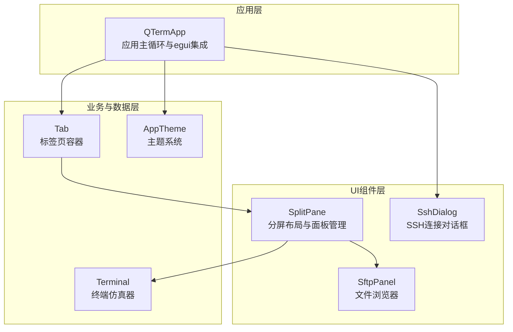
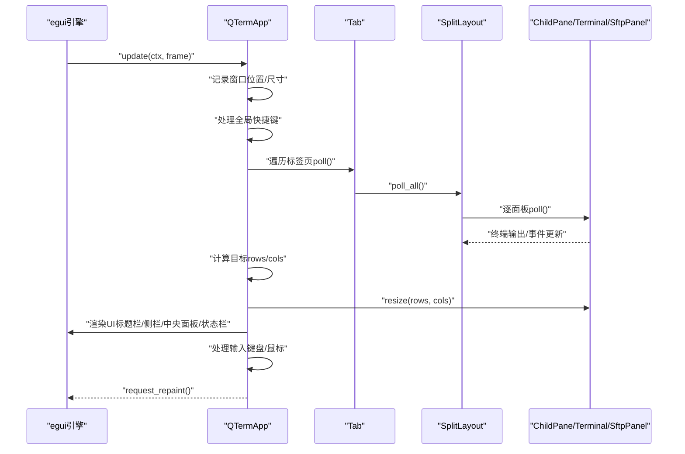
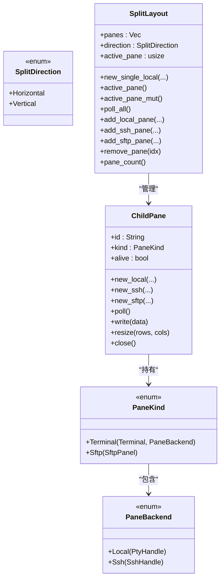
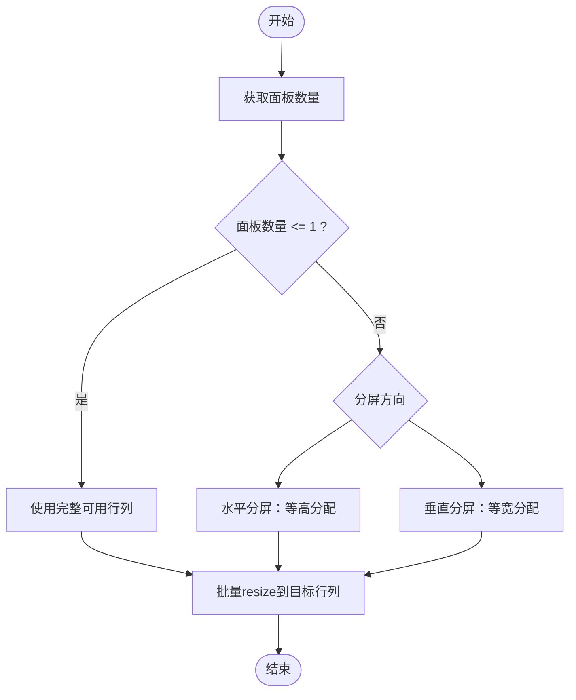
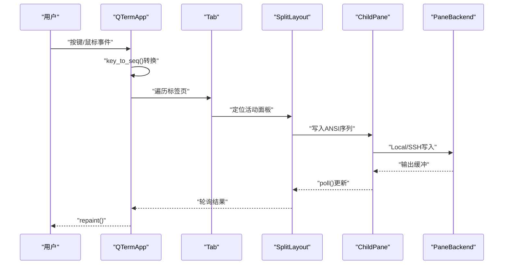
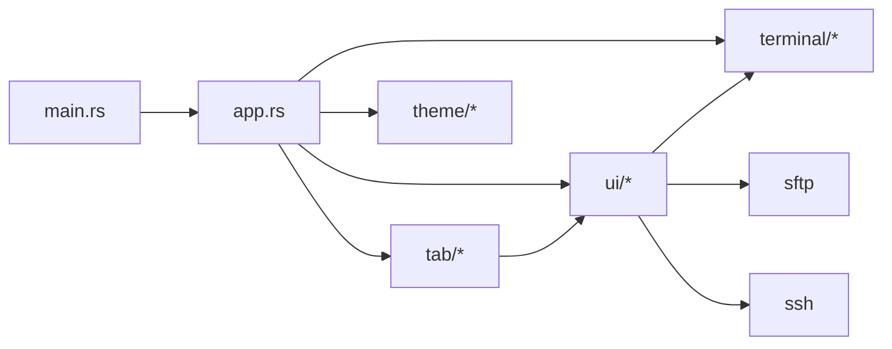

# UI组件扩展

<cite>
**本文引用的文件**
- [src/ui/mod.rs](file://src/ui/mod.rs)
- [src/ui/split_pane.rs](file://src/ui/split_pane.rs)
- [src/ui/sftp_panel.rs](file://src/ui/sftp_panel.rs)
- [src/ui/ssh_dialog.rs](file://src/ui/ssh_dialog.rs)
- [src/tab/mod.rs](file://src/tab/mod.rs)
- [src/tab/tab_item.rs](file://src/tab/tab_item.rs)
- [src/app.rs](file://src/app.rs)
- [src/terminal/renderer.rs](file://src/terminal/renderer.rs)
- [src/terminal/mod.rs](file://src/terminal/mod.rs)
- [src/theme/mod.rs](file://src/theme/mod.rs)
- [src/main.rs](file://src/main.rs)
- [Cargo.toml](file://Cargo.toml)
</cite>

## 目录
1. [简介](#简介)
2. [项目结构](#项目结构)
3. [核心组件](#核心组件)
4. [架构总览](#架构总览)
5. [组件详解](#组件详解)
6. [依赖关系分析](#依赖关系分析)
7. [性能考量](#性能考量)
8. [故障排查指南](#故障排查指南)
9. [结论](#结论)
10. [附录](#附录)

## 简介
本指南面向希望在QTerm中扩展UI组件的开发者，围绕以下目标展开：
- 设计与实现新的UI组件的架构原则、生命周期与事件处理机制
- 深入解析SplitPane组件的扩展方法，包括分屏布局算法、面板管理与用户交互
- 提供可复用UI组件的创建范式，结合egui框架进行集成与状态管理
- 扩展现有标签页系统，包括TabItem的扩展与自定义标签页行为
- UI组件的响应式设计原则：布局适配、尺寸调整与屏幕密度处理
- 组件测试与调试最佳实践：单元测试与可视化调试技巧

## 项目结构
QTerm采用模块化组织，UI相关组件集中在ui子模块，标签页与应用主循环位于tab与app模块，终端渲染与主题系统分别在terminal与theme模块。

图表来源
- [src/app.rs:18-36](file://src/app.rs#L18-L36)
- [src/ui/mod.rs:1-3](file://src/ui/mod.rs#L1-L3)
- [src/tab/mod.rs:1-3](file://src/tab/mod.rs#L1-L3)
- [src/terminal/mod.rs:24-41](file://src/terminal/mod.rs#L24-L41)
- [src/theme/mod.rs:14-21](file://src/theme/mod.rs#L14-L21)

章节来源
- [src/ui/mod.rs:1-3](file://src/ui/mod.rs#L1-L3)
- [src/tab/mod.rs:1-3](file://src/tab/mod.rs#L1-L3)
- [src/app.rs:18-36](file://src/app.rs#L18-L36)

## 核心组件
- SplitPane与SplitLayout：负责多面板分屏布局、活动面板切换、面板生命周期与轮询
- Tab：封装SplitLayout，统一标签页标题、轮询与存活状态
- SftpPanel：双栏文件浏览器，支持上传/下载与目录导航
- SshDialog：弹窗表单，收集SSH连接参数并生成配置
- QTermApp：egui应用主循环，整合窗口、菜单、输入处理与渲染

章节来源
- [src/ui/split_pane.rs:25-157](file://src/ui/split_pane.rs#L25-L157)
- [src/tab/tab_item.rs:3-48](file://src/tab/tab_item.rs#L3-L48)
- [src/ui/sftp_panel.rs:12-25](file://src/ui/sftp_panel.rs#L12-L25)
- [src/ui/ssh_dialog.rs:11-24](file://src/ui/ssh_dialog.rs#L11-L24)
- [src/app.rs:16-36](file://src/app.rs#L16-L36)

## 架构总览
QTerm基于eframe/egui构建，应用主循环在QTermApp.update中驱动：
- 轮询所有标签页，读取终端输出与SFTP事件
- 根据窗口尺寸与分屏方向计算目标行列数并批量调整面板大小
- 渲染标题栏、左侧面板、中央终端区域与底部状态栏
- 处理全局快捷键与用户输入（键盘/鼠标），转发至活动面板
- 通过主题系统与字体配置实现响应式外观

图表来源
- [src/app.rs:284-575](file://src/app.rs#L284-L575)
- [src/tab/tab_item.rs:23-35](file://src/tab/tab_item.rs#L23-L35)
- [src/ui/split_pane.rs:180-185](file://src/ui/split_pane.rs#L180-L185)

章节来源
- [src/app.rs:284-575](file://src/app.rs#L284-L575)

## 组件详解

### SplitPane组件扩展指南
SplitPane的核心职责是管理多个子面板（最多6个），支持水平/垂直分屏、活动面板切换、面板增删与生命周期管理。扩展思路如下：

- 面板类型与后端抽象
  - PaneKind：Terminal与Sftp两种内容类型
  - PaneBackend：Local（PTY）与Ssh两种后端
  - ChildPane：封装面板ID、内容、存活状态与生命周期方法（poll/write/resize/close）

- 分屏布局算法
  - 根据分屏方向与面板数量，计算每个面板的目标行列数
  - 水平分屏：等高分配；垂直分屏：等宽分配
  - 尺寸变化时批量调用resize同步到各面板后端

- 面板管理与用户交互
  - 增删面板：add_local_pane/add_ssh_pane/add_sftp_pane/remove_pane
  - 活动面板：active_pane/active_pane_mut，配合快捷键切换
  - 轮询：poll_all统一拉取终端输出与SFTP事件，检查存活状态

- 生命周期与事件处理
  - poll：根据后端类型读取输出、发送ANSI待回复、检测存活
  - write/resize/close：委托到具体后端
  - 标题更新：从终端OSC标题动态刷新标签页标题

图表来源
- [src/ui/split_pane.rs:6-157](file://src/ui/split_pane.rs#L6-L157)

章节来源
- [src/ui/split_pane.rs:25-238](file://src/ui/split_pane.rs#L25-L238)

#### 分屏布局算法流程

图表来源
- [src/app.rs:436-456](file://src/app.rs#L436-L456)

章节来源
- [src/app.rs:436-456](file://src/app.rs#L436-L456)

#### 用户交互处理（键盘/鼠标）
- 全局快捷键映射：新建标签页、关闭标签页、切换标签页、分屏、切换面板、关闭面板、打开SSH对话框、打开SFTP、切换左侧面板、字体缩放
- 输入转发：将按键转换为ANSI序列写入后端；粘贴请求通过viewport命令处理
- 鼠标交互：终端渲染返回响应对象，PendingMouse用于拖拽选择、双击选词等

图表来源
- [src/app.rs:1400-1425](file://src/app.rs#L1400-L1425)
- [src/app.rs:302-393](file://src/app.rs#L302-L393)

章节来源
- [src/app.rs:302-393](file://src/app.rs#L302-L393)
- [src/app.rs:1400-1465](file://src/app.rs#L1400-L1465)

### 标签页系统扩展（TabItem）
- 标签页容器：Tab封装SplitLayout，提供新建、轮询、存活检查与关闭
- 标题更新：从活动面板的终端OSC标题动态刷新
- 生命周期：关闭时逐面板关闭，确保资源释放

扩展建议：
- 自定义标签页行为：可在Tab中增加自定义字段（如最近活动时间、自定义图标）与行为（如右键菜单、双击重命名）
- 多标签页策略：根据pane_count与direction决定渲染样式（例如超过一定数量时自动折叠为树状）

章节来源
- [src/tab/tab_item.rs:3-48](file://src/tab/tab_item.rs#L3-L48)

### SFTP面板扩展（SftpPanel）
- 双栏布局：本地与远程文件列表，支持目录导航、上传/下载、状态反馈
- 事件驱动：轮询SFTP事件，连接成功后列出目录，操作完成后刷新状态
- 交互细节：双击进入子目录，启用/禁用按钮根据选中项状态动态变化

扩展建议：
- 增加过滤器：按文件名、类型、大小范围筛选
- 增加进度条：结合主题系统显示上传/下载进度
- 自定义列：可扩展为更多列（权限、修改时间、大小等）

章节来源
- [src/ui/sftp_panel.rs:12-357](file://src/ui/sftp_panel.rs#L12-L357)

### SSH对话框扩展（SshDialog）
- 表单字段：主机、端口、用户名、认证方式（密码/私钥）
- 结果传递：生成SshConfig并通过result传递给主逻辑
- 错误状态：显示连接失败原因

扩展建议：
- 历史连接：下拉选择常用连接
- 自动补全：主机与用户名历史
- 高级选项：超时、编码、代理等

章节来源
- [src/ui/ssh_dialog.rs:11-147](file://src/ui/ssh_dialog.rs#L11-L147)

### 终端渲染与响应式设计
- 终端尺寸计算：根据字体度量计算cell_width/cell_height与可容纳行列数
- 渲染优化：按颜色分段绘制文本，减少绘制调用
- 选区与光标：绘制选区背景与光标方块，支持反色模式
- 响应式适配：窗口尺寸变化时重新计算rows/cols并批量resize

章节来源
- [src/terminal/renderer.rs:25-180](file://src/terminal/renderer.rs#L25-L180)
- [src/app.rs:436-456](file://src/app.rs#L436-L456)

### egui集成与主题系统
- 字体配置：加载用户字体与系统回退字体，支持CJK与等宽
- 主题切换：浅色/深色模式切换，应用到egui上下文
- UI常量：标题栏高度、侧栏宽度、左侧面板宽度等

章节来源
- [src/app.rs:108-171](file://src/app.rs#L108-L171)
- [src/theme/mod.rs:14-71](file://src/theme/mod.rs#L14-L71)

## 依赖关系分析
- 外部依赖：eframe/egui、vte、portable-pty、russh系列、tokio、uuid
- 内部模块：ui、tab、terminal、theme、app、main

图表来源
- [src/main.rs:15-86](file://src/main.rs#L15-L86)
- [src/app.rs:1-10](file://src/app.rs#L1-L10)
- [Cargo.toml:8-25](file://Cargo.toml#L8-L25)

章节来源
- [Cargo.toml:8-25](file://Cargo.toml#L8-L25)

## 性能考量
- 终端渲染优化：按颜色分段绘制文本，避免逐字符绘制
- 批量尺寸调整：窗口变化时一次性resize所有面板，减少后端调用
- 事件驱动：面板poll与SFTP事件轮询，避免阻塞主线程
- 字体与主题：预加载字体与主题，减少运行时开销

## 故障排查指南
- 终端无输出
  - 检查ChildPane.poll是否正确读取后端输出
  - 确认后端alive状态与is_alive检查
- 面板无法关闭
  - 确认close调用链路：Tab.close → SplitLayout.remove_pane → ChildPane.close
- SFTP异常
  - 查看SftpPanel.poll中事件分支与status状态
  - 确认连接状态connected与pending_list标志
- 字体显示异常
  - 检查configure_fonts是否正确加载用户字体与回退字体
- 快捷键无效
  - 核对Action枚举与快捷键映射，确认Modifier组合

章节来源
- [src/ui/split_pane.rs:70-148](file://src/ui/split_pane.rs#L70-L148)
- [src/ui/sftp_panel.rs:51-110](file://src/ui/sftp_panel.rs#L51-L110)
- [src/app.rs:108-171](file://src/app.rs#L108-L171)
- [src/app.rs:302-393](file://src/app.rs#L302-L393)

## 结论
QTerm的UI组件体系以SplitLayout为核心，通过ChildPane抽象统一了本地与远程终端以及SFTP面板的生命周期与交互。结合egui的响应式渲染与主题系统，实现了良好的跨平台体验。扩展新组件时，建议遵循：
- 明确组件职责与边界，复用现有抽象（如ChildPane/PaneKind）
- 采用事件驱动与轮询机制，保证UI流畅
- 严格管理生命周期，确保资源释放
- 注重响应式设计与性能优化

## 附录

### 创建可复用UI组件的步骤
- 定义组件状态与生命周期方法（如poll/show/close）
- 与egui集成：使用allocate_painter/响应对象，返回必要的交互参数
- 状态管理：通过父组件或共享状态传递配置与主题
- 事件处理：将用户输入转换为内部消息或直接写入后端

章节来源
- [src/ui/sftp_panel.rs:112-152](file://src/ui/sftp_panel.rs#L112-L152)
- [src/terminal/renderer.rs:42-180](file://src/terminal/renderer.rs#L42-L180)

### 组件测试与调试最佳实践
- 单元测试
  - 面向接口测试：对SplitLayout与ChildPane的关键方法（add/remove/poll/resize）编写断言
  - 状态断言：验证alive、title、pane_count等状态一致性
- 集成测试
  - 通过QTermApp的update循环模拟输入与渲染，观察UI行为
- 可视化调试
  - 使用egui的调试工具查看控件层级与交互响应
  - 在渲染函数中临时添加占位文本或颜色，快速定位布局问题