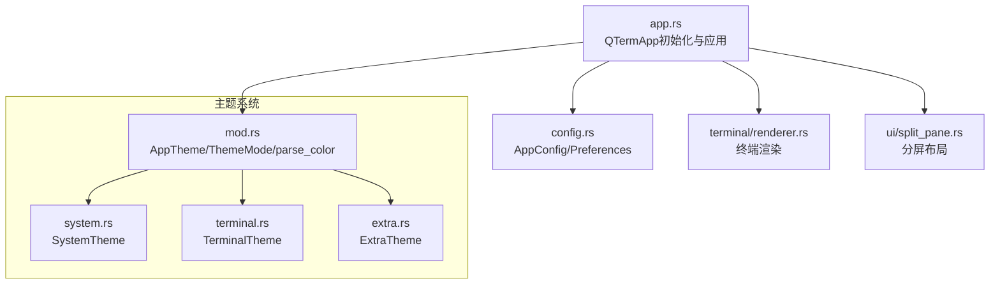
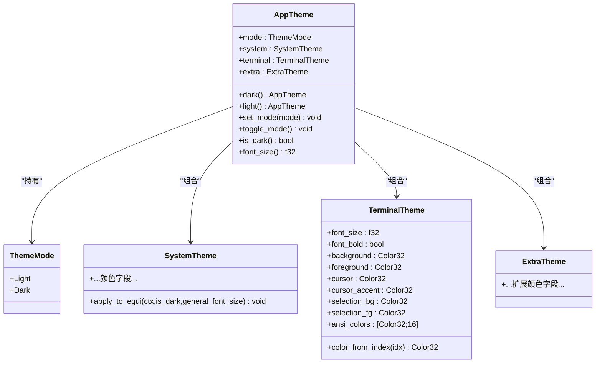
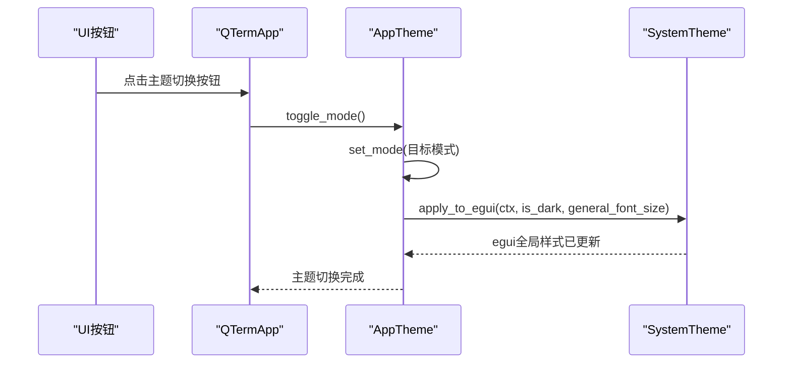
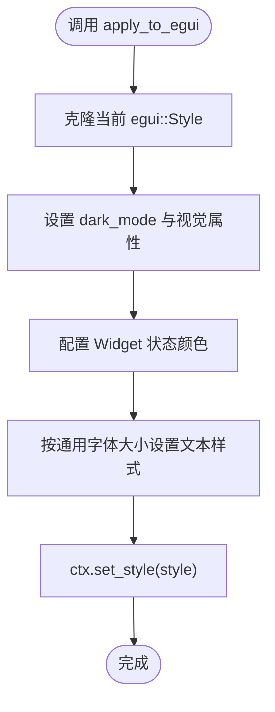
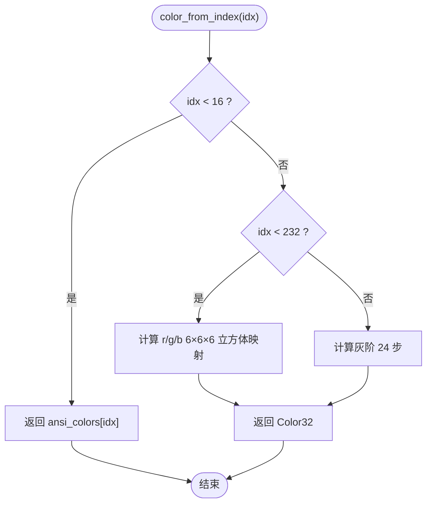
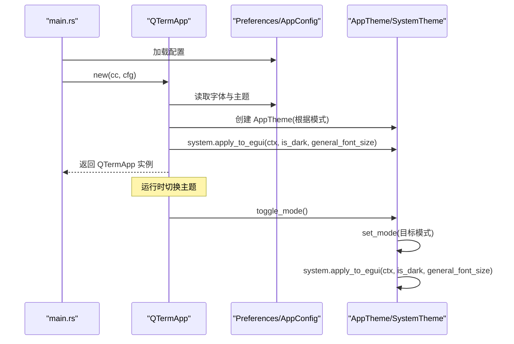
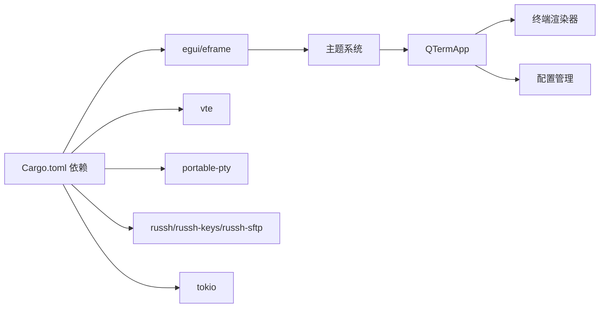

# 主题系统扩展

<cite>
**本文档引用的文件**
- [src/theme/mod.rs](file://src/theme/mod.rs)
- [src/theme/system.rs](file://src/theme/system.rs)
- [src/theme/terminal.rs](file://src/theme/terminal.rs)
- [src/theme/extra.rs](file://src/theme/extra.rs)
- [src/app.rs](file://src/app.rs)
- [src/config.rs](file://src/config.rs)
- [src/terminal/renderer.rs](file://src/terminal/renderer.rs)
- [src/ui/split_pane.rs](file://src/ui/split_pane.rs)
- [src/main.rs](file://src/main.rs)
- [Cargo.toml](file://Cargo.toml)
- [whaleterm_主题.md](file://whaleterm_主题.md)
</cite>

## 目录
1. [简介](#简介)
2. [项目结构](#项目结构)
3. [核心组件](#核心组件)
4. [架构总览](#架构总览)
5. [详细组件分析](#详细组件分析)
6. [依赖关系分析](#依赖关系分析)
7. [性能考量](#性能考量)
8. [故障排查指南](#故障排查指南)
9. [结论](#结论)
10. [附录](#附录)

## 简介
本文件面向希望扩展QTerm主题系统的开发者，系统性阐述AppTheme结构体的设计原理、ThemeMode枚举、SystemTheme、TerminalTheme与ExtraTheme的组合模式；详解如何创建自定义主题（颜色系统、字体配置、主题切换机制）；给出扩展现有主题系统的具体步骤与最佳实践，包括与egui框架的交互、颜色空间转换以及可访问性与性能优化建议。

## 项目结构
主题系统位于src/theme目录，采用模块化组织：
- mod.rs：主题聚合与公共工具（ThemeMode、AppTheme、parse_color）
- system.rs：系统主题（UI控件、面板、对话框、表格等）
- terminal.rs：终端主题（前景/背景、光标、选区、ANSI 16色/256色映射）
- extra.rs：扩展主题（标签页、连接状态、SFTP进度条等）

应用层通过QTermApp在启动时加载偏好设置并应用主题，同时在UI渲染中使用主题颜色。

**图表来源**
- [src/theme/mod.rs:1-81](file://src/theme/mod.rs#L1-L81)
- [src/theme/system.rs:1-292](file://src/theme/system.rs#L1-L292)
- [src/theme/terminal.rs:1-102](file://src/theme/terminal.rs#L1-L102)
- [src/theme/extra.rs:1-66](file://src/theme/extra.rs#L1-L66)
- [src/app.rs:1-105](file://src/app.rs#L1-L105)
- [src/config.rs:1-127](file://src/config.rs#L1-L127)
- [src/terminal/renderer.rs:1-198](file://src/terminal/renderer.rs#L1-L198)
- [src/ui/split_pane.rs:1-238](file://src/ui/split_pane.rs#L1-L238)

**章节来源**
- [src/theme/mod.rs:1-81](file://src/theme/mod.rs#L1-L81)
- [src/app.rs:1-105](file://src/app.rs#L1-L105)
- [src/config.rs:1-127](file://src/config.rs#L1-L127)

## 核心组件
- ThemeMode：主题模式枚举，支持Light与Dark两种模式。
- AppTheme：组合模式容器，聚合SystemTheme、TerminalTheme、ExtraTheme，并提供set_mode/toggle_mode/is_dark等方法。
- SystemTheme：应用级UI主题，负责将颜色应用到egui全局Style/Visuals。
- TerminalTheme：终端仿真主题，包含前景/背景、光标、选区、ANSI 16色与256色映射。
- ExtraTheme：扩展UI主题（标签页、连接状态、SFTP进度条等）。
- parse_color：十六进制颜色字符串解析为egui::Color32的工具函数。

**章节来源**
- [src/theme/mod.rs:7-81](file://src/theme/mod.rs#L7-L81)
- [src/theme/system.rs:5-292](file://src/theme/system.rs#L5-L292)
- [src/theme/terminal.rs:5-102](file://src/theme/terminal.rs#L5-L102)
- [src/theme/extra.rs:5-66](file://src/theme/extra.rs#L5-L66)

## 架构总览
主题系统以AppTheme为中心，通过组合SystemTheme/TerminalTheme/ExtraTheme实现“系统UI + 终端仿真 + 扩展组件”的一体化主题管理。AppTheme提供统一的主题模式切换入口，SystemTheme负责将颜色应用到egui全局视觉系统，TerminalTheme服务于终端渲染，ExtraTheme补充非核心UI元素的颜色。

**图表来源**
- [src/theme/mod.rs:8-81](file://src/theme/mod.rs#L8-L81)
- [src/theme/system.rs:5-292](file://src/theme/system.rs#L5-L292)
- [src/theme/terminal.rs:5-102](file://src/theme/terminal.rs#L5-L102)
- [src/theme/extra.rs:5-66](file://src/theme/extra.rs#L5-L66)

## 详细组件分析

### AppTheme与ThemeMode
- 设计要点
  - 组合模式：AppTheme聚合三种主题，便于集中管理与切换。
  - 模式切换：set_mode根据目标模式重建AppTheme实例，toggle_mode在Light/Dark之间切换。
  - 辅助查询：is_dark用于快速判断当前模式。
- 扩展建议
  - 若需引入“跟随系统”模式，可在ThemeMode中新增Auto，并在AppTheme::set_mode中根据系统状态选择Light/Dark。
  - 可增加“自定义主题”能力，允许用户在SystemTheme/TerminalTheme/ExtraTheme中注入自定义颜色集合。

**图表来源**
- [src/app.rs:774-788](file://src/app.rs#L774-L788)
- [src/theme/mod.rs:44-60](file://src/theme/mod.rs#L44-L60)
- [src/theme/system.rs:158-290](file://src/theme/system.rs#L158-L290)

**章节来源**
- [src/theme/mod.rs:8-81](file://src/theme/mod.rs#L8-L81)
- [src/app.rs:774-788](file://src/app.rs#L774-L788)

### SystemTheme与egui集成
- 设计要点
  - 提供apply_to_egui方法，将SystemTheme中的颜色映射到egui::Style/Visuals，覆盖窗口、面板、弹窗、表格、链接、错误/警告色、Widget状态（noninteractive/inactive/hovered/active/open）等。
  - 文本样式按通用字体大小动态缩放，保证在不同字体尺寸下的一致观感。
- 扩展建议
  - 可增加对egui阴影、滚动条、间距等更细粒度的定制。
  - 可引入“主题继承/来源”字段，便于“恢复默认”功能。

**图表来源**
- [src/theme/system.rs:158-290](file://src/theme/system.rs#L158-L290)

**章节来源**
- [src/theme/system.rs:5-292](file://src/theme/system.rs#L5-L292)

### TerminalTheme与ANSI颜色映射
- 设计要点
  - 提供16色标准映射与256色映射（6×6×6立方体 + 24灰阶），color_from_index(idx)统一解析ANSI索引。
  - 终端渲染时根据Cell属性决定前景/背景色，支持反色模式。
- 扩展建议
  - 可增加“高对比度”或“无障碍”模式下的颜色增强策略。
  - 可引入“颜色空间转换”（如HSV/OKLCH）以提升颜色一致性。

**图表来源**
- [src/theme/terminal.rs:84-100](file://src/theme/terminal.rs#L84-L100)

**章节来源**
- [src/theme/terminal.rs:5-102](file://src/theme/terminal.rs#L5-L102)
- [src/terminal/renderer.rs:182-198](file://src/terminal/renderer.rs#L182-L198)

### ExtraTheme与扩展UI元素
- 设计要点
  - 提供标签页图标、活动状态、终端连接状态、SFTP进度条、表格悬停等颜色。
  - 与SystemTheme类似，按Light/Dark分别提供默认值。
- 扩展建议
  - 可将扩展主题拆分为更细粒度的模块（如ProgressTheme、TabTheme），提升可维护性。
  - 可引入“主题变量表”，统一管理颜色命名与来源。

**章节来源**
- [src/theme/extra.rs:5-66](file://src/theme/extra.rs#L5-L66)

### 颜色解析函数parse_color
- 设计要点
  - 接受#RRGGBB格式字符串，解析为egui::Color32。
  - 用于SystemTheme/TerminalTheme/ExtraTheme的默认值初始化。
- 扩展建议
  - 可支持#RGBA与带透明度的颜色字符串，以满足半透明效果需求。
  - 可增加颜色空间校验与容错处理（如无效字符串回退默认色）。

**章节来源**
- [src/theme/mod.rs:73-81](file://src/theme/mod.rs#L73-L81)

### 主题切换机制与应用流程
- 启动阶段
  - 从Preferences加载主题模式与字体配置，创建AppTheme并应用SystemTheme到egui。
  - 设置终端字体大小与粗体，初始化第一个本地终端标签页。
- 运行阶段
  - UI按钮点击触发toggle_mode，随后重新应用SystemTheme到egui。
  - 终端渲染时使用TerminalTheme的颜色进行绘制。
- 退出阶段
  - 保存主题模式到AppConfig，确保下次启动保持一致。

**图表来源**
- [src/main.rs:51-87](file://src/main.rs#L51-L87)
- [src/app.rs:70-105](file://src/app.rs#L70-L105)
- [src/config.rs:242-281](file://src/config.rs#L242-L281)
- [src/theme/mod.rs:44-60](file://src/theme/mod.rs#L44-L60)
- [src/theme/system.rs:158-290](file://src/theme/system.rs#L158-L290)

**章节来源**
- [src/main.rs:51-87](file://src/main.rs#L51-L87)
- [src/app.rs:70-105](file://src/app.rs#L70-L105)
- [src/config.rs:242-281](file://src/config.rs#L242-L281)

## 依赖关系分析
- 主题系统依赖egui（颜色类型、样式、渲染）。
- 应用层依赖主题系统进行UI与终端渲染。
- 配置层提供字体与主题模式来源。
- 终端渲染依赖TerminalTheme进行颜色解析与绘制。

**图表来源**
- [Cargo.toml:8-25](file://Cargo.toml#L8-L25)
- [src/theme/mod.rs:5](file://src/theme/mod.rs#L5)
- [src/app.rs:3](file://src/app.rs#L3)
- [src/terminal/renderer.rs:1](file://src/terminal/renderer.rs#L1)

**章节来源**
- [Cargo.toml:8-25](file://Cargo.toml#L8-L25)
- [src/app.rs:3](file://src/app.rs#L3)

## 性能考量
- 颜色解析：parse_color为常量时间操作，开销极低，适合在初始化阶段批量调用。
- egui样式应用：apply_to_egui会整体替换Style，建议在主题切换时统一调用，避免频繁细粒度更新。
- 终端渲染：渲染器按颜色分段绘制文本，减少绘制调用次数；建议保持字体大小稳定，避免频繁字体切换导致的测量开销。
- 字体加载：字体文件一次性加载到egui上下文，避免重复IO；可通过缓存字体路径与数据提升启动速度。

[本节为通用性能建议，无需特定文件引用]

## 故障排查指南
- 主题切换无效
  - 检查toggle_mode是否被调用，确认SystemTheme::apply_to_egui是否被执行。
  - 确认AppConfig.theme保存与加载逻辑正常。
- 颜色异常
  - 检查parse_color输入格式是否为#RRGGBB，避免非法字符串导致默认色。
  - 确认egui版本与颜色类型匹配。
- 终端颜色不正确
  - 检查TerminalTheme::color_from_index的索引范围与映射逻辑。
  - 确认Cell属性（如inverse）对前景/背景的影响。

**章节来源**
- [src/app.rs:774-788](file://src/app.rs#L774-L788)
- [src/theme/mod.rs:73-81](file://src/theme/mod.rs#L73-L81)
- [src/theme/terminal.rs:84-100](file://src/theme/terminal.rs#L84-L100)

## 结论
QTerm主题系统通过AppTheme聚合SystemTheme/TerminalTheme/ExtraTheme，结合ThemeMode实现了清晰的主题管理模式。通过parse_color与SystemTheme::apply_to_egui，系统将颜色无缝注入到egui全局样式；TerminalTheme则为终端渲染提供了完整的ANSI颜色体系。开发者可在此基础上扩展更多主题模式、颜色空间与UI元素，同时遵循可访问性与性能优化建议，构建一致且高效的用户体验。

[本节为总结性内容，无需特定文件引用]

## 附录

### 如何创建自定义主题
- 自定义SystemTheme
  - 在SystemTheme中添加新的颜色字段，提供dark()/light()默认值。
  - 在AppTheme中暴露访问器，或在AppTheme::dark()/light()中组合你的自定义SystemTheme。
- 自定义TerminalTheme
  - 在TerminalTheme中添加新颜色字段（如高亮选区、特殊提示色）。
  - 在渲染器中使用新颜色字段，确保与Cell属性协同工作。
- 自定义ExtraTheme
  - 在ExtraTheme中添加新UI元素的颜色字段。
  - 在对应UI组件中读取并应用颜色。

**章节来源**
- [src/theme/system.rs:5-292](file://src/theme/system.rs#L5-L292)
- [src/theme/terminal.rs:5-102](file://src/theme/terminal.rs#L5-L102)
- [src/theme/extra.rs:5-66](file://src/theme/extra.rs#L5-L66)

### 颜色系统与字体配置
- 颜色系统
  - 使用parse_color解析#RRGGBB格式颜色，确保与egui::Color32兼容。
  - 在SystemTheme/TerminalTheme/ExtraTheme中统一管理颜色来源。
- 字体配置
  - 通过Preferences加载字体族、大小与粗体设置。
  - 在QTermApp::configure_fonts中注册字体文件与回退字体。
  - 终端字体使用等宽字体，UI字体使用比例字体。

**章节来源**
- [src/theme/mod.rs:73-81](file://src/theme/mod.rs#L73-L81)
- [src/app.rs:108-171](file://src/app.rs#L108-L171)
- [src/config.rs:242-281](file://src/config.rs#L242-L281)

### 主题模式切换工作原理
- set_mode
  - 根据目标ThemeMode重建AppTheme实例，确保SystemTheme/TerminalTheme/ExtraTheme同步切换。
- toggle_mode
  - 在Light/Dark之间切换，内部调用set_mode。
- is_dark
  - 快速判断当前模式，用于UI状态与条件渲染。

**章节来源**
- [src/theme/mod.rs:44-66](file://src/theme/mod.rs#L44-L66)

### 与egui框架的交互与颜色空间转换
- 与egui交互
  - SystemTheme::apply_to_egui将颜色映射到egui::Style/Visuals，覆盖窗口、面板、弹窗、表格、链接、错误/警告色、Widget状态等。
  - 文本样式按通用字体大小动态缩放，保证在不同字体尺寸下的一致观感。
- 颜色空间转换
  - 当前使用RGB空间（#RRGGBB），若需更佳的感知均匀性，可引入OKLCH或LAB空间进行颜色插值与对比度计算。

**章节来源**
- [src/theme/system.rs:158-290](file://src/theme/system.rs#L158-L290)

### 最佳实践指南
- 颜色搭配原则
  - 保持前景/背景对比度符合WCAG AA以上标准（建议对比度≥4.5:1）。
  - 使用一致的语义化颜色命名（如success/warning/error），避免随意更改。
- 可访问性考虑
  - 提供高对比度与色盲友好模式选项。
  - 为关键UI元素提供足够的颜色区分度。
- 性能优化建议
  - 避免在渲染热路径中频繁创建颜色对象，尽量复用。
  - 减少egui样式变更频率，集中批量更新。
  - 合理缓存字体与颜色资源，降低启动与切换成本。

[本节为通用最佳实践，无需特定文件引用]