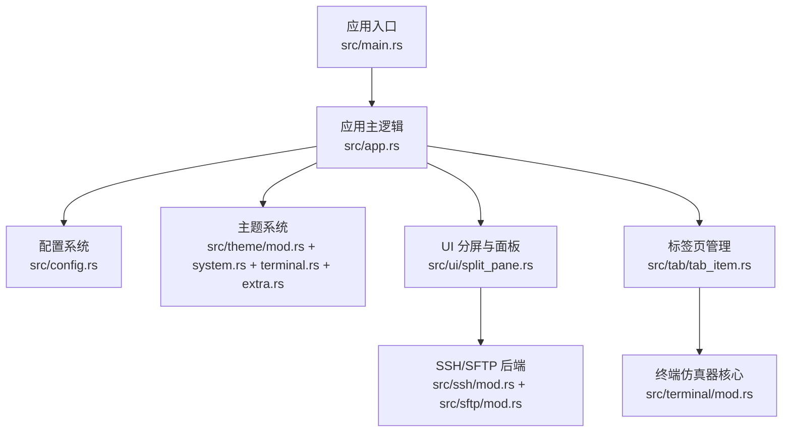
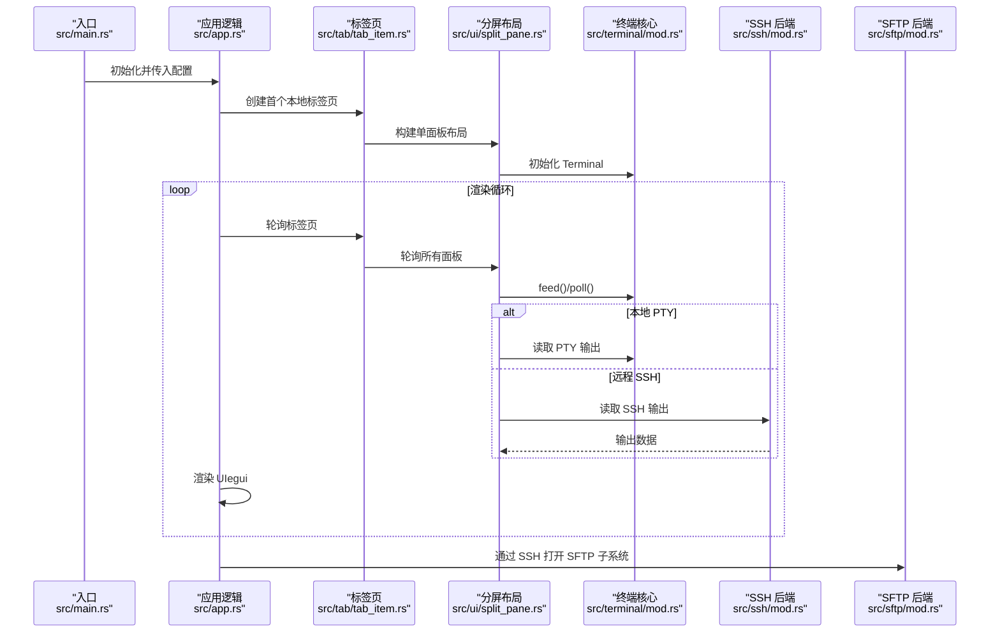
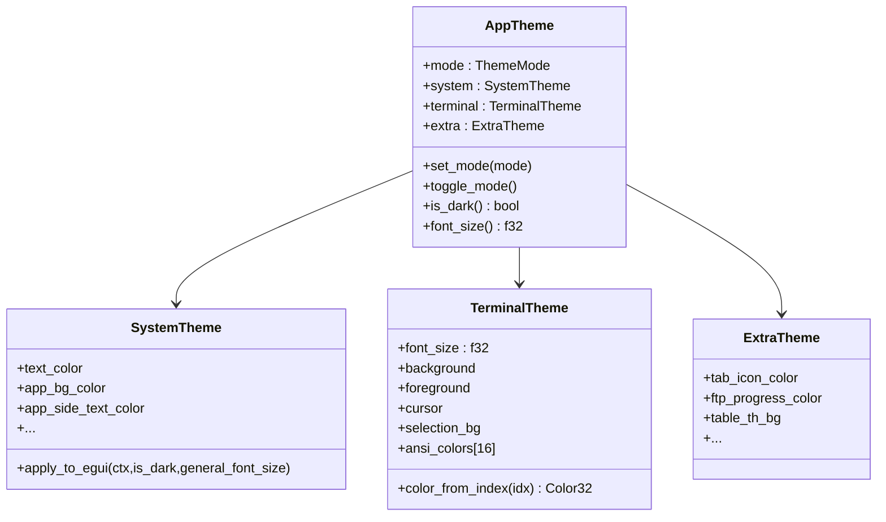
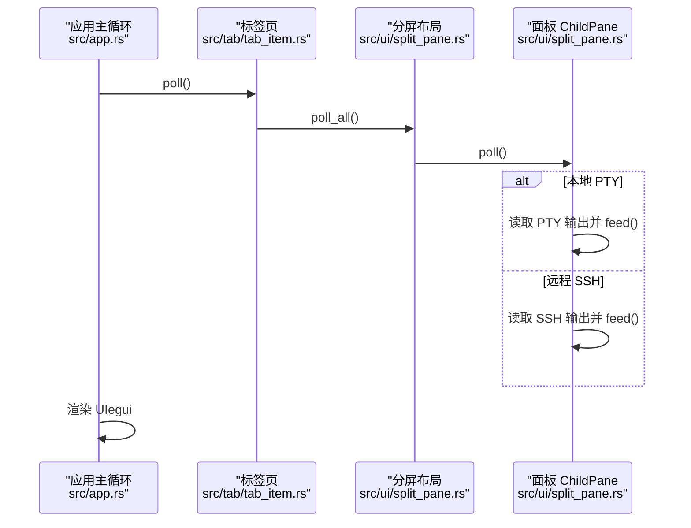
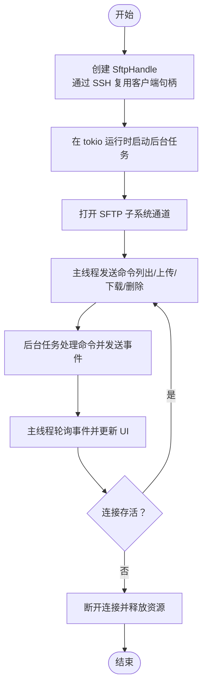
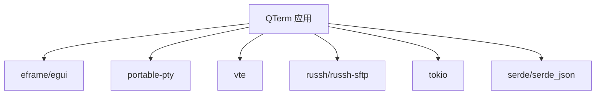

# 扩展开发

<cite>
**本文引用的文件**
- [src/main.rs](file://src/main.rs)
- [src/app.rs](file://src/app.rs)
- [src/config.rs](file://src/config.rs)
- [src/theme/mod.rs](file://src/theme/mod.rs)
- [src/theme/system.rs](file://src/theme/system.rs)
- [src/theme/terminal.rs](file://src/theme/terminal.rs)
- [src/theme/extra.rs](file://src/theme/extra.rs)
- [src/ui/mod.rs](file://src/ui/mod.rs)
- [src/ui/split_pane.rs](file://src/ui/split_pane.rs)
- [src/tab/mod.rs](file://src/tab/mod.rs)
- [src/tab/tab_item.rs](file://src/tab/tab_item.rs)
- [src/terminal/mod.rs](file://src/terminal/mod.rs)
- [src/ssh/mod.rs](file://src/ssh/mod.rs)
- [src/sftp/mod.rs](file://src/sftp/mod.rs)
- [Cargo.toml](file://Cargo.toml)
</cite>

## 目录
1. [简介](#简介)
2. [项目结构](#项目结构)
3. [核心组件](#核心组件)
4. [架构总览](#架构总览)
5. [详细组件分析](#详细组件分析)
6. [依赖关系分析](#依赖关系分析)
7. [性能考量](#性能考量)
8. [故障排查指南](#故障排查指南)
9. [结论](#结论)
10. [附录](#附录)

## 简介
本指南面向希望为 QTerm 项目进行扩展开发的工程师，围绕以下目标展开：
- 主题系统的扩展：颜色体系自定义、字体配置与主题创建流程
- UI 组件的扩展：新组件的设计原则、实现方法与集成方式
- 终端后端的扩展：新增协议支持与终端类型的扩展
- 插件系统与事件机制：事件系统、回调机制与生命周期管理
- 第三方集成：外部工具集成、API 扩展与配置系统扩展
- 提供可直接参考的代码片段路径与最佳实践，帮助快速上手

## 项目结构
QTerm 采用模块化组织，核心模块包括应用入口、配置、主题、UI、标签页、终端仿真器、SSH/SFTP 等。下图给出与扩展开发相关的关键模块关系。

图表来源
- [src/main.rs:1-87](file://src/main.rs#L1-L87)
- [src/app.rs:1-120](file://src/app.rs#L1-L120)
- [src/config.rs:37-127](file://src/config.rs#L37-L127)
- [src/theme/mod.rs:14-71](file://src/theme/mod.rs#L14-L71)
- [src/ui/split_pane.rs:13-31](file://src/ui/split_pane.rs#L13-L31)
- [src/tab/tab_item.rs:3-9](file://src/tab/tab_item.rs#L3-L9)
- [src/terminal/mod.rs:24-41](file://src/terminal/mod.rs#L24-L41)
- [src/ssh/mod.rs:59-66](file://src/ssh/mod.rs#L59-L66)
- [src/sftp/mod.rs:7-13](file://src/sftp/mod.rs#L7-L13)

章节来源
- [src/main.rs:1-87](file://src/main.rs#L1-L87)
- [src/app.rs:1-120](file://src/app.rs#L1-L120)

## 核心组件
- 应用入口与生命周期：负责窗口构建、配置加载与 eframe 渲染循环
- 应用主逻辑：管理标签页、主题、字体、窗口状态与输入处理
- 配置系统：INI 文件与 WhaleTerm preferences.json 的读取与合并
- 主题系统：系统 UI 颜色、终端 ANSI 颜色、扩展组件颜色与字体映射
- UI 分屏与面板：统一的 ChildPane 抽象，支持本地 PTY 与 SSH 后端
- 标签页：封装 SplitLayout 并轮询面板数据
- 终端仿真器：基于 VTE 解析器的状态机，维护网格、光标、选择与滚动区域
- SSH/SFTP：异步会话、通道与 SFTP 子系统，使用独立 tokio 运行时

章节来源
- [src/app.rs:16-105](file://src/app.rs#L16-L105)
- [src/config.rs:37-127](file://src/config.rs#L37-L127)
- [src/theme/mod.rs:14-71](file://src/theme/mod.rs#L14-L71)
- [src/ui/split_pane.rs:13-31](file://src/ui/split_pane.rs#L13-L31)
- [src/tab/tab_item.rs:3-9](file://src/tab/tab_item.rs#L3-L9)
- [src/terminal/mod.rs:24-41](file://src/terminal/mod.rs#L24-L41)
- [src/ssh/mod.rs:59-66](file://src/ssh/mod.rs#L59-L66)
- [src/sftp/mod.rs:7-13](file://src/sftp/mod.rs#L7-L13)

## 架构总览
下图展示扩展开发涉及的主要交互路径：应用入口启动后，加载配置与主题，创建标签页与面板，面板轮询后端数据，渲染到 UI；同时支持 SSH/SFTP 等后端扩展。

图表来源
- [src/main.rs:51-87](file://src/main.rs#L51-L87)
- [src/app.rs:284-575](file://src/app.rs#L284-L575)
- [src/tab/tab_item.rs:23-35](file://src/tab/tab_item.rs#L23-L35)
- [src/ui/split_pane.rs:70-113](file://src/ui/split_pane.rs#L70-L113)
- [src/ssh/mod.rs:68-109](file://src/ssh/mod.rs#L68-L109)
- [src/sftp/mod.rs:46-68](file://src/sftp/mod.rs#L46-L68)

## 详细组件分析

### 主题系统扩展指南
主题系统由三部分组成：系统主题（UI 控件颜色）、终端主题（ANSI 颜色与光标）、扩展主题（SFTP 进度条等）。扩展方法如下：

- 颜色体系自定义
  - 系统主题：通过 SystemTheme 的字段映射 egui 视觉样式，支持深色/浅色两套预设，并可调用 apply_to_egui 应用到 egui 全局样式
  - 终端主题：TerminalTheme 定义前景/背景、光标、选区与 ANSI 16 色映射，支持根据索引生成 256 色调色板
  - 扩展主题：ExtraTheme 提供标签页、连接状态、SFTP 进度条等颜色
  - 参考路径：
    - [系统主题结构与深浅色预设:5-156](file://src/theme/system.rs#L5-L156)
    - [应用到 egui 全局样式:158-290](file://src/theme/system.rs#L158-L290)
    - [终端主题结构与 ANSI 调色板:5-101](file://src/theme/terminal.rs#L5-L101)
    - [扩展主题结构与深浅色预设:5-65](file://src/theme/extra.rs#L5-L65)
    - [主题组合与模式切换:14-71](file://src/theme/mod.rs#L14-L71)

- 字体配置
  - 应用在应用启动时加载 WhaleTerm preferences.json 的字体家族与大小，并合并到 egui 字体系统
  - 可扩展字体来源：支持 Windows/macOS/Linux 系统回退字体与用户自定义字体文件
  - 参考路径：
    - [字体加载与合并逻辑:109-171](file://src/app.rs#L109-L171)
    - [字体路径查找（多平台）:219-263](file://src/app.rs#L219-L263)
    - [WhaleTerm 配置结构与加载:147-281](file://src/config.rs#L147-281)

- 主题创建流程
  - 步骤一：在 SystemTheme/TerminalTheme/ExtraTheme 中新增一组颜色常量
  - 步骤二：在 AppTheme 中添加工厂方法或在 set_mode/toggle_mode 中切换
  - 步骤三：在应用启动时读取用户偏好并调用 apply_to_egui
  - 参考路径：
    - [AppTheme 工厂与切换:23-71](file://src/theme/mod.rs#L23-L71)
    - [应用启动时的主题应用:68-105](file://src/app.rs#L68-L105)

图表来源
- [src/theme/mod.rs:14-71](file://src/theme/mod.rs#L14-L71)
- [src/theme/system.rs:5-156](file://src/theme/system.rs#L5-L156)
- [src/theme/terminal.rs:5-101](file://src/theme/terminal.rs#L5-L101)
- [src/theme/extra.rs:5-65](file://src/theme/extra.rs#L5-L65)

章节来源
- [src/theme/mod.rs:14-71](file://src/theme/mod.rs#L14-L71)
- [src/theme/system.rs:5-156](file://src/theme/system.rs#L5-L156)
- [src/theme/terminal.rs:5-101](file://src/theme/terminal.rs#L5-L101)
- [src/theme/extra.rs:5-65](file://src/theme/extra.rs#L5-L65)
- [src/app.rs:109-171](file://src/app.rs#L109-L171)
- [src/config.rs:147-281](file://src/config.rs#L147-L281)

### UI 组件扩展指南
- 设计原则
  - 统一抽象：ChildPane 将本地 PTY 与 SSH 后端抽象为统一的面板，便于扩展新后端
  - 生命周期：面板具备 alive 标志、轮询 poll、resize、close 等标准接口
  - 事件驱动：面板通过 channels 与后端通信，主线程只负责渲染与调度
- 实现方法
  - 新增后端类型：在 PaneBackend/PaneKind 中增加新枚举项，并在 ChildPane::poll/new_* 中接入
  - 新增面板：在 SplitLayout 中增加 add_*_pane 方法，限制最多 6 个面板
  - 集成方式：在应用主循环中调用 Tab::poll 与 SplitLayout::poll_all，渲染时根据 PaneKind 分派
- 参考路径
  - [ChildPane 抽象与生命周期:25-149](file://src/ui/split_pane.rs#L25-L149)
  - [SplitLayout 面板管理:151-238](file://src/ui/split_pane.rs#L151-L238)
  - [标签页轮询与标题更新:23-35](file://src/tab/tab_item.rs#L23-L35)
  - [应用主循环中的面板轮询与渲染:284-575](file://src/app.rs#L284-L575)

图表来源
- [src/app.rs:284-575](file://src/app.rs#L284-L575)
- [src/tab/tab_item.rs:23-35](file://src/tab/tab_item.rs#L23-L35)
- [src/ui/split_pane.rs:70-113](file://src/ui/split_pane.rs#L70-L113)

章节来源
- [src/ui/split_pane.rs:13-31](file://src/ui/split_pane.rs#L13-L31)
- [src/ui/split_pane.rs:151-238](file://src/ui/split_pane.rs#L151-L238)
- [src/tab/tab_item.rs:11-35](file://src/tab/tab_item.rs#L11-L35)
- [src/app.rs:284-575](file://src/app.rs#L284-L575)

### 终端后端扩展指南
- 新协议支持（以 SFTP 为例）
  - 通过现有 SSH 连接复用 russh 客户端句柄，打开 SFTP 子系统通道
  - 使用命令/事件通道与后台任务通信，主线程轮询事件并更新 UI
  - 参考路径：
    - [SftpHandle 结构与命令/事件通道:7-115](file://src/sftp/mod.rs#L7-L115)
    - [后台 SFTP 任务与命令处理循环:117-167](file://src/sftp/mod.rs#L117-L167)
    - [通过 SSH 打开 SFTP 子系统:119-149](file://src/sftp/mod.rs#L119-L149)
    - [SshHandle 提供 open_sftp:132-136](file://src/ssh/mod.rs#L132-L136)
- 终端类型扩展（新增后端）
  - 在 PaneBackend/PaneKind 中新增枚举值
  - 在 ChildPane::new_* 与 poll 中接入新后端的读写与心跳检查
  - 在 SplitLayout 中增加 add_*_pane
  - 参考路径：
    - [ChildPane::new_local/new_ssh/new_sftp:34-68](file://src/ui/split_pane.rs#L34-L68)
    - [ChildPane::poll 数据轮询:70-113](file://src/ui/split_pane.rs#L70-L113)
    - [SplitLayout::add_*_pane 面板管理:187-221](file://src/ui/split_pane.rs#L187-L221)

图表来源
- [src/sftp/mod.rs:46-115](file://src/sftp/mod.rs#L46-L115)
- [src/sftp/mod.rs:117-167](file://src/sftp/mod.rs#L117-L167)
- [src/ssh/mod.rs#L132-L136:132-136](file://src/ssh/mod.rs#L132-L136)

章节来源
- [src/sftp/mod.rs:7-115](file://src/sftp/mod.rs#L7-L115)
- [src/sftp/mod.rs:117-167](file://src/sftp/mod.rs#L117-L167)
- [src/ssh/mod.rs#L59-L136:59-136](file://src/ssh/mod.rs#L59-L136)
- [src/ui/split_pane.rs:34-68](file://src/ui/split_pane.rs#L34-L68)

### 插件系统与事件机制
- 事件系统
  - SFTP 使用命令/事件通道：主线程发送命令，后台任务处理并回传事件
  - SSH 使用 mpsc 通道：输出数据、输入数据、终端大小调整、句柄传递
  - 参考路径：
    - [SFTP 命令/事件枚举与处理:23-44](file://src/sftp/mod.rs#L23-L44)
    - [SSH 会话通道与生命周期:68-109](file://src/ssh/mod.rs#L68-L109)
- 回调机制
  - ChildPane::poll 中对不同后端执行相同接口，实现“回调式”数据处理
  - 参考路径：
    - [ChildPane::poll:70-113](file://src/ui/split_pane.rs#L70-L113)
- 生命周期管理
  - alive 标志位用于检测后端存活，面板关闭时释放资源
  - 参考路径：
    - [ChildPane::alive/close:136-148](file://src/ui/split_pane.rs#L136-L148)
    - [SftpHandle::disconnect:110-114](file://src/sftp/mod.rs#L110-L114)

章节来源
- [src/sftp/mod.rs:23-44](file://src/sftp/mod.rs#L23-L44)
- [src/ssh/mod.rs:68-109](file://src/ssh/mod.rs#L68-L109)
- [src/ui/split_pane.rs:70-148](file://src/ui/split_pane.rs#L70-L148)

### 第三方集成指南
- 外部工具集成
  - 通过 portable-pty 启动本地 Shell，支持自定义 shell_path
  - 参考路径：
    - [本地 PTY 启动与参数传递:34-45](file://src/ui/split_pane.rs#L34-L45)
    - [应用配置中的 shell_path:37-66](file://src/config.rs#L37-L66)
- API 扩展
  - 通过 SftpHandle 提供的命令接口扩展文件操作能力
  - 通过 SshHandle 提供的 open_sftp 打开 SFTP 子系统
  - 参考路径：
    - [SftpHandle 命令接口:85-114](file://src/sftp/mod.rs#L85-L114)
    - [SshHandle::open_sftp:132-136](file://src/ssh/mod.rs#L132-L136)
- 配置系统扩展
  - 支持从 WhaleTerm preferences.json 读取字体与主题配置，并合并到应用配置
  - 参考路径：
    - [WhaleTerm 配置结构与加载:147-281](file://src/config.rs#L147-L281)
    - [应用配置保存与加载:68-127](file://src/config.rs#L68-L127)

章节来源
- [src/ui/split_pane.rs:34-45](file://src/ui/split_pane.rs#L34-L45)
- [src/config.rs:37-66](file://src/config.rs#L37-L66)
- [src/sftp/mod.rs:85-114](file://src/sftp/mod.rs#L85-L114)
- [src/ssh/mod.rs#L132-L136:132-136](file://src/ssh/mod.rs#L132-L136)
- [src/config.rs:147-281](file://src/config.rs#L147-L281)

## 依赖关系分析
- 外部依赖
  - eframe/egui：UI 框架与渲染
  - portable-pty：本地伪终端
  - vte：ANSI 转义序列解析
  - russh/russh-sftp：SSH/SFTP
  - tokio：异步运行时
  - serde/serde_json：配置序列化
- 模块耦合
  - app.rs 依赖 config.rs、theme/*、ui/*、tab/*、terminal/*
  - ui/split_pane.rs 依赖 ssh/sftp/pty 与 terminal
  - ssh/sftp 依赖 tokio 与 russh 生态
- 参考路径
  - [Cargo.toml 依赖声明:8-25](file://Cargo.toml#L8-L25)

图表来源
- [Cargo.toml:8-25](file://Cargo.toml#L8-L25)

章节来源
- [Cargo.toml:8-25](file://Cargo.toml#L8-L25)

## 性能考量
- 渲染与轮询
  - 在应用主循环中批量轮询所有标签页与面板，避免频繁重绘
  - 参考路径：[应用主循环轮询与渲染:284-575](file://src/app.rs#L284-L575)
- 异步与通道
  - SSH/SFTP 使用 mpsc/oneshot 通道，避免阻塞主线程
  - 参考路径：[SSH 通道创建与会话循环:68-109](file://src/ssh/mod.rs#L68-L109)，[SFTP 后台任务:117-167](file://src/sftp/mod.rs#L117-L167)
- 字体与主题
  - 字体加载与回退策略减少 IO 开销，主题应用一次性设置 egui 样式
  - 参考路径：[字体加载与回退:109-171](file://src/app.rs#L109-L171)，[主题应用到 egui:158-290](file://src/theme/system.rs#L158-L290)

## 故障排查指南
- SSH/SFTP 连接问题
  - 检查连接配置与认证方式，查看 SshError 与 SftpEvent::Error
  - 参考路径：
    - [SshError 定义与显示:35-53](file://src/ssh/mod.rs#L35-L53)
    - [SFTP 错误事件:23-33](file://src/sftp/mod.rs#L23-L33)
- 面板存活与关闭
  - 若面板不再存活，检查后端 alive 标志与 close 调用
  - 参考路径：
    - [ChildPane::alive/close:136-148](file://src/ui/split_pane.rs#L136-L148)
    - [SftpHandle::disconnect:110-114](file://src/sftp/mod.rs#L110-L114)
- 配置读取异常
  - 若 WhaleTerm preferences.json 或 config.ini 缺失，将回退到默认值
  - 参考路径：
    - [WhaleTerm 配置加载默认回退:242-281](file://src/config.rs#L242-L281)
    - [应用配置加载默认回退:71-98](file://src/config.rs#L71-L98)

章节来源
- [src/ssh/mod.rs:35-53](file://src/ssh/mod.rs#L35-L53)
- [src/sftp/mod.rs:23-33](file://src/sftp/mod.rs#L23-L33)
- [src/ui/split_pane.rs:136-148](file://src/ui/split_pane.rs#L136-L148)
- [src/sftp/mod.rs:110-114](file://src/sftp/mod.rs#L110-L114)
- [src/config.rs:242-281](file://src/config.rs#L242-L281)
- [src/config.rs:71-98](file://src/config.rs#L71-L98)

## 结论
QTerm 的扩展开发围绕“主题系统 + UI 抽象 + 终端后端 + 异步事件”的架构展开。通过 ChildPane 的统一抽象与 SplitLayout 的面板管理，可以方便地接入新的后端；通过 SystemTheme/TerminalTheme/ExtraTheme 的模块化设计，能够灵活定制颜色与字体；通过 SSH/SFTP 的通道化事件模型，可实现稳定的异步交互。建议在扩展时遵循统一抽象、生命周期管理与事件驱动的原则，结合配置系统与字体回退策略，确保兼容性与可维护性。

## 附录
- 快速上手清单
  - 主题扩展：在 SystemTheme/TerminalTheme/ExtraTheme 中新增颜色，注册到 AppTheme 并在启动时应用
  - UI 扩展：在 PaneBackend/PaneKind 中新增后端类型，在 SplitLayout 中增加面板管理方法
  - 后端扩展：在 ChildPane::poll/new_* 中接入新后端，限制面板数量并实现 alive/close
  - 事件扩展：通过命令/事件通道或 mpsc 通道实现异步通信，主线程轮询事件
  - 配置扩展：在 config.rs 中新增字段并实现 load/save，或读取外部配置文件