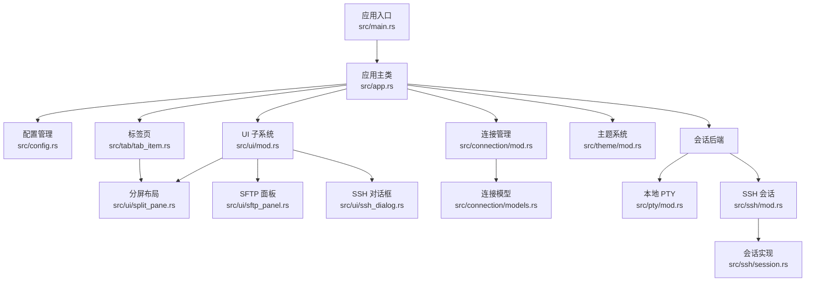
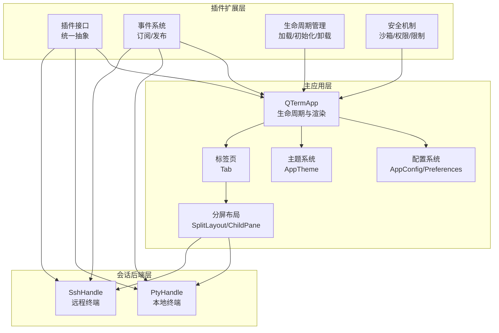
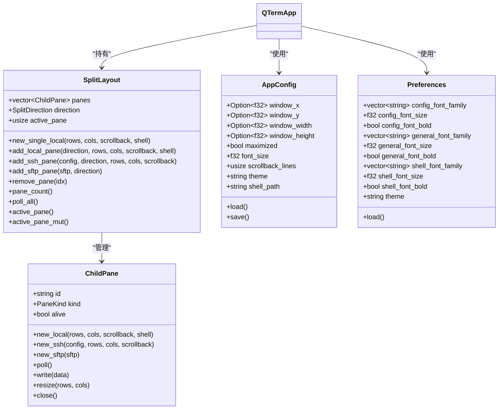
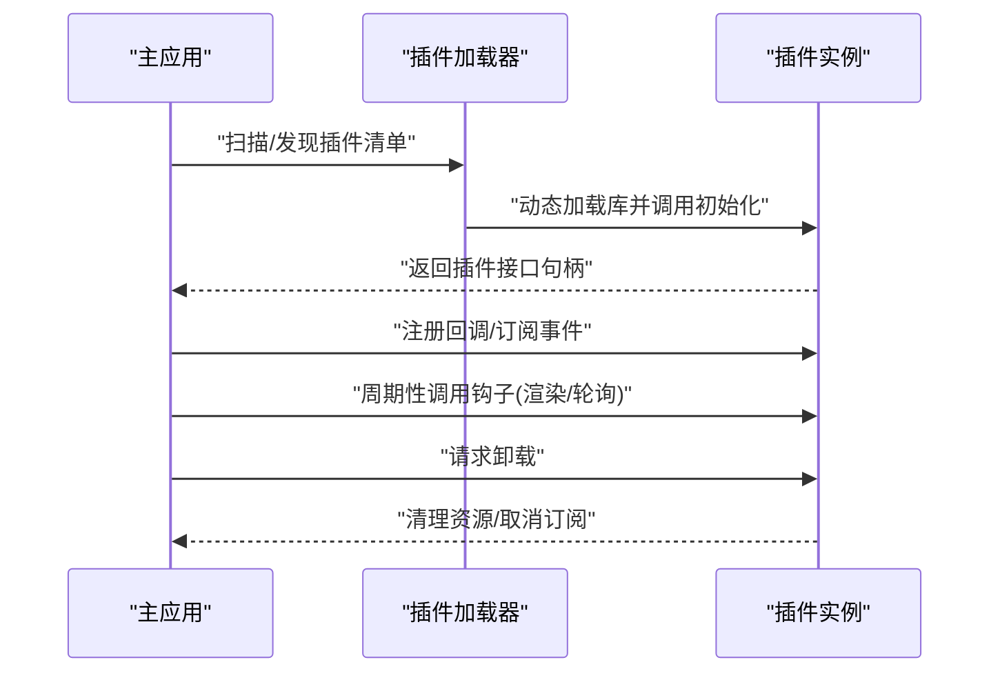
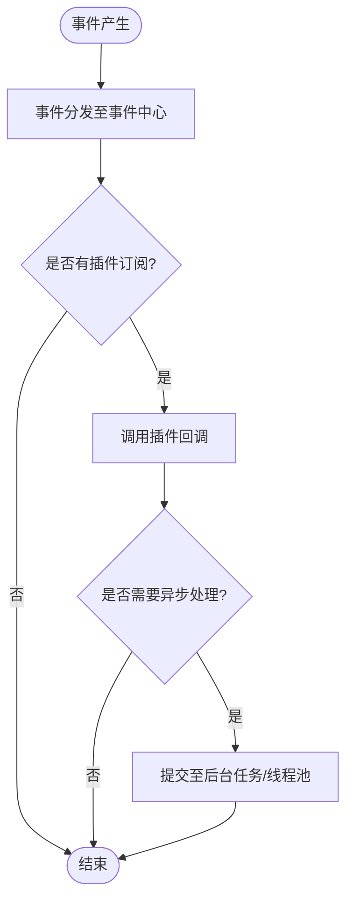
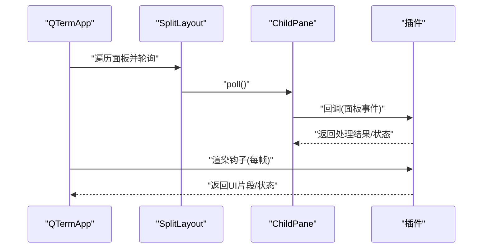
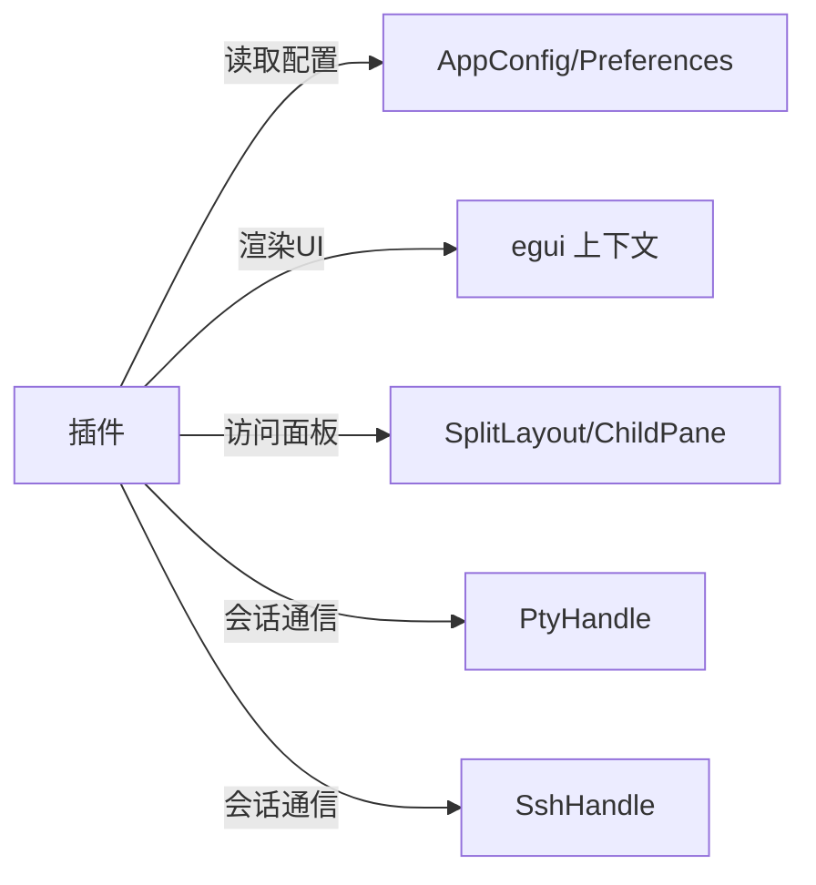
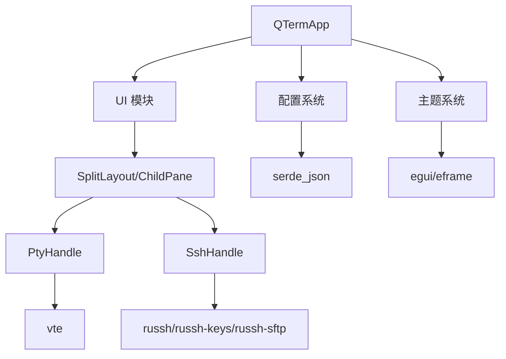

# 插件系统架构

<cite>
**本文档引用的文件**
- [main.rs](file://src/main.rs)
- [app.rs](file://src/app.rs)
- [config.rs](file://src/config.rs)
- [Cargo.toml](file://Cargo.toml)
- [split_pane.rs](file://src/ui/split_pane.rs)
- [tab_item.rs](file://src/tab/tab_item.rs)
- [mod.rs](file://src/connection/mod.rs)
- [models.rs](file://src/connection/models.rs)
- [mod.rs](file://src/ui/mod.rs)
- [mod.rs](file://src/theme/mod.rs)
- [mod.rs](file://src/ssh/mod.rs)
- [session.rs](file://src/ssh/session.rs)
- [mod.rs](file://src/pty/mod.rs)
</cite>

## 目录
1. [简介](#简介)
2. [项目结构](#项目结构)
3. [核心组件](#核心组件)
4. [架构总览](#架构总览)
5. [详细组件分析](#详细组件分析)
6. [依赖关系分析](#依赖关系分析)
7. [性能考量](#性能考量)
8. [故障排查指南](#故障排查指南)
9. [结论](#结论)
10. [附录](#附录)

## 简介
本文件面向 QTerm 插件系统的架构设计，基于现有代码库进行系统性梳理与扩展设计。当前仓库实现了终端仿真、本地与远程（SSH）会话、分屏布局、UI 渲染与配置持久化等核心能力。插件系统旨在在不破坏现有稳定架构的前提下，提供可扩展的扩展点，涵盖插件加载机制、生命周期管理、事件系统、安全隔离与资源限制、热加载与卸载、以及与主应用的交互方式。

## 项目结构
QTerm 采用模块化组织，核心模块如下：
- 应用入口与主循环：main.rs、app.rs
- 配置管理：config.rs
- UI 子系统：ui 模块（split_pane、sftp_panel、ssh_dialog）
- 会话与后端：pty（本地 PTY）、ssh（远程 SSH）
- 连接管理：connection（WhaleTerm 连接导入与解密）
- 标签页与分屏：tab、ui/split_pane
- 主题系统：theme

**图表来源**
- [main.rs:1-87](file://src/main.rs#L1-L87)
- [app.rs:1-1349](file://src/app.rs#L1-L1349)
- [config.rs:1-281](file://src/config.rs#L1-L281)
- [split_pane.rs:1-238](file://src/ui/split_pane.rs#L1-L238)
- [tab_item.rs:1-48](file://src/tab/tab_item.rs#L1-L48)
- [mod.rs:1-148](file://src/connection/mod.rs#L1-L148)
- [models.rs:1-43](file://src/connection/models.rs#L1-L43)
- [mod.rs:1-3](file://src/ui/mod.rs#L1-L3)
- [mod.rs:1-81](file://src/theme/mod.rs#L1-L81)
- [mod.rs:1-41](file://src/ssh/mod.rs#L1-L41)
- [session.rs:36-52](file://src/ssh/session.rs#L36-L52)
- [mod.rs:38-76](file://src/pty/mod.rs#L38-L76)

**章节来源**
- [main.rs:1-87](file://src/main.rs#L1-L87)
- [app.rs:1-1349](file://src/app.rs#L1-L1349)
- [config.rs:1-281](file://src/config.rs#L1-L281)
- [split_pane.rs:1-238](file://src/ui/split_pane.rs#L1-L238)
- [tab_item.rs:1-48](file://src/tab/tab_item.rs#L1-L48)
- [mod.rs:1-148](file://src/connection/mod.rs#L1-L148)
- [models.rs:1-43](file://src/connection/models.rs#L1-L43)
- [mod.rs:1-3](file://src/ui/mod.rs#L1-L3)
- [mod.rs:1-81](file://src/theme/mod.rs#L1-L81)
- [mod.rs:1-41](file://src/ssh/mod.rs#L1-L41)
- [session.rs:36-52](file://src/ssh/session.rs#L36-L52)
- [mod.rs:38-76](file://src/pty/mod.rs#L38-L76)

## 核心组件
- 应用主类 QTermApp：负责 eframe 生命周期、窗口状态、标签页与面板管理、全局快捷键与渲染流程。
- 配置系统：AppConfig 与 Preferences，分别管理运行时配置与字体/主题偏好，并支持从 WhaleTerm 配置迁移。
- UI 子系统：SplitLayout 与 ChildPane 提供分屏与面板生命周期管理；SFTP 与 SSH 对话框提供交互入口。
- 会话后端：PtyHandle（本地）与 SshHandle（远程）统一抽象，便于插件扩展新的后端。
- 连接管理：从 WhaleTerm connections.json 导入并解密连接信息，供 UI 展示与快速连接。
- 主题系统：AppTheme 统一管理 UI 与终端配色，支持浅/深色切换。

**章节来源**
- [app.rs:1-1349](file://src/app.rs#L1-L1349)
- [config.rs:1-281](file://src/config.rs#L1-L281)
- [split_pane.rs:1-238](file://src/ui/split_pane.rs#L1-L238)
- [tab_item.rs:1-48](file://src/tab/tab_item.rs#L1-L48)
- [mod.rs:1-148](file://src/connection/mod.rs#L1-L148)
- [models.rs:1-43](file://src/connection/models.rs#L1-L43)
- [mod.rs:1-81](file://src/theme/mod.rs#L1-L81)

## 架构总览
下图展示了插件系统在现有架构中的位置与交互关系。插件通过统一的接口与事件机制与主应用交互，既可扩展面板类型（如新增后端），也可注入 UI 行为与状态共享。

**图表来源**
- [app.rs:1-1349](file://src/app.rs#L1-L1349)
- [split_pane.rs:1-238](file://src/ui/split_pane.rs#L1-L238)
- [mod.rs:1-41](file://src/ssh/mod.rs#L1-L41)
- [session.rs:36-52](file://src/ssh/session.rs#L36-L52)
- [mod.rs:38-76](file://src/pty/mod.rs#L38-L76)

## 详细组件分析

### 插件接口定义与统一抽象
- 面向后端的统一接口：ChildPane::new_local/new_ssh/new_sftp 体现了“后端抽象”思想，插件可新增 PaneKind 以支持新的会话后端（如 Wasm/容器/隧道等）。
- 面向 UI 的统一接口：SplitLayout 提供 add/remove/resize/poll 等方法，插件可通过扩展面板类型参与渲染与事件处理。
- 面向配置的统一接口：AppConfig/Preferences 提供集中配置入口，插件可声明自己的配置项并通过配置系统读写。

**图表来源**
- [split_pane.rs:1-238](file://src/ui/split_pane.rs#L1-L238)
- [tab_item.rs:1-48](file://src/tab/tab_item.rs#L1-L48)
- [config.rs:1-281](file://src/config.rs#L1-L281)

**章节来源**
- [split_pane.rs:1-238](file://src/ui/split_pane.rs#L1-L238)
- [tab_item.rs:1-48](file://src/tab/tab_item.rs#L1-L48)
- [config.rs:1-281](file://src/config.rs#L1-L281)

### 插件加载机制与生命周期管理
- 加载机制建议
  - 插件发现：在配置中声明插件清单（路径/入口/能力），或扫描特定目录下的动态库。
  - 动态加载：使用平台原生的动态库加载 API（如 Windows 的 LoadLibrary、Unix 的 dlopen），加载后调用插件初始化函数。
  - 接口绑定：插件导出统一的插件接口符号，主应用通过符号表绑定到具体实现。
- 生命周期管理
  - 初始化：插件在加载后执行初始化，注册回调、订阅事件、申请资源。
  - 运行期：插件在主应用的渲染循环中被调用（例如在 QTermApp.update 中插入插件钩子）。
  - 卸载：插件释放资源、取消订阅、注销回调，确保状态可恢复。

**图表来源**
- [app.rs:273-570](file://src/app.rs#L273-L570)
- [config.rs:68-127](file://src/config.rs#L68-L127)

**章节来源**
- [app.rs:273-570](file://src/app.rs#L273-L570)
- [config.rs:68-127](file://src/config.rs#L68-L127)

### 事件系统设计
- 事件模型：采用发布/订阅模式，插件通过事件中心订阅感兴趣的消息（如面板创建、终端输入、窗口状态变更）。
- 事件类型建议
  - 生命周期事件：面板创建/销毁、标签页切换、窗口尺寸变化。
  - 输入事件：键盘/鼠标输入、剪贴板操作。
  - 状态事件：连接状态、主题切换、配置变更。
- 安全与调度：事件在主线程中分发，插件回调需尽快返回；耗时任务交由后台线程或异步运行时处理。

**图表来源**
- [split_pane.rs:70-113](file://src/ui/split_pane.rs#L70-L113)
- [app.rs:273-570](file://src/app.rs#L273-L570)

**章节来源**
- [split_pane.rs:70-113](file://src/ui/split_pane.rs#L70-L113)
- [app.rs:273-570](file://src/app.rs#L273-L570)

### 插件接口与回调机制
- 面板扩展：新增 PaneKind 与对应的后端（如 WasmHandle），在 ChildPane 中注册创建工厂。
- UI 注入：在 QTermApp 的渲染阶段插入插件 UI 组件（如侧边栏扩展、状态栏图标）。
- 回调钩子：在 QTermApp.update 中预留插件回调点，允许插件在每次帧循环中执行轻量逻辑。

**图表来源**
- [split_pane.rs:70-113](file://src/ui/split_pane.rs#L70-L113)
- [tab_item.rs:23-35](file://src/tab/tab_item.rs#L23-L35)
- [app.rs:273-570](file://src/app.rs#L273-L570)

**章节来源**
- [split_pane.rs:70-113](file://src/ui/split_pane.rs#L70-L113)
- [tab_item.rs:23-35](file://src/tab/tab_item.rs#L23-L35)
- [app.rs:273-570](file://src/app.rs#L273-L570)

### 插件与主应用的交互方式
- API 调用：插件通过主应用提供的 API 访问配置、主题、标签页与面板集合。
- 数据交换：通过通道/队列进行数据传递（如 PTY/SSH 的 reader/writer 通道），插件可注入新的通道或代理现有通道。
- 资源共享：插件共享主应用的 egui 上下文、字体与主题资源，确保视觉一致性。

**图表来源**
- [config.rs:68-127](file://src/config.rs#L68-L127)
- [split_pane.rs:136-149](file://src/ui/split_pane.rs#L136-L149)
- [mod.rs:1-41](file://src/ssh/mod.rs#L1-L41)
- [mod.rs:38-76](file://src/pty/mod.rs#L38-L76)

**章节来源**
- [config.rs:68-127](file://src/config.rs#L68-L127)
- [split_pane.rs:136-149](file://src/ui/split_pane.rs#L136-L149)
- [mod.rs:1-41](file://src/ssh/mod.rs#L1-L41)
- [mod.rs:38-76](file://src/pty/mod.rs#L38-L76)

### 插件安全机制
- 沙箱隔离：插件在独立的线程/任务中运行，避免阻塞 UI；必要时引入受限执行环境（如 Wasm）。
- 权限控制：插件仅能访问其声明的 API；敏感操作（如网络、文件系统）需显式授权。
- 资源限制：限制插件内存/CPU 使用，设置超时与重试策略；对通道消息大小与频率进行限制。

**章节来源**
- [session.rs:705-767](file://src/ssh/session.rs#L705-L767)
- [mod.rs:1-41](file://src/ssh/mod.rs#L1-L41)

### 插件开发最佳实践
- 模块化设计：插件内部按职责拆分模块，清晰分离 UI、业务与后端。
- 版本兼容性：遵循语义化版本，声明最低主版本要求；在升级时提供迁移脚本。
- 性能考虑：避免在 UI 线程执行阻塞操作；使用异步与批处理；合理缓存与去抖。

**章节来源**
- [Cargo.toml:1-30](file://Cargo.toml#L1-L30)

### 热加载与卸载
- 热加载：插件库支持重新加载（Windows: UnmapViewOfFile/FreeLibrary；Unix: dlclose/dlopen），卸载旧版本后再加载新版本。
- 状态保存与恢复：在卸载前持久化插件状态（如配置、临时数据），加载后恢复；对长连接与后台任务进行优雅关闭与重启。

**章节来源**
- [app.rs:558-570](file://src/app.rs#L558-L570)

## 依赖关系分析
- 外部依赖：eframe/egui（UI）、portable-pty（本地终端）、vte（ANSI 解析）、russh/russh-keys/russh-sftp（SSH）、tokio（异步）、serde/json（配置）。
- 内部耦合：QTermApp 与 SplitLayout/ChildPane 高内聚；UI 与会话后端通过统一接口解耦；配置与主题系统为横切关注点。

**图表来源**
- [Cargo.toml:8-25](file://Cargo.toml#L8-L25)
- [app.rs:1-1349](file://src/app.rs#L1-L1349)
- [split_pane.rs:1-238](file://src/ui/split_pane.rs#L1-L238)
- [mod.rs:1-41](file://src/ssh/mod.rs#L1-L41)
- [mod.rs:38-76](file://src/pty/mod.rs#L38-L76)

**章节来源**
- [Cargo.toml:8-25](file://Cargo.toml#L8-L25)
- [app.rs:1-1349](file://src/app.rs#L1-L1349)
- [split_pane.rs:1-238](file://src/ui/split_pane.rs#L1-L238)
- [mod.rs:1-41](file://src/ssh/mod.rs#L1-L41)
- [mod.rs:38-76](file://src/pty/mod.rs#L38-L76)

## 性能考量
- 渲染性能：减少不必要的 UI 重建，批量更新面板状态；在插件中避免高频重绘。
- I/O 性能：PTY/SSH 通道采用非阻塞读写；插件应避免在热路径中进行磁盘 I/O。
- 内存管理：及时释放不再使用的资源；插件内部使用环形缓冲与对象池降低分配压力。
- 异步与并发：利用 tokio 运行时处理网络与文件操作；插件回调尽量短小精悍。

**章节来源**
- [split_pane.rs:70-113](file://src/ui/split_pane.rs#L70-L113)
- [session.rs:705-767](file://src/ssh/session.rs#L705-L767)
- [mod.rs:38-76](file://src/pty/mod.rs#L38-L76)

## 故障排查指南
- 插件未加载：检查插件清单与路径；确认动态库符号导出；查看加载日志。
- 回调异常：捕获插件回调异常，记录堆栈；在 UI 中显示错误摘要但不影响主流程。
- 资源泄漏：在插件卸载时强制关闭通道与连接；监控内存与句柄数量。
- 性能问题：使用性能分析工具定位热点；优化通道吞吐与 UI 更新频率。

**章节来源**
- [app.rs:558-570](file://src/app.rs#L558-L570)
- [split_pane.rs:136-149](file://src/ui/split_pane.rs#L136-L149)

## 结论
QTerm 的现有架构为插件系统提供了良好的扩展基础：统一的面板抽象、清晰的 UI 生命周期、完善的配置与主题体系。通过标准化插件接口、事件系统与安全机制，可在不破坏主应用稳定性的前提下，实现灵活的生态扩展。建议优先实现面板扩展与 UI 注入能力，逐步完善事件系统与资源管理，最终达成热插拔与强隔离的插件体系。

## 附录
- 开发示例（步骤说明）
  - 插件注册：在配置中声明插件清单，或在应用启动时扫描插件目录。
  - 插件注册：实现插件初始化函数，返回插件接口句柄。
  - 配置管理：在 AppConfig/Preferences 中声明插件配置项，提供默认值与校验。
  - 错误处理：在插件回调中捕获异常并上报；在 UI 中展示简洁错误信息。
  - 与主应用交互：通过 API 访问面板集合、主题与配置；在渲染钩子中注入 UI 组件。
  - 安全与资源：限制插件权限与资源使用；在卸载时清理通道与连接。
  - 热加载与卸载：实现插件库的重新加载与状态恢复；在卸载前持久化状态。

**章节来源**
- [config.rs:68-127](file://src/config.rs#L68-L127)
- [split_pane.rs:136-149](file://src/ui/split_pane.rs#L136-L149)
- [app.rs:273-570](file://src/app.rs#L273-L570)