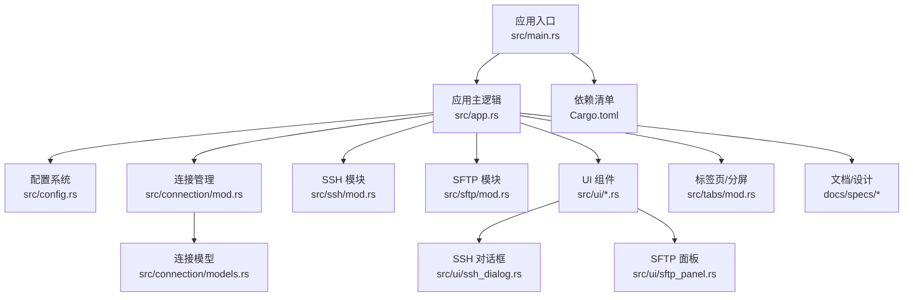
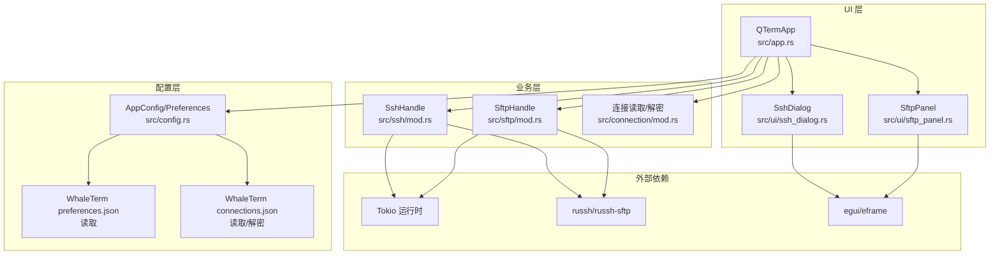
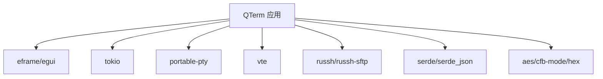

# 第三方集成

<cite>
**本文引用的文件**
- [src/main.rs](file://src/main.rs)
- [src/app.rs](file://src/app.rs)
- [src/config.rs](file://src/config.rs)
- [src/connection/mod.rs](file://src/connection/mod.rs)
- [src/connection/models.rs](file://src/connection/models.rs)
- [src/ssh/mod.rs](file://src/ssh/mod.rs)
- [src/ui/ssh_dialog.rs](file://src/ui/ssh_dialog.rs)
- [src/sftp/mod.rs](file://src/sftp/mod.rs)
- [src/ui/sftp_panel.rs](file://src/ui/sftp_panel.rs)
- [src/ui/mod.rs](file://src/ui/mod.rs)
- [src/tabs/mod.rs](file://src/tabs/mod.rs)
- [Cargo.toml](file://Cargo.toml)
- [README.md](file://README.md)
- [docs/specs/2026-05-30-phase2-ssh-split-design.md](file://docs/specs/2026-05-30-phase2-ssh-split-design.md)
- [docs/specs/2026-05-30-phase3-sftp-design.md](file://docs/specs/2026-05-30-phase3-sftp-design.md)
</cite>

## 目录
1. [简介](#简介)
2. [项目结构](#项目结构)
3. [核心组件](#核心组件)
4. [架构总览](#架构总览)
5. [详细组件分析](#详细组件分析)
6. [依赖关系分析](#依赖关系分析)
7. [性能考量](#性能考量)
8. [故障排查指南](#故障排查指南)
9. [结论](#结论)
10. [附录](#附录)

## 简介
本指南面向希望在 QTerm 中进行第三方集成的开发者，覆盖以下目标：
- 扩展配置系统：新增配置项、数据校验与持久化
- 连接管理：集成外部工具与 API，支持 SSH 扩展、SFTP 增强与自定义协议
- 用户界面：扩展现有 SSH 对话框与 SFTP 面板，支持新认证方式与参数
- 第三方工具集成模式：外部程序调用、数据交换与状态同步
- API 扩展：RESTful API、WebSocket 与实时数据处理
- 安全考虑：认证授权、数据加密与访问控制

## 项目结构
QTerm 采用模块化组织，核心模块如下：
- 应用入口与生命周期：main.rs
- 应用主逻辑与 UI：app.rs
- 配置系统：config.rs
- 连接管理（WhaleTerm 配置读取与解密）：connection/mod.rs、connection/models.rs
- SSH 连接与会话：ssh/mod.rs
- SFTP 文件传输：sftp/mod.rs
- UI 组件：ui/ssh_dialog.rs、ui/sftp_panel.rs、ui/mod.rs
- 标签页与分屏：tabs/mod.rs
- 文档与设计规范：docs/specs/*

**图表来源**
- [src/main.rs:1-87](file://src/main.rs#L1-L87)
- [src/app.rs:1-1349](file://src/app.rs#L1-L1349)
- [src/config.rs:1-281](file://src/config.rs#L1-L281)
- [src/connection/mod.rs:1-148](file://src/connection/mod.rs#L1-L148)
- [src/connection/models.rs:1-43](file://src/connection/models.rs#L1-L43)
- [src/ssh/mod.rs:1-136](file://src/ssh/mod.rs#L1-L136)
- [src/sftp/mod.rs:1-238](file://src/sftp/mod.rs#L1-L238)
- [src/ui/ssh_dialog.rs:1-147](file://src/ui/ssh_dialog.rs#L1-L147)
- [src/ui/sftp_panel.rs:1-387](file://src/ui/sftp_panel.rs#L1-L387)
- [src/tabs/mod.rs:1-3](file://src/tabs/mod.rs#L1-L3)
- [Cargo.toml:1-30](file://Cargo.toml#L1-L30)
- [docs/specs/2026-05-30-phase2-ssh-split-design.md:1-165](file://docs/specs/2026-05-30-phase2-ssh-split-design.md#L1-L165)
- [docs/specs/2026-05-30-phase3-sftp-design.md:1-175](file://docs/specs/2026-05-30-phase3-sftp-design.md#L1-L175)

**章节来源**
- [src/main.rs:1-87](file://src/main.rs#L1-L87)
- [README.md:1-104](file://README.md#L1-L104)

## 核心组件
- 配置系统：AppConfig（窗口位置/尺寸/主题/字体/滚动缓冲/Shell 路径）、Preferences（从 WhaleTerm preferences.json 读取字体与主题）
- 连接管理：WhaleTerm connections.json 读取与 AES-256-CFB 解密，导出为 Connection 列表
- SSH 模块：SshConfig/SshAuth、SshHandle（Tokio 运行时、通道、存活标记、SFTP 复用）
- SFTP 模块：SftpHandle（事件/命令通道、生命周期、文件操作）
- UI 组件：SshDialog（弹窗表单）、SftpPanel（双栏文件浏览器）
- 应用主逻辑：QTermApp（窗口状态、标签页、主题、上下文菜单、连接列表）

**章节来源**
- [src/config.rs:37-127](file://src/config.rs#L37-L127)
- [src/config.rs:145-281](file://src/config.rs#L145-L281)
- [src/connection/mod.rs:28-98](file://src/connection/mod.rs#L28-L98)
- [src/connection/models.rs:3-43](file://src/connection/models.rs#L3-L43)
- [src/ssh/mod.rs:18-136](file://src/ssh/mod.rs#L18-L136)
- [src/sftp/mod.rs:7-115](file://src/sftp/mod.rs#L7-L115)
- [src/ui/ssh_dialog.rs:11-41](file://src/ui/ssh_dialog.rs#L11-L41)
- [src/ui/sftp_panel.rs:12-49](file://src/ui/sftp_panel.rs#L12-L49)
- [src/app.rs:15-94](file://src/app.rs#L15-L94)

## 架构总览
QTerm 的第三方集成遵循“模块边界清晰、异步运行时隔离、UI 与业务解耦”的原则：
- UI 层通过 egui/eframe 渲染，负责用户交互与状态展示
- 业务层（SSH/SFTP/PTY）在 Tokio 运行时中异步执行，通过 channels 与 UI 通信
- 配置层负责持久化与跨模块共享
- 连接管理模块负责外部工具配置的读取与解密

**图表来源**
- [src/app.rs:15-94](file://src/app.rs#L15-L94)
- [src/ssh/mod.rs:8-16](file://src/ssh/mod.rs#L8-L16)
- [src/sftp/mod.rs:1-6](file://src/sftp/mod.rs#L1-L6)
- [src/config.rs:37-127](file://src/config.rs#L37-L127)
- [src/connection/mod.rs:28-98](file://src/connection/mod.rs#L28-L98)
- [Cargo.toml:8-25](file://Cargo.toml#L8-L25)

## 详细组件分析

### 配置系统扩展指南
目标：向 AppConfig/Preferences 新增配置项，并保证数据校验与持久化。

- 新增配置项步骤
  1) 在 AppConfig/Preferences 结构体中添加字段
  2) 在 load() 中解析并设置默认值
  3) 在 save() 中序列化写入
  4) 在 UI 或主逻辑中读取并应用

- 数据验证与默认值
  - 数值型字段建议提供范围检查与默认值
  - 字符串字段建议 trim、去空与白名单校验
  - 路径类字段建议存在性检查与权限校验

- 持久化策略
  - config.ini 采用键值对格式，简单可靠
  - preferences.json 采用 JSON 结构，便于扩展

- 示例参考路径
  - [AppConfig::load/save:68-127](file://src/config.rs#L68-L127)
  - [Preferences::load:239-281](file://src/config.rs#L239-L281)
  - [INI 解析器:129-143](file://src/config.rs#L129-L143)

**章节来源**
- [src/config.rs:37-127](file://src/config.rs#L37-L127)
- [src/config.rs:145-281](file://src/config.rs#L145-L281)

### 连接管理扩展指南
目标：集成外部工具与 API，支持 SSH 扩展、SFTP 增强与自定义协议。

- 读取与解密 WhaleTerm 连接
  - 从 connections.json 读取分组与连接
  - 使用 AES-256-CFB 解密密码
  - 导出为 Connection 列表供 UI 使用

- 扩展认证方式
  - 在 SshAuth 中新增枚举变体（如公钥链、证书、外部凭据）
  - 在 UI 中增加对应输入控件
  - 在 SSH 会话建立阶段处理新认证方式

- 自定义协议支持
  - 定义协议配置结构体与工厂函数
  - 在 UI 中提供协议选择与参数输入
  - 在会话层实现协议握手与数据通道

- 示例参考路径
  - [load_connections:28-59](file://src/connection/mod.rs#L28-L59)
  - [decrypt_password/derive_key:61-137](file://src/connection/mod.rs#L61-L137)
  - [Connection 结构体:31-43](file://src/connection/models.rs#L31-L43)
  - [SshAuth 枚举:28-33](file://src/ssh/mod.rs#L28-L33)

**章节来源**
- [src/connection/mod.rs:28-98](file://src/connection/mod.rs#L28-L98)
- [src/connection/models.rs:31-43](file://src/connection/models.rs#L31-L43)
- [src/ssh/mod.rs:28-33](file://src/ssh/mod.rs#L28-L33)

### SSH 对话框扩展指南
目标：扩展现有 SSH 对话框，支持新认证方式、连接参数与 UI 定制。

- 认证方式扩展
  - 在 AuthMode 中新增选项
  - 在表单中增加对应输入字段（如外部凭据选择器、证书路径等）
  - 在 try_connect 中生成新的 SshAuth 变体

- 连接参数扩展
  - 增加超时、代理、跳板机等高级参数
  - 在 SshConfig 中添加字段并在 UI 中绑定

- UI 定制
  - 使用 egui Grid/ScrollArea/SelectableLabel 组合布局
  - 保持模态窗口与状态提示一致性

- 示例参考路径
  - [SshDialog::show/try_connect:43-147](file://src/ui/ssh_dialog.rs#L43-L147)
  - [SshConfig/SshAuth:18-33](file://src/ssh/mod.rs#L18-L33)

**章节来源**
- [src/ui/ssh_dialog.rs:43-147](file://src/ui/ssh_dialog.rs#L43-L147)
- [src/ssh/mod.rs:18-33](file://src/ssh/mod.rs#L18-L33)

### SFTP 面板扩展指南
目标：增强 SFTP 面板能力，支持更多文件操作与状态同步。

- 文件操作增强
  - 支持批量上传/下载、重命名、权限修改
  - 在 SftpCommand 中新增命令类型
  - 在 SftpEvent 中新增事件类型

- 状态同步
  - 增加传输进度事件与 UI 进度条
  - 在面板轮询中处理事件并刷新 UI

- 示例参考路径
  - [SftpHandle::poll/commands:70-115](file://src/sftp/mod.rs#L70-L115)
  - [handle_command:169-238](file://src/sftp/mod.rs#L169-L238)
  - [SftpPanel::poll/show:51-152](file://src/ui/sftp_panel.rs#L51-152)

**章节来源**
- [src/sftp/mod.rs:70-115](file://src/sftp/mod.rs#L70-L115)
- [src/sftp/mod.rs:169-238](file://src/sftp/mod.rs#L169-L238)
- [src/ui/sftp_panel.rs:51-152](file://src/ui/sftp_panel.rs#L51-L152)

### API 扩展开发指南
目标：集成 RESTful API、WebSocket 与实时数据处理。

- RESTful API 集成
  - 使用 reqwest/serde-json 构建客户端
  - 在配置中新增 API 端点与鉴权参数
  - 在 UI 中提供 API 测试与状态展示

- WebSocket 通信
  - 使用 tokio-tungstenite 建立连接
  - 在应用主循环中轮询消息并更新 UI
  - 实现重连与心跳机制

- 实时数据处理
  - 通过 channels 将外部数据桥接到 UI
  - 在 QTermApp.update 中统一处理外部事件

- 示例参考路径
  - [应用主循环与事件处理:273-556](file://src/app.rs#L273-L556)
  - [Tokio 运行时使用:8-16](file://src/ssh/mod.rs#L8-L16)

**章节来源**
- [src/app.rs:273-556](file://src/app.rs#L273-L556)
- [src/ssh/mod.rs:8-16](file://src/ssh/mod.rs#L8-L16)

### 第三方工具集成模式
目标：实现外部程序调用、数据交换与状态同步。

- 外部程序调用
  - 使用 std::process::Command 启动外部工具
  - 通过 stdout/stderr 与 UI 交互
  - 通过 IPC（文件/管道/网络）与工具交换数据

- 数据交换
  - JSON/YAML 配置文件作为中间介质
  - 通过 channels 将外部数据注入 UI

- 状态同步
  - 在应用主循环中轮询外部状态
  - 使用 AtomicBool/信号量控制生命周期

- 示例参考路径
  - [外部程序调用与 IPC 思路:273-556](file://src/app.rs#L273-L556)
  - [Tokio channels 与事件循环:57-67](file://src/sftp/mod.rs#L57-L67)

**章节来源**
- [src/app.rs:273-556](file://src/app.rs#L273-L556)
- [src/sftp/mod.rs:57-67](file://src/sftp/mod.rs#L57-L67)

### 安全考虑
目标：确保认证授权、数据加密与访问控制。

- 认证授权
  - SSH 认证：密码/私钥/外部凭据
  - API 鉴权：Bearer Token/Basic Auth
  - UI 权限：只读/写入模式切换

- 数据加密
  - 连接密码：AES-256-CFB 解密（WhaleTerm 兼容）
  - 传输加密：SSH/TLS
  - 本地存储：最小化敏感信息

- 访问控制
  - 文件系统：限制 SFTP 目录范围
  - 网络：限制 API 端点与超时
  - UI：禁用危险操作的快捷键

- 示例参考路径
  - [AES-256-CFB 解密:61-98](file://src/connection/mod.rs#L61-L98)
  - [SSH 认证枚举:28-33](file://src/ssh/mod.rs#L28-L33)
  - [SFTP 文件操作:198-238](file://src/sftp/mod.rs#L198-238)

**章节来源**
- [src/connection/mod.rs:61-98](file://src/connection/mod.rs#L61-L98)
- [src/ssh/mod.rs:28-33](file://src/ssh/mod.rs#L28-L33)
- [src/sftp/mod.rs:198-238](file://src/sftp/mod.rs#L198-L238)

## 依赖关系分析
QTerm 的依赖主要集中在异步运行时与 SSH/SFTP 协议栈，以及 UI 框架。

**图表来源**
- [Cargo.toml:8-25](file://Cargo.toml#L8-L25)

**章节来源**
- [Cargo.toml:8-25](file://Cargo.toml#L8-L25)

## 性能考量
- 异步运行时隔离：SSH/SFTP 使用独立 Tokio 运行时，避免阻塞 UI
- 通道背压：合理设置 mpsc/bounded channel 容量，防止内存膨胀
- 终端渲染：根据窗口尺寸动态计算行列数，减少重绘
- 文件传输：SFTP 采用 tokio channel 事件驱动，避免阻塞主线程
- 配置读写：INI/JSON 解析与写入尽量在后台线程执行

## 故障排查指南
- SSH 连接失败
  - 检查主机/端口/用户名是否正确
  - 查看 SshError 与日志输出
  - 确认防火墙与代理设置

- SFTP 操作异常
  - 确认 SSH 连接存活
  - 检查远端路径与权限
  - 查看 SftpEvent::Error

- UI 无响应
  - 确认主循环中调用 ctx.request_repaint()
  - 检查通道阻塞与背压

- 配置未生效
  - 检查 config.ini/preferences.json 路径与权限
  - 确认字段名与默认值

**章节来源**
- [src/ssh/mod.rs:35-53](file://src/ssh/mod.rs#L35-L53)
- [src/sftp/mod.rs:23-33](file://src/sftp/mod.rs#L23-L33)
- [src/app.rs:554-556](file://src/app.rs#L554-L556)
- [src/config.rs:68-127](file://src/config.rs#L68-L127)

## 结论
QTerm 提供了清晰的模块边界与异步架构，适合进行第三方集成。通过扩展配置系统、连接管理、UI 组件与 API 层，可以灵活地接入外部工具与服务。在实现过程中，务必重视数据校验、安全与性能，确保用户体验与系统稳定性。

## 附录
- 快捷键与功能对照：参见 [README.md:35-54](file://README.md#L35-L54)
- 设计文档参考：
  - [Phase 2：SSH 分屏设计:1-165](file://docs/specs/2026-05-30-phase2-ssh-split-design.md#L1-L165)
  - [Phase 3：SFTP 设计:1-175](file://docs/specs/2026-05-30-phase3-sftp-design.md#L1-L175)