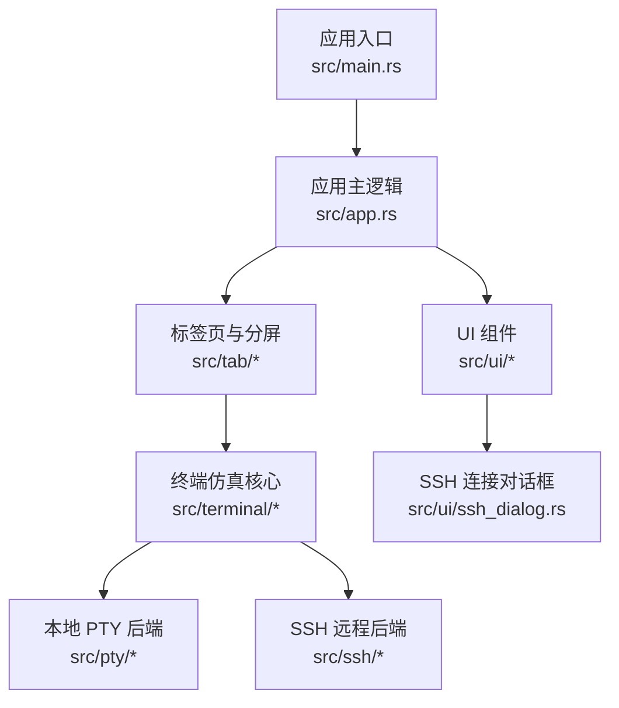
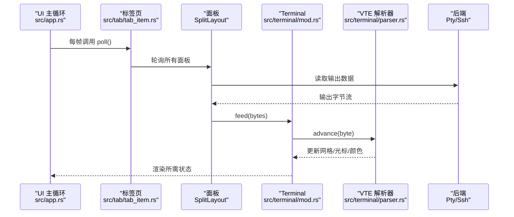
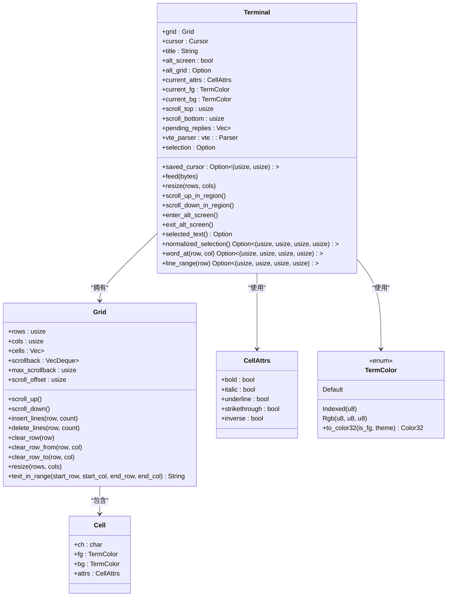
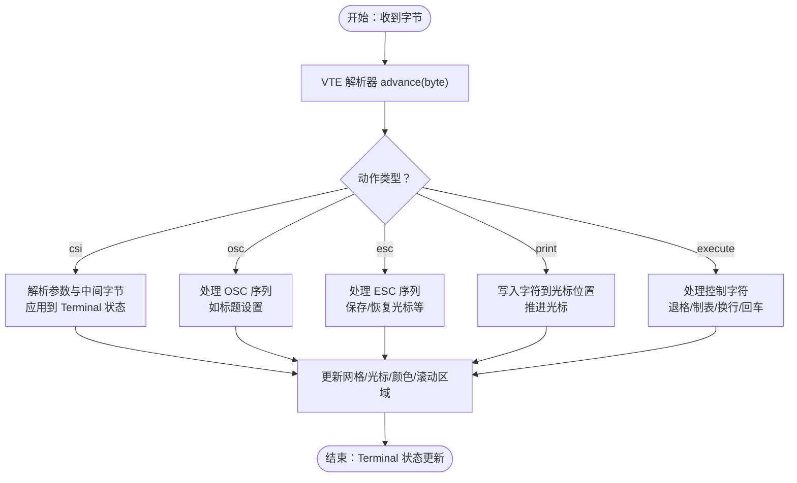
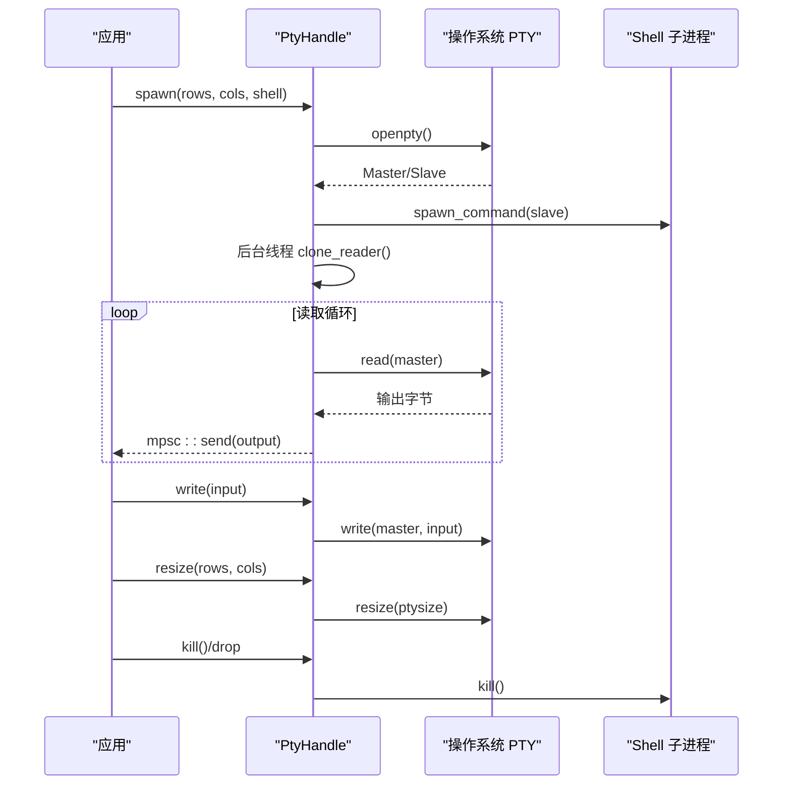
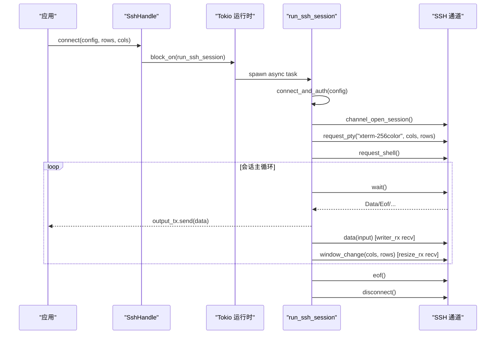
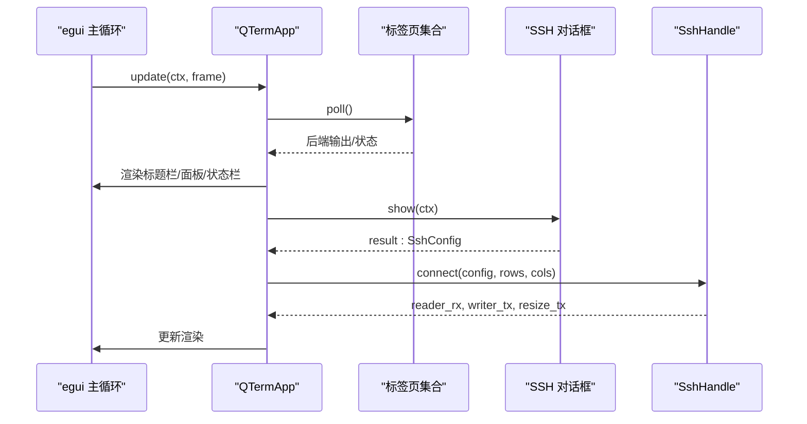
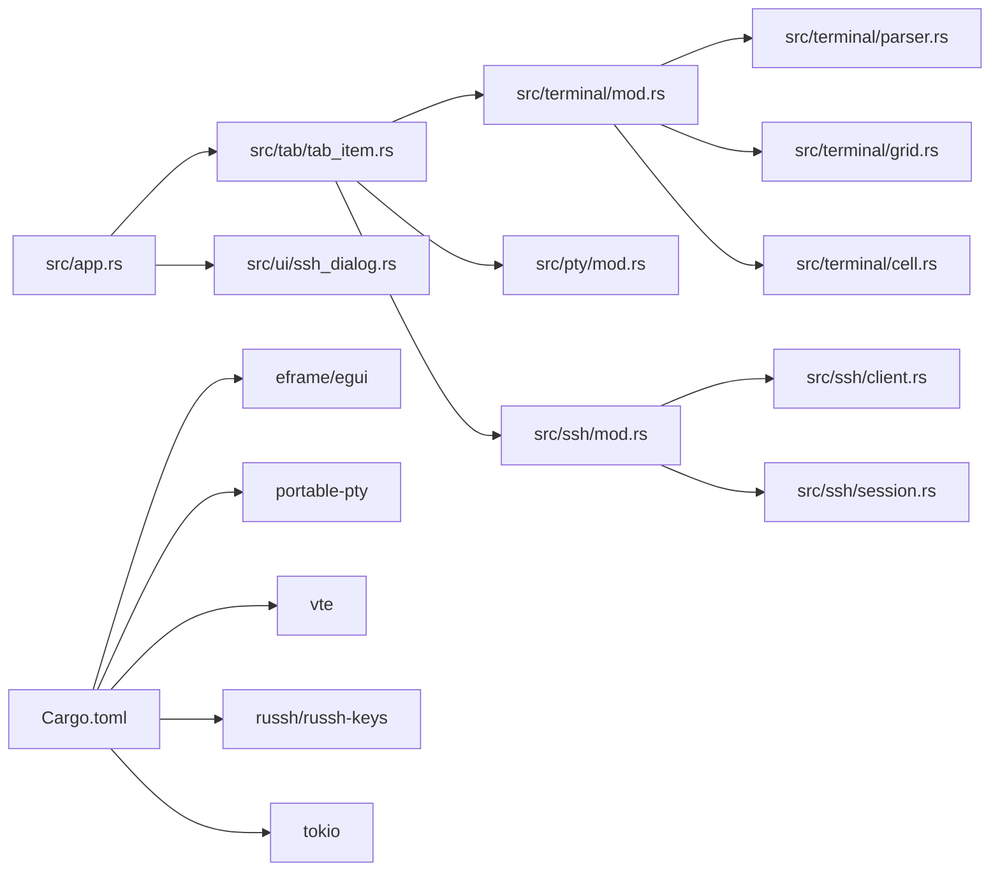

# 终端后端扩展

<cite>
**本文档引用的文件**
- [main.rs](file://src/main.rs)
- [app.rs](file://src/app.rs)
- [tab_item.rs](file://src/tab/tab_item.rs)
- [terminal/mod.rs](file://src/terminal/mod.rs)
- [terminal/grid.rs](file://src/terminal/grid.rs)
- [terminal/cell.rs](file://src/terminal/cell.rs)
- [terminal/parser.rs](file://src/terminal/parser.rs)
- [pty/mod.rs](file://src/pty/mod.rs)
- [ssh/mod.rs](file://src/ssh/mod.rs)
- [ssh/client.rs](file://src/ssh/client.rs)
- [ssh/session.rs](file://src/ssh/session.rs)
- [ui/ssh_dialog.rs](file://src/ui/ssh_dialog.rs)
- [Cargo.toml](file://Cargo.toml)
- [2026-05-30-phase2-ssh-split-design.md](file://docs/specs/2026-05-30-phase2-ssh-split-design.md)
</cite>

## 目录
1. [简介](#简介)
2. [项目结构](#项目结构)
3. [核心组件](#核心组件)
4. [架构总览](#架构总览)
5. [详细组件分析](#详细组件分析)
6. [依赖关系分析](#依赖关系分析)
7. [性能考虑](#性能考虑)
8. [故障排查指南](#故障排查指南)
9. [结论](#结论)
10. [附录](#附录)

## 简介
本文件面向希望扩展 QTerm 终端后端系统的开发者，提供从零实现新的终端后端（本地 PTY 与远程 SSH）的完整指南。内容涵盖：
- Terminal 结构体的设计原理：状态管理、网格存储、VTE 解析器集成
- 如何实现新的终端后端：数据流处理、事件通知、状态同步
- 扩展 SSH 客户端：新增认证方式与协议支持
- 生命周期管理：会话初始化、数据传输、资源清理
- 性能优化：缓冲区管理、内存使用、并发处理
- 与 UI 系统集成：终端渲染与用户交互

## 项目结构
QTerm 采用模块化组织，核心模块如下：
- 应用入口与主循环：src/main.rs、src/app.rs
- 终端仿真核心：src/terminal/*
- 本地 PTY：src/pty/*
- SSH 远程连接：src/ssh/*
- UI 集成：src/ui/*
- 标签页与分屏：src/tab/*、src/ui/split_pane.rs（参考设计文档）

**图表来源**
- [main.rs:1-87](file://src/main.rs#L1-L87)
- [app.rs:1-100](file://src/app.rs#L1-L100)
- [tab_item.rs:1-48](file://src/tab/tab_item.rs#L1-L48)
- [pty/mod.rs:1-121](file://src/pty/mod.rs#L1-L121)
- [ssh/mod.rs:1-136](file://src/ssh/mod.rs#L1-L136)
- [ui/ssh_dialog.rs:1-147](file://src/ui/ssh_dialog.rs#L1-L147)

**章节来源**
- [main.rs:1-87](file://src/main.rs#L1-L87)
- [app.rs:1-100](file://src/app.rs#L1-L100)
- [tab_item.rs:1-48](file://src/tab/tab_item.rs#L1-L48)

## 核心组件
本节聚焦终端仿真核心与后端抽象，帮助你理解如何实现自定义后端。

- Terminal 结构体
  - 管理网格、光标、颜色属性、滚动区域、选择、备用屏幕、VTE 解析器与待回复队列
  - 提供 feed() 将原始字节流交由 VTE 解析器处理；resize() 调整网格尺寸；选择与单词/行范围查询
- Grid 网格
  - 存储屏幕单元格矩阵与回滚缓冲区；提供滚动、插入/删除行、清屏、文本提取等操作
- Cell/CellAttrs/TermColor
  - 单元格字符、前景/背景色与显示属性；颜色支持默认、索引色与 RGB
- Parser/Performer
  - 将 ANSI/OSC/ESC 序列应用到 Terminal 状态（光标移动、颜色设置、清屏、滚动、备用屏幕切换等）
- 后端抽象
  - PtyHandle：本地 PTY 后端，负责子进程生命周期、读写与大小调整
  - SshHandle：远程 SSH 后端，负责异步会话、通道读写、大小调整与 SFTP 句柄传递

**章节来源**
- [terminal/mod.rs:24-200](file://src/terminal/mod.rs#L24-L200)
- [terminal/grid.rs:5-148](file://src/terminal/grid.rs#L5-L148)
- [terminal/cell.rs:5-75](file://src/terminal/cell.rs#L5-L75)
- [terminal/parser.rs:4-311](file://src/terminal/parser.rs#L4-L311)
- [pty/mod.rs:9-121](file://src/pty/mod.rs#L9-L121)
- [ssh/mod.rs:58-136](file://src/ssh/mod.rs#L58-L136)

## 架构总览
QTerm 的 UI 通过 eframe 驱动，每帧轮询所有标签页，读取后端输出并渲染终端。标签页内部使用 SplitLayout 管理多个面板，每个面板绑定一个 Terminal 与后端（Local 或 SSH）。SSH 后端在共享 tokio 运行时中运行会话循环，通过 channels 与主线程通信。

**图表来源**
- [app.rs:283-588](file://src/app.rs#L283-L588)
- [tab_item.rs:23-35](file://src/tab/tab_item.rs#L23-L35)
- [terminal/mod.rs:65-74](file://src/terminal/mod.rs#L65-L74)
- [terminal/parser.rs:10-61](file://src/terminal/parser.rs#L10-L61)

## 详细组件分析

### Terminal 结构体与状态管理
Terminal 是终端仿真的核心，负责：
- 网格管理：Grid、滚动区域、回滚缓冲区
- 光标与选择：Cursor、Selection
- 颜色与属性：CellAttrs、TermColor
- VTE 解析器：处理 ANSI/OSC/ESC 序列
- 备用屏幕：alt_screen 切换与 alt_grid

**图表来源**
- [terminal/mod.rs:24-200](file://src/terminal/mod.rs#L24-L200)
- [terminal/grid.rs:5-148](file://src/terminal/grid.rs#L5-L148)
- [terminal/cell.rs:55-75](file://src/terminal/cell.rs#L55-L75)

**章节来源**
- [terminal/mod.rs:24-200](file://src/terminal/mod.rs#L24-L200)
- [terminal/grid.rs:5-148](file://src/terminal/grid.rs#L5-L148)
- [terminal/cell.rs:55-75](file://src/terminal/cell.rs#L55-L75)

### VTE 解析器集成与 ANSI 处理流程
Performer 将解析结果应用到 Terminal 状态，覆盖：
- print：在光标处写入字符并推进
- execute：退格、制表、换行、回车等控制字符
- csi_dispatch：CSI 序列（光标移动、清屏、滚动、颜色、窗口报告等）
- osc_dispatch：OSC 序列（标题设置等）
- esc_dispatch：ESC 序列（保存/恢复光标、索引/反向索引、全复位等）

**图表来源**
- [terminal/parser.rs:10-233](file://src/terminal/parser.rs#L10-L233)
- [terminal/mod.rs:65-74](file://src/terminal/mod.rs#L65-L74)

**章节来源**
- [terminal/parser.rs:10-233](file://src/terminal/parser.rs#L10-L233)

### 本地 PTY 终端后端（PtyHandle）
PtyHandle 管理本地 Shell 进程：
- 启动：openpty -> spawn_command -> clone_reader/writer
- 数据读写：后台线程持续读取输出，通过 mpsc 传给主线程；主线程写入输入
- 大小调整：resize(rows, cols)
- 生命周期：is_alive()/kill()；Drop 自动清理

**图表来源**
- [pty/mod.rs:19-121](file://src/pty/mod.rs#L19-L121)

**章节来源**
- [pty/mod.rs:19-121](file://src/pty/mod.rs#L19-L121)

### SSH 终端后端（SshHandle + 会话循环）
SshHandle 提供与 PtyHandle 一致的接口：
- connect()：在共享 tokio 运行时中启动会话任务
- 会话循环：等待通道消息、接收输入、处理窗口变化
- 通道管理：request_pty/request_shell、window_change、eof/disconnect
- SFTP：通过共享 russh 客户端句柄复用

**图表来源**
- [ssh/mod.rs:68-136](file://src/ssh/mod.rs#L68-L136)
- [ssh/session.rs:11-90](file://src/ssh/session.rs#L11-L90)
- [ssh/client.rs:23-63](file://src/ssh/client.rs#L23-L63)

**章节来源**
- [ssh/mod.rs:68-136](file://src/ssh/mod.rs#L68-L136)
- [ssh/session.rs:11-90](file://src/ssh/session.rs#L11-L90)
- [ssh/client.rs:23-63](file://src/ssh/client.rs#L23-L63)

### UI 集成与用户交互
- 应用主循环每帧轮询标签页，读取后端输出并渲染终端
- 标题栏、左侧面板、中央终端区域、底部状态栏
- SSH 连接对话框收集参数并生成 SshConfig，交由主逻辑创建 SSH 面板

**图表来源**
- [app.rs:283-588](file://src/app.rs#L283-L588)
- [ui/ssh_dialog.rs:43-147](file://src/ui/ssh_dialog.rs#L43-L147)

**章节来源**
- [app.rs:283-588](file://src/app.rs#L283-L588)
- [ui/ssh_dialog.rs:43-147](file://src/ui/ssh_dialog.rs#L43-L147)

## 依赖关系分析
- 外部依赖
  - eframe/egui：UI 框架与渲染
  - portable-pty：本地 PTY 启动与读写
  - vte：ANSI/OSC/ESC 解析
  - russh/russh-keys：SSH 连接、认证、密钥加载
  - tokio：异步运行时（仅 SSH）
  - uuid：标签页唯一标识
- 内部模块耦合
  - app.rs 依赖 tab、terminal、ui、theme
  - tab_item.rs 依赖 split_pane（通过 ui 模块）
  - ssh/mod.rs 依赖 ssh/client.rs 与 ssh/session.rs
  - terminal/* 与 pty/ssh 通过抽象后端对接 UI

**图表来源**
- [Cargo.toml:8-25](file://Cargo.toml#L8-L25)
- [app.rs:1-100](file://src/app.rs#L1-L100)
- [tab_item.rs:1-48](file://src/tab/tab_item.rs#L1-L48)
- [pty/mod.rs:1-121](file://src/pty/mod.rs#L1-L121)
- [ssh/mod.rs:1-136](file://src/ssh/mod.rs#L1-L136)
- [terminal/mod.rs:1-200](file://src/terminal/mod.rs#L1-L200)

**章节来源**
- [Cargo.toml:8-25](file://Cargo.toml#L8-L25)

## 性能考虑
- 缓冲区管理
  - Grid 的回滚缓冲区使用 VecDeque，注意 max_scrollback 控制内存上限
  - 文本复制时按需拼接，避免不必要的字符串拷贝
- 并发与异步
  - PTY：后台线程 + mpsc，避免阻塞 UI 主循环
  - SSH：共享 tokio 运行时，会话循环使用 select! 并发处理读写与 resize
- 内存使用
  - 单个 SSH 连接内存增量应控制在设计目标内（参考设计文档）
  - 合理设置回滚行数与终端尺寸，避免过大网格
- 渲染优化
  - UI 按需重绘，减少无效绘制
  - 终端渲染只更新受影响区域（由 renderer 负责）

[本节为通用性能指导，无需特定文件引用]

## 故障排查指南
- SSH 连接失败
  - 检查网络连通性与端口可达性
  - 认证失败：确认用户名、密码或私钥路径与口令
  - 通道错误：查看会话循环中的 EOF/错误消息
- PTY 子进程异常
  - 检查 shell 路径与环境变量（TERM/LANG）
  - 确认后台读取线程未提前退出
- 终端渲染异常
  - 检查 ANSI 序列是否被正确解析（CSI/OSC/ESC）
  - 确认颜色索引与主题映射正确
- 生命周期问题
  - 确保 SshHandle::disconnect() 或 Drop 触发连接清理
  - 确保 PtyHandle::kill() 被调用以终止子进程

**章节来源**
- [ssh/mod.rs:35-53](file://src/ssh/mod.rs#L35-L53)
- [ssh/session.rs:48-90](file://src/ssh/session.rs#L48-L90)
- [pty/mod.rs:116-121](file://src/pty/mod.rs#L116-L121)

## 结论
通过抽象后端接口（PtyHandle/SshHandle）与 Terminal 的统一状态模型，QTerm 实现了本地与远程终端的一致体验。遵循本文档的扩展方法，你可以：
- 实现新的后端：只需提供读写与大小调整接口，并将输出喂给 Terminal.feed()
- 扩展 SSH 客户端：新增认证方式或协议支持，保持与现有接口兼容
- 优化性能与稳定性：合理管理缓冲区、并发与生命周期
- 无缝集成 UI：利用现有渲染与交互框架

[本节为总结，无需特定文件引用]

## 附录

### 如何实现新的终端后端（步骤指南）
- 定义后端结构体
  - 至少包含：reader_rx、writer_tx、resize_tx、alive 标志
  - 参考：[ssh/mod.rs:58-66](file://src/ssh/mod.rs#L58-L66)、[pty/mod.rs:9-17](file://src/pty/mod.rs#L9-L17)
- 实现会话循环
  - 读取远端输出并通过通道发送至主线程
  - 接收输入并写入远端
  - 响应窗口大小调整请求
  - 参考：[ssh/session.rs:48-82](file://src/ssh/session.rs#L48-L82)
- 集成到 UI
  - 将后端与 Terminal 绑定到 SplitLayout 的 ChildPane
  - 在每帧轮询中读取输出并触发重绘
  - 参考：[app.rs:283-588](file://src/app.rs#L283-L588)
- 生命周期管理
  - 提供 is_alive()/disconnect()/kill() 等方法
  - 确保 Drop 行为正确清理资源
  - 参考：[ssh/mod.rs:122-131](file://src/ssh/mod.rs#L122-L131)、[pty/mod.rs:116-121](file://src/pty/mod.rs#L116-L121)

### 扩展现有 SSH 客户端（新增认证方式）
- 在 SshAuth 中新增枚举变体
  - 参考：[ssh/mod.rs:28-33](file://src/ssh/mod.rs#L28-L33)
- 在 connect_and_auth 中处理新认证
  - 参考：[ssh/client.rs:25-63](file://src/ssh/client.rs#L25-L63)
- 在 UI 中提供相应输入控件并生成 SshConfig
  - 参考：[ui/ssh_dialog.rs:76-94](file://src/ui/ssh_dialog.rs#L76-L94)

### 与 UI 系统集成要点
- 渲染流程
  - 每帧调用 Tab::poll()，读取后端输出
  - 调用 Terminal 渲染器，传入主题与尺寸
  - 参考：[app.rs:283-588](file://src/app.rs#L283-L588)
- 事件处理
  - 键盘输入通过后端 writer_tx 发送
  - 鼠标事件用于选择与拖拽，PendingMouse 保存状态
  - 参考：[app.rs:571-574](file://src/app.rs#L571-L574)

**章节来源**
- [ssh/mod.rs:28-33](file://src/ssh/mod.rs#L28-L33)
- [ssh/client.rs:25-63](file://src/ssh/client.rs#L25-L63)
- [ui/ssh_dialog.rs:76-94](file://src/ui/ssh_dialog.rs#L76-L94)
- [app.rs:283-588](file://src/app.rs#L283-L588)