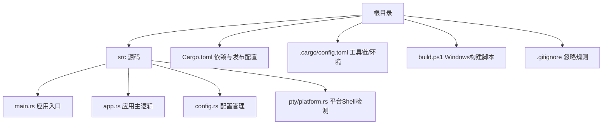
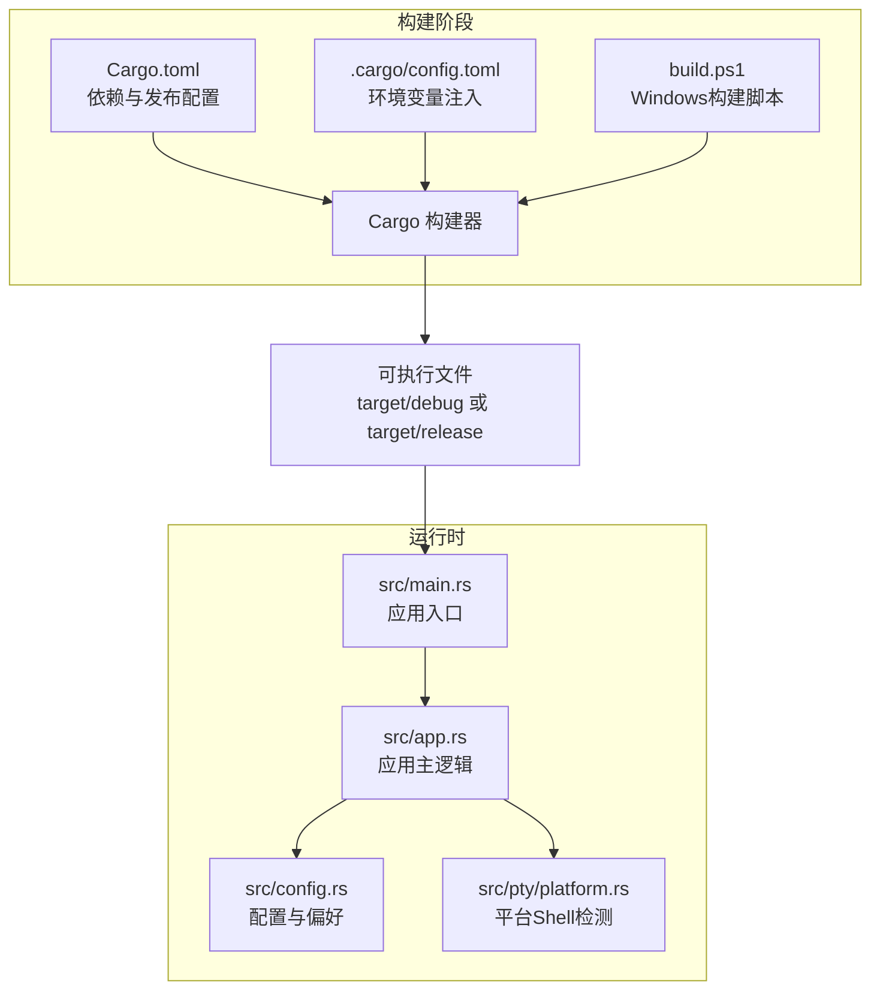
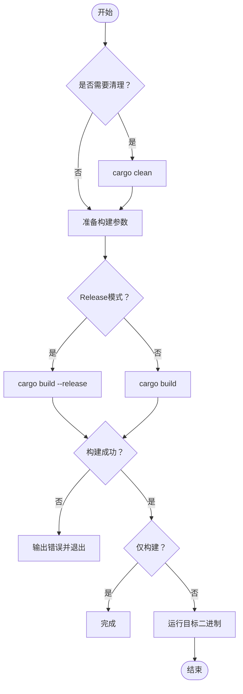
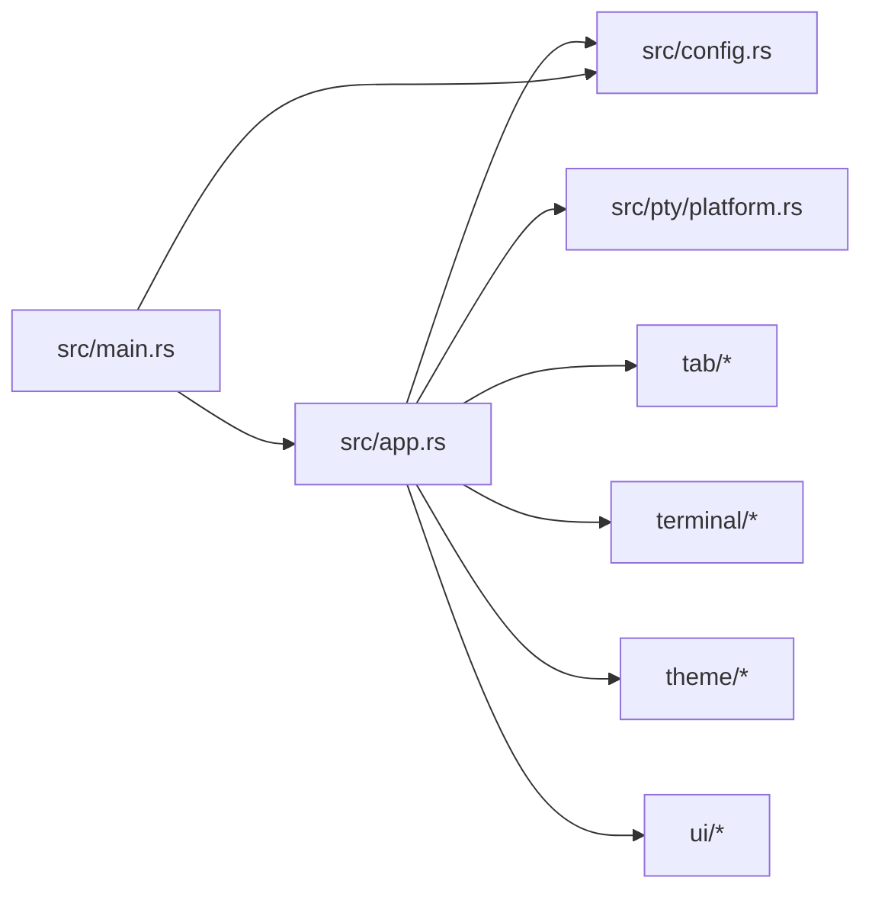

# 构建与发布

<cite>
**本文引用的文件**
- [Cargo.toml](file://Cargo.toml)
- [.cargo/config.toml](file://.cargo/config.toml)
- [build.ps1](file://build.ps1)
- [src/main.rs](file://src/main.rs)
- [src/app.rs](file://src/app.rs)
- [src/config.rs](file://src/config.rs)
- [src/pty/platform.rs](file://src/pty/platform.rs)
- [.gitignore](file://.gitignore)
- [CLAUDE.md](file://CLAUDE.md)
</cite>

## 目录
1. [简介](#简介)
2. [项目结构](#项目结构)
3. [核心组件](#核心组件)
4. [架构总览](#架构总览)
5. [详细组件分析](#详细组件分析)
6. [依赖关系分析](#依赖关系分析)
7. [性能考量](#性能考量)
8. [故障排查指南](#故障排查指南)
9. [结论](#结论)
10. [附录](#附录)

## 简介
本指南面向QTerm项目的构建与发布流程，覆盖以下要点：
- Cargo构建系统配置与使用：依赖管理、构建选项、优化设置
- 平台特定构建流程：Windows、macOS、Linux的编译配置与打包思路
- 发布流程：版本管理、发布准备、分发策略
- 持续集成与自动化发布：GitHub Actions流水线建议
- 性能优化与包体积控制：LTO链接、符号剥离、资源优化
- 发布后监控与回滚策略

## 项目结构
QTerm采用Rust标准工作区布局，核心源码位于src目录，构建配置集中在根目录的Cargo.toml与.cargo/config.toml，Windows平台提供PowerShell构建脚本build.ps1。

图表来源
- [Cargo.toml:1-30](file://Cargo.toml#L1-L30)
- [.cargo/config.toml:1-3](file://.cargo/config.toml#L1-L3)
- [build.ps1:1-58](file://build.ps1#L1-L58)
- [src/main.rs:1-87](file://src/main.rs#L1-L87)
- [src/app.rs:1-800](file://src/app.rs#L1-L800)
- [src/config.rs:1-281](file://src/config.rs#L1-L281)
- [src/pty/platform.rs:1-21](file://src/pty/platform.rs#L1-L21)

章节来源
- [Cargo.toml:1-30](file://Cargo.toml#L1-L30)
- [.cargo/config.toml:1-3](file://.cargo/config.toml#L1-L3)
- [build.ps1:1-58](file://build.ps1#L1-L58)
- [src/main.rs:1-87](file://src/main.rs#L1-L87)
- [src/app.rs:1-800](file://src/app.rs#L1-L800)
- [src/config.rs:1-281](file://src/config.rs#L1-L281)
- [src/pty/platform.rs:1-21](file://src/pty/platform.rs#L1-L21)

## 核心组件
- 构建与运行脚本
  - Cargo命令行：调试构建、发布构建、快速检查、一键运行
  - Windows PowerShell脚本：支持清理、调试/发布构建、仅构建、运行
- 依赖与优化
  - 依赖管理：egui/eframe、portable-pty、vte、russh系列、tokio、serde等
  - 发布配置：opt-level=z、LTO开启、符号剥离
- 平台适配
  - Windows：Win32 API检测窗口可见性、MSYS64库路径注入
  - macOS/Linux：字体回退路径、默认Shell检测

章节来源
- [CLAUDE.md:5-22](file://CLAUDE.md#L5-L22)
- [build.ps1:1-58](file://build.ps1#L1-L58)
- [Cargo.toml:8-30](file://Cargo.toml#L8-L30)
- [src/main.rs:17-47](file://src/main.rs#L17-L47)
- [.cargo/config.toml:1-3](file://.cargo/config.toml#L1-L3)

## 架构总览
下图展示从构建到运行的关键路径，以及平台相关的条件编译点。

图表来源
- [Cargo.toml:1-30](file://Cargo.toml#L1-L30)
- [.cargo/config.toml:1-3](file://.cargo/config.toml#L1-L3)
- [build.ps1:1-58](file://build.ps1#L1-L58)
- [src/main.rs:1-87](file://src/main.rs#L1-L87)
- [src/app.rs:1-800](file://src/app.rs#L1-L800)
- [src/config.rs:1-281](file://src/config.rs#L1-L281)
- [src/pty/platform.rs:1-21](file://src/pty/platform.rs#L1-L21)

## 详细组件分析

### Cargo构建系统与发布配置
- 依赖管理
  - UI框架：eframe（禁用默认特性，启用default_fonts与wgpu）、egui
  - 终端仿真：portable-pty、vte
  - 安全与加密：russh、russh-keys、russh-sftp、aes、cfb-mode、cipher、hex
  - 异步运行时：tokio（多线程、网络、时间、同步）
  - 序列化：serde（derive）、serde_json
- 发布优化
  - opt-level=z：追求更小体积
  - lto=true：开启链接时优化
  - strip=true：自动剥离符号
- 版本与元数据
  - package.name、version、edition、description、license

章节来源
- [Cargo.toml:1-30](file://Cargo.toml#L1-L30)

### Windows平台构建与运行
- 环境变量注入
  - 在.cargo/config.toml中注入LIBRARY_PATH，指向MSYS64的mingw64库目录，便于链接静态库
- 构建脚本
  - build.ps1支持清理、调试/发布构建、仅构建、运行
  - 依据Release开关选择target/debug或target/release下的可执行文件
- 平台特性
  - 条件编译：Windows下使用Win32 API MonitorFromRect检测窗口是否在可见显示器范围内
  - 默认Shell：优先COMSPEC，否则使用powershell.exe

图表来源
- [build.ps1:24-54](file://build.ps1#L24-L54)

章节来源
- [.cargo/config.toml:1-3](file://.cargo/config.toml#L1-L3)
- [build.ps1:1-58](file://build.ps1#L1-L58)
- [src/main.rs:17-47](file://src/main.rs#L17-L47)
- [src/pty/platform.rs:5-12](file://src/pty/platform.rs#L5-L12)

### macOS/Linux平台构建与运行
- 字体回退与平台路径
  - app.rs中根据目标操作系统选择不同的系统回退字体路径（Windows、macOS、Linux）
- 默认Shell检测
  - platform.rs根据不同平台返回默认Shell路径（Windows使用%COMSPEC%，macOS使用$SHELL或/bin/zsh，Linux使用$SHELL或/bin/bash）

章节来源
- [src/app.rs:147-171](file://src/app.rs#L147-L171)
- [src/app.rs:226-263](file://src/app.rs#L226-L263)
- [src/pty/platform.rs:1-21](file://src/pty/platform.rs#L1-L21)

### 配置与偏好加载
- 配置文件
  - config.rs定义了AppConfig结构，负责从config.ini加载/保存窗口位置、尺寸、主题、字体大小、滚动缓冲等
  - 配置目录与文件路径根据平台差异进行处理
- WhaleTerm偏好
  - 从APPDATA/WhaleTerm/preferences.json读取字体家族、大小、粗体、主题等，并映射到QTerm的字体体系

章节来源
- [src/config.rs:6-28](file://src/config.rs#L6-L28)
- [src/config.rs:37-127](file://src/config.rs#L37-L127)
- [src/config.rs:145-281](file://src/config.rs#L145-L281)

### 应用入口与渲染循环
- main.rs
  - 读取配置，构建Viewport（标题、最小尺寸、无原生装饰）
  - 从配置恢复窗口尺寸、位置、最大化状态
  - 启动eframe渲染循环，创建QTermApp实例
- app.rs
  - 实现eframe::App接口，处理标签页、分屏、SSH/SFTP、输入事件、字体配置、窗口状态保存等

章节来源
- [src/main.rs:49-87](file://src/main.rs#L49-L87)
- [src/app.rs:282-589](file://src/app.rs#L282-L589)

## 依赖关系分析
- 内部模块依赖
  - main.rs依赖config.rs加载配置；app.rs依赖config.rs、pty、tab、terminal、theme、ui等模块
  - pty/platform.rs提供平台Shell检测，被app.rs在字体与默认Shell场景使用
- 外部依赖耦合
  - eframe/egui负责UI渲染与事件
  - portable-pty/vte负责本地终端仿真
  - russh系列负责SSH连接与SFTP
  - tokio提供异步运行时
  - serde系列负责配置与偏好序列化

图表来源
- [src/main.rs:1-87](file://src/main.rs#L1-L87)
- [src/app.rs:1-800](file://src/app.rs#L1-L800)
- [src/config.rs:1-281](file://src/config.rs#L1-L281)
- [src/pty/platform.rs:1-21](file://src/pty/platform.rs#L1-L21)

章节来源
- [src/main.rs:1-87](file://src/main.rs#L1-L87)
- [src/app.rs:1-800](file://src/app.rs#L1-L800)
- [src/config.rs:1-281](file://src/config.rs#L1-L281)
- [src/pty/platform.rs:1-21](file://src/pty/platform.rs#L1-L21)

## 性能考量
- 发布优化设置
  - opt-level=z：追求更小体积
  - lto=true：链接时优化，减少代码体积与提升执行效率
  - strip=true：自动剥离符号，减小二进制体积
- 体积控制建议
  - 保持默认特性最小化，避免引入不必要的特性
  - 对于非必要的第三方特性，尽量禁用以减少依赖树
- 运行时优化
  - 使用wgpu后端进行GPU加速渲染
  - 合理的字体回退策略，避免频繁IO与重复加载

章节来源
- [Cargo.toml:26-30](file://Cargo.toml#L26-L30)
- [CLAUDE.md:26](file://CLAUDE.md#L26)

## 故障排查指南
- 构建失败
  - Windows缺少MSYS64库：确认.cargo/config.toml中的LIBRARY_PATH指向正确的mingw64/lib
  - PowerShell脚本异常：使用-clean参数先清理，再尝试构建
- 运行时问题
  - 字体加载失败：检查系统回退字体路径是否存在，或手动指定字体文件
  - 窗口位置不可见：Windows下若配置的位置不在任何显示器范围内，将被忽略
- 常用命令
  - cargo check：快速类型检查
  - cargo run：构建并运行调试版
  - cargo build --release：发布构建（LTO + strip）

章节来源
- [.cargo/config.toml:1-3](file://.cargo/config.toml#L1-L3)
- [build.ps1:24-54](file://build.ps1#L24-L54)
- [src/main.rs:17-47](file://src/main.rs#L17-L47)
- [CLAUDE.md:5-22](file://CLAUDE.md#L5-L22)

## 结论
QTerm的构建与发布流程围绕Cargo与平台脚本展开，结合了跨平台的条件编译与平台特定的环境配置。通过合理的依赖管理与发布优化设置，可在保证功能完整性的同时控制二进制体积。建议在CI中统一执行cargo check与cargo build --release，并在发布后进行回归测试与体积审计。

## 附录

### 发布流程建议
- 版本管理
  - 使用语义化版本（如0.1.0），在发布前更新Cargo.toml中的version字段
- 发布准备
  - 在Windows上使用build.ps1 -Release进行构建，或直接执行cargo build --release
  - 校验target/release下的可执行文件可正常运行
- 分发策略
  - 生成安装包或便携包，包含可执行文件与必要字体/资源（如需）
  - 提供不同平台的独立包，或提供跨平台便携包

章节来源
- [Cargo.toml:1-7](file://Cargo.toml#L1-L7)
- [build.ps1:30-36](file://build.ps1#L30-L36)
- [CLAUDE.md:5-22](file://CLAUDE.md#L5-L22)

### 持续集成与自动化发布（GitHub Actions建议）
- 触发条件
  - 推送至main分支或打标签时触发
- 步骤建议
  - 安装Rust工具链（稳定版）
  - 缓存Cargo registry与git、下载、增量编译缓存
  - 运行cargo check进行快速验证
  - 运行cargo build --release进行发布构建
  - 上传构建产物（artifact）
  - 可选：针对Windows使用PowerShell脚本进行额外验证
- 输出产物
  - target/release下的可执行文件与相关资源

章节来源
- [CLAUDE.md:5-22](file://CLAUDE.md#L5-L22)
- [.gitignore:1-4](file://.gitignore#L1-L4)

### 发布后监控与回滚策略
- 监控
  - 收集崩溃日志与运行时错误
  - 监控二进制体积变化与依赖更新影响
- 回滚
  - 保留上一版本发布包与签名
  - 出现严重问题时，回滚到上一个稳定版本并发布热修复

[本节为通用实践建议，无需具体文件引用]