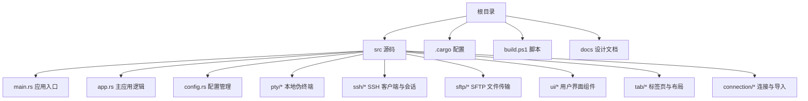
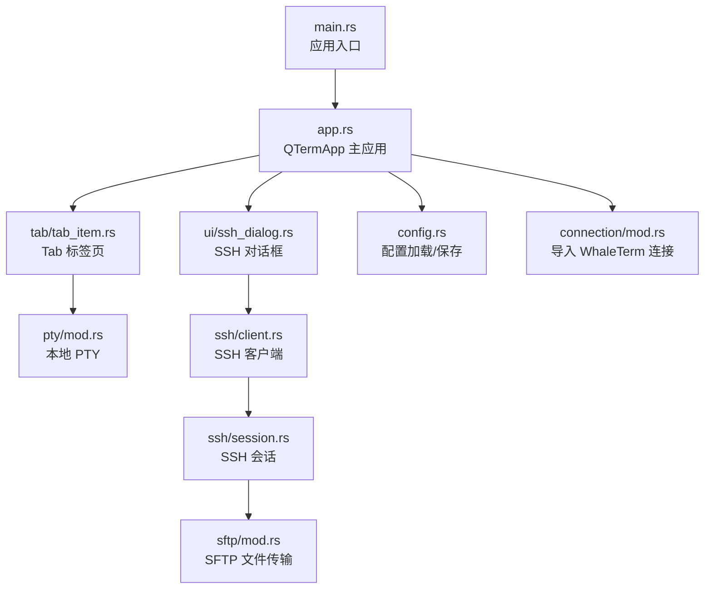
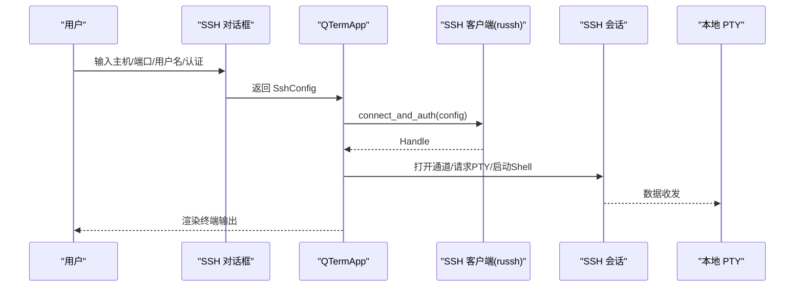
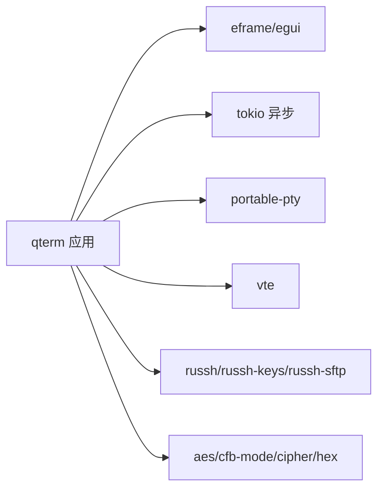

# 快速开始

<cite>
**本文引用的文件**
- [Cargo.toml](file://Cargo.toml)
- [build.ps1](file://build.ps1)
- [.cargo/config.toml](file://.cargo/config.toml)
- [src/main.rs](file://src/main.rs)
- [src/app.rs](file://src/app.rs)
- [src/config.rs](file://src/config.rs)
- [src/connection/mod.rs](file://src/connection/mod.rs)
- [src/connection/models.rs](file://src/connection/models.rs)
- [src/ui/ssh_dialog.rs](file://src/ui/ssh_dialog.rs)
- [src/pty/mod.rs](file://src/pty/mod.rs)
- [src/tabs/mod.rs](file://src/tab/mod.rs)
- [src/tabs/tab_item.rs](file://src/tab/tab_item.rs)
- [src/ssh/client.rs](file://src/ssh/client.rs)
- [src/ssh/session.rs](file://src/ssh/session.rs)
- [src/sftp/mod.rs](file://src/sftp/mod.rs)
</cite>

## 目录
1. [简介](#简介)
2. [项目结构](#项目结构)
3. [核心组件](#核心组件)
4. [架构总览](#架构总览)
5. [详细组件分析](#详细组件分析)
6. [依赖分析](#依赖分析)
7. [性能考虑](#性能考虑)
8. [故障排除指南](#故障排除指南)
9. [结论](#结论)
10. [附录](#附录)

## 简介
本指南面向首次接触 QTerm 的用户，帮助你在约 30 分钟内完成环境准备、编译安装与首次运行，并掌握基本的本地终端、SSH 连接与基础终端操作。QTerm 是一个跨平台的轻量级终端模拟器，基于 Rust 开发，使用 eframe/egui 构建图形界面，支持本地伪终端（PTY）与 SSH/SFTP 功能。

## 项目结构
仓库采用按功能模块划分的组织方式，核心目录与职责如下：
- src：应用源码，包含应用入口、配置、UI、终端、SSH/SFTP、PTY 等模块
- docs：设计文档与规划文档（用于参考）
- .cargo：Cargo 工程配置（如环境变量）
- build.ps1：Windows 平台一键构建与运行脚本
- 其他：README、许可证、忽略列表等

图表来源
- [src/main.rs:1-76](file://src/main.rs#L1-L76)
- [src/app.rs:1-120](file://src/app.rs#L1-L120)
- [src/config.rs:1-60](file://src/config.rs#L1-L60)
- [src/pty/mod.rs:1-40](file://src/pty/mod.rs#L1-L40)
- [src/ssh/client.rs:1-30](file://src/ssh/client.rs#L1-L30)
- [src/sftp/mod.rs:1-40](file://src/sftp/mod.rs#L1-L40)
- [src/ui/ssh_dialog.rs:1-40](file://src/ui/ssh_dialog.rs#L1-L40)
- [src/tab/tab_item.rs:1-20](file://src/tab/tab_item.rs#L1-L20)
- [src/connection/mod.rs:1-25](file://src/connection/mod.rs#L1-L25)

章节来源
- [src/main.rs:1-76](file://src/main.rs#L1-L76)
- [Cargo.toml:1-30](file://Cargo.toml#L1-L30)

## 核心组件
- 应用入口与窗口初始化：负责读取配置、构建窗口尺寸与位置、启动主应用循环
- 主应用逻辑：管理标签页、终端渲染、快捷键、窗口状态持久化
- 配置系统：INI 格式的应用配置与 JSON 格式的偏好设置（兼容 WhaleTerm）
- 本地终端：通过 portable-pty 创建子进程与伪终端交互
- SSH/SFTP：基于 russh/russh-sftp 实现连接、认证、会话与文件传输
- UI 组件：SSH 对话框、侧边栏、标题栏、底部状态栏等

章节来源
- [src/main.rs:44-76](file://src/main.rs#L44-L76)
- [src/app.rs:60-120](file://src/app.rs#L60-L120)
- [src/config.rs:62-118](file://src/config.rs#L62-L118)
- [src/pty/mod.rs:17-74](file://src/pty/mod.rs#L17-L74)
- [src/ssh/client.rs:20-54](file://src/ssh/client.rs#L20-L54)
- [src/sftp/mod.rs:39-96](file://src/sftp/mod.rs#L39-L96)
- [src/ui/ssh_dialog.rs:23-102](file://src/ui/ssh_dialog.rs#L23-L102)

## 架构总览
下图展示了从应用入口到终端渲染、SSH/SFTP 的关键交互路径。

图表来源
- [src/main.rs:44-76](file://src/main.rs#L44-L76)
- [src/app.rs:60-120](file://src/app.rs#L60-L120)
- [src/tab/tab_item.rs:9-17](file://src/tab/tab_item.rs#L9-L17)
- [src/pty/mod.rs:17-74](file://src/pty/mod.rs#L17-L74)
- [src/ui/ssh_dialog.rs:23-102](file://src/ui/ssh_dialog.rs#L23-L102)
- [src/ssh/client.rs:20-54](file://src/ssh/client.rs#L20-L54)
- [src/ssh/session.rs:9-38](file://src/ssh/session.rs#L9-L38)
- [src/sftp/mod.rs:39-96](file://src/sftp/mod.rs#L39-L96)
- [src/config.rs:62-118](file://src/config.rs#L62-L118)
- [src/connection/mod.rs:27-55](file://src/connection/mod.rs#L27-L55)

## 详细组件分析

### 环境准备与安装
- Rust 工具链
  - 建议使用 rustup 安装最新稳定版（包含 cargo、rustc）
  - 参考：[Cargo.toml:1-10](file://Cargo.toml#L1-L10)
- Windows 特定依赖
  - 使用 MSYS2/MinGW 提供的库路径，.cargo/config.toml 中已配置 LIBRARY_PATH
  - 参考：[.cargo/config.toml:1-3](file://.cargo/config.toml#L1-L3)
- 其他系统依赖
  - Linux/macOS 通常随系统字体与终端能力；Windows 需要可用的控制台与字体
- 编译与运行
  - 使用 Cargo 直接构建：cargo build 或 cargo run
  - Windows 一键脚本：build.ps1 支持 Debug/Release/Clean/仅构建
  - 参考：[build.ps1:1-58](file://build.ps1#L1-L58)

章节来源
- [Cargo.toml:1-30](file://Cargo.toml#L1-L30)
- [.cargo/config.toml:1-3](file://.cargo/config.toml#L1-L3)
- [build.ps1:1-58](file://build.ps1#L1-L58)

### 配置系统与首次运行
- 配置文件位置
  - 应用配置（INI）：Windows 在 %APPDATA%\qterm\config.ini；非 Windows 在 $HOME/.config/qterm/config.ini
  - 偏好设置（JSON）：兼容 WhaleTerm，位于 %APPDATA%\WhaleTerm\preferences.json（Windows）或 $HOME/.config/WhaleTerm/preferences.json（非 Windows）
  - 参考：[src/config.rs:6-31](file://src/config.rs#L6-L31)，[src/config.rs:169-186](file://src/config.rs#L169-L186)
- 默认设置
  - 窗口尺寸、主题、字体大小、回滚行数、Shell 路径等均有默认值
  - 参考：[src/config.rs:46-60](file://src/config.rs#L46-L60)，[src/config.rs:202-217](file://src/config.rs#L202-L217)
- 导入 WhaleTerm 连接
  - 启动时自动读取 WhaleTerm 的 connections.json，解密密码后注入连接列表
  - 参考：[src/connection/mod.rs:27-55](file://src/connection/mod.rs#L27-L55)，[src/connection/models.rs:1-41](file://src/connection/models.rs#L1-L41)

章节来源
- [src/config.rs:6-31](file://src/config.rs#L6-L31)
- [src/config.rs:46-60](file://src/config.rs#L46-L60)
- [src/config.rs:169-186](file://src/config.rs#L169-L186)
- [src/config.rs:202-217](file://src/config.rs#L202-L217)
- [src/connection/mod.rs:27-55](file://src/connection/mod.rs#L27-L55)
- [src/connection/models.rs:1-41](file://src/connection/models.rs#L1-L41)

### 本地终端与标签页
- 新建本地终端
  - 通过 Tab::new_local 创建单个本地终端面板，可指定行列数与回滚行数
  - 参考：[src/tab/tab_item.rs:9-17](file://src/tab/tab_item.rs#L9-L17)，[src/app.rs:170-185](file://src/app.rs#L170-L185)
- PTY 子进程
  - 使用 portable-pty 打开本地伪终端，设置 TERM/LANG 等环境变量
  - 参考：[src/pty/mod.rs:17-74](file://src/pty/mod.rs#L17-L74)
- 多面板与分割
  - 支持水平/垂直分割、切换活动面板、关闭面板
  - 参考：[src/app.rs:306-331](file://src/app.rs#L306-L331)，[src/app.rs:312-316](file://src/app.rs#L312-L316)

章节来源
- [src/tab/tab_item.rs:9-17](file://src/tab/tab_item.rs#L9-L17)
- [src/app.rs:170-185](file://src/app.rs#L170-L185)
- [src/pty/mod.rs:17-74](file://src/pty/mod.rs#L17-L74)
- [src/app.rs:306-331](file://src/app.rs#L306-L331)
- [src/app.rs:312-316](file://src/app.rs#L312-L316)

### SSH 连接与会话
- 打开 SSH 对话框
  - 通过 Ribbon 或快捷键打开“新建 SSH”对话框，输入主机、端口、用户名与认证信息
  - 参考：[src/ui/ssh_dialog.rs:23-102](file://src/ui/ssh_dialog.rs#L23-L102)，[src/app.rs:778-780](file://src/app.rs#L778-L780)
- 认证方式
  - 支持密码与私钥两种认证；私钥可选口令
  - 参考：[src/ui/ssh_dialog.rs:104-130](file://src/ui/ssh_dialog.rs#L104-L130)
- 连接与会话
  - 使用 russh 建立连接、执行认证、打开 pty 与 shell，处理数据流与窗口大小变化
  - 参考：[src/ssh/client.rs:20-54](file://src/ssh/client.rs#L20-L54)，[src/ssh/session.rs:9-38](file://src/ssh/session.rs#L9-L38)，[src/ssh/session.rs:41-68](file://src/ssh/session.rs#L41-L68)

图表来源
- [src/ui/ssh_dialog.rs:104-130](file://src/ui/ssh_dialog.rs#L104-L130)
- [src/ssh/client.rs:20-54](file://src/ssh/client.rs#L20-L54)
- [src/ssh/session.rs:9-38](file://src/ssh/session.rs#L9-L38)
- [src/ssh/session.rs:41-68](file://src/ssh/session.rs#L41-L68)

章节来源
- [src/ui/ssh_dialog.rs:23-102](file://src/ui/ssh_dialog.rs#L23-L102)
- [src/ui/ssh_dialog.rs:104-130](file://src/ui/ssh_dialog.rs#L104-L130)
- [src/ssh/client.rs:20-54](file://src/ssh/client.rs#L20-L54)
- [src/ssh/session.rs:9-38](file://src/ssh/session.rs#L9-L38)
- [src/ssh/session.rs:41-68](file://src/ssh/session.rs#L41-L68)

### SFTP 文件传输
- 启动 SFTP
  - 在 Ribbon 中选择 SFTP，或通过快捷键打开；连接后可列出目录、上传/下载、新建目录、删除
  - 参考：[src/app.rs:778-780](file://src/app.rs#L778-L780)，[src/sftp/mod.rs:39-96](file://src/sftp/mod.rs#L39-L96)
- 事件与命令
  - 通过命令通道发送操作，事件通道返回结果（成功/错误）
  - 参考：[src/sftp/mod.rs:142-205](file://src/sftp/mod.rs#L142-L205)

章节来源
- [src/app.rs:778-780](file://src/app.rs#L778-L780)
- [src/sftp/mod.rs:39-96](file://src/sftp/mod.rs#L39-L96)
- [src/sftp/mod.rs:142-205](file://src/sftp/mod.rs#L142-L205)

### 快捷键与基本操作
- 新建/关闭标签页、切换标签页
- 水平/垂直分割、关闭当前面板、切换活动面板
- 打开 SSH 对话框、打开 SFTP、切换左侧面板显示
- 字体缩放、最大化窗口、拖拽移动窗口
- 参考：[src/app.rs:255-346](file://src/app.rs#L255-L346)，[src/app.rs:548-675](file://src/app.rs#L548-L675)

章节来源
- [src/app.rs:255-346](file://src/app.rs#L255-L346)
- [src/app.rs:548-675](file://src/app.rs#L548-L675)

## 依赖分析
- 语言与运行时
  - Rust 2021 edition，Tokio 异步运行时
  - 参考：[Cargo.toml:1-10](file://Cargo.toml#L1-L10)
- 图形与渲染
  - eframe/egui 作为 UI 框架，wgpu 渲染后端
  - 参考：[Cargo.toml](file://Cargo.toml#L9)
- 终端与伪终端
  - portable-pty 创建本地 PTY，vte 解析转义序列
  - 参考：[Cargo.toml:11-12](file://Cargo.toml#L11-L12)
- SSH/SFTP
  - russh、russh-keys、russh-sftp
  - 参考：[Cargo.toml:14-16](file://Cargo.toml#L14-L16)
- 加解密
  - aes/cfb-mode/cipher/hex
  - 参考：[Cargo.toml:21-24](file://Cargo.toml#L21-L24)

图表来源
- [Cargo.toml:8-25](file://Cargo.toml#L8-L25)

章节来源
- [Cargo.toml:1-30](file://Cargo.toml#L1-L30)

## 性能考虑
- 发布构建优化
  - Cargo.toml 中启用 opt-level="z"、LTO、符号剥离，适合体积优化
  - 参考：[Cargo.toml:26-30](file://Cargo.toml#L26-L30)
- 渲染与输入
  - 终端渲染按需计算尺寸，避免频繁重排
  - 参考：[src/app.rs:388-406](file://src/app.rs#L388-L406)
- I/O 与线程
  - PTY 读写使用异步通道，避免阻塞 UI 线程
  - 参考：[src/pty/mod.rs:45-74](file://src/pty/mod.rs#L45-L74)

章节来源
- [Cargo.toml:26-30](file://Cargo.toml#L26-L30)
- [src/app.rs:388-406](file://src/app.rs#L388-L406)
- [src/pty/mod.rs:45-74](file://src/pty/mod.rs#L45-L74)

## 故障排除指南
- Windows 构建失败（找不到库）
  - 确认 MSYS2/MinGW 安装并设置 LIBRARY_PATH
  - 参考：[.cargo/config.toml:1-3](file://.cargo/config.toml#L1-L3)
- SSH 连接超时/认证失败
  - 检查主机、端口、用户名与认证信息；确认目标服务器允许相应认证方式
  - 参考：[src/ui/ssh_dialog.rs:104-130](file://src/ui/ssh_dialog.rs#L104-L130)，[src/ssh/client.rs:20-54](file://src/ssh/client.rs#L20-L54)
- SFTP 子系统不可用
  - 确认服务器启用了 sftp 子系统；查看事件通道返回的错误信息
  - 参考：[src/sftp/mod.rs:104-125](file://src/sftp/mod.rs#L104-L125)
- 无法读取 WhaleTerm 连接
  - 检查 WhaleTerm 配置文件路径与权限；确认密码解密所需硬件特征
  - 参考：[src/connection/mod.rs:27-55](file://src/connection/mod.rs#L27-L55)

章节来源
- [.cargo/config.toml:1-3](file://.cargo/config.toml#L1-L3)
- [src/ui/ssh_dialog.rs:104-130](file://src/ui/ssh_dialog.rs#L104-L130)
- [src/ssh/client.rs:20-54](file://src/ssh/client.rs#L20-L54)
- [src/sftp/mod.rs:104-125](file://src/sftp/mod.rs#L104-L125)
- [src/connection/mod.rs:27-55](file://src/connection/mod.rs#L27-L55)

## 结论
通过本指南，你可以在 30 分钟内完成环境准备、编译安装与首次运行，并掌握本地终端、SSH 连接与基础终端操作。建议在首次运行后探索配置文件与快捷键，以获得更舒适的使用体验。

## 附录

### 快速开始步骤清单
- 安装 Rust 工具链（rustup）
- Windows 确认 MSYS2/MinGW 与 .cargo 配置
- 使用 Cargo 构建或 Windows 脚本运行
- 首次运行后检查配置文件位置与默认设置
- 新建本地终端、打开 SSH 对话框、连接远程主机
- 探索快捷键与 SFTP 功能

章节来源
- [Cargo.toml:1-30](file://Cargo.toml#L1-L30)
- [.cargo/config.toml:1-3](file://.cargo/config.toml#L1-L3)
- [build.ps1:1-58](file://build.ps1#L1-L58)
- [src/config.rs:62-118](file://src/config.rs#L62-L118)
- [src/ui/ssh_dialog.rs:23-102](file://src/ui/ssh_dialog.rs#L23-L102)
- [src/app.rs:255-346](file://src/app.rs#L255-L346)