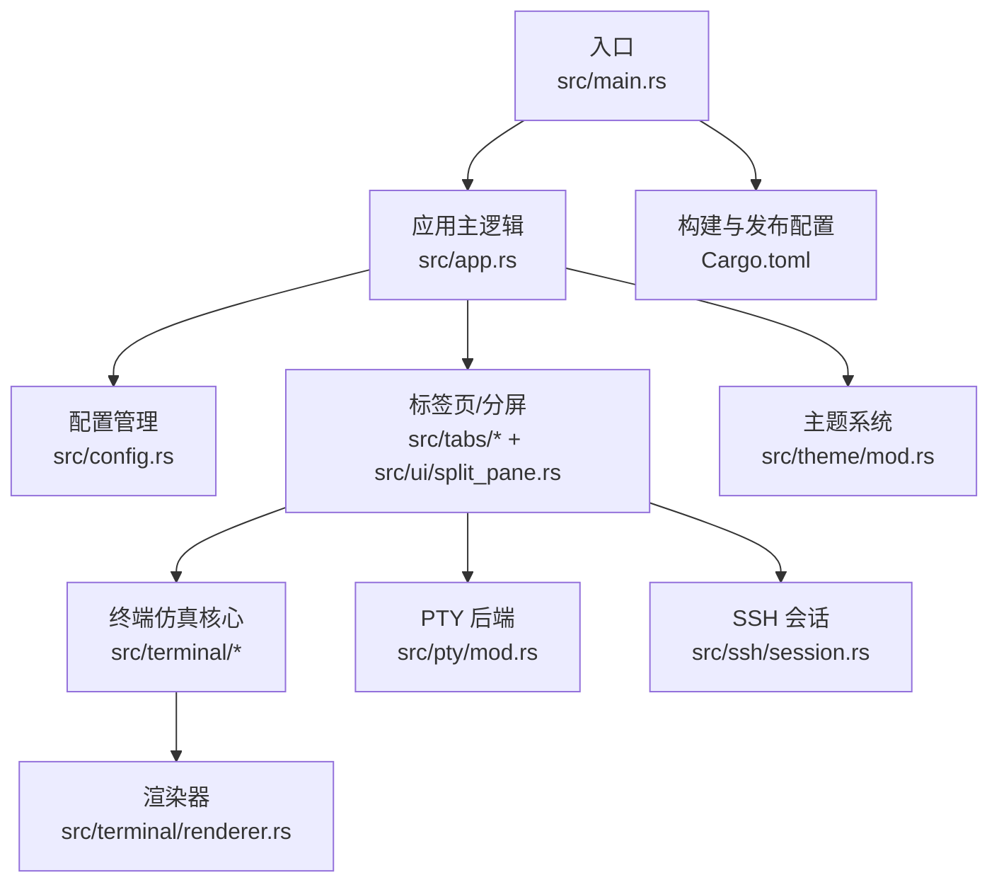
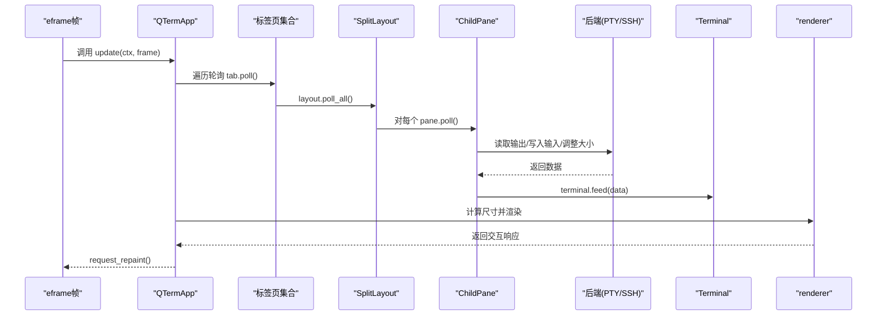
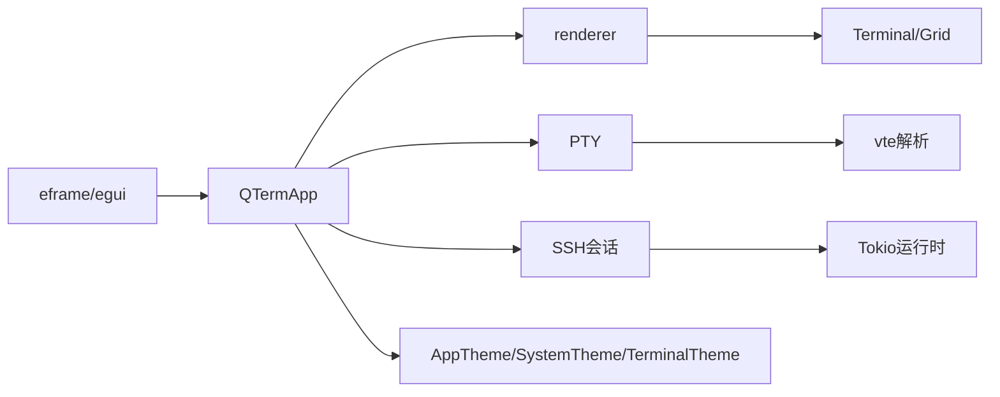

# 性能问题

<cite>
**本文引用的文件**
- [src/main.rs](file://src/main.rs)
- [src/app.rs](file://src/app.rs)
- [src/config.rs](file://src/config.rs)
- [src/tabs/mod.rs](file://src/tabs/mod.rs)
- [src/tabs/tab_item.rs](file://src/tabs/tab_item.rs)
- [src/ui/split_pane.rs](file://src/ui/split_pane.rs)
- [src/terminal/mod.rs](file://src/terminal/mod.rs)
- [src/terminal/grid.rs](file://src/terminal/grid.rs)
- [src/terminal/renderer.rs](file://src/terminal/renderer.rs)
- [src/pty/mod.rs](file://src/pty/mod.rs)
- [src/ssh/session.rs](file://src/ssh/session.rs)
- [src/theme/mod.rs](file://src/theme/mod.rs)
- [Cargo.toml](file://Cargo.toml)
</cite>

## 目录
1. [简介](#简介)
2. [项目结构](#项目结构)
3. [核心组件](#核心组件)
4. [架构总览](#架构总览)
5. [详细组件分析](#详细组件分析)
6. [依赖关系分析](#依赖关系分析)
7. [性能考量](#性能考量)
8. [故障排除指南](#故障排除指南)
9. [结论](#结论)
10. [附录](#附录)

## 简介
本指南聚焦于QTerm项目的性能问题系统性故障排除，围绕以下目标展开：
- 内存泄漏检测与修复：终端缓冲区内存管理、标签页状态跟踪、UI组件生命周期管理
- CPU使用率过高排查：渲染循环优化、事件处理效率、异步任务调度、不必要的重绘触发
- 磁盘I/O性能问题：配置文件读写优化、日志文件管理、临时文件清理、缓存策略调整
- 系统资源监控：内存使用跟踪、CPU负载分析、GPU渲染性能评估、网络带宽监控
- 多面板分屏场景优化：同时运行多个终端会话时的资源分配与性能调优

## 项目结构
QTerm采用模块化设计，核心模块包括应用入口、配置管理、标签页与分屏布局、终端仿真与渲染、PTY/SSH后端、主题系统等。渲染基于egui/eframe，终端仿真使用vte解析ANSI转义序列，PTY通过portable-pty桥接本地Shell，SSH通过russh实现。

**图表来源**
- [src/main.rs:1-87](file://src/main.rs#L1-L87)
- [src/app.rs:1-120](file://src/app.rs#L1-L120)
- [src/config.rs:1-127](file://src/config.rs#L1-L127)
- [src/ui/split_pane.rs:1-238](file://src/ui/split_pane.rs#L1-L238)
- [src/terminal/renderer.rs:1-198](file://src/terminal/renderer.rs#L1-L198)
- [src/pty/mod.rs:1-121](file://src/pty/mod.rs#L1-L121)
- [src/ssh/session.rs:1-90](file://src/ssh/session.rs#L1-L90)
- [src/theme/mod.rs:1-81](file://src/theme/mod.rs#L1-L81)
- [Cargo.toml:1-30](file://Cargo.toml#L1-L30)

**章节来源**
- [src/main.rs:1-87](file://src/main.rs#L1-L87)
- [src/app.rs:1-120](file://src/app.rs#L1-L120)
- [Cargo.toml:1-30](file://Cargo.toml#L1-L30)

## 核心组件
- 应用入口与窗口管理：负责加载配置、构建窗口视口、启动eframe渲染循环。
- 应用主逻辑：维护标签页集合、活动标签页索引、主题与偏好、窗口状态、SSH对话框等；在每次update中轮询标签页、处理快捷键、渲染UI。
- 标签页与分屏：每个标签页包含一个SplitLayout，管理多个子面板（本地/SSH终端或SFTP面板），支持水平/垂直分屏与活动面板切换。
- 终端仿真与渲染：Terminal持有Grid（含回滚缓冲区），通过vte解析ANSI序列；renderer根据可用空间计算行列数并绘制字符、选区、光标。
- 后端连接：PTY负责本地Shell进程与数据读写；SSH会话在Tokio运行时中处理远端数据、输入、窗口大小调整。
- 配置与主题：AppConfig负责窗口位置/尺寸/主题/字体/回滚行数等持久化；Preferences从WhaleTerm读取字体与主题；AppTheme组合系统与终端主题。

**章节来源**
- [src/app.rs:18-105](file://src/app.rs#L18-L105)
- [src/tabs/tab_item.rs:5-48](file://src/tabs/tab_item.rs#L5-L48)
- [src/ui/split_pane.rs:151-238](file://src/ui/split_pane.rs#L151-L238)
- [src/terminal/mod.rs:26-200](file://src/terminal/mod.rs#L26-L200)
- [src/terminal/grid.rs:7-148](file://src/terminal/grid.rs#L7-L148)
- [src/terminal/renderer.rs:25-198](file://src/terminal/renderer.rs#L25-L198)
- [src/pty/mod.rs:11-121](file://src/pty/mod.rs#L11-L121)
- [src/ssh/session.rs:11-90](file://src/ssh/session.rs#L11-L90)
- [src/config.rs:39-127](file://src/config.rs#L39-L127)
- [src/theme/mod.rs:16-71](file://src/theme/mod.rs#L16-L71)

## 架构总览
渲染与数据流的关键路径如下：eframe每帧调用QTermApp.update，在其中轮询所有标签页的面板数据，根据当前活动标签页与分屏方向计算目标行列数并调整面板终端大小，随后调用renderer渲染终端内容。本地/SSH面板分别通过PTY或SSH会话读取输出并喂入Terminal，后者通过vte解析并更新Grid。

**图表来源**
- [src/app.rs:284-575](file://src/app.rs#L284-L575)
- [src/tabs/tab_item.rs:25-35](file://src/tabs/tab_item.rs#L25-L35)
- [src/ui/split_pane.rs:180-185](file://src/ui/split_pane.rs#L180-L185)
- [src/ui/split_pane.rs:70-113](file://src/ui/split_pane.rs#L70-L113)
- [src/pty/mod.rs:87-91](file://src/pty/mod.rs#L87-L91)
- [src/ssh/session.rs:54-82](file://src/ssh/session.rs#L54-L82)
- [src/terminal/mod.rs:67-74](file://src/terminal/mod.rs#L67-L74)
- [src/terminal/renderer.rs:44-180](file://src/terminal/renderer.rs#L44-L180)

## 详细组件分析

### 终端缓冲区与回滚缓冲内存管理
- Grid结构包含当前屏幕单元格矩阵与回滚缓冲区，最大回滚行数由构造参数决定。滚动时将顶部行推入回滚队列并在超过上限时弹出最旧行，保证内存占用可控。
- Terminal在resize时重置scroll_offset，避免历史滚动偏移导致无效绘制。
- 选中文本范围与行提取通过遍历网格实现，注意在大缓冲区场景下避免频繁复制。

优化建议
- 动态调整AppConfig.scrollback_lines以平衡历史记录需求与内存占用。
- 在高流量会话中，适当降低字体缩放或面板数量，减少渲染压力。
- 对长输出场景，优先使用较小字体与更少面板，避免一次性绘制过多单元格。

**章节来源**
- [src/terminal/grid.rs:16-114](file://src/terminal/grid.rs#L16-L114)
- [src/terminal/mod.rs:88-98](file://src/terminal/mod.rs#L88-L98)
- [src/config.rs:47-65](file://src/config.rs#L47-L65)

### 标签页状态跟踪与UI生命周期
- QTermApp维护tabs向量与active_tab索引，新增/关闭标签页时更新状态；on_exit保存窗口位置/尺寸/主题并逐个关闭标签页。
- Tab封装SplitLayout，poll时从活动面板读取终端标题以更新标签页标题；alive检查任一面板存活状态。
- ChildPane区分Terminal/SFTP面板，统一提供poll/write/resize/close接口，并在关闭时终止后端进程/连接。

优化建议
- 在高频轮询场景下，确保pane.poll()只在面板存活时进行，避免对已关闭面板的无效IO。
- 关闭标签页时务必调用pane.close()释放后端资源，防止子进程/连接泄露。
- 对SFTP面板，定期清理临时文件与未完成的任务，避免阻塞。

**章节来源**
- [src/app.rs:18-105](file://src/app.rs#L18-L105)
- [src/tabs/tab_item.rs:11-48](file://src/tabs/tab_item.rs#L11-L48)
- [src/ui/split_pane.rs:151-238](file://src/ui/split_pane.rs#L151-L238)

### 渲染循环与绘制优化
- renderer根据可用空间与字体大小计算rows/cols，按颜色分段批量绘制文本，减少绘制调用次数；绘制选区与光标时采用矩形填充与二次文本绘制。
- QTermApp在update中计算目标行列数并批量调用pane.resize，避免频繁尺寸变更引发的重排。

优化建议
- 避免在渲染期间执行昂贵操作（如大量字符串拼接、正则匹配）。
- 减少不必要的repaint请求，仅在必要时调用ctx.request_repaint()。
- 对高密度字符场景，适当增大字体间距或减少面板数量，降低绘制复杂度。

**章节来源**
- [src/terminal/renderer.rs:25-198](file://src/terminal/renderer.rs#L25-L198)
- [src/app.rs:436-456](file://src/app.rs#L436-L456)

### 事件处理与异步任务调度
- eframe的update中集中处理键盘/鼠标事件与全局快捷键，随后统一调用handle_input与ctx.request_repaint()。
- SSH会话在Tokio运行时中通过select!并发处理输出读取、输入写入与窗口大小调整，使用原子标志控制会话生命周期。
- PTY通过独立线程读取Shell输出，使用messaging通道传回主线程，避免阻塞UI线程。

优化建议
- 将耗时任务（如大文件复制、网络请求）放入Tokio任务，避免阻塞主线程。
- 对高频事件（如鼠标拖拽选择）采用节流/去抖策略，减少重复计算。
- 合理设置通道容量，避免阻塞与背压。

**章节来源**
- [src/app.rs:284-575](file://src/app.rs#L284-L575)
- [src/ssh/session.rs:54-82](file://src/ssh/session.rs#L54-L82)
- [src/pty/mod.rs:60-76](file://src/pty/mod.rs#L60-L76)

### 多面板分屏场景优化
- SplitLayout支持最多6个面板，水平/垂直分屏，活动面板高亮；根据可用空间平均分配尺寸。
- 在多面板场景下，建议限制同时活跃的面板数量，避免过度绘制与内存占用。

优化建议
- 合理拆分面板：将高负载会话（如日志监控）与低负载会话（如命令输入）分离。
- 调整字体大小与面板数量，确保每个面板的rows/cols在合理范围内。
- 对非活动面板暂停轮询或降低刷新频率，减少后台IO与CPU消耗。

**章节来源**
- [src/ui/split_pane.rs:151-238](file://src/ui/split_pane.rs#L151-L238)
- [src/app.rs:436-557](file://src/app.rs#L436-L557)

## 依赖关系分析
- 渲染与UI：eframe/egui提供渲染框架与事件系统；renderer依赖终端模型与主题。
- 终端仿真：vte解析ANSI序列；Grid承载字符与回滚缓冲。
- 后端连接：portable-pty管理本地Shell；russh管理SSH会话；Tokio提供异步运行时。
- 主题系统：AppTheme组合系统与终端主题，影响渲染颜色与对比度。

**图表来源**
- [src/app.rs:284-575](file://src/app.rs#L284-L575)
- [src/terminal/renderer.rs:44-180](file://src/terminal/renderer.rs#L44-L180)
- [src/pty/mod.rs:11-121](file://src/pty/mod.rs#L11-L121)
- [src/ssh/session.rs:11-90](file://src/ssh/session.rs#L11-L90)
- [src/theme/mod.rs:16-71](file://src/theme/mod.rs#L16-L71)
- [Cargo.toml:8-25](file://Cargo.toml#L8-L25)

**章节来源**
- [Cargo.toml:8-25](file://Cargo.toml#L8-L25)

## 性能考量
- 编译优化：release配置启用压缩、LTO与符号剥离，有助于减小二进制体积与提升运行时性能。
- 渲染优化：按颜色分段绘制文本、仅在必要时重绘、避免过度repaint。
- IO优化：PTY/SSH均采用异步/线程化读取，避免阻塞UI线程。
- 内存管理：Grid回滚缓冲区有上限控制；关闭面板时释放后端资源。

**章节来源**
- [Cargo.toml:26-30](file://Cargo.toml#L26-L30)

## 故障排除指南

### 内存泄漏检测与修复
- 终端缓冲区
  - 症状：长时间运行后内存持续增长。
  - 排查：检查AppConfig.scrollback_lines是否过大；确认Grid.resize后scroll_offset被重置。
  - 修复：降低回滚行数；在resize后确保scroll_offset归零。
  - 参考
    - [src/terminal/grid.rs:106-114](file://src/terminal/grid.rs#L106-L114)
    - [src/terminal/mod.rs:88-98](file://src/terminal/mod.rs#L88-L98)
    - [src/config.rs:47-65](file://src/config.rs#L47-L65)

- 标签页与面板
  - 症状：关闭标签页后仍有内存占用。
  - 排查：确认Tab.close与ChildPane.close是否被调用；检查pane.alive状态。
  - 修复：确保关闭流程调用close并释放后端资源。
  - 参考
    - [src/tabs/tab_item.rs:42-47](file://src/tabs/tab_item.rs#L42-L47)
    - [src/ui/split_pane.rs:136-148](file://src/ui/split_pane.rs#L136-L148)

- UI组件生命周期
  - 症状：窗口关闭后进程未退出。
  - 排查：确认eframe::run_native与QTermApp.on_exit的调用链。
  - 修复：在on_exit中保存配置并关闭所有标签页。
  - 参考
    - [src/main.rs:51-87](file://src/main.rs#L51-L87)
    - [src/app.rs:577-589](file://src/app.rs#L577-L589)

### CPU使用率过高排查
- 渲染循环
  - 症状：即使无输入也保持高CPU。
  - 排查：检查是否在渲染期间执行昂贵操作；确认ctx.request_repaint()调用频率。
  - 修复：减少渲染期间的计算；仅在必要时请求重绘。
  - 参考
    - [src/terminal/renderer.rs:60-107](file://src/terminal/renderer.rs#L60-L107)
    - [src/app.rs:574](file://src/app.rs#L574)

- 事件处理
  - 症状：键盘/鼠标频繁触发导致CPU飙升。
  - 排查：检查handle_input中是否有重复或冗余逻辑。
  - 修复：对高频事件进行节流/去抖；避免在事件回调中做重活。
  - 参考
    - [src/app.rs:572-575](file://src/app.rs#L572-L575)

- 异步任务调度
  - 症状：SSH/PTY读取阻塞或频繁唤醒。
  - 排查：确认Tokio任务与线程读取的通道容量与背压。
  - 修复：合理设置通道容量；避免在回调中同步等待。
  - 参考
    - [src/ssh/session.rs:54-82](file://src/ssh/session.rs#L54-L82)
    - [src/pty/mod.rs:60-76](file://src/pty/mod.rs#L60-L76)

- 不必要的重绘触发
  - 症状：面板尺寸微小变化导致全量重绘。
  - 排查：确认尺寸变更后再调用resize；避免在渲染期间修改状态。
  - 修复：在update开始阶段统一计算目标尺寸并批量调整。
  - 参考
    - [src/app.rs:448-456](file://src/app.rs#L448-L456)

### 磁盘I/O性能问题
- 配置文件读写
  - 症状：启动/退出时卡顿。
  - 排查：检查config.ini与preferences.json的读写路径与格式。
  - 修复：减少频繁保存；合并多次写入为一次；确保目录存在。
  - 参考
    - [src/config.rs:68-127](file://src/config.rs#L68-L127)

- 日志与临时文件
  - 症状：磁盘占用增长。
  - 排查：确认无未关闭的文件句柄；检查临时文件清理策略。
  - 修复：在on_exit中清理临时资源；避免在渲染期间写入日志。
  - 参考
    - [src/app.rs:577-589](file://src/app.rs#L577-L589)

- 缓存策略
  - 症状：字体/主题切换卡顿。
  - 排查：确认字体加载与缓存机制。
  - 修复：复用字体数据；避免重复加载。
  - 参考
    - [src/app.rs:109-171](file://src/app.rs#L109-L171)

### 系统资源监控
- 内存使用
  - 工具：Windows任务管理器/资源监视器；Linux top/htop/pmap；macOS活动监视器。
  - 方法：观察QTerm进程常驻内存与堆栈变化，结合回滚缓冲区大小分析。

- CPU负载
  - 工具：perf（Linux）、VTune（Intel）、Xcode Instruments（macOS）。
  - 方法：定位热点函数（渲染、解析、IO），优化瓶颈路径。

- GPU渲染性能
  - 工具：RenderDoc、apitrace、Windows GPU诊断。
  - 方法：捕获帧渲染序列，检查绘制调用次数与纹理上传。

- 网络带宽
  - 工具：Wireshark、iftop、netstat。
  - 方法：监控SSH会话数据吞吐，识别异常峰值。

### 多面板分屏场景优化
- 资源分配
  - 建议：限制同时活跃面板数量；为高负载面板分配更大rows/cols但减少字体缩放。
- 性能调优
  - 建议：对非活动面板暂停轮询；降低渲染分辨率或禁用某些特效。
- 参考
  - [src/ui/split_pane.rs:180-238](file://src/ui/split_pane.rs#L180-L238)
  - [src/app.rs:436-557](file://src/app.rs#L436-L557)

## 结论
QTerm的性能问题主要集中在终端缓冲区内存占用、渲染循环与事件处理效率、异步任务调度与IO背压、以及多面板场景下的资源竞争。通过合理配置回滚缓冲区、优化渲染路径、规范面板生命周期、加强异步任务管理与监控，可显著降低内存与CPU占用，提升整体稳定性与用户体验。

## 附录
- 快速检查清单
  - 回滚缓冲区：检查AppConfig.scrollback_lines与Grid上限。
  - 生命周期：确认关闭标签页与面板时释放后端资源。
  - 渲染：减少渲染期间的昂贵操作，避免频繁repaint。
  - 异步：合理设置通道容量与任务粒度，避免阻塞。
  - 多面板：限制面板数量与字体大小，优化尺寸分配。