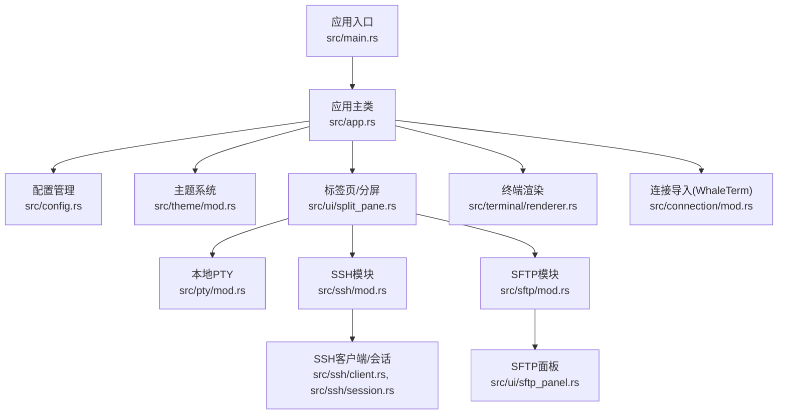
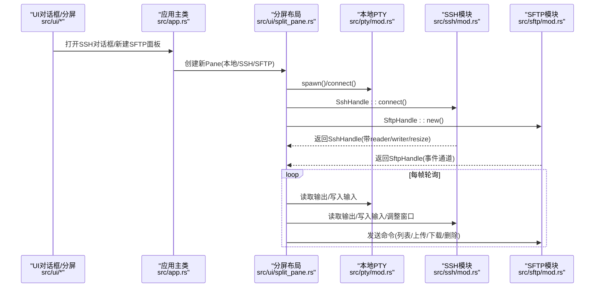
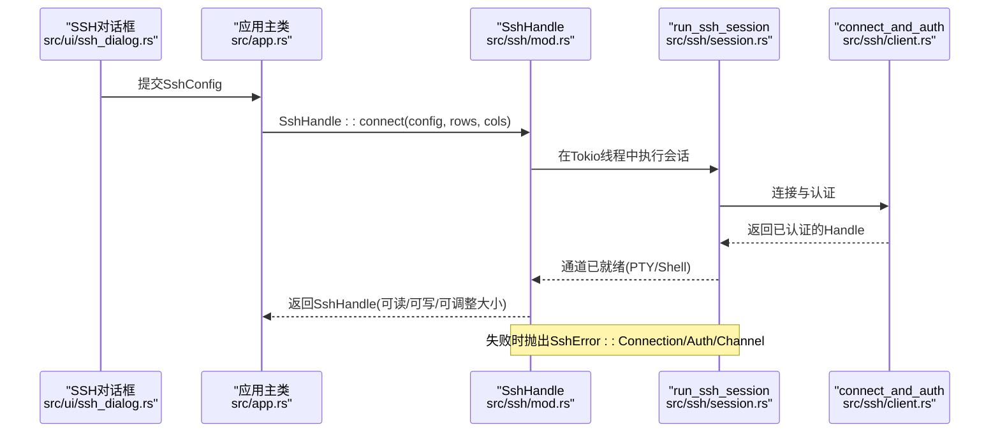
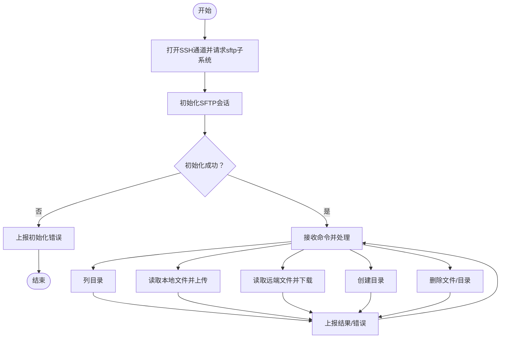
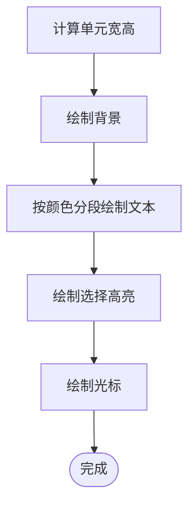
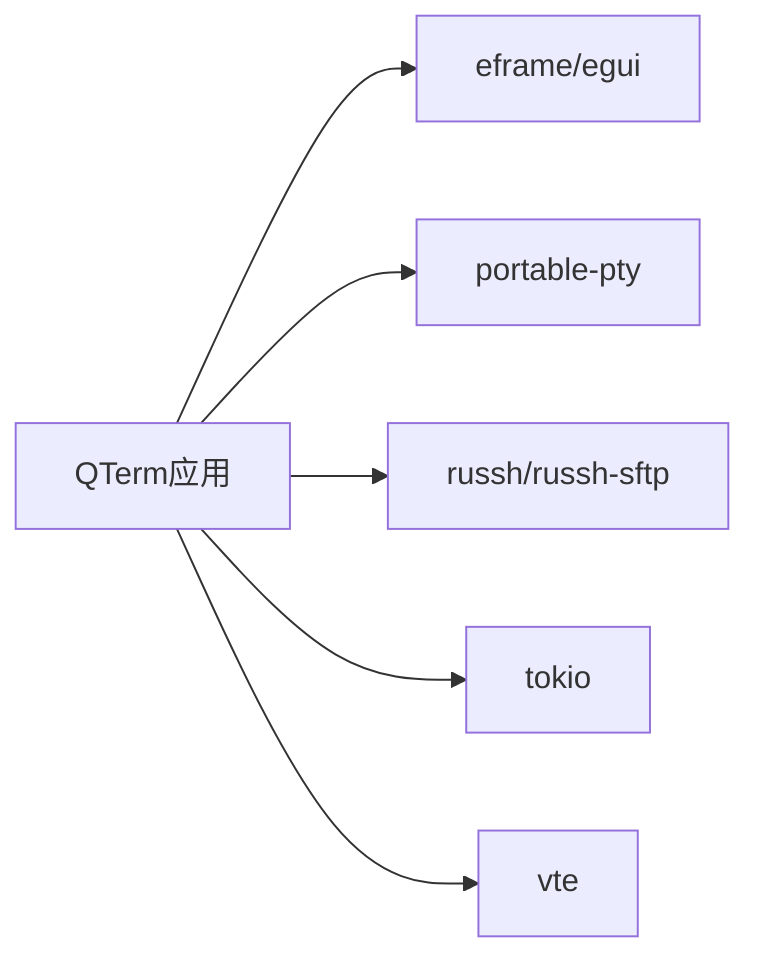

# 故障排除

<cite>
**本文引用的文件**
- [src/main.rs](file://src/main.rs)
- [src/app.rs](file://src/app.rs)
- [src/config.rs](file://src/config.rs)
- [src/connection/mod.rs](file://src/connection/mod.rs)
- [src/ssh/mod.rs](file://src/ssh/mod.rs)
- [src/ssh/client.rs](file://src/ssh/client.rs)
- [src/ssh/session.rs](file://src/ssh/session.rs)
- [src/sftp/mod.rs](file://src/sftp/mod.rs)
- [src/ui/ssh_dialog.rs](file://src/ui/ssh_dialog.rs)
- [src/ui/sftp_panel.rs](file://src/ui/sftp_panel.rs)
- [src/ui/split_pane.rs](file://src/ui/split_pane.rs)
- [src/pty/mod.rs](file://src/pty/mod.rs)
- [src/tabs/tab_item.rs](file://src/tabs/tab_item.rs)
- [src/terminal/renderer.rs](file://src/terminal/renderer.rs)
- [src/theme/mod.rs](file://src/theme/mod.rs)
- [Cargo.toml](file://Cargo.toml)
</cite>

## 目录
1. [简介](#简介)
2. [项目结构](#项目结构)
3. [核心组件](#核心组件)
4. [架构总览](#架构总览)
5. [详细组件分析与故障排除](#详细组件分析与故障排除)
6. [依赖关系分析](#依赖关系分析)
7. [性能考虑](#性能考虑)
8. [故障排除指南](#故障排除指南)
9. [结论](#结论)
10. [附录](#附录)

## 简介
本指南面向QTerm用户与维护者，提供系统化的故障排除方法，覆盖连接失败、渲染异常、性能问题、SSH/SFTP诊断、配置问题、系统级问题以及用户反馈与报告流程。文档基于仓库中的实际代码实现，结合模块职责与数据流，给出可操作的定位与修复建议。

## 项目结构
QTerm采用模块化设计，核心模块包括：应用入口与生命周期、配置与主题、标签页与分屏布局、本地PTY、SSH/SFTP会话、终端渲染与UI交互等。整体以egui/eframe为UI框架，Tokio异步运行时驱动SSH/SFTP任务，portable-pty提供本地伪终端能力。

**图表来源**
- [src/main.rs:1-87](file://src/main.rs#L1-L87)
- [src/app.rs:1-120](file://src/app.rs#L1-L120)
- [src/config.rs:1-127](file://src/config.rs#L1-L127)
- [src/theme/mod.rs:1-71](file://src/theme/mod.rs#L1-L71)
- [src/ui/split_pane.rs:1-60](file://src/ui/splitpane.rs#L1-L60)
- [src/pty/mod.rs:1-40](file://src/pty/mod.rs#L1-L40)
- [src/ssh/mod.rs:1-60](file://src/ssh/mod.rs#L1-L60)
- [src/sftp/mod.rs:1-60](file://src/sftp/mod.rs#L1-L60)
- [src/ssh/client.rs:1-54](file://src/ssh/client.rs#L1-L54)
- [src/ssh/session.rs:1-40](file://src/ssh/session.rs#L1-L40)
- [src/ui/sftp_panel.rs:1-45](file://src/ui/sftp_panel.rs#L1-L45)
- [src/terminal/renderer.rs:1-40](file://src/terminal/renderer.rs#L1-L40)
- [src/connection/mod.rs:1-30](file://src/connection/mod.rs#L1-L30)

**章节来源**
- [src/main.rs:1-87](file://src/main.rs#L1-L87)
- [src/app.rs:1-120](file://src/app.rs#L1-L120)
- [src/config.rs:1-127](file://src/config.rs#L1-L127)
- [src/theme/mod.rs:1-71](file://src/theme/mod.rs#L1-L71)
- [src/ui/split_pane.rs:1-60](file://src/ui/split_pane.rs#L1-L60)
- [src/pty/mod.rs:1-40](file://src/pty/mod.rs#L1-L40)
- [src/ssh/mod.rs:1-60](file://src/ssh/mod.rs#L1-L60)
- [src/sftp/mod.rs:1-60](file://src/sftp/mod.rs#L1-L60)
- [src/ssh/client.rs:1-54](file://src/ssh/client.rs#L1-L54)
- [src/ssh/session.rs:1-40](file://src/ssh/session.rs#L1-L40)
- [src/ui/sftp_panel.rs:1-45](file://src/ui/sftp_panel.rs#L1-L45)
- [src/terminal/renderer.rs:1-40](file://src/terminal/renderer.rs#L1-L40)
- [src/connection/mod.rs:1-30](file://src/connection/mod.rs#L1-L30)

## 核心组件
- 应用入口与窗口管理：负责加载配置、构建窗口、启动渲染循环，并在退出时持久化窗口状态。
- 配置与主题：管理窗口位置尺寸、主题、字体、回滚缓冲等；主题系统支持明暗切换。
- 标签页与分屏：支持本地/SSH终端与SFTP面板的多窗格布局与切换。
- 本地PTY：通过portable-pty创建子进程伪终端，读写数据流。
- SSH/SFTP：基于russh/russh-sftp，提供会话建立、认证、PTY请求、SFTP子系统与文件操作。
- 终端渲染：根据字体度量计算网格尺寸，绘制字符、背景色、选择高亮与光标。
- UI对话框：SSH连接对话框用于输入主机、端口、用户名与认证方式；SFTP面板用于浏览与传输文件。

**章节来源**
- [src/main.rs:51-87](file://src/main.rs#L51-L87)
- [src/app.rs:60-120](file://src/app.rs#L60-L120)
- [src/config.rs:37-127](file://src/config.rs#L37-L127)
- [src/theme/mod.rs:13-62](file://src/theme/mod.rs#L13-L62)
- [src/ui/split_pane.rs:12-60](file://src/ui/split_pane.rs#L12-L60)
- [src/pty/mod.rs:9-40](file://src/pty/mod.rs#L9-L40)
- [src/ssh/mod.rs:16-60](file://src/ssh/mod.rs#L16-L60)
- [src/sftp/mod.rs:7-40](file://src/sftp/mod.rs#L7-L40)
- [src/terminal/renderer.rs:7-40](file://src/terminal/renderer.rs#L7-L40)
- [src/ui/ssh_dialog.rs:10-40](file://src/ui/ssh_dialog.rs#L10-L40)
- [src/ui/sftp_panel.rs:11-45](file://src/ui/sftp_panel.rs#L11-L45)

## 架构总览
下图展示从UI到后端的关键调用链：应用层触发动作，分屏模块创建终端或SFTP面板，本地终端通过PTY读写，远程终端通过SSH会话与SFTP子系统进行数据与文件操作。

**图表来源**
- [src/app.rs:505-512](file://src/app.rs#L505-L512)
- [src/ui/split_pane.rs:28-60](file://src/ui/split_pane.rs#L28-L60)
- [src/pty/mod.rs:17-40](file://src/pty/mod.rs#L17-L40)
- [src/ssh/mod.rs:60-95](file://src/ssh/mod.rs#L60-L95)
- [src/sftp/mod.rs:39-60](file://src/sftp/mod.rs#L39-L60)

## 详细组件分析与故障排除

### SSH连接问题排查
常见症状：连接超时、认证失败、协议错误、无法打开PTY或Shell。

- 连接失败
  - 检查主机名/端口与网络连通性；确认防火墙策略。
  - 查看错误类型：SshError::Connection，通常来自底层russh连接或握手阶段。
  - 参考路径：[连接与错误类型定义:31-48](file://src/ssh/mod.rs#L31-L48)，[会话建立与错误映射:18-29](file://src/ssh/session.rs#L18-L29)。

- 认证失败
  - 密码认证：确认用户名与密码正确；检查目标服务器的认证策略。
  - 私钥认证：确认私钥路径与可访问性；若需要口令，确保已填写。
  - 参考路径：[认证流程与错误映射:30-50](file://src/ssh/client.rs#L30-L50)。

- 协议错误/PTY/Shell请求失败
  - 若PTY或Shell请求失败，通常发生在会话建立后的通道阶段。
  - 参考路径：[PTY与Shell请求:31-39](file://src/ssh/session.rs#L31-L39)。

- 会话生命周期与断开
  - SshHandle内部通过Alive原子标志控制循环；断开时发送EOF并关闭会话。
  - 参考路径：[会话主循环与断开:41-75](file://src/ssh/session.rs#L41-L75)，[SshHandle生命周期:105-112](file://src/ssh/mod.rs#L105-L112)。

**图表来源**
- [src/ui/ssh_dialog.rs:104-130](file://src/ui/ssh_dialog.rs#L104-L130)
- [src/app.rs:505-512](file://src/app.rs#L505-L512)
- [src/ssh/mod.rs:60-95](file://src/ssh/mod.rs#L60-L95)
- [src/ssh/session.rs:9-29](file://src/ssh/session.rs#L9-L29)
- [src/ssh/client.rs:20-53](file://src/ssh/client.rs#L20-L53)

**章节来源**
- [src/ui/ssh_dialog.rs:104-130](file://src/ui/ssh_dialog.rs#L104-L130)
- [src/ssh/mod.rs:31-48](file://src/ssh/mod.rs#L31-L48)
- [src/ssh/session.rs:18-39](file://src/ssh/session.rs#L18-L39)
- [src/ssh/client.rs:30-50](file://src/ssh/client.rs#L30-L50)
- [src/app.rs:505-512](file://src/app.rs#L505-L512)

### SFTP传输问题诊断
常见症状：无法列出目录、上传/下载失败、创建目录/删除失败、连接超时或断开。

- 连接与子系统
  - SFTP通过SSH通道上的“sftp”子系统初始化；若子系统请求或会话初始化失败，将上报错误。
  - 参考路径：[子系统请求与会话初始化:104-125](file://src/sftp/mod.rs#L104-L125)。

- 列表/上传/下载/删除
  - 列表：读取目录项并转换为FileEntry列表；失败时返回错误事件。
  - 上传：先读取本地文件，再写入远端；失败时返回错误事件。
  - 下载：从远端读取数据，写入本地文件；失败时返回错误事件。
  - 删除/创建：按参数区分文件或目录；失败时返回错误事件。
  - 参考路径：[命令处理分支:142-204](file://src/sftp/mod.rs#L142-L204)。

- 生命周期与断开
  - SftpHandle内部维护Alive标志与事件通道；断开时发送Disconnect命令并关闭会话。
  - 参考路径：[SftpHandle生命周期:39-60](file://src/sftp/mod.rs#L39-L60)，[断开处理:92-95](file://src/sftp/mod.rs#L92-L95)。

**图表来源**
- [src/sftp/mod.rs:98-140](file://src/sftp/mod.rs#L98-L140)
- [src/sftp/mod.rs:142-204](file://src/sftp/mod.rs#L142-L204)

**章节来源**
- [src/sftp/mod.rs:98-140](file://src/sftp/mod.rs#L98-L140)
- [src/sftp/mod.rs:142-204](file://src/sftp/mod.rs#L142-L204)

### 终端渲染问题调试
常见症状：字符显示异常、颜色不正确、光标不可见、选择高亮错位、字体过小或过大。

- 字体与度量
  - 渲染前根据monospace字体计算单元宽高；若字体未找到或度量异常，可能导致行列数计算偏差。
  - 参考路径：[尺寸计算:21-34](file://src/terminal/renderer.rs#L21-L34)。

- 文本与颜色
  - 文本按连续同色段绘制，避免逐字符绘制；背景色与前景色根据属性与反显规则解析。
  - 参考路径：[文本与背景绘制:54-97](file://src/terminal/renderer.rs#L54-L97)，[颜色解析:169-183](file://src/terminal/renderer.rs#L169-L183)。

- 选择高亮与光标
  - 选择区域按行绘制矩形高亮，随后重绘选区内文本；光标绘制在当前行列，必要时叠加字符。
  - 参考路径：[选择高亮:99-136](file://src/terminal/renderer.rs#L99-L136)，[光标绘制:138-159](file://src/terminal/renderer.rs#L138-L159)。

- 字体缩放与主题
  - 应用层支持Ctrl+±调整字体大小；主题系统提供明暗模式切换。
  - 参考路径：[字体缩放动作:335-344](file://src/app.rs#L335-L344)，[主题切换:48-53](file://src/theme/mod.rs#L48-L53)。

**图表来源**
- [src/terminal/renderer.rs:36-167](file://src/terminal/renderer.rs#L36-L167)

**章节来源**
- [src/terminal/renderer.rs:21-167](file://src/terminal/renderer.rs#L21-L167)
- [src/app.rs:335-344](file://src/app.rs#L335-L344)
- [src/theme/mod.rs:48-53](file://src/theme/mod.rs#L48-L53)

### 配置问题解决
常见症状：配置文件损坏、权限不足导致无法保存、与WhaleTerm配置冲突。

- 配置文件位置与格式
  - Windows: %APPDATA%\qterm\config.ini；其他: ~/.config/qterm/config.ini。
  - 格式为简单键值对，忽略注释与空行。
  - 参考路径：[配置目录与路径:6-35](file://src/config.rs#L6-L35)，[INI解析:129-143](file://src/config.rs#L129-L143)。

- WhaleTerm偏好导入
  - 从WhaleTerm preferences.json读取字体与主题；若文件缺失或解析失败，使用默认值。
  - 参考路径：[WhaleTerm路径与解析:184-204](file://src/config.rs#L184-L204)，[偏好加载:242-280](file://src/config.rs#L242-L280)。

- 连接导入与解密
  - 从WhaleTerm connections.json导入连接；密码使用AES-256-CFB解密（基于主板序列派生密钥）。
  - 参考路径：[连接导入:27-55](file://src/connection/mod.rs#L27-L55)，[解密流程:57-89](file://src/connection/mod.rs#L57-L89)，[密钥派生:91-127](file://src/connection/mod.rs#L91-L127)。

- 权限与兼容性
  - 若无法写入配置目录，检查用户权限与磁盘空间；跨平台字体路径差异需注意。
  - 参考路径：[配置保存:100-126](file://src/config.rs#L100-L126)，[字体路径查找:198-238](file://src/app.rs#L198-L238)。

**章节来源**
- [src/config.rs:6-35](file://src/config.rs#L6-L35)
- [src/config.rs:129-143](file://src/config.rs#L129-L143)
- [src/config.rs:184-204](file://src/config.rs#L184-L204)
- [src/config.rs:242-280](file://src/config.rs#L242-L280)
- [src/connection/mod.rs:27-55](file://src/connection/mod.rs#L27-L55)
- [src/connection/mod.rs:57-89](file://src/connection/mod.rs#L57-L89)
- [src/connection/mod.rs:91-127](file://src/connection/mod.rs#L91-L127)
- [src/app.rs:198-238](file://src/app.rs#L198-L238)

### 系统级问题排查
常见症状：内存占用高、CPU占用异常、窗口位置/尺寸异常、崩溃或卡死。

- 窗口位置与可见性
  - Windows使用Win32 API检测窗口矩形是否在任一显示器上；非Windows使用坐标范围判断。
  - 参考路径：[位置可见性检测:17-47](file://src/main.rs#L17-L47)。

- 生命周期与退出
  - 应用退出时保存窗口位置、尺寸、最大化状态与主题；关闭所有标签页与后端资源。
  - 参考路径：[退出持久化](file://src/app.rs:518-L528)。

- 资源清理
  - 分屏Pane关闭时分别释放本地PTY或SSH/SFTP资源；Drop实现确保子进程被终止。
  - 参考路径：[Pane关闭与资源释放:118-129](file://src/ui/split_pane.rs#L118-L129)，[PTY Drop:101-105](file://src/pty/mod.rs#L101-L105)。

**章节来源**
- [src/main.rs:17-47](file://src/main.rs#L17-L47)
- [src/app.rs:518-528](file://src/app.rs#L518-L528)
- [src/ui/split_pane.rs:118-129](file://src/ui/split_pane.rs#L118-L129)
- [src/pty/mod.rs#L101-L105:101-105](file://src/pty/mod.rs#L101-L105)

## 依赖关系分析
- 运行时与异步
  - Tokio运行时用于SSH/SFTP任务；SSH模块提供全局OnceLock运行时实例。
  - 参考路径：[运行时获取:8-14](file://src/ssh/mod.rs#L8-L14)。

- 第三方库
  - eframe/egui：UI框架与渲染；portable-pty：本地伪终端；russh/russh-sftp：SSH/SFTP；vte：VT解析；tokio：异步运行时。
  - 参考路径：[依赖清单:8-25](file://Cargo.toml#L8-L25)。

**图表来源**
- [Cargo.toml:8-25](file://Cargo.toml#L8-L25)
- [src/ssh/mod.rs:8-14](file://src/ssh/mod.rs#L8-L14)

**章节来源**
- [Cargo.toml:8-25](file://Cargo.toml#L8-L25)
- [src/ssh/mod.rs:8-14](file://src/ssh/mod.rs#L8-L14)

## 性能考虑
- 渲染优化
  - 文本按颜色分段绘制，减少绘制调用次数；背景色仅在非默认时绘制。
  - 参考路径：[文本与背景绘制:54-97](file://src/terminal/renderer.rs#L54-L97)。

- 异步与通道
  - SSH/SFTP使用MPSC通道与Tokio select!处理多路复用；合理设置缓冲大小避免阻塞。
  - 参考路径：[SshHandle通道:60-95](file://src/ssh/mod.rs#L60-L95)，[SftpHandle通道:40-60](file://src/sftp/mod.rs#L40-L60)。

- 字体与度量
  - 字体度量一次性计算；避免在渲染循环中频繁切换字体族。
  - 参考路径：[尺寸计算:21-34](file://src/terminal/renderer.rs#L21-L34)，[字体配置:95-155](file://src/app.rs#L95-L155)。

- 资源限制
  - 分屏最大6个Pane；PTY/SFTP任务在Alive标志控制下优雅退出。
  - 参考路径：[Pane数量限制:162-182](file://src/ui/split_pane.rs#L162-L182)，[Alive标志:46-51](file://src/sftp/mod.rs#L46-L51)。

**章节来源**
- [src/terminal/renderer.rs:21-97](file://src/terminal/renderer.rs#L21-L97)
- [src/ssh/mod.rs:60-95](file://src/ssh/mod.rs#L60-L95)
- [src/sftp/mod.rs:40-60](file://src/sftp/mod.rs#L40-L60)
- [src/app.rs:95-155](file://src/app.rs#L95-L155)
- [src/ui/split_pane.rs:162-182](file://src/ui/split_pane.rs#L162-L182)
- [src/sftp/mod.rs:46-51](file://src/sftp/mod.rs#L46-L51)

## 故障排除指南

### 一、连接失败
- 步骤
  1) 检查主机名/端口与网络连通性；尝试telnet或nc测试端口。
  2) 确认SSH服务端允许的认证方式与密钥格式。
  3) 查看UI状态提示或错误类型：Connection/Auth/Channel。
  4) 若使用私钥，确认路径与权限；如需口令，确保已正确填写。
  5) 观察会话是否在PTY/Shell请求阶段失败。
- 定位参考
  - [SshError类型:31-48](file://src/ssh/mod.rs#L31-L48)
  - [connect_and_auth:20-53](file://src/ssh/client.rs#L20-L53)
  - [run_ssh_session:18-39](file://src/ssh/session.rs#L18-L39)

**章节来源**
- [src/ssh/mod.rs:31-48](file://src/ssh/mod.rs#L31-L48)
- [src/ssh/client.rs:20-53](file://src/ssh/client.rs#L20-L53)
- [src/ssh/session.rs:18-39](file://src/ssh/session.rs#L18-L39)

### 二、渲染异常
- 步骤
  1) 调整字体大小（Ctrl+±），观察是否恢复正常。
  2) 切换明/暗主题，确认颜色对比度问题。
  3) 检查是否有长单词/特殊字符导致换行异常。
  4) 确认窗口尺寸变化后是否重新计算行列数。
- 定位参考
  - [字体缩放:335-344](file://src/app.rs#L335-L344)
  - [主题切换:48-53](file://src/theme/mod.rs#L48-L53)
  - [尺寸计算:21-34](file://src/terminal/renderer.rs#L21-L34)
  - [文本绘制:54-97](file://src/terminal/renderer.rs#L54-L97)

**章节来源**
- [src/app.rs:335-344](file://src/app.rs#L335-L344)
- [src/theme/mod.rs:48-53](file://src/theme/mod.rs#L48-L53)
- [src/terminal/renderer.rs:21-97](file://src/terminal/renderer.rs#L21-L97)

### 三、性能问题
- 步骤
  1) 减少分屏Pane数量，避免过多绘制与通道切换。
  2) 降低字体大小或禁用复杂主题，减少绘制成本。
  3) 检查是否有大量连续同色文本，利用现有分段绘制机制。
  4) 关闭不必要的SFTP面板或停止大文件传输。
- 定位参考
  - [Pane数量限制:162-182](file://src/ui/split_pane.rs#L162-L182)
  - [渲染优化:54-97](file://src/terminal/renderer.rs#L54-L97)

**章节来源**
- [src/ui/split_pane.rs:162-182](file://src/ui/split_pane.rs#L162-L182)
- [src/terminal/renderer.rs:54-97](file://src/terminal/renderer.rs#L54-L97)

### 四、SSH/SFTP诊断清单
- SSH
  - 认证方式：密码 vs 私钥；私钥口令是否正确。
  - 会话：PTY/Shell请求是否成功；通道是否正常收发数据。
  - 断开：EOF与disconnect是否正确发送。
- SFTP
  - 子系统：sftp子系统请求与会话初始化是否成功。
  - 命令：列表/上传/下载/删除是否返回错误事件；错误信息是否明确。
  - 生命周期：Alive标志与断开命令是否触发。
- 定位参考
  - [SshHandle:60-117](file://src/ssh/mod.rs#L60-L117)
  - [SftpHandle:39-96](file://src/sftp/mod.rs#L39-L96)
  - [run_ssh_session:41-76](file://src/ssh/session.rs#L41-L76)
  - [sftp_task:98-140](file://src/sftp/mod.rs#L98-L140)

**章节来源**
- [src/ssh/mod.rs:60-117](file://src/ssh/mod.rs#L60-L117)
- [src/sftp/mod.rs:39-96](file://src/sftp/mod.rs#L39-L96)
- [src/ssh/session.rs:41-76](file://src/ssh/session.rs#L41-L76)
- [src/sftp/mod.rs:98-140](file://src/sftp/mod.rs#L98-L140)

### 五、配置问题
- 步骤
  1) 检查配置文件是否存在且可读写；确认路径与权限。
  2) 若从WhaleTerm导入连接，确认connections.json格式与密码解密是否成功。
  3) 更改配置后重启应用验证生效。
- 定位参考
  - [配置保存/加载:68-126](file://src/config.rs#L68-L126)
  - [WhaleTerm偏好加载:242-280](file://src/config.rs#L242-L280)
  - [连接导入与解密:27-89](file://src/connection/mod.rs#L27-L89)

**章节来源**
- [src/config.rs:68-126](file://src/config.rs#L68-L126)
- [src/config.rs:242-280](file://src/config.rs#L242-L280)
- [src/connection/mod.rs:27-89](file://src/connection/mod.rs#L27-L89)

### 六、系统级问题
- 步骤
  1) 窗口位置异常：检查显示器配置与可见性检测逻辑。
  2) 资源占用：确认分屏数量与渲染负载；关闭多余Pane。
  3) 崩溃/卡死：查看会话Alive标志与通道是否阻塞；必要时强制断开。
- 定位参考
  - [位置可见性检测:17-47](file://src/main.rs#L17-L47)
  - [Pane关闭与资源释放:118-129](file://src/ui/split_pane.rs#L118-L129)
  - [PTY Drop:101-105](file://src/pty/mod.rs#L101-L105)

**章节来源**
- [src/main.rs:17-47](file://src/main.rs#L17-L47)
- [src/ui/split_pane.rs:118-129](file://src/ui/split_pane.rs#L118-L129)
- [src/pty/mod.rs#L101-L105:101-105](file://src/pty/mod.rs#L101-L105)

### 七、日志与调试工具
- 日志
  - SSH会话错误会在运行线程中打印；SFTP命令失败通过事件上报。
  - 参考路径：[SSH会话错误打印:79-82](file://src/ssh/mod.rs#L79-L82)，[SFTP错误事件:164-167](file://src/sftp/mod.rs#L164-L167)。
- 调试
  - 使用UI状态栏与对话框提示快速定位问题；逐步缩小到具体模块。
  - 参考路径：[SSH对话框状态:87-100](file://src/ui/ssh_dialog.rs#L87-L100)，[SFTP面板状态:49-103](file://src/ui/sftp_panel.rs#L49-L103)。

**章节来源**
- [src/ssh/mod.rs:79-82](file://src/ssh/mod.rs#L79-L82)
- [src/sftp/mod.rs:164-167](file://src/sftp/mod.rs#L164-L167)
- [src/ui/ssh_dialog.rs#L87-L100:87-100](file://src/ui/ssh_dialog.rs#L87-L100)
- [src/ui/sftp_panel.rs#L49-L103:49-103](file://src/ui/sftp_panel.rs#L49-L103)

### 八、用户反馈与问题报告流程
- 收集信息
  - 系统版本、QTerm版本、配置文件内容（脱敏敏感信息）、日志片段。
  - 重现步骤：连接/渲染/SFTP的具体操作顺序与结果。
- 报告渠道
  - 通过仓库Issue模板提交，附带上述信息与截图。
- 参考路径
  - [应用入口与窗口配置:51-87](file://src/main.rs#L51-L87)
  - [配置保存与加载:68-126](file://src/config.rs#L68-L126)

**章节来源**
- [src/main.rs:51-87](file://src/main.rs#L51-L87)
- [src/config.rs:68-126](file://src/config.rs#L68-L126)

## 结论
本指南基于QTerm的实际代码实现，提供了从UI到后端的全链路故障排除方法。通过理解模块职责、数据流与错误类型，用户可以快速定位问题并采取针对性措施。建议在日常使用中关注日志提示、合理配置与资源管理，以获得稳定流畅的终端体验。

## 附录
- 快速定位索引
  - SSH连接：[SshError:31-48](file://src/ssh/mod.rs#L31-L48)，[connect_and_auth:20-53](file://src/ssh/client.rs#L20-L53)，[run_ssh_session:18-39](file://src/ssh/session.rs#L18-L39)
  - SFTP传输：[SftpHandle:39-96](file://src/sftp/mod.rs#L39-L96)，[sftp_task:98-140](file://src/sftp/mod.rs#L98-L140)
  - 渲染问题：[renderer:21-167](file://src/terminal/renderer.rs#L21-L167)
  - 配置问题：[config:68-126](file://src/config.rs#L68-L126)，[connection导入:27-89](file://src/connection/mod.rs#L27-L89)