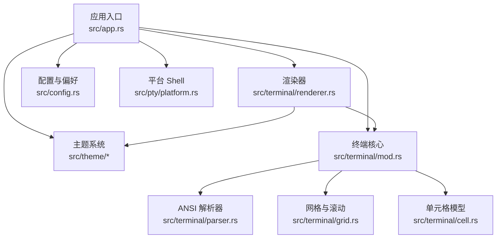
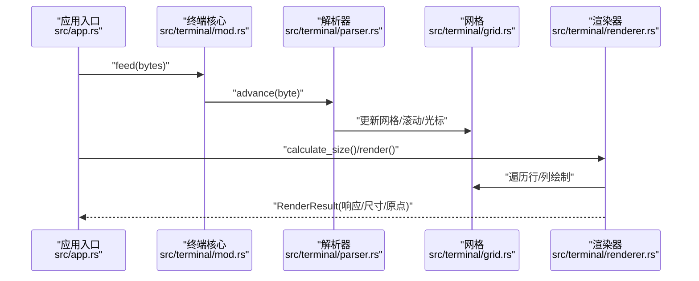
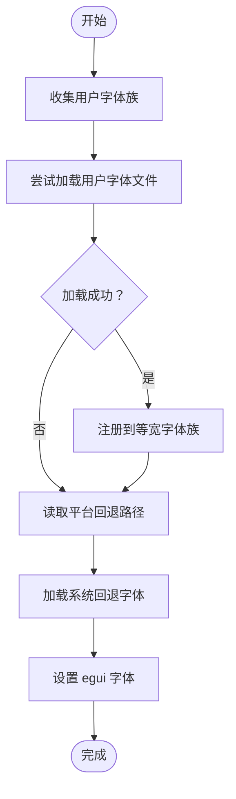
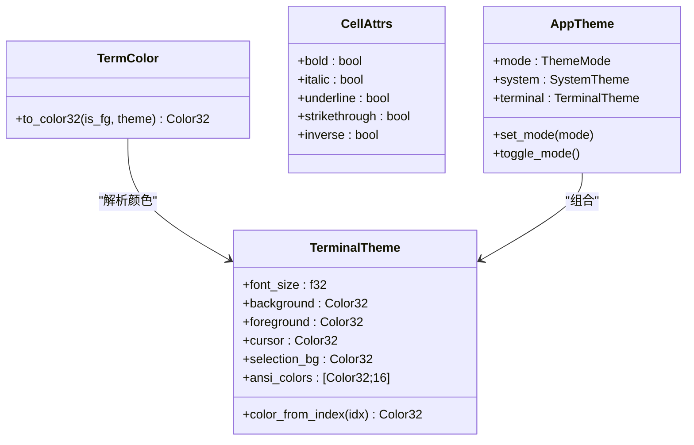
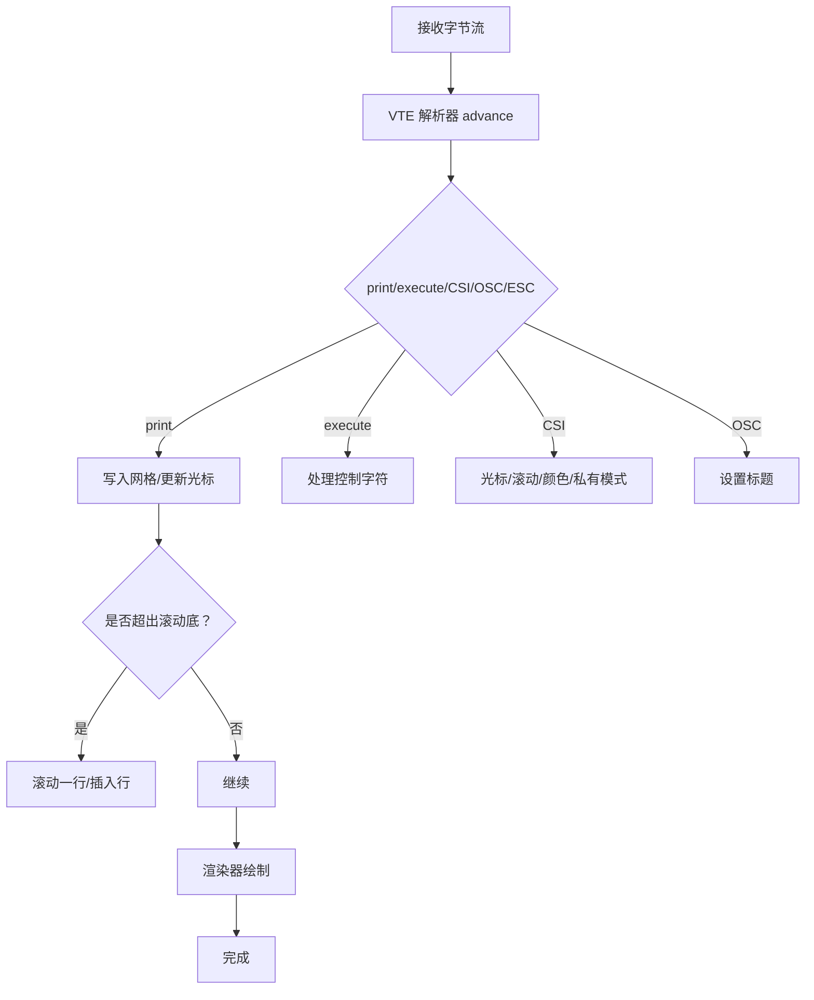
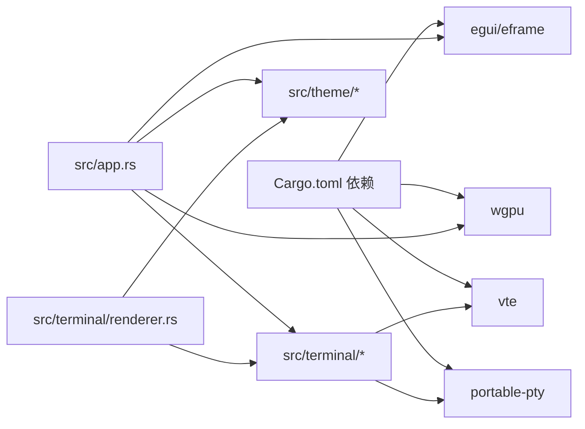

# 渲染问题

<cite>
**本文引用的文件**
- [src/app.rs](file://src/app.rs)
- [src/config.rs](file://src/config.rs)
- [src/terminal/mod.rs](file://src/terminal/mod.rs)
- [src/terminal/renderer.rs](file://src/terminal/renderer.rs)
- [src/terminal/grid.rs](file://src/terminal/grid.rs)
- [src/terminal/cell.rs](file://src/terminal/cell.rs)
- [src/terminal/parser.rs](file://src/terminal/parser.rs)
- [src/theme/mod.rs](file://src/theme/mod.rs)
- [src/theme/terminal.rs](file://src/theme/terminal.rs)
- [src/theme/system.rs](file://src/theme/system.rs)
- [Cargo.toml](file://Cargo.toml)
- [src/pty/platform.rs](file://src/pty/platform.rs)
</cite>

## 目录
1. [简介](#简介)
2. [项目结构](#项目结构)
3. [核心组件](#核心组件)
4. [架构总览](#架构总览)
5. [详细组件分析](#详细组件分析)
6. [依赖关系分析](#依赖关系分析)
7. [性能考量](#性能考量)
8. [故障排除指南](#故障排除指南)
9. [结论](#结论)
10. [附录](#附录)

## 简介
本指南聚焦于 QTerm 的终端渲染问题，覆盖以下方面：
- 字体显示异常：字体加载失败、字符渲染错乱、CJK 字符显示问题、字体回退机制失效
- 颜色渲染问题：主题颜色不正确、ANSI 转义码解析错误、高对比度模式下的显示异常
- 终端网格渲染问题：光标位置错误、文本重叠、换行符处理异常、滚动缓冲区显示问题
- 渲染性能优化：帧率下降、内存占用过高、CPU 使用率异常
- 跨平台渲染差异：Windows、macOS、Linux 平台特有的渲染问题与解决方案

## 项目结构
QTerm 的渲染子系统主要由以下模块组成：
- 应用入口与 UI 驱动：负责窗口、字体初始化、主题应用、渲染调度
- 终端核心：解析 ANSI 转义序列、维护网格与光标、处理滚动区域
- 渲染器：基于 egui 的绘制管线，负责背景、文本、选区、光标渲染
- 主题系统：终端主题（颜色、光标、选区）与系统主题（UI 控件颜色）

**图表来源**
- [src/app.rs:1-120](file://src/app.rs#L1-L120)
- [src/terminal/mod.rs:1-60](file://src/terminal/mod.rs#L1-L60)
- [src/terminal/parser.rs:1-60](file://src/terminal/parser.rs#L1-L60)
- [src/terminal/grid.rs:1-40](file://src/terminal/grid.rs#L1-L40)
- [src/terminal/cell.rs:1-40](file://src/terminal/cell.rs#L1-L40)
- [src/terminal/renderer.rs:1-60](file://src/terminal/renderer.rs#L1-L60)
- [src/theme/mod.rs:1-40](file://src/theme/mod.rs#L1-L40)
- [src/config.rs:1-60](file://src/config.rs#L1-L60)
- [src/pty/platform.rs:1-21](file://src/pty/platform.rs#L1-L21)

**章节来源**
- [src/app.rs:107-171](file://src/app.rs#L107-L171)
- [src/terminal/mod.rs:24-63](file://src/terminal/mod.rs#L24-L63)
- [src/terminal/renderer.rs:44-180](file://src/terminal/renderer.rs#L44-L180)
- [src/theme/mod.rs:14-71](file://src/theme/mod.rs#L14-L71)
- [src/config.rs:37-98](file://src/config.rs#L37-L98)
- [src/pty/platform.rs:1-21](file://src/pty/platform.rs#L1-L21)

## 核心组件
- 应用入口与字体/主题初始化
  - 字体加载：跨平台字体回退、用户字体优先、等宽字体族注册
  - 主题应用：系统主题与终端主题组合，全局 egui 视觉风格
- 终端核心
  - ANSI 解析：print、execute、CSI、OSC、ESC 序列处理
  - 网格与滚动：屏幕网格、回滚缓冲区、滚动区域、插入/删除行
  - 光标与选择：可见性、位置、选区范围、标准化选择
- 渲染器
  - 尺寸计算：以 'M' 字形宽为基准，行高为字体大小的 1.4 倍
  - 绘制流程：背景、单元格背景、文本、选区、光标
  - 颜色解析：前景/背景色、反色模式、选区与光标强调色

**章节来源**
- [src/app.rs:107-171](file://src/app.rs#L107-L171)
- [src/terminal/mod.rs:24-200](file://src/terminal/mod.rs#L24-L200)
- [src/terminal/parser.rs:10-233](file://src/terminal/parser.rs#L10-L233)
- [src/terminal/grid.rs:16-148](file://src/terminal/grid.rs#L16-L148)
- [src/terminal/renderer.rs:25-180](file://src/terminal/renderer.rs#L25-L180)
- [src/theme/terminal.rs:5-102](file://src/theme/terminal.rs#L5-L102)

## 架构总览
渲染流程从应用入口开始，经由终端核心解析 ANSI 序列，更新网格与光标状态，最终由渲染器将网格内容绘制到 egui 画布。

**图表来源**
- [src/app.rs:436-575](file://src/app.rs#L436-L575)
- [src/terminal/mod.rs:67-74](file://src/terminal/mod.rs#L67-L74)
- [src/terminal/parser.rs:10-233](file://src/terminal/parser.rs#L10-L233)
- [src/terminal/grid.rs:16-148](file://src/terminal/grid.rs#L16-L148)
- [src/terminal/renderer.rs:25-180](file://src/terminal/renderer.rs#L25-L180)

## 详细组件分析

### 字体与字体回退机制
- 字体加载策略
  - 收集用户配置的字体族，尝试加载用户字体文件，并同时注册到比例与等宽字体族
  - 跨平台系统回退：Windows 使用系统字体与 Consolas；macOS 使用 PingFang；Linux 使用 Noto CJK
  - 若用户字体加载失败，系统回退字体仍会注册到等宽字体族，保证等宽渲染
- CJK 字符支持
  - 通过系统回退字体路径加载 CJK 字体，避免字符缺失
  - 若目标字符在首选字体中不可见，egui 会自动回退到等宽字体族中的可用字体
- 故障表现与定位
  - 字体加载失败：用户字体未找到或权限不足，导致渲染为方块或缺失字符
  - 字体回退失效：等宽字体族未正确注册，导致字符宽度不一致，出现对齐错位
  - CJK 显示异常：系统回退路径不正确或字体文件损坏

**图表来源**
- [src/app.rs:109-171](file://src/app.rs#L109-L171)

**章节来源**
- [src/app.rs:109-171](file://src/app.rs#L109-L171)

### 颜色与主题系统
- 颜色来源
  - 终端主题：背景、前景、光标、选区、ANSI 16 色映射
  - 颜色解析：Default、Indexed、Rgb 三种类型，结合反色模式与主题映射
- 高对比度与主题切换
  - 系统主题统一应用到 egui 全局样式，确保 UI 与终端颜色一致性
  - 主题切换时需同步更新 egui 视觉风格与终端字体大小

**图表来源**
- [src/terminal/cell.rs:27-53](file://src/terminal/cell.rs#L27-L53)
- [src/theme/terminal.rs:5-102](file://src/theme/terminal.rs#L5-L102)
- [src/theme/mod.rs:14-71](file://src/theme/mod.rs#L14-L71)

**章节来源**
- [src/terminal/cell.rs:27-53](file://src/terminal/cell.rs#L27-L53)
- [src/theme/terminal.rs:5-102](file://src/theme/terminal.rs#L5-L102)
- [src/theme/system.rs:158-291](file://src/theme/system.rs#L158-L291)

### ANSI 解析与网格渲染
- 解析流程
  - print：在光标处写入字符，更新属性，光标右移，必要时换行与滚动
  - execute：处理退格、制表、换行、回车等控制字符
  - CSI：光标移动、清屏、滚动、颜色设置、私有模式（如备用屏、光标显隐）
  - OSC：设置标题等
- 网格与滚动
  - 屏幕网格与回滚缓冲区分离，滚动时将顶行移入回滚缓冲区
  - 插入/删除行在滚动区域内进行，保持可视区域稳定
- 渲染顺序
  - 背景 → 非默认背景单元格背景 → 文本（按前景色分段合并绘制）→ 选区背景与文本 → 光标背景与字符

**图表来源**
- [src/terminal/mod.rs:67-74](file://src/terminal/mod.rs#L67-L74)
- [src/terminal/parser.rs:10-233](file://src/terminal/parser.rs#L10-L233)
- [src/terminal/grid.rs:46-102](file://src/terminal/grid.rs#L46-L102)
- [src/terminal/renderer.rs:64-180](file://src/terminal/renderer.rs#L64-L180)

**章节来源**
- [src/terminal/parser.rs:10-233](file://src/terminal/parser.rs#L10-L233)
- [src/terminal/grid.rs:16-148](file://src/terminal/grid.rs#L16-L148)
- [src/terminal/renderer.rs:64-180](file://src/terminal/renderer.rs#L64-L180)

## 依赖关系分析
- 渲染依赖
  - 渲染器依赖终端网格与主题，主题依赖颜色解析与系统视觉风格
  - 应用入口负责字体与主题初始化，驱动渲染器与终端核心
- 外部依赖
  - egui/wgpu：UI 与 GPU 渲染后端
  - vte：ANSI 转义序列解析
  - portable-pty：本地终端进程管理

**图表来源**
- [Cargo.toml:8-25](file://Cargo.toml#L8-L25)
- [src/app.rs:1-15](file://src/app.rs#L1-L15)
- [src/terminal/renderer.rs:1-10](file://src/terminal/renderer.rs#L1-L10)

**章节来源**
- [Cargo.toml:8-25](file://Cargo.toml#L8-L25)
- [src/app.rs:1-15](file://src/app.rs#L1-L15)

## 性能考量
- 渲染优化
  - 文本绘制分段：连续相同前景色的单元格合并绘制，减少绘制调用次数
  - 单元格尺寸计算：以 'M' 字形宽为基准，行高固定比例，提升布局稳定性
- 资源与内存
  - 回滚缓冲区长度受配置控制，过大可能导致内存占用上升
  - 字体缓存与回退：避免重复加载字体，减少 IO 开销
- CPU 与帧率
  - 渲染循环中仅在尺寸变化或有输入时触发重绘
  - 通过 egui 的请求重绘机制降低无效刷新

**章节来源**
- [src/terminal/renderer.rs:80-106](file://src/terminal/renderer.rs#L80-L106)
- [src/app.rs:436-575](file://src/app.rs#L436-L575)
- [src/config.rs:37-66](file://src/config.rs#L37-L66)

## 故障排除指南

### 字体显示异常
- 症状
  - 字符显示为方块或缺失
  - CJK 字符显示为方块
  - 等宽字符宽度不一致，导致对齐错位
- 诊断步骤
  - 检查用户字体是否成功加载：确认字体文件存在且可读
  - 检查等宽字体族是否注册：渲染器使用等宽字体 ID
  - 检查平台回退路径：Windows、macOS、Linux 的回退字体路径是否存在
- 解决方案
  - 替换为有效字体文件，或移除无效字体配置
  - 确保字体文件被正确注册到等宽字体族
  - 验证系统回退字体路径与文件存在性，必要时手动安装字体

**章节来源**
- [src/app.rs:109-171](file://src/app.rs#L109-L171)
- [src/terminal/renderer.rs:25-40](file://src/terminal/renderer.rs#L25-L40)

### 字符渲染错乱
- 症状
  - 文本重叠、字符粘连
  - 光标位置与实际字符不匹配
- 诊断步骤
  - 检查 ANSI 解析是否正确处理换行与制表符
  - 检查滚动区域设置是否影响光标移动
  - 检查渲染器的单元格尺寸与 origin 偏移
- 解决方案
  - 确认 CSI J/K/L/M/S/T 等序列处理逻辑
  - 校正滚动区域边界，避免越界滚动
  - 校验行高与单元格宽计算，确保整数倍对齐

**章节来源**
- [src/terminal/parser.rs:34-61](file://src/terminal/parser.rs#L34-L61)
- [src/terminal/parser.rs:78-173](file://src/terminal/parser.rs#L78-L173)
- [src/terminal/renderer.rs:44-60](file://src/terminal/renderer.rs#L44-L60)

### CJK 字符显示问题
- 症状
  - 中文、日文、韩文字符显示为方块
- 诊断步骤
  - 检查系统回退字体路径是否正确
  - 确认字体文件包含 CJK 字符集
- 解决方案
  - 安装系统自带的 CJK 字体（Windows 的 msyh.ttc、macOS 的 PingFang、Linux 的 Noto CJK）
  - 在用户字体中提供 CJK 字符集，或调整回退顺序

**章节来源**
- [src/app.rs:146-168](file://src/app.rs#L146-L168)

### 字体回退机制失效
- 症状
  - 首选字体缺失或损坏，但未回退到等宽字体
- 诊断步骤
  - 检查字体数据是否成功加载到 egui
  - 检查等宽字体族是否包含回退字体
- 解决方案
  - 修复或替换字体文件
  - 确保回退字体被注册到等宽字体族

**章节来源**
- [src/app.rs:130-171](file://src/app.rs#L130-L171)

### 颜色渲染问题
- 症状
  - 主题颜色不正确、前景/背景色混乱
  - ANSI 颜色映射错误
  - 反色模式下颜色交换异常
- 诊断步骤
  - 检查 TerminalTheme 的颜色映射与解析逻辑
  - 检查反色标志位与颜色解析函数
  - 检查系统主题是否正确应用到 egui
- 解决方案
  - 校正 ANSI 颜色索引映射
  - 修正反色模式下的前景/背景交换逻辑
  - 切换主题后重新应用系统主题到 egui

**章节来源**
- [src/theme/terminal.rs:84-100](file://src/theme/terminal.rs#L84-L100)
- [src/terminal/cell.rs:36-52](file://src/terminal/cell.rs#L36-L52)
- [src/theme/system.rs:158-291](file://src/theme/system.rs#L158-L291)

### ANSI 转义码解析错误
- 症状
  - 光标跳转异常、滚动区域行为不符预期
  - 颜色设置不生效
- 诊断步骤
  - 检查 CSI 参数解析与动作分支
  - 检查私有模式（如 1049 备用屏）与光标可见性处理
  - 检查 OSC 标题设置逻辑
- 解决方案
  - 修正 CSI 动作分支与参数处理
  - 完善 ESC 索引/反向索引与全复位逻辑

**章节来源**
- [src/terminal/parser.rs:63-173](file://src/terminal/parser.rs#L63-L173)
- [src/terminal/parser.rs:175-193](file://src/terminal/parser.rs#L175-L193)
- [src/terminal/parser.rs:195-228](file://src/terminal/parser.rs#L195-L228)

### 终端网格渲染问题
- 症状
  - 文本重叠、选区背景错位、光标方块位置错误
- 诊断步骤
  - 检查渲染器的选区绘制与光标绘制逻辑
  - 检查网格尺寸与 origin 偏移
- 解决方案
  - 校正选区矩形计算与文本重绘顺序
  - 校正光标矩形与字符绘制的坐标计算

**章节来源**
- [src/terminal/renderer.rs:109-172](file://src/terminal/renderer.rs#L109-L172)

### 渲染性能优化
- 症状
  - 帧率下降、CPU 使用率异常、内存占用过高
- 诊断步骤
  - 检查渲染器绘制调用次数与文本分段合并
  - 检查回滚缓冲区长度与网格尺寸
  - 检查字体缓存与重复加载
- 解决方案
  - 保持文本分段合并策略，减少绘制调用
  - 调整回滚缓冲区长度，平衡历史记录与内存
  - 避免重复加载字体，确保字体缓存命中

**章节来源**
- [src/terminal/renderer.rs:80-106](file://src/terminal/renderer.rs#L80-L106)
- [src/config.rs:37-66](file://src/config.rs#L37-L66)
- [src/app.rs:109-171](file://src/app.rs#L109-L171)

### 跨平台渲染差异
- Windows
  - 默认 Shell：COMSPEC 或 powershell.exe
  - 字体回退：msyh.ttc、consola.ttf
- macOS
  - 默认 Shell：$SHELL 或 /bin/zsh
  - 字体回退：PingFang.ttc
- Linux
  - 默认 Shell：$SHELL 或 /bin/bash
  - 字体回退：Noto Sans CJK
- 解决方案
  - 在各平台验证回退字体路径与可用性
  - 针对平台特性调整字体大小与行高比例

**章节来源**
- [src/pty/platform.rs:1-21](file://src/pty/platform.rs#L1-L21)
- [src/app.rs:146-168](file://src/app.rs#L146-L168)

## 结论
QTerm 的渲染系统围绕“ANSI 解析 + 网格状态 + egui 渲染”的清晰分层构建。通过合理的字体回退、颜色解析与渲染优化策略，可以有效解决大多数渲染问题。跨平台差异主要体现在字体回退与默认 Shell 上，应结合平台特性进行针对性配置与验证。

## 附录
- 常用排查清单
  - 字体：用户字体是否加载、等宽字体族是否注册、回退路径是否存在
  - 颜色：ANSI 映射是否正确、反色模式是否生效、系统主题是否应用
  - 解析：CSI/OSC/ESC 序列是否完整处理、滚动区域是否越界
  - 渲染：文本分段合并是否生效、选区与光标坐标是否准确
  - 性能：回滚缓冲区长度、绘制调用次数、字体缓存命中情况
  - 平台：Shell 默认值、回退字体路径、字体文件完整性