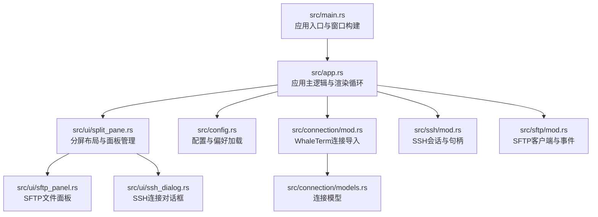
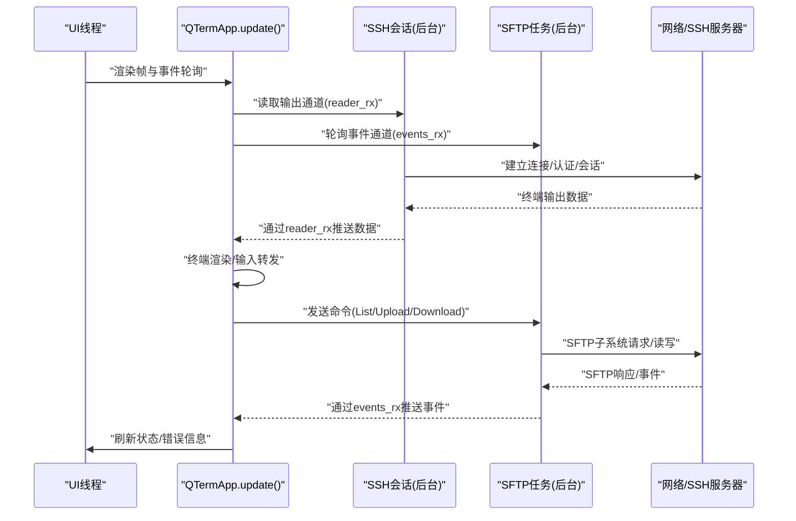
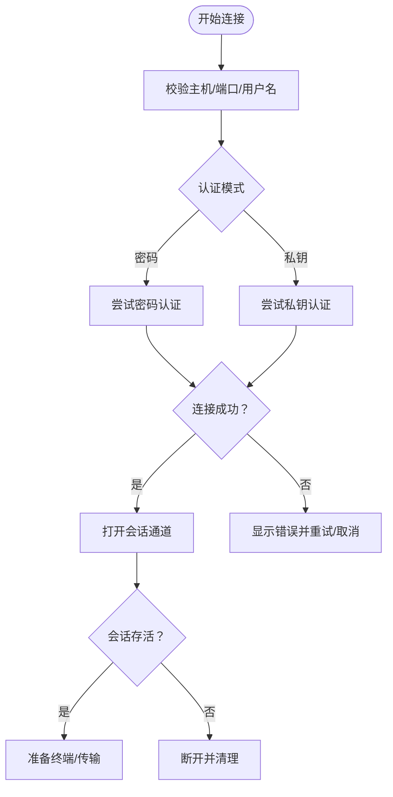
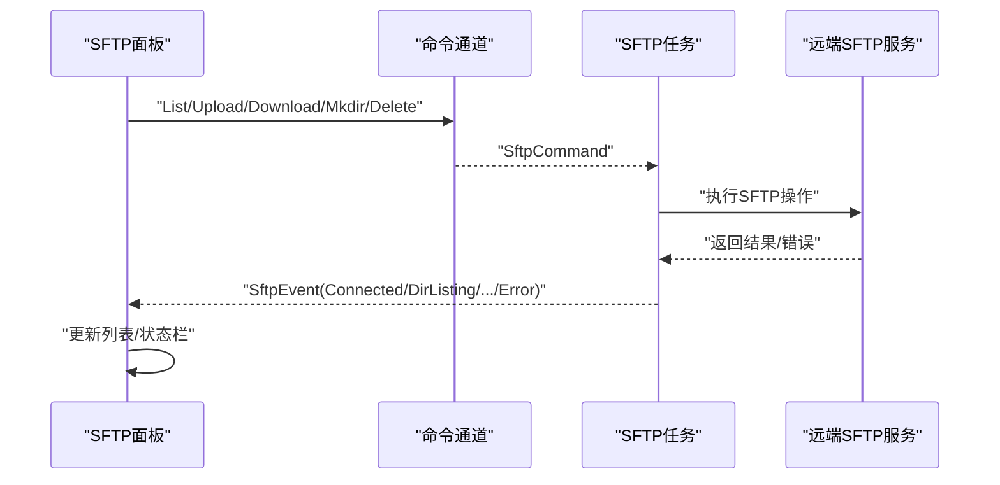
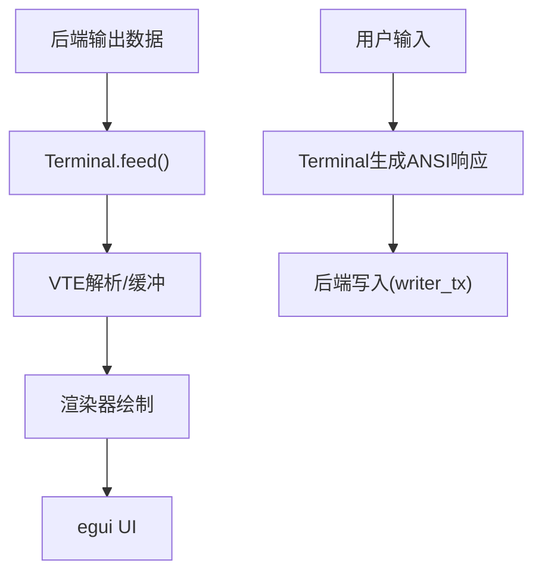
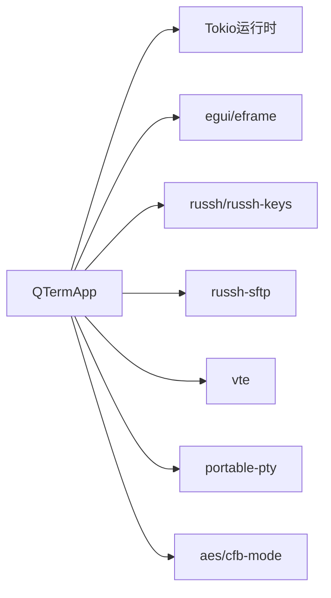

# 调试工具和技巧

<cite>
**本文档引用的文件**
- [src/main.rs](file://src/main.rs)
- [src/app.rs](file://src/app.rs)
- [src/config.rs](file://src/config.rs)
- [src/connection/mod.rs](file://src/connection/mod.rs)
- [src/connection/models.rs](file://src/connection/models.rs)
- [src/ssh/mod.rs](file://src/ssh/mod.rs)
- [src/sftp/mod.rs](file://src/sftp/mod.rs)
- [src/ui/ssh_dialog.rs](file://src/ui/ssh_dialog.rs)
- [src/ui/split_pane.rs](file://src/ui/split_pane.rs)
- [src/ui/sftp_panel.rs](file://src/ui/sftp_panel.rs)
- [Cargo.toml](file://Cargo.toml)
- [.cargo/config.toml](file://.cargo/config.toml)
</cite>

## 目录
1. [简介](#简介)
2. [项目结构](#项目结构)
3. [核心组件](#核心组件)
4. [架构总览](#架构总览)
5. [详细组件分析](#详细组件分析)
6. [依赖关系分析](#依赖关系分析)
7. [性能考量](#性能考量)
8. [故障排查指南](#故障排查指南)
9. [结论](#结论)
10. [附录](#附录)

## 简介
本指南面向QTerm项目的开发者与高级用户，聚焦于调试工具与技巧的实际应用，覆盖以下方面：
- 日志系统与调试信息采集：日志级别、日志文件位置、关键事件记录、错误堆栈跟踪等
- 错误代码与处理策略：SSH协议错误、SFTP状态码、终端控制序列错误、UI事件处理异常等
- 断点调试与异步调试：Rust调试器使用、异步函数调试、UI事件调试、内存泄漏检测
- 性能分析工具：火焰图、内存分析器、CPU剖析、渲染性能监控
- 用户反馈与问题报告：标准流程、问题描述要点、必要系统信息与重现步骤

## 项目结构
QTerm采用模块化设计，核心模块包括应用入口、配置管理、连接与凭据、SSH/SFTP、终端仿真、UI组件等。整体采用egui/eframe进行渲染与事件驱动，结合Tokio异步运行时处理网络与IO。

**图表来源**
- [src/main.rs:51-87](file://src/main.rs#L51-L87)
- [src/app.rs:284-589](file://src/app.rs#L284-L589)
- [src/ui/split_pane.rs:151-238](file://src/ui/split_pane.rs#L151-L238)
- [src/ui/sftp_panel.rs:12-387](file://src/ui/sftp_panel.rs#L12-L387)
- [src/ui/ssh_dialog.rs:13-147](file://src/ui/ssh_dialog.rs#L13-L147)
- [src/config.rs:68-127](file://src/config.rs#L68-L127)
- [src/connection/mod.rs:28-59](file://src/connection/mod.rs#L28-L59)
- [src/connection/models.rs:3-43](file://src/connection/models.rs#L3-L43)
- [src/ssh/mod.rs:60-136](file://src/ssh/mod.rs#L60-L136)
- [src/sftp/mod.rs:46-115](file://src/sftp/mod.rs#L46-L115)

**章节来源**
- [src/main.rs:1-87](file://src/main.rs#L1-L87)
- [src/app.rs:1-217](file://src/app.rs#L1-L217)
- [src/config.rs:1-127](file://src/config.rs#L1-L127)
- [src/connection/mod.rs:1-59](file://src/connection/mod.rs#L1-L59)
- [src/connection/models.rs:1-43](file://src/connection/models.rs#L1-L43)
- [src/ssh/mod.rs:1-136](file://src/ssh/mod.rs#L1-L136)
- [src/sftp/mod.rs:1-115](file://src/sftp/mod.rs#L1-L115)
- [src/ui/ssh_dialog.rs:1-147](file://src/ui/ssh_dialog.rs#L1-L147)
- [src/ui/split_pane.rs:1-238](file://src/ui/split_pane.rs#L1-L238)
- [src/ui/sftp_panel.rs:1-387](file://src/ui/sftp_panel.rs#L1-L387)

## 核心组件
- 应用入口与窗口：负责加载配置、构建窗口视口、启动渲染循环
- 应用主逻辑：处理UI状态、标签页、主题、字体、窗口位置与尺寸持久化
- 配置与偏好：INI配置文件与WhaleTerm JSON偏好文件的读取与合并
- 连接与凭据：从WhaleTerm导入连接，解密密码，供SSH对话框使用
- SSH/SFTP：全局Tokio运行时、SSH会话与句柄、SFTP事件与命令通道
- UI组件：分屏布局、SFTP面板、SSH对话框

**章节来源**
- [src/main.rs:51-87](file://src/main.rs#L51-L87)
- [src/app.rs:67-105](file://src/app.rs#L67-L105)
- [src/config.rs:68-127](file://src/config.rs#L68-L127)
- [src/connection/mod.rs:28-59](file://src/connection/mod.rs#L28-L59)
- [src/ssh/mod.rs:60-136](file://src/ssh/mod.rs#L60-L136)
- [src/sftp/mod.rs:46-115](file://src/sftp/mod.rs#L46-L115)
- [src/ui/ssh_dialog.rs:13-147](file://src/ui/ssh_dialog.rs#L13-L147)
- [src/ui/split_pane.rs:151-238](file://src/ui/split_pane.rs#L151-L238)
- [src/ui/sftp_panel.rs:12-387](file://src/ui/sftp_panel.rs#L12-L387)

## 架构总览
QTerm采用“主线程渲染 + 异步后台任务”的架构。主线程负责UI绘制与事件处理；Tokio运行时承载SSH/SFTP后台任务；通过多播通道在异步任务与主线程之间传递事件与数据。

**图表来源**
- [src/app.rs:284-589](file://src/app.rs#L284-L589)
- [src/ssh/mod.rs:68-136](file://src/ssh/mod.rs#L68-L136)
- [src/sftp/mod.rs:46-115](file://src/sftp/mod.rs#L46-L115)

## 详细组件分析

### 日志系统与调试信息采集
- 日志级别与输出位置
  - 控制台输出：应用在关键错误处使用标准错误输出，便于在终端或IDE调试器中捕获
  - UI状态：通过对话框与状态栏展示错误信息，便于用户感知
- 关键事件记录
  - SSH会话：连接建立、认证、通道打开、会话结束
  - SFTP会话：子系统请求、会话初始化、命令执行、错误上报
  - 终端：输出数据到达、输入转发、尺寸调整、面板存活状态
- 错误堆栈跟踪
  - Rust错误类型化：SSH/SFTP错误枚举提供清晰的错误分类
  - 异步错误传播：Tokio任务中对底层错误进行包装与上报

建议实践
- 在开发构建中启用更详细的日志输出，结合UI状态栏观察实时错误
- 对于异步错误，使用错误包装并在UI层统一呈现，避免吞掉关键信息

**章节来源**
- [src/ssh/mod.rs:35-53](file://src/ssh/mod.rs#L35-L53)
- [src/ssh/mod.rs:84-96](file://src/ssh/mod.rs#L84-L96)
- [src/sftp/mod.rs:117-167](file://src/sftp/mod.rs#L117-L167)
- [src/sftp/mod.rs:169-238](file://src/sftp/mod.rs#L169-L238)
- [src/app.rs:201-204](file://src/app.rs#L201-L204)

### SSH协议错误与处理策略
- 错误分类
  - 连接错误：网络不可达、超时、握手失败
  - 认证错误：用户名/密码错误、私钥认证失败
  - 通道错误：会话初始化失败、通道关闭
- 常见场景与修复
  - 端口与主机：确认SSH服务端口与可达性
  - 认证方式：密码与私钥路径正确性、私钥密码
  - 会话存活：检测alive标志，及时清理资源
- UI集成
  - SSH对话框验证必填字段，生成SshConfig后交由主逻辑处理
  - 失败时在对话框状态区显示错误信息

**图表来源**
- [src/ui/ssh_dialog.rs:115-147](file://src/ui/ssh_dialog.rs#L115-L147)
- [src/ssh/mod.rs:68-136](file://src/ssh/mod.rs#L68-L136)

**章节来源**
- [src/ui/ssh_dialog.rs:13-147](file://src/ui/ssh_dialog.rs#L13-L147)
- [src/ssh/mod.rs:35-53](file://src/ssh/mod.rs#L35-L53)
- [src/ssh/mod.rs:68-136](file://src/ssh/mod.rs#L68-L136)

### SFTP状态码与文件传输调试
- 事件类型
  - Connected：SFTP会话建立
  - DirListing：目录列表结果
  - UploadDone/DownloadDone：上传/下载完成或失败
  - MkdirDone/DeleteDone：远程目录/文件操作结果
  - Error：错误消息
- 常见问题
  - 权限不足：检查远程路径权限与umask
  - 路径格式：本地/远程路径分隔符差异
  - 通道关闭：SFTP会话提前结束导致命令失败
- UI反馈
  - 状态栏实时显示操作进度与结果
  - 失败时保留错误文本，便于复制与反馈

**图表来源**
- [src/sftp/mod.rs:46-115](file://src/sftp/mod.rs#L46-L115)
- [src/sftp/mod.rs:117-167](file://src/sftp/mod.rs#L117-L167)
- [src/ui/sftp_panel.rs:51-110](file://src/ui/sftp_panel.rs#L51-L110)

**章节来源**
- [src/sftp/mod.rs:23-44](file://src/sftp/mod.rs#L23-L44)
- [src/sftp/mod.rs:117-167](file://src/sftp/mod.rs#L117-L167)
- [src/ui/sftp_panel.rs:51-110](file://src/ui/sftp_panel.rs#L51-L110)

### 终端控制序列与渲染调试
- 数据流
  - 本地：PTY子进程输出经reader_rx进入终端缓冲
  - 远程：SSH会话输出经reader_rx进入终端缓冲
  - 输入：终端pending_replies通过后端写入
- 调试要点
  - 检查reader_rx是否持续有数据
  - 确认ANSI转义序列是否被正确解析
  - 观察终端尺寸变化与resize_tx调用
- 渲染性能
  - 监控渲染帧率与UI响应时间
  - 减少不必要的重绘与字体回退

**图表来源**
- [src/ui/split_pane.rs:70-113](file://src/ui/split_pane.rs#L70-L113)
- [src/ui/split_pane.rs:125-134](file://src/ui/split_pane.rs#L125-L134)

**章节来源**
- [src/ui/split_pane.rs:70-113](file://src/ui/split_pane.rs#L70-L113)
- [src/ui/split_pane.rs:125-134](file://src/ui/split_pane.rs#L125-L134)

### UI事件处理与调试
- 事件来源
  - 键盘/鼠标输入：egui输入系统
  - 窗口事件：位置、尺寸、最大化状态
  - 自定义交互：标签页切换、面板分屏、SFTP操作
- 调试技巧
  - 使用egui调试工具查看交互区域与响应
  - 在事件处理前后打印状态，确认事件链路
  - 对话框状态与错误信息需在UI层显式呈现

**章节来源**
- [src/app.rs:284-589](file://src/app.rs#L284-L589)
- [src/ui/ssh_dialog.rs:43-113](file://src/ui/ssh_dialog.rs#L43-L113)
- [src/ui/sftp_panel.rs:112-152](file://src/ui/sftp_panel.rs#L112-L152)

## 依赖关系分析
- 运行时与异步
  - Tokio：全局SSH运行时与SFTP后台任务
  - eframe/egui：UI渲染与事件循环
- 网络与加密
  - russh/russh-keys：SSH客户端与密钥处理
  - russh-sftp：SFTP子系统
  - aes/cfb-mode：凭据解密
- 平台与工具
  - portable-pty：本地PTY子进程
  - vte：VT100/ANSI转义序列解析
  - serde/serde_json：配置与JSON解析

**图表来源**
- [Cargo.toml:8-25](file://Cargo.toml#L8-L25)
- [src/ssh/mod.rs:8-16](file://src/ssh/mod.rs#L8-L16)
- [src/sftp/mod.rs:1-6](file://src/sftp/mod.rs#L1-L6)

**章节来源**
- [Cargo.toml:1-30](file://Cargo.toml#L1-L30)
- [src/ssh/mod.rs:8-16](file://src/ssh/mod.rs#L8-L16)
- [src/sftp/mod.rs:1-6](file://src/sftp/mod.rs#L1-L6)

## 性能考量
- CPU与渲染
  - 使用egui调试工具观察帧率与耗时区域
  - 合理设置字体大小与回滚缓冲区大小，避免过度重绘
- 异步与并发
  - SSH与SFTP使用独立通道，避免阻塞UI线程
  - 合理设置通道容量，防止背压
- 内存与资源
  - 及时关闭不再使用的面板与连接，释放资源
  - 对大文件传输使用流式读写，避免一次性占用内存

[本节为通用指导，无需特定文件来源]

## 故障排查指南
- SSH连接失败
  - 现象：连接超时、认证失败、通道打开失败
  - 排查：核对主机/端口/凭据；查看SSH会话错误输出；确认防火墙与服务端配置
  - 修复：修正凭据与网络；升级SSH运行时；增强错误提示
- SFTP操作异常
  - 现象：目录列表失败、上传/下载失败、权限错误
  - 排查：检查远程路径与权限；确认SFTP会话存活；查看事件通道错误
  - 修复：修正路径格式；提升权限；增加重试机制
- 终端渲染卡顿
  - 现象：UI卡顿、字符错位、滚动异常
  - 排查：检查reader_rx数据流；确认VTE解析与渲染路径；减少字体回退
  - 修复：优化渲染路径；降低回滚缓冲；减少不必要的重绘
- UI事件无响应
  - 现象：点击无效、键盘输入无反应
  - 排查：确认egui输入系统状态；检查事件链路；查看状态栏错误
  - 修复：完善事件处理；增强错误反馈

**章节来源**
- [src/ssh/mod.rs:35-53](file://src/ssh/mod.rs#L35-L53)
- [src/sftp/mod.rs:117-167](file://src/sftp/mod.rs#L117-L167)
- [src/ui/sftp_panel.rs:51-110](file://src/ui/sftp_panel.rs#L51-L110)
- [src/app.rs:284-589](file://src/app.rs#L284-L589)

## 结论
QTerm的调试体系围绕“主线程渲染 + 异步后台任务”展开，通过明确的错误类型、事件通道与UI反馈，能够快速定位问题并修复。建议在开发过程中充分利用Rust调试器、异步任务日志与UI状态栏，形成闭环的调试流程。

[本节为总结，无需特定文件来源]

## 附录

### 日志系统使用与配置
- 日志级别
  - 开发：使用标准错误输出记录关键错误
  - 生产：可通过UI状态栏集中展示错误信息
- 日志文件位置
  - 默认输出至控制台；可重定向至文件以便长期留存
- 关键事件记录
  - SSH/SFTP事件与命令执行过程
  - 终端数据流与尺寸调整
- 错误堆栈跟踪
  - 使用错误包装与Display实现，便于在UI层展示

**章节来源**
- [src/ssh/mod.rs:84-96](file://src/ssh/mod.rs#L84-L96)
- [src/sftp/mod.rs:117-167](file://src/sftp/mod.rs#L117-L167)
- [src/app.rs:201-204](file://src/app.rs#L201-L204)

### 断点调试技巧
- Rust调试器
  - 在SSH会话与SFTP任务的关键节点设置断点
  - 观察通道收发与错误传播
- 异步函数调试
  - 使用Tokio调试工具查看任务状态
  - 关注通道容量与背压
- UI事件调试
  - 在egui输入回调中设置断点
  - 检查事件链路与状态变更
- 内存泄漏检测
  - 使用内存分析器检查面板与会话生命周期
  - 确保断开连接后资源释放

**章节来源**
- [src/ssh/mod.rs:68-136](file://src/ssh/mod.rs#L68-L136)
- [src/sftp/mod.rs:46-115](file://src/sftp/mod.rs#L46-L115)
- [src/ui/split_pane.rs:136-148](file://src/ui/split_pane.rs#L136-L148)

### 性能分析工具应用
- 火焰图
  - 采集Tokio任务CPU占用，识别热点
- 内存分析器
  - 检查终端缓冲与面板对象分配
- CPU性能剖析
  - 结合渲染帧率与异步任务耗时
- 渲染性能监控
  - 监控UI重绘频率与字体回退

**章节来源**
- [Cargo.toml:26-30](file://Cargo.toml#L26-L30)
- [src/ui/split_pane.rs:70-113](file://src/ui/split_pane.rs#L70-L113)

### 用户反馈与问题报告流程
- 必备信息
  - 操作系统版本、QTerm版本、配置文件位置
  - SSH/SFTP目标主机与端口、认证方式
- 现象描述
  - 何时发生、是否可复现、期望行为与实际行为
- 重现步骤
  - 从启动到问题出现的完整步骤
- 日志与截图
  - UI错误信息、控制台输出、关键界面截图

**章节来源**
- [src/config.rs:68-127](file://src/config.rs#L68-L127)
- [src/connection/mod.rs:28-59](file://src/connection/mod.rs#L28-L59)
- [src/ui/ssh_dialog.rs:96-112](file://src/ui/ssh_dialog.rs#L96-L112)