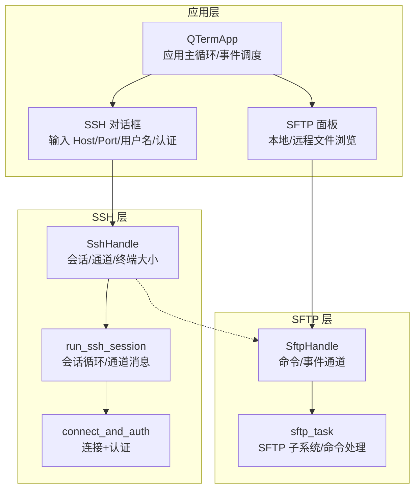
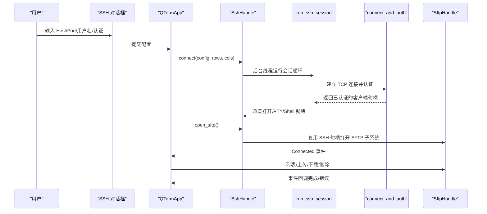
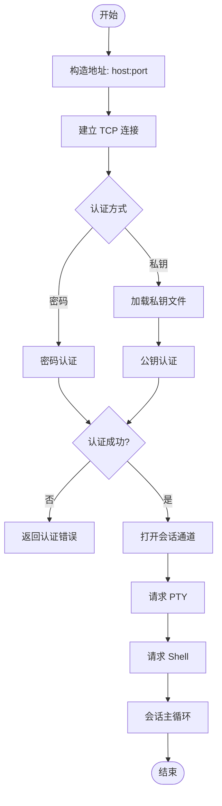
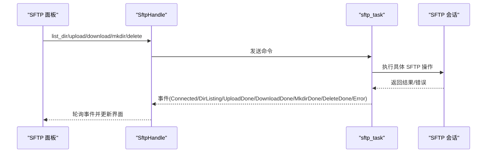
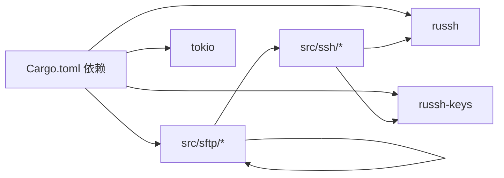

# 连接问题

<cite>
**本文引用的文件**
- [src/ssh/mod.rs](file://src/ssh/mod.rs)
- [src/ssh/client.rs](file://src/ssh/client.rs)
- [src/ssh/session.rs](file://src/ssh/session.rs)
- [src/sftp/mod.rs](file://src/sftp/mod.rs)
- [src/ui/ssh_dialog.rs](file://src/ui/ssh_dialog.rs)
- [src/ui/sftp_panel.rs](file://src/ui/sftp_panel.rs)
- [src/app.rs](file://src/app.rs)
- [docs/specs/2026-05-30-phase2-ssh-split-design.md](file://docs/specs/2026-05-30-phase2-ssh-split-design.md)
- [docs/specs/2026-05-30-phase3-sftp-design.md](file://docs/specs/2026-05-30-phase3-sftp-design.md)
- [Cargo.toml](file://Cargo.toml)
</cite>

## 目录
1. [简介](#简介)
2. [项目结构](#项目结构)
3. [核心组件](#核心组件)
4. [架构总览](#架构总览)
5. [详细组件分析](#详细组件分析)
6. [依赖关系分析](#依赖关系分析)
7. [性能考量](#性能考量)
8. [故障排除指南](#故障排除指南)
9. [结论](#结论)
10. [附录](#附录)

## 简介
本指南聚焦于 QTerm 项目中的 SSH 与 SFTP 连接问题排查，覆盖认证失败（密码错误、私钥问题、公钥认证失败）、网络超时（防火墙阻断、端口不可达、DNS 解析问题）、协议不兼容（SSH 版本差异、加密算法不支持）等常见 SSH 连接失败场景；以及 SFTP 文件传输问题（权限不足、文件锁定、磁盘空间不足、网络中断恢复）的排查步骤。同时提供连接配置验证方法（主机名解析、端口连通性测试、证书有效性检查）与错误日志分析技巧，帮助快速定位并修复问题。

## 项目结构
QTerm 的 SSH/SFTP 能力由以下模块协同实现：
- SSH 模块：负责建立 SSH 连接、认证、PTY 会话与通道管理
- SFTP 模块：基于 SSH 会话复用打开 SFTP 子系统，提供文件浏览与传输
- UI 模块：提供 SSH 连接对话框与 SFTP 双栏面板
- 应用入口：协调 UI、SSH/SFTP 生命周期与事件轮询

图表来源
- [src/app.rs:562-570](file://src/app.rs#L562-L570)
- [src/ui/ssh_dialog.rs:104-131](file://src/ui/ssh_dialog.rs#L104-L131)
- [src/ui/sftp_panel.rs:24-44](file://src/ui/sftp_panel.rs#L24-L44)
- [src/ssh/mod.rs:68-136](file://src/ssh/mod.rs#L68-L136)
- [src/ssh/session.rs:11-90](file://src/ssh/session.rs#L11-L90)
- [src/ssh/client.rs:25-63](file://src/ssh/client.rs#L25-L63)
- [src/sftp/mod.rs:46-167](file://src/sftp/mod.rs#L46-L167)

章节来源
- [src/app.rs:562-570](file://src/app.rs#L562-L570)
- [src/ui/ssh_dialog.rs:104-131](file://src/ui/ssh_dialog.rs#L104-L131)
- [src/ui/sftp_panel.rs:24-44](file://src/ui/sftp_panel.rs#L24-L44)
- [src/ssh/mod.rs:68-136](file://src/ssh/mod.rs#L68-L136)
- [src/ssh/session.rs:11-90](file://src/ssh/session.rs#L11-L90)
- [src/ssh/client.rs:25-63](file://src/ssh/client.rs#L25-L63)
- [src/sftp/mod.rs:46-167](file://src/sftp/mod.rs#L46-L167)

## 核心组件
- SSH 配置与错误类型：定义了主机、端口、用户名、认证方式与超时；错误类型分为连接、认证、通道三类，便于区分问题阶段
- SSH 客户端处理器：当前实现为“自动接受服务器密钥”，便于开发调试，但生产环境需加强密钥校验
- SSH 会话主循环：负责建立连接、认证、打开 PTY 与 Shell、处理数据读写与窗口大小调整
- SFTP 句柄与后台任务：通过 SSH 会话复用打开 SFTP 子系统，异步处理命令队列与事件上报

章节来源
- [src/ssh/mod.rs:18-66](file://src/ssh/mod.rs#L18-L66)
- [src/ssh/client.rs:6-21](file://src/ssh/client.rs#L6-L21)
- [src/ssh/session.rs:9-90](file://src/ssh/session.rs#L9-L90)
- [src/sftp/mod.rs:7-115](file://src/sftp/mod.rs#L7-L115)

## 架构总览
下图展示了 SSH/SFTP 的关键调用序列与数据流，有助于理解连接失败与传输异常的定位点。

图表来源
- [src/ui/ssh_dialog.rs:104-131](file://src/ui/ssh_dialog.rs#L104-L131)
- [src/app.rs:562-570](file://src/app.rs#L562-L570)
- [src/ssh/mod.rs:68-136](file://src/ssh/mod.rs#L68-L136)
- [src/ssh/session.rs:11-90](file://src/ssh/session.rs#L11-L90)
- [src/ssh/client.rs:25-63](file://src/ssh/client.rs#L25-L63)
- [src/sftp/mod.rs:46-167](file://src/sftp/mod.rs#L46-L167)

## 详细组件分析

### SSH 连接与认证流程
- 连接建立：使用 russh 客户端连接目标主机与端口
- 认证方式：支持密码认证与私钥认证；私钥认证会加载本地私钥文件并进行公钥交换
- 会话通道：打开会话通道、请求 PTY 与 Shell，进入主循环处理数据与窗口变化

图表来源
- [src/ssh/client.rs:25-63](file://src/ssh/client.rs#L25-L63)
- [src/ssh/session.rs:11-90](file://src/ssh/session.rs#L11-L90)

章节来源
- [src/ssh/client.rs:25-63](file://src/ssh/client.rs#L25-L63)
- [src/ssh/session.rs:11-90](file://src/ssh/session.rs#L11-L90)

### SFTP 文件传输流程
- 复用 SSH 会话：通过 SSH 会话打开 SFTP 子系统通道
- 命令队列：UI 发送命令（列表、上传、下载、创建目录、删除），后台任务逐一处理
- 事件上报：将结果与错误通过事件通道上报至 UI

图表来源
- [src/ui/sftp_panel.rs:46-104](file://src/ui/sftp_panel.rs#L46-L104)
- [src/sftp/mod.rs:46-167](file://src/sftp/mod.rs#L46-L167)

章节来源
- [src/ui/sftp_panel.rs:46-104](file://src/ui/sftp_panel.rs#L46-L104)
- [src/sftp/mod.rs:46-167](file://src/sftp/mod.rs#L46-L167)

## 依赖关系分析
- 外部库：russh、russh-keys、russh-sftp、tokio、async-trait
- 模块耦合：SSH 与 SFTP 通过共享的 SSH 客户端句柄耦合；UI 通过应用主循环与二者交互

图表来源
- [Cargo.toml:8-25](file://Cargo.toml#L8-L25)
- [src/ssh/client.rs:1-4](file://src/ssh/client.rs#L1-L4)
- [src/sftp/mod.rs:1-6](file://src/sftp/mod.rs#L1-L6)

章节来源
- [Cargo.toml:8-25](file://Cargo.toml#L8-L25)
- [src/ssh/client.rs:1-4](file://src/ssh/client.rs#L1-L4)
- [src/sftp/mod.rs:1-6](file://src/sftp/mod.rs#L1-L6)

## 性能考量
- 运行时隔离：SSH 使用独立的 tokio 运行时，避免与 UI 并发竞争
- 通道缓冲：输入/输出/大小调整通道均设置合理容量，降低阻塞概率
- 会话复用：SFTP 复用 SSH 会话，减少额外握手成本

章节来源
- [src/ssh/mod.rs:8-16](file://src/ssh/mod.rs#L8-L16)
- [src/ssh/mod.rs:71-109](file://src/ssh/mod.rs#L71-L109)
- [src/sftp/mod.rs:49-68](file://src/sftp/mod.rs#L49-L68)

## 故障排除指南

### 一、SSH 连接失败排查

1) 认证失败
- 密码错误
  - 现象：认证阶段直接报错或被拒绝
  - 排查要点：确认用户名与密码正确；检查服务器端策略（如账户锁定、密码过期）
  - 修复建议：重新输入凭据；联系管理员重置密码
  - 参考实现：密码认证路径与错误映射
    - [src/ssh/client.rs:37-44](file://src/ssh/client.rs#L37-L44)
- 私钥问题
  - 现象：加载私钥失败或公钥认证失败
  - 排查要点：私钥文件是否存在、格式是否受支持、passphrase 是否正确；服务器端公钥是否已配置
  - 修复建议：使用受支持的密钥格式；提供正确 passphrase；确保服务器 authorized_keys 中存在对应公钥
  - 参考实现：私钥加载与公钥认证
    - [src/ssh/client.rs:45-54](file://src/ssh/client.rs#L45-L54)
- 公钥认证失败
  - 现象：握手通过但认证阶段失败
  - 排查要点：服务器端公钥校验策略；客户端公钥与服务器端授权是否匹配
  - 修复建议：核对 authorized_keys；必要时临时放宽策略以便验证
  - 参考实现：密钥校验与认证
    - [src/ssh/client.rs:14-21](file://src/ssh/client.rs#L14-L21)
    - [src/ssh/client.rs:50-54](file://src/ssh/client.rs#L50-L54)

2) 网络超时
- 防火墙阻断
  - 现象：连接建立阶段超时或被拒绝
  - 排查要点：检查本地/远端防火墙规则；确认端口未被封禁
  - 修复建议：放行 22 端口；临时关闭防火墙验证
- 端口不可达
  - 现象：TCP 连接无法建立
  - 排查要点：使用 telnet 或 nc 测试端口连通性；确认主机名解析与路由可达
  - 修复建议：修正主机名或 IP；调整路由/代理
- DNS 解析问题
  - 现象：域名无法解析或解析到错误地址
  - 排查要点：nslookup/dig 检查解析；hosts 文件冲突
  - 修复建议：修正 DNS；使用 IP 直连验证
- 参考实现：连接建立与错误分类
  - [src/ssh/client.rs:31-34](file://src/ssh/client.rs#L31-L34)
  - [src/ssh/mod.rs:35-53](file://src/ssh/mod.rs#L35-L53)

3) 协议不兼容
- SSH 版本差异
  - 现象：握手阶段失败或协商超时
  - 排查要点：服务器与客户端支持的 SSH 协议版本；加密算法支持情况
  - 修复建议：升级客户端/服务器；启用兼容算法
- 加密算法不支持
  - 现象：握手阶段因算法不被支持而失败
  - 排查要点：检查双方支持的 kex、cipher、mac、key 算法
  - 修复建议：在安全允许范围内启用兼容算法；避免弱算法
- 参考实现：错误类型与错误信息
  - [src/ssh/mod.rs:35-53](file://src/ssh/mod.rs#L35-L53)

4) 连接配置验证清单
- 主机名解析
  - 使用 nslookup/dig 验证域名解析；必要时使用 IP 直连
- 端口连通性
  - 使用 telnet/nc 验证 22 端口连通性
- 证书有效性
  - 当前实现为自动接受服务器密钥，生产环境应实现严格的密钥校验
  - 参考实现：密钥校验处理
    - [src/ssh/client.rs:14-21](file://src/ssh/client.rs#L14-L21)

章节来源
- [src/ssh/client.rs:14-21](file://src/ssh/client.rs#L14-L21)
- [src/ssh/client.rs:31-34](file://src/ssh/client.rs#L31-L34)
- [src/ssh/client.rs:37-54](file://src/ssh/client.rs#L37-L54)
- [src/ssh/mod.rs:35-53](file://src/ssh/mod.rs#L35-L53)

### 二、SFTP 文件传输问题排查

1) 权限不足
- 现象：上传/下载/创建目录/删除失败，返回权限错误
- 排查要点：确认当前用户对目标路径的读写权限；检查 SELinux/AppArmor 等策略
- 修复建议：提升权限或切换到有权限的用户；调整安全策略
- 参考实现：事件上报与错误处理
  - [src/sftp/mod.rs:175-196](file://src/sftp/mod.rs#L175-L196)
  - [src/sftp/mod.rs:198-207](file://src/sftp/mod.rs#L198-L207)
  - [src/sftp/mod.rs:209-218](file://src/sftp/mod.rs#L209-L218)
  - [src/sftp/mod.rs:220-235](file://src/sftp/mod.rs#L220-L235)

2) 文件锁定
- 现象：下载/删除时提示文件被占用
- 排查要点：确认是否有进程正在访问该文件；检查共享锁/独占锁
- 修复建议：关闭占用进程或等待释放后再试
- 参考实现：读写失败事件
  - [src/sftp/mod.rs:209-218](file://src/sftp/mod.rs#L209-L218)

3) 磁盘空间不足
- 现象：上传失败且提示空间不足
- 排查要点：检查目标路径所在分区剩余空间
- 修复建议：清理空间或更换目标路径
- 参考实现：写入失败事件
  - [src/sftp/mod.rs:200-207](file://src/sftp/mod.rs#L200-L207)

4) 网络中断与恢复
- 现象：传输过程中断，UI 显示错误
- 排查要点：检查网络稳定性；确认 SSH 会话是否存活
- 修复建议：重连 SSH/SFTP；在 UI 中重试操作
- 参考实现：事件驱动与状态更新
  - [src/ui/sftp_panel.rs:46-104](file://src/ui/sftp_panel.rs#L46-L104)
  - [src/sftp/mod.rs:117-167](file://src/sftp/mod.rs#L117-L167)

5) UI 侧错误呈现
- SFTP 面板会根据事件更新状态文本；遇到错误时显示具体错误信息
- 参考实现：事件处理与状态更新
  - [src/ui/sftp_panel.rs:48-103](file://src/ui/sftp_panel.rs#L48-L103)

章节来源
- [src/sftp/mod.rs:175-235](file://src/sftp/mod.rs#L175-L235)
- [src/ui/sftp_panel.rs:46-104](file://src/ui/sftp_panel.rs#L46-L104)

### 三、错误日志分析技巧

- 分类定位
  - 连接错误：通常发生在 TCP 连接或握手阶段，错误信息来自连接建立路径
    - [src/ssh/client.rs:31-34](file://src/ssh/client.rs#L31-L34)
  - 认证错误：发生在密码或公钥认证阶段，错误信息来自认证路径
    - [src/ssh/client.rs:37-54](file://src/ssh/client.rs#L37-L54)
  - 通道错误：发生在会话通道打开、PTY/Shell 请求或数据读写阶段
    - [src/ssh/session.rs:28-46](file://src/ssh/session.rs#L28-L46)
    - [src/ssh/session.rs:54-81](file://src/ssh/session.rs#L54-L81)
- UI 层面
  - SSH 对话框会在连接失败时显示状态信息
    - [src/ui/ssh_dialog.rs:87-101](file://src/ui/ssh_dialog.rs#L87-L101)
  - SFTP 面板会将 SFTP 事件转换为用户可读的状态文本
    - [src/ui/sftp_panel.rs:48-103](file://src/ui/sftp_panel.rs#L48-L103)

章节来源
- [src/ssh/client.rs:31-34](file://src/ssh/client.rs#L31-L34)
- [src/ssh/client.rs:37-54](file://src/ssh/client.rs#L37-L54)
- [src/ssh/session.rs:28-46](file://src/ssh/session.rs#L28-L46)
- [src/ssh/session.rs:54-81](file://src/ssh/session.rs#L54-L81)
- [src/ui/ssh_dialog.rs:87-101](file://src/ui/ssh_dialog.rs#L87-L101)
- [src/ui/sftp_panel.rs:48-103](file://src/ui/sftp_panel.rs#L48-L103)

## 结论
QTerm 的 SSH/SFTP 能力通过清晰的模块划分与事件驱动机制实现了稳定的远程终端与文件传输体验。针对连接与传输问题，建议按照“认证—网络—协议—权限—存储—网络稳定性”的顺序逐项排查，并结合 UI 层的错误提示与事件日志进行定位。生产环境中应强化密钥校验与算法兼容性，确保安全与稳定。

## 附录

### A. SSH 连接配置验证清单
- 主机名解析：nslookup/dig 验证
- 端口连通性：telnet/nc 22
- 证书校验：当前实现为自动接受，生产环境需实现严格校验
- 参考实现
  - [src/ssh/client.rs:14-21](file://src/ssh/client.rs#L14-L21)
  - [src/ui/ssh_dialog.rs:104-131](file://src/ui/ssh_dialog.rs#L104-L131)

### B. SFTP 传输操作参考
- 列表：触发目录读取，返回文件条目
- 上传：读取本地文件并写入远程路径
- 下载：读取远程文件并写入本地路径
- 创建目录：在远程创建新目录
- 删除：删除文件或空目录
- 参考实现
  - [src/sftp/mod.rs:175-235](file://src/sftp/mod.rs#L175-L235)
  - [src/ui/sftp_panel.rs:301-329](file://src/ui/sftp_panel.rs#L301-L329)