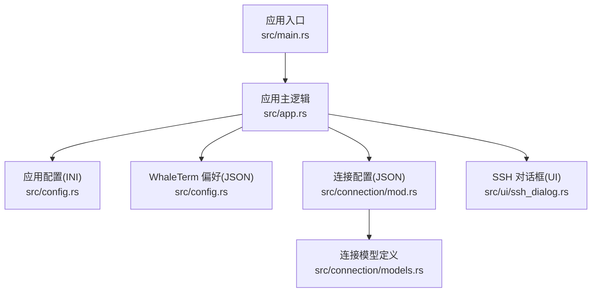
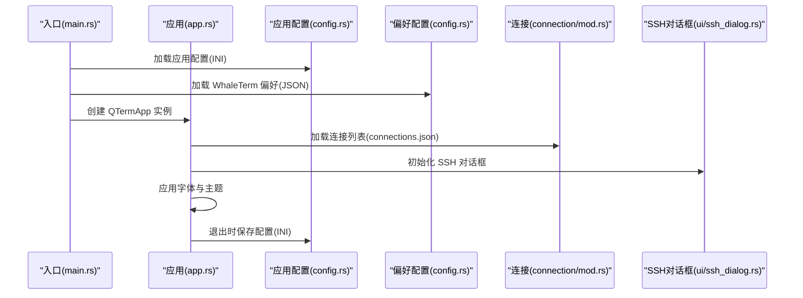
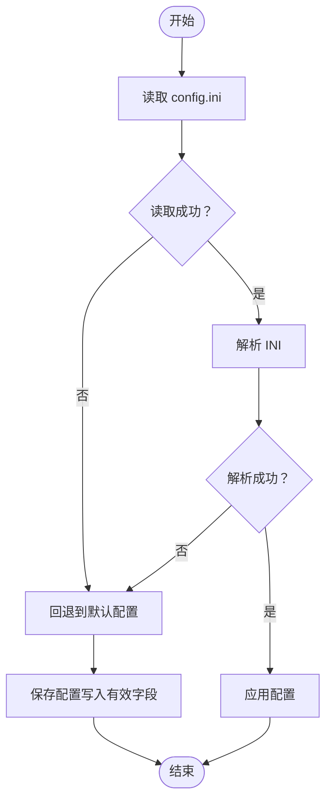
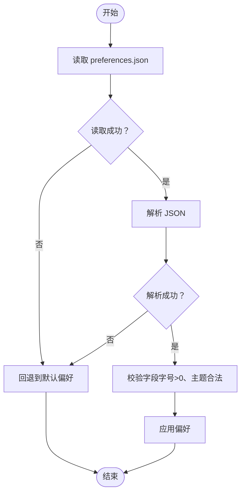
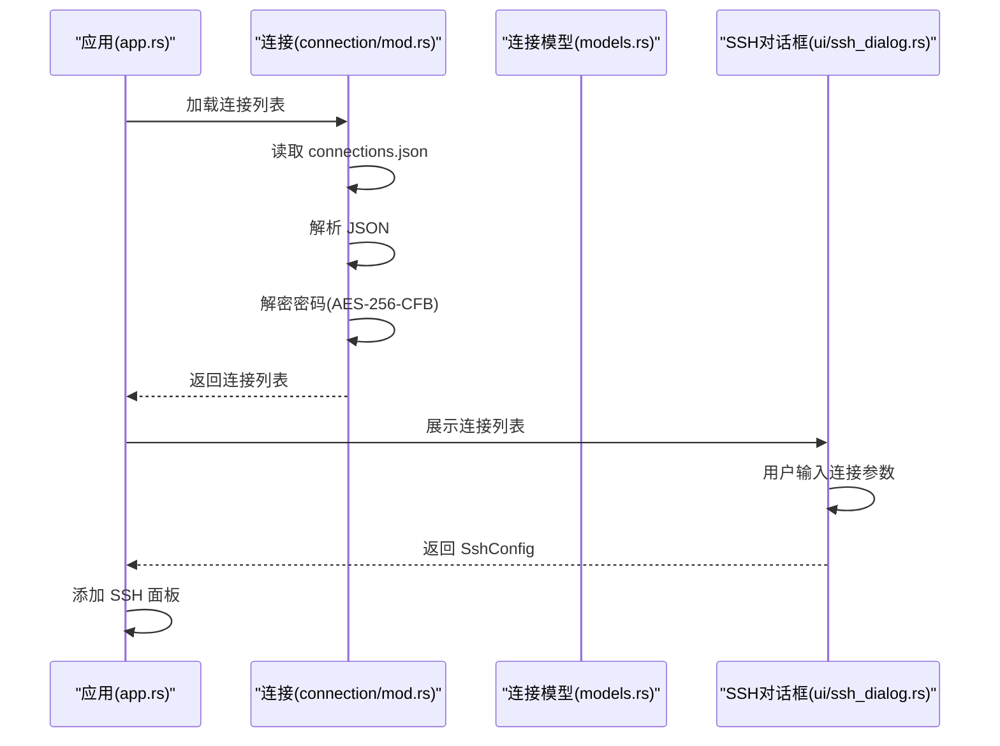
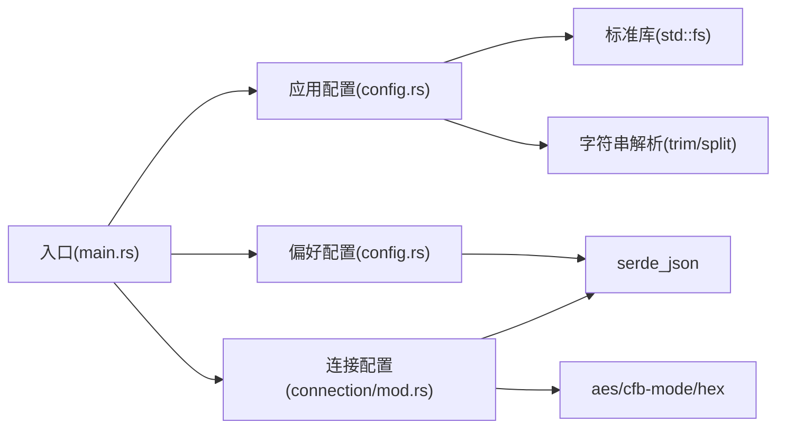

# 配置问题

<cite>
**本文引用的文件**
- [src/config.rs](file://src/config.rs)
- [src/app.rs](file://src/app.rs)
- [src/main.rs](file://src/main.rs)
- [src/connection/mod.rs](file://src/connection/mod.rs)
- [src/connection/models.rs](file://src/connection/models.rs)
- [src/ui/ssh_dialog.rs](file://src/ui/ssh_dialog.rs)
- [Cargo.toml](file://Cargo.toml)
</cite>

## 目录
1. [简介](#简介)
2. [项目结构与配置相关模块](#项目结构与配置相关模块)
3. [核心配置组件](#核心配置组件)
4. [架构总览](#架构总览)
5. [详细组件分析与故障排除](#详细组件分析与故障排除)
6. [依赖关系分析](#依赖关系分析)
7. [性能与可靠性考量](#性能与可靠性考量)
8. [故障排除指南](#故障排除指南)
9. [结论](#结论)
10. [附录](#附录)

## 简介
本指南聚焦于 QTerm 项目中“配置相关问题”的系统化排查与修复流程，覆盖以下方面：
- 配置文件损坏的修复：INI 格式错误、编码问题、关键字段缺失的恢复策略
- 权限问题处理：配置文件读写权限、用户目录访问权限、系统配置文件保护机制导致的问题
- 配置兼容性冲突：版本升级后的配置迁移、不同平台间的配置差异、第三方软件对配置文件的影响
- 配置验证与调试工具：配置文件语法检查、默认值回退机制、配置项冲突检测
- 连接配置问题诊断：连接参数错误、认证信息丢失、连接树状态异常等

## 项目结构与配置相关模块
QTerm 的配置体系主要由以下模块构成：
- 应用配置（INI）：存储窗口位置、尺寸、主题、字体大小、回滚行数、Shell 路径等运行时配置
- WhaleTerm 偏好（JSON）：从 WhaleTerm preferences.json 读取字体家族、字号、主题等偏好设置
- 连接配置（JSON）：从 WhaleTerm connections.json 读取连接分组、连接参数及加密密码，并进行解密

图表来源
- [src/main.rs:51-87](file://src/main.rs#L51-L87)
- [src/app.rs:67-105](file://src/app.rs#L67-L105)
- [src/config.rs:68-127](file://src/config.rs#L68-L127)
- [src/config.rs:239-281](file://src/config.rs#L239-L281)
- [src/connection/mod.rs:30-59](file://src/connection/mod.rs#L30-L59)
- [src/connection/models.rs:1-43](file://src/connection/models.rs#L1-L43)
- [src/ui/ssh_dialog.rs:13-41](file://src/ui/ssh_dialog.rs#L13-L41)

章节来源
- [src/main.rs:51-87](file://src/main.rs#L51-L87)
- [src/app.rs:67-105](file://src/app.rs#L67-L105)
- [src/config.rs:68-127](file://src/config.rs#L68-L127)
- [src/config.rs:239-281](file://src/config.rs#L239-L281)
- [src/connection/mod.rs:30-59](file://src/connection/mod.rs#L30-L59)
- [src/connection/models.rs:1-43](file://src/connection/models.rs#L1-L43)
- [src/ui/ssh_dialog.rs:13-41](file://src/ui/ssh_dialog.rs#L13-L41)

## 核心配置组件
- 应用配置（INI）
  - 文件位置：Windows: %APPDATA%\qterm\config.ini；其他: ~/.config/qterm/config.ini
  - 关键字段：window_x、window_y、window_width、window_height、maximized、font_size、scrollback_lines、theme、shell_path
  - 行为：加载失败或解析失败时回退到默认值；保存时自动创建目录并写入有效字段
- WhaleTerm 偏好（JSON）
  - 文件位置：Windows: %APPDATA%\WhaleTerm\preferences.json；其他: ~/.config/WhaleTerm/preferences.json
  - 关键字段：general.theme、config.default_font_size、general.font_size、shell.font_size 等
  - 行为：加载失败或解析失败时回退到默认值；对字体大小进行非零校验
- 连接配置（JSON）
  - 文件位置：Windows: %APPDATA%\WhaleTerm\connections.json；其他: ~/.config/WhaleTerm/connections.json
  - 关键字段：groups[].connections[].username、addr、port、authModel、privateKey、password（加密）
  - 行为：加载失败或解析失败返回空列表；解密失败返回空字符串；密钥派生兼容 WhaleTerm

章节来源
- [src/config.rs:68-127](file://src/config.rs#L68-L127)
- [src/config.rs:131-143](file://src/config.rs#L131-L143)
- [src/config.rs:239-281](file://src/config.rs#L239-L281)
- [src/connection/mod.rs:30-59](file://src/connection/mod.rs#L30-L59)
- [src/connection/models.rs:17-29](file://src/connection/models.rs#L17-L29)

## 架构总览
下图展示配置加载与应用的关键流程，以及与 UI 和连接模块的交互点。

图表来源
- [src/main.rs:51-87](file://src/main.rs#L51-L87)
- [src/app.rs:67-105](file://src/app.rs#L67-L105)
- [src/config.rs:68-127](file://src/config.rs#L68-L127)
- [src/config.rs:239-281](file://src/config.rs#L239-L281)
- [src/connection/mod.rs:30-59](file://src/connection/mod.rs#L30-L59)
- [src/ui/ssh_dialog.rs:13-41](file://src/ui/ssh_dialog.rs#L13-L41)

## 详细组件分析与故障排除

### 应用配置（INI）故障排除
常见问题与修复策略：
- INI 格式错误
  - 现象：解析失败，配置回退到默认值
  - 排查：确认每行均为 key=value，注释以 # 开头，空行被忽略
  - 修复：修正语法错误或删除无效行
- 编码问题
  - 现象：读取失败或解析异常
  - 排查：确认文件编码为 UTF-8；Windows 下注意换行符
  - 修复：转换为 UTF-8 并统一换行符
- 关键字段缺失
  - 现象：部分字段未生效
  - 排查：检查字段名拼写；数值型字段需可解析为数字
  - 修复：补充缺失字段或修正类型
- 权限问题
  - 现象：无法读取或写入配置文件
  - 排查：检查用户目录权限；确认进程有读写权限
  - 修复：提升权限或更换可写目录

图表来源
- [src/config.rs:68-127](file://src/config.rs#L68-L127)
- [src/config.rs:131-143](file://src/config.rs#L131-L143)

章节来源
- [src/config.rs:68-127](file://src/config.rs#L68-L127)
- [src/config.rs:131-143](file://src/config.rs#L131-L143)

### WhaleTerm 偏好（JSON）故障排除
常见问题与修复策略：
- JSON 结构不匹配
  - 现象：解析失败，偏好回退到默认值
  - 排查：确认存在 config/general/shell 三个段落；字段命名符合 camelCase
  - 修复：修正结构或字段名
- 字体大小异常
  - 现象：字体过小或过大
  - 排查：检查 default_font_size、general.font_size、shell.font_size 是否大于 0
  - 修复：设置为正数
- 主题不一致
  - 现象：主题与预期不符
  - 排查：检查 general.theme 是否为空或非法值
  - 修复：设置为 dark 或 light

图表来源
- [src/config.rs:239-281](file://src/config.rs#L239-L281)

章节来源
- [src/config.rs:239-281](file://src/config.rs#L239-L281)

### 连接配置（JSON）与认证故障排除
常见问题与修复策略：
- 连接参数错误
  - 现象：SSH/SFTP 失败
  - 排查：核对 addr、port、username；确认 authModel 与 privateKey/password 一致性
  - 修复：修正参数或删除冲突字段
- 认证信息丢失
  - 现象：解密失败，password 为空
  - 排查：确认密码加密格式为 hex(IV[16字节]+ciphertext)，密钥派生可用
  - 修复：重新导入连接或修复加密格式
- 连接树状态异常
  - 现象：连接列表为空或加载失败
  - 排查：确认 connections.json 存在且可读；groups/connections 结构正确
  - 修复：重建连接文件或修复 JSON 结构

图表来源
- [src/connection/mod.rs:30-59](file://src/connection/mod.rs#L30-L59)
- [src/connection/models.rs:17-29](file://src/connection/models.rs#L17-L29)
- [src/ui/ssh_dialog.rs:115-147](file://src/ui/ssh_dialog.rs#L115-L147)

章节来源
- [src/connection/mod.rs:30-59](file://src/connection/mod.rs#L30-L59)
- [src/connection/models.rs:17-29](file://src/connection/models.rs#L17-L29)
- [src/ui/ssh_dialog.rs:115-147](file://src/ui/ssh_dialog.rs#L115-L147)

## 依赖关系分析
- 配置相关依赖
  - 应用配置依赖标准库文件系统与字符串解析
  - WhaleTerm 偏好依赖 serde_json
  - 连接配置依赖 serde_json、aes、cfb-mode、hex
- 平台差异
  - Windows 与非 Windows 的用户目录路径不同
  - Windows 下通过 PowerShell 获取主板序列号用于密钥派生

图表来源
- [src/config.rs:68-127](file://src/config.rs#L68-L127)
- [src/config.rs:239-281](file://src/config.rs#L239-L281)
- [src/connection/mod.rs:30-59](file://src/connection/mod.rs#L30-L59)
- [Cargo.toml:8-25](file://Cargo.toml#L8-L25)
- [src/main.rs:51-87](file://src/main.rs#L51-L87)

章节来源
- [Cargo.toml:8-25](file://Cargo.toml#L8-L25)
- [src/main.rs:51-87](file://src/main.rs#L51-L87)

## 性能与可靠性考量
- 配置读写
  - 读取：一次性读取整个文件，解析为键值映射后按需提取
  - 写入：仅写入当前有效字段，避免冗余
- 容错设计
  - 读取/解析失败均回退到默认值，保证应用可用性
  - 字体大小与主题字段进行非零/合法值校验
- 平台适配
  - 跨平台用户目录路径与回退字体策略
  - Windows 下通过外部命令获取主板序列号，失败时使用回退密钥

[本节为通用指导，无需特定文件来源]

## 故障排除指南

### 一、配置文件损坏修复
- INI 格式错误
  - 现象：配置未生效或异常
  - 步骤：
    1) 备份原文件
    2) 检查每行是否为 key=value，注释以 # 开头
    3) 删除无效行或修正语法
    4) 重启应用验证
- 编码问题
  - 现象：读取乱码或解析失败
  - 步骤：
    1) 使用文本编辑器另存为 UTF-8
    2) 统一换行符为 \n
    3) 重启应用验证
- 关键字段缺失
  - 现象：部分设置未生效
  - 步骤：
    1) 检查字段名是否与默认值一致
    2) 数值型字段确保可解析
    3) 补充缺失字段并重启应用

章节来源
- [src/config.rs:68-127](file://src/config.rs#L68-L127)
- [src/config.rs:131-143](file://src/config.rs#L131-L143)

### 二、权限问题处理
- 配置文件读写权限
  - 现象：无法保存或读取配置
  - 步骤：
    1) 检查 %APPDATA%\qterm 或 ~/.config/qterm 是否存在且可写
    2) 若无权限，提升权限或更换到可写目录
    3) 重启应用验证
- 用户目录访问权限
  - 现象：应用崩溃或配置未加载
  - 步骤：
    1) 确认 HOME/APPDATA 环境变量有效
    2) 检查用户目录权限
    3) 以管理员权限运行或修复权限
- 系统配置文件保护机制
  - 现象：系统策略阻止写入
  - 步骤：
    1) 临时关闭安全策略或加入白名单
    2) 使用用户级配置目录
    3) 重启应用验证

章节来源
- [src/config.rs:9-28](file://src/config.rs#L9-L28)
- [src/config.rs:101-126](file://src/config.rs#L101-L126)

### 三、配置兼容性冲突
- 版本升级后的配置迁移
  - 现象：新增字段缺失导致默认值覆盖
  - 步骤：
    1) 备份旧配置
    2) 比较新增字段并在旧配置中添加
    3) 重启应用验证
- 不同平台间的配置差异
  - 现象：Windows/Linux 字体或路径不一致
  - 步骤：
    1) 使用 WhaleTerm 偏好统一字体设置
    2) 检查平台字体路径差异并手动调整
- 第三方软件影响
  - 现象：第三方工具修改配置导致异常
  - 步骤：
    1) 比对配置差异
    2) 还原至备份或默认配置
    3) 禁止第三方工具修改相关文件

章节来源
- [src/config.rs:239-281](file://src/config.rs#L239-L281)
- [src/app.rs:109-171](file://src/app.rs#L109-L171)

### 四、配置验证与调试工具
- 配置文件语法检查
  - 方法：使用文本编辑器或在线 JSON/INI 校验工具
  - INI：逐行检查 key=value 与注释格式
  - JSON：校验结构完整性与字段类型
- 默认值回退机制
  - 现象：配置缺失时的行为
  - 说明：应用配置与偏好配置在读取失败时均回退到默认值
- 配置项冲突检测
  - 方法：对比应用配置与 WhaleTerm 偏好配置，确保字体与主题一致
  - 步骤：优先使用 WhaleTerm 偏好，应用配置仅覆盖运行时参数

章节来源
- [src/config.rs:68-127](file://src/config.rs#L68-L127)
- [src/config.rs:239-281](file://src/config.rs#L239-L281)

### 五、连接配置问题诊断
- 连接参数错误
  - 现象：SSH/SFTP 失败
  - 步骤：
    1) 检查 connections.json 结构与字段
    2) 核对 addr、port、username
    3) 确认 authModel 与 privateKey/password 一致性
- 认证信息丢失
  - 现象：password 为空
  - 步骤：
    1) 确认密码加密格式为 hex(IV[16字节]+ciphertext)
    2) 检查密钥派生是否可用（主板序列号）
    3) 重新导入连接或修复加密格式
- 连接树状态异常
  - 现象：连接列表为空
  - 步骤：
    1) 确认 connections.json 存在且可读
    2) 修复 JSON 结构或重建文件
    3) 重启应用验证

章节来源
- [src/connection/mod.rs:30-59](file://src/connection/mod.rs#L30-L59)
- [src/connection/models.rs:17-29](file://src/connection/models.rs#L17-L29)
- [src/ui/ssh_dialog.rs:115-147](file://src/ui/ssh_dialog.rs#L115-L147)

## 结论
QTerm 的配置体系以 INI 与 JSON 为主，具备良好的容错与回退机制。针对配置问题，建议遵循“备份—校验—修复—验证”的流程，结合平台差异与第三方影响因素，系统性地定位与解决问题。对于连接配置，重点在于 JSON 结构完整性与认证信息的正确性。

[本节为总结，无需特定文件来源]

## 附录

### A. 配置文件路径与默认行为
- 应用配置（INI）
  - Windows：%APPDATA%\qterm\config.ini
  - 其他：~/.config/qterm/config.ini
  - 默认值：窗口尺寸、字体大小、主题、回滚行数等
- WhaleTerm 偏好（JSON）
  - Windows：%APPDATA%\WhaleTerm\preferences.json
  - 其他：~/.config/WhaleTerm/preferences.json
  - 默认值：字体族、字号、主题
- 连接配置（JSON）
  - Windows：%APPDATA%\WhaleTerm\connections.json
  - 其他：~/.config/WhaleTerm/connections.json
  - 默认值：空列表（无连接）

章节来源
- [src/config.rs:9-28](file://src/config.rs#L9-L28)
- [src/config.rs:184-204](file://src/config.rs#L184-L204)
- [src/connection/mod.rs:7-26](file://src/connection/mod.rs#L7-L26)

### B. 关键流程与错误处理
- 应用启动与配置加载
  - 从 INI 加载窗口位置、尺寸、主题
  - 从 JSON 加载 WhaleTerm 偏好
  - 加载连接列表并解密密码
- 退出与保存
  - 保存窗口位置、尺寸、主题到 INI
  - 保存运行时参数（如字体大小）

章节来源
- [src/main.rs:51-87](file://src/main.rs#L51-L87)
- [src/app.rs:577-589](file://src/app.rs#L577-L589)
- [src/config.rs:68-127](file://src/config.rs#L68-L127)
- [src/config.rs:239-281](file://src/config.rs#L239-L281)
- [src/connection/mod.rs:30-59](file://src/connection/mod.rs#L30-L59)