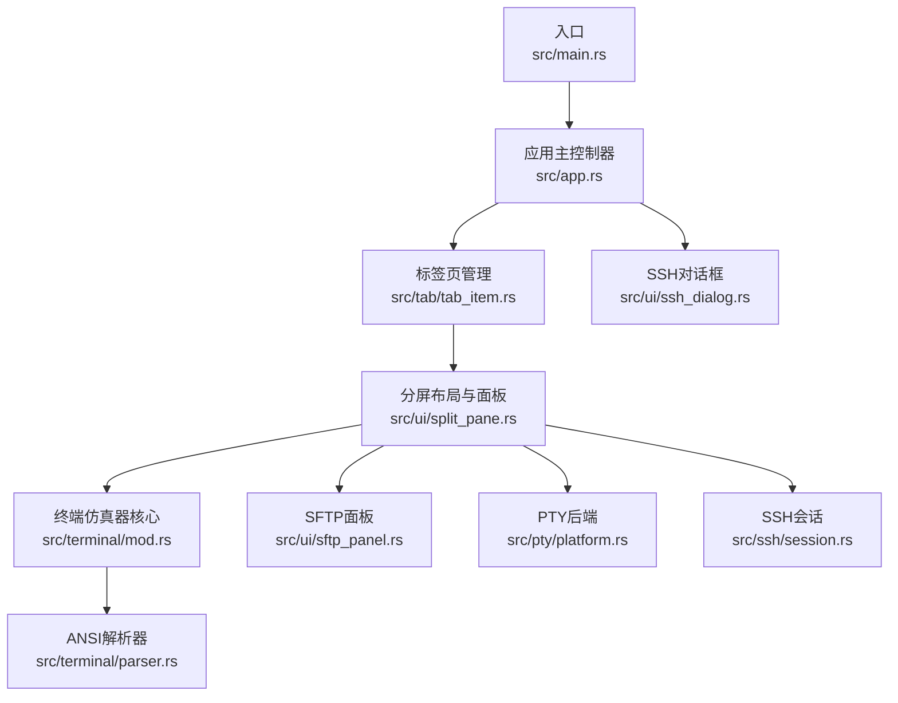
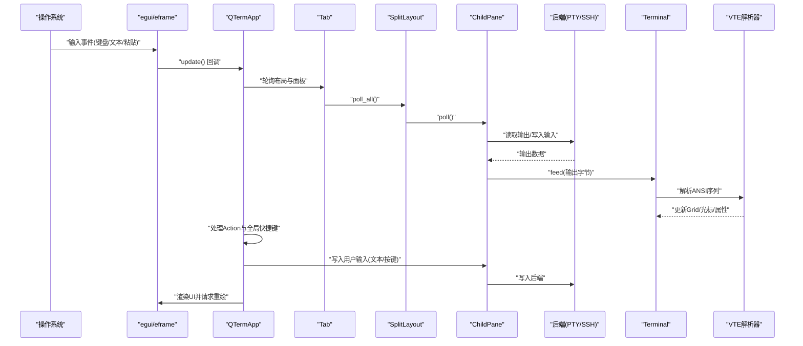
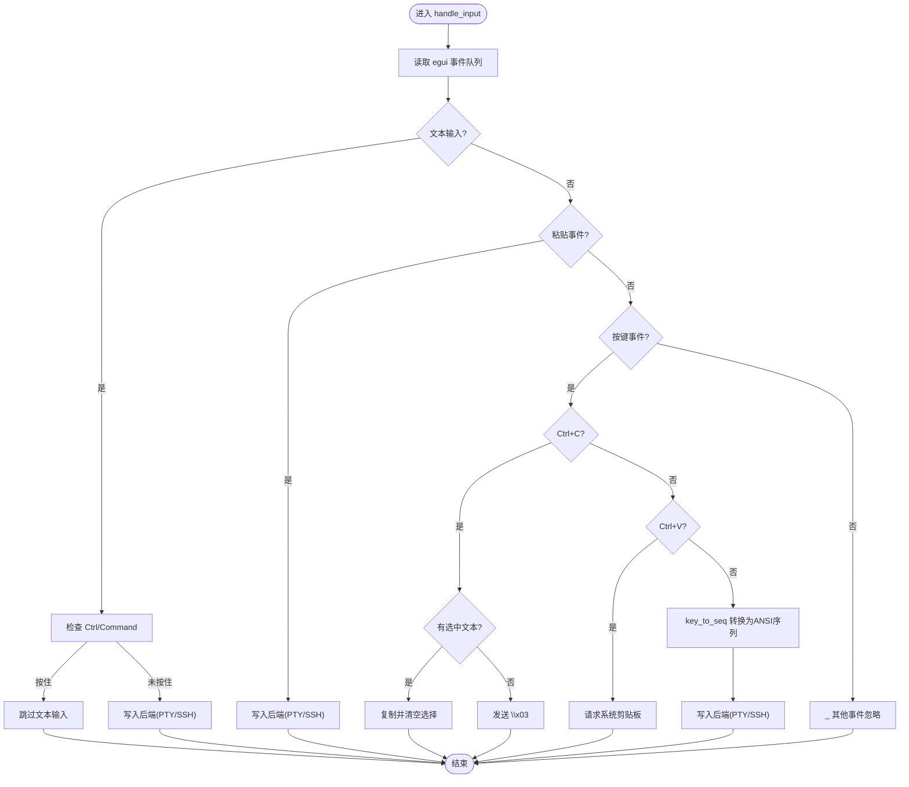
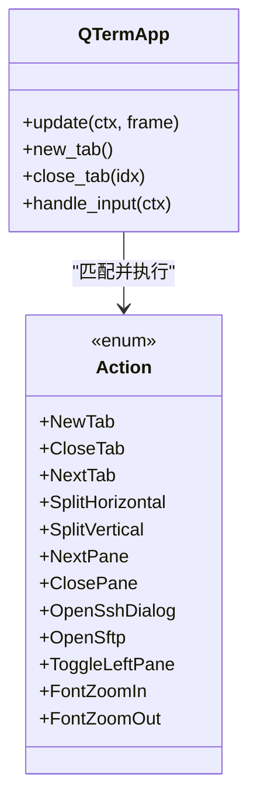
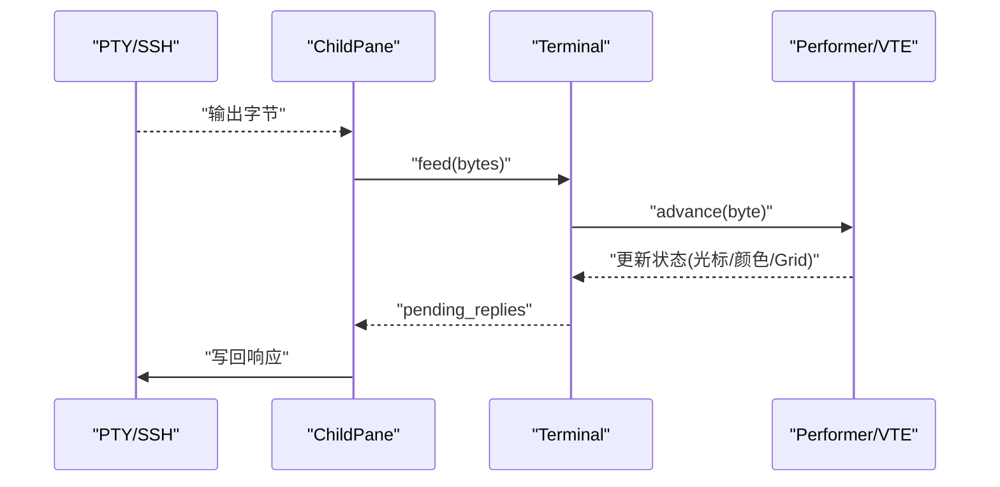
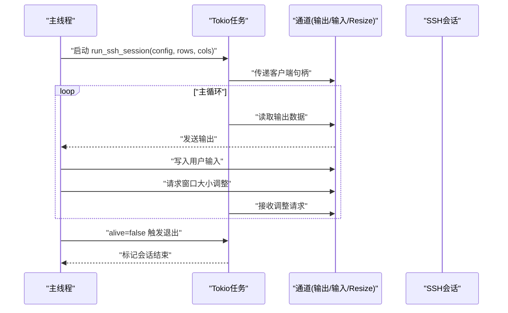
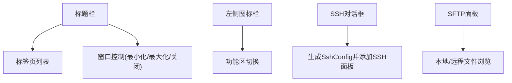
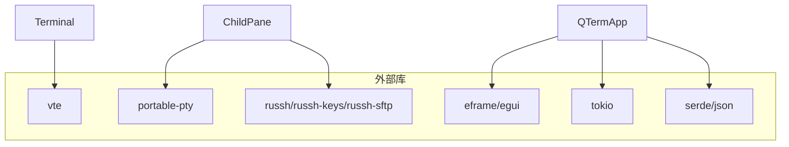

# 事件驱动架构

<cite>
**本文引用的文件**
- [src/main.rs](file://src/main.rs)
- [src/app.rs](file://src/app.rs)
- [src/ui/mod.rs](file://src/ui/mod.rs)
- [src/ui/split_pane.rs](file://src/ui/split_pane.rs)
- [src/ui/ssh_dialog.rs](file://src/ui/ssh_dialog.rs)
- [src/tabs/mod.rs](file://src/tabs/mod.rs)
- [src/tab/tab_item.rs](file://src/tab/tab_item.rs)
- [src/terminal/mod.rs](file://src/terminal/mod.rs)
- [src/terminal/parser.rs](file://src/terminal/parser.rs)
- [src/ssh/session.rs](file://src/ssh/session.rs)
- [src/pty/platform.rs](file://src/pty/platform.rs)
- [src/ui/sftp_panel.rs](file://src/ui/sftp_panel.rs)
- [Cargo.toml](file://Cargo.toml)
</cite>

## 目录
1. [简介](#简介)
2. [项目结构](#项目结构)
3. [核心组件](#核心组件)
4. [架构总览](#架构总览)
5. [详细组件分析](#详细组件分析)
6. [依赖关系分析](#依赖关系分析)
7. [性能考量](#性能考量)
8. [故障排查指南](#故障排查指南)
9. [结论](#结论)
10. [附录](#附录)

## 简介
本文件面向QTerm的事件驱动架构，围绕基于egui框架的事件处理机制展开，系统性说明输入事件捕获、事件分发与响应处理的完整流程；深入解析Action枚举的设计与使用，展示如何将用户输入转化为应用级操作指令；阐述异步消息传递系统，解释终端数据流、SSH会话状态变化与UI更新之间的异步通信；描述事件循环中的状态同步策略，包括数据竞争规避与状态一致性保障；最后给出事件处理的最佳实践，涵盖性能优化与内存管理策略。

## 项目结构
QTerm采用模块化组织，以功能域划分：应用入口与主控制器、UI子系统（分屏、SFTP面板、SSH对话框）、标签页管理、终端仿真器核心、SSH与PTY后端、主题与配置等。egui/eframe负责渲染循环与事件输入，应用层在每次update中轮询数据、处理事件并驱动UI刷新。

**图表来源**
- [src/main.rs:51-87](file://src/main.rs#L51-L87)
- [src/app.rs:284-575](file://src/app.rs#L284-L575)
- [src/tab/tab_item.rs:11-48](file://src/tab/tab_item.rs#L11-L48)
- [src/ui/split_pane.rs:132-209](file://src/ui/split_pane.rs#L132-L209)
- [src/terminal/mod.rs:24-41](file://src/terminal/mod.rs#L24-L41)
- [src/ui/sftp_panel.rs:11-22](file://src/ui/sftp_panel.rs#L11-L22)
- [src/ui/ssh_dialog.rs:10-21](file://src/ui/ssh_dialog.rs#L10-L21)
- [src/terminal/parser.rs:10-31](file://src/terminal/parser.rs#L10-L31)
- [src/pty/platform.rs:5-21](file://src/pty/platform.rs#L5-L21)
- [src/ssh/session.rs:11-90](file://src/ssh/session.rs#L11-L90)

**章节来源**
- [src/main.rs:1-87](file://src/main.rs#L1-L87)
- [src/app.rs:284-575](file://src/app.rs#L284-L575)

## 核心组件
- 应用主控制器（QTermApp）：承载UI状态、标签页集合、主题与配置，实现eframe::App接口，在update中完成轮询、事件处理与渲染。
- 标签页（Tab）：封装SplitLayout，管理多面板布局与面板生命周期。
- 分屏布局（SplitLayout/ChildPane）：统一管理本地PTY、SSH会话与SFTP面板，提供poll、write、resize、close等能力。
- 终端仿真器（Terminal）：维护Grid、光标、颜色属性、选择与滚动区域，通过VTE解析ANSI序列并生成渲染数据。
- 输入事件处理：在egui事件循环中捕获键盘、文本、粘贴与按键事件，转换为ANSI序列或直接写入后端。
- 异步通信：SSH会话在Tokio任务中运行，通过通道与主线程交换数据；SFTP事件通过轮询回调驱动UI更新。
- UI组件：SSH对话框、SFTP面板、标题栏与侧边栏等，均通过egui构建并参与事件分发。

**章节来源**
- [src/app.rs:18-105](file://src/app.rs#L18-L105)
- [src/tab/tab_item.rs:5-48](file://src/tab/tab_item.rs#L5-L48)
- [src/ui/split_pane.rs:132-209](file://src/ui/split_pane.rs#L132-L209)
- [src/terminal/mod.rs:24-41](file://src/terminal/mod.rs#L24-L41)
- [src/terminal/parser.rs:10-31](file://src/terminal/parser.rs#L10-L31)
- [src/ui/ssh_dialog.rs:10-21](file://src/ui/ssh_dialog.rs#L10-L21)
- [src/ui/sftp_panel.rs:11-22](file://src/ui/sftp_panel.rs#L11-L22)

## 架构总览
下图展示了事件驱动的整体流转：egui输入事件进入应用层，应用层根据当前活动面板与Action映射进行处理，随后将输入写入后端（PTY/SSH），后端将远端输出经通道回传至主线程，主线程解析并更新终端Grid，最终触发渲染。

**图表来源**
- [src/app.rs:284-575](file://src/app.rs#L284-L575)
- [src/app.rs:1352-1465](file://src/app.rs#L1352-L1465)
- [src/tab/tab_item.rs:23-35](file://src/tab/tab_item.rs#L23-L35)
- [src/ui/split_pane.rs:62-97](file://src/ui/split_pane.rs#L62-L97)
- [src/terminal/mod.rs:65-74](file://src/terminal/mod.rs#L65-L74)
- [src/terminal/parser.rs:10-31](file://src/terminal/parser.rs#L10-L31)
- [src/ssh/session.rs:48-82](file://src/ssh/session.rs#L48-L82)

## 详细组件分析

### 输入事件捕获与分发
- 全局快捷键映射：在update中扫描egui输入，识别组合键并映射到Action枚举，随后执行相应业务动作（新建/关闭标签页、分屏、切换面板、打开对话框、字体缩放等）。
- 面板级输入事件：遍历活动面板，读取egui事件队列，处理文本输入、粘贴与按键事件。文本输入在未按住Ctrl/Command时写入后端；粘贴事件直接写入；按键事件通过key_to_seq转换为ANSI序列再写入。
- 特殊处理：
  - Ctrl+C：若存在选中文本则复制，否则发送SIGINT（\x03）。
  - Ctrl+V/Ctrl+Shift+V：请求系统剪贴板内容，随后写入后端。
  - 终端待回复ANSI响应：从Terminal.pending_replies中取出并写回后端。

**图表来源**
- [src/app.rs:1352-1465](file://src/app.rs#L1352-L1465)
- [src/app.rs:1429-1465](file://src/app.rs#L1429-L1465)

**章节来源**
- [src/app.rs:301-393](file://src/app.rs#L301-L393)
- [src/app.rs:1352-1465](file://src/app.rs#L1352-L1465)

### Action枚举设计与使用
- 设计目标：将用户输入映射为稳定、可维护的应用级操作指令，覆盖标签页管理、分屏、面板切换与关闭、对话框打开、字体缩放等。
- 使用方式：在update中扫描输入，匹配到特定组合键后设置action变量，随后在match分支中执行具体逻辑，如新建标签页、水平/垂直分屏、切换/关闭面板、打开SSH对话框、切换左侧面板显示、调整字体大小等。
- 优势：集中式映射便于扩展与测试，避免分散的键盘判定逻辑。

**图表来源**
- [src/app.rs:265-280](file://src/app.rs#L265-L280)
- [src/app.rs:301-393](file://src/app.rs#L301-L393)

**章节来源**
- [src/app.rs:265-280](file://src/app.rs#L265-L280)
- [src/app.rs:301-393](file://src/app.rs#L301-L393)

### 终端数据流与ANSI解析
- 数据输入：后端（PTY/SSH）输出经ChildPane.poll读取，写入Terminal.feed。
- 解析过程：Terminal.feed逐字节交由VTE解析器，Performer将命令应用到Terminal状态（更新Grid、光标、颜色、滚动区域等）。
- 输出生成：Terminal在解析过程中可能产生ANSI响应（如DSR、DA1），放入pending_replies，随后由应用层写回后端。
- 选择与文本提取：支持双击单词、三击整行等选择，并可复制选中文本。

**图表来源**
- [src/ui/split_pane.rs:62-97](file://src/ui/split_pane.rs#L62-L97)
- [src/terminal/mod.rs:65-74](file://src/terminal/mod.rs#L65-L74)
- [src/terminal/parser.rs:10-31](file://src/terminal/parser.rs#L10-L31)
- [src/terminal/mod.rs:137-200](file://src/terminal/mod.rs#L137-L200)

**章节来源**
- [src/ui/split_pane.rs:62-97](file://src/ui/split_pane.rs#L62-L97)
- [src/terminal/mod.rs:65-74](file://src/terminal/mod.rs#L65-L74)
- [src/terminal/parser.rs:10-31](file://src/terminal/parser.rs#L10-L31)
- [src/terminal/mod.rs:137-200](file://src/terminal/mod.rs#L137-L200)

### 异步消息传递系统
- SSH会话：在Tokio任务中运行run_ssh_session，通过通道与主线程交换数据（输出、输入、窗口大小调整）。会话主循环使用tokio::select!等待不同来源的消息，保证非阻塞与高吞吐。
- SFTP事件：SftpPanel通过轮询SftpHandle的事件队列，处理连接、目录列表、上传/下载/创建目录/删除等事件，驱动UI状态更新。
- 通道与锁：会话句柄通过Arc+Mutex保护共享访问；Alive标志位用于安全终止。

**图表来源**
- [src/ssh/session.rs:11-90](file://src/ssh/session.rs#L11-L90)

**章节来源**
- [src/ssh/session.rs:11-90](file://src/ssh/session.rs#L11-L90)
- [src/ui/sftp_panel.rs:46-104](file://src/ui/sftp_panel.rs#L46-L104)

### 事件循环中的状态同步策略
- 线程模型：主线程负责UI与事件处理；Tokio任务负责网络IO；通过通道解耦，避免共享可变状态。
- 生命周期管理：ChildPane维护alive标志，当后端进程或会话结束时置false，上层据此清理面板。
- 窗口状态持久化：在on_exit中保存窗口位置、尺寸、最大化状态与主题，确保下次启动恢复。
- 输入与渲染分离：输入在update早期处理，渲染在末尾进行，中间通过Terminal状态与渲染器解耦。

**章节来源**
- [src/ui/split_pane.rs:118-130](file://src/ui/split_pane.rs#L118-L130)
- [src/app.rs:577-589](file://src/app.rs#L577-L589)

### UI组件与事件集成
- 标题栏：包含窗口拖拽、标签页列表与窗口控制按钮，点击事件由egui处理并触发ViewportCommand。
- 左侧图标栏与面板：切换功能区（终端/SFTP/设置），根据主题切换更新。
- SSH对话框：收集主机、端口、用户名与认证信息，生成SshConfig并交由应用层添加SSH面板。
- SFTP面板：双面板文件浏览与上传/下载，事件驱动UI更新。

**图表来源**
- [src/app.rs:596-724](file://src/app.rs#L596-L724)
- [src/app.rs:729-788](file://src/app.rs#L729-L788)
- [src/ui/ssh_dialog.rs:39-131](file://src/ui/ssh_dialog.rs#L39-L131)
- [src/ui/sftp_panel.rs:106-142](file://src/ui/sftp_panel.rs#L106-L142)

**章节来源**
- [src/app.rs:596-724](file://src/app.rs#L596-L724)
- [src/app.rs:729-788](file://src/app.rs#L729-L788)
- [src/ui/ssh_dialog.rs:39-131](file://src/ui/ssh_dialog.rs#L39-L131)
- [src/ui/sftp_panel.rs:106-142](file://src/ui/sftp_panel.rs#L106-L142)

## 依赖关系分析
- 外部依赖：eframe/egui负责UI与事件；vte用于ANSI解析；portable-pty用于本地PTY；russh/russh-keys/russh-sftp用于SSH；tokio用于异步运行时；serde等用于序列化。
- 模块耦合：应用层对UI子系统、标签页、终端与后端模块松耦合，通过接口与通道交互；终端解析器与Terminal强内聚。

**图表来源**
- [Cargo.toml:8-25](file://Cargo.toml#L8-L25)
- [src/app.rs:284-575](file://src/app.rs#L284-L575)
- [src/terminal/mod.rs:24-41](file://src/terminal/mod.rs#L24-L41)
- [src/ui/split_pane.rs:1-209](file://src/ui/split_pane.rs#L1-L209)

**章节来源**
- [Cargo.toml:8-25](file://Cargo.toml#L8-L25)

## 性能考量
- 渲染与输入分离：在update末尾请求repaint，避免频繁重绘；在渲染前完成所有状态更新。
- 事件批处理：ChildPane.poll中使用try_recv批量消费后端输出，减少锁竞争与系统调用次数。
- 字体与回滚缓冲：合理设置scrollback_lines，避免过大内存占用；动态调整字体大小时仅更新配置与字体表。
- 异步I/O：SSH会话使用Tokio任务与通道，避免阻塞主线程；窗口大小调整通过通道异步通知后端。
- 选择与复制：仅在需要时复制文本，避免不必要的字符串拷贝。

## 故障排查指南
- SSH连接失败：检查SshDialog输入参数与认证方式；查看会话错误信息并重试；确认网络连通与端口开放。
- 终端显示异常：检查Terminal.resize与滚动区域设置；确认ANSI序列解析是否正确；验证pending_replies是否被及时写出。
- SFTP操作失败：关注SftpPanel的状态字符串与错误事件；确认权限与路径有效性；避免对目录执行下载/上传。
- 输入无响应：确认当前面板类型（Terminal/SFTP）；检查Ctrl/Command修饰键是否影响文本输入；验证key_to_seq映射是否覆盖目标按键。

**章节来源**
- [src/ui/ssh_dialog.rs:104-131](file://src/ui/ssh_dialog.rs#L104-L131)
- [src/ui/sftp_panel.rs:46-104](file://src/ui/sftp_panel.rs#L46-L104)
- [src/app.rs:1352-1465](file://src/app.rs#L1352-L1465)

## 结论
QTerm的事件驱动架构以egui为核心，结合Action映射与分屏布局，实现了从输入捕获到渲染更新的完整闭环。通过通道与Tokio任务解耦网络IO，配合Terminal的VTE解析，既保证了实时性又提升了可维护性。建议在扩展新功能时遵循现有模式：集中映射Action、通过通道解耦后端、在update中统一处理事件与渲染，并持续关注性能与内存占用。

## 附录
- 快捷键映射参考：Action枚举与update中的键位判定。
- 终端特性：Alt屏幕模式、滚动区域、颜色与属性、选择与复制。
- 平台差异：默认Shell路径在不同平台的获取策略。

**章节来源**
- [src/app.rs:265-280](file://src/app.rs#L265-L280)
- [src/app.rs:301-393](file://src/app.rs#L301-L393)
- [src/terminal/mod.rs:118-135](file://src/terminal/mod.rs#L118-L135)
- [src/pty/platform.rs:5-21](file://src/pty/platform.rs#L5-L21)