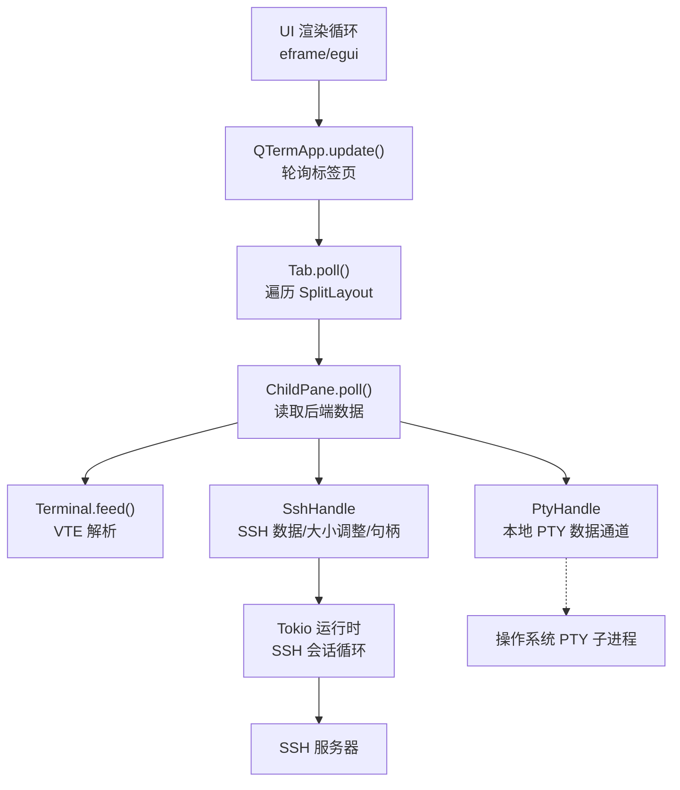
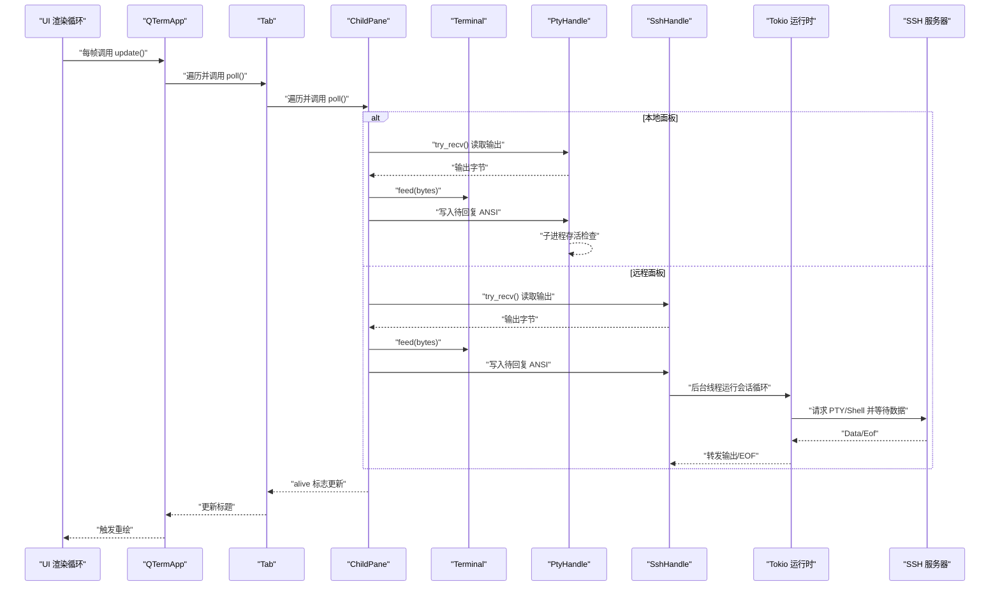
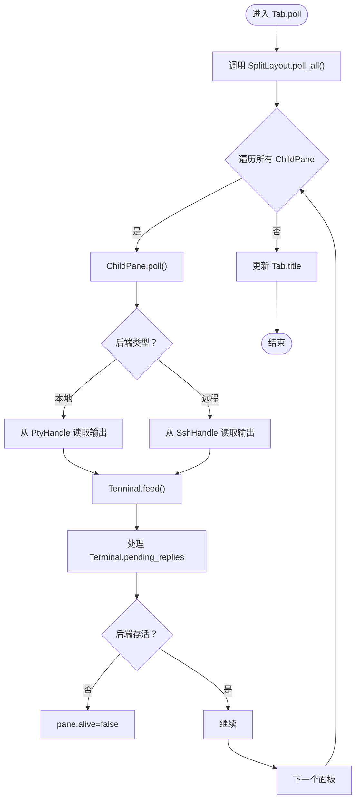
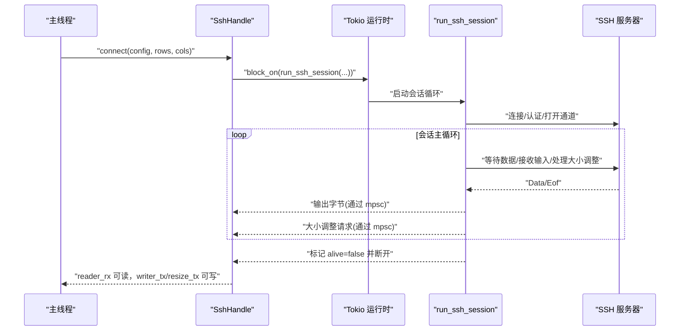
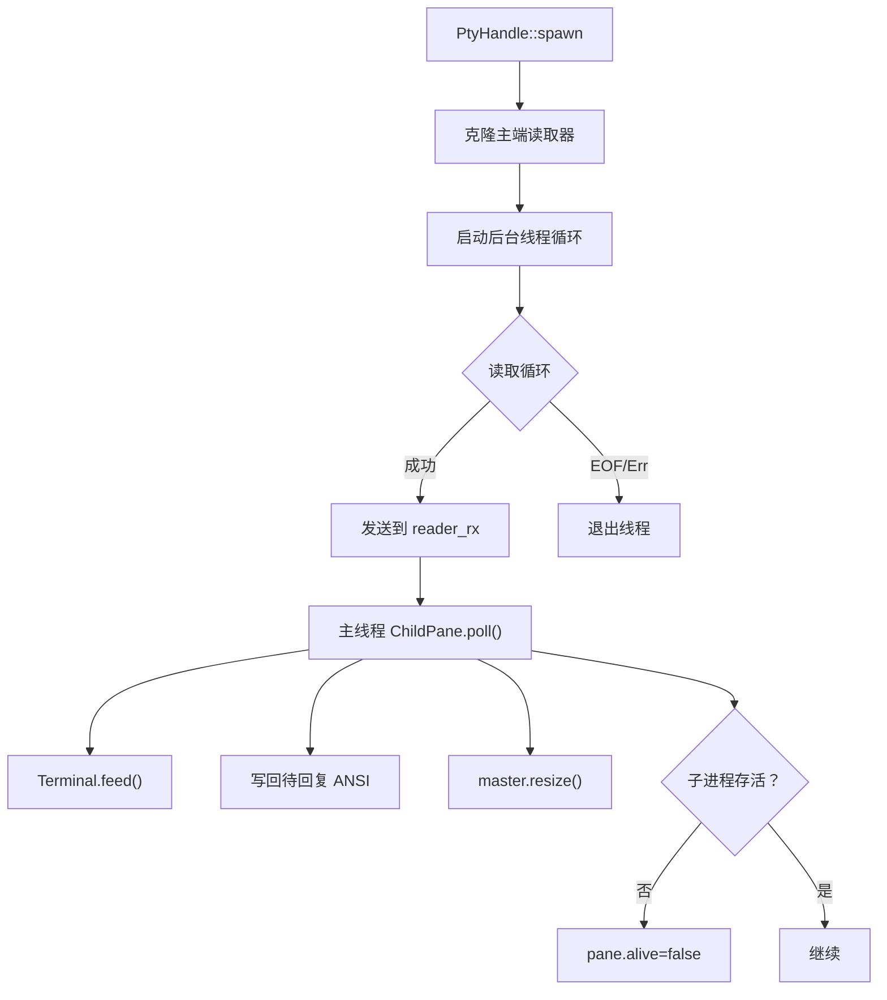
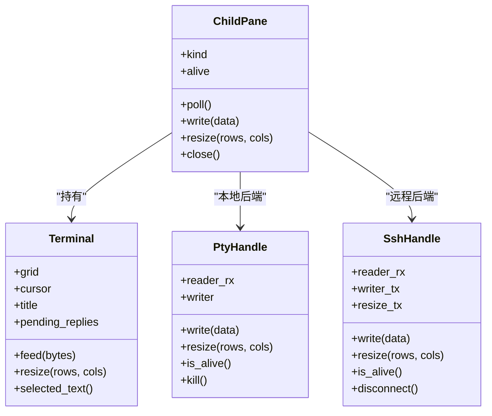
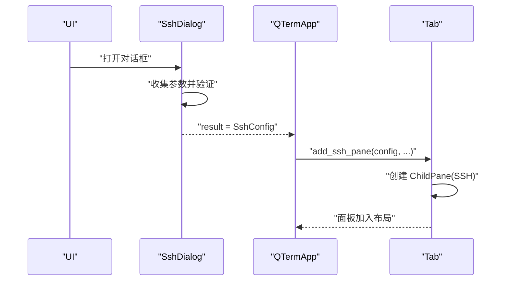
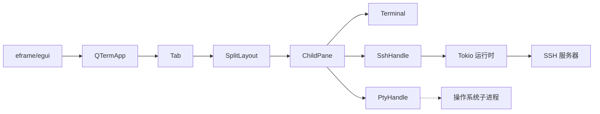

# 异步通信机制

<cite>
**本文引用的文件**
- [main.rs](file://src/main.rs)
- [app.rs](file://src/app.rs)
- [tab_item.rs](file://src/tab/tab_item.rs)
- [split_pane.rs](file://src/ui/split_pane.rs)
- [pty/mod.rs](file://src/pty/mod.rs)
- [ssh/mod.rs](file://src/ssh/mod.rs)
- [ssh/session.rs](file://src/ssh/session.rs)
- [terminal/mod.rs](file://src/terminal/mod.rs)
- [ssh_dialog.rs](file://src/ui/ssh_dialog.rs)
- [config.rs](file://src/config.rs)
- [connection/models.rs](file://src/connection/models.rs)
- [Cargo.toml](file://Cargo.toml)
</cite>

## 目录
1. [简介](#简介)
2. [项目结构](#项目结构)
3. [核心组件](#核心组件)
4. [架构总览](#架构总览)
5. [详细组件分析](#详细组件分析)
6. [依赖关系分析](#依赖关系分析)
7. [性能考量](#性能考量)
8. [故障排查指南](#故障排查指南)
9. [结论](#结论)
10. [附录](#附录)

## 简介
本文件聚焦于 QTerm 的异步通信机制，围绕基于 Tokio 运行时的异步消息传递系统展开，覆盖以下方面：
- 终端数据流：本地 PTY 与远程 SSH 的数据读写与大小调整
- SSH 会话状态变化：连接、认证、通道生命周期与错误传播
- UI 更新：事件循环中对标签页、面板状态的轮询与渲染
- 任务调度与资源清理：线程与异步任务的协作、通道与标志位的使用
- 性能优化与最佳实践：缓冲区大小、通道容量、轮询策略与错误处理

## 项目结构
QTerm 采用“UI 主循环 + 多面板布局 + 后端句柄”的分层设计：
- UI 层：基于 eframe/egui 的渲染循环，负责输入事件、布局计算与绘制
- 标签页与面板层：SplitLayout 管理多个 ChildPane，每个 ChildPane 持有 Terminal 与后端句柄（本地 PTY 或远程 SSH）
- 后端层：PtyHandle（本地）与 SshHandle（远程）分别封装数据通道与生命周期控制
- 异步运行时：SSH 使用独立的 Tokio 运行时，配合线程阻塞执行与通道通信

图表来源
- [app.rs:284-575](file://src/app.rs#L284-L575)
- [tab_item.rs:23-35](file://src/tab/tab_item.rs#L23-L35)
- [split_pane.rs:70-113](file://src/ui/split_pane.rs#L70-L113)
- [pty/mod.rs:19-85](file://src/pty/mod.rs#L19-L85)
- [ssh/mod.rs:68-109](file://src/ssh/mod.rs#L68-L109)
- [ssh/session.rs:11-90](file://src/ssh/session.rs#L11-L90)

章节来源
- [main.rs:51-87](file://src/main.rs#L51-L87)
- [app.rs:284-575](file://src/app.rs#L284-L575)
- [tab_item.rs:11-48](file://src/tab/tab_item.rs#L11-L48)
- [split_pane.rs:151-238](file://src/ui/split_pane.rs#L151-L238)

## 核心组件
- QTermApp：UI 主循环，每帧调用 Tab.poll() 轮询面板状态，并驱动渲染与输入处理
- Tab：持有 SplitLayout，负责标签页级的轮询与标题更新
- SplitLayout/ChildPane：管理面板集合、活动面板与面板级轮询；ChildPane 内部根据后端类型（本地/SSH）进行不同处理
- PtyHandle：本地 PTY 句柄，使用线程读取子进程输出并通过 mpsc 通道传给 UI
- SshHandle：远程 SSH 句柄，使用 Tokio 运行时在后台线程中运行会话循环，通过多路通道与 UI 通信
- Terminal：终端仿真器，负责解析字节流并维护网格、光标与选择状态

章节来源
- [app.rs:67-217](file://src/app.rs#L67-L217)
- [tab_item.rs:3-48](file://src/tab/tab_item.rs#L3-L48)
- [split_pane.rs:13-149](file://src/ui/split_pane.rs#L13-L149)
- [pty/mod.rs:9-121](file://src/pty/mod.rs#L9-L121)
- [ssh/mod.rs:60-136](file://src/ssh/mod.rs#L60-L136)
- [terminal/mod.rs:24-200](file://src/terminal/mod.rs#L24-L200)

## 架构总览
下图展示了从 UI 输入到后端数据流的异步路径，以及 SSH 会话在 Tokio 运行时中的主循环。

图表来源
- [app.rs:284-575](file://src/app.rs#L284-L575)
- [tab_item.rs:23-35](file://src/tab/tab_item.rs#L23-L35)
- [split_pane.rs:70-113](file://src/ui/split_pane.rs#L70-L113)
- [pty/mod.rs:60-85](file://src/pty/mod.rs#L60-L85)
- [ssh/mod.rs:84-109](file://src/ssh/mod.rs#L84-L109)
- [ssh/session.rs:48-90](file://src/ssh/session.rs#L48-L90)

## 详细组件分析

### 事件循环与轮询：Tab.poll 的实现
- 控制流：QTermApp 每帧调用 Tab.poll()，Tab 再调用 SplitLayout.poll_all()，逐个 ChildPane.poll()，最终驱动 Terminal.feed() 与后端句柄的读写
- 标题更新：若任一活动面板的 Terminal 有标题变更，则同步到 Tab.title
- 存活检测：ChildPane.poll() 会根据后端存活状态更新 pane.alive，从而影响 UI 的状态显示

图表来源
- [app.rs:284-575](file://src/app.rs#L284-L575)
- [tab_item.rs:23-35](file://src/tab/tab_item.rs#L23-L35)
- [split_pane.rs:180-185](file://src/ui/split_pane.rs#L180-L185)
- [split_pane.rs:70-113](file://src/ui/split_pane.rs#L70-L113)

章节来源
- [app.rs:284-575](file://src/app.rs#L284-L575)
- [tab_item.rs:23-35](file://src/tab/tab_item.rs#L23-L35)
- [split_pane.rs:180-185](file://src/ui/split_pane.rs#L180-L185)

### SSH 会话的异步处理模式
- 运行时与线程：SshHandle.connect 在后台线程中使用 get_runtime().block_on(...) 启动 SSH 会话循环，避免阻塞 UI 线程
- 通道设计：
  - 输出通道：std::sync::mpsc::channel，从 SSH 会话循环发送字节到主线程
  - 输入通道：tokio::sync::mpsc::channel，主线程向 SSH 会话发送用户输入
  - 大小调整通道：tokio::sync::mpsc::channel，主线程请求调整远程终端大小
  - 句柄传递：tokio::sync::oneshot::channel，将 russh 客户端句柄传递给主线程以供后续子系统使用
- 会话循环：使用 tokio::select! 并发监听输出、输入与大小调整请求；收到 EOF 或 alive 标志为假时优雅断开

图表来源
- [ssh/mod.rs:68-109](file://src/ssh/mod.rs#L68-L109)
- [ssh/session.rs:11-90](file://src/ssh/session.rs#L11-L90)

章节来源
- [ssh/mod.rs:68-136](file://src/ssh/mod.rs#L68-L136)
- [ssh/session.rs:11-90](file://src/ssh/session.rs#L11-L90)

### 本地 PTY 进程的异步通信机制
- 数据流：子线程持续从 PTY 主端读取数据，通过 mpsc::channel 发送到主线程；主线程在 ChildPane.poll() 中消费并喂给 Terminal
- 写入与大小调整：主线程将 Terminal 的待回复 ANSI 响应写回 PTY；调整大小时调用 master.resize()
- 存活检测：通过子进程 try_wait() 判断是否仍在运行；Drop 时自动 kill 子进程

图表来源
- [pty/mod.rs:19-85](file://src/pty/mod.rs#L19-L85)
- [split_pane.rs:70-113](file://src/ui/split_pane.rs#L70-L113)

章节来源
- [pty/mod.rs:19-121](file://src/pty/mod.rs#L19-L121)
- [split_pane.rs:70-113](file://src/ui/split_pane.rs#L70-L113)

### 终端数据解析与渲染
- Terminal.feed：将字节流交由 VTE 解析器逐步处理，更新网格、光标、滚动区域与选择状态
- Terminal.pending_replies：收集需要立即回写的 ANSI 响应（例如查询类），在 ChildPane.poll() 中统一写回后端
- 终端大小：Terminal.resize 与 ChildPane.resize 协同，确保终端网格与后端一致

图表来源
- [terminal/mod.rs:24-200](file://src/terminal/mod.rs#L24-L200)
- [split_pane.rs:25-149](file://src/ui/split_pane.rs#L25-L149)
- [pty/mod.rs:9-121](file://src/pty/mod.rs#L9-L121)
- [ssh/mod.rs:60-136](file://src/ssh/mod.rs#L60-L136)

章节来源
- [terminal/mod.rs:24-200](file://src/terminal/mod.rs#L24-L200)
- [split_pane.rs:25-149](file://src/ui/split_pane.rs#L25-L149)

### SSH 对话框与 UI 集成
- SshDialog：弹窗收集连接参数，生成 SshConfig 并通过 result 传递给主逻辑
- 主逻辑在 App.update() 中消费 result，调用 Tab.layout.add_ssh_pane() 创建远程面板

图表来源
- [ssh_dialog.rs:26-147](file://src/ui/ssh_dialog.rs#L26-L147)
- [app.rs:562-571](file://src/app.rs#L562-L571)
- [split_pane.rs:199-209](file://src/ui/split_pane.rs#L199-L209)

章节来源
- [ssh_dialog.rs:26-147](file://src/ui/ssh_dialog.rs#L26-L147)
- [app.rs:562-571](file://src/app.rs#L562-L571)
- [split_pane.rs:199-209](file://src/ui/split_pane.rs#L199-L209)

## 依赖关系分析
- Tokio 运行时：SSH 使用独立运行时，避免与 UI 线程竞争；通过线程阻塞执行与通道通信实现解耦
- 通道类型：
  - 本地 PTY：std::sync::mpsc（线程安全，适合少量高频数据）
  - 远程 SSH：tokio::sync::mpsc（异步通道，适合高并发与 select! 并发）
- 依赖库：eframe/egui（UI）、portable-pty（本地 PTY）、russh/russh-keys/russh-sftp（SSH）、vte（ANSI 解析）

图表来源
- [Cargo.toml:8-25](file://Cargo.toml#L8-L25)
- [app.rs:284-575](file://src/app.rs#L284-L575)
- [split_pane.rs:151-238](file://src/ui/split_pane.rs#L151-L238)

章节来源
- [Cargo.toml:8-25](file://Cargo.toml#L8-L25)
- [app.rs:284-575](file://src/app.rs#L284-L575)

## 性能考量
- 通道容量与背压
  - SSH writer/resize 通道容量分别为 256/16，建议根据面板数量与输入频率适当调整
  - 本地 PTY 使用 mpsc::channel，默认容量较大，注意避免过多面板导致内存占用上升
- 轮询策略
  - ChildPane.poll() 使用 try_recv() 非阻塞读取，避免阻塞 UI 线程；建议保持每帧多次轮询以降低延迟
- 终端大小与渲染
  - 调整面板大小时，先调用 Terminal.resize 再调用后端 resize，确保解析与渲染一致性
- 资源清理
  - ChildPane.close() 会关闭后端（本地 kill、远程 disconnect），确保会话与子进程被正确释放
- Tokio 运行时特性
  - 使用 tokio 的 rt-multi-thread 特性，提升并发能力；SSH 使用独立运行时避免与 UI 抢占

章节来源
- [ssh/mod.rs:74-76](file://src/ssh/mod.rs#L74-L76)
- [pty/mod.rs:55-56](file://src/pty/mod.rs#L55-L56)
- [split_pane.rs:136-148](file://src/ui/split_pane.rs#L136-L148)
- [Cargo.toml:17](file://Cargo.toml#L17)

## 故障排查指南
- SSH 连接失败
  - 检查 SshConfig 参数（host/port/username/auth）与网络连通性
  - 查看 SshError 的具体类型（Connection/Auth/Channel），结合会话日志定位问题
- 会话异常断开
  - 观察 alive 标志与 EOF 消息；确认 UI 是否及时调用 resize 与写入
- 本地 PTY 无输出
  - 确认子线程读取循环未退出；检查 reader_rx 是否被消费；核对 shell 路径与环境变量
- UI 卡顿
  - 减少面板数量或降低通道容量；优化渲染路径；避免在 UI 线程中执行阻塞操作
- 配置与偏好
  - AppConfig/Preferences 读取失败时使用默认值；确认配置文件路径与权限

章节来源
- [ssh/mod.rs:35-53](file://src/ssh/mod.rs#L35-L53)
- [ssh/session.rs:48-90](file://src/ssh/session.rs#L48-L90)
- [pty/mod.rs:60-85](file://src/pty/mod.rs#L60-L85)
- [config.rs:68-127](file://src/config.rs#L68-L127)
- [config.rs:239-281](file://src/config.rs#L239-L281)

## 结论
QTerm 的异步通信机制通过“UI 主循环 + 多面板 + 后端句柄”的架构，实现了本地与远程终端的统一抽象。本地 PTY 使用线程 + mpsc 的简单可靠模式，远程 SSH 通过 Tokio 运行时与多路通道实现高并发与低延迟。ChildPane.poll() 作为事件循环的核心，负责将后端数据注入 Terminal 并驱动 UI 更新。遵循本文的最佳实践与排错建议，可在保证性能的同时提升稳定性与可维护性。

## 附录
- 配置与连接
  - AppConfig：窗口位置、尺寸、主题、字体大小、回滚行数、Shell 路径
  - Preferences：从 WhaleTerm preferences.json 读取字体与主题配置
  - Connection：从 WhaleTerm connections.json 读取连接列表（含加密密码）

章节来源
- [config.rs:37-127](file://src/config.rs#L37-L127)
- [config.rs:145-281](file://src/config.rs#L145-L281)
- [connection/models.rs:1-43](file://src/connection/models.rs#L1-L43)