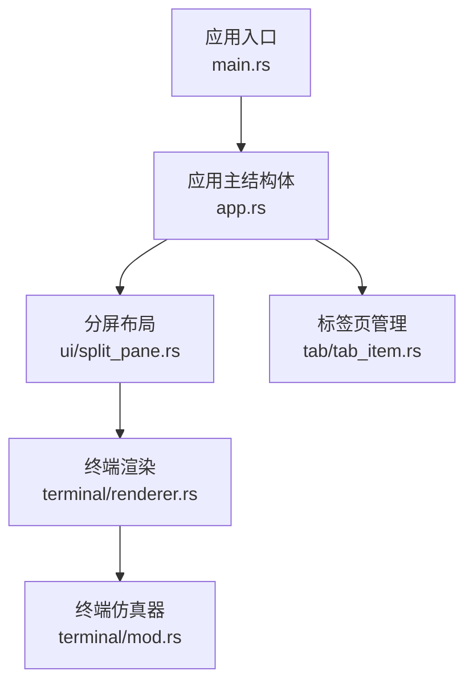
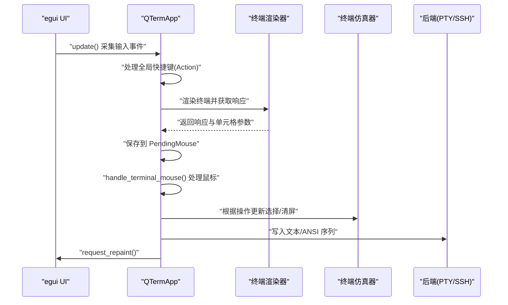
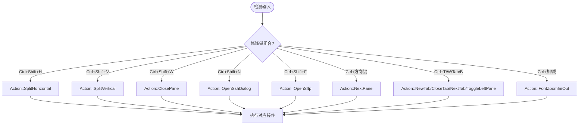
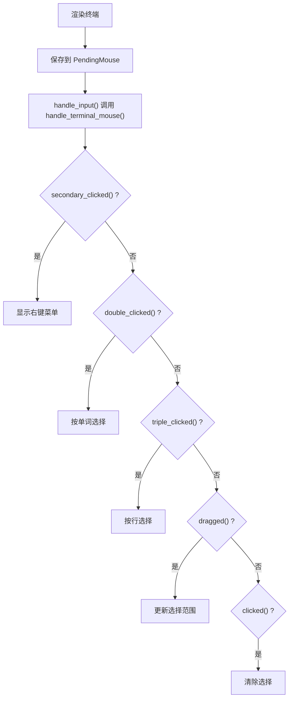
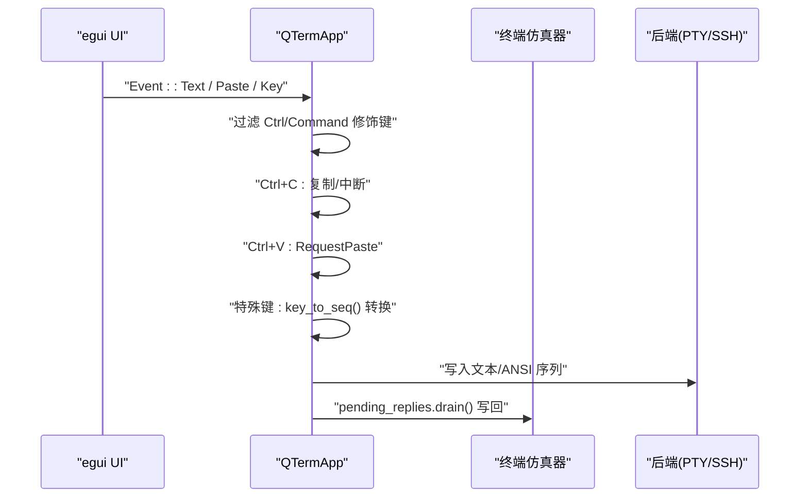
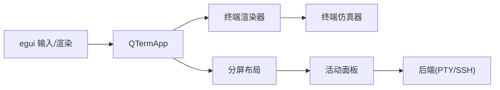

# 用户输入事件处理

<cite>
**本文档引用的文件**
- [main.rs](file://src/main.rs)
- [app.rs](file://src/app.rs)
- [split_pane.rs](file://src/ui/split_pane.rs)
- [renderer.rs](file://src/terminal/renderer.rs)
- [tab_item.rs](file://src/tab/tab_item.rs)
- [terminal_mod.rs](file://src/terminal/mod.rs)
</cite>

## 目录
1. [简介](#简介)
2. [项目结构](#项目结构)
3. [核心组件](#核心组件)
4. [架构总览](#架构总览)
5. [详细组件分析](#详细组件分析)
6. [依赖关系分析](#依赖关系分析)
7. [性能考量](#性能考量)
8. [故障排除指南](#故障排除指南)
9. [结论](#结论)

## 简介
本文件面向 QTerm 的用户输入事件处理，系统性阐述在 egui 框架下如何捕获和处理键盘、鼠标与触摸事件，并将其转换为应用级操作指令。重点包括：
- Action 枚举的设计理念与映射关系
- 全局快捷键系统（含 Ctrl+Shift 组合键）的实现
- PendingMouse 结构体的作用与鼠标事件的延迟处理机制
- 从输入事件到 UI 响应的完整处理链路
- 性能优化建议与最佳实践

## 项目结构
QTerm 的输入事件处理主要集中在应用主逻辑与终端渲染模块中，采用“事件收集 → 转换映射 → 应用执行”的分层设计：
- 应用入口与主循环：负责窗口初始化、egui 渲染循环与全局事件采集
- 应用主结构体：维护标签页、主题、全局状态与输入处理
- 终端渲染：提供鼠标交互响应与单元格坐标系
- 分屏布局：承载多个面板，决定当前活动面板与输入目标
- 终端仿真器：接收来自后端的字节流并解析为可视内容

图表来源
- [main.rs:51-87](file://src/main.rs#L51-L87)
- [app.rs:18-36](file://src/app.rs#L18-L36)
- [split_pane.rs:151-157](file://src/ui/split_pane.rs#L151-L157)
- [renderer.rs:44-180](file://src/terminal/renderer.rs#L44-L180)
- [tab_item.rs:5-9](file://src/tab/tab_item.rs#L5-L9)

章节来源
- [main.rs:51-87](file://src/main.rs#L51-L87)
- [app.rs:18-36](file://src/app.rs#L18-L36)

## 核心组件
- 应用主结构体 QTermApp：集中管理窗口状态、标签页、主题、全局快捷键与输入处理
- Action 枚举：将全局快捷键映射到具体应用操作
- PendingMouse：封装终端区域的鼠标交互响应与单元格坐标，用于延迟处理
- 终端渲染器：提供鼠标响应对象与单元格尺寸，支撑选择与右键菜单
- 分屏布局：管理面板数量、方向与活动面板，决定输入目标

章节来源
- [app.rs:265-281](file://src/app.rs#L265-L281)
- [app.rs:58-66](file://src/app.rs#L58-L66)
- [renderer.rs:16-23](file://src/terminal/renderer.rs#L16-L23)
- [split_pane.rs:151-157](file://src/ui/split_pane.rs#L151-L157)

## 架构总览
QTerm 的输入事件处理遵循以下流程：
1. egui 采集原始输入事件（键盘、鼠标、粘贴等）
2. 应用主循环在每次 update 中收集并处理全局快捷键
3. 终端渲染器返回鼠标交互响应与单元格坐标
4. 应用将鼠标响应存入 PendingMouse，稍后统一处理
5. 键盘事件转换为 ANSI 转义序列或特殊操作，写入后端
6. 右键菜单与选择逻辑在 handle_terminal_mouse 中完成

图表来源
- [app.rs:284-575](file://src/app.rs#L284-L575)
- [renderer.rs:44-180](file://src/terminal/renderer.rs#L44-L180)

## 详细组件分析

### Action 枚举与全局快捷键系统
- 设计理念：以枚举形式将用户快捷键映射为应用级操作，便于集中管理与扩展
- 快捷键覆盖：
  - Ctrl+Shift+H/V/W/N/F：水平分屏、垂直分屏、关闭面板、打开 SSH 对话框、打开 SFTP
  - Ctrl+方向键（不带 Shift）：切换面板
  - Ctrl+T/W/Tab/B：新建标签页、关闭标签页、切换标签、切换左侧面板
  - Ctrl+加/减：字体缩放
- 映射关系：在应用主循环中检测按键与修饰键组合，生成 Action，随后匹配执行相应操作

图表来源
- [app.rs:302-393](file://src/app.rs#L302-L393)

章节来源
- [app.rs:265-281](file://src/app.rs#L265-L281)
- [app.rs:302-393](file://src/app.rs#L302-L393)

### 鼠标事件与 PendingMouse 延迟处理
- PendingMouse 的作用：在渲染阶段收集鼠标响应与单元格参数，避免在渲染过程中直接修改状态，保证渲染与逻辑分离
- 处理时机：在 handle_input 中调用 handle_terminal_mouse，统一处理右键菜单、双击选词、三击选行与拖拽选择
- 单击/拖拽：单击清除选择，拖拽更新选择范围；双击/三击根据单元格坐标定位并设置选择范围

图表来源
- [app.rs:466-556](file://src/app.rs#L466-L556)
- [app.rs:1085-1166](file://src/app.rs#L1085-L1166)
- [renderer.rs:54-57](file://src/terminal/renderer.rs#L54-L57)

章节来源
- [app.rs:58-66](file://src/app.rs#L58-L66)
- [app.rs:1085-1166](file://src/app.rs#L1085-L1166)
- [renderer.rs:16-23](file://src/terminal/renderer.rs#L16-L23)

### 键盘事件与 ANSI 转义序列
- 文本输入：忽略 Ctrl/Command 修饰键触发的文本输入，避免与快捷键冲突
- 粘贴事件：通过 RequestPaste 触发系统剪贴板读取，再写入后端
- 特殊键处理：将 Enter、Backspace、Tab、Escape、方向键、Home/End、PageUp/Down、Insert/Delete 等转换为 ANSI 转义序列
- Ctrl+C：优先复制选中文本，否则发送中断信号（\x03）
- Ctrl+V/Ctrl+Shift+V：请求粘贴或强制复制

图表来源
- [app.rs:1329-1424](file://src/app.rs#L1329-L1424)
- [app.rs:1429-1465](file://src/app.rs#L1429-L1465)

章节来源
- [app.rs:1329-1424](file://src/app.rs#L1329-L1424)
- [app.rs:1429-1465](file://src/app.rs#L1429-L1465)

### 终端渲染与交互响应
- calculate_size：根据字体与可用空间计算行列数与单元格尺寸
- render：分配可交互画布，绘制背景、字符、选区与光标，返回响应与参数
- 单元格坐标：origin + col*cell_width，用于将像素坐标转换为网格坐标

章节来源
- [renderer.rs:26-40](file://src/terminal/renderer.rs#L26-L40)
- [renderer.rs:44-180](file://src/terminal/renderer.rs#L44-L180)

### 分屏布局与活动面板
- SplitLayout：管理面板数量、方向与活动面板索引
- add_local_pane/add_ssh_pane/add_sftp_pane：动态添加面板并设置活动面板
- remove_pane：移除面板并保持至少一个面板

章节来源
- [split_pane.rs:151-238](file://src/ui/split_pane.rs#L151-L238)

### 标签页与轮询
- Tab：封装 SplitLayout，轮询面板数据并更新标题
- alive/close：检查与关闭标签页

章节来源
- [tab_item.rs:5-48](file://src/tab/tab_item.rs#L5-L48)

## 依赖关系分析
- 应用主循环依赖 egui 的输入事件与渲染 API
- 终端渲染器依赖 egui 的交互能力（allocate_painter、Sense::click_and_drag）
- 输入处理依赖终端仿真器的状态（选择、标题、pending_replies）
- 分屏布局决定当前活动面板，从而决定输入目标

图表来源
- [app.rs:284-575](file://src/app.rs#L284-L575)
- [renderer.rs:44-180](file://src/terminal/renderer.rs#L44-L180)
- [split_pane.rs:151-157](file://src/ui/split_pane.rs#L151-L157)

章节来源
- [app.rs:284-575](file://src/app.rs#L284-L575)
- [renderer.rs:44-180](file://src/terminal/renderer.rs#L44-L180)
- [split_pane.rs:151-157](file://src/ui/split_pane.rs#L151-L157)

## 性能考量
- 渲染优化：终端渲染器按颜色分段绘制文本，减少绘制调用次数
- 事件处理：将鼠标响应保存至 PendingMouse，在 handle_input 中统一处理，避免在渲染期间修改状态
- 数据流：终端输出通过后端异步读取，避免阻塞 UI 线程
- 字体与尺寸：calculate_size 基于字体度量计算，避免频繁重排

章节来源
- [renderer.rs:80-106](file://src/terminal/renderer.rs#L80-L106)
- [app.rs:1085-1166](file://src/app.rs#L1085-L1166)
- [split_pane.rs:70-113](file://src/ui/split_pane.rs#L70-L113)

## 故障排除指南
- 快捷键无效
  - 检查修饰键组合是否正确（Ctrl+Shift 与 Ctrl 的区别）
  - 确认当前活动标签页存在且面板存活
- 右键菜单不显示
  - 确认 secondary_clicked() 条件满足
  - 检查 context_menu.show 与 pos 设置
- 无法复制/粘贴
  - 确认选中有文本或发送 Ctrl+C
  - 粘贴需通过 RequestPaste 触发系统剪贴板读取
- 选择异常
  - 检查单元格坐标转换与边界裁剪
  - 确认拖拽过程中 is_pointer_button_down_on 条件满足

章节来源
- [app.rs:1108-1166](file://src/app.rs#L1108-L1166)
- [app.rs:1257-1278](file://src/app.rs#L1257-L1278)
- [app.rs:1376-1400](file://src/app.rs#L1376-L1400)

## 结论
QTerm 的输入事件处理在 egui 框架下实现了清晰的职责分离：渲染与逻辑分离、事件采集与执行分离。通过 Action 枚举与 PendingMouse 延迟处理，系统既保证了响应速度，又提升了可维护性。建议在扩展新功能时遵循现有模式，优先通过 Action 映射与渲染器返回的响应进行处理，确保性能与一致性。