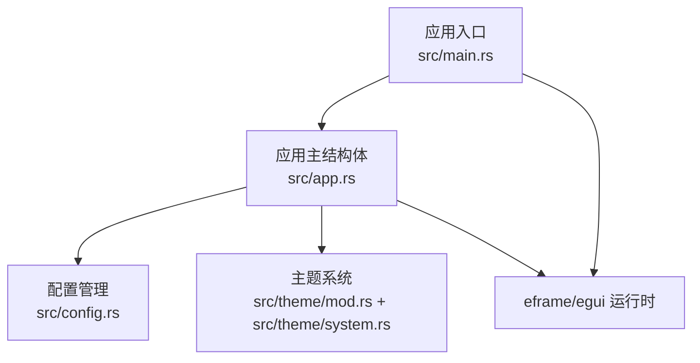
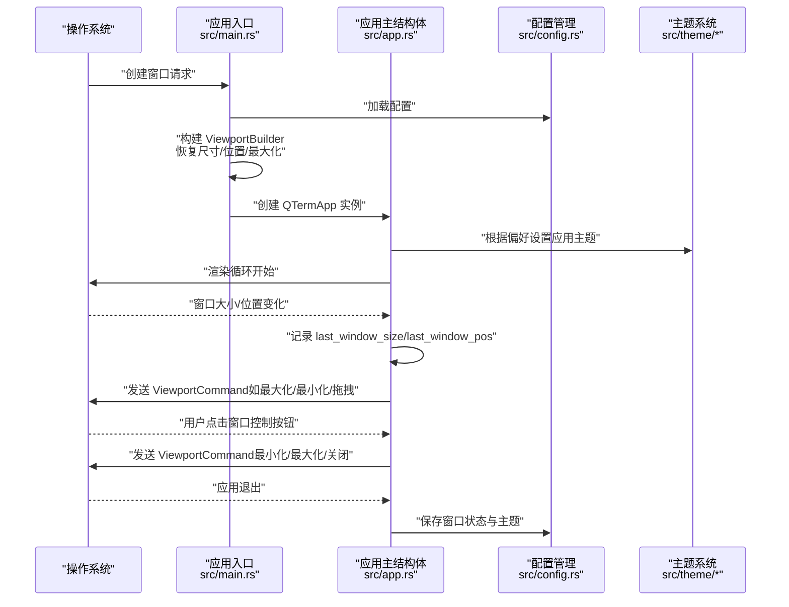
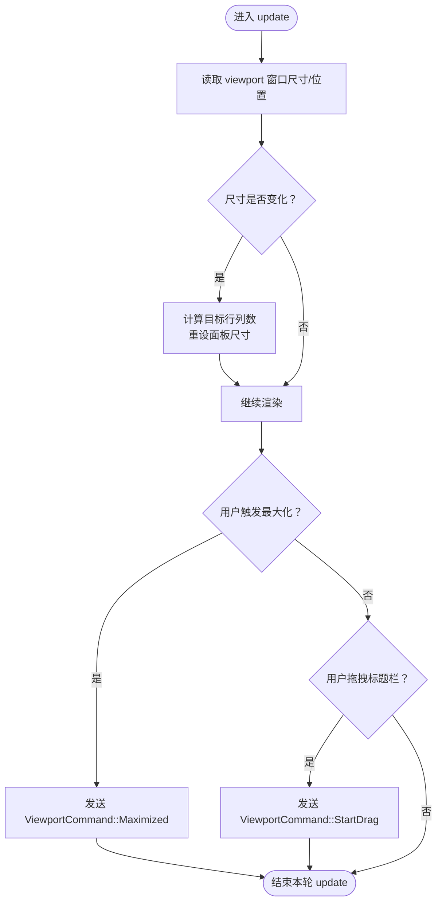
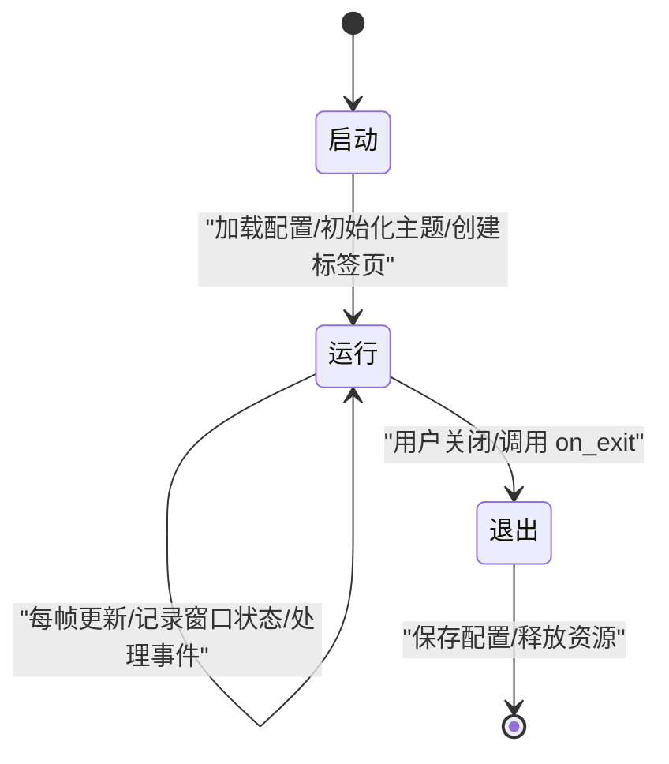
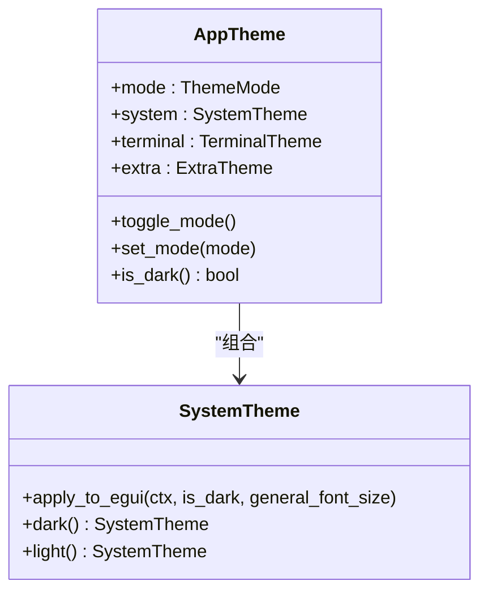
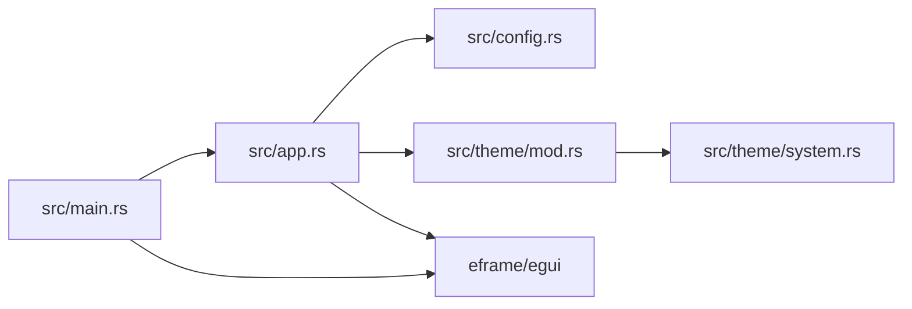

# 系统事件处理

<cite>
**本文引用的文件**
- [src/main.rs](file://src/main.rs)
- [src/app.rs](file://src/app.rs)
- [src/config.rs](file://src/config.rs)
- [src/theme/mod.rs](file://src/theme/mod.rs)
- [src/theme/system.rs](file://src/theme/system.rs)
- [Cargo.toml](file://Cargo.toml)
</cite>

## 目录
1. [简介](#简介)
2. [项目结构](#项目结构)
3. [核心组件](#核心组件)
4. [架构总览](#架构总览)
5. [详细组件分析](#详细组件分析)
6. [依赖关系分析](#依赖关系分析)
7. [性能考量](#性能考量)
8. [故障排除指南](#故障排除指南)
9. [结论](#结论)
10. [附录](#附录)

## 简介
本文件聚焦于 QTerm 的系统事件处理机制，围绕以下主题展开：
- 窗口管理事件：窗口大小变化、位置变更、最大化状态的响应与持久化
- egui 上下文中的 viewport 命令处理：如何通过 ViewportCommand 响应系统级窗口操作
- 应用生命周期事件：启动、运行、退出阶段的状态管理与配置持久化
- 系统主题变化的监听与响应：动态主题切换的实现原理与集成点
- 调试技巧与故障排除：常见问题定位与修复建议
- 跨平台兼容性：Windows 与非 Windows 平台在窗口位置可见性检测上的差异

## 项目结构
QTerm 基于 eframe/egui 构建，事件处理主要集中在应用入口与应用主结构体中：
- 应用入口负责构建窗口视口、恢复窗口状态，并启动渲染循环
- 应用主结构体负责运行时事件处理、窗口状态记录、主题切换与退出保存



**图表来源**
- [src/main.rs:51-87](file://src/main.rs#L51-L87)
- [src/app.rs:284-589](file://src/app.rs#L284-L589)
- [src/config.rs:37-127](file://src/config.rs#L37-L127)
- [src/theme/mod.rs:14-71](file://src/theme/mod.rs#L14-L71)
- [src/theme/system.rs:158-290](file://src/theme/system.rs#L158-L290)

**章节来源**
- [src/main.rs:51-87](file://src/main.rs#L51-L87)
- [src/app.rs:284-589](file://src/app.rs#L284-L589)

## 核心组件
- 应用入口与窗口初始化：负责构建 ViewportBuilder、恢复窗口尺寸/位置/最大化状态，并启动 eframe 渲染循环
- 应用主结构体（QTermApp）：实现 eframe::App，处理运行时事件、记录窗口状态、响应系统命令、执行主题切换与退出保存
- 配置管理（AppConfig）：负责窗口状态与主题等配置的加载与保存
- 主题系统（AppTheme/SystemTheme）：提供浅色/深色主题，并将主题应用到 egui 全局样式

**章节来源**
- [src/main.rs:51-87](file://src/main.rs#L51-L87)
- [src/app.rs:18-105](file://src/app.rs#L18-L105)
- [src/config.rs:37-127](file://src/config.rs#L37-L127)
- [src/theme/mod.rs:14-71](file://src/theme/mod.rs#L14-L71)
- [src/theme/system.rs:158-290](file://src/theme/system.rs#L158-L290)

## 架构总览
下图展示了系统事件处理的关键流程：从窗口初始化到运行时事件处理，再到退出保存。



**图表来源**
- [src/main.rs:51-87](file://src/main.rs#L51-L87)
- [src/app.rs:284-589](file://src/app.rs#L284-L589)
- [src/config.rs:68-127](file://src/config.rs#L68-L127)
- [src/theme/system.rs:158-290](file://src/theme/system.rs#L158-L290)

## 详细组件分析

### 窗口管理事件处理
- 窗口尺寸变化
  - 运行时通过 egui 输入上下文读取 viewport 的 inner_rect，更新 last_window_size
  - 尺寸变化时触发终端面板行列数重算与面板 resize
- 窗口位置变更
  - 通过 viewport 的 outer_rect 更新 last_window_pos
  - 启动时从配置恢复窗口位置，但仅在位置可见范围内才应用
- 最大化状态
  - 标题栏双击与窗口控制按钮点击会发送 ViewportCommand::Maximized
  - 启动时从配置恢复 maximized 状态
  - 退出时保存当前最大化状态



**图表来源**
- [src/app.rs:291-299](file://src/app.rs#L291-L299)
- [src/app.rs:447-456](file://src/app.rs#L447-L456)
- [src/app.rs:616-622](file://src/app.rs#L616-L622)
- [src/app.rs:707-709](file://src/app.rs#L707-L709)

**章节来源**
- [src/app.rs:291-299](file://src/app.rs#L291-L299)
- [src/app.rs:447-456](file://src/app.rs#L447-L456)
- [src/app.rs:616-622](file://src/app.rs#L616-L622)
- [src/app.rs:707-709](file://src/app.rs#L707-L709)

### egui 上下文中的 viewport 命令处理
- 标题栏双击：切换最大化状态
- 标题栏拖拽：发起窗口拖拽
- 窗口控制按钮：最小化、最大化/还原、关闭
- 剪贴板请求：在特定输入场景下请求系统剪贴板

```mermaid
sequenceDiagram
participant User as "用户"
participant Title as "标题栏"
participant App as "QTermApp"
participant OS as "操作系统"
User->>Title : "双击标题栏"
Title->>App : "触发切换最大化"
App->>OS : "send_viewport_cmd(Maximized)"
User->>Title : "拖拽标题栏"
Title->>App : "触发开始拖拽"
App->>OS : "send_viewport_cmd(StartDrag)"
User->>Title : "点击窗口控制按钮"
Title->>App : "最小化/最大化/关闭"
App->>OS : "send_viewport_cmd(Minimized/Maximized/Close)"
```

**图表来源**
- [src/app.rs:616-622](file://src/app.rs#L616-L622)
- [src/app.rs:696-720](file://src/app.rs#L696-L720)

**章节来源**
- [src/app.rs:616-622](file://src/app.rs#L616-L622)
- [src/app.rs:696-720](file://src/app.rs#L696-L720)

### 应用生命周期事件处理
- 启动阶段
  - 加载配置，构建 ViewportBuilder，恢复窗口尺寸、位置与最大化状态
  - 初始化字体与主题，创建首个本地终端标签页
- 运行阶段
  - 每帧轮询标签页，处理全局快捷键，记录窗口状态，渲染 UI
- 退出阶段
  - 保存窗口位置、尺寸、最大化状态与主题
  - 关闭所有标签页资源



**图表来源**
- [src/main.rs:51-87](file://src/main.rs#L51-L87)
- [src/app.rs:68-105](file://src/app.rs#L68-L105)
- [src/app.rs:577-588](file://src/app.rs#L577-L588)

**章节来源**
- [src/main.rs:51-87](file://src/main.rs#L51-L87)
- [src/app.rs:68-105](file://src/app.rs#L68-L105)
- [src/app.rs:577-588](file://src/app.rs#L577-L588)

### 系统主题变化的监听与响应
- 主题切换
  - 通过 Ribbon 区域的“主题切换”按钮触发 AppTheme.toggle_mode
  - 将 SystemTheme 应用到 egui 全局样式，实现 UI 主题即时切换
- 字体与文本样式
  - SystemTheme.apply_to_egui 统一设置 egui 的视觉样式、间距与文本样式
- 跟随系统主题（概念性说明）
  - 当前实现支持浅色/深色切换；若需跟随系统，可在启动时读取系统主题并动态切换



**图表来源**
- [src/theme/mod.rs:14-71](file://src/theme/mod.rs#L14-L71)
- [src/theme/system.rs:158-290](file://src/theme/system.rs#L158-L290)

**章节来源**
- [src/theme/mod.rs:14-71](file://src/theme/mod.rs#L14-L71)
- [src/theme/system.rs:158-290](file://src/theme/system.rs#L158-L290)

### 跨平台兼容性与最佳实践
- 窗口位置可见性检测
  - Windows：使用 Win32 API MonitorFromRect 判断矩形是否在任意显示器上
  - 非 Windows：使用坐标范围判断作为替代方案
- 字体与回退字体
  - 跨平台字体路径收集与回退字体加载，确保 CJK 与等宽字体可用
- 依赖与渲染后端
  - 使用 eframe 的默认字体与 WGPU 渲染后端，保证跨平台一致性

**章节来源**
- [src/main.rs:17-47](file://src/main.rs#L17-L47)
- [src/app.rs:109-171](file://src/app.rs#L109-L171)
- [Cargo.toml:8-10](file://Cargo.toml#L8-L10)

## 依赖关系分析
- 应用入口依赖 eframe/egui 提供的窗口与渲染能力
- 应用主结构体依赖配置管理与主题系统
- 主题系统依赖 egui 上下文进行全局样式应用



**图表来源**
- [src/main.rs:51-87](file://src/main.rs#L51-L87)
- [src/app.rs:284-589](file://src/app.rs#L284-L589)
- [src/config.rs:37-127](file://src/config.rs#L37-L127)
- [src/theme/mod.rs:14-71](file://src/theme/mod.rs#L14-L71)
- [src/theme/system.rs:158-290](file://src/theme/system.rs#L158-L290)

**章节来源**
- [src/main.rs:51-87](file://src/main.rs#L51-L87)
- [src/app.rs:284-589](file://src/app.rs#L284-L589)
- [src/config.rs:37-127](file://src/config.rs#L37-L127)
- [src/theme/mod.rs:14-71](file://src/theme/mod.rs#L14-L71)
- [src/theme/system.rs:158-290](file://src/theme/system.rs#L158-L290)

## 性能考量
- 渲染循环中每帧轮询标签页读取输出数据，注意避免阻塞主线程
- 字体与主题切换涉及全局样式更新，建议在必要时再触发
- 跨平台字体加载可能产生 IO 开销，建议缓存字体路径与数据

## 故障排除指南
- 窗口位置异常或越界
  - 现象：启动后窗口出现在不可见区域
  - 排查：确认 is_position_visible 的平台实现与显示器检测逻辑
  - 参考：[src/main.rs:17-47](file://src/main.rs#L17-L47)
- 窗口状态未正确保存/恢复
  - 现象：重启后窗口尺寸/位置/最大化状态不正确
  - 排查：检查配置文件加载与保存流程
  - 参考：[src/config.rs:68-127](file://src/config.rs#L68-L127)
- 主题切换无效
  - 现象：点击主题切换按钮后 UI 未变化
  - 排查：确认 SystemTheme.apply_to_egui 是否被调用
  - 参考：[src/theme/system.rs:158-290](file://src/theme/system.rs#L158-L290)
- 退出时未保存配置
  - 现象：退出后配置未写入磁盘
  - 排查：确认 on_exit 的实现与保存逻辑
  - 参考：[src/app.rs:577-588](file://src/app.rs#L577-L588)

**章节来源**
- [src/main.rs:17-47](file://src/main.rs#L17-L47)
- [src/config.rs:68-127](file://src/config.rs#L68-L127)
- [src/theme/system.rs:158-290](file://src/theme/system.rs#L158-L290)
- [src/app.rs:577-588](file://src/app.rs#L577-L588)

## 结论
QTerm 的系统事件处理以 eframe/egui 为核心，通过 ViewportCommand 与输入上下文实现窗口管理与用户交互，结合配置与主题系统完成状态持久化与动态主题切换。在跨平台方面，针对窗口位置可见性提供了平台差异化处理，并通过字体与回退字体策略保障 UI 一致性。建议在实际部署中关注配置持久化、主题切换时机与字体加载性能，以获得更佳的用户体验。

## 附录
- 依赖项概览（来自 Cargo.toml）
  - eframe/egui：窗口与渲染
  - portable-pty：本地伪终端
  - vte：VT100/ANSI 解析
  - russh/russh-sftp：SSH/SFTP 功能
  - serde/json：配置与偏好设置序列化

**章节来源**
- [Cargo.toml:8-25](file://Cargo.toml#L8-L25)