# 应用生命周期管理

<cite>
**本文档引用的文件**
- [main.rs](file://src/main.rs)
- [app.rs](file://src/app.rs)
- [config.rs](file://src/config.rs)
- [theme/mod.rs](file://src/theme/mod.rs)
- [theme/system.rs](file://src/theme/system.rs)
- [theme/terminal.rs](file://src/theme/terminal.rs)
- [tab/mod.rs](file://src/tab/mod.rs)
- [tab/tab_item.rs](file://src/tab/tab_item.rs)
- [ui/mod.rs](file://src/ui/mod.rs)
- [ui/split_pane.rs](file://src/ui/split_pane.rs)
- [ui/ssh_dialog.rs](file://src/ui/ssh_dialog.rs)
- [ui/sftp_panel.rs](file://src/ui/sftp_panel.rs)
- [connection/mod.rs](file://src/connection/mod.rs)
- [Cargo.toml](file://Cargo.toml)
</cite>

## 目录
1. [简介](#简介)
2. [项目结构](#项目结构)
3. [核心组件](#核心组件)
4. [架构概览](#架构概览)
5. [详细组件分析](#详细组件分析)
6. [依赖关系分析](#依赖关系分析)
7. [性能考虑](#性能考虑)
8. [故障排除指南](#故障排除指南)
9. [结论](#结论)

## 简介

QTerm是一个轻量级的跨平台终端模拟器，基于egui和eframe框架构建。本文档深入分析了QTerm的应用生命周期管理系统，包括应用初始化、事件循环、状态管理、主题系统和数据持久化等核心功能。该系统提供了完整的标签页管理、字体配置、窗口状态跟踪和优雅的退出机制。

## 项目结构

QTerm采用模块化的Rust项目结构，按照功能域进行组织：

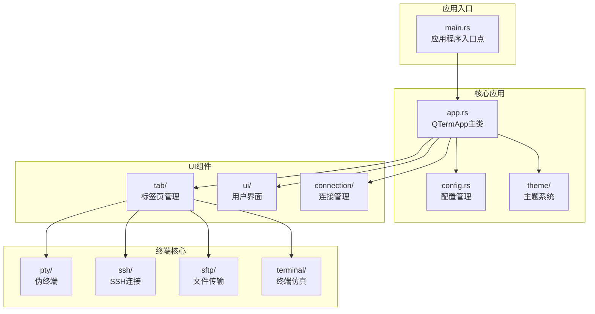

**图表来源**
- [main.rs:1-87](file://src/main.rs#L1-L87)
- [app.rs:1-1372](file://src/app.rs#L1-L1372)

**章节来源**
- [main.rs:1-87](file://src/main.rs#L1-L87)
- [Cargo.toml:1-30](file://Cargo.toml#L1-L30)

## 核心组件

### QTermApp结构体设计

QTermApp是应用的核心控制器，负责协调所有子系统的生命周期：

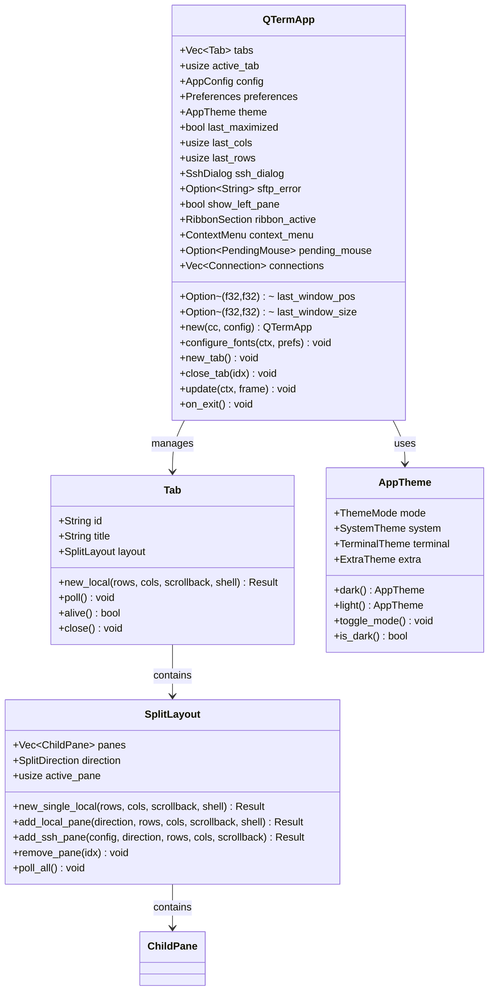

**图表来源**
- [app.rs:15-93](file://src/app.rs#L15-L93)
- [tab/tab_item.rs:3-40](file://src/tab/tab_item.rs#L3-L40)
- [ui/split_pane.rs:132-209](file://src/ui/split_pane.rs#L132-L209)
- [theme/mod.rs:13-62](file://src/theme/mod.rs#L13-L62)

### 应用初始化流程

应用启动时的完整初始化过程：

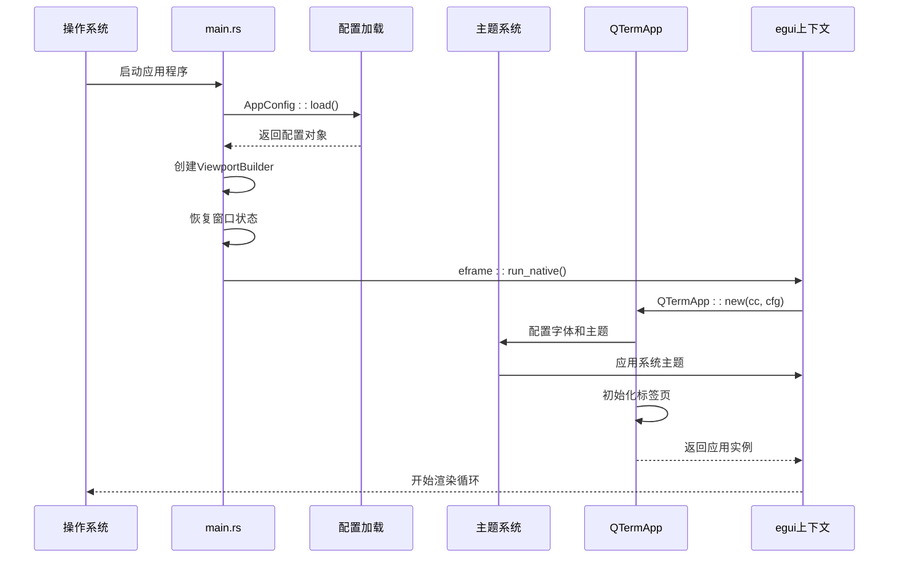

**图表来源**
- [main.rs:51-87](file://src/main.rs#L51-L87)
- [app.rs:61-93](file://src/app.rs#L61-L93)

**章节来源**
- [app.rs:61-93](file://src/app.rs#L61-L93)
- [main.rs:51-87](file://src/main.rs#L51-L87)

## 架构概览

QTerm采用分层架构设计，每个层次都有明确的职责分工：

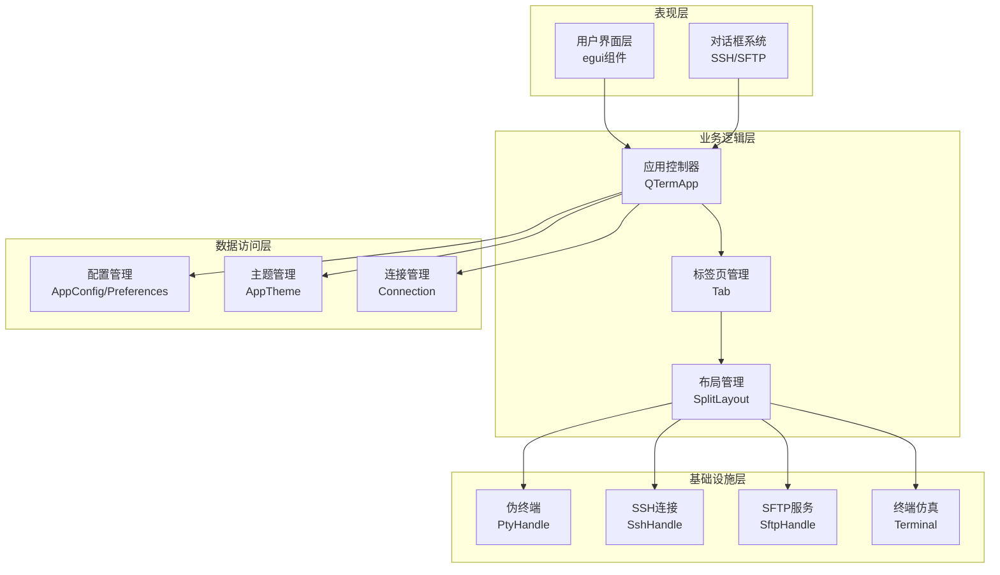

**图表来源**
- [app.rs:15-33](file://src/app.rs#L15-L33)
- [tab/tab_item.rs:3-7](file://src/tab/tab_item.rs#L3-L7)
- [ui/split_pane.rs:12-26](file://src/ui/split_pane.rs#L12-L26)

## 详细组件分析

### 应用生命周期钩子

#### 初始化阶段

应用初始化包含多个关键步骤：

1. **配置加载**：从INI文件和JSON文件加载用户配置
2. **窗口恢复**：根据上次会话状态恢复窗口位置和尺寸
3. **主题应用**：加载用户偏好的字体和颜色主题
4. **资源准备**：初始化标签页和连接列表

#### 更新循环机制

应用的事件循环在`update`方法中实现：

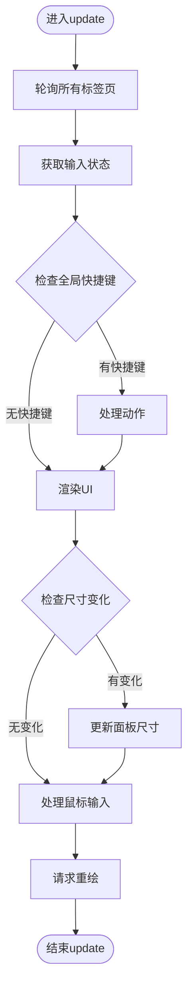

**图表来源**
- [app.rs:241-516](file://src/app.rs#L241-L516)

#### 退出处理机制

应用退出时执行清理和持久化操作：

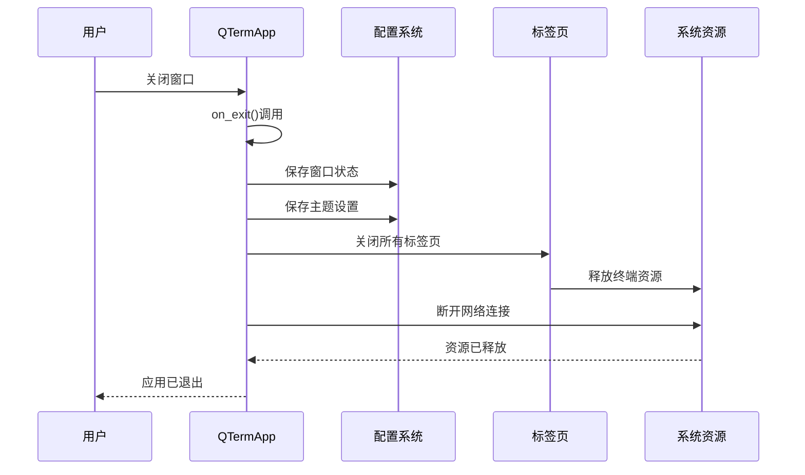

**图表来源**
- [app.rs:518-528](file://src/app.rs#L518-L528)

**章节来源**
- [app.rs:241-528](file://src/app.rs#L241-L528)

### 标签页管理系统

标签页系统支持多标签页和面板分割：

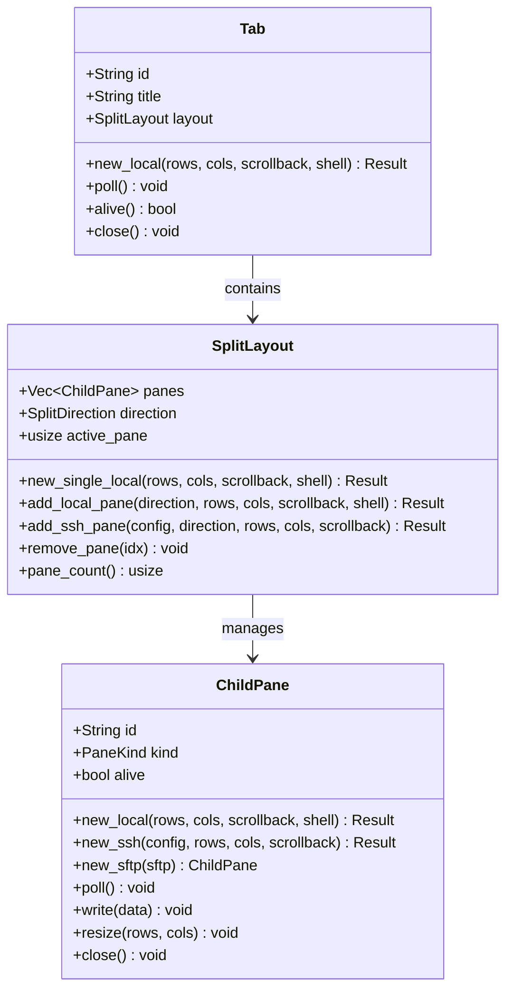

**图表来源**
- [tab/tab_item.rs:3-40](file://src/tab/tab_item.rs#L3-L40)
- [ui/split_pane.rs:132-209](file://src/ui/split_pane.rs#L132-L209)

**章节来源**
- [tab/tab_item.rs:9-39](file://src/tab/tab_item.rs#L9-L39)
- [ui/split_pane.rs:138-208](file://src/ui/split_pane.rs#L138-L208)

### 主题系统架构

QTerm的主题系统采用分层设计：

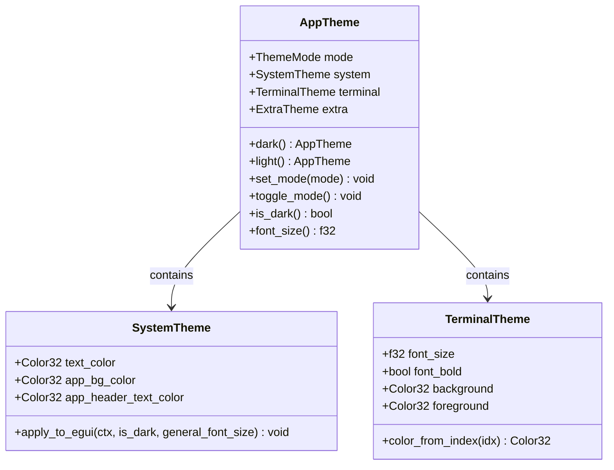

**图表来源**
- [theme/mod.rs:13-62](file://src/theme/mod.rs#L13-L62)
- [theme/system.rs:5-108](file://src/theme/system.rs#L5-L108)
- [theme/terminal.rs:5-98](file://src/theme/terminal.rs#L5-L98)

**章节来源**
- [theme/mod.rs:20-62](file://src/theme/mod.rs#L20-L62)
- [theme/system.rs:158-290](file://src/theme/system.rs#L158-L290)

### 配置管理系统

配置系统支持多种配置源和格式：

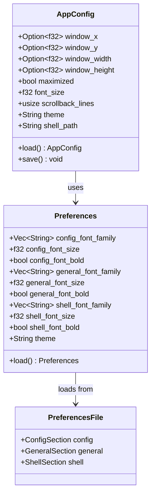

**图表来源**
- [config.rs:40-127](file://src/config.rs#L40-L127)
- [config.rs:209-281](file://src/config.rs#L209-L281)

**章节来源**
- [config.rs:68-127](file://src/config.rs#L68-L127)
- [config.rs:239-281](file://src/config.rs#L239-L281)

### 连接管理与安全

连接管理系统支持多种认证方式：

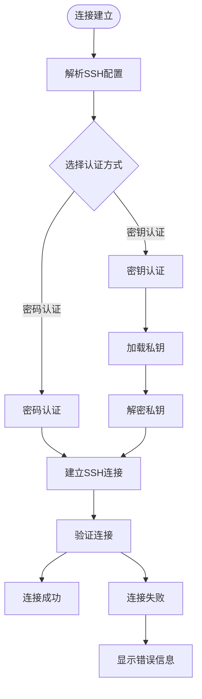

**图表来源**
- [ui/ssh_dialog.rs:104-131](file://src/ui/ssh_dialog.rs#L104-L131)
- [connection/mod.rs:59-89](file://src/connection/mod.rs#L59-L89)

**章节来源**
- [ui/ssh_dialog.rs:104-131](file://src/ui/ssh_dialog.rs#L104-L131)
- [connection/mod.rs:27-55](file://src/connection/mod.rs#L27-L55)

## 依赖关系分析

QTerm的依赖关系体现了清晰的分层架构：

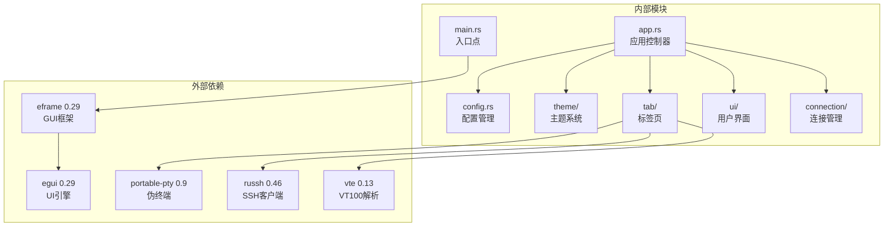

**图表来源**
- [Cargo.toml:8-25](file://Cargo.toml#L8-L25)
- [main.rs:15](file://src/main.rs#L15)

**章节来源**
- [Cargo.toml:8-25](file://Cargo.toml#L8-L25)

## 性能考虑

### 内存管理

- **零拷贝字符串**：使用`String`类型避免不必要的内存分配
- **智能指针**：通过`Box`和`Rc`管理资源所有权
- **延迟初始化**：按需创建终端和连接资源

### 渲染优化

- **增量更新**：只在必要时重新计算布局
- **批量操作**：合并多个UI更新操作
- **资源池**：复用字体和颜色资源

### 并发处理

- **异步I/O**：使用Tokio处理网络通信
- **消息队列**：通过通道传递终端输出
- **非阻塞操作**：避免长时间阻塞UI线程

## 故障排除指南

### 常见问题诊断

1. **字体加载失败**
   - 检查字体文件路径
   - 验证字体权限
   - 确认字体格式支持

2. **SSH连接超时**
   - 验证主机可达性
   - 检查防火墙设置
   - 确认认证凭据

3. **配置文件损坏**
   - 检查INI文件格式
   - 验证JSON结构
   - 恢复默认配置

### 异常处理策略

应用实现了多层次的错误处理：

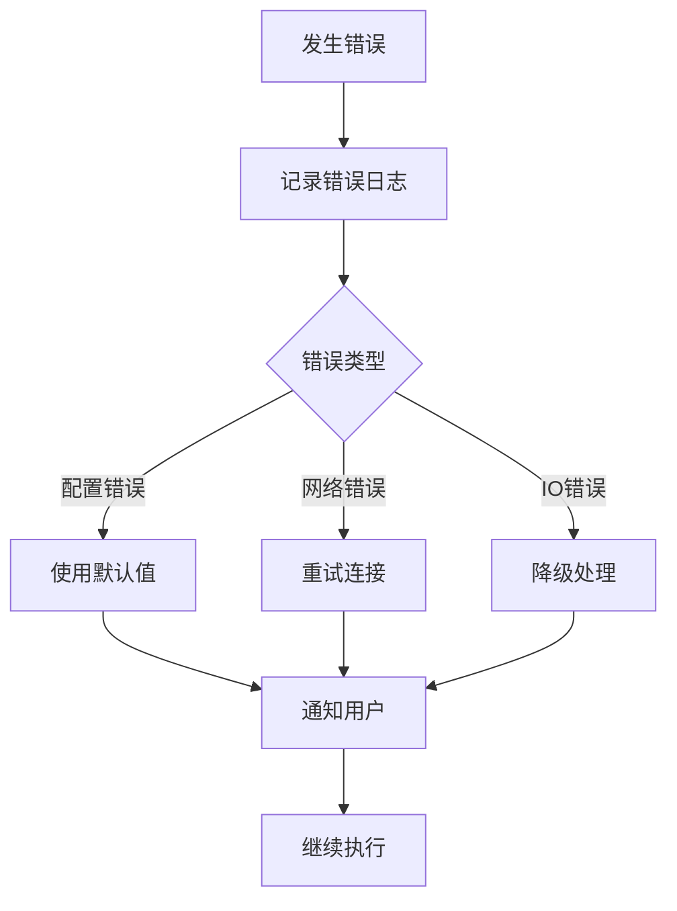

**章节来源**
- [app.rs:181-184](file://src/app.rs#L181-L184)
- [ui/sftp_panel.rs:96-102](file://src/ui/sftp_panel.rs#L96-L102)

## 结论

QTerm的应用生命周期管理系统展现了现代Rust应用开发的最佳实践。通过清晰的模块分离、完善的生命周期钩子和健壮的错误处理机制，该系统提供了可靠的用户体验。主要特点包括：

- **模块化设计**：每个组件都有明确的职责边界
- **生命周期完整性**：从初始化到退出的完整流程覆盖
- **状态管理**：全面的窗口状态和配置持久化
- **扩展性**：易于添加新的功能模块和主题
- **性能优化**：高效的资源管理和渲染优化

该系统为开发者提供了良好的扩展基础，可以轻松添加新的终端功能、连接协议或UI组件。