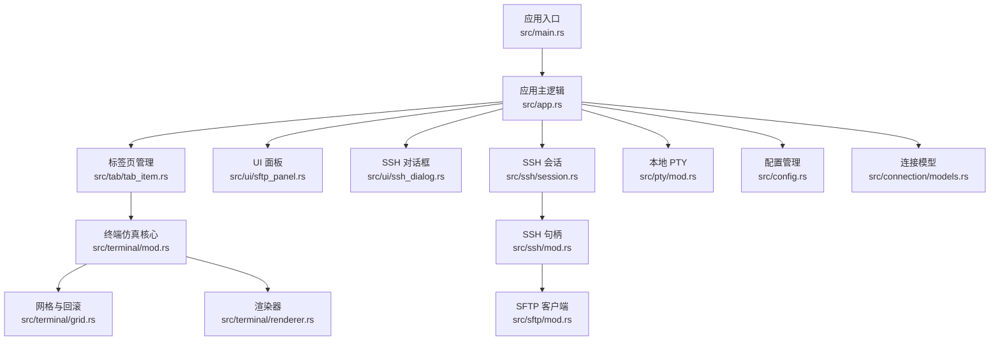
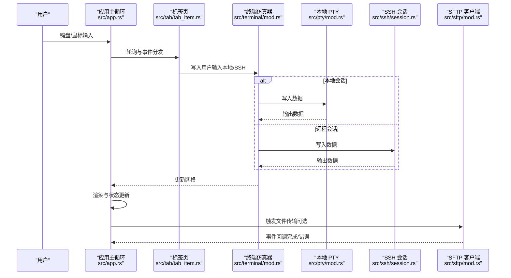
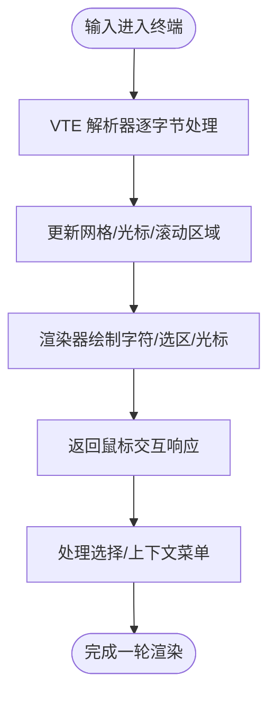
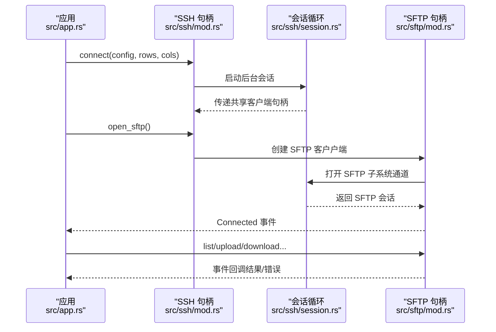
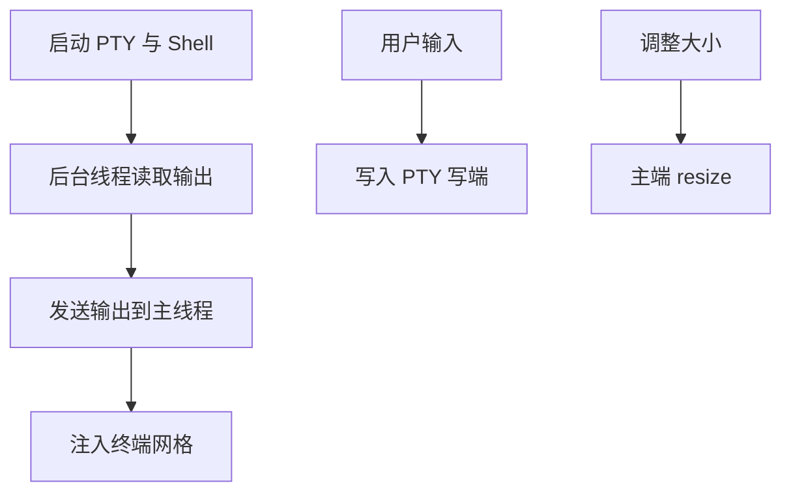
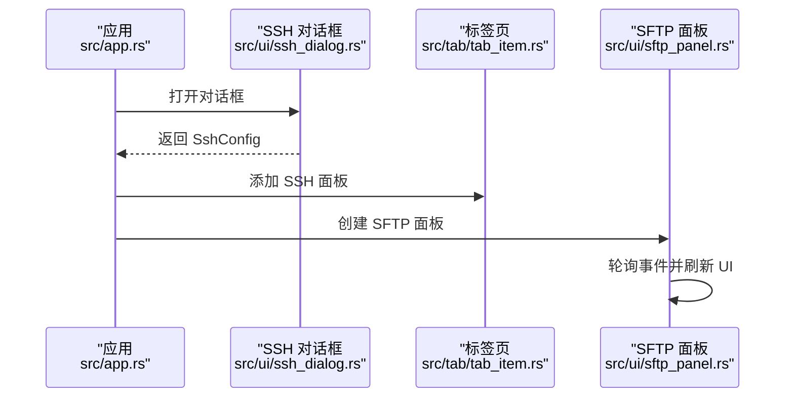
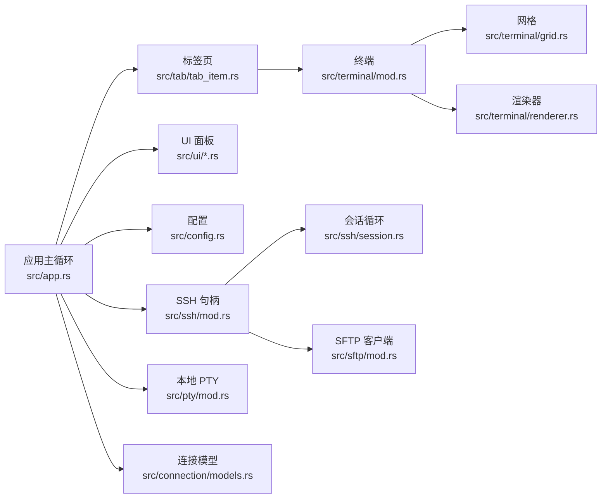

# 数据流管理

<cite>
**本文引用的文件**   
- [src/main.rs](file://src/main.rs)
- [src/app.rs](file://src/app.rs)
- [src/tabs/mod.rs](file://src/tab/mod.rs)
- [src/tab/tab_item.rs](file://src/tab/tab_item.rs)
- [src/ui/sftp_panel.rs](file://src/ui/sftp_panel.rs)
- [src/ui/ssh_dialog.rs](file://src/ui/ssh_dialog.rs)
- [src/terminal/mod.rs](file://src/terminal/mod.rs)
- [src/terminal/grid.rs](file://src/terminal/grid.rs)
- [src/terminal/renderer.rs](file://src/terminal/renderer.rs)
- [src/ssh/mod.rs](file://src/ssh/mod.rs)
- [src/ssh/session.rs](file://src/ssh/session.rs)
- [src/sftp/mod.rs](file://src/sftp/mod.rs)
- [src/pty/mod.rs](file://src/pty/mod.rs)
- [src/config.rs](file://src/config.rs)
- [src/connection/models.rs](file://src/connection/models.rs)
</cite>

## 目录
1. [简介](#简介)
2. [项目结构](#项目结构)
3. [核心组件](#核心组件)
4. [架构总览](#架构总览)
5. [详细组件分析](#详细组件分析)
6. [依赖关系分析](#依赖关系分析)
7. [性能考量](#性能考量)
8. [故障排查指南](#故障排查指南)
9. [结论](#结论)
10. [附录](#附录)

## 简介
本文件围绕 QTerm 的“数据流管理”目标，系统梳理从用户输入到最终渲染的完整数据路径，覆盖键盘事件、鼠标交互、终端输出、SSH/SFTP 数据同步与状态管理，并深入解释数据在不同模块间的传递机制、缓存策略、一致性保障与优化技巧。读者无需深入底层即可理解整体流程。

## 项目结构
QTerm 采用模块化组织，核心模块如下：
- 应用入口与生命周期：main.rs、app.rs
- 终端仿真与渲染：terminal/*、pty/*
- 远程连接与传输：ssh/*、sftp/*
- UI 面板与交互：ui/*
- 配置与连接模型：config.rs、connection/models.rs
- 标签页与布局：tab/*

图表来源
- [src/main.rs:1-87](file://src/main.rs#L1-L87)
- [src/app.rs:1-589](file://src/app.rs#L1-L589)
- [src/tab/tab_item.rs:1-48](file://src/tab/tab_item.rs#L1-L48)
- [src/terminal/mod.rs:1-200](file://src/terminal/mod.rs#L1-L200)
- [src/terminal/grid.rs:1-148](file://src/terminal/grid.rs#L1-L148)
- [src/terminal/renderer.rs:1-198](file://src/terminal/renderer.rs#L1-L198)
- [src/ui/sftp_panel.rs:1-387](file://src/ui/sftp_panel.rs#L1-L387)
- [src/ui/ssh_dialog.rs:1-147](file://src/ui/ssh_dialog.rs#L1-L147)
- [src/ssh/session.rs:1-90](file://src/ssh/session.rs#L1-L90)
- [src/ssh/mod.rs:1-136](file://src/ssh/mod.rs#L1-L136)
- [src/sftp/mod.rs:1-238](file://src/sftp/mod.rs#L1-L238)
- [src/pty/mod.rs:1-121](file://src/pty/mod.rs#L1-L121)
- [src/config.rs:1-281](file://src/config.rs#L1-L281)
- [src/connection/models.rs:1-43](file://src/connection/models.rs#L1-L43)

章节来源
- [src/main.rs:1-87](file://src/main.rs#L1-L87)
- [src/app.rs:1-589](file://src/app.rs#L1-L589)

## 核心组件
- 应用主循环与事件分发：负责轮询标签页、处理全局快捷键、渲染 UI、维护窗口状态与配置持久化。
- 终端仿真器：解析 ANSI 转义序列、维护网格与回滚缓冲、提供选择与光标管理。
- 渲染器：根据字体与可用空间计算网格尺寸，绘制字符、选区与光标。
- SSH/SFTP：通过独立 tokio 运行时与后台任务实现异步数据通道、会话生命周期与子系统复用。
- 本地 PTY：桥接本地 Shell 进程与终端仿真器，负责本地会话的输入输出与大小调整。
- UI 面板：SFTP 双栏浏览器与 SSH 连接对话框，驱动文件传输与连接建立。
- 配置与连接：窗口状态、主题、字体、回滚行数等持久化；WhaleTerm 连接模型用于导入与展示。

章节来源
- [src/app.rs:1-589](file://src/app.rs#L1-L589)
- [src/terminal/mod.rs:1-200](file://src/terminal/mod.rs#L1-L200)
- [src/terminal/renderer.rs:1-198](file://src/terminal/renderer.rs#L1-L198)
- [src/ssh/mod.rs:1-136](file://src/ssh/mod.rs#L1-L136)
- [src/sftp/mod.rs:1-238](file://src/sftp/mod.rs#L1-L238)
- [src/pty/mod.rs:1-121](file://src/pty/mod.rs#L1-L121)
- [src/ui/sftp_panel.rs:1-387](file://src/ui/sftp_panel.rs#L1-L387)
- [src/ui/ssh_dialog.rs:1-147](file://src/ui/ssh_dialog.rs#L1-L147)
- [src/config.rs:1-281](file://src/config.rs#L1-L281)
- [src/connection/models.rs:1-43](file://src/connection/models.rs#L1-L43)

## 架构总览
QTerm 的数据流遵循“事件驱动 + 异步通道”的设计：
- 用户输入（键盘/鼠标）经 egui 输入管线进入应用主循环，随后分派至当前活动面板（终端或 SFTP）。
- 终端面板将用户输入写入本地 PTY 或 SSH 会话通道；同时周期性轮询输出通道，将远端/本地输出注入终端网格。
- 渲染器基于当前网格与主题进行绘制，并将鼠标交互响应返回给应用层，用于选择与上下文菜单。
- SSH/SFTP 通过独立运行时与后台任务维持长连接，事件通过无阻塞通道回传主线程，避免阻塞 UI。
- 配置与连接信息在应用启动时加载，在退出时保存，窗口状态与主题随 UI 生命周期同步。

图表来源
- [src/app.rs:284-575](file://src/app.rs#L284-L575)
- [src/tab/tab_item.rs:23-35](file://src/tab/tab_item.rs#L23-L35)
- [src/terminal/mod.rs:65-74](file://src/terminal/mod.rs#L65-L74)
- [src/pty/mod.rs:87-91](file://src/pty/mod.rs#L87-L91)
- [src/ssh/session.rs:48-82](file://src/ssh/session.rs#L48-L82)
- [src/sftp/mod.rs:70-114](file://src/sftp/mod.rs#L70-L114)

## 详细组件分析

### 终端仿真与渲染数据流
- 输入路径：应用主循环收集 egui 输入，调用当前面板写入接口，最终进入终端仿真器的输入处理。
- 解析与更新：终端仿真器使用 VTE 解析器逐字节推进，更新网格、光标、滚动区域与选择。
- 渲染路径：渲染器根据字体与可用空间计算网格尺寸，按颜色分段绘制字符，绘制选区高亮与光标。
- 交互路径：渲染器返回鼠标响应，应用层记录待处理鼠标事件，用于拖拽选择、双击单词/行等。

图表来源
- [src/terminal/mod.rs:65-74](file://src/terminal/mod.rs#L65-L74)
- [src/terminal/grid.rs:104-114](file://src/terminal/grid.rs#L104-L114)
- [src/terminal/renderer.rs:42-180](file://src/terminal/renderer.rs#L42-L180)
- [src/app.rs:460-557](file://src/app.rs#L460-L557)

章节来源
- [src/terminal/mod.rs:1-200](file://src/terminal/mod.rs#L1-L200)
- [src/terminal/grid.rs:1-148](file://src/terminal/grid.rs#L1-L148)
- [src/terminal/renderer.rs:1-198](file://src/terminal/renderer.rs#L1-L198)
- [src/app.rs:460-557](file://src/app.rs#L460-L557)

### SSH 会话与 SFTP 数据同步
- 会话建立：应用通过 SSH 句柄发起连接，后台线程运行会话循环，建立 PTY 并请求 Shell。
- 数据通道：会话循环通过 select 并发处理输出读取、输入写入与大小调整请求。
- SFTP 复用：SSH 句柄持有共享的 russh 客户端句柄，可在同一会话上打开 SFTP 子系统。
- 事件回传：SFTP 后台任务通过事件通道向主线程回传连接、目录列表、上传/下载结果与错误。

图表来源
- [src/ssh/mod.rs:68-136](file://src/ssh/mod.rs#L68-L136)
- [src/ssh/session.rs:11-90](file://src/ssh/session.rs#L11-L90)
- [src/sftp/mod.rs:46-115](file://src/sftp/mod.rs#L46-L115)

章节来源
- [src/ssh/mod.rs:1-136](file://src/ssh/mod.rs#L1-L136)
- [src/ssh/session.rs:1-90](file://src/ssh/session.rs#L1-L90)
- [src/sftp/mod.rs:1-238](file://src/sftp/mod.rs#L1-L238)

### 本地 PTY 数据路径
- 启动：创建 PTY 对，启动 Shell 子进程，克隆读写端。
- 读取：后台线程循环读取主端输出，通过通道发送到主线程。
- 写入：应用将用户输入写入 PTY 写端；调整终端大小时调用主端 resize。
- 生命周期：句柄销毁时自动终止子进程，确保资源回收。

图表来源
- [src/pty/mod.rs:19-85](file://src/pty/mod.rs#L19-L85)
- [src/pty/mod.rs:87-102](file://src/pty/mod.rs#L87-L102)

章节来源
- [src/pty/mod.rs:1-121](file://src/pty/mod.rs#L1-L121)

### UI 面板与交互
- SSH 对话框：收集连接参数，生成 SshConfig 并交由应用主循环创建 SSH 面板。
- SFTP 面板：双栏浏览本地与远程文件，通过 SFTP 句柄执行上传/下载/新建目录/删除等操作，轮询事件更新 UI 状态。
- 标题栏与分屏：应用主循环负责渲染标题栏、左侧功能区、中央终端区域与底部状态栏，支持水平/垂直分屏与多面板切换。

图表来源
- [src/ui/ssh_dialog.rs:26-41](file://src/ui/ssh_dialog.rs#L26-L41)
- [src/ui/ssh_dialog.rs:115-146](file://src/ui/ssh_dialog.rs#L115-L146)
- [src/app.rs:559-570](file://src/app.rs#L559-L570)
- [src/ui/sftp_panel.rs:51-110](file://src/ui/sftp_panel.rs#L51-L110)

章节来源
- [src/ui/ssh_dialog.rs:1-147](file://src/ui/ssh_dialog.rs#L1-L147)
- [src/ui/sftp_panel.rs:1-387](file://src/ui/sftp_panel.rs#L1-L387)
- [src/app.rs:559-570](file://src/app.rs#L559-L570)

### 数据缓存策略
- 终端网格增量更新：渲染器按颜色分段绘制，减少重复绘制；网格支持回滚缓冲区，历史行按需存储，避免全量重绘。
- 连接状态本地缓存：SSH/SFTP 句柄内部维护存活标志与通道，避免频繁重建；SFTP 事件通道采用非阻塞轮询，降低阻塞风险。
- 配置持久化：应用退出时将窗口位置、尺寸、主题、字体大小等写入配置文件；WhaleTerm 连接模型从 preferences.json 导入字体与主题设置。

章节来源
- [src/terminal/renderer.rs:80-106](file://src/terminal/renderer.rs#L80-L106)
- [src/terminal/grid.rs:16-29](file://src/terminal/grid.rs#L16-L29)
- [src/ssh/mod.rs:68-136](file://src/ssh/mod.rs#L68-L136)
- [src/sftp/mod.rs:70-114](file://src/sftp/mod.rs#L70-L114)
- [src/app.rs:577-588](file://src/app.rs#L577-L588)
- [src/config.rs:68-127](file://src/config.rs#L68-L127)
- [src/connection/models.rs:1-43](file://src/connection/models.rs#L1-L43)

### 数据一致性与错误恢复
- 并发访问控制：SSH/SFTP 使用 tokio 运行时与异步通道，避免阻塞 UI；应用主循环通过轮询与非阻塞接收保证 UI 流畅。
- 事务处理：SFTP 命令通过命令通道顺序执行，事件通道回传结果，保证操作顺序与可观测性。
- 错误恢复：会话循环检测 EOF 与错误后及时断开；SFTP 任务捕获异常并通过事件通道上报；应用层根据事件更新状态与提示。

章节来源
- [src/ssh/session.rs:48-82](file://src/ssh/session.rs#L48-L82)
- [src/sftp/mod.rs:117-167](file://src/sftp/mod.rs#L117-L167)
- [src/sftp/mod.rs:169-238](file://src/sftp/mod.rs#L169-L238)

### 性能优化技巧
- 批量处理：渲染器按颜色分段绘制文本，减少多次绘制调用。
- 延迟计算：终端尺寸按 UI 可用空间动态计算，避免固定像素计算带来的误差。
- 内存池管理：网格使用 VecDeque 管理回滚缓冲，限制最大行数，避免无限增长；PTY 读取使用固定大小缓冲循环读取。

章节来源
- [src/terminal/renderer.rs:80-106](file://src/terminal/renderer.rs#L80-L106)
- [src/terminal/grid.rs:16-29](file://src/terminal/grid.rs#L16-L29)
- [src/pty/mod.rs:60-76](file://src/pty/mod.rs#L60-L76)

## 依赖关系分析
- 模块耦合：应用主循环依赖标签页、终端、UI 面板与配置；终端依赖网格与解析器；SSH/SFTP 依赖独立运行时；PTY 与终端直接耦合。
- 外部依赖：russh 用于 SSH 会话与通道；russh_sftp 提供 SFTP 会话；portable_pty 用于本地 PTY；egui 用于 UI 渲染。
- 潜在环依赖：未发现直接环依赖；SSH 句柄持有 SFTP 所需的共享客户端句柄，但为单向使用。

图表来源
- [src/app.rs:1-589](file://src/app.rs#L1-L589)
- [src/tab/tab_item.rs:1-48](file://src/tab/tab_item.rs#L1-L48)
- [src/terminal/mod.rs:1-200](file://src/terminal/mod.rs#L1-L200)
- [src/terminal/grid.rs:1-148](file://src/terminal/grid.rs#L1-L148)
- [src/terminal/renderer.rs:1-198](file://src/terminal/renderer.rs#L1-L198)
- [src/ssh/mod.rs:1-136](file://src/ssh/mod.rs#L1-L136)
- [src/ssh/session.rs:1-90](file://src/ssh/session.rs#L1-L90)
- [src/sftp/mod.rs:1-238](file://src/sftp/mod.rs#L1-L238)
- [src/pty/mod.rs:1-121](file://src/pty/mod.rs#L1-L121)
- [src/config.rs:1-281](file://src/config.rs#L1-L281)
- [src/connection/models.rs:1-43](file://src/connection/models.rs#L1-L43)

## 性能考量
- 渲染优化：按颜色分段绘制文本，减少绘制批次；仅在需要时重绘选区与光标。
- 通道容量：输入/大小调整通道容量适中，避免内存膨胀；事件通道采用非阻塞轮询，降低阻塞概率。
- 资源回收：PTY 句柄实现 Drop 自动终止子进程；SSH/SFTP 会话在错误或 EOF 时主动断开并释放资源。

## 故障排查指南
- SSH 连接失败：检查认证参数与网络连通性；查看会话循环中的错误事件与断开原因。
- SFTP 操作失败：确认 SFTP 子系统可用性与权限；关注事件通道中的错误消息。
- 终端渲染异常：检查字体配置与可用空间计算；验证网格尺寸与回滚缓冲上限。
- UI 卡顿：确认未在主循环中执行阻塞操作；检查通道是否积压导致 UI 轮询延迟。

章节来源
- [src/ssh/session.rs:48-82](file://src/ssh/session.rs#L48-L82)
- [src/sftp/mod.rs:117-167](file://src/sftp/mod.rs#L117-L167)
- [src/terminal/renderer.rs:25-40](file://src/terminal/renderer.rs#L25-L40)
- [src/app.rs:284-575](file://src/app.rs#L284-L575)

## 结论
QTerm 的数据流管理以“事件驱动 + 异步通道”为核心，结合终端仿真、本地 PTY、SSH/SFTP 与 UI 面板，实现了从用户输入到最终渲染的高效闭环。通过网格增量更新、连接状态缓存与配置持久化，系统在保证一致性的同时兼顾了性能与可维护性。建议在后续迭代中进一步细化错误分类与重试策略，增强日志可观测性，并探索更细粒度的渲染优化。

## 附录
- 关键流程路径参考
  - 应用入口与窗口恢复：[src/main.rs:51-87](file://src/main.rs#L51-L87)
  - 应用主循环与渲染：[src/app.rs:284-575](file://src/app.rs#L284-L575)
  - 终端输入与解析：[src/terminal/mod.rs:65-74](file://src/terminal/mod.rs#L65-L74)
  - 终端网格与回滚：[src/terminal/grid.rs:104-114](file://src/terminal/grid.rs#L104-L114)
  - 终端渲染与交互：[src/terminal/renderer.rs:42-180](file://src/terminal/renderer.rs#L42-L180)
  - SSH 会话与通道：[src/ssh/session.rs:11-90](file://src/ssh/session.rs#L11-L90)
  - SFTP 事件与命令：[src/sftp/mod.rs:46-115](file://src/sftp/mod.rs#L46-L115)
  - 本地 PTY 生命周期：[src/pty/mod.rs:19-85](file://src/pty/mod.rs#L19-L85)
  - UI 面板与对话框：[src/ui/sftp_panel.rs:51-110](file://src/ui/sftp_panel.rs#L51-L110), [src/ui/ssh_dialog.rs:115-146](file://src/ui/ssh_dialog.rs#L115-L146)
  - 配置与连接模型：[src/config.rs:68-127](file://src/config.rs#L68-L127), [src/connection/models.rs:1-43](file://src/connection/models.rs#L1-L43)