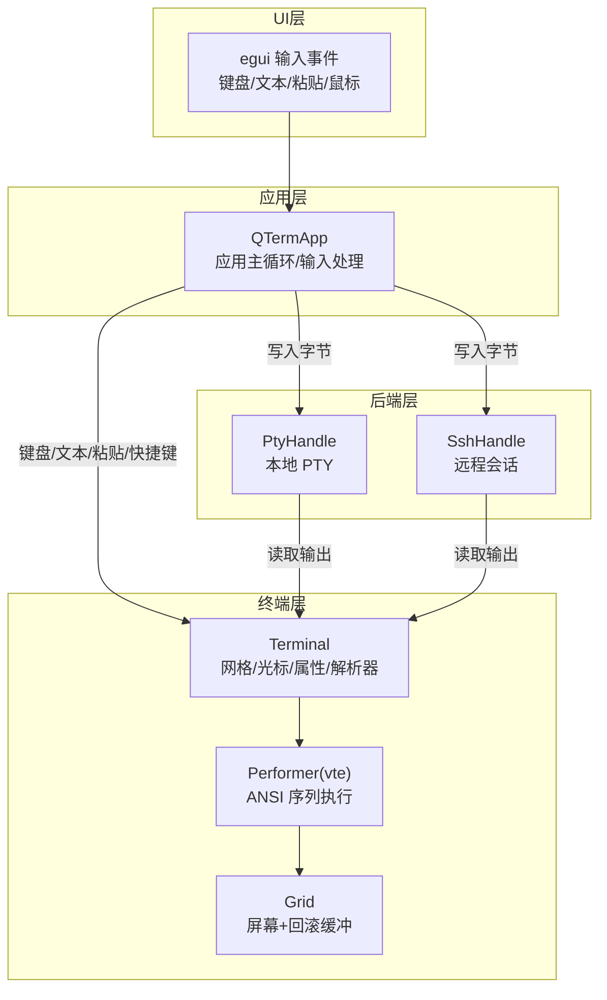
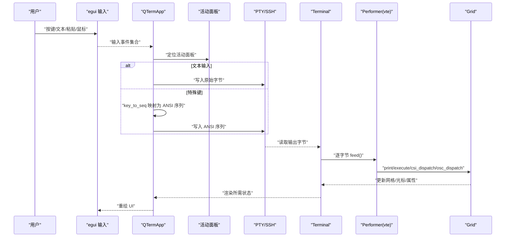
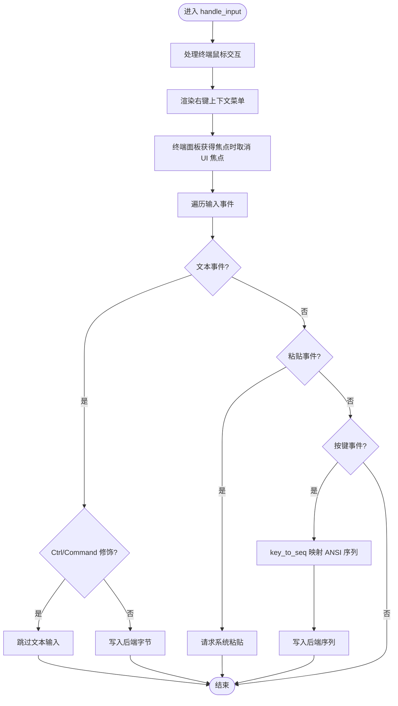
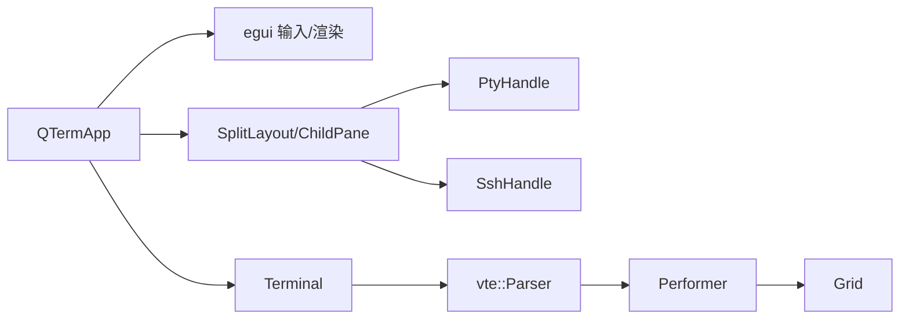

# 用户输入数据流

<cite>
**本文引用的文件**
- [src/main.rs](file://src/main.rs)
- [src/app.rs](file://src/app.rs)
- [src/ui/split_pane.rs](file://src/ui/split_pane.rs)
- [src/pty/mod.rs](file://src/pty/mod.rs)
- [src/terminal/mod.rs](file://src/terminal/mod.rs)
- [src/terminal/parser.rs](file://src/terminal/parser.rs)
- [src/terminal/grid.rs](file://src/terminal/grid.rs)
</cite>

## 目录
1. [简介](#简介)
2. [项目结构](#项目结构)
3. [核心组件](#核心组件)
4. [架构总览](#架构总览)
5. [详细组件分析](#详细组件分析)
6. [依赖关系分析](#依赖关系分析)
7. [性能考量](#性能考量)
8. [故障排查指南](#故障排查指南)
9. [结论](#结论)
10. [附录](#附录)

## 简介
本文面向 QTerm 的用户输入数据流，系统梳理从键盘按键到终端命令执行的完整路径，覆盖 egui 事件捕获、键盘映射转换、字符编码处理、终端命令解析、输入缓冲与历史记录策略、以及性能优化建议。文档同时提供流程图与时序图，帮助读者快速理解各模块职责与交互方式。

## 项目结构
QTerm 采用模块化组织，核心围绕应用主循环、标签页与分屏布局、终端仿真器、PTY/SSH 后端、以及 egui UI 渲染展开。用户输入主要通过 egui 输入事件进入应用层，再根据当前活动面板类型（本地 PTY 或 SSH）写入后端，并由终端解析器将字节流转换为可视输出。

图表来源
- [src/app.rs:1327-1425](file://src/app.rs#L1327-L1425)
- [src/terminal/mod.rs:24-63](file://src/terminal/mod.rs#L24-L63)
- [src/terminal/parser.rs:1-33](file://src/terminal/parser.rs#L1-L33)
- [src/pty/mod.rs:19-114](file://src/pty/mod.rs#L19-L114)
- [src/ui/split_pane.rs:70-123](file://src/ui/split_pane.rs#L70-L123)

章节来源
- [src/main.rs:50-87](file://src/main.rs#L50-L87)
- [src/app.rs:1327-1425](file://src/app.rs#L1327-L1425)
- [src/ui/split_pane.rs:1-238](file://src/ui/split_pane.rs#L1-L238)
- [src/pty/mod.rs:1-121](file://src/pty/mod.rs#L1-L121)
- [src/terminal/mod.rs:1-200](file://src/terminal/mod.rs#L1-L200)
- [src/terminal/parser.rs:1-33](file://src/terminal/parser.rs#L1-L33)

## 核心组件
- 应用主循环与输入处理：负责轮询标签页、处理全局快捷键、渲染 UI、收集 egui 输入事件并转发给活动面板。
- 终端仿真器：维护网格、光标、颜色属性、滚动区域；通过 VTE 解析器执行 ANSI 序列。
- 分屏与面板：管理多个子面板（本地/远程），统一轮询后端输出、写入用户输入、调整终端尺寸。
- 本地 PTY：封装子进程、读写通道、大小调整与生命周期管理。
- 输入映射与缓冲：将 egui 键盘事件映射为 ANSI 序列或原始字节，写入后端；终端解析器按字节推进状态机。

章节来源
- [src/app.rs:1327-1425](file://src/app.rs#L1327-L1425)
- [src/terminal/mod.rs:24-63](file://src/terminal/mod.rs#L24-L63)
- [src/terminal/parser.rs:10-33](file://src/terminal/parser.rs#L10-L33)
- [src/ui/split_pane.rs:70-123](file://src/ui/split_pane.rs#L70-L123)
- [src/pty/mod.rs:19-114](file://src/pty/mod.rs#L19-L114)

## 架构总览
下图展示从 egui 事件到终端渲染的端到端数据流，包括键盘映射、ANSI 序列生成、后端写入与终端解析。

图表来源
- [src/app.rs:1327-1425](file://src/app.rs#L1327-L1425)
- [src/app.rs:1427-1465](file://src/app.rs#L1427-L1465)
- [src/terminal/mod.rs:65-74](file://src/terminal/mod.rs#L65-L74)
- [src/terminal/parser.rs:10-33](file://src/terminal/parser.rs#L10-L33)
- [src/ui/split_pane.rs:70-123](file://src/ui/split_pane.rs#L70-L123)
- [src/pty/mod.rs:87-91](file://src/pty/mod.rs#L87-L91)

## 详细组件分析

### 1) egui 事件捕获与输入分流
- 全局快捷键：应用层在每次 update 中扫描 egui 输入，识别 Ctrl/Ctrl+Shift 组合，触发新建/关闭标签页、分屏、字体缩放等动作。
- 文本输入：忽略 Ctrl/Command 修饰键的文本事件，直接写入后端；粘贴事件通过 RequestPaste 触发系统剪贴板读取后再写入。
- 鼠标交互：处理右键菜单、双击/三击选词、拖拽选择等，更新终端选择状态。

图表来源
- [src/app.rs:1327-1425](file://src/app.rs#L1327-L1425)
- [src/app.rs:1427-1465](file://src/app.rs#L1427-L1465)

章节来源
- [src/app.rs:301-393](file://src/app.rs#L301-L393)
- [src/app.rs:1103-1166](file://src/app.rs#L1103-L1166)
- [src/app.rs:1327-1425](file://src/app.rs#L1327-L1425)
- [src/app.rs:1427-1465](file://src/app.rs#L1427-L1465)

### 2) 键盘映射与 ANSI 序列生成
- Ctrl+字母：映射为控制字符（如 ^A–^Z）。
- 功能键/方向键/Home/End/PageUp/PageDown/Delete/Insert：映射为标准 ANSI 转义序列。
- Enter/Backspace/Tab/Escape：映射为对应字节。
- 文本输入：在无 Ctrl/Command 修饰时直接写入原始字节。

章节来源
- [src/app.rs:1427-1465](file://src/app.rs#L1427-L1465)

### 3) 字符编码与终端解析
- 字节流逐字节喂给 VTE 解析器，执行器根据字节类型调用相应方法：
  - print：在光标处写入字符并推进列，必要时换行/滚动。
  - execute：处理退格、制表、换行、回车等控制字符。
  - csi_dispatch：处理 CSI 序列（光标移动、清屏、滚动、颜色设置等）。
  - osc_dispatch：处理 OSC 序列（如设置标题）。
  - esc_dispatch：处理 ESC 序列（保存/恢复光标、索引/反向索引、全复位等）。
- Terminal 维护网格、光标、颜色属性、滚动区域、选择范围等状态；pending_replies 用于发送设备报告等响应。

章节来源
- [src/terminal/mod.rs:24-63](file://src/terminal/mod.rs#L24-L63)
- [src/terminal/parser.rs:10-33](file://src/terminal/parser.rs#L10-L33)
- [src/terminal/parser.rs:63-173](file://src/terminal/parser.rs#L63-L173)
- [src/terminal/parser.rs:175-228](file://src/terminal/parser.rs#L175-L228)

### 4) 输入缓冲与历史记录
- 输入缓冲
  - 文本输入：直接写入后端（PTY/SSH）发送队列，由后端线程/连接异步写出。
  - 特殊键：经 key_to_seq 映射为 ANSI 序列，同样写入后端。
- 历史记录
  - Terminal.grid 提供回滚缓冲区（scrollback），用于保存超出屏幕范围的历史行，支持滚动查看。
  - 选择范围：支持单词/整行选择，便于复制与后续处理。

章节来源
- [src/terminal/grid.rs:1-44](file://src/terminal/grid.rs#L1-L44)
- [src/terminal/mod.rs:137-200](file://src/terminal/mod.rs#L137-L200)
- [src/ui/split_pane.rs:70-123](file://src/ui/split_pane.rs#L70-L123)

### 5) 后端写入与输出轮询
- 本地 PTY：通过 PtyHandle 写入字节；后台线程持续读取子进程输出，写入 Terminal.feed。
- SSH：通过 SshHandle 写入字节；同样轮询输出并解析。
- 待回复响应：Terminal.pending_replies 中的响应（如 DSR、DA1）在 poll 阶段发送至后端。

章节来源
- [src/ui/split_pane.rs:70-123](file://src/ui/split_pane.rs#L70-L123)
- [src/pty/mod.rs:87-114](file://src/pty/mod.rs#L87-L114)

### 6) 快捷键组合识别与全局操作
- Ctrl+Shift 组合：水平/垂直分屏、关闭面板、打开 SSH 对话框、打开 SFTP 等。
- Ctrl+方向键：切换活动面板。
- Ctrl+T/W/Tab/B 等：新建/关闭标签页、切换标签、切换左侧面板。
- Ctrl+ +/-：字体缩放。
- Ctrl+C：复制选中文本。
- Ctrl+V/Ctrl+Shift+V：请求系统粘贴。

章节来源
- [src/app.rs:301-393](file://src/app.rs#L301-L393)
- [src/app.rs:1390-1400](file://src/app.rs#L1390-L1400)
- [src/app.rs:1280-1297](file://src/app.rs#L1280-L1297)

## 依赖关系分析
- 应用层依赖 egui 输入系统与 UI 渲染框架，协调标签页与面板。
- 终端层依赖 vte 解析器，将字节流转换为可视状态。
- 面板层统一抽象本地/远程后端，屏蔽差异。
- 后端层分别对接本地进程与远程连接，负责数据读写与生命周期管理。

图表来源
- [src/app.rs:1327-1425](file://src/app.rs#L1327-L1425)
- [src/ui/split_pane.rs:1-238](file://src/ui/split_pane.rs#L1-L238)
- [src/pty/mod.rs:1-121](file://src/pty/mod.rs#L1-L121)
- [src/terminal/mod.rs:24-63](file://src/terminal/mod.rs#L24-L63)
- [src/terminal/parser.rs:1-33](file://src/terminal/parser.rs#L1-L33)

章节来源
- [src/app.rs:1327-1425](file://src/app.rs#L1327-L1425)
- [src/ui/split_pane.rs:1-238](file://src/ui/split_pane.rs#L1-L238)
- [src/pty/mod.rs:1-121](file://src/pty/mod.rs#L1-L121)
- [src/terminal/mod.rs:1-200](file://src/terminal/mod.rs#L1-L200)
- [src/terminal/parser.rs:1-33](file://src/terminal/parser.rs#L1-L33)

## 性能考量
- 事件去抖动与批处理
  - 文本输入：避免在高频按键场景下产生过多小包，可在应用层聚合短时间内的文本事件，减少后端写入次数。
  - ANSI 序列：将连续的特殊键序列合并为一次写入，降低协议开销。
- 内存优化
  - 回滚缓冲区大小：合理设置最大回滚行数，避免内存无限增长；在窗口尺寸变化时动态调整。
  - 字节缓冲：后端读取采用固定大小缓冲（如 4096 字节），避免频繁分配。
- 渲染与绘制
  - 仅在活动面板更新时进行渲染；非活动面板可延迟或减少刷新频率。
  - 使用 egui 的请求重绘机制，避免不必要的全屏重绘。

## 故障排查指南
- 输入无响应
  - 检查当前面板是否为终端面板，且活动面板存在。
  - 确认未被 UI 元素（如对话框）抢夺焦点；应用层会在终端面板激活时主动让渡焦点。
  - 查看后端是否存活（PTY/SSH），若已死亡需重建面板。
- 文本乱码或显示异常
  - 确认终端编码环境变量（如 LANG/TERM）正确设置。
  - 检查 ANSI 序列是否完整，解析器是否正确推进状态机。
- 选择无效或复制失败
  - 确认已启用选中文本；右键菜单“复制”按钮在无选中时不可用。
  - 检查剪贴板权限与系统粘贴请求是否成功。

章节来源
- [src/app.rs:1327-1425](file://src/app.rs#L1327-L1425)
- [src/app.rs:1170-1278](file://src/app.rs#L1170-L1278)
- [src/ui/split_pane.rs:70-123](file://src/ui/split_pane.rs#L70-L123)
- [src/pty/mod.rs:104-114](file://src/pty/mod.rs#L104-L114)

## 结论
QTerm 的用户输入数据流以 egui 事件为核心入口，通过应用层的输入分流与键盘映射，将文本与特殊键转换为字节或 ANSI 序列，写入本地 PTY 或远程 SSH 后端。后端输出经 Terminal.feed 进入 VTE 解析器，驱动网格与光标状态更新，最终由渲染器呈现。该设计在保证兼容性的同时，提供了清晰的模块边界与可扩展性，适合进一步增强输入缓冲、批处理与性能优化。

## 附录
- 示例：如何处理不同类型的用户输入
  - 文本输入：参考路径 [src/app.rs:1355-1365](file://src/app.rs#L1355-L1365)
  - 粘贴请求：参考路径 [src/app.rs:1366-1369](file://src/app.rs#L1366-L1369)
  - 特殊键映射：参考路径 [src/app.rs:1427-1465](file://src/app.rs#L1427-L1465)
  - 后端写入：参考路径 [src/ui/split_pane.rs:115-123](file://src/ui/split_pane.rs#L115-L123)
  - 终端解析：参考路径 [src/terminal/mod.rs:65-74](file://src/terminal/mod.rs#L65-L74), [src/terminal/parser.rs:10-33](file://src/terminal/parser.rs#L10-L33)