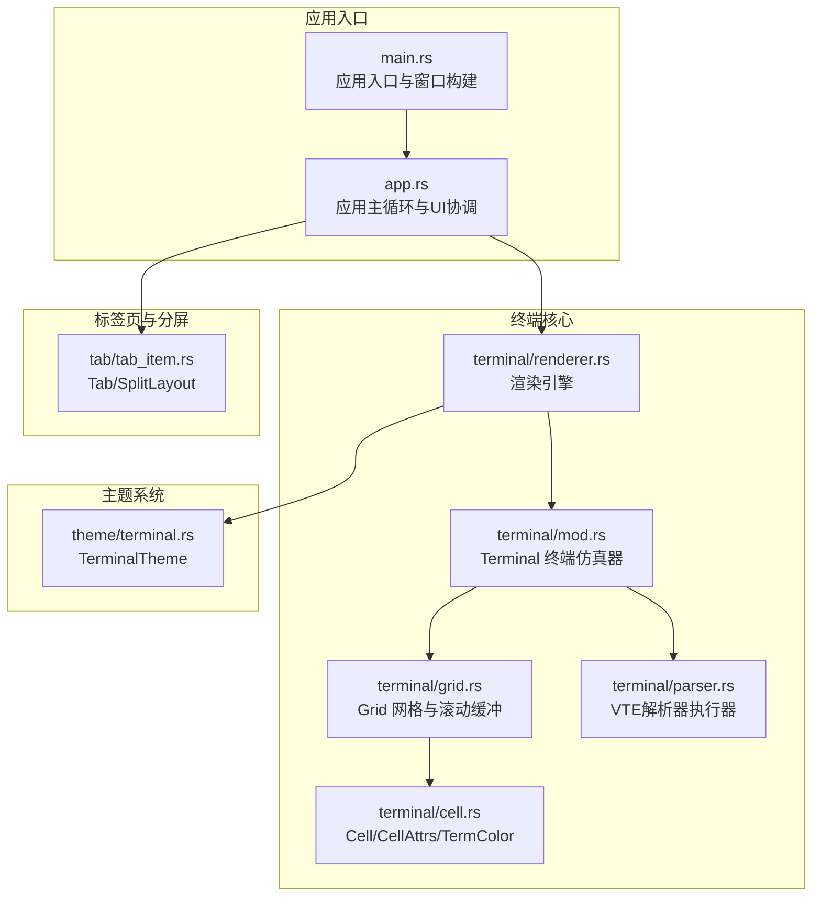
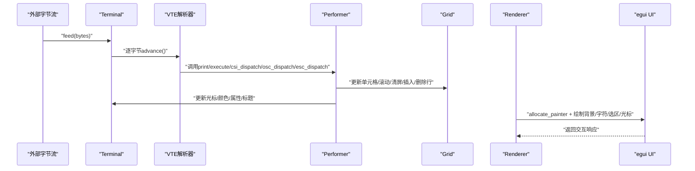
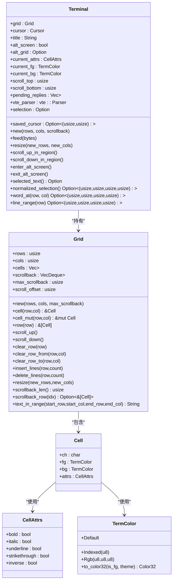
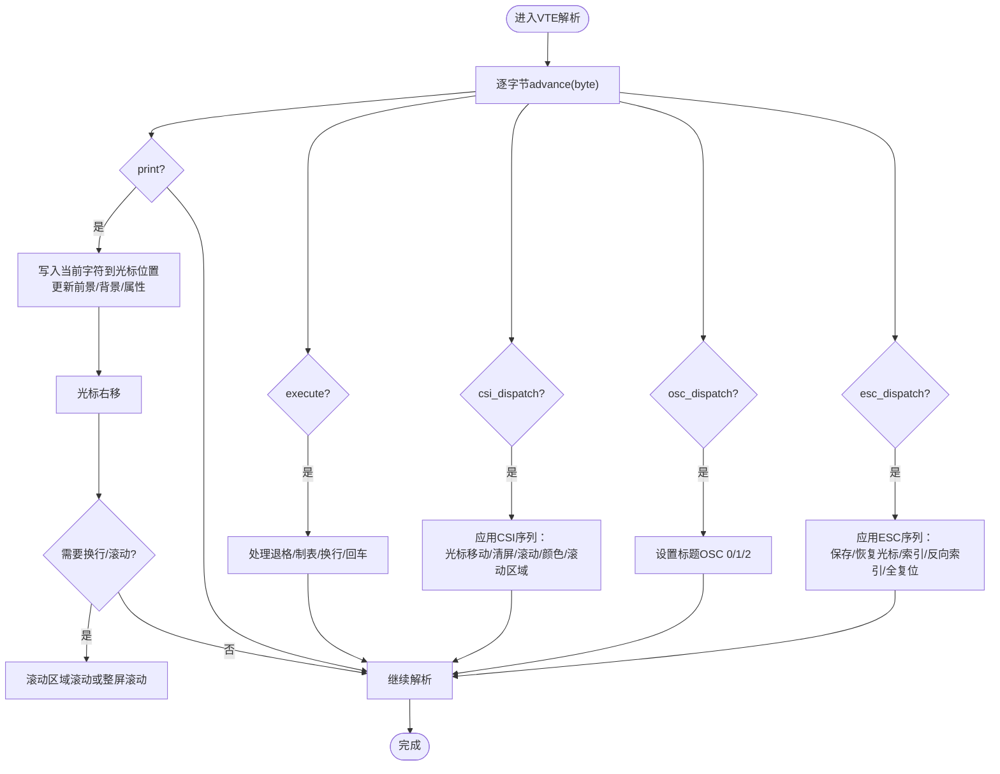
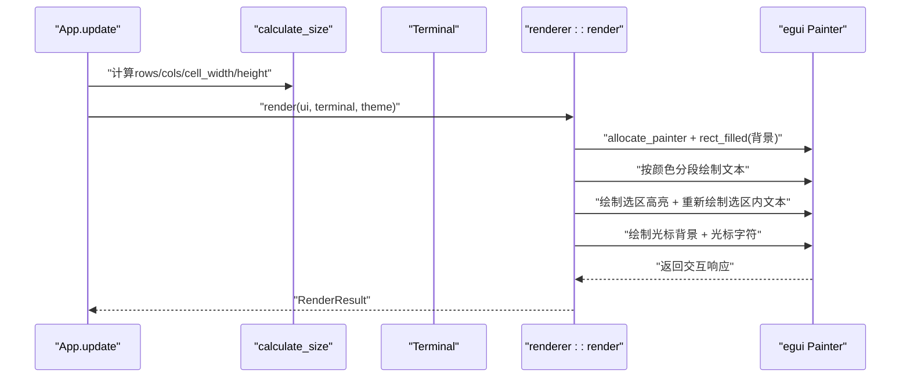
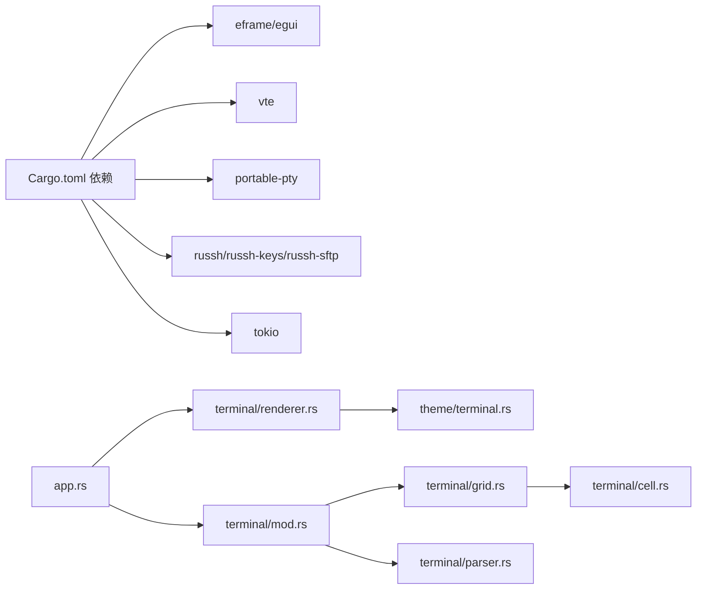

# 终端渲染数据流

<cite>
**本文档引用的文件**
- [src/terminal/mod.rs](file://src/terminal/mod.rs)
- [src/terminal/parser.rs](file://src/terminal/parser.rs)
- [src/terminal/grid.rs](file://src/terminal/grid.rs)
- [src/terminal/cell.rs](file://src/terminal/cell.rs)
- [src/terminal/renderer.rs](file://src/terminal/renderer.rs)
- [src/theme/terminal.rs](file://src/theme/terminal.rs)
- [src/app.rs](file://src/app.rs)
- [src/main.rs](file://src/main.rs)
- [src/tab/tab_item.rs](file://src/tab/tab_item.rs)
- [Cargo.toml](file://Cargo.toml)
</cite>

## 目录
1. [简介](#简介)
2. [项目结构](#项目结构)
3. [核心组件](#核心组件)
4. [架构总览](#架构总览)
5. [详细组件分析](#详细组件分析)
6. [依赖关系分析](#依赖关系分析)
7. [性能考量](#性能考量)
8. [故障排查指南](#故障排查指南)
9. [结论](#结论)
10. [附录](#附录)

## 简介
本文件面向QTerm终端渲染系统，系统性梳理从“终端状态更新”到“屏幕渲染”的完整数据路径，覆盖VTE解析器输出、网格数据更新、渲染引擎处理与UI绘制流程；深入解释终端状态变更的传播机制（光标位置、文本属性、滚动缓冲管理、屏幕刷新策略）；阐述渲染优化技术（增量渲染、脏区域检测、字体渲染缓存、GPU加速利用）；描述数据一致性保证机制（并发渲染控制、状态同步、错误恢复策略）；并提供渲染性能调优指南与具体代码示例路径。

## 项目结构
QTerm采用模块化组织，终端渲染相关的核心模块位于src/terminal，UI层在src/app与src/main中协调，主题系统在src/theme中，标签页与分屏在src/tab中。

图表来源
- [src/main.rs:49-87](file://src/main.rs#L49-L87)
- [src/app.rs:284-575](file://src/app.rs#L284-L575)
- [src/terminal/mod.rs:24-41](file://src/terminal/mod.rs#L24-L41)
- [src/terminal/grid.rs:5-14](file://src/terminal/grid.rs#L5-L14)
- [src/terminal/cell.rs:55-75](file://src/terminal/cell.rs#L55-L75)
- [src/terminal/parser.rs:4-8](file://src/terminal/parser.rs#L4-L8)
- [src/terminal/renderer.rs:42-180](file://src/terminal/renderer.rs#L42-L180)
- [src/theme/terminal.rs:5-17](file://src/theme/terminal.rs#L5-L17)
- [src/tab/tab_item.rs:3-9](file://src/tab/tab_item.rs#L3-L9)

章节来源
- [src/main.rs:49-87](file://src/main.rs#L49-L87)
- [src/app.rs:284-575](file://src/app.rs#L284-L575)
- [src/terminal/mod.rs:24-41](file://src/terminal/mod.rs#L24-L41)
- [src/terminal/grid.rs:5-14](file://src/terminal/grid.rs#L5-L14)
- [src/terminal/cell.rs:55-75](file://src/terminal/cell.rs#L55-L75)
- [src/terminal/parser.rs:4-8](file://src/terminal/parser.rs#L4-L8)
- [src/terminal/renderer.rs:42-180](file://src/terminal/renderer.rs#L42-L180)
- [src/theme/terminal.rs:5-17](file://src/theme/terminal.rs#L5-L17)
- [src/tab/tab_item.rs:3-9](file://src/tab/tab_item.rs#L3-L9)

## 核心组件
- Terminal：终端仿真器核心，持有Grid、光标、颜色属性、滚动区域、选择、VTE解析器等，负责接收字节流并通过VTE解析器更新内部状态。
- Grid：字符网格与滚动缓冲，支持滚动、插入/删除行、清屏、文本提取等。
- Cell/CellAttrs/TermColor：单元格数据结构，包含字符、前景/背景色、显示属性，以及颜色到egui颜色的转换。
- Parser/Performer：VTE解析器执行器，将ANSI转义序列应用到Terminal状态（光标移动、颜色设置、清屏、滚动等）。
- Renderer：渲染引擎，基于egui绘制背景、字符、选区高亮、光标；计算单元格尺寸并进行按颜色分段绘制以提升性能。
- Theme：终端主题，定义字体大小、前景/背景、光标、选区、ANSI颜色映射等。
- App：应用主循环，轮询标签页、计算终端尺寸、调用渲染器、处理输入与窗口状态。

章节来源
- [src/terminal/mod.rs:24-41](file://src/terminal/mod.rs#L24-L41)
- [src/terminal/grid.rs:5-14](file://src/terminal/grid.rs#L5-L14)
- [src/terminal/cell.rs:55-75](file://src/terminal/cell.rs#L55-L75)
- [src/terminal/parser.rs:4-8](file://src/terminal/parser.rs#L4-L8)
- [src/terminal/renderer.rs:42-180](file://src/terminal/renderer.rs#L42-L180)
- [src/theme/terminal.rs:5-17](file://src/theme/terminal.rs#L5-L17)
- [src/app.rs:284-575](file://src/app.rs#L284-L575)

## 架构总览
终端渲染数据流从外部字节流进入Terminal.feed，经VTE解析器执行器应用到Terminal状态，随后Renderer在UI层进行绘制。应用层负责尺寸计算、多面板布局与输入处理。

图表来源
- [src/terminal/mod.rs:65-74](file://src/terminal/mod.rs#L65-L74)
- [src/terminal/parser.rs:10-233](file://src/terminal/parser.rs#L10-L233)
- [src/terminal/grid.rs:46-102](file://src/terminal/grid.rs#L46-L102)
- [src/terminal/renderer.rs:42-180](file://src/terminal/renderer.rs#L42-L180)

## 详细组件分析

### 终端仿真器与状态传播
- Terminal.new初始化网格、光标、属性、滚动区域、VTE解析器等。
- Terminal.feed通过VTE解析器逐字节处理，将ANSI序列应用到Terminal状态。
- Terminal.resize调整网格尺寸并重置滚动区域与光标越界。
- Terminal.scroll_up_in_region/scroll_down_in_region在滚动区域内滚动，或在全屏模式下滚动整个Grid。
- Terminal.enter_alt_screen/exit_alt_screen在主屏与备用屏之间切换，保存/恢复Grid。
- Terminal.selected_text/normalized_selection/word_at/line_range提供选择与选词功能。

图表来源
- [src/terminal/mod.rs:24-41](file://src/terminal/mod.rs#L24-L41)
- [src/terminal/grid.rs:5-14](file://src/terminal/grid.rs#L5-L14)
- [src/terminal/cell.rs:55-75](file://src/terminal/cell.rs#L55-L75)

章节来源
- [src/terminal/mod.rs:43-200](file://src/terminal/mod.rs#L43-L200)
- [src/terminal/grid.rs:16-148](file://src/terminal/grid.rs#L16-L148)
- [src/terminal/cell.rs:5-75](file://src/terminal/cell.rs#L5-L75)

### VTE解析器与ANSI序列处理
- Performer实现vte::Perform接口，处理print、execute、csi_dispatch、osc_dispatch、esc_dispatch等。
- print：在光标处写入字符并前进，必要时换行与滚动。
- execute：处理退格、制表、换行、回车等控制字符。
- csi_dispatch：支持光标移动、清屏、滚动、颜色设置、私有模式（如备用屏）等。
- osc_dispatch：处理标题设置（OSC 0/1/2）。
- esc_dispatch：支持保存/恢复光标、索引/反向索引、全复位等。

图表来源
- [src/terminal/parser.rs:10-233](file://src/terminal/parser.rs#L10-L233)

章节来源
- [src/terminal/parser.rs:10-233](file://src/terminal/parser.rs#L10-L233)

### 渲染引擎与UI绘制
- calculate_size：根据可用空间与字体宽度计算终端行列数与单元格尺寸。
- render：分配绘制区域，绘制背景、按颜色分段绘制字符、选区高亮、光标。
- resolve_fg/resolve_bg：根据反色属性交换前景/背景色。
- 应用层在update中轮询标签页、计算尺寸、调用渲染器并处理鼠标事件。

图表来源
- [src/app.rs:436-575](file://src/app.rs#L436-L575)
- [src/terminal/renderer.rs:25-40](file://src/terminal/renderer.rs#L25-L40)
- [src/terminal/renderer.rs:42-180](file://src/terminal/renderer.rs#L42-L180)

章节来源
- [src/terminal/renderer.rs:25-198](file://src/terminal/renderer.rs#L25-L198)
- [src/app.rs:436-575](file://src/app.rs#L436-L575)

### 数据一致性与状态同步
- Terminal.feed每次处理完字节后保留解析器实例，避免重复构造，减少开销。
- Terminal.resize在调整尺寸后重置滚动区域与光标越界，保证状态一致。
- Terminal.enter_alt_screen/exit_alt_screen在主屏与备用屏之间切换，保存/恢复Grid，保持状态同步。
- App.update中每帧轮询标签页，读取终端输出并更新标签页标题，确保UI与终端状态同步。
- Renderer在绘制前计算单元格尺寸，避免因字体变化导致的错位。

章节来源
- [src/terminal/mod.rs:65-98](file://src/terminal/mod.rs#L65-L98)
- [src/terminal/mod.rs:118-135](file://src/terminal/mod.rs#L118-L135)
- [src/tab/tab_item.rs:23-35](file://src/tab/tab_item.rs#L23-L35)
- [src/terminal/renderer.rs:25-40](file://src/terminal/renderer.rs#L25-L40)

### 并发渲染控制与错误恢复
- 应用层使用eframe的request_repaint驱动渲染循环，避免阻塞主线程。
- Tokio运行时提供异步能力，可用于PTY/SFTP/SSH等IO密集场景（在其他模块中使用），但渲染路径仍由UI线程主导。
- 错误恢复：应用层在on_exit保存配置并关闭所有标签页；渲染过程中未见显式异常处理，建议在外部IO层捕获错误并反馈给用户。

章节来源
- [src/app.rs:577-589](file://src/app.rs#L577-L589)
- [Cargo.toml:17](file://Cargo.toml#L17)

## 依赖关系分析
- 外部依赖：eframe/egui（UI框架与渲染）、vte（ANSI解析）、portable-pty（本地PTY）、russh/russh-keys/russh-sftp（SSH/SFTP）、tokio（异步运行时）。
- 内部依赖：terminal模块相互协作，app协调UI与终端，theme提供颜色方案。

图表来源
- [Cargo.toml:8-25](file://Cargo.toml#L8-L25)
- [src/app.rs:284-575](file://src/app.rs#L284-L575)
- [src/terminal/mod.rs:24-41](file://src/terminal/mod.rs#L24-L41)
- [src/terminal/renderer.rs:42-180](file://src/terminal/renderer.rs#L42-L180)
- [src/theme/terminal.rs:5-17](file://src/theme/terminal.rs#L5-L17)
- [src/terminal/grid.rs:5-14](file://src/terminal/grid.rs#L5-L14)
- [src/terminal/parser.rs:4-8](file://src/terminal/parser.rs#L4-L8)
- [src/terminal/cell.rs:55-75](file://src/terminal/cell.rs#L55-L75)

章节来源
- [Cargo.toml:8-25](file://Cargo.toml#L8-L25)

## 性能考量
- 渲染优化
  - 按颜色分段绘制：renderer按相同前景色连续绘制，减少绘制调用次数。
  - 背景按需绘制：仅对非默认背景色单元格绘制矩形背景，降低overdraw。
  - 字体缓存：egui字体系统会缓存字形宽度与字形数据，减少重复计算。
  - GPU加速：eframe默认启用wgpu后端，渲染由GPU驱动，适合大量文本绘制。
- 增量渲染与脏区域检测
  - 当前实现为全量遍历绘制（每帧）。若需进一步优化，可在Terminal/Grid中引入“脏区域”标记，在Renderer中仅绘制变更区域。
- 内存使用控制
  - Grid的scrollback使用VecDeque，限制最大行数，避免无限增长。
  - Cell默认值简单，占用较小；TermColor与CellAttrs均为轻量结构。
- 响应性改进
  - App.update中每帧调用ctx.request_repaint，保持UI流畅。
  - 字体缩放通过调整theme.terminal.font_size与重新配置字体实现，避免频繁重建UI。

章节来源
- [src/terminal/renderer.rs:80-107](file://src/terminal/renderer.rs#L80-L107)
- [src/terminal/grid.rs:46-61](file://src/terminal/grid.rs#L46-L61)
- [src/terminal/grid.rs:104-114](file://src/terminal/grid.rs#L104-L114)
- [src/app.rs:382-391](file://src/app.rs#L382-L391)
- [Cargo.toml:26-30](file://Cargo.toml#L26-L30)

## 故障排查指南
- 终端显示异常
  - 检查Terminal.feed是否正确传入字节流，确认VTE解析器未被破坏。
  - 查看CSI/OSC序列是否被正确处理（如标题设置、颜色设置）。
- 光标位置不正确
  - 检查execute/print中的光标边界处理与滚动区域设置。
  - 确认Terminal.resize后光标未越界。
- 滚动行为异常
  - 检查scroll_up_in_region/scroll_down_in_region的滚动区域边界与全屏模式分支。
- 选区与选词功能无效
  - 确认Selection存在且normalized_selection返回有效范围。
  - 检查Renderer中选区高亮绘制逻辑。
- 字体与渲染问题
  - 检查calculate_size是否正确计算cell_width/height。
  - 确认字体配置与egui字体系统加载成功。
- 性能问题
  - 若出现卡顿，考虑实现脏区域检测与增量渲染。
  - 调整字体大小与行数，减少绘制单元格数量。

章节来源
- [src/terminal/parser.rs:34-61](file://src/terminal/parser.rs#L34-L61)
- [src/terminal/mod.rs:100-116](file://src/terminal/mod.rs#L100-L116)
- [src/terminal/mod.rs:137-155](file://src/terminal/mod.rs#L137-L155)
- [src/terminal/renderer.rs:25-40](file://src/terminal/renderer.rs#L25-L40)
- [src/app.rs:382-391](file://src/app.rs#L382-L391)

## 结论
QTerm的终端渲染系统以VTE解析为核心，通过Terminal统一管理状态，Grid承载网格与滚动缓冲，Renderer基于egui高效绘制。当前实现具备良好的模块化与可维护性，渲染路径清晰、状态传播明确。为进一步提升性能，建议引入脏区域检测与增量渲染，并在主题与字体系统上持续优化以适配多平台与多语言环境。

## 附录
- 代码示例路径（不直接展示代码内容）
  - 终端状态更新入口：[src/terminal/mod.rs:65-74](file://src/terminal/mod.rs#L65-L74)
  - VTE解析器执行器：[src/terminal/parser.rs:10-233](file://src/terminal/parser.rs#L10-L233)
  - 网格滚动与清屏：[src/terminal/grid.rs:46-102](file://src/terminal/grid.rs#L46-L102)
  - 单元格颜色转换：[src/terminal/cell.rs:36-53](file://src/terminal/cell.rs#L36-L53)
  - 渲染引擎绘制流程：[src/terminal/renderer.rs:42-180](file://src/terminal/renderer.rs#L42-L180)
  - 应用层尺寸计算与渲染调用：[src/app.rs:436-575](file://src/app.rs#L436-L575)
  - 主题颜色映射：[src/theme/terminal.rs:84-100](file://src/theme/terminal.rs#L84-L100)
  - 应用入口与窗口构建：[src/main.rs:49-87](file://src/main.rs#L49-L87)