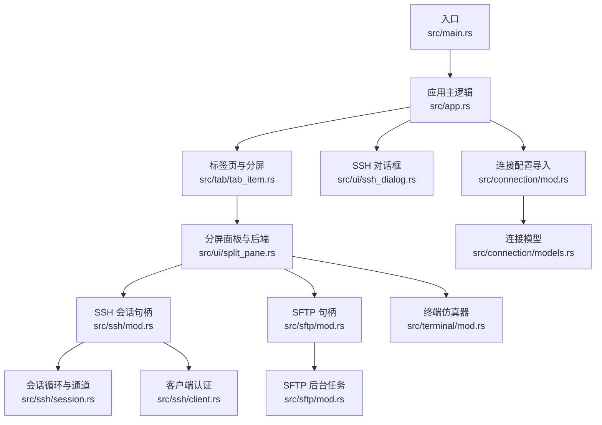
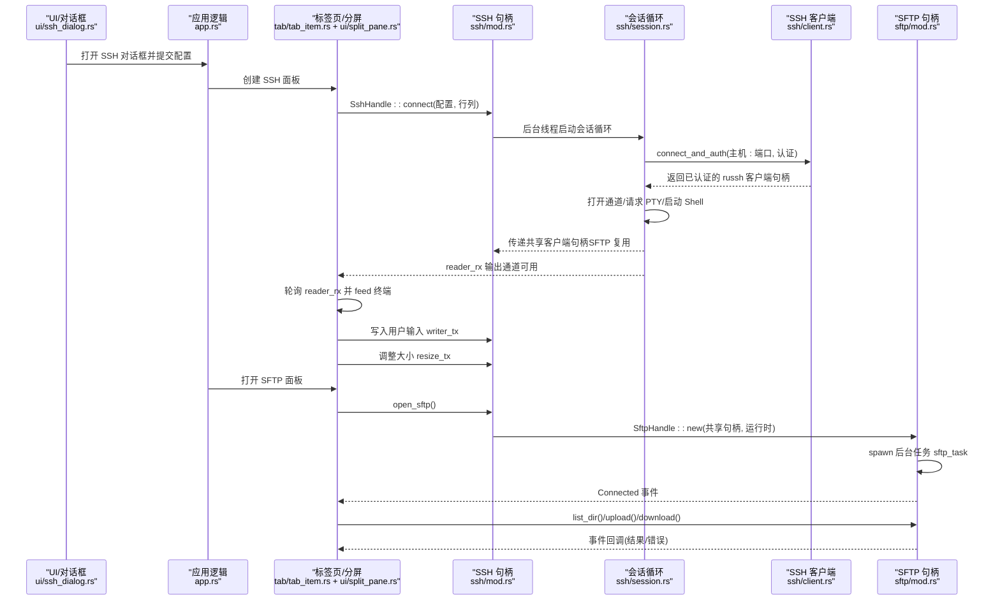
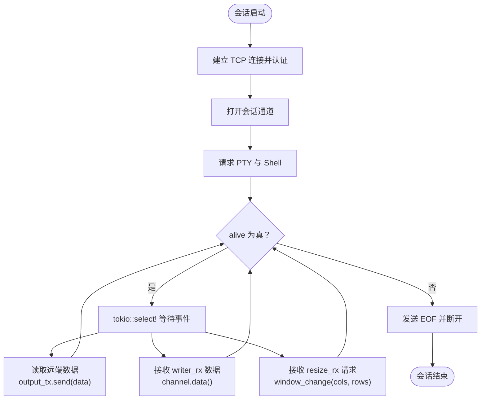
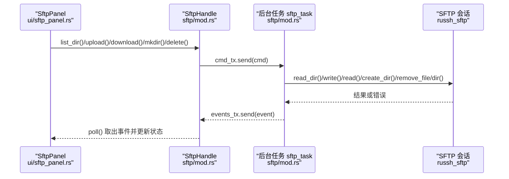
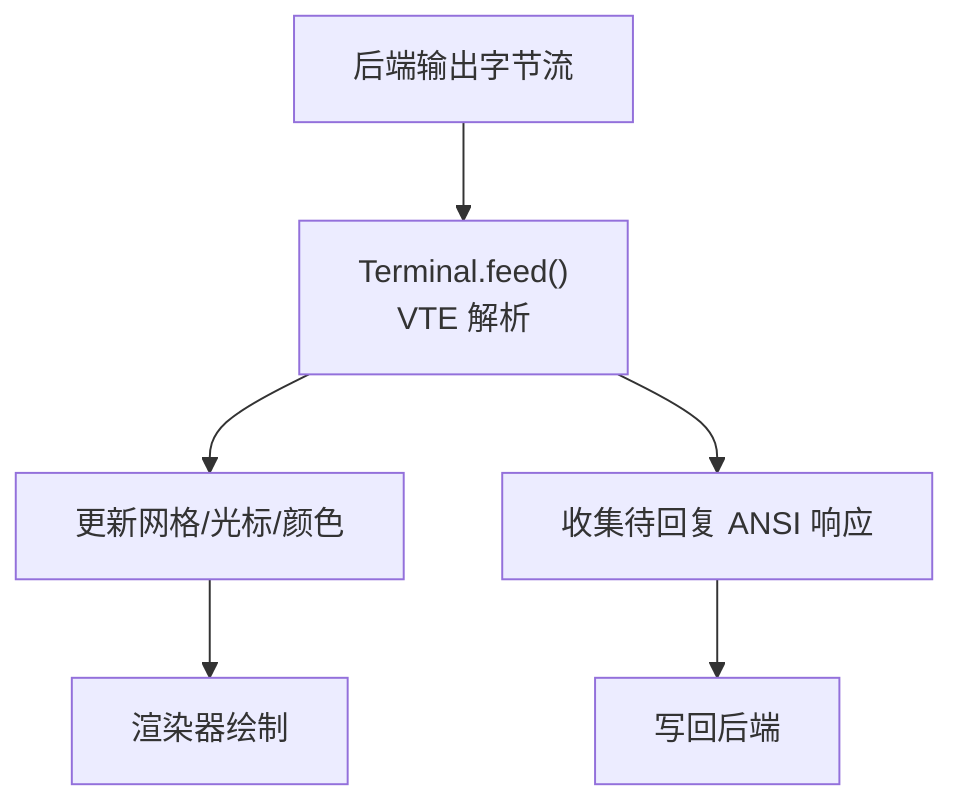
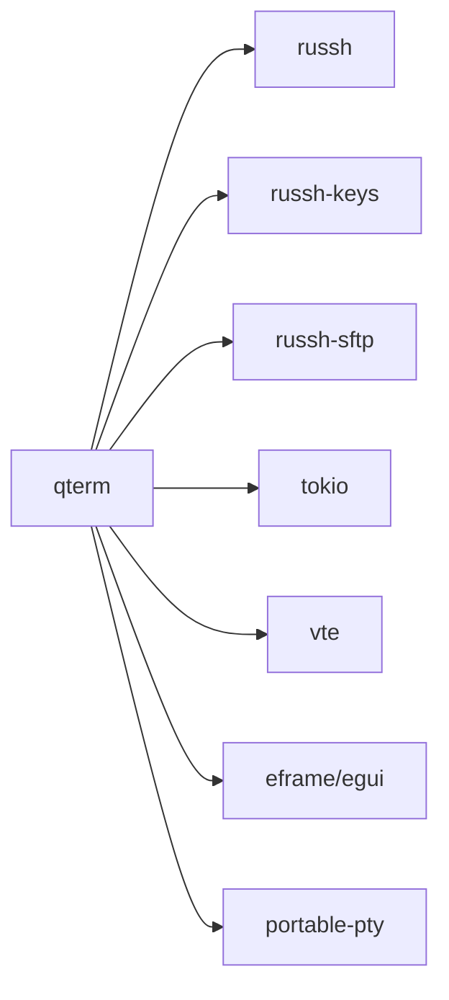

# 网络传输数据流

<cite>
**本文引用的文件**
- [main.rs](file://src/main.rs)
- [app.rs](file://src/app.rs)
- [ssh/mod.rs](file://src/ssh/mod.rs)
- [ssh/session.rs](file://src/ssh/session.rs)
- [ssh/client.rs](file://src/ssh/client.rs)
- [sftp/mod.rs](file://src/sftp/mod.rs)
- [ui/sftp_panel.rs](file://src/ui/sftp_panel.rs)
- [ui/ssh_dialog.rs](file://src/ui/ssh_dialog.rs)
- [ui/split_pane.rs](file://src/ui/split_pane.rs)
- [tab/tab_item.rs](file://src/tab/tab_item.rs)
- [terminal/mod.rs](file://src/terminal/mod.rs)
- [connection/mod.rs](file://src/connection/mod.rs)
- [connection/models.rs](file://src/connection/models.rs)
- [Cargo.toml](file://Cargo.toml)
</cite>

## 目录
1. [简介](#简介)
2. [项目结构](#项目结构)
3. [核心组件](#核心组件)
4. [架构总览](#架构总览)
5. [详细组件分析](#详细组件分析)
6. [依赖关系分析](#依赖关系分析)
7. [性能考量](#性能考量)
8. [故障排查指南](#故障排查指南)
9. [结论](#结论)
10. [附录](#附录)

## 简介
本文件围绕 QTerm 的网络传输数据流，系统梳理 SSH 会话与 SFTP 文件传输的完整数据流转过程，涵盖网络连接建立、数据包封装、协议解析与应用层处理；深入说明 SSH 会话的数据通道管理（标准输入输出流、错误流处理、会话状态同步、连接保活）；阐述 SFTP 文件传输的控制流程（文件读写、进度跟踪、断点续传与错误重试策略）；解释网络数据的缓冲与队列管理（发送队列、接收缓冲、流量控制与背压处理）；并给出网络安全考虑（加密、身份验证、会话安全与传输完整性保护）。最后提供具体代码示例路径与常见网络问题的诊断与解决思路。

## 项目结构
QTerm 采用模块化组织，核心网络能力集中在 ssh 与 sftp 模块，UI 层通过 egui 提供交互，终端仿真器负责本地/远程输出解析与渲染。整体结构如下：

图示来源
- [main.rs:1-87](file://src/main.rs#L1-L87)
- [app.rs:1-1465](file://src/app.rs#L1-L1465)
- [ssh/mod.rs:1-136](file://src/ssh/mod.rs#L1-L136)
- [ssh/session.rs:1-90](file://src/ssh/session.rs#L1-L90)
- [ssh/client.rs:1-63](file://src/ssh/client.rs#L1-L63)
- [sftp/mod.rs:1-238](file://src/sftp/mod.rs#L1-L238)
- [ui/split_pane.rs:1-238](file://src/ui/split_pane.rs#L1-L238)
- [terminal/mod.rs:1-200](file://src/terminal/mod.rs#L1-L200)
- [ui/ssh_dialog.rs:1-147](file://src/ui/ssh_dialog.rs#L1-L147)
- [connection/mod.rs:1-148](file://src/connection/mod.rs#L1-L148)
- [connection/models.rs:1-43](file://src/connection/models.rs#L1-L43)

章节来源
- [main.rs:1-87](file://src/main.rs#L1-L87)
- [app.rs:1-1465](file://src/app.rs#L1-L1465)

## 核心组件
- SSH 会话句柄与通道
  - SshHandle 提供 reader_rx（输出接收）、writer_tx（输入发送）、resize_tx（终端大小调整）与存活标志，并通过共享的 russh 客户端句柄复用 SFTP 子系统。
  - 会话循环 run_ssh_session 负责连接、认证、PTYSHELL 申请、数据读写与大小调整，并在异常或断开时清理资源。
- SFTP 客户端句柄
  - SftpHandle 通过命令通道与后台任务通信，事件通道向主线程推送连接、目录列表、上传/下载/创建/删除结果与错误。
  - 后台任务 sftp_task 在 SSH 通道上打开 SFTP 子系统，循环处理命令并关闭会话。
- 终端仿真器
  - Terminal 通过 VTE 解析器处理字节流，维护网格、光标、颜色、滚动区域与选择，支持备用屏幕模式。
- UI 与面板
  - SplitLayout 管理多面板布局，ChildPane 作为统一抽象承载本地/远程终端与 SFTP 面板，统一轮询与写入接口。
  - SftpPanel 提供双栏文件浏览、上传/下载、目录导航与状态反馈。
  - SshDialog 提供 SSH 连接参数输入与校验。

章节来源
- [ssh/mod.rs:1-136](file://src/ssh/mod.rs#L1-L136)
- [ssh/session.rs:1-90](file://src/ssh/session.rs#L1-L90)
- [sftp/mod.rs:1-238](file://src/sftp/mod.rs#L1-L238)
- [terminal/mod.rs:1-200](file://src/terminal/mod.rs#L1-L200)
- [ui/split_pane.rs:1-238](file://src/ui/split_pane.rs#L1-L238)
- [ui/sftp_panel.rs:1-387](file://src/ui/sftp_panel.rs#L1-L387)
- [ui/ssh_dialog.rs:1-147](file://src/ui/ssh_dialog.rs#L1-L147)

## 架构总览
下图展示 SSH 与 SFTP 的数据通路与组件交互：

图示来源
- [ui/ssh_dialog.rs:1-147](file://src/ui/ssh_dialog.rs#L1-L147)
- [app.rs:1-1465](file://src/app.rs#L1-L1465)
- [tab/tab_item.rs:1-48](file://src/tab/tab_item.rs#L1-L48)
- [ui/split_pane.rs:1-238](file://src/ui/split_pane.rs#L1-L238)
- [ssh/mod.rs:1-136](file://src/ssh/mod.rs#L1-L136)
- [ssh/session.rs:1-90](file://src/ssh/session.rs#L1-L90)
- [ssh/client.rs:1-63](file://src/ssh/client.rs#L1-L63)
- [sftp/mod.rs:1-238](file://src/sftp/mod.rs#L1-L238)

## 详细组件分析

### SSH 会话数据通道管理
- 数据通道
  - 输出通道：会话循环读取远端数据并通过 mpsc::Sender 发送到主线程 reader_rx。
  - 输入通道：主线程通过 tokio::mpsc::Sender writer_tx 将用户输入写入远端。
  - 终端大小调整：主线程通过 resize_tx 发送行列，会话循环调用 window_change。
- 错误流与状态同步
  - 会话循环基于 tokio::select! 并发处理读、写、大小调整；遇到 EOF 或 alive 标志为假时退出。
  - 通过 AtomicBool 标记存活，断开时发送 EOF 并触发 disconnect。
- 连接保活与健壮性
  - 会话循环持续监听通道消息，未见显式的 keep-alive 心跳；可通过定期 resize 或写入探测数据维持活跃（建议在上层策略中加入周期性探测）。

图示来源
- [ssh/session.rs:1-90](file://src/ssh/session.rs#L1-L90)
- [ssh/mod.rs:1-136](file://src/ssh/mod.rs#L1-L136)

章节来源
- [ssh/session.rs:1-90](file://src/ssh/session.rs#L1-L90)
- [ssh/mod.rs:1-136](file://src/ssh/mod.rs#L1-L136)

### SFTP 文件传输控制流
- 控制通道与事件通道
  - 命令通道：主线程通过 tokio::mpsc::Sender 发送 ListDir/Upload/Download/Mkdir/Delete/Disconnect。
  - 事件通道：后台任务通过 mpsc::Sender 发送 Connected/DirListing/UploadDone/DownloadDone/MkdirDone/DeleteDone/Error。
- 文件读写与进度
  - 上传：读取本地文件字节，调用 SFTP 写入远端；下载：读取远端字节，写入本地文件。
  - 进度跟踪：当前实现以事件回调形式反馈“完成/失败”，未见内置进度回调；可在上层 UI 层叠加计数器统计。
- 断点续传与重试
  - 当前未实现断点续传；错误重试策略需在上层 UI 逻辑中补充（例如失败后再次发起相同命令）。
- 生命周期
  - 后台任务在收到 Disconnect 或 alive 标志为假时关闭 SFTP 会话并停止循环。

图示来源
- [ui/sftp_panel.rs:1-387](file://src/ui/sftp_panel.rs#L1-L387)
- [sftp/mod.rs:1-238](file://src/sftp/mod.rs#L1-L238)

章节来源
- [sftp/mod.rs:1-238](file://src/sftp/mod.rs#L1-L238)
- [ui/sftp_panel.rs:1-387](file://src/ui/sftp_panel.rs#L1-L387)

### 终端仿真与数据解析
- 字节流到可视内容
  - 终端 feed 接收来自 SSH/PTY 的字节流，通过 VTE 解析器推进 Performer，更新网格、光标、颜色与滚动区域。
- 交互与渲染
  - SplitLayout.ChildPane 统一轮询后端输出，将字节喂给 Terminal；同时收集 Terminal 的待回复 ANSI 响应并通过后端写回。
- 备用屏幕与选择
  - 支持进入/退出备用屏幕模式；提供单词与行选择范围计算，便于复制粘贴。

图示来源
- [terminal/mod.rs:1-200](file://src/terminal/mod.rs#L1-L200)
- [ui/split_pane.rs:1-238](file://src/ui/split_pane.rs#L1-L238)

章节来源
- [terminal/mod.rs:1-200](file://src/terminal/mod.rs#L1-L200)
- [ui/split_pane.rs:1-238](file://src/ui/split_pane.rs#L1-L238)

### UI 与连接配置
- SSH 对话框
  - 支持密码/私钥两种认证模式，校验主机、端口、用户名必填，生成 SshConfig 并交由应用逻辑创建 SSH 面板。
- 连接配置导入
  - 从 WhaleTerm 配置文件 connections.json 加载连接，解密密码（AES-256-CFB），并展开为扁平连接列表。

章节来源
- [ui/ssh_dialog.rs:1-147](file://src/ui/ssh_dialog.rs#L1-L147)
- [connection/mod.rs:1-148](file://src/connection/mod.rs#L1-L148)
- [connection/models.rs:1-43](file://src/connection/models.rs#L1-L43)

## 依赖关系分析
- 运行时与并发
  - SSH 使用独立的 tokio 运行时（懒初始化），会话循环与 SFTP 后台任务均在该运行时上执行。
  - 通道采用标准库 mpsc（本地/远程终端）与 tokio::sync::mpsc（SFTP 命令），保证跨线程安全。
- 协议栈与加密
  - SSH 使用 russh/russh-keys，SFTP 使用 russh-sftp；底层依赖 OpenSSL 风格的密钥与算法。
- 依赖图

图示来源
- [Cargo.toml:1-30](file://Cargo.toml#L1-L30)

章节来源
- [Cargo.toml:1-30](file://Cargo.toml#L1-L30)

## 性能考量
- 通道容量与背压
  - writer_tx（SSH 输入）与 cmd_tx（SFTP 命令）均使用有界缓冲；建议在 UI 层根据吞吐动态调整容量或在上层增加背压检测。
- 事件轮询
  - ChildPane::poll 与 SftpPanel::poll 采用非阻塞 try_recv/try_send，避免阻塞 UI 渲染；建议在高频场景下合并多次事件处理。
- 终端解析
  - VTE 解析器逐字节推进，建议在上层聚合输出后再 feed，减少解析次数。
- 线程与运行时
  - SSH 专用运行时避免与 UI 线程竞争；若出现卡顿，可考虑拆分 CPU 密集型任务或降低解析频率。

## 故障排查指南
- SSH 连接失败
  - 检查主机/端口/认证参数是否正确；查看 SshError::Connection/Auth/Channel 的具体错误信息。
  - 若认证失败，确认密码或私钥路径与口令正确。
- 会话中断或 EOF
  - 观察 alive 标志与会话循环是否提前退出；检查 writer_tx/resize_tx 是否被关闭。
- SFTP 操作失败
  - 查看 SftpEvent::Error 事件内容；确认远端路径存在且具备权限；检查本地文件读写权限。
- UI 卡顿或无响应
  - 检查通道是否积压；适当增大缓冲容量或在 UI 层限速事件处理。
- 会话保活
  - 当前未实现心跳；可在上层策略中定期发送探测数据或调整 resize 频率以维持活跃。

章节来源
- [ssh/mod.rs:1-136](file://src/ssh/mod.rs#L1-L136)
- [sftp/mod.rs:1-238](file://src/sftp/mod.rs#L1-L238)
- [ui/sftp_panel.rs:1-387](file://src/ui/sftp_panel.rs#L1-L387)

## 结论
QTerm 的网络传输数据流以通道驱动为核心：SSH 会话通过独立运行时与多通道实现输入输出与大小调整的异步处理；SFTP 通过命令/事件通道实现文件操作的异步编排。终端仿真器负责将字节流解析为可视内容，并在 UI 层提供一致的交互体验。当前实现具备良好的模块化与可扩展性，建议在上层补充断点续传、进度回调与心跳保活策略，以进一步提升可靠性与用户体验。

## 附录
- 代码示例路径（不含具体代码内容）
  - SSH 连接与认证：[ssh/client.rs:25-63](file://src/ssh/client.rs#L25-L63)
  - 会话主循环与通道：[ssh/session.rs:11-90](file://src/ssh/session.rs#L11-L90)
  - SSH 句柄与通道创建：[ssh/mod.rs:71-109](file://src/ssh/mod.rs#L71-L109)
  - SFTP 后台任务与命令处理：[sftp/mod.rs:119-167](file://src/sftp/mod.rs#L119-L167)、[sftp/mod.rs:170-238](file://src/sftp/mod.rs#L170-L238)
  - SFTP 面板事件处理与操作：[ui/sftp_panel.rs:52-110](file://src/ui/sftp_panel.rs#L52-L110)、[ui/sftp_panel.rs:326-356](file://src/ui/sftp_panel.rs#L326-L356)
  - 终端解析与渲染桥接：[ui/split_pane.rs:70-113](file://src/ui/split_pane.rs#L70-L113)、[terminal/mod.rs:67-74](file://src/terminal/mod.rs#L67-L74)
  - SSH 对话框与配置生成：[ui/ssh_dialog.rs:117-146](file://src/ui/ssh_dialog.rs#L117-L146)
  - 连接配置导入与解密：[connection/mod.rs:30-59](file://src/connection/mod.rs#L30-L59)