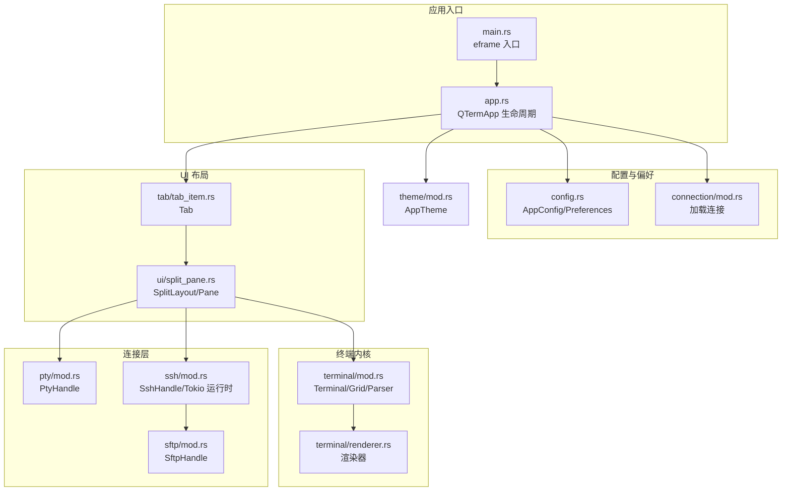
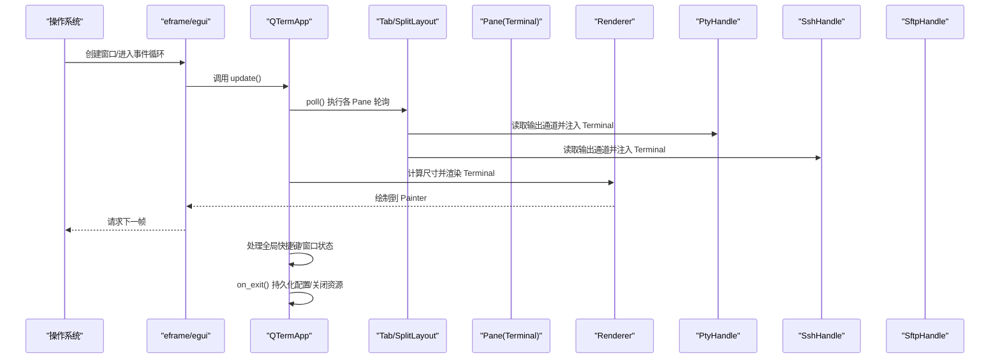
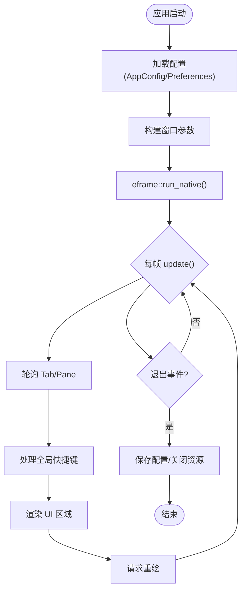
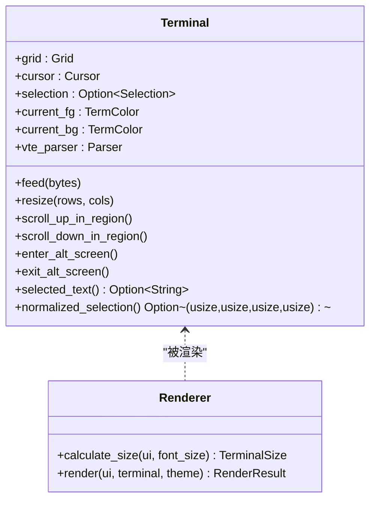
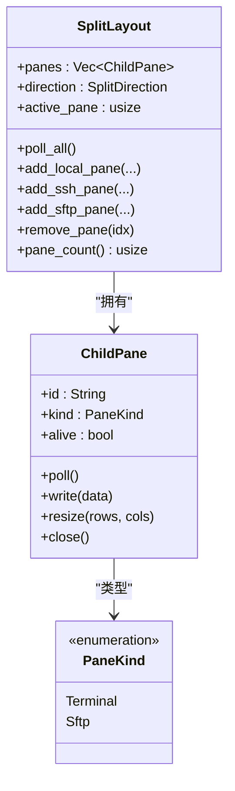
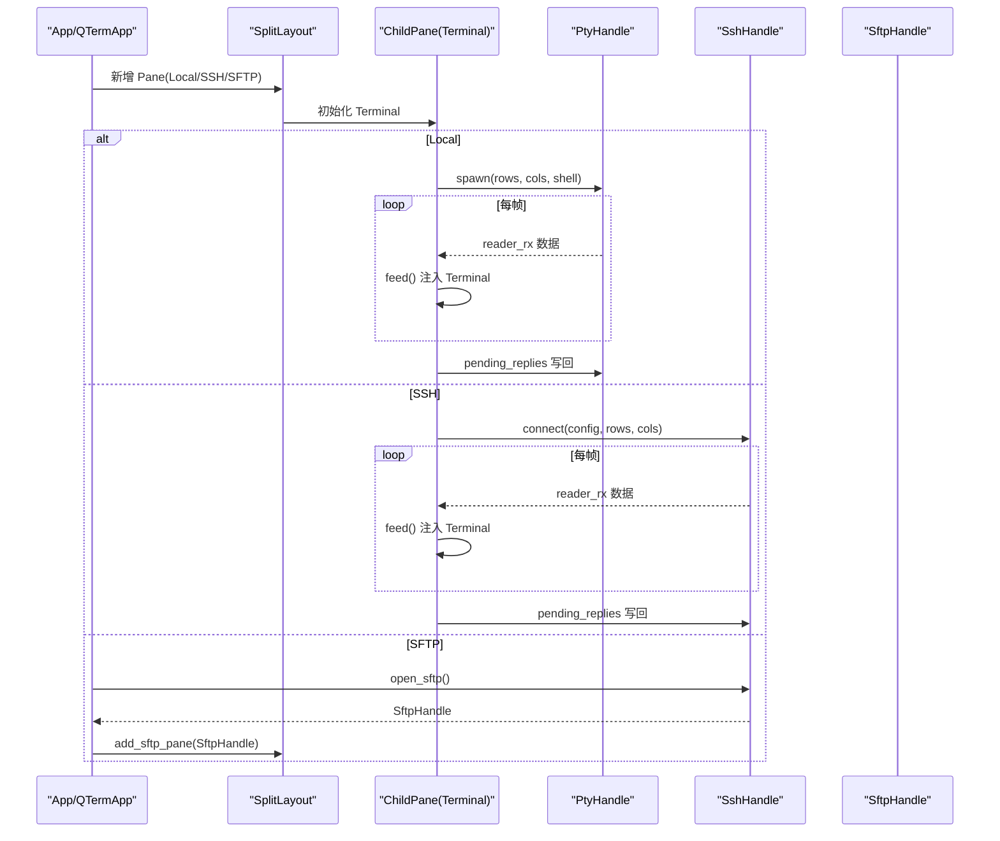
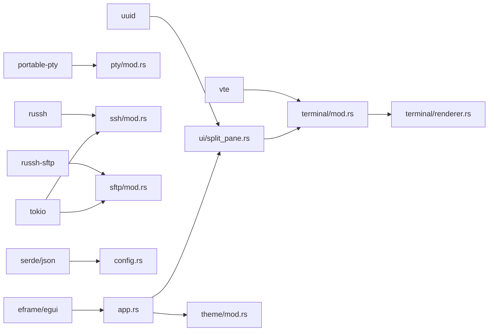

# 核心架构

<cite>
**本文引用的文件**
- [main.rs](file://src/main.rs)
- [app.rs](file://src/app.rs)
- [config.rs](file://src/config.rs)
- [terminal/mod.rs](file://src/terminal/mod.rs)
- [terminal/renderer.rs](file://src/terminal/renderer.rs)
- [theme/mod.rs](file://src/theme/mod.rs)
- [pty/mod.rs](file://src/pty/mod.rs)
- [ssh/mod.rs](file://src/ssh/mod.rs)
- [sftp/mod.rs](file://src/sftp/mod.rs)
- [ui/mod.rs](file://src/ui/mod.rs)
- [ui/split_pane.rs](file://src/ui/split_pane.rs)
- [tab/mod.rs](file://src/tab/mod.rs)
- [tab/tab_item.rs](file://src/tab/tab_item.rs)
- [connection/mod.rs](file://src/connection/mod.rs)
- [Cargo.toml](file://Cargo.toml)
</cite>

## 目录
1. [引言](#引言)
2. [项目结构](#项目结构)
3. [核心组件](#核心组件)
4. [架构总览](#架构总览)
5. [详细组件分析](#详细组件分析)
6. [依赖分析](#依赖分析)
7. [性能考虑](#性能考虑)
8. [故障排查指南](#故障排查指南)
9. [结论](#结论)
10. [附录](#附录)

## 引言
本文件面向QTerm项目的开发者与维护者，系统性梳理基于 eframe/egui 的桌面应用架构。重点解释主应用生命周期管理、事件处理机制与状态管理模式；深入分析模块化设计：终端渲染系统、连接管理、UI 组件与主题系统之间的关系；阐述 MVC 模式在本项目中的落地：模型（Terminal）、视图（Renderer）、控制器（App）。同时说明事件驱动架构如何结合 egui 的事件循环与异步消息传递系统协同工作，并给出从用户输入到终端渲染的完整数据路径与时序图。

## 项目结构
QTerm 采用按功能域划分的模块化组织方式，核心模块如下：
- 应用入口与生命周期：main.rs、app.rs
- 配置与偏好：config.rs
- 终端内核与渲染：terminal/mod.rs、terminal/renderer.rs
- 主题系统：theme/mod.rs
- 进程与伪终端：pty/mod.rs
- SSH/SFTP：ssh/mod.rs、sftp/mod.rs
- UI 布局与面板：ui/mod.rs、ui/split_pane.rs
- 标签页与布局编排：tab/mod.rs、tab/tab_item.rs
- 连接导入：connection/mod.rs
- 依赖声明：Cargo.toml

**图表来源**
- [main.rs:44-75](file://src/main.rs#L44-L75)
- [app.rs:61-93](file://src/app.rs#L61-L93)
- [config.rs:33-118](file://src/config.rs#L33-L118)
- [connection/mod.rs:27-55](file://src/connection/mod.rs#L27-L55)
- [tab/tab_item.rs:3-17](file://src/tab/tab_item.rs#L3-L17)
- [ui/split_pane.rs:132-146](file://src/ui/split_pane.rs#L132-L146)
- [terminal/mod.rs:22-57](file://src/terminal/mod.rs#L22-L57)
- [terminal/renderer.rs:36-167](file://src/terminal/renderer.rs#L36-L167)
- [pty/mod.rs:9-74](file://src/pty/mod.rs#L9-L74)
- [ssh/mod.rs:52-95](file://src/ssh/mod.rs#L52-L95)
- [sftp/mod.rs:7-58](file://src/sftp/mod.rs#L7-L58)
- [theme/mod.rs:13-62](file://src/theme/mod.rs#L13-L62)

**章节来源**
- [main.rs:44-75](file://src/main.rs#L44-L75)
- [app.rs:61-93](file://src/app.rs#L61-L93)
- [config.rs:33-118](file://src/config.rs#L33-L118)
- [connection/mod.rs:27-55](file://src/connection/mod.rs#L27-L55)
- [tab/tab_item.rs:3-17](file://src/tab/tab_item.rs#L3-L17)
- [ui/split_pane.rs:132-146](file://src/ui/split_pane.rs#L132-L146)
- [terminal/mod.rs:22-57](file://src/terminal/mod.rs#L22-L57)
- [terminal/renderer.rs:36-167](file://src/terminal/renderer.rs#L36-L167)
- [pty/mod.rs:9-74](file://src/pty/mod.rs#L9-L74)
- [ssh/mod.rs:52-95](file://src/ssh/mod.rs#L52-L95)
- [sftp/mod.rs:7-58](file://src/sftp/mod.rs#L7-L58)
- [theme/mod.rs:13-62](file://src/theme/mod.rs#L13-L62)

## 核心组件
- 应用控制器（App）
  - 负责窗口初始化、主题与字体配置、全局快捷键、标题栏/侧边栏/底部栏渲染、中央终端区域调度、窗口状态持久化等。
  - 关键职责：生命周期管理（on_exit）、事件分发（全局快捷键）、布局协调（多面板/多标签）、输入转发（键盘/鼠标）。
- 终端模型（Terminal）
  - 内含网格（Grid）、光标（Cursor）、选择区（Selection）、VTE 解析器（vte::Parser）与属性（CellAttrs）。
  - 提供输入注入（feed）、尺寸调整（resize）、滚动控制、备用屏切换、文本选择与范围计算。
- 渲染器（Renderer）
  - 将 Terminal 状态绘制到 egui 的 Painter 上，支持选区高亮、背景色优化、光标绘制与逐色文本批处理。
- 布局与面板（SplitLayout/Pane）
  - 支持本地（Pty）与远程（SSH）两种后端，统一抽象为 PaneKind，支持水平/垂直分割、活动面板切换、尺寸同步。
- 连接层（Pty/Ssh/Sftp）
  - PtyHandle：本地伪终端，线程+通道读取子进程输出，写入输入。
  - SshHandle：Tokio 异步会话封装，通道收发远端数据与尺寸变更，支持打开 SFTP 子系统。
  - SftpHandle：通过命令/事件通道与 SFTP 任务协作，提供目录列举、上传下载、删除等操作。
- 主题系统（AppTheme/SystemTheme/TerminalTheme）
  - 统一管理明暗模式、系统配色与终端配色，动态应用到 egui 上下文。

**章节来源**
- [app.rs:15-93](file://src/app.rs#L15-L93)
- [terminal/mod.rs:22-174](file://src/terminal/mod.rs#L22-L174)
- [terminal/renderer.rs:36-167](file://src/terminal/renderer.rs#L36-L167)
- [ui/split_pane.rs:17-130](file://src/ui/split_pane.rs#L17-L130)
- [pty/mod.rs:9-99](file://src/pty/mod.rs#L9-L99)
- [ssh/mod.rs:52-117](file://src/ssh/mod.rs#L52-L117)
- [sftp/mod.rs:7-96](file://src/sftp/mod.rs#L7-L96)
- [theme/mod.rs:13-62](file://src/theme/mod.rs#L13-L62)

## 架构总览
QTerm 采用“控制器-模型-视图”三层分离：
- 控制器（App）：协调 UI、布局、事件与状态持久化。
- 模型（Terminal/Grid/Parser）：负责终端语义、解析与状态。
- 视图（Renderer）：将模型渲染到 egui。

事件驱动与异步消息：
- egui 事件循环：每帧调用 update，收集输入、执行动作、触发重绘。
- 异步消息：Pty/Ssh/Sftp 使用通道与 Tokio 运行时，将远端/子进程数据回流至 Terminal 并触发重绘。

**图表来源**
- [app.rs:240-516](file://src/app.rs#L240-L516)
- [tab/tab_item.rs:19-28](file://src/tab/tab_item.rs#L19-L28)
- [ui/split_pane.rs:62-97](file://src/ui/split_pane.rs#L62-L97)
- [pty/mod.rs:49-65](file://src/pty/mod.rs#L49-L65)
- [ssh/mod.rs:69-83](file://src/ssh/mod.rs#L69-L83)
- [terminal/renderer.rs:36-167](file://src/terminal/renderer.rs#L36-L167)

## 详细组件分析

### 应用生命周期与事件处理（App/QTermApp）
- 启动流程：main.rs 读取配置、构建 Viewport、启动 eframe，传入 QTermApp 构造器。
- 生命周期：实现 eframe::App，覆盖 update/on_exit；update 中：
  - 轮询所有 Tab 的 Pane，处理 Pty/Ssh 输出并注入 Terminal。
  - 解析全局快捷键，执行新建/关闭标签、面板拆分、切换、字体缩放、打开对话框等。
  - 渲染标题栏、侧边栏、底部栏与中央终端区域；根据面板数量与方向进行布局分配。
  - 最终请求重绘。
- 窗口退出：保存窗口位置/大小/最大化状态、主题、字体大小等配置，关闭所有 Tab/Pane 资源。

**图表来源**
- [main.rs:44-75](file://src/main.rs#L44-L75)
- [app.rs:61-93](file://src/app.rs#L61-L93)
- [app.rs:240-516](file://src/app.rs#L240-L516)
- [app.rs:518-529](file://src/app.rs#L518-L529)

**章节来源**
- [main.rs:44-75](file://src/main.rs#L44-L75)
- [app.rs:61-93](file://src/app.rs#L61-L93)
- [app.rs:240-516](file://src/app.rs#L240-L516)
- [app.rs:518-529](file://src/app.rs#L518-L529)

### 终端内核与渲染（Terminal/Renderer）
- Terminal
  - 状态：Grid、Cursor、Selection、当前前景/背景色、滚动区域、VTE 解析器、选择文本提取与范围计算。
  - 行为：feed 注入字节流，解析为终端指令；resize 调整网格；alt screen 切换；滚动区域上下滚动；选择文本提取。
- Renderer
  - 计算单元格尺寸，批量绘制背景色、文本与选区高亮，最后绘制光标。
  - 返回 egui::Response 与单元格尺寸，供上层处理鼠标事件。

**图表来源**
- [terminal/mod.rs:22-174](file://src/terminal/mod.rs#L22-L174)
- [terminal/renderer.rs:7-167](file://src/terminal/renderer.rs#L7-L167)

**章节来源**
- [terminal/mod.rs:22-174](file://src/terminal/mod.rs#L22-L174)
- [terminal/renderer.rs:36-167](file://src/terminal/renderer.rs#L36-L167)

### 布局与面板（SplitLayout/Pane）
- PaneKind
  - Terminal：包含 Terminal 与后端（Local 或 Ssh），支持写入、轮询、尺寸调整、关闭。
  - Sftp：包含 SftpPanel，支持轮询与关闭。
- SplitLayout
  - 管理多个 Pane，支持新增本地/SSH/SFTP Pane、移除 Pane、活动 Pane 切换、尺寸同步、轮询。

**图表来源**
- [ui/split_pane.rs:132-208](file://src/ui/split_pane.rs#L132-L208)
- [ui/split_pane.rs:22-130](file://src/ui/split_pane.rs#L22-L130)

**章节来源**
- [ui/split_pane.rs:17-130](file://src/ui/split_pane.rs#L17-L130)
- [ui/split_pane.rs:132-208](file://src/ui/split_pane.rs#L132-L208)

### 连接管理（Pty/Ssh/Sftp）
- PtyHandle
  - 通过 portable-pty 创建本地伪终端，克隆 master reader 与 writer，使用线程+无阻塞通道读取子进程输出。
  - 提供 write/resize/is_alive/kil。
- SshHandle
  - 在独立线程中运行 Tokio 任务，建立 SSH 会话，暴露 writer/reader 通道与 resize 通道，支持打开 SFTP。
- SftpHandle
  - 通过命令/事件通道与 SFTP 任务协作，支持列举目录、上传/下载、创建目录、删除、错误事件。

**图表来源**
- [pty/mod.rs:18-74](file://src/pty/mod.rs#L18-L74)
- [ssh/mod.rs:61-95](file://src/ssh/mod.rs#L61-L95)
- [sftp/mod.rs:40-58](file://src/sftp/mod.rs#L40-L58)
- [ui/split_pane.rs:29-51](file://src/ui/split_pane.rs#L29-L51)

**章节来源**
- [pty/mod.rs:9-99](file://src/pty/mod.rs#L9-L99)
- [ssh/mod.rs:52-117](file://src/ssh/mod.rs#L52-L117)
- [sftp/mod.rs:7-96](file://src/sftp/mod.rs#L7-L96)
- [ui/split_pane.rs:29-51](file://src/ui/split_pane.rs#L29-L51)

### 主题系统（AppTheme/SystemTheme/TerminalTheme）
- AppTheme 统一管理主题模式（明/暗）、系统配色与终端配色，并可动态切换。
- App 在启动时根据偏好设置字体族与大小，并将主题应用到 egui 上下文。

**章节来源**
- [theme/mod.rs:13-62](file://src/theme/mod.rs#L13-L62)
- [app.rs:65-68](file://src/app.rs#L65-L68)
- [app.rs:95-155](file://src/app.rs#L95-L155)

### 配置与偏好（AppConfig/Preferences）
- AppConfig：窗口位置/大小/最大化、字体大小、滚动行数、主题、Shell 路径等。
- Preferences：来自 WhaleTerm 的 preferences.json，包含三套字体配置（config/general/shell）与主题。
- 加载逻辑：优先读取 WhaleTerm 配置，再回退到默认值；App 启动时合并应用。

**章节来源**
- [config.rs:33-118](file://src/config.rs#L33-L118)
- [config.rs:136-259](file://src/config.rs#L136-L259)

### 连接导入（WhaleTerm connections.json）
- 从 WhaleTerm 的 connections.json 导入连接列表，解密密码（AES-256-CFB），兼容跨平台路径。
- 用于快速迁移与复用历史连接。

**章节来源**
- [connection/mod.rs:27-55](file://src/connection/mod.rs#L27-L55)
- [connection/mod.rs:59-89](file://src/connection/mod.rs#L59-L89)
- [connection/mod.rs:93-137](file://src/connection/mod.rs#L93-L137)

## 依赖分析
- 外部依赖
  - eframe/egui：UI 框架与渲染后端（wgpu）。
  - portable-pty：本地伪终端。
  - vte：VT100/ANSI 转义序列解析。
  - russh/russh-sftp：SSH/SFTP 客户端。
  - tokio：异步运行时。
  - serde/json：配置序列化。
  - uuid：生成 Pane/Tab ID。
- 内部模块耦合
  - app.rs 依赖 config、connection、tab、terminal、theme、ui。
  - ui/split_pane.rs 依赖 pty、ssh、sftp、terminal。
  - terminal/renderer.rs 依赖 terminal 模块与 theme。
  - ssh/sftp 通过通道与外部异步任务协作，避免阻塞 UI。

**图表来源**
- [Cargo.toml:8-25](file://Cargo.toml#L8-L25)
- [app.rs:1-12](file://src/app.rs#L1-L12)
- [ui/split_pane.rs:1-4](file://src/ui/split_pane.rs#L1-L4)
- [terminal/mod.rs:1-4](file://src/terminal/mod.rs#L1-L4)
- [terminal/renderer.rs:1-5](file://src/terminal/renderer.rs#L1-L5)
- [pty/mod.rs:3-7](file://src/pty/mod.rs#L3-L7)
- [ssh/mod.rs:4-6](file://src/ssh/mod.rs#L4-L6)
- [sftp/mod.rs:1-3](file://src/sftp/mod.rs#L1-L3)

**章节来源**
- [Cargo.toml:8-25](file://Cargo.toml#L8-L25)

## 性能考虑
- 渲染优化
  - 文本绘制采用“同色连续段落”批处理，减少绘制调用次数。
  - 背景色仅在非默认时绘制，降低填充开销。
- 输入/输出
  - Pty/Ssh 使用无阻塞通道读取，避免阻塞 UI 线程。
  - Terminal 的 feed 逐字节解析，配合 vte 解析器，保证正确性与性能平衡。
- 布局与尺寸
  - 按可用空间计算行列数，避免过度重绘。
  - 多面板时仅对活动面板更新鼠标响应信息。
- 异步运行时
  - SSH/SFTP 使用独立 Tokio 运行时，避免与 UI 线程竞争 CPU。

[本节为通用指导，无需特定文件引用]

## 故障排查指南
- 无法显示终端内容
  - 检查字体配置是否成功加载（App::configure_fonts）。
  - 确认 Terminal 尺寸计算（renderer::calculate_size）与 egui 可用尺寸一致。
- 本地 Shell 无法启动
  - 检查 PtyHandle::spawn 的 shell 路径与环境变量设置。
  - 查看 reader 通道是否有数据流入（ChildPane::poll）。
- SSH 连接失败
  - 检查 SshHandle::connect 的配置与认证方式。
  - 关注 SshError 错误类型（连接/认证/通道）。
- SFTP 功能异常
  - 确认已通过 SSH 打开 SFTP 子系统。
  - 检查命令通道与事件通道是否正常收发。
- 窗口位置/大小不生效
  - 检查 AppConfig 的保存/加载逻辑与 is_position_visible 判定。

**章节来源**
- [app.rs:95-155](file://src/app.rs#L95-L155)
- [terminal/renderer.rs:21-34](file://src/terminal/renderer.rs#L21-L34)
- [pty/mod.rs:18-74](file://src/pty/mod.rs#L18-L74)
- [ssh/mod.rs:32-48](file://src/ssh/mod.rs#L32-L48)
- [sftp/mod.rs:142-205](file://src/sftp/mod.rs#L142-L205)
- [config.rs:63-118](file://src/config.rs#L63-L118)
- [main.rs:17-42](file://src/main.rs#L17-L42)

## 结论
QTerm 以 eframe/egui 为基础，采用清晰的 MVC 分层与事件驱动架构：App 控制器协调 UI 与状态，Terminal 模型承载终端语义，Renderer 将模型高效渲染到屏幕。通过 SplitLayout 抽象统一本地与远程后端，结合 Pty/Ssh/Sftp 的异步通道，实现了稳定的多面板终端体验。配置与主题系统提供了良好的可定制性与跨平台一致性。建议后续关注渲染批处理扩展、输入法集成与性能监控指标完善。

[本节为总结，无需特定文件引用]

## 附录
- 用户输入到终端渲染的数据路径
  - 输入（键盘/鼠标）由 egui 事件循环捕获（App.update）。
  - App 将输入写入当前活动 Pane 的后端（Pty/Ssh），或通过 Terminal 的 pending_replies 回写。
  - 后端将远端/子进程输出通过通道送入 Terminal.feed，解析并更新网格。
  - App 调用 Renderer.calculate_size 与 render，将 Terminal 状态绘制到 Painter。
  - egui 请求下一帧，完成一次完整的输入-处理-渲染循环。

**章节来源**
- [app.rs:240-516](file://src/app.rs#L240-L516)
- [ui/split_pane.rs:62-97](file://src/ui/split_pane.rs#L62-L97)
- [terminal/renderer.rs:36-167](file://src/terminal/renderer.rs#L36-L167)