# SFTP文件面板

<cite>
**本文档引用的文件**
- [sftp_panel.rs](file://src/ui/sftp_panel.rs)
- [mod.rs](file://src/sftp/mod.rs)
- [mod.rs](file://src/ssh/mod.rs)
- [client.rs](file://src/ssh/client.rs)
- [session.rs](file://src/ssh/session.rs)
- [split_pane.rs](file://src/ui/split_pane.rs)
- [tab_item.rs](file://src/tab/tab_item.rs)
- [app.rs](file://src/app.rs)
- [2026-05-30-phase3-sftp-design.md](file://docs/specs/2026-05-30-phase3-sftp-design.md)
- [Cargo.toml](file://Cargo.toml)
</cite>

## 目录
1. [简介](#简介)
2. [项目结构](#项目结构)
3. [核心组件](#核心组件)
4. [架构概览](#架构概览)
5. [详细组件分析](#详细组件分析)
6. [依赖关系分析](#依赖关系分析)
7. [性能考虑](#性能考虑)
8. [故障排除指南](#故障排除指南)
9. [结论](#结论)
10. [附录](#附录)

## 简介

QTerm SFTP文件面板是一个基于Rust和egui构建的双栏文件浏览器组件，允许用户在本地文件系统和远程SFTP服务器之间进行文件传输操作。该组件实现了完整的文件浏览、上传下载、目录导航和状态管理功能。

## 项目结构

SFTP文件面板位于QTerm应用程序的UI层，与SSH连接管理和终端仿真器紧密集成。项目采用模块化架构，各个组件职责明确：

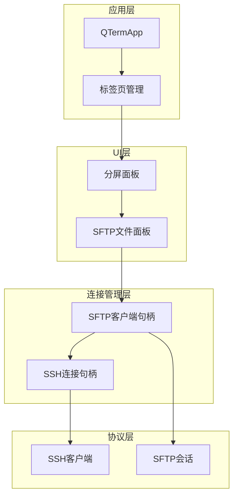

**图表来源**
- [app.rs:17-34](file://src/app.rs#L17-L34)
- [split_pane.rs:19-31](file://src/ui/split_pane.rs#L19-L31)
- [mod.rs:9-13](file://src/sftp/mod.rs#L9-L13)

**章节来源**
- [app.rs:1-100](file://src/app.rs#L1-L100)
- [split_pane.rs:1-50](file://src/ui/split_pane.rs#L1-L50)

## 核心组件

### SFTP文件面板主类

SftpPanel是文件面板的核心组件，负责管理双栏界面、文件列表渲染和用户交互：

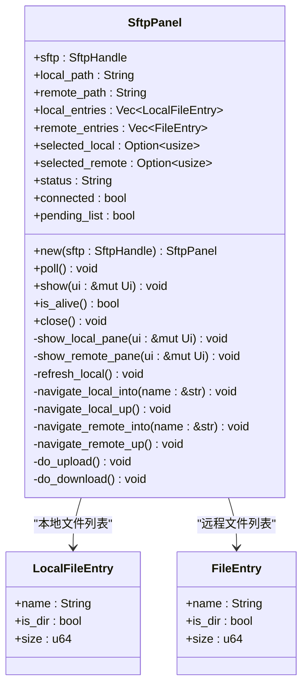

**图表来源**
- [sftp_panel.rs:14-25](file://src/ui/sftp_panel.rs#L14-L25)
- [sftp_panel.rs:6-10](file://src/ui/sftp_panel.rs#L6-L10)

### SFTP客户端句柄

SftpHandle提供了线程安全的SFTP操作接口，通过异步通道与后台任务通信：

```mermaid
classDiagram
class SftpHandle {
+events_rx : Receiver~SftpEvent~
+cmd_tx : Sender~SftpCommand~
+alive : AtomicBool
+new(ssh_handle : SharedSshHandle, rt : &Runtime) Result~Self~
+poll() Vec~SftpEvent~
+is_alive() bool
+list_dir(path : &str) void
+upload(local_path : String, remote_path : String) void
+download(remote_path : String, local_path : String) void
+mkdir(path : String) void
+delete(path : String, is_dir : bool) void
+disconnect() void
}
class SftpEvent {
<<enumeration>>
Connected
DirListing(Vec~FileEntry~)
UploadDone(Result~()~)
DownloadDone(Result~()~)
MkdirDone(Result~()~)
DeleteDone(Result~()~)
Error(String)
}
class SftpCommand {
<<enumeration>>
ListDir(String)
Upload { local_path : String, remote_path : String }
Download { remote_path : String, local_path : String }
Mkdir(String)
Delete { path : String, is_dir : bool }
Disconnect
}
SftpHandle --> SftpEvent : "事件通道"
SftpHandle --> SftpCommand : "命令通道"
```

**图表来源**
- [mod.rs:9-44](file://src/sftp/mod.rs#L9-L44)

**章节来源**
- [sftp_panel.rs:14-163](file://src/ui/sftp_panel.rs#L14-L163)
- [mod.rs:46-115](file://src/sftp/mod.rs#L46-L115)

## 架构概览

SFTP文件面板采用事件驱动的异步架构，通过多层抽象实现松耦合的设计：

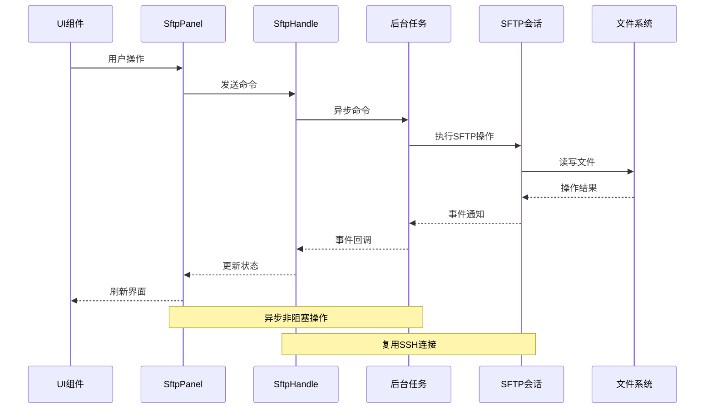

**图表来源**
- [sftp_panel.rs:52-110](file://src/ui/sftp_panel.rs#L52-L110)
- [mod.rs:119-167](file://src/sftp/mod.rs#L119-L167)

### 分屏集成架构

SFTP面板作为分屏布局的一部分，与其他面板类型共享相同的生命周期管理：

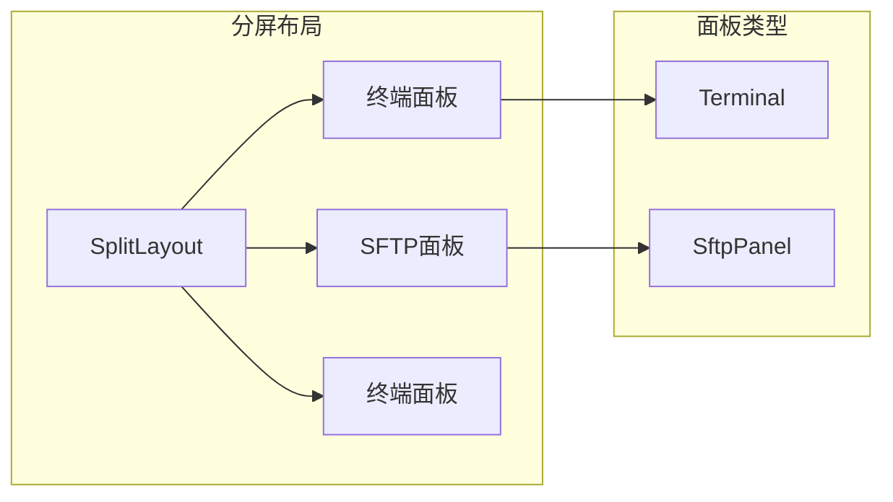

**图表来源**
- [split_pane.rs:19-31](file://src/ui/split_pane.rs#L19-L31)
- [split_pane.rs:60-68](file://src/ui/split_pane.rs#L60-L68)

**章节来源**
- [split_pane.rs:151-238](file://src/ui/split_pane.rs#L151-L238)
- [tab_item.rs:1-48](file://src/tab/tab_item.rs#L1-L48)

## 详细组件分析

### 文件列表渲染系统

文件列表渲染采用简洁的文本显示方式，支持目录和文件的区分显示：

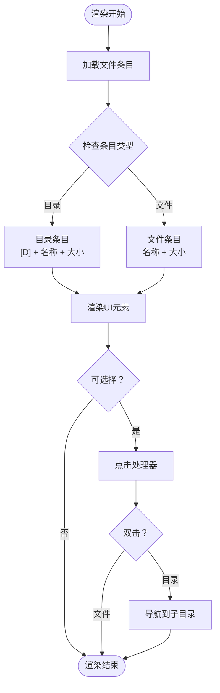

**图表来源**
- [sftp_panel.rs:181-201](file://src/ui/sftp_panel.rs#L181-L201)
- [sftp_panel.rs:225-245](file://src/ui/sftp_panel.rs#L225-L245)

#### 本地文件系统处理

本地文件列表通过标准库的文件系统API实现，支持隐藏文件过滤和排序：

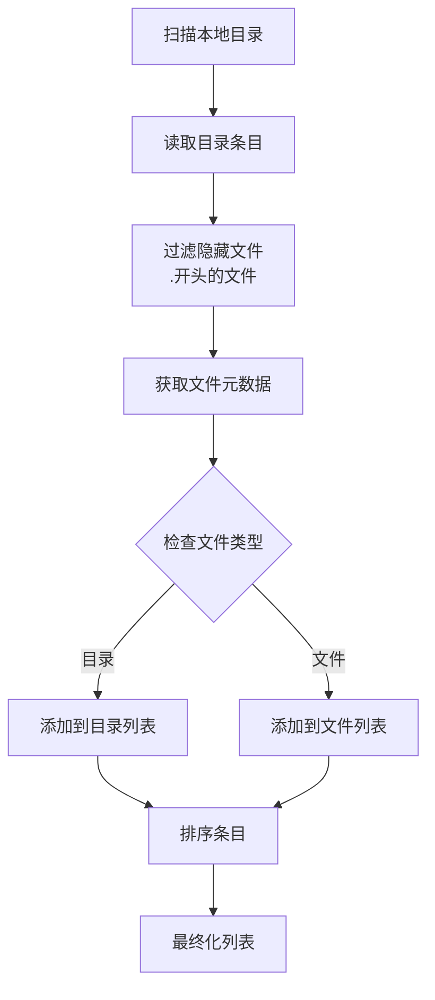

**图表来源**
- [sftp_panel.rs:249-273](file://src/ui/sftp_panel.rs#L249-L273)

**章节来源**
- [sftp_panel.rs:164-273](file://src/ui/sftp_panel.rs#L164-L273)

### 文件操作功能

#### 上传操作流程

上传功能实现了从本地到远程的安全文件传输：

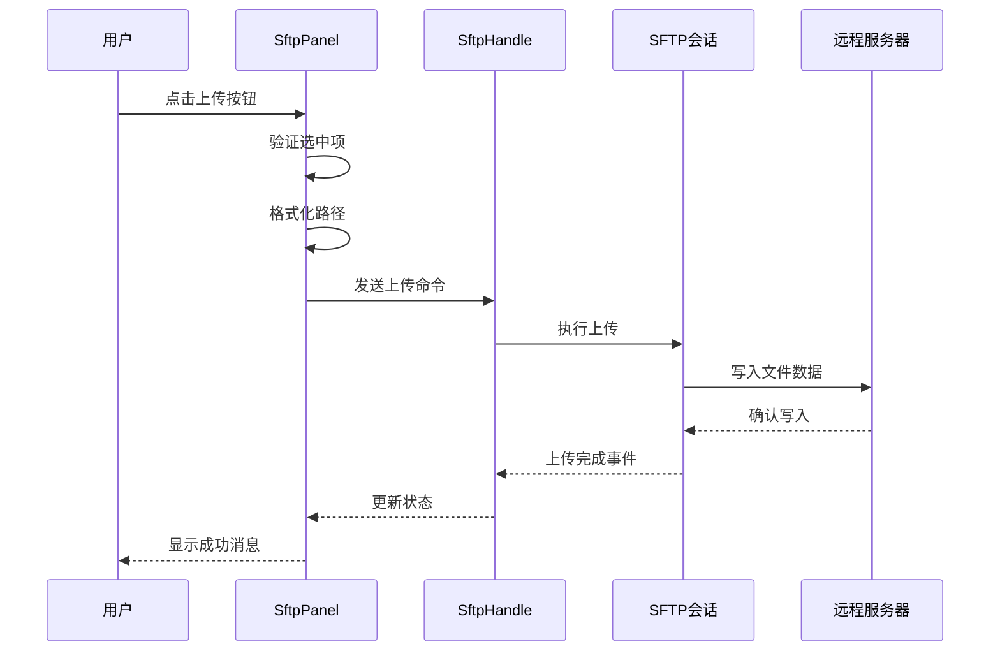

**图表来源**
- [sftp_panel.rs:327-340](file://src/ui/sftp_panel.rs#L327-L340)
- [mod.rs:198-208](file://src/sftp/mod.rs#L198-L208)

#### 下载操作流程

下载功能支持从远程服务器到本地的文件获取：

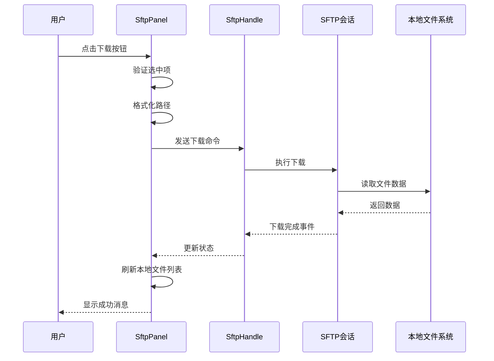

**图表来源**
- [sftp_panel.rs:342-356](file://src/ui/sftp_panel.rs#L342-L356)
- [mod.rs:209-219](file://src/sftp/mod.rs#L209-L219)

**章节来源**
- [sftp_panel.rs:326-357](file://src/ui/sftp_panel.rs#L326-L357)
- [mod.rs:198-238](file://src/sftp/mod.rs#L198-L238)

### 用户交互设计

#### 键盘导航支持

应用提供了全面的键盘快捷键支持，包括：

- **Ctrl+Shift+H**: 水平分屏
- **Ctrl+Shift+V**: 垂直分屏  
- **Ctrl+Shift+W**: 关闭面板
- **Ctrl+Shift+N**: 打开SSH对话框
- **Ctrl+Shift+F**: 打开SFTP面板
- **Ctrl+方向键**: 切换面板
- **Ctrl+T**: 新建标签页
- **Ctrl+W**: 关闭标签页
- **Ctrl+Tab**: 切换标签页

#### 面板集成

SFTP面板可以作为分屏布局的一部分与其他面板类型共存：

```mermaid
classDiagram
class SplitLayout {
+panes : Vec~ChildPane~
+direction : SplitDirection
+active_pane : usize
+add_sftp_pane(sftp : SftpHandle, direction : SplitDirection) Result
+remove_pane(idx : usize) void
}
class ChildPane {
+id : String
+kind : PaneKind
+alive : bool
+poll() void
+close() void
}
class PaneKind {
<<enumeration>>
Terminal { terminal : Terminal, backend : PaneBackend }
Sftp { panel : SftpPanel }
}
SplitLayout --> ChildPane : "管理面板"
ChildPane --> PaneKind : "包含类型"
```

**图表来源**
- [split_pane.rs:151-238](file://src/ui/split_pane.rs#L151-L238)
- [split_pane.rs:25-31](file://src/ui/split_pane.rs#L25-L31)

**章节来源**
- [app.rs:254-382](file://src/app.rs#L254-L382)
- [split_pane.rs:200-221](file://src/ui/split_pane.rs#L200-L221)

### 面板定制指南

#### 扩展文件操作功能

要扩展SFTP面板的功能，可以按照以下步骤进行：

1. **添加新的SFTP命令**:
   ```rust
   // 在mod.rs中添加新的命令类型
   enum SftpCommand {
       // ... 现有命令
       Rename { from: String, to: String }
   }
   ```

2. **实现命令处理逻辑**:
   ```rust
   // 在handle_command函数中添加处理逻辑
   SftpCommand::Rename { from, to } => {
       let result = sftp.rename(&from, &to)
           .await
           .map_err(|e| format!("重命名失败: {}", e));
       let _ = events_tx.send(SftpEvent::RenameDone(result));
   }
   ```

3. **更新UI组件**:
   ```rust
   // 在SftpPanel中添加相应的UI操作
   fn do_rename(&mut self) {
       // 实现重命名逻辑
   }
   ```

#### 自定义显示样式

可以通过修改以下方面来自定义面板外观：

1. **颜色主题定制**:
   ```rust
   // 在主题系统中定义新的颜色变量
   struct Theme {
       sftp_panel_bg: Color32,
       sftp_panel_border: Color32,
       sftp_selected_row: Color32,
   }
   ```

2. **字体和排版调整**:
   ```rust
   // 在egui中配置字体样式
   let mut style = egui::Style::default();
   style.visuals.override_text_color = Some(Color32::from_rgb(200, 200, 200));
   ```

3. **图标和视觉元素**:
   ```rust
   // 添加自定义图标支持
   let folder_icon = RichText::new("📁").size(16.0);
   let file_icon = RichText::new("📄").size(16.0);
   ```

**章节来源**
- [2026-05-30-phase3-sftp-design.md:90-116](file://docs/specs/2026-05-30-phase3-sftp-design.md#L90-L116)

## 依赖关系分析

### 外部依赖

项目使用了现代化的Rust生态系统组件：

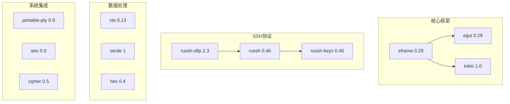

**图表来源**
- [Cargo.toml:8-25](file://Cargo.toml#L8-L25)

### 内部模块依赖

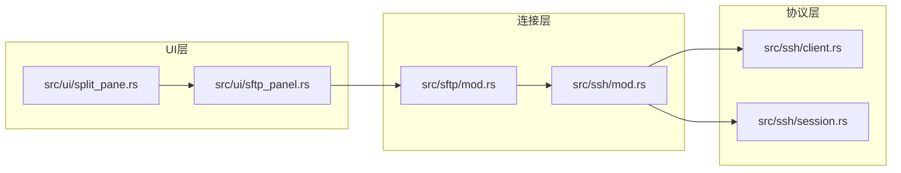

**图表来源**
- [sftp_panel.rs:1-3](file://src/ui/sftp_panel.rs#L1-L3)
- [mod.rs:1-5](file://src/sftp/mod.rs#L1-L5)

**章节来源**
- [Cargo.toml:1-30](file://Cargo.toml#L1-L30)

## 性能考虑

### 异步架构优势

SFTP文件面板采用了完全异步的架构设计，具有以下性能特点：

1. **非阻塞I/O操作**: 所有文件传输操作都在Tokio运行时中异步执行
2. **事件驱动更新**: 通过事件通道实现UI的增量更新
3. **连接复用**: 复用现有的SSH连接，避免额外的网络开销
4. **内存效率**: 使用智能指针和RAII原则管理资源生命周期

### 内存管理策略

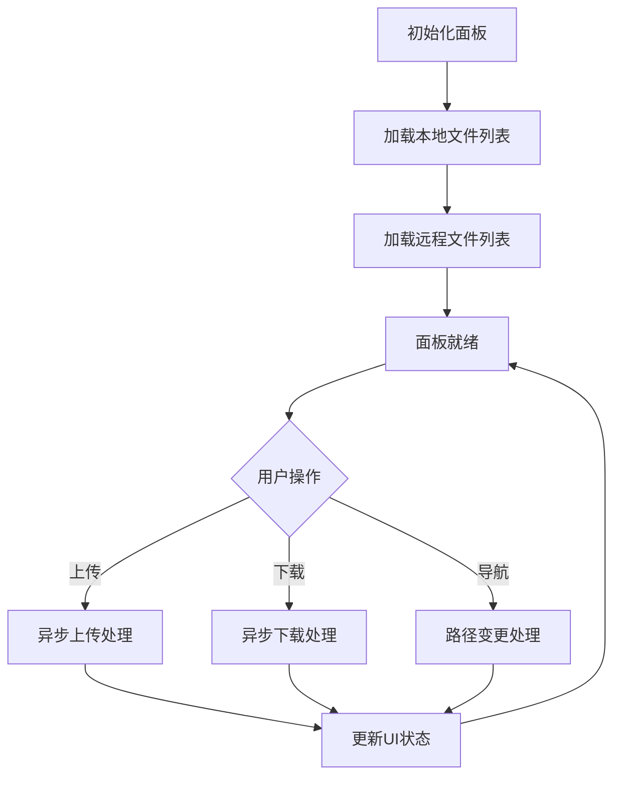

**图表来源**
- [sftp_panel.rs:52-110](file://src/ui/sftp_panel.rs#L52-L110)

### 并发控制

系统通过以下机制控制并发访问：

1. **原子布尔标志**: 使用AtomicBool跟踪连接状态
2. **通道通信**: 通过mpsc和tokio::sync::mpsc实现线程安全通信
3. **互斥锁保护**: 使用Arc<Mutex>保护共享资源
4. **生命周期管理**: 通过Drop trait确保资源正确释放

## 故障排除指南

### 常见问题诊断

#### 连接问题

**症状**: 面板显示"正在连接..."但无法建立SFTP会话

**可能原因**:
1. SSH连接失败
2. SFTP子系统请求失败
3. SFTP会话初始化失败

**解决方案**:
1. 检查SSH凭据配置
2. 验证目标服务器的SFTP服务状态
3. 查看详细的错误日志

#### 文件传输失败

**症状**: 上传或下载操作显示错误状态

**可能原因**:
1. 权限不足
2. 磁盘空间不足
3. 网络连接中断
4. 文件被占用

**解决方案**:
1. 检查目标路径的写入权限
2. 确保有足够的磁盘空间
3. 重新建立SSH连接
4. 关闭占用文件的程序

#### UI无响应

**症状**: 点击按钮无反应或界面卡顿

**可能原因**:
1. 后台任务阻塞
2. 事件通道溢出
3. UI渲染性能问题

**解决方案**:
1. 检查后台任务的执行状态
2. 增加事件通道的缓冲区大小
3. 优化UI渲染逻辑

**章节来源**
- [mod.rs:119-167](file://src/sftp/mod.rs#L119-L167)
- [sftp_panel.rs:102-108](file://src/ui/sftp_panel.rs#L102-L108)

## 结论

QTerm SFTP文件面板是一个设计精良的文件传输组件，具有以下显著特点：

1. **架构清晰**: 采用分层架构，职责分离明确
2. **性能优秀**: 异步非阻塞设计，充分利用现代Rust特性
3. **用户体验良好**: 提供直观的双栏界面和丰富的键盘快捷键
4. **扩展性强**: 模块化设计便于功能扩展和定制

该组件成功地将复杂的SFTP协议封装为易用的UI组件，为用户提供了高效便捷的文件传输体验。通过合理的错误处理和状态管理，确保了系统的稳定性和可靠性。

## 附录

### API参考

#### SftpPanel公共方法

| 方法名 | 参数 | 返回值 | 功能描述 |
|--------|------|--------|----------|
| new | sftp: SftpHandle | SftpPanel | 创建新的SFTP面板实例 |
| poll | 无 | void | 轮询SFTP事件并更新状态 |
| show | ui: &mut Ui | void | 显示面板UI |
| is_alive | 无 | bool | 检查面板是否存活 |
| close | 无 | void | 关闭SFTP连接 |

#### SftpHandle公共方法

| 方法名 | 参数 | 返回值 | 功能描述 |
|--------|------|--------|----------|
| new | ssh_handle: SharedSshHandle, rt: &Runtime | Result<Self> | 创建SFTP客户端句柄 |
| poll | 无 | Vec<SftpEvent> | 轮询可用事件 |
| list_dir | path: &str | void | 请求列出目录 |
| upload | local_path: String, remote_path: String | void | 请求上传文件 |
| download | remote_path: String, local_path: String | void | 请求下载文件 |
| mkdir | path: String | void | 请求创建目录 |
| delete | path: String, is_dir: bool | void | 请求删除文件 |
| disconnect | 无 | void | 断开SFTP连接 |

### 配置选项

#### SSH配置参数

| 参数名 | 类型 | 默认值 | 描述 |
|--------|------|--------|------|
| host | String | "" | 远程主机地址 |
| port | u16 | 22 | SSH端口号 |
| username | String | "" | 用户名 |
| auth | SshAuth | Password("") | 认证方式 |
| timeout_secs | u32 | 30 | 连接超时时间 |

#### SFTP面板配置

| 参数名 | 类型 | 默认值 | 描述 |
|--------|------|--------|------|
| local_path | String | 用户主目录 | 本地文件根路径 |
| remote_path | String | "/" | 远程文件根路径 |
| status | String | "正在连接..." | 当前面板状态 |
| connected | bool | false | 连接状态标志 |