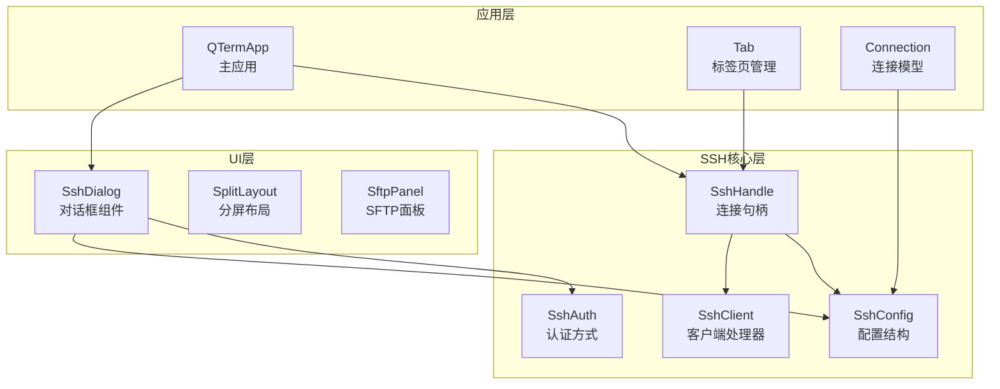
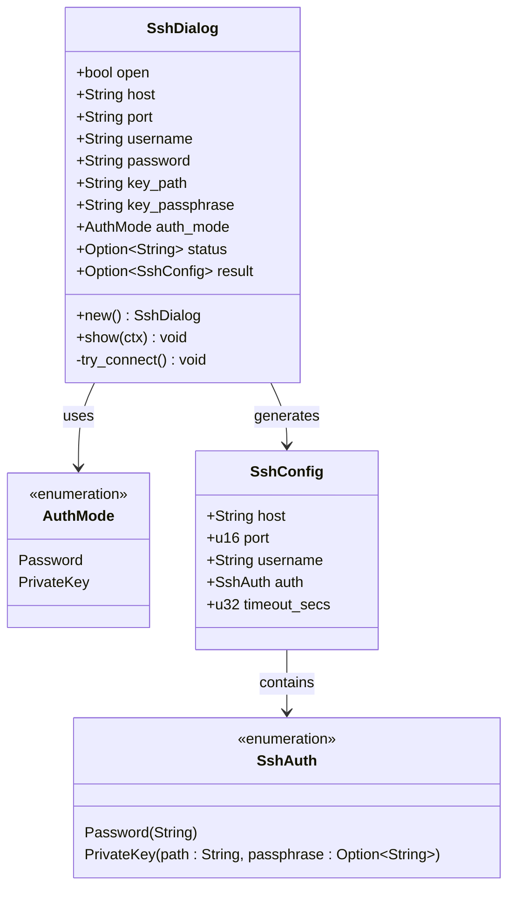
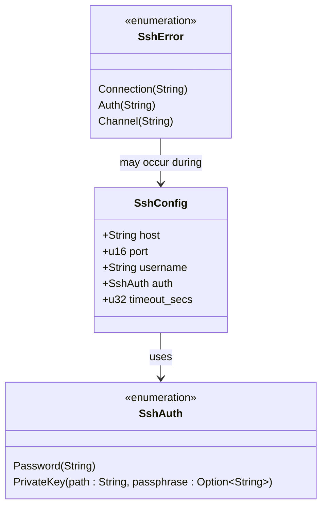
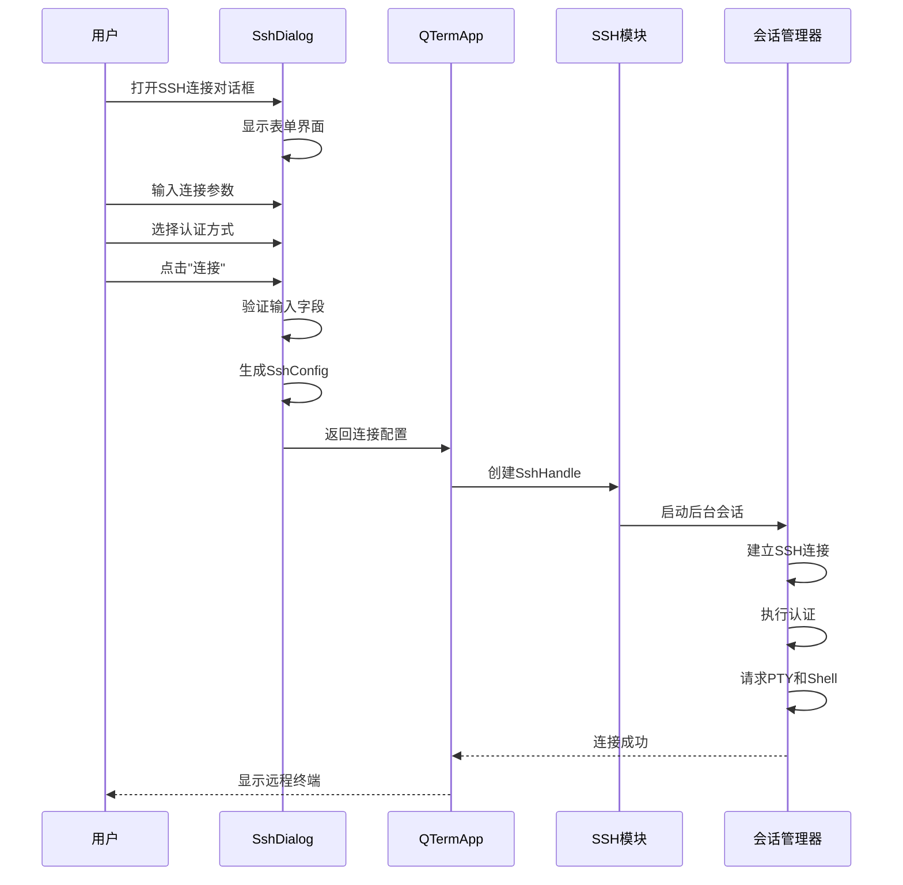
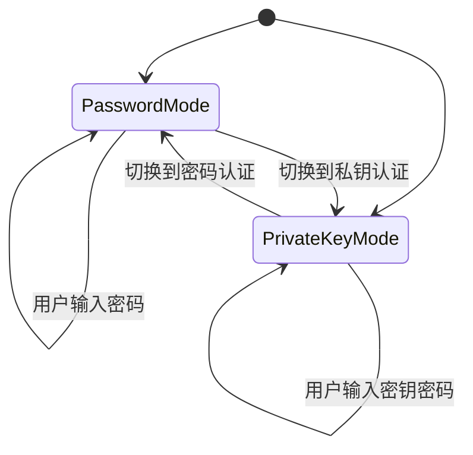
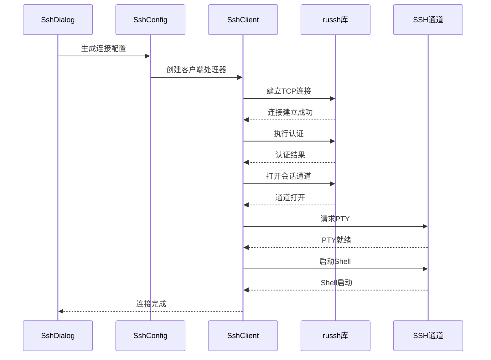
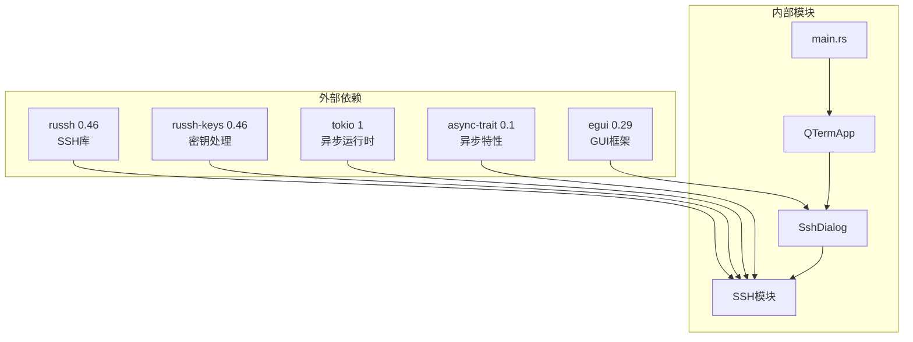

# SSH连接对话框

<cite>
**本文档引用的文件**
- [ssh_dialog.rs](file://src/ui/ssh_dialog.rs)
- [mod.rs](file://src/ssh/mod.rs)
- [client.rs](file://src/ssh/client.rs)
- [session.rs](file://src/ssh/session.rs)
- [app.rs](file://src/app.rs)
- [main.rs](file://src/main.rs)
- [2026-05-30-phase2-ssh-split-design.md](file://docs/specs/2026-05-30-phase2-ssh-split-design.md)
- [Cargo.toml](file://Cargo.toml)
</cite>

## 目录
1. [简介](#简介)
2. [项目结构](#项目结构)
3. [核心组件](#核心组件)
4. [架构概览](#架构概览)
5. [详细组件分析](#详细组件分析)
6. [依赖关系分析](#依赖关系分析)
7. [性能考虑](#性能考虑)
8. [故障排除指南](#故障排除指南)
9. [结论](#结论)
10. [附录](#附录)

## 简介

QTerm的SSH连接对话框系统是一个基于egui框架构建的现代化用户界面组件，专门用于收集和验证SSH连接配置信息。该系统提供了直观的表单界面，支持密码认证和私钥认证两种主要认证方式，并集成了完整的错误处理和状态反馈机制。

该对话框系统是QTerm终端模拟器的重要组成部分，它允许用户通过简单的图形界面建立SSH连接，而无需复杂的命令行操作。系统设计注重用户体验，提供了清晰的输入验证、实时的状态反馈和灵活的认证选项。

## 项目结构

SSH连接对话框系统位于QTerm项目的UI层，采用模块化设计，与其他核心组件保持松耦合的关系。



**图表来源**
- [ssh_dialog.rs:1-147](file://src/ui/ssh_dialog.rs#L1-L147)
- [mod.rs:18-66](file://src/ssh/mod.rs#L18-L66)
- [app.rs:17-34](file://src/app.rs#L17-L34)

**章节来源**
- [ssh_dialog.rs:1-147](file://src/ui/ssh_dialog.rs#L1-L147)
- [mod.rs:1-136](file://src/ssh/mod.rs#L1-L136)
- [app.rs:1-800](file://src/app.rs#L1-L800)

## 核心组件

SSH连接对话框系统由多个精心设计的组件构成，每个组件都有明确的职责和边界。

### SshDialog - 对话框核心组件

SshDialog是整个SSH连接对话框系统的中心组件，负责管理用户界面状态、表单验证和连接配置生成。



**图表来源**
- [ssh_dialog.rs:13-24](file://src/ui/ssh_dialog.rs#L13-L24)
- [ssh_dialog.rs:5-9](file://src/ui/ssh_dialog.rs#L5-L9)
- [mod.rs:19-33](file://src/ssh/mod.rs#L19-L33)

### SSH配置模型

SSH系统使用强类型的配置模型来确保数据完整性和类型安全。



**图表来源**
- [mod.rs:19-53](file://src/ssh/mod.rs#L19-L53)

**章节来源**
- [ssh_dialog.rs:26-41](file://src/ui/ssh_dialog.rs#L26-L41)
- [mod.rs:18-53](file://src/ssh/mod.rs#L18-L53)

## 架构概览

SSH连接对话框系统采用分层架构设计，确保了良好的关注点分离和可维护性。



**图表来源**
- [ssh_dialog.rs:117-146](file://src/ui/ssh_dialog.rs#L117-L146)
- [app.rs:544-551](file://src/app.rs#L544-L551)
- [session.rs:11-90](file://src/ssh/session.rs#L11-L90)

## 详细组件分析

### 表单设计与验证机制

SSH连接对话框采用了简洁而高效的表单设计，通过网格布局确保用户界面的一致性和易用性。

#### 表单字段布局

对话框包含以下核心表单字段：

1. **基本连接信息**：
   - 主机地址（必填）
   - 端口号（默认22）
   - 用户名（必填）

2. **认证方式选择**：
   - 密码认证模式
   - 私钥认证模式

3. **认证详细信息**：
   - 密码输入（密码模式）
   - 私钥文件路径
   - 私钥密码（可选）

#### 输入验证策略

系统实现了多层次的输入验证机制：

```mermaid
flowchart TD
Start([用户点击"连接"]) --> ValidateBasic["验证必填字段"]
ValidateBasic --> BasicValid{"主机和用户名有效?"}
BasicValid --> |否| ShowError["显示错误信息"]
BasicValid --> |是| CheckAuth["检查认证模式"]
CheckAuth --> AuthType{"认证类型?"}
AuthType --> |密码| ValidatePassword["验证密码"]
AuthType --> |私钥| ValidateKey["验证密钥文件"]
ValidatePassword --> PasswordValid{"密码有效?"}
ValidateKey --> KeyValid{"密钥文件有效?"}
PasswordValid --> |否| ShowError
KeyValid --> |否| ShowError
PasswordValid --> |是| GenerateConfig["生成SshConfig"]
KeyValid --> |是| GenerateConfig
ShowError --> End([结束])
GenerateConfig --> Success([连接配置生成])
Success --> End
```

**图表来源**
- [ssh_dialog.rs:117-146](file://src/ui/ssh_dialog.rs#L117-L146)

**章节来源**
- [ssh_dialog.rs:54-112](file://src/ui/ssh_dialog.rs#L54-L112)

### 认证界面实现

SSH连接对话框支持两种主要的认证方式，每种方式都有相应的界面元素和验证逻辑。

#### 密码认证界面

密码认证是最简单直接的认证方式，界面包含密码输入字段和相应的安全措施。

#### 私钥认证界面

私钥认证提供了更高的安全性，但需要用户提供相应的密钥文件和可能的密码短语。



**图表来源**
- [ssh_dialog.rs:77-94](file://src/ui/ssh_dialog.rs#L77-L94)

**章节来源**
- [ssh_dialog.rs:76-94](file://src/ui/ssh_dialog.rs#L76-L94)

### 连接建立过程

SSH连接的建立涉及多个步骤，从基础的网络连接到最终的终端会话建立。

#### 连接建立序列



**图表来源**
- [client.rs:25-63](file://src/ssh/client.rs#L25-L63)
- [session.rs:21-46](file://src/ssh/session.rs#L21-L46)

**章节来源**
- [client.rs:25-63](file://src/ssh/client.rs#L25-L63)
- [session.rs:11-90](file://src/ssh/session.rs#L11-L90)

### 错误处理与状态反馈

系统实现了完善的错误处理机制，确保用户能够及时了解连接状态和问题所在。

#### 错误类型分类

SSH系统定义了三种主要的错误类型：

1. **连接错误**：网络连接失败、超时等问题
2. **认证错误**：用户名密码错误、密钥认证失败等
3. **通道错误**：会话通道建立或维护失败

#### 状态反馈机制

对话框提供了实时的状态反馈，包括错误信息的显示和连接进度的指示。

**章节来源**
- [mod.rs:35-53](file://src/ssh/mod.rs#L35-L53)
- [ssh_dialog.rs:96-99](file://src/ui/ssh_dialog.rs#L96-L99)

## 依赖关系分析

SSH连接对话框系统依赖于多个外部库和内部模块，形成了一个完整的生态系统。



**图表来源**
- [Cargo.toml:8-25](file://Cargo.toml#L8-L25)
- [ssh_dialog.rs:1-2](file://src/ui/ssh_dialog.rs#L1-L2)

**章节来源**
- [Cargo.toml:8-25](file://Cargo.toml#L8-L25)
- [main.rs:49-87](file://src/main.rs#L49-L87)

### 核心依赖分析

系统的关键依赖包括：

1. **egui框架**：提供跨平台的GUI界面
2. **russh库**：实现SSH协议的纯Rust实现
3. **tokio运行时**：提供异步I/O支持
4. **russh-keys**：处理SSH密钥的加载和验证

这些依赖的选择体现了系统对性能、安全性和可移植性的综合考虑。

**章节来源**
- [2026-05-30-phase2-ssh-split-design.md:16-23](file://docs/specs/2026-05-30-phase2-ssh-split-design.md#L16-L23)

## 性能考虑

SSH连接对话框系统在设计时充分考虑了性能优化，特别是在资源使用和响应速度方面。

### 异步架构优势

系统采用异步架构设计，避免了阻塞操作对用户界面的影响：

1. **非阻塞连接**：SSH连接在后台线程中建立，不会冻结UI
2. **事件驱动**：基于tokio的事件循环，高效处理I/O操作
3. **内存优化**：合理的内存分配策略，避免不必要的数据复制

### 资源管理

系统实现了精细的资源管理机制：

1. **连接池**：共享的tokio运行时，减少资源开销
2. **句柄管理**：智能的连接句柄生命周期管理
3. **内存回收**：及时释放不再使用的资源

## 故障排除指南

### 常见问题诊断

#### 连接失败问题

当遇到SSH连接失败时，可以按照以下步骤进行诊断：

1. **网络连通性检查**：确认主机可达性和端口开放
2. **认证信息验证**：检查用户名、密码或密钥文件的有效性
3. **防火墙配置**：确保SSH服务端口未被防火墙阻止

#### 认证错误排查

针对不同类型的认证错误，系统提供了相应的错误信息：

1. **密码认证失败**：检查密码拼写和账户状态
2. **密钥认证失败**：验证密钥文件格式和权限设置
3. **密钥密码错误**：确认私钥密码的正确性

**章节来源**
- [mod.rs:35-53](file://src/ssh/mod.rs#L35-L53)

### 调试技巧

1. **启用详细日志**：通过修改日志级别获取更多调试信息
2. **网络监控**：使用网络工具检查连接状态
3. **系统资源监控**：观察内存和CPU使用情况

## 结论

QTerm的SSH连接对话框系统展现了现代GUI应用程序设计的最佳实践。通过精心设计的架构、完善的错误处理机制和优秀的用户体验，该系统成功地将复杂的SSH连接过程简化为直观的图形界面操作。

系统的主要优势包括：

1. **用户友好**：简洁直观的界面设计，降低使用门槛
2. **功能完整**：支持主流的SSH认证方式和连接配置
3. **性能优秀**：异步架构确保流畅的用户体验
4. **可扩展性强**：模块化设计便于功能扩展和维护

未来的发展方向包括增强双因子认证支持、改进连接管理和添加更多高级配置选项。

## 附录

### 对话框扩展指南

要为SSH连接对话框添加新的连接类型或自定义配置选项，可以遵循以下步骤：

#### 添加新的认证方式

1. **扩展SshAuth枚举**：添加新的认证类型定义
2. **更新对话框界面**：添加相应的输入字段和验证逻辑
3. **实现认证处理**：在客户端模块中添加对应的认证实现
4. **集成到配置生成**：更新配置生成逻辑以支持新类型

#### 自定义连接参数

1. **扩展SshConfig结构**：添加新的配置字段
2. **更新表单界面**：添加相应的UI元素
3. **实现数据验证**：添加输入验证规则
4. **集成到连接流程**：确保新参数参与连接建立过程

#### 最佳实践建议

1. **保持向后兼容**：新增功能时确保不影响现有配置
2. **完善错误处理**：为新功能提供清晰的错误信息
3. **优化用户体验**：确保新功能的界面设计符合整体风格
4. **充分测试**：对新功能进行全面的功能和回归测试

**章节来源**
- [ssh_dialog.rs:125-135](file://src/ui/ssh_dialog.rs#L125-L135)
- [mod.rs:29-33](file://src/ssh/mod.rs#L29-L33)